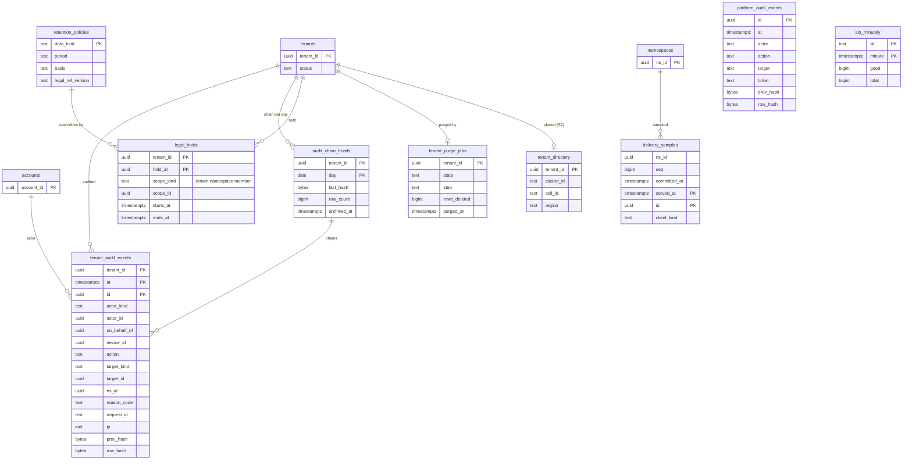

# Data model: 監査・保持・消去・SLI の記録

[data-model.md](../data-model.md) の一部。規約はそちらの 3 節に従う。振る舞いは [security.md](../security.md)（7・8 節）、[observability.md](../observability.md) の 3 節、[infrastructure.md](../infrastructure.md) の 8 節を正とする。決定は [ADR-0045](../../decisions/0045-audit-log-and-data-lifecycle.md)、[ADR-0049](../../decisions/0049-stage-up-criteria-sharding-and-cells.md)、[ADR-0050](../../decisions/0050-sli-from-ledgers-synthetics-and-client-telemetry.md)。照合の記録 `integrity_audit_runs` は [blocks-and-storage.md](blocks-and-storage.md) の 2.10 節、`platform_state` は [journal-and-cursors.md](journal-and-cursors.md) の 2.5 節。ファイルの活動の事象（Firehose → S3）は [stores.md](stores.md) の 1 節。

| 表 | 置き場所 | 書く |
| --- | --- | --- |
| `tenant_audit_events` | テナントの表、月の分割 | `audit_writer`（操作と同じトランザクション） |
| `platform_audit_events`・`audit_chain_heads` | `maint` | `maint`・`auditor` の Worker |
| `retention_policies` | `public`、RLS の外 | `migrator`（設定の値。法務の結論のバージョンつき） |
| `legal_holds` | テナントの表 | 法務の手順（L6 の後） |
| `tenant_purge_jobs` | `maint` | `purge` |
| `delivery_samples`・`slo_minutely` | `maint` | `api`・`slo` |
| `tenant_directory` | `maint`（S2 からディレクトリのクラスタ） | 保守のワークフロー |

## 1. ER 図

- `maint` の表からテナントの表・`auth` への関係は論理の参照（外部キーを張らない）。

## 2. 表

### 2.1 `tenant_audit_events`

管理と安全の事象（[ADR-0045](../../decisions/0045-audit-log-and-data-lifecycle.md)、[security.md](../security.md) の 7 節）。**ファイルの名前・パス・中身を持たない。** 画面と書き出しで、`can()` で許した範囲の名前をその時に引く。

| 列 | 型 | NULL | 既定 | 説明 |
| --- | --- | --- | --- | --- |
| `tenant_id` | `uuid` | NOT NULL | — | |
| `at` | `timestamptz` | NOT NULL | `now()` | 分割の鍵 |
| `id` | `uuid` | NOT NULL | `uuidv7()` | |
| `actor_kind` | `text` | NOT NULL | — | `user`・`admin`・`system`・`scim`・`app` |
| `actor_id` | `uuid` | NULL | — | `account_id`・`app_id` |
| `on_behalf_of` | `uuid` | NULL | — | 管理者のアクセスの対象（[ADR-0043](../../decisions/0043-admin-roles-device-wipe-and-member-access.md)） |
| `device_id` | `uuid` | NULL | — | |
| `action` | `text` | NOT NULL | — | `login`・`device_register`・`device_unlink`・`device_wipe`・`share_*`・`link_*`・`policy_change`・`admin_role_*`・`sso_*`・`scim_*`・`admin_access_grant`・`admin_access_read`・`mass_change_alert`・`rewind`・`permanent_delete`・`app_grant`・`webhook_*`・`export` など |
| `target_kind` | `text` | NULL | — | `namespace`・`node`・`link`・`member`・`device`・`app`・`policy` |
| `target_id` | `uuid` | NULL | — | |
| `ns_id` | `uuid` | NULL | — | |
| `reason_code` | `text` | NULL | — | |
| `params` | `jsonb` | NOT NULL | `'{}'` | 数・ID・理由のコードだけ（Zod で形を検証） |
| `request_id` | `text` | NULL | — | |
| `ip` | `inet` | NULL | — | **L3 の確認待ち** |
| `prev_hash` | `bytea` | NOT NULL | — | 同じテナント・同じ日の前の行の `row_hash`（日の最初は前の日の値） |
| `row_hash` | `bytea` | NOT NULL | — | `SHA-256(prev_hash ‖ 正規化した行)` |

- キー：PK `(tenant_id, at, id)`。
- 索引：`(tenant_id, at)`（PK の前の部分）— 監査の画面（新しい順）、書き出し。`(tenant_id, actor_id, at)` — 人ごとの絞り込み。`(tenant_id, action, at)` — 種類の絞り込み。
- 連鎖：テナントと日ごとに直列にする（`pg_advisory_xact_lock(hash(tenant_id, day))` の下で前の行を読む）。日の終わりの値を `audit_chain_heads` に書き、S3 の `audit`（Object Lock）へ写す。
- トリガー：`UPDATE`・`DELETE` を拒む（分割の `DROP` だけ）。
- 書けなければ操作も失敗させる（同じトランザクション）。
- RLS：テナント。読むのは本人（個人のテナント）、チームの `team_admin`・`auditor`。
- 分割：`at` の月。保持：1 年（Aurora）。S3 の写しは 1 年（Object Lock。**L3・L6 の確認待ち**）。
- S1 の量：1 日 約 100 万行、1 年で 約 3.6 億行（初期見積もり）。

### 2.2 `maint.platform_audit_events`

プラットフォームの事象：運用者の JIT のアクセス、break-glass、データの直接の修正、`epoch` の更新、検査の構成（`content_scan_policy`）の変更、法的な保全、テナントの消去の事実。

| 列 | 型 | NULL | 既定 | 説明 |
| --- | --- | --- | --- | --- |
| `id` | `uuid` | NOT NULL | `uuidv7()` | |
| `at` | `timestamptz` | NOT NULL | `now()` | |
| `actor` | `text` | NOT NULL | — | 運用の人の ID かワークフローの名前 |
| `action` | `text` | NOT NULL | — | `jit_access`・`break_glass`・`data_fix`・`epoch_bump`・`scan_policy_change`・`legal_hold`・`tenant_purged` など |
| `target` | `text` | NULL | — | テナントの ID などの ID だけ |
| `ticket` | `text` | NOT NULL | — | 承認の記録の ID |
| `params` | `jsonb` | NOT NULL | `'{}'` | 数・ID |
| `prev_hash`・`row_hash` | `bytea` | NOT NULL | — | 全体で 1 本の連鎖 |

- キー：PK `id`。索引：`(at)`、`(action, at)`。
- トリガー：`UPDATE`・`DELETE` を拒む。
- 保持：S3 `audit` の写し（Object Lock）と同じ。Aurora は 1 年（L3・L6）。S1 の量：1 日 数百行。

### 2.3 `maint.audit_chain_heads`

テナントと日ごとの連鎖の最後の値。

| 列 | 型 | NULL | 既定 | 説明 |
| --- | --- | --- | --- | --- |
| `tenant_id` | `uuid` | NOT NULL | — | `platform_audit_events` は全 0 の UUID |
| `day` | `date` | NOT NULL | — | 日本時間の日 |
| `last_hash` | `bytea` | NOT NULL | — | |
| `row_count` | `bigint` | NOT NULL | — | 照合（事象の欠け） |
| `archived_at` | `timestamptz` | NULL | — | S3 の Object Lock へ写した時刻 |
| `verified_at` | `timestamptz` | NULL | — | 毎日の確かめ |

- キー：PK `(tenant_id, day)`。索引：`(day) WHERE archived_at IS NULL`。
- 保持：監査ログと同じ。S1 の量：事象のあったテナントと日の数（1 年で 数千万行）。

### 2.4 `retention_policies`

データの種類 → 保持の期間（[security.md](../security.md) の 8.1 節。値の正本）。CI が Terraform の S3 のライフサイクルと比べる。

| 列 | 型 | NULL | 既定 | 説明 |
| --- | --- | --- | --- | --- |
| `data_kind` | `text` | NOT NULL | — | `ns_journal`・`old_revisions`・`deleted_nodes`・`orphaned_blocks`・`incoming`・`previews`・`tenant_audit_events`・`activity_events`・`device_last_ip`・`link_access_events`・`notification_events`・`camera_upload_index`・`webhook_deliveries` など |
| `period` | `interval` | NULL | — | NULL は「消さない（法務の確認待ち）」 |
| `basis` | `text` | NOT NULL | — | 根拠（ADR・法令の条項・法務の結論） |
| `legal_ref_version` | `text` | NULL | — | 法務の結論のバージョン（L3・L6・L8） |
| `updated_at` | `timestamptz` | NOT NULL | `now()` | |

- キー：PK `data_kind`。プランの保持の期間は `tenant_retention_settings`（名前がぶつかるので分けた）。
- RLS：なし。全ロールが読むだけ。S1 の量：数十行。

### 2.5 `legal_holds`

法的な保全（**法務の確認待ち：L6**。MVP に入れるかは L6）。`lifecycle`・`tenant-purge`・`block-gc`・完全な削除が、対象を飛ばす。

| 列 | 型 | NULL | 既定 | 説明 |
| --- | --- | --- | --- | --- |
| `tenant_id` | `uuid` | NOT NULL | — | |
| `hold_id` | `uuid` | NOT NULL | `uuidv7()` | |
| `scope_kind` | `text` | NOT NULL | — | `tenant`・`namespace`・`member` |
| `scope_id` | `uuid` | NOT NULL | — | |
| `starts_at` | `timestamptz` | NOT NULL | `now()` | |
| `ends_at` | `timestamptz` | NULL | — | NULL は解除まで |
| `case_ref` | `text` | NOT NULL | — | 法務の案件の ID |
| `created_by` | `text` | NOT NULL | — | |
| `released_at` | `timestamptz` | NULL | — | |

- キー：PK `(tenant_id, hold_id)`。索引：`(tenant_id, scope_kind, scope_id) WHERE released_at IS NULL` — 消す処理の確かめ（`is_held()`）。
- `block-gc` は、保全の対象の名前空間の参照を持つブロックを消さない（参照はリビジョンの消去を止めることで残る）。
- RLS：テナント。どのロールにも `DELETE` を与えない（解除は `released_at`）。S1 の量：0（L6 の結論まで）。

### 2.6 `maint.tenant_purge_jobs`

解約・アカウントの削除の消す処理の進み（[security.md](../security.md) の 8.2 節）。D-13。

| 列 | 型 | NULL | 既定 | 説明 |
| --- | --- | --- | --- | --- |
| `tenant_id` | `uuid` | NOT NULL | — | |
| `state` | `text` | NOT NULL | `'queued'` | `queued`・`running`・`paused`・`done` |
| `step` | `text` | NOT NULL | `'unmount_external'` | `unmount_external`・`delete_ns_tables`・`orphan_blocks`・`delete_tenant_tables`・`delete_auth`・`done` |
| `cursor` | `jsonb` | NULL | — | 再開の位置（表と主キー） |
| `rows_deleted` | `bigint` | NOT NULL | `0` | |
| `blocks_orphaned` | `bigint` | NOT NULL | `0` | |
| `started_at`・`purged_at` | `timestamptz` | NULL | — | |

- キー：PK `tenant_id`。
- 1 万行ずつ消す。`legal_holds` の対象があれば `paused`。消した事実を `platform_audit_events` に残す。
- 保持：消さない（テナントの ID と数だけ）。S1 の量：消したテナントの数。

### 2.7 `maint.delivery_samples`

伝播の SLI の母集団（[observability.md](../observability.md) の 3.1 節）。端末の ID を持たない。

| 列 | 型 | NULL | 既定 | 説明 |
| --- | --- | --- | --- | --- |
| `served_at` | `timestamptz` | NOT NULL | — | 分割の鍵 |
| `id` | `uuid` | NOT NULL | `uuidv7()` | |
| `ns_id` | `uuid` | NOT NULL | — | |
| `seq` | `bigint` | NOT NULL | — | |
| `committed_at` | `timestamptz` | NOT NULL | — | |
| `client_kind` | `text` | NOT NULL | — | `desktop`・`mobile`・`web`・`api` |

- キー：PK `(served_at, id)`。
- 書く：`api` の `list/continue` が、書いた端末と別の端末へ返した操作のうち、端末と名前空間の組ごとに最も古い 1 つ（WebSocket がつながっていた端末だけ）。
- 分割：`served_at` の日。保持：14 日。
- S1 の量：すべてを数えると 1 日 最大 約 8 億行。抜き取りの率は持ち越し（[data-model.md](../data-model.md) の 9 節）。

### 2.8 `maint.slo_minutely`

SLI ごとの 1 分の良いイベントと全数（[observability.md](../observability.md) の 3 節）。

| 列 | 型 | NULL | 既定 | 説明 |
| --- | --- | --- | --- | --- |
| `sli` | `text` | NOT NULL | — | `metadata_availability`・`upload_availability`・`download_availability`・`link_availability`・`propagation`・`journal_continuity` など |
| `minute` | `timestamptz` | NOT NULL | — | |
| `good` | `bigint` | NOT NULL | — | |
| `total` | `bigint` | NOT NULL | — | |
| `cluster_id` | `text` | NOT NULL | `'main'` | |

- キー：PK `(sli, minute, cluster_id)`。CHECK：`good <= total`。
- 保持：400 日（この文書で決めた）。S1 の量：約 2,000 万行。

### 2.9 `maint.tenant_directory`（S2）

テナント → クラスタ・セル・リージョン（[infrastructure.md](../infrastructure.md) の 8 節）。S1 は使わない。

| 列 | 型 | NULL | 既定 | 説明 |
| --- | --- | --- | --- | --- |
| `tenant_id` | `uuid` | NOT NULL | — | |
| `cluster_id` | `text` | NOT NULL | — | Aurora のクラスタ |
| `cell_id` | `text` | NULL | — | S3 のセル |
| `region` | `text` | NOT NULL | `'ap-northeast-1'` | |
| `moving` | `boolean` | NOT NULL | `false` | テナントの移し替えの間（移し方は S2 の前の ADR） |
| `updated_at` | `timestamptz` | NOT NULL | `now()` | |

- キー：PK `tenant_id`。索引：`(cluster_id)`。
- 置き場所：S2 からディレクトリのクラスタ。S1 の量：0。
