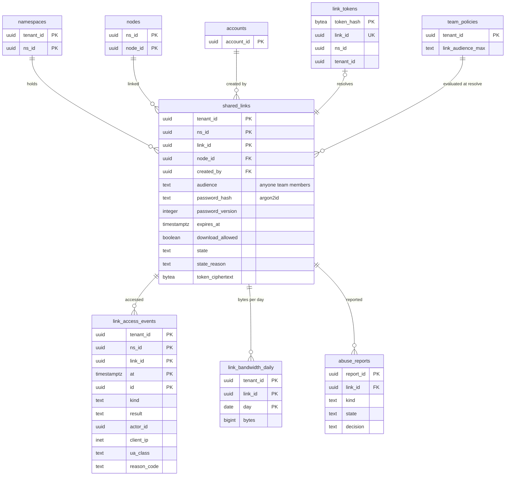

# Data model: 共有リンク

[data-model.md](../data-model.md) の一部。規約はそちらの 3 節に従う。振る舞いは [shared-links.md](../shared-links.md)（4〜10 節）を正とする。チームの方針の列は [tenants-accounts-and-teams.md](tenants-accounts-and-teams.md) の 2.15 節。決定は [ADR-0004](../../decisions/0004-tenancy-namespaces-and-rls.md)（X2）、[ADR-0027](../../decisions/0027-shared-link-model-and-resolution.md)、[ADR-0028](../../decisions/0028-shared-link-abuse-controls.md)、[ADR-0046](../../decisions/0046-content-scanning-framework.md)。トークンの形は [stores.md](stores.md) の 5 節。

| 表 | 置き場所 | 書く |
| --- | --- | --- |
| `shared_links` | 名前空間の表 | `api`（リンクの作成の関数。`link_tokens` と同じトランザクション）、方針の変更の Worker、`abuse_ops`（`suspended`・`removed`） |
| `link_tokens` | `public`、RLS の外 | 同上 |
| `link_access_events` | 名前空間の表、日の分割 | `activity` の Worker（outbox の `link_access` から） |
| `link_bandwidth_daily` | テナントの表 | `link`（Valkey の数を日次で写す） |
| `abuse_reports` | `public`、RLS の外 | `abuse_ops` |

## 1. ER 図

- `link_tokens`・`abuse_reports` から `shared_links` への関係は論理の参照（RLS の外の表から名前空間の表へ外部キーを張らない）。両者の食い違いは毎日突き合わせる（[shared-links.md](../shared-links.md) の 12 節）。

## 2. 表

### 2.1 `shared_links`

共有リンク（[ADR-0027](../../decisions/0027-shared-link-model-and-resolution.md)）。閲覧だけ。定義元：[shared-links.md](../shared-links.md) の 4.1・7 節。

| 列 | 型 | NULL | 既定 | 説明 |
| --- | --- | --- | --- | --- |
| `tenant_id` | `uuid` | NOT NULL | — | |
| `ns_id` | `uuid` | NOT NULL | — | ノードが別の名前空間へ移ったら使えない |
| `link_id` | `uuid` | NOT NULL | `uuidv7()` | |
| `node_id` | `uuid` | NOT NULL | — | ファイルかフォルダー（ID で指すので移動・名前の変更で切れない） |
| `created_by` | `uuid` | NOT NULL | — | `account_id` |
| `audience` | `text` | NOT NULL | — | `anyone`・`team`・`members` |
| `password_hash` | `text` | NULL | — | Argon2id（メモリー 64 MiB、3 回、並列 1）の文字列 |
| `password_version` | `integer` | NOT NULL | `0` | パスワードを変えるたびに上げる（`lk_<link_id>` の Cookie） |
| `expires_at` | `timestamptz` | NULL | — | 1 時間〜方針の上限 |
| `download_allowed` | `boolean` | NOT NULL | `true` | |
| `state` | `text` | NOT NULL | `'active'` | `active`・`expired`・`revoked`・`disabled_by_policy`・`suspended`・`removed` |
| `state_reason` | `text` | NULL | — | 理由のコード |
| `token_ciphertext` | `bytea` | NOT NULL | — | トークンの平文（`kms-secrets` の封筒の暗号化。持ち主の画面で写すため。D-24） |
| `created_at`・`updated_at` | `timestamptz` | NOT NULL | `now()` | |

- キー：PK `(tenant_id, ns_id, link_id)`。UK `link_id`。FK `(tenant_id, ns_id, node_id)` → `nodes`。
- 一意：`UNIQUE (ns_id, node_id, created_by) WHERE state = 'active'`（作った人ごとに有効なリンクは 1 つ）。
- 索引：`(ns_id, node_id)` — ノードのリンクの一覧（ノードあたり有効 50 まで）、`removed` のノードへの作成の拒否。`(tenant_id, state, expires_at) WHERE state = 'active' AND expires_at IS NOT NULL` — 期限の書き換えの Worker。
- CHECK：
  - `audience IN (…)`、`state IN (…)`
  - `password_hash IS NULL OR password_hash LIKE '$argon2id$%'`
  - `expires_at IS NULL OR expires_at >= created_at + interval '1 hour'`
- トリガー：`revoked`・`removed`・`disabled_by_policy` から他の状態へ戻る更新を拒む。`suspended` → `active`・`removed` だけを許す。
- 解決：`link` が `link_resolve(token_hash)`（X2）で `(tenant_id, ns_id, link_id)` を引き、その名前空間の文脈で読む。`can()` に状態・期限・今の方針・見せる相手・パスワード・`scan_state` を渡す。
- RLS：名前空間の表。
- 保持：ノードの完全な消去で消す（リンクは削除の後の復元で戻るため、ノードの墓石の間は残す）。`revoked`・`removed` は 1 年で消す（この文書で決めた。監査ログに残る）。
- S1 の量：約 2,000 万行。

### 2.2 `link_tokens`

トークンのハッシュ → リンク（[ADR-0004](../../decisions/0004-tenancy-namespaces-and-rls.md) の RLS の外の表）。`link` のロールだけが読む。

| 列 | 型 | NULL | 既定 | 説明 |
| --- | --- | --- | --- | --- |
| `token_hash` | `bytea` | NOT NULL | — | `SHA-256(<brand>_sl_…)` |
| `link_id` | `uuid` | NOT NULL | — | |
| `ns_id` | `uuid` | NOT NULL | — | |
| `tenant_id` | `uuid` | NOT NULL | — | |
| `created_at` | `timestamptz` | NOT NULL | `now()` | |

- キー：PK `token_hash`。UK `link_id`。
- 解決の前に、接頭辞と CRC32 を DB を引かずに確かめる（打ち間違いと走査の誤検知を弾く）。
- 保持：`shared_links` の行と一緒に消す。S1 の量：約 2,000 万行。

### 2.3 `link_access_events`

共有リンクのアクセスの記録（[shared-links.md](../shared-links.md) の 8 節）。

| 列 | 型 | NULL | 既定 | 説明 |
| --- | --- | --- | --- | --- |
| `tenant_id` | `uuid` | NOT NULL | — | |
| `ns_id` | `uuid` | NOT NULL | — | |
| `link_id` | `uuid` | NOT NULL | — | |
| `at` | `timestamptz` | NOT NULL | — | 分割の鍵 |
| `id` | `uuid` | NOT NULL | — | outbox の `id`（冪等） |
| `kind` | `text` | NOT NULL | — | `view`・`preview`・`download`・`password_fail`・`denied` |
| `result` | `text` | NOT NULL | — | `ok`・`denied`・`rate_limited` |
| `actor_id` | `uuid` | NULL | — | ログインした訪問者（`team`・`members`） |
| `client_ip` | `inet` | NULL | — | 持ち主に見せない（`anyone`）。**L3 の確認待ち** |
| `ua_class` | `text` | NULL | — | ブラウザの種類（User-Agent の全体を持たない） |
| `reason_code` | `text` | NULL | — | 拒否の理由（訪れた人には区別して見せない） |

- キー：PK `(tenant_id, ns_id, link_id, at, id)`。
- 索引：PK の前の部分 — 持ち主と管理者の日ごとの回数の画面。
- 追記だけ。RLS：名前空間の表。
- 分割：`at` の日。保持：90 日（**L3 の確認待ち**）。
- S1 の量：1 日 約 500 万行、90 日で 約 4.5 億行（初期見積もり）。

### 2.4 `link_bandwidth_daily`

リンクごとの 1 日の帯域（[ADR-0028](../../decisions/0028-shared-link-abuse-controls.md)、[shared-links.md](../shared-links.md) の 9 節）。即時の判定は Valkey の `lbw:` の数で行い、この表は日次の突き合わせと画面のため。

| 列 | 型 | NULL | 既定 | 説明 |
| --- | --- | --- | --- | --- |
| `tenant_id` | `uuid` | NOT NULL | — | |
| `link_id` | `uuid` | NOT NULL | — | |
| `day` | `date` | NOT NULL | — | 日本時間の日（0 時で戻す） |
| `bytes` | `bigint` | NOT NULL | `0` | 出したダウンロードの計画の大きさの和 |
| `capped_at` | `timestamptz` | NULL | — | 上限（無料 20 GB、有料の個人 200 GB、チーム 1 TB）に当たった時刻 |

- キー：PK `(tenant_id, link_id, day)`。
- RLS：テナント。保持：90 日（この文書で決めた）。S1 の量：約 9,000 万行。

### 2.5 `abuse_reports`

共有リンクの通報（[ADR-0028](../../decisions/0028-shared-link-abuse-controls.md)、[shared-links.md](../shared-links.md) の 10 節）。手順・期限・判断の基準は**法務の確認待ち：L2**（開示の記録は L3）。

| 列 | 型 | NULL | 既定 | 説明 |
| --- | --- | --- | --- | --- |
| `report_id` | `uuid` | NOT NULL | `uuidv7()` | |
| `link_id` | `uuid` | NOT NULL | — | |
| `tenant_id`・`ns_id` | `uuid` | NOT NULL | — | 受付の時の写し（リンクの名前空間の文脈で確かめるため） |
| `kind` | `text` | NOT NULL | — | `illegal`・`copyright`・`malware`・`phishing`・`other` |
| `reporter_contact` | `text` | NULL | — | 通報者の連絡先（Aurora の暗号化だけ。保持と暗号化は L2・L3 の持ち越し） |
| `channel` | `text` | NOT NULL | — | `link_page`・`form`・`email` |
| `state` | `text` | NOT NULL | `'open'` | `open`・`triaging`・`suspended`・`closed` |
| `decision` | `text` | NULL | — | `no_action`・`suspend`・`remove`・`restore` |
| `assignee` | `text` | NULL | — | 担当（運用の人の ID） |
| `created_at`・`decided_at` | `timestamptz` | — | — | |

- キー：PK `report_id`。索引：`(link_id)`、`(state, created_at) WHERE state IN ('open','triaging')` — 受付の待ち。
- RLS：なし。`abuse_ops` のロールだけ。判断で `shared_links.state` を変えるのは、リンクの名前空間の文脈の関数。
- 保持：**L2・L3 の確認待ち**（消さない）。S1 の量：数千行。
