# Data model: テナント・アカウント・チーム

[data-model.md](../data-model.md) の一部。規約はそちらの 3 節に従う。振る舞いは [accounts-and-teams.md](../accounts-and-teams.md)（4〜12 節）、容量の数え方は [namespaces-and-sharing.md](../namespaces-and-sharing.md) の 8 節、チームの外への共有の方針は同 6 節と [shared-links.md](../shared-links.md) の 6 節を正とする。決定は [ADR-0004](../../decisions/0004-tenancy-namespaces-and-rls.md)、[ADR-0041](../../decisions/0041-accounts-auth-and-device-credentials.md)、[ADR-0042](../../decisions/0042-teams-sso-scim-and-plans.md)、[ADR-0043](../../decisions/0043-admin-roles-device-wipe-and-member-access.md)、[ADR-0026](../../decisions/0026-membership-lifecycle-and-quota.md)。

| 表 | 置き場所 | 書く |
| --- | --- | --- |
| `tenants` | `public`、RLS の外 | `auth`（作成）、`purge`（状態） |
| `accounts`・`account_emails`・`external_identities`・`verifications`・`passkeys` | `auth` | `auth`（Better Auth）。`accounts.access_version` は `access` |
| `members`・`groups`・`group_members` | テナントの表 | `auth`（作成、SCIM）、管理の API |
| `team_domains`・`team_sso_configs`・`scim_tokens`・`team_invitations` | テナントの表 | `auth` |
| `admin_role_assignments`・`admin_member_access_grants` | テナントの表 | `auth`（管理の API） |
| `tenant_plans`・`tenant_usage`・`team_policies` | テナントの表 | 請求の Worker、`quota`、管理の API |
| `plan_features` | `public`、RLS の外 | `migrator`（設定の値。PM が決める） |

## 1. ER 図

```mermaid
erDiagram
    tenants ||--o{ members : "has"
    accounts ||--o| members : "belongs as"
    tenants ||--o{ accounts : "home tenant"
    accounts ||--|{ account_emails : "addresses"
    accounts ||--o{ external_identities : "links"
    accounts ||--o{ passkeys : "registers"
    members ||--o| namespaces : "root namespace"
    tenants ||--o{ groups : "has"
    groups ||--o{ group_members : "contains"
    members ||--o{ group_members : "joins"
    tenants ||--o{ team_domains : "verifies"
    tenants ||--o| team_sso_configs : "uses IdP"
    tenants ||--o{ scim_tokens : "issues"
    tenants ||--o{ team_invitations : "invites"
    members ||--o{ admin_role_assignments : "holds"
    members ||--o{ admin_member_access_grants : "admin side"
    members ||--o{ admin_member_access_grants : "target side"
    tenants ||--o| tenant_plans : "subscribes"
    plan_features ||--o{ tenant_plans : "plan values"
    tenants ||--o| tenant_usage : "measured"
    tenants ||--o| team_policies : "configures"

    tenants {
        uuid tenant_id PK
        text kind "personal team"
        text name
        text plan
        text status "active suspended purging"
        text data_region "jp"
        timestamptz created_at
    }
    accounts {
        uuid account_id PK
        uuid tenant_id FK
        text primary_email UK
        text display_name
        text locale
        text status "active suspended deleted"
        bigint access_version
        bigint auth_epoch
        timestamptz recent_auth_at
    }
    account_emails {
        text email_normalized PK
        uuid account_id FK
        boolean verified
    }
    external_identities {
        uuid id PK
        uuid account_id FK
        text provider_id "google apple sso"
        text subject
    }
    passkeys {
        uuid id PK
        uuid account_id FK
        text credential_id UK
        bytea public_key
    }
    members {
        uuid tenant_id PK
        uuid member_id PK
        uuid account_id UK
        text display_name
        text status "invited active suspended removed"
        uuid root_ns_id FK
        text scim_external_id
        uuid successor_member_id FK
    }
    namespaces {
        uuid ns_id PK
    }
    groups {
        uuid tenant_id PK
        uuid group_id PK
        text name
        text scim_external_id
    }
    group_members {
        uuid tenant_id PK
        uuid group_id PK
        uuid member_id PK
    }
    team_domains {
        uuid tenant_id PK
        text domain PK
        text state "pending verified lapsed"
        bytea verify_token_hash
    }
    team_sso_configs {
        uuid tenant_id PK
        text protocol "saml oidc"
        boolean required
        boolean jit_enabled
    }
    scim_tokens {
        uuid tenant_id PK
        uuid token_id PK
        bytea token_hash UK
    }
    team_invitations {
        uuid tenant_id PK
        uuid invitation_id PK
        text email_normalized
        bytea token_hash UK
        text state
    }
    admin_role_assignments {
        uuid tenant_id PK
        uuid member_id PK
        text role PK
    }
    admin_member_access_grants {
        uuid tenant_id PK
        uuid grant_id PK
        uuid admin_member_id FK
        uuid target_member_id FK
        text scope "read read_write"
        timestamptz expires_at
    }
    tenant_plans {
        uuid tenant_id PK
        text plan FK
        integer seats
        bigint quota_bytes
    }
    plan_features {
        text plan PK
        text feature PK
        jsonb value
    }
    tenant_usage {
        uuid tenant_id PK
        bigint bytes
        timestamptz computed_at
    }
    team_policies {
        uuid tenant_id PK
        text external_share_out
        text link_audience_max
        boolean camera_uploads_enabled
    }
```

- `accounts` と `members` は 1 対 1（1 つのアカウントは 1 つのテナントに属する。[ADR-0041](../../decisions/0041-accounts-auth-and-device-credentials.md)）。`auth` スキーマとテナントの表の間は論理の参照で、DB の外部キーを張らない（S2 で別のクラスタになる）。
- `members.root_ns_id` → `namespaces` は同じテナントの中の外部キー。

## 2. 表

### 2.1 `tenants`

テナント。個人は 1 人 1 つ（`personal`）、チームは 1 つ（`team`）。RLS の外（[ADR-0004](../../decisions/0004-tenancy-namespaces-and-rls.md)）。定義元：[accounts-and-teams.md](../accounts-and-teams.md) の 4 節。

| 列 | 型 | NULL | 既定 | 説明 |
| --- | --- | --- | --- | --- |
| `tenant_id` | `uuid` | NOT NULL | `uuidv7()` | |
| `kind` | `text` | NOT NULL | — | `personal`・`team` |
| `name` | `text` | NULL | — | チームの名前（個人は NULL） |
| `plan` | `text` | NOT NULL | `'free'` | `tenant_plans.plan` の写し（ログイン時の判定に使う） |
| `status` | `text` | NOT NULL | `'active'` | `active`・`suspended`・`purging` |
| `status_changed_at` | `timestamptz` | NOT NULL | `now()` | 猶予（個人 7 日、チーム 30 日）の起点 |
| `data_region` | `text` | NOT NULL | `'jp'` | S1 は `jp` だけ |
| `created_at` | `timestamptz` | NOT NULL | `now()` | |

- キー：PK `tenant_id`。
- 索引：`(status, status_changed_at) WHERE status IN ('suspended','purging')` — 猶予の過ぎたテナントを `tenant-purge` が拾う。
- CHECK：`kind IN ('personal','team')`、`status IN (…)`、`kind = 'team' OR name IS NULL`。
- RLS：なし。`auth`・`access`・`purge` のロール。
- 保持：消去の後も行を残す（`purged_at` は `maint.tenant_purge_jobs`）。名前は消去で NULL にする。
- S1 の量：約 40.2 万行（個人 40 万、チーム 2,000）。

### 2.2 `auth.accounts`

ログインの主体。Better Auth の `user` のモデルをこの名前に対応づける。定義元：[accounts-and-teams.md](../accounts-and-teams.md) の 4・5 節。

| 列 | 型 | NULL | 既定 | 説明 |
| --- | --- | --- | --- | --- |
| `account_id` | `uuid` | NOT NULL | `uuidv7()` | |
| `tenant_id` | `uuid` | NOT NULL | — | 属するテナント（1 つだけ） |
| `primary_email` | `text` | NOT NULL | — | 主のメールアドレス（正規化。Apple の中継のアドレスもそのまま） |
| `email_verified` | `boolean` | NOT NULL | `false` | |
| `display_name` | `text` | NOT NULL | — | |
| `locale` | `text` | NOT NULL | `'ja'` | `ja`・`en` |
| `status` | `text` | NOT NULL | `'active'` | `active`・`suspended`・`deleted` |
| `access_version` | `bigint` | NOT NULL | `1` | 読める名前空間の集合が変わるたびに上げる（[namespaces-and-sharing.md](../namespaces-and-sharing.md) の 5.2 節） |
| `auth_epoch` | `bigint` | NOT NULL | `1` | 全セッションの取り消しで上げる |
| `recent_auth_at` | `timestamptz` | NULL | — | 最後に認証し直した時刻（`recent_auth` の 10 分） |
| `deletion_requested_at` | `timestamptz` | NULL | — | 削除の依頼（7 日の猶予） |
| `created_at`・`updated_at` | `timestamptz` | NOT NULL | `now()` | |

- キー：PK `account_id`。UK `primary_email`。
- 索引：`(tenant_id)` — テナントのアカウントの一覧、消去。
- CHECK：`status IN (…)`、`access_version >= 1`。トリガーで `access_version`・`auth_epoch` を下げる更新を拒む。
- RLS：なし（`auth` スキーマ）。`access_version` の読み出しは `access_version_of(account_id)` の関数で他のロールに出す。
- 保持：削除の依頼から 7 日の猶予の後、`tenant-purge` で行を消す（L6）。
- S1 の量：50 万行。

### 2.3 `auth.account_emails`

メールアドレスからアカウントを引く（[ADR-0004](../../decisions/0004-tenancy-namespaces-and-rls.md) の「メールアドレスからアカウントの解決」）。

| 列 | 型 | NULL | 既定 | 説明 |
| --- | --- | --- | --- | --- |
| `email_normalized` | `text` | NOT NULL | — | 小文字・前後の空白を除いたもの |
| `account_id` | `uuid` | NOT NULL | — | |
| `verified` | `boolean` | NOT NULL | `false` | |
| `created_at` | `timestamptz` | NOT NULL | `now()` | |

- キー：PK `email_normalized`。FK `account_id` → `auth.accounts`（`ON DELETE CASCADE`）。
- 索引：`(account_id)` — アカウントのメールアドレスの一覧。
- RLS：なし。`auth` と、招待（チームと共有）の関数だけが読む。
- S1 の量：約 60 万行。

### 2.4 `auth.external_identities`・`auth.verifications`・`auth.passkeys`

Better Auth の外部のアカウント（`account` のモデル）、検証の値、パスキーの表。名前は本システムの表の名前（`accounts` とぶつかるため、Better Auth の `account` を `external_identities` に対応づける）。

| 表 | 主な列 | キー・索引 | 保持 | S1 の量 |
| --- | --- | --- | --- | --- |
| `external_identities` | `id uuid`、`account_id uuid`、`provider_id text`（`google`・`apple`・`sso:<tenant_id>`）、`subject text`（OIDC の `sub`、SAML の `NameID`）、`created_at` | PK `id`。UK `(provider_id, subject)` — ログインの引き当て。索引 `(account_id)` | アカウントと同じ | 約 30 万 |
| `verifications` | `id uuid`、`identifier text`（目的とメールアドレスのハッシュ）、`value_hash bytea`（メールのコード）、`attempts smallint`、`expires_at` | PK `id`。索引 `(identifier)`、`(expires_at)` — 掃除 | 期限（10 分）の 1 日後に消す | 数万 |
| `passkeys` | `id uuid`、`account_id uuid`、`credential_id text`、`public_key bytea`、`counter bigint`、`transports text[]`、`name text`、`created_at`、`last_used_at` | PK `id`。UK `credential_id`。索引 `(account_id)` | 削除まで | 約 30 万 |

- `external_identities` の SSO の行は、IdP の主体の ID とチームの組で結ぶ。メールアドレスの一致だけで結ばない（[ADR-0042](../../decisions/0042-teams-sso-scim-and-plans.md)）。
- CHECK：`passkeys` は 1 アカウント 10 まで（挿入のトリガー）。Better Auth の列の名前は部品の設定で対応づける（**未検証**。E12 の `personal-accounts-and-plans`）。

### 2.5 `members`

テナントの中の人。定義元：[accounts-and-teams.md](../accounts-and-teams.md) の 4・12 節。

| 列 | 型 | NULL | 既定 | 説明 |
| --- | --- | --- | --- | --- |
| `tenant_id` | `uuid` | NOT NULL | — | |
| `member_id` | `uuid` | NOT NULL | `uuidv7()` | |
| `account_id` | `uuid` | NOT NULL | — | |
| `display_name` | `text` | NOT NULL | — | 管理者が決めた表示の名前（本人のフォルダーのマウントの名前に使う） |
| `status` | `text` | NOT NULL | `'active'` | `invited`・`active`・`suspended`・`removed` |
| `root_ns_id` | `uuid` | NOT NULL | — | 本人の `user_root` の名前空間 |
| `scim_external_id` | `text` | NULL | — | SCIM の `externalId` |
| `successor_member_id` | `uuid` | NULL | — | 退出の引き継ぎ先 |
| `joined_at` | `timestamptz` | NOT NULL | `now()` | |
| `removed_at` | `timestamptz` | NULL | — | |

- キー：PK `(tenant_id, member_id)`。UK `(account_id)`、`(tenant_id, scim_external_id) WHERE scim_external_id IS NOT NULL`（SCIM の冪等）。FK `(tenant_id, root_ns_id)` → `namespaces`、`(tenant_id, successor_member_id)` → `members`。
- 索引：`(tenant_id, status)` — 席の数え、メンバーの一覧。`(tenant_id, removed_at) WHERE status = 'removed' AND successor_member_id IS NULL` — 30 日の引き継ぎの待ち。
- CHECK：`status IN (…)`、`status <> 'removed' OR removed_at IS NOT NULL`。
- RLS：テナント。
- 保持：テナントと同じ。退出の後も行を残す（監査ログの主体の表示のため）。
- S1 の量：50 万行（個人 40 万、チーム 10 万）。

### 2.6 `groups`・`group_members`

チームのグループ。名前空間の役割の主体になる。入れ子は持たない（[accounts-and-teams.md](../accounts-and-teams.md) の 8.3 節、D-17）。

| 表 | 列 | キー・索引 |
| --- | --- | --- |
| `groups` | `tenant_id uuid`、`group_id uuid`（`uuidv7()`）、`name text`、`scim_external_id text NULL`、`created_at`、`updated_at` | PK `(tenant_id, group_id)`。UK `(tenant_id, scim_external_id)`（NULL を除く）。UK `(tenant_id, lower(name))` |
| `group_members` | `tenant_id uuid`、`group_id uuid`、`member_id uuid`、`added_at` | PK `(tenant_id, group_id, member_id)`。FK → `groups`・`members`（`ON DELETE CASCADE`）。索引 `(tenant_id, member_id)` — 主体の集合（主体の属するグループ） |

- 変更は `ns_access` の作り直しと、メンバーの `access_version` の更新を同じトランザクションで行う（[namespaces-and-sharing.md](../namespaces-and-sharing.md) の 5.2 節）。
- RLS：テナント。S1 の量：グループ 約 6 万、メンバーの行 約 30 万。

### 2.7 `team_domains`

チームが確かめたドメイン（[accounts-and-teams.md](../accounts-and-teams.md) の 10.1 節）。

| 列 | 型 | NULL | 既定 | 説明 |
| --- | --- | --- | --- | --- |
| `tenant_id` | `uuid` | NOT NULL | — | |
| `domain` | `text` | NOT NULL | — | 小文字の IDN（A ラベル） |
| `state` | `text` | NOT NULL | `'pending'` | `pending`・`verified`・`lapsed` |
| `verify_token_hash` | `bytea` | NOT NULL | — | TXT の値の SHA-256 |
| `verified_at`・`last_checked_at` | `timestamptz` | NULL | — | |
| `missing_since` | `timestamptz` | NULL | — | TXT が見つからなくなった時刻（7 日で `lapsed`） |

- キー：PK `(tenant_id, domain)`。UK `(domain) WHERE state = 'verified'` — 1 つのドメインは 1 つのチームだけ（テナントをまたぐ一意。索引は RLS に関係なく効く）。
- 索引：`(last_checked_at) WHERE state <> 'pending'` — 毎日の確かめ直し。
- 関数：`auth_resolve_domain(domain)`（`SECURITY DEFINER`）が `verified` の行から `tenant_id` と `team_sso_configs.required` だけを返す（D-20）。
- RLS：テナント。S1 の量：約 3,000 行。

### 2.8 `team_sso_configs`

チームの IdP（1 チーム 1 つ。[accounts-and-teams.md](../accounts-and-teams.md) の 10.2 節）。

| 列 | 型 | NULL | 既定 | 説明 |
| --- | --- | --- | --- | --- |
| `tenant_id` | `uuid` | NOT NULL | — | |
| `protocol` | `text` | NOT NULL | — | `saml`・`oidc` |
| `idp_entity_id`・`idp_sso_url` | `text` | NULL | — | SAML |
| `idp_certificates` | `jsonb` | NULL | — | 公開の証明書と期限（30 日前に知らせる） |
| `oidc_issuer`・`oidc_client_id` | `text` | NULL | — | OIDC |
| `oidc_client_secret_ref` | `text` | NULL | — | Secrets Manager の名前（秘密は DB に置かない） |
| `required` | `boolean` | NOT NULL | `false` | SSO の必須化 |
| `jit_enabled` | `boolean` | NOT NULL | `false` | |
| `metadata_fetched_at` | `timestamptz` | NULL | — | 24 時間ごとに取り直す |
| `updated_at` | `timestamptz` | NOT NULL | `now()` | |

- キー：PK `tenant_id`。
- CHECK：`protocol = 'saml'` なら `idp_entity_id`・`idp_sso_url` が NOT NULL。`protocol = 'oidc'` なら `oidc_issuer`・`oidc_client_id`。
- RLS：テナント。変更は監査ログ（`recent_auth`）。S1 の量：約 2,000 行。

### 2.9 `scim_tokens`

| 列 | 型 | NULL | 既定 | 説明 |
| --- | --- | --- | --- | --- |
| `tenant_id` | `uuid` | NOT NULL | — | |
| `token_id` | `uuid` | NOT NULL | `uuidv7()` | |
| `token_hash` | `bytea` | NOT NULL | — | `<brand>_scim_…` の SHA-256 |
| `created_by` | `uuid` | NOT NULL | — | `member_id` |
| `created_at` | `timestamptz` | NOT NULL | `now()` | |
| `last_used_at` | `timestamptz` | NULL | — | |
| `revoked_at` | `timestamptz` | NULL | — | |

- キー：PK `(tenant_id, token_id)`。UK `token_hash`（SCIM の入口の引き当て。`scim_resolve_token()` が `tenant_id` を返す）。
- RLS：テナント。S1 の量：約 2,000 行。

### 2.10 `team_invitations`

チームへの招待（[accounts-and-teams.md](../accounts-and-teams.md) の 8.2 節）。

| 列 | 型 | NULL | 既定 | 説明 |
| --- | --- | --- | --- | --- |
| `tenant_id` | `uuid` | NOT NULL | — | |
| `invitation_id` | `uuid` | NOT NULL | `uuidv7()` | |
| `email_normalized` | `text` | NOT NULL | — | 送り先 |
| `token_hash` | `bytea` | NOT NULL | — | `<brand>_inv_…` の SHA-256 |
| `invited_by` | `uuid` | NOT NULL | — | `member_id` |
| `state` | `text` | NOT NULL | `'pending'` | `pending`・`accepted`・`revoked`・`expired` |
| `expires_at` | `timestamptz` | NOT NULL | `now() + 7 days` | 1 回限り |
| `created_at`・`accepted_at` | `timestamptz` | — | — | |

- キー：PK `(tenant_id, invitation_id)`。UK `token_hash`。UK `(tenant_id, email_normalized) WHERE state = 'pending'`。
- 索引：`(expires_at) WHERE state = 'pending'` — 期限切れの掃除。
- RLS：テナント。受け入れの引き当ては `auth` の `team_invitation_resolve(token_hash)`。
- 保持：受け入れ・期限切れから 90 日で消す（この文書で決めた）。S1 の量：数万行。

### 2.11 `admin_role_assignments`

| 列 | 型 | NULL | 既定 | 説明 |
| --- | --- | --- | --- | --- |
| `tenant_id` | `uuid` | NOT NULL | — | |
| `member_id` | `uuid` | NOT NULL | — | |
| `role` | `text` | NOT NULL | — | `team_admin`・`user_admin`・`content_admin`・`security_admin`・`support_admin`・`billing_admin`・`auditor` |
| `granted_by` | `uuid` | NOT NULL | — | |
| `granted_at` | `timestamptz` | NOT NULL | `now()` | |

- キー：PK `(tenant_id, member_id, role)`。FK → `members`。
- CHECK：`role IN (…)`。トリガーで、テナントの最後の `team_admin` の行の削除を拒む（[ADR-0043](../../decisions/0043-admin-roles-device-wipe-and-member-access.md)）。`team_standard` のプランでは `team_admin` 以外を拒む（`plan_features` の `admin_roles_split`）。
- RLS：テナント。S1 の量：約 1 万行。

### 2.12 `admin_member_access_grants`

管理者によるメンバーのフォルダーへのアクセスの許可（**法務の確認待ち：L7**。`release.admin-member-access` の裏。[ADR-0043](../../decisions/0043-admin-roles-device-wipe-and-member-access.md)）。

| 列 | 型 | NULL | 既定 | 説明 |
| --- | --- | --- | --- | --- |
| `tenant_id` | `uuid` | NOT NULL | — | |
| `grant_id` | `uuid` | NOT NULL | `uuidv7()` | |
| `admin_member_id` | `uuid` | NOT NULL | — | |
| `target_member_id` | `uuid` | NOT NULL | — | |
| `scope` | `text` | NOT NULL | `'read'` | `read`・`read_write` |
| `reason_code` | `text` | NOT NULL | — | 理由の選択肢（L7 で決める） |
| `created_at` | `timestamptz` | NOT NULL | `now()` | |
| `expires_at` | `timestamptz` | NOT NULL | — | 最長 24 時間 |
| `revoked_at` | `timestamptz` | NULL | — | |

- キー：PK `(tenant_id, grant_id)`。FK → `members`（2 つ）。
- 索引：`(tenant_id, admin_member_id, expires_at) WHERE revoked_at IS NULL` — `can()` の入力。
- CHECK：`expires_at <= created_at + interval '24 hours'`、`admin_member_id <> target_member_id`。
- RLS：テナント。保持：監査ログと同じ（L3・L6）。S1 の量：ほぼ 0（L7 の結論まで）。

### 2.13 `tenant_plans`・`plan_features`

| 表 | 列 | キー | 説明 |
| --- | --- | --- | --- |
| `tenant_plans`（テナントの表） | `tenant_id uuid`、`plan text`、`seats integer NULL`、`quota_bytes bigint`、`plan_changed_at timestamptz`、`previous_plan text NULL`、`retention_shorten_at timestamptz NULL` | PK `tenant_id`。FK `plan` → `plan_features(plan)` の存在（`plan_ids` のビュー） | プラン、席、容量の上限。下げたときの保持の短縮の効く日（30 日の猶予。[ADR-0029](../../decisions/0029-revision-and-placement-retention.md)） |
| `plan_features`（RLS の外） | `plan text`、`feature text`、`value jsonb`、`updated_at` | PK `(plan, feature)` | プラン → 機能 → 値（`quota_bytes`、`max_devices`、`version_retention_days`、`link_password`、`link_expiry`、`link_no_download`、`remote_wipe`、`admin_roles_split`、`fulltext_search`、`audit_export`、`link_daily_bytes` など）。`can()` と各領域が読む（[ADR-0042](../../decisions/0042-teams-sso-scim-and-plans.md)） |

- `plan` の値：`free`・`personal_plus`・`personal_pro`・`team_standard`・`team_advanced`（[accounts-and-teams.md](../accounts-and-teams.md) の 7.1 節。値は PM が決める）。
- 画面とサービスでプランの名前を比べない。`plan_features` だけを読む。
- S1 の量：`tenant_plans` 約 40.2 万、`plan_features` 数百。

### 2.14 `tenant_usage`

テナントの容量の使用量（論理の大きさ）。`quota` の Worker が 1 分ごとに書く（[namespaces-and-sharing.md](../namespaces-and-sharing.md) の 8 節）。

| 列 | 型 | NULL | 既定 | 説明 |
| --- | --- | --- | --- | --- |
| `tenant_id` | `uuid` | NOT NULL | — | |
| `bytes` | `bigint` | NOT NULL | `0` | テナントが持つ名前空間の `logical_bytes` の和 |
| `computed_at` | `timestamptz` | NOT NULL | `now()` | 10 分より古ければチケット |

- キー：PK `tenant_id`。
- 重複排除で減った量を持たない。物理の量は社内の費用の計測だけで、DB に持たない（[ADR-0003](../../decisions/0003-dedupe-scope-and-privacy.md)）。
- RLS：テナント（`quota` は X3）。S1 の量：約 40.2 万行。

### 2.15 `team_policies`

チームの方針（チームのテナントだけ）。複数の領域の設定を 1 行に持つ。

| 列 | 型 | 既定 | 選択肢 | 定義元 |
| --- | --- | --- | --- | --- |
| `tenant_id` | `uuid` | — | | |
| `external_share_out` | `text` | `'allow'` | `allow`・`view_only`・`deny` | [namespaces-and-sharing.md](../namespaces-and-sharing.md) の 6 節 |
| `external_join_in` | `boolean` | `true` | | 同上 |
| `allow_keep_copy` | `boolean` | `false` | | 同上 |
| `members_can_create_shared_folders` | `boolean` | `true` | | 同上 |
| `link_audience_max` | `text` | `'anyone'` | `anyone`・`team`・`members`・`none` | [shared-links.md](../shared-links.md) の 6 節 |
| `link_default_audience` | `text` | `'team'` | 上の範囲の中 | 同上 |
| `link_require_password_for_anyone` | `boolean` | `false` | | 同上 |
| `link_max_expiry_days` | `smallint` | NULL | 1〜365 | 同上 |
| `link_allow_download_for_anyone` | `boolean` | `true` | | 同上 |
| `camera_uploads_enabled` | `boolean` | `true` | | [mobile-and-camera-upload.md](../mobile-and-camera-upload.md) の 8.2 節 |
| `web_session_max_days` | `smallint` | `30` | 1〜30 | [accounts-and-teams.md](../accounts-and-teams.md) の 5.2 節 |
| `device_max_days` | `smallint` | NULL | 1〜180 | 同 5.3 節 |
| `on_deprovision` | `text` | `'unlink'` | `unlink`・`unlink_and_wipe` | 同 10.3 節 |
| `updated_by`・`updated_at` | — | — | | 変更は監査ログ |

- キー：PK `tenant_id`。
- CHECK：選択肢の一覧。`link_default_audience` は `link_audience_max` より広くない（`anyone` > `team` > `members`）。
- 方針を狭めたとき、超える `ns_grants`・`shared_links` の扱いは各領域（無効にした行を自動で戻さない）。
- RLS：テナント。`link` は X2 の文脈で読む（60 秒のキャッシュ）。S1 の量：約 2,000 行。
