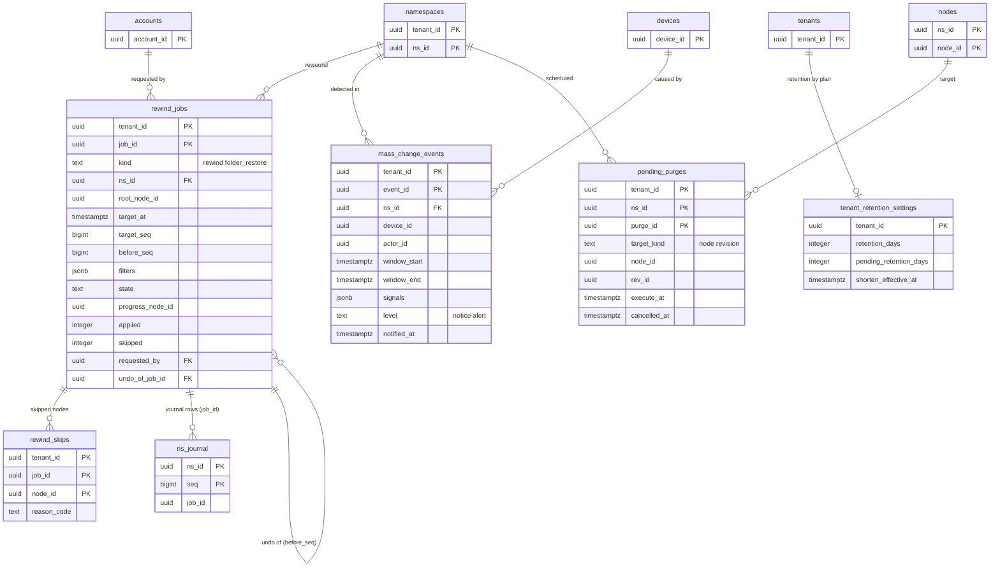

# Data model: バージョンと復元

[data-model.md](../data-model.md) の一部。規約はそちらの 3 節に従う。リビジョンと置き場所のバージョンの表は [nodes-and-revisions.md](nodes-and-revisions.md)。振る舞いは [versions-and-recovery.md](../versions-and-recovery.md)（4〜7 節）、[security.md](../security.md) の 8.3 節を正とする。決定は [ADR-0029](../../decisions/0029-revision-and-placement-retention.md)、[ADR-0030](../../decisions/0030-restore-and-rewind-as-journaled-batches.md)、[ADR-0031](../../decisions/0031-mass-change-detection.md)、[ADR-0045](../../decisions/0045-audit-log-and-data-lifecycle.md)。

| 表 | 置き場所 | 書く |
| --- | --- | --- |
| `rewind_jobs`・`rewind_skips` | テナントの表 | `api`（作成）、`restore-runner` |
| `mass_change_events` | テナントの表 | `mass-change-detector` |
| `tenant_retention_settings` | テナントの表 | 請求の Worker（プランの変更） |
| `pending_purges` | 名前空間の表 | `api`（予約・取り消し）、`lifecycle`（実行） |

## 1. ER 図

## 2. 表

### 2.1 `rewind_jobs`

巻き戻しとフォルダーの復元の作業（[ADR-0030](../../decisions/0030-restore-and-rewind-as-journaled-batches.md)）。普通の条件つきの操作のバッチで、ジャーナルの行に `job_id` を付ける。`epoch` を上げない。定義元：[versions-and-recovery.md](../versions-and-recovery.md) の 6.3 節。

| 列 | 型 | NULL | 既定 | 説明 |
| --- | --- | --- | --- | --- |
| `tenant_id` | `uuid` | NOT NULL | — | 名前空間の持ち主のテナント |
| `job_id` | `uuid` | NOT NULL | `uuidv7()` | |
| `kind` | `text` | NOT NULL | — | `rewind`・`folder_restore` |
| `ns_id` | `uuid` | NOT NULL | — | 1 回 1 名前空間（載せた共有フォルダーは含めない） |
| `root_node_id` | `uuid` | NULL | — | フォルダーの単位のとき |
| `target_at` | `timestamptz` | NOT NULL | — | 利用者が選んだ時刻 t |
| `target_seq` | `bigint` | NOT NULL | — | S_t（`node_versions` の `(ns_id, valid_from_at)` で求める） |
| `before_seq` | `bigint` | NOT NULL | — | 始まりの直前の番号 S_before（取り消しに使う） |
| `filters` | `jsonb` | NOT NULL | `'{}'` | 対象から外す変更（端末・人・拡張子） |
| `state` | `text` | NOT NULL | `'requested'` | `requested`・`planning`・`running`・`paused`・`completed`・`completed_with_skips`・`cancelled` |
| `progress_node_id` | `uuid` | NULL | — | `node_id` の範囲 10,000 ずつの位置（再開の点） |
| `applied` | `integer` | NOT NULL | `0` | |
| `skipped` | `integer` | NOT NULL | `0` | |
| `requested_by` | `uuid` | NOT NULL | — | `account_id`（`can(actor, rewind, ns)` を確かめた主体） |
| `undo_of_job_id` | `uuid` | NULL | — | 取り消し（S_before への巻き戻し）の元 |
| `created_at`・`started_at`・`finished_at` | `timestamptz` | — | — | |

- キー：PK `(tenant_id, job_id)`。UK `job_id`。FK `(tenant_id, undo_of_job_id)` → `rewind_jobs`。
- 一意：`UNIQUE (ns_id) WHERE state IN ('requested','planning','running','paused')`（1 名前空間に同時 1 つ）。
- 索引：`(tenant_id, state) WHERE state IN ('requested','planning','running','paused')` — テナントの同時 10 の上限、Worker の拾い。
- CHECK：`kind IN (…)`、`state IN (…)`、`target_seq <= before_seq`、`applied >= 0 AND skipped >= 0`。
- RLS：テナント。保持：1 年（この文書で決めた。監査ログと揃える。L6 で見直す）。S1 の量：数万行。

### 2.2 `rewind_skips`

巻き戻しで、利用者の途中の変更のために飛ばしたノード（PROP-VER-003）。

| 列 | 型 | NULL | 既定 | 説明 |
| --- | --- | --- | --- | --- |
| `tenant_id` | `uuid` | NOT NULL | — | |
| `job_id` | `uuid` | NOT NULL | — | |
| `node_id` | `uuid` | NOT NULL | — | |
| `reason_code` | `text` | NOT NULL | — | `changed_after_start`・`name_exists`・`permission_changed` |
| `skipped_at` | `timestamptz` | NOT NULL | `now()` | |

- キー：PK `(tenant_id, job_id, node_id)`（D-14）。FK `(tenant_id, job_id)` → `rewind_jobs`（`ON DELETE CASCADE`）。
- RLS：テナント。保持：作業と同じ。S1 の量：数十万行。

### 2.3 `mass_change_events`

一斉の変更の検知の結果（[ADR-0031](../../decisions/0031-mass-change-detection.md)）。入力は outbox の `commit_summary`（名前・中身なし）。

| 列 | 型 | NULL | 既定 | 説明 |
| --- | --- | --- | --- | --- |
| `tenant_id` | `uuid` | NOT NULL | — | |
| `event_id` | `uuid` | NOT NULL | `uuidv7()` | |
| `ns_id` | `uuid` | NOT NULL | — | |
| `device_id` | `uuid` | NULL | — | 変更を起こした端末（Web・API は NULL） |
| `actor_id` | `uuid` | NULL | — | |
| `window_start`・`window_end` | `timestamptz` | NOT NULL | — | 10 分の滑る窓 |
| `signals` | `jsonb` | NOT NULL | — | `{changes, deletes, renames_ext_changed, new_ext: {ext: count}}`。拡張子は短い文字列だけ（名前を持たない） |
| `level` | `text` | NOT NULL | — | `notice`・`alert` |
| `suggested_rewind_at` | `timestamptz` | NULL | — | 窓の始まりの 5 分前 |
| `notified_at` | `timestamptz` | NULL | — | `alert` の通知の時刻（p95 5 分） |
| `created_at` | `timestamptz` | NOT NULL | `now()` | |

- キー：PK `(tenant_id, event_id)`。
- 一意：`alert` は（名前空間 × 端末）で 1 時間に 1 回までにまとめる（`mass-change-detector` が `(ns_id, device_id, created_at)` の索引で確かめる）。
- 索引：`(tenant_id, ns_id, created_at)` — 活動の画面、巻き戻しの画面の候補。
- CHECK：`level IN ('notice','alert')`、`window_end > window_start`。
- RLS：テナント。保持：1 年（この文書で決めた）。S1 の量：1 日 数千行。

### 2.4 `tenant_retention_settings`

テナント（プラン）ごとのバージョンの保持の期間（[ADR-0029](../../decisions/0029-revision-and-placement-retention.md)）。データの種類ごとの保持の正本 `retention_policies`（[security-audit-and-lifecycle.md](security-audit-and-lifecycle.md) の 2.4 節）とは別。

| 列 | 型 | NULL | 既定 | 説明 |
| --- | --- | --- | --- | --- |
| `tenant_id` | `uuid` | NOT NULL | — | |
| `retention_days` | `integer` | NOT NULL | `30` | 今の期間（30・180・365） |
| `pending_retention_days` | `integer` | NULL | — | プランを下げたときの次の期間 |
| `shorten_effective_at` | `timestamptz` | NULL | — | 短くなる日（下げてから 30 日の猶予） |
| `updated_at` | `timestamptz` | NOT NULL | `now()` | |

- キー：PK `tenant_id`。
- CHECK：`retention_days IN (30,180,365)`、`(pending_retention_days IS NULL) = (shorten_effective_at IS NULL)`。
- 上げたらすぐ `retention_days` を変える。下げたら `pending_*` を書き、`lifecycle` が日を過ぎたら移す。
- `lifecycle` は名前空間の持ち主のテナントの値を使う（共有フォルダーは持ち主のテナントの期間）。
- RLS：テナント。S1 の量：約 40.2 万行。

### 2.5 `pending_purges`

完全な削除の予約（[security.md](../security.md) の 8.3 節）。再認証の後、24 時間待って実行する。

| 列 | 型 | NULL | 既定 | 説明 |
| --- | --- | --- | --- | --- |
| `tenant_id` | `uuid` | NOT NULL | — | |
| `ns_id` | `uuid` | NOT NULL | — | |
| `purge_id` | `uuid` | NOT NULL | `uuidv7()` | |
| `target_kind` | `text` | NOT NULL | — | `node`（削除したファイル・フォルダー）・`revision`（古いバージョン） |
| `node_id` | `uuid` | NOT NULL | — | |
| `rev_id` | `uuid` | NULL | — | `revision` のとき |
| `requested_by` | `uuid` | NOT NULL | — | |
| `execute_at` | `timestamptz` | NOT NULL | `now() + 24 hours` | |
| `cancelled_at` | `timestamptz` | NULL | — | |
| `executed_at` | `timestamptz` | NULL | — | |

- キー：PK `(tenant_id, ns_id, purge_id)`。
- 索引：`(execute_at) WHERE cancelled_at IS NULL AND executed_at IS NULL` — `lifecycle` の拾い。
- CHECK：`(target_kind = 'revision') = (rev_id IS NOT NULL)`。
- 実行は `packages/committer` の期限切れと同じ経路（`purge` の行）。今のリビジョンは対象にできない。`legal_holds` の対象は飛ばす。
- RLS：名前空間の表。保持：実行・取り消しから 90 日（この文書で決めた）。S1 の量：数万行。
