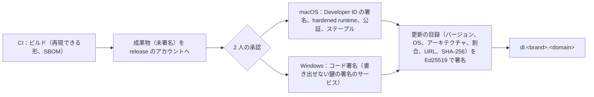

# Delivery: Dropbox

CI/CD、この題材に固有の関門（決定的な同期のシミュレーター、実の macOS・Windows でのファイルシステムの端の場合の試験、分割と `name_key` の試験のベクトル、重複排除の 2 つの世界、漏れの経路、GC の並行）、フラグ、サーバーのデプロイ、デスクトップのクライアントの署名・公証・自動の更新・段階の配布・最低のバージョン、モバイルのリリース、Web の資産、`chunker_version`・`names_version`・カーソルの形とプロトコルの互換の規則、スキーマの変更の順序を決める。他の題材（Google Calendar・Linear の [delivery.md](delivery.md)）の形を引き継ぐ（GitHub Actions、OIDC、1 回ビルドして同じ成果物を昇格、prod は Ops の承認）。

| ADR | 決定 |
| --- | --- |
| [0052](../decisions/0052-client-signing-staged-rollout-and-minimum-version.md) | デスクトップのクライアントは `release` のアカウントで 2 人の承認のもとに OS のコード署名（macOS は公証も）をし、Ed25519 で署名した更新の目録で配る。段階の配布は社内 → 1% → 10% → 50% → 100%（各 48 時間以上）で、品質の基準を外れたら止める。クライアントを古いバージョンへ戻さず、前のコードを新しいバージョンの番号で出し直す。サーバーは最低のバージョン（AppConfig）より古いクライアントの書き込みを 426 で拒み、読み出しだけにする。モバイルはストアの段階の公開を使う |
| [0053](../decisions/0053-protocol-compatibility-and-schema-change-ordering.md) | サーバーは 2 つ前までのクライアントのリリースを受ける。`chunker_version` は読み出しを消さず、新しいバージョンはサーバーが受けると知らせてからクライアントが書く（フラグにしない）。`names_version` の更新は影の列で両方の鍵を持ってから切り替える。カーソルの形は新旧を受けてから古いものを `reset` にする。スキーマの変更は広げる・埋める・縮める・消すの順で、埋めは `packages/committer` の保守の経路と枠で流す |

SLO・リリースとロールバックの方針・デプロイの時間帯と凍結の正本は [runbooks/README.md](../runbooks/README.md) の 3 節にある。この文書は、その方針の仕組みを書く。

## 1. 変更からマージまで

- ブランチ、PR、Conventional Commits、`changes/` の流れは、リポジトリ共通の規則（[docs/process.md](../../../../docs/process.md)）に従う。
- 変更のパスから、関門を自動で足す（2 節）。関門を外すラベルは持たない。
- CODEOWNERS：`sync-core` の `planner`・`names`・`chunker`、`packages/committer`・`access`・`blocks`・`auth` はテックリード（[roadmap.md](../roadmap.md) の `dev-repo-bootstrap`）。`infra/` の `regional/keys`・`release/` はセキュリティの担当も承認者に入れる。

## 2. CI

### 2.1 PR の CI（必須）

| 関門 | 中身 | 時間の目安 |
| --- | --- | --- |
| 静的な検査 | lint（[ADR-0001](../decisions/0001-platform-and-stack.md) の `sync-core` の外の計画・名前の比べの禁止、`packages/access` の外の役割・方針の条件の禁止、`packages/committer` の外の名前空間の表への書き込みの禁止、ログに名前・パス・ハッシュの型を渡す呼び出しの禁止）、型、`cargo clippy`、秘密の走査、依存の検査（本家の実装の禁止の一覧） | 5 分 |
| 単体・表駆動 | Vitest、`cargo test`。全部の決定表（衝突、`can()`、重複排除の答え、再認証の要否、`scan_state` と経路）を spec から読んで回す | 5 分 |
| 試験のベクトル | 分割（Rust のネイティブの macOS・Windows・Linux と WASM）、`name_key`（Rust と TypeScript）。分割・名前に触れたとき | 5 分 |
| 性質ベース | 各 2,000 試行。`regressions/` の全部のシード | 10 分 |
| 決定的な同期のシミュレーター | 1 万の場面（`sync-core`・`packages/committer` に触れたとき） | 15 分 |
| 結合 | Testcontainers（PostgreSQL 18、Valkey）、LocalStack（S3・SQS）。RLS、ジャーナル、outbox、ブロックの検証と GC の並行、重複排除の 2 つの世界の形、漏れの経路の表 | 10 分 |
| マイグレーションの比較 | 空の DB に全マイグレーションを当て、望む形と比べる。新しい表の `tenant_id`・`ns_id` と FORCE RLS、RLS の外の表の一覧（[ADR-0004](../decisions/0004-tenancy-namespaces-and-rls.md)）、破壊の変更とそれを読むコードの削除が同じ PR にないこと（7 節） | 3 分 |
| Terraform の plan の検査 | [infrastructure.md](infrastructure.md) の 9.2 節の拒否の一覧 | 3 分 |
| ファイルシステムの端の場合（主な場面） | 実の macOS（APFS の 2 種類）と Windows（NTFS）の機械（[quality.md](../quality.md) の 2.2.1 節 B）。`sync-core` の OS の殻・監視・名前に触れたとき | 20 分 |
| E2E | Playwright（Web の主な流れ）、デスクトップの UI の主な流れ | 10 分 |
| 互換 | 2 つ前までのクライアントのリリースの API の呼び出しの記録を、今のサーバーで再生する（6 節） | 5 分 |

- **性質ベーステストとシミュレーターの失敗を、再実行で緑にしない。** 失敗したシードを縮めて `regressions/` に足す PR を先に出す（[quality.md](../quality.md) の 2.3 節）。
- **テストの削除・skip・期待値の緩和、ファイルシステムの場面の期待する結果の変更**は、CI が差分から見つけて QA の承認を求める。
- CI の PR の関門の時間は p90 30 分以内を目標にする。核の区分（シミュレーターと実機）は 45 分まで許す。

### 2.2 夜間の CI

| 関門 | 中身 |
| --- | --- |
| 性質ベース | 各 200,000 試行。新しい失敗のシードは自動で Issue にする |
| 決定的な同期のシミュレーター | 1,000 万の場面（K1）。決定表の行とクラッシュの位置への到達を記録する |
| ファイルシステムの端の場合 | 全部の場面。OS のベータが出ていれば、ベータの機械でも |
| 端末の資源 | 100 万ファイルの端末の計測（NFR-008）。前のリリースより 10% 悪ければ Issue |
| ファジング | プレビュー・抽出の入口（[security.md](security.md) の 10 節） |
| 実の S3 | 署名つき URL、チェックサム、写し、バージョニング、CRR（検証のアカウント） |
| 大きなファイル | 100 GB の再開の試験、2 TiB の合成のデータのセッション（[quality.md](../quality.md) の 2.2.1 節 C） |
| 障害の注入（staging） | Aurora のフェイルオーバー、Valkey の再起動、`relay` の停止、`notify` の入れ替え、S3 の 503 |
| セキュリティ | DAST（Web、API、共有リンク、`auth`） |

### 2.3 実機の機械

- macOS は EC2 Mac（`synthetics` のアカウント）の自前のランナー、Windows は EC2 の自前のランナー。OS は最新とその 1 つ前のバージョンを持つ（[quality.md](../quality.md) の 2.4 節）。
- 実機の機械は、テストのたびに使い捨てのボリューム（APFS は大文字小文字を区別する・しないの 2 つ）を作り直す。
- OS のベータの公開の週は、ベータの機械で主な場面を流し、結果を QA と Dev が確かめる（[runbooks/README.md](../runbooks/README.md) の 5 節）。

## 3. フラグ

- `release.*`（kebab-case）は未完成の振る舞いを隠す。100% の後 30 日で消す。`ops.*`（snake_case）は運用のつまみ。
- **同期・名前・分割・権限の規則をフラグにしない**（[AGENTS.md](../../AGENTS.md)）。衝突の決定表、`name_key`、分割の規則、`can()` の変更は、コードのバージョンとして出す（6 節）。
- この題材の platform と運用の領域で足すもの：

| 名前 | 種類 | 中身 | 正本 |
| --- | --- | --- | --- |
| `release.admin-member-access` | release | 管理者のメンバーのフォルダーへのアクセス（法務の L7 の後まで無効） | [accounts-and-teams.md](accounts-and-teams.md) の 11.2 節 |
| `ops.writes_enabled`、`ops.uploads_enabled` | ops | 書き込み・アップロードの停止（読み出しは続ける） | [infrastructure.md](infrastructure.md) の 6.3 節 |
| `ops.block_gc_enabled`、`ops.block_gc_rate` | ops | GC の停止と速さ | [runbooks/README.md](../runbooks/README.md) の 2 節 |
| `ops.client_upload_concurrency` | ops | 端末の並行の数 | 同上 |
| `ops.upload_admission_global_bps`、`ops.upload_admission_tenant_bps` | ops | アップロードの受け入れの絞り | [capacity.md](capacity.md) の 4.3 節 |
| `ops.preview_formats_enabled` | ops | 形式ごとの変換の停止 | [security.md](security.md) の 11 節 |
| `content_scan_policy` | 構成 | 中身の検査の範囲 | [security.md](security.md) の 6 節 |
| `client.min_supported_version`、`client.blocked_versions` | 構成 | プラットフォームごとの最低のバージョンと、同期を止めたバージョン | 5.4 節 |
| `client.rollout` | 構成 | プラットフォームごとの段階の割合（目録を作る元） | 5.3 節 |

- AppConfig の構成の変更は、東京と大阪の両方に当てる（[infrastructure.md](infrastructure.md) の 4 節）。

## 4. サーバーのデプロイ

### 4.1 順序

[runbooks/README.md](../runbooks/README.md) の 3 節の順序（マイグレーションの広げる段 → API・Link・Auth → Relay → Worker（`block-gc` は最後）→ Notify → Web の資産）の仕組み。

| 段 | 仕組み |
| --- | --- |
| マイグレーション | 広げる段だけを、デプロイの前のジョブで当てる（7 節） |
| `api`・`link`・`auth` | ECS のローリング。新しいタスクのヘルスチェックの後に古いタスクを抜く。自動のロールバックの条件（5xx、commit の p99、409 と 4xx の率の急な上がり、参照の監査の不一致）を CloudWatch のアラームで見る |
| `relay`・Worker | ローリング。SQS のメッセージは可視性のタイムアウトで戻る |
| `block-gc` | 新しいバージョンは止めた状態（`ops.block_gc_enabled` はそのまま、新しいタスクは GC の実行を始めない）で入れ、参照の監査が 24 時間 0 のときに有効にする |
| `notify` | 1 タスクずつ。抜く前に端末へ `reconnect` を送り、端末は 0〜30 秒の乱数で別のタスクへつなぐ（[capacity.md](capacity.md) の 3.2 節） |
| Web の資産 | S3 にハッシュつきの名前で置くだけ。殻（`index.html`）を最後に入れ替える。1 つ前の資産を 30 日残す |

### 4.2 ロールバック

- まずフラグで戻す。次に 1 つ前のイメージ（マイグレーションは広げる段だけなので、前のイメージが今の DB で動く）。縮める段の後は前へ戻さない。
- 同期・名前・権限の規則の不具合は、前のイメージへ戻すことを先に考える。データの直接の書き換えはしない（`packages/committer` の保守の経路だけ。[roadmap.md](../roadmap.md) の「エージェントに任せないこと」）。

## 5. クライアントの配布

ADR-0052。

### 5.1 署名と公証

- 署名の鍵は `release` のアカウントの HSM か、鍵を書き出せない署名のサービスに置く（[security.md](security.md) の 3.9 節）。CI の資格情報からは署名を呼べず、署名のジョブは 2 人の承認で動く。
- macOS の配布は Developer ID の署名と Apple の公証を通す。公証が hardened runtime と安全な時刻の印を求めることは、Apple の資料の頁の本文を取得できず確かめていない（**未検証**。E5 の `desktop-distribution` で確かめる）。
- 更新の目録の形と、クライアントの受け取り（6 時間ごと、目録の Ed25519 の署名の確かめ、静かなときの入れ替え）は [desktop-client.md](desktop-client.md) の 9 節。クライアントは成果物の SHA-256 と、OS のコード署名の両方を確かめてから入れ替える。
- Tauri の updater の部品を使うなら、その署名の確かめは外せない（[Tauri の Updater](https://v2.tauri.app/plugin/updater/)、2026-10-09 に確認）。部品を使うかは E5 で決めるが、どちらでも目録の Ed25519 の署名を確かめる。

### 5.2 リリースの列

- デスクトップは 2 週ごとに出す。番号は `YYYY.MM.N`（暦の年と月と通し番号）。
- 1 つのリリースは、サーバーの対応（6 節）が本番に出た後にだけ配布を始める。

### 5.3 段階の配布

| 段 | 対象 | 最短の期間 |
| --- | --- | --- |
| 社内 | 社員の端末と合成監視の端末 | 48 時間 |
| 1% | `device_id` のハッシュを 0〜99 に分けた値が 0 | 48 時間 |
| 10% | 0〜9 | 48 時間 |
| 50% | 0〜49 | 48 時間 |
| 100% | すべて | — |

- 段を進めるのは平日 10〜15 時（[runbooks/README.md](../runbooks/README.md) の 3.1 節）。段を進める判断は、下の基準を満たしたうえで PM が行う。
- **止める基準**（[quality.md](../quality.md) の 4.1 節）：異常終了の率が起動 1,000 回あたり 1 回以上、端末の健全さが 99.5% 未満、競合のコピー・消しすぎの止め・走査し直しの率がリリースの前の 2 倍。基準は、新しいバージョンの端末と古いバージョンの端末を、同じ期間で比べる（[observability.md](observability.md) の 8 節の端末のダッシュボード）。
- 止めたら、`client.rollout` の割合を 0 にし、目録を作り直す。既に入った端末はそのまま。

### 5.4 戻し方と最低のバージョン

- **クライアントを古いバージョンへ戻さない。** ローカルの状態の DB のスキーマが進んでいることがあるため。不具合があれば、前のリリースのコードを新しい番号で出し直す（戻しのリリース）。戻しのリリースが、壊れたリリースの DB のスキーマを読めるよう、ローカルの DB のスキーマの変更は 1 つのリリースの間は広げるだけにする（7.3 節）。
- **同期を止める**：深刻な不具合（中身を消す）が分かったバージョンは `client.blocked_versions` に入れる。サーバーはそのバージョンの commit と `list/continue` を 426 `client_blocked` で拒む。クライアントは同期を止め（手元のファイルは残す）、更新を促す。読み出し（Web、モバイルの閲覧）は止めない。
- **最低のバージョン**：`client.min_supported_version` より古いクライアントは、書き込みを 426 `client_too_old` で拒み、読み出しだけにする。最低のバージョンは、2 つ前のリリースより新しくしない（6.1 節）。上げるときは 30 日前に、古いクライアントへ更新を促す表示を出す。
- OS のサポートの下限（macOS 13、Windows 10 22H2・Windows 11。[desktop-client.md](desktop-client.md) の 3 節）を上げるときは、古い OS の端末に 90 日前に知らせる。本家は、サポートの外の OS で同期を止めてログアウトさせる（[Dropbox no longer supports my operating system](https://help.dropbox.com/installs/computer-os-not-supported)、2026-10-09 に確認）。本システムは、ログアウトさせずに読み出しだけにする。

### 5.5 モバイル

| | iOS | Android |
| --- | --- | --- |
| 署名 | 配布の証明書とプロビジョニングのプロファイルを `release` のアカウントに置く | Play App Signing（アップロードの鍵を `release` のアカウントに置く） |
| 社内 | TestFlight の内部の試験 | 内部テストのトラック |
| 段階 | App Store の段階的なリリース：7 日で 1%・2%・5%・10%・20%・50%・100%。止めるのは合計 30 日まで | Play の段階的な公開：1% → 10% → 50% → 100%（各 48 時間以上）。止められ、再開で同じ利用者に配る |
| 止める基準 | 5.3 節と同じ | 同じ |

- App Store の段階的なリリースは、自動の更新を有効にした利用者に効き、手で更新する人はいつでも新しいバージョンを取れる（[Release a version update in phases](https://developer.apple.com/help/app-store-connect/update-your-app/release-a-version-update-in-phases)、2026-10-09 に確認）。段階の割合を本システムで決められないので、iOS は 48 時間の段の代わりに、この 7 日の段に止める基準を当てる。
- Play の段階的な公開は、割合を手で上げ、止められ、再開すると止める前と同じ利用者に配る（[Release app updates with staged rollouts](https://support.google.com/googleplay/android-developer/answer/6346149)、2026-10-09 に確認）。
- ストアの審査の時間は読めない。モバイルの戻しのリリースは、審査の時間を見込んで、サーバーの `client.blocked_versions` での停止を先に使う。

### 5.6 Web の資産と WASM

- Web の SPA と、分割の WASM（`sync-core`）は同じ資産のバージョンで出す。資産は 1 つ前を 30 日残す（4.1 節）。開いたままのタブが古い資産を使い続けるので、サーバーは 1 つ前の Web の資産の要求を受ける（6.1 節）。

## 6. プロトコルと互換

ADR-0053。

### 6.1 クライアントのバージョンの幅

- サーバーは、2 つ前までのデスクトップ・モバイルのリリースと、1 つ前の Web の資産の要求を受ける（[runbooks/README.md](../runbooks/README.md) の 3 節）。
- API（`/v1`）の変更は足すだけにする。足した項目は、古いクライアントが知らなくても正しく動く形にする（知らない項目を無視してよい）。意味を変える変更は、新しい項目か新しい操作として足し、古いものを 2 つ前のリリースが最低のバージョンより古くなってから消す。
- クライアントは、要求に `<Brand>-Client: <kind>/<version>` を付ける。サーバーは、最低のバージョンと止めたバージョン（5.4 節）をここで判定する。
- PR の CI の互換の関門（2.1 節）で、2 つ前までのリリースの記録した呼び出しを、今のサーバーで再生する。

### 6.2 `chunker_version`

- 分割の規則は `chunker_version` に結び付ける（[ADR-0002](../decisions/0002-chunking-and-block-addressing.md)）。0（公開 API の固定 4 MiB。[ADR-0018](../decisions/0018-upload-sessions-and-block-grants.md)）と 1（CDC）がある。
- 新しいバージョン N を足す順序：
  1. サーバーが N の一覧の検査（大きさの上限、`blocklist_hash`）を受けるコードを本番に出す。サーバーは、受ける `chunker_version` の一覧を `GET /v1/config` で知らせる（サーバーのコードのバージョンで決まり、フラグではない）。
  2. N を書けるクライアントのリリースを出す。クライアントは、サーバーが N を受けると知らせたときだけ、新しく書くファイルを N で分ける。
  3. 古いバージョンの読み出しを消さない。古いバージョンで分けたリビジョンは、そのまま読める。
- バージョンが違うとブロックが重ならないので、切り替えの後に変わったファイルは、変わっていないブロックも送り直す。変わらないファイルは送り直さない。
- 分割の試験のベクトル（ネイティブと WASM）は、すべてのバージョンについて回し続ける。

### 6.3 `names_version`

- `name_key` の規則は `names_version` に結び付け、Unicode のバージョンを上げるときは移行の作業にする（[ADR-0008](../decisions/0008-node-identity-and-names.md)）。
- 順序：
  1. サーバーとクライアントに、新旧の両方の鍵を計算できるコードを出す。
  2. サーバーの `nodes` に影の列 `name_key_next` を足し、保守の枠で埋める。新しい鍵でぶつかる名前を数え、扱い（名前の変更で解く。`packages/committer` を通してジャーナルに載せる）を Dev と QA で決める。
  3. 一意の索引を新しい鍵に切り替え、`names_version` を上げる。サーバーは `GET /v1/config` で今の `names_version` を知らせる。
  4. 古い `names_version` のクライアントも同期を続けられる（サーバーが一意の判定を持ち、ぶつかれば 409 になる）。最低のバージョンを、新しい `names_version` を持つリリースへ 90 日以内に上げる。
- 影の列の埋め（名前の見え方が変わらない）はジャーナルに載せない。`committer_maint` のロールが `name_key_next` だけを書く。新しい鍵でぶつかる名前を解く名前の変更は、普通の commit でジャーナルに載せる（[data-model.md](data-model.md) の D-4）。

### 6.4 カーソルとジャーナルの形

- カーソルの形（`v`）を変えるときは、サーバーが新旧の両方を受けるコードを出してから新しい形を発行し、古い形の使用が 0 に近くなってから古い形を 409 `reset` にする（[ADR-0005](../decisions/0005-namespace-journal-and-cursors.md)）。
- ジャーナルの行に項目を足すのは 6.1 節と同じ（足すだけ）。`op` の種類を足すときは、古いクライアントが知らない `op` を受けたら取り直しにする約束を、最初のリリースから持たせる（[sync-engine.md](sync-engine.md)）。

## 7. スキーマの変更の順序

ADR-0053。

### 7.1 サーバー（Aurora）

| 段 | 中身 | 同じ PR に入れてはいけないもの |
| --- | --- | --- |
| 1. 広げる | 表・列（NULL を許す、または定数の既定）・索引（`CREATE INDEX CONCURRENTLY`）を足す。新しい表は `tenant_id`・`ns_id`・FORCE RLS | 古い列を読むコードの削除 |
| 2. 埋めて移る | 書き込みは新旧の両方へ。埋めは保守の経路と枠で流す。読み出しを新しいものへ | — |
| 3. 縮める | 古い列への書き込みを止める。古い列の制約を外す | 列・表の削除 |
| 4. 消す | 古い列・表を消す。縮める段の後、1 リリース以上空ける | — |

- **埋めの経路**：名前空間の表の埋めは `packages/committer` の保守の経路で、`maintenance` の枠（全体の commit の 10% まで。[capacity.md](capacity.md) の 2 節）を通す。DB のロールで直接の `UPDATE` を拒んでいる（[ADR-0005](../decisions/0005-namespace-journal-and-cursors.md)）ので、ほかの道はない。名前空間ごとのロックで直列になるので、名前空間の単位で少しずつ進める。
- **大きな表**（`nodes` 25 億、`ns_journal` の分割）では、表の書き換え（`ALTER TYPE`、既定の値が関数の列）をしない。`ns_journal` の形を変えるときは、新しい日の分割から新しい形にし、古い分割は保持の期間で落ちるのを待つ。
- 破壊の変更とそれを読むコードの削除が同じ PR にないことを、CI のマイグレーションの比較で確かめる（2.1 節）。
- 手順の確かめは runbook `schema-expand-contract.md`。

### 7.2 S3 のキーとバケット

- キーの形を変える（例：`incoming` のキーの先頭にハッシュを置く。[capacity.md](capacity.md) の 4.1 節）ときは、サーバーが新旧の両方のキーを読めるコードを出してから、新しいキーで書く。古いキーは、`incoming` なら 2 日、`blocks` なら書き換えず残す。

### 7.3 クライアントのローカルの DB

- ローカルの状態の DB のスキーマの変更は、新しいバージョンが起動のときに行い、変更の前の DB を 1 つ残す（[desktop-client.md](desktop-client.md) の 9 節）。
- 1 つのリリースの間は広げるだけにし、戻しのリリース（5.4 節）が読めるようにする。縮める変更は次のリリースで行う。

## 8. ホットフィックス

- 他の題材と同じく、main から出し、関門を省かない。性質ベーステストとシミュレーターは PR の既定の回数に下げてよい（夜間の回数は後で必ず回す）。下げたことを記録する。
- クライアントのホットフィックスは、社内の段を 24 時間に縮めてよい。1% の段は省かない。中身を消す不具合のときは、まず `client.blocked_versions` で同期を止める。

## 9. 指標

| 指標 | 目標 |
| --- | --- |
| デプロイの頻度（サーバー） | 平日 1 日 1 回以上 |
| 変更のリードタイム（マージから本番） | 中央値 1 日以内（クライアントの段階の配布を除く） |
| 変更の失敗の率 | 10% 以下 |
| 回復の時間 | ロールバックで 30 分以内 |
| CI の PR の関門の時間 | p90 30 分以内（核の区分 45 分） |
| 夜間の新しい失敗のシード | 7 日以内に直す |
| デスクトップの新しいリリースの普及 | 100% の段から 14 日で端末の 90% |
| 最低のバージョンより古い端末 | 1% 未満 |
| `release.*` のフラグの寿命 | 100% の後 30 日以内に消す |

## 10. Story の候補

| Epic | Story | 中身 |
| --- | --- | --- |
| E1 | `ci-pipeline-baseline` | 2.1・2.2 節の関門、テストの緩和の検出、本番の依存の禁止の一覧 |
| E1 | `ci-real-os-runners` | 2.3 節の実機の機械と使い捨てのボリューム |
| E1 | `flags-appconfig` | 3 節のフラグと構成 |
| E1 | `schema-migration-gates` | 7.1 節の段と CI の比較 |
| E5 | `desktop-distribution` | 5.1〜5.4 節（署名、公証、目録、段階、戻しのリリース、`client.blocked_versions`、最低のバージョン） |
| E10 | `mobile-release-pipeline` | 5.5 節 |
| E11 | `api-compat-replay` | 6.1 節の互換の関門 |
| E2 | `chunker-version-negotiation` | 6.2 節の `GET /v1/config` と、クライアントの切り替え |

## 11. 未解決の問い

### 決定

2026-10-09 の既定案。

- **クライアントの署名**：`release` のアカウント、2 人の承認、Ed25519 の目録（ADR-0052）。
- **戻し方**：古いバージョンへ戻さず、戻しのリリースと `client.blocked_versions`（ADR-0052）。
- **最低のバージョン**：古いものは読み出しだけ（ADR-0052）。
- **互換**：2 つ前までのリリース。`chunker_version` はサーバーが受けると知らせてから（ADR-0053）。
- **スキーマ**：広げる・埋める・縮める・消す。埋めは `packages/committer` の保守の経路（ADR-0053）。

### 持ち越し

| 問い | いつ・どう決めるか |
| --- | --- |
| Apple の公証の要件（hardened runtime、時刻の印） | E5 の `desktop-distribution`（**未検証**） |
| Windows のコード署名の方式と、SmartScreen の評判の扱い | E5（**未検証**） |
| Tauri の updater の部品を使うか、自前の受け取りか | E5、[desktop-client.md](desktop-client.md) |
| 画面の見た目を本家に寄せる範囲 | **法務の確認待ち：L10**（デスクトップ・Web の画面の Story） |

## 12. quality.md・runbooks・data-model への項目

### quality.md

- 2.2 節のテストのレベル構成に「互換（2 つ前までのリリースの呼び出しの再生）」の行を足す。
- E5 の合否基準に「段階の配布を止める基準が、ダッシュボードで新旧のバージョンを並べて判定できる」を足す。

### runbooks

- `client-regression.md`：`client.rollout` を 0 にする、`client.blocked_versions` に入れる、戻しのリリースを出す手順。
- `schema-expand-contract.md`：7.1 節の段の確かめ方。
- [runbooks/README.md](../runbooks/README.md) の 3 節の「クライアントの配布」に、iOS は App Store の 7 日の段階に止める基準を当てることを書き足す。

### data-model への項目

| 表・置き場所 | 中身 | 節 |
| --- | --- | --- |
| AppConfig | `client.min_supported_version`、`client.blocked_versions`、`client.rollout` | 3、5 |
| S3（release）の目録 | プラットフォームとアーキテクチャごとの目録（Ed25519 の署名つき） | 5.1 |
| `nodes` の影の列 `name_key_next`（移行の間だけ） | 新しい `names_version` の鍵 | 6.3 |
| `GET /v1/config` の応答 | 受ける `chunker_version` の一覧、今の `names_version`、最低のバージョン | 6.2、6.3 |

## 出典

いずれも 2026-10-09 に確認。

- Apple, [Release a version update in phases](https://developer.apple.com/help/app-store-connect/update-your-app/release-a-version-update-in-phases)：7 日で 1%・2%・5%・10%・20%・50%・100%。止めるのは合計 30 日まで。手で更新する人はいつでも取れる
- Google, [Release app updates with staged rollouts](https://support.google.com/googleplay/android-developer/answer/6346149)：割合を選び、手で上げる。止めて、再開すると同じ利用者に配る
- Tauri, [Updater](https://v2.tauri.app/plugin/updater/)：更新の署名は外せない。公開鍵を設定に入れ、秘密鍵はビルドの時に環境の変数で渡す
- Dropbox Help Center, [Dropbox no longer supports my operating system](https://help.dropbox.com/installs/computer-os-not-supported)：サポートの外の OS では同期を止め、ログアウトさせる
- Apple, [Notarizing macOS software before distribution](https://developer.apple.com/documentation/security/notarizing-macos-software-before-distribution)：頁の本文を取得できず、要件の細部は**未検証**
