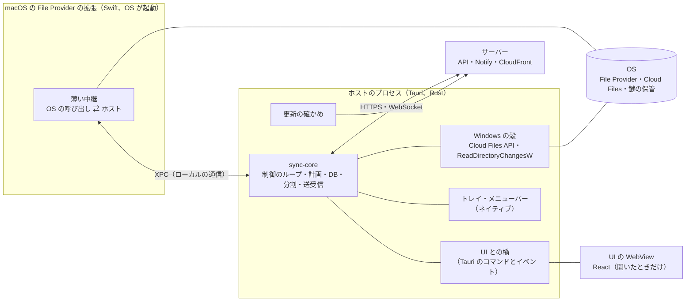
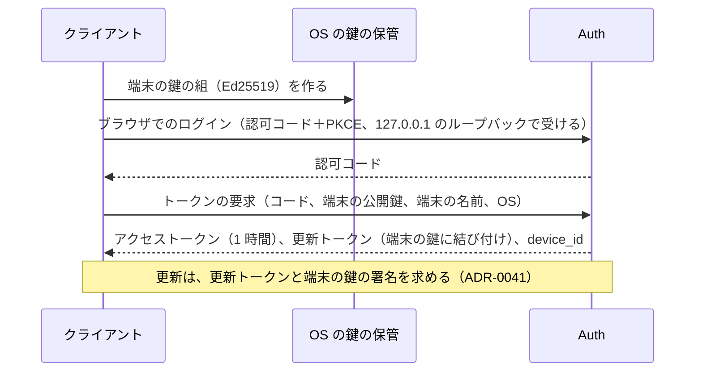

# Desktop Client: Dropbox

デスクトップのクライアント（macOS・Windows）の組み立てを決める。`sync-core` の組み込みとプロセスの形、UI と状態の表示、設定、資源の使い方の上限、プロキシと TLS、端末の登録と切り離し、自動の更新の受け取り、LAN 同期の将来の置き場所を扱う。

前提となる決定は、基盤（[ADR-0001](../decisions/0001-platform-and-stack.md)）、衝突のモデル（[ADR-0006](../decisions/0006-sync-conflict-model.md)）、計画（[ADR-0009](../decisions/0009-planner-dirty-set-and-ordering.md)）、ローカルの状態の DB（[ADR-0010](../decisions/0010-local-state-db-and-intent-log.md)）、手元の変化の観測（[ADR-0015](../decisions/0015-local-change-observation-and-move-detection.md)）、プレースホルダー（[ADR-0016](../decisions/0016-placeholders-and-hydration-policy.md)）。この文書で決めたことは次の ADR にある。

| ADR | 決定 |
| --- | --- |
| [0013](../decisions/0013-desktop-process-model-and-resource-budget.md) | デスクトップのクライアントは、`sync-core` を持つ 1 つの常駐のプロセス（Tauri のホスト）と、開いたときだけ作る UI の WebView と、macOS の File Provider の拡張（薄い中継）に分ける。核の判断はホストのプロセスだけが持つ。資源の予算（メモリー 300 MB の内訳、静かなときの起き方）を部品ごとに決め、リリースごとに測る |
| [0014](../decisions/0014-desktop-unlink-and-wipe-execution.md) | 資格が効かなくなったら同期を止め、端末の鍵で状態を確かめる。切り離しでは手元のファイルと DB を残し、同じアカウントで入り直せば続きから同期する。消去では、同期のルートの登録を先に外し、意図の記録を通して同期のフォルダーの中だけを消し、DB を最後に消して報告する。資格と状態の機械はアカウントの側の ADR-0041・0043 |

## 1. 目的と範囲

- 扱う：
  - プロセスの形、`sync-core` の組み込み、OS の殻との境目
  - UI（トレイ・メニューバー、状態の画面、設定、通知）と状態の表示の種類
  - 資源の使い方の上限（CPU・メモリー・ディスク・ネットワーク）と計測
  - プロキシ、TLS、ネットワークの変化
  - 端末の登録、資格の保管、遠隔の切り離しと消去
  - 自動の更新の受け取り（配布の流れそのものは [delivery.md](delivery.md)）
  - LAN 同期の将来の置き場所（E14）
- 扱わない：
  - 計画・衝突・意図の記録（[sync-engine.md](sync-engine.md)）
  - 監視・プレースホルダー・名前（[file-system-integration.md](file-system-integration.md)）
  - 署名・公証・段階の配布の流れ（[delivery.md](delivery.md)）
  - 端末の一覧と管理の画面、管理者の方針（[accounts-and-teams.md](accounts-and-teams.md)）
  - OAuth の認可サーバーとトークンの形（[accounts-and-teams.md](accounts-and-teams.md)、[api-and-webhooks.md](api-and-webhooks.md)）
  - 匿名の計測の受け口と集計（[observability.md](observability.md)）

## 2. 本家の形（確かめたこと）

いずれも 2026-10-09 に確認。

| 項目 | 内容 | 出典 |
| --- | --- | --- |
| macOS の File Provider | File Provider を使うバージョンは macOS 12.5 以降が要る。オンラインのみのファイルを他のアプリで開く問題を直すためのもの | [Dropbox on File Provider](https://help.dropbox.com/installs/dropbox-for-macos-support) |
| LAN 同期 | UDP のブロードキャストで見つけ、HTTPS で中身だけを送る。macOS の File Provider 版では使えない | [LAN sync overview](https://help.dropbox.com/sync/lan-sync-overview) |
| 同期エンジン | Rust。大部分を 1 つの決定的な制御のスレッドで動かす | [Rewriting the heart of our sync engine](https://dropbox.tech/infrastructure/rewriting-the-heart-of-our-sync-engine) |

- 本家のデスクトップのアプリのプロセスの形、資源の使い方、遠隔の消去の振る舞い、プロキシの対応の範囲は、公式の資料で確かめなかった（**未検証**）。

## 3. 要件と NFR

| NFR | この領域での要件 |
| --- | --- |
| NFR-008 | 100 万ファイルを持つ端末で、静かなときの CPU 1% 未満、メモリー 300 MB 以下（ホストのプロセス。UI の窓を閉じた状態）。最初の走査（SSD、100 万ファイル）10 分以内。保存から送信の開始まで p95 3 秒 |
| NFR-002 | WebSocket の合図を受けてから `list/continue` を始めるまで 100ms 以内 |
| NFR-007 | 切り離した端末は、次の接続から何も読めない（`can()` の入力の端末の状態） |
| 対応する OS | macOS 13 以降（APFS）、Windows 10 22H2・Windows 11（NTFS）。x64 と arm64 |

## 4. 構成

### 4.1 プロセス

[ADR-0013](../decisions/0013-desktop-process-model-and-resource-budget.md) で決める。

| 部分 | 持つもの | 持たないもの |
| --- | --- | --- |
| ホストのプロセス | `sync-core` の全部、Windows の殻、トレイ、資格、更新の確かめ | — |
| UI の WebView | 状態の画面、設定、選択型の同期の選択、通知の一覧 | 計画・衝突・名前の比べ（lint で禁止。[ADR-0001](../decisions/0001-platform-and-stack.md)） |
| File Provider の拡張 | OS の呼び出しをホストへ渡し、答えを返す。取り出しの一時のファイルを OS に渡す | 木・DB・ネットワーク |

- File Provider の拡張は OS が起動と終了を決め、メモリーの上限が厳しい（**未検証**。`placeholder-platform-survey`）。そのため、拡張に `sync-core` を載せず、ホストへ中継する。ホストが動いていなければ、拡張はホストを起動する（ログイン項目としても起動する）。
- Windows の Cloud Files API の呼び出し（取り出しの要求など）はホストのプロセスが受ける。

### 4.2 起動と停止

| 段 | 内容 |
| --- | --- |
| 起動 | ログインで起動。DB を開き、`intents` と `pending_commits` を解く（[ADR-0010](../decisions/0010-local-state-db-and-intent-log.md)）。資格を読む。走査し直しを低い優先度で始める |
| 接続 | `list/continue` を先に、次に WebSocket の合図。合図が使えなければ 60 秒ごとの確かめ（[ADR-0005](../decisions/0005-namespace-journal-and-cursors.md)） |
| 一時停止 | 利用者の操作。転送と commit を止める。監視と Local は続ける |
| 停止 | 新しい操作を止め、進行中の手元の操作を終えて（最大 5 秒）DB を閉じる。転送は捨てる（再開で続きから） |

## 5. UI と状態の表示

### 5.1 全体の状態

| 状態 | 表示 | 条件 |
| --- | --- | --- |
| `up_to_date` | 最新 | 汚れたノードも進行中の操作もない |
| `syncing` | 同期中（残り n 件、速さ） | 進行中の操作がある |
| `paused` | 一時停止 | 利用者が止めた |
| `offline` | オフライン | サーバーへ届かない（手元の変化は貯める） |
| `attention` | 確認が要る（n 件） | 同期しない項目、消しすぎの止め、`stuck`、容量の超過、競合のコピーの作成 |
| `error` | 止まっている | 同期のフォルダーが見えない、資格の失効、切り離し、ディスクの満杯 |

- 優先は `error` → `attention` → `offline` → `paused` → `syncing` → `up_to_date`。
- ファイルごとの状態（同期済み・同期中・オンラインのみ・同期しない）は、OS のアイコン（Cloud Files の状態のアイコン、File Provider の装飾）で示す。

### 5.2 通知

| 出来事 | 通知 | まとめ方 |
| --- | --- | --- |
| 競合のコピーを作った | 「`<名前>` の競合のコピーを作りました」 | 1 分に 1 回まで、件数でまとめる |
| 削除を取り消した（決定表の 3・4） | 「他の端末で編集されたため、削除を取り消しました」 | 同上 |
| 消しすぎの止め | 「n 個のファイルを削除しようとしています」と 2 つのボタン | 止めるたび |
| 同期しない項目が増えた | 「同期できない名前があります」 | 1 時間に 1 回まで |
| 共有フォルダーから外された、閲覧に下がった | 「保存できなかった変更に移しました」 | 出来事ごと |
| 一斉の変更の `alert` | 「多くのファイルが短い間に変わりました」と巻き戻しへのリンク | [versions-and-recovery.md](versions-and-recovery.md) の 7 節 |

- 通知の文言にファイルの名前を入れるのは、手元の OS の通知だけにする。匿名の計測とログには入れない。
- 画面の見た目と操作を本家にどこまで寄せるかは**法務の確認待ち**（L10）。

### 5.3 設定

| 設定 | 既定 | 置き場所 |
| --- | --- | --- |
| 同期のフォルダーの場所 | Windows `%USERPROFILE%\<Brand>`。macOS は File Provider の領域（OS が決める。**未検証**の場所） | DB の `sync_meta` |
| 選択型の同期 | 全部 | 同上（[sync-engine.md](sync-engine.md) の 9.1 節） |
| 新しいファイルの既定 | オンラインのみ（[ADR-0016](../decisions/0016-placeholders-and-hydration-policy.md)） | 同上 |
| 帯域の制限（上り・下り） | なし | 同上 |
| プロキシ | OS の設定 | 同上 |
| ログインで起動 | 有効 | OS |
| 言語 | OS の言語（日本語・英語） | 同上 |

- 設定の変更は UI からホストのコマンドで行う。UI は DB を直接書かない。

## 6. 資源の上限

[ADR-0013](../decisions/0013-desktop-process-model-and-resource-budget.md) で決める。100 万ファイル、静かな状態、UI の窓を閉じた状態の予算。

| 部品 | メモリーの予算 | 決め方 |
| --- | --- | --- |
| 実行系・Tauri・TLS・HTTP | 50 MB | 計測 |
| SQLite のページのキャッシュ | 64 MB | `cache_size` で固定 |
| 計画の作業の集合 | 64 MB | 1 回 50,000 ノードまで（[sync-engine.md](sync-engine.md) の 6.5 節） |
| パスと ID のキャッシュ | 32 MB | LRU |
| 転送の溜め | 32 MB | 16 本 × 1 MiB の流し込み（ブロックの全体を溜めない） |
| 分割とハッシュ | 16 MB | 2 スレッド × 8 MiB |
| 余裕 | 42 MB | — |
| 合計 | 300 MB | NFR-008 |

| 項目 | 上限・振る舞い |
| --- | --- |
| 静かなときの CPU | 1% 未満。ファイルシステムを周期的に走査しない。起きるのは、WebSocket の心拍（60 秒）、合図の後の `list/continue`、60 秒ごとの確かめ（合図が使えないときだけ）、更新の確かめ（6 時間） |
| 最初の走査 | 1 秒 5,000 項目（100 万ファイルで約 3.5 分）。ハッシュは後から低い優先度で |
| ローカルの状態の DB | 100 万ファイルで 1 GB 以下（ディスク）。超えたら `VACUUM` を週に 1 回、利用者が使っていない時間に |
| staging | 同期のフォルダーと同じボリューム。取り出しの最大のファイルの大きさまで |
| ディスクの残り | 1 GiB を切ったら取り出しを止める |
| 電池 | 電池で動くときは、ハッシュ 1 スレッド、2 GiB を超えるファイルの送信を電源につなぐまで待つ |

- 予算はリリースごとに `client-resource-bench` で測り、前のリリースより 10% 以上悪くなったら止める（[quality.md](../quality.md) の 2.2.1 節 J）。

### 6.1 例：100 万ファイルの端末の最初の起動

利用者がチームのアカウントで、新しい Windows の端末にログインした。チームのスペースは 100 万ファイル、800 GB。

1. 端末の登録（7 節）。
2. 載せた名前空間ごとに木の一覧を読む（2,000 件のページ × 500 回。[ADR-0023](../decisions/0023-tree-listing-snapshot-and-journal-retention.md)）。Remote に入れる。約 3〜5 分（回線に依る）。
3. 計画は、全ノードが「サーバーで作られた」なので、50,000 件ずつプレースホルダーを作る（中身は取らない。[ADR-0016](../decisions/0016-placeholders-and-hydration-policy.md)）。Cloud Files の作成は 1 秒 5,000 件まで。約 3.5 分。
4. 合計 10 分前後で、エクスプローラーに全体の木が見える。ディスクの使用は DB の約 1 GB とプレースホルダーのメタデータ（Microsoft Learn の資料では 1 件 1 KB）。
5. 以後は静かな状態。メモリーは 6 節の予算の中。

## 7. 端末の登録と切り離し

端末の資格（登録、端末の鍵、回転する更新トークン、取り消し）は [ADR-0041](../decisions/0041-accounts-auth-and-device-credentials.md)、切り離しと消去の状態の機械と消すものは [ADR-0043](../decisions/0043-admin-roles-device-wipe-and-member-access.md) が決める（[accounts-and-teams.md](accounts-and-teams.md)）。この節は、デスクトップのクライアントの側の手順を決める（[ADR-0014](../decisions/0014-desktop-unlink-and-wipe-execution.md)）。

### 7.1 登録

- 鍵の保管：macOS はキーチェーン（書き出せない設定）、Windows は DPAPI（[ADR-0041](../decisions/0041-accounts-auth-and-device-credentials.md)）。
- 端末の名前は競合のコピーの名前に使う（[ADR-0006](../decisions/0006-sync-conflict-model.md)）。既定は OS のコンピューター名。利用者が変えられる。

### 7.2 切り離しと消去の手順

| 端末が受けた状態 | 端末の手順 |
| --- | --- |
| `unlinked` | 転送と commit を止め、資格と端末の鍵を消し、ログインの画面にする。手元のファイル・プレースホルダー・DB を残す。同じアカウントで入り直せば、DB の Synced で続きから同期する。別のアカウントなら DB を消し、同期のフォルダーを別の場所にする |
| `wipe` | ① `wiping` を報告 ② 同期のルートの登録を外す（OS の取り出しを止める）③ 同期のフォルダーの中を、意図の記録を通して 1,000 件ずつ、子から親の順に消す（OS のゴミ箱を通さない。パスが同期のルートの下にあることを毎回確かめ、リンクをたどらない）④ staging・ローカルのブロックの索引・キャッシュ・ログを消す ⑤ 消した数・消せなかった数を報告 ⑥ 資格と鍵を消し、最後に DB を消す |

- 消去の途中で落ちたら、起動で `wipe_in_progress` を見て ③ から続ける。
- 消去は上げていない手元の変更も消す（[ADR-0043](../decisions/0043-admin-roles-device-wipe-and-member-access.md)）。管理の画面での警告は [accounts-and-teams.md](accounts-and-teams.md)。
- 端末がオフラインのままなら何も起きない。管理者による消去の可否と周知は**法務の確認待ち**（L7。[ADR-0043](../decisions/0043-admin-roles-device-wipe-and-member-access.md)）。

### 7.3 例：消去の途中の電源断

チームの管理者が、紛失した端末（同期のフォルダー 20 万ファイル、うち 5 万を取り出し済み）を切り離して消去を選んだ。端末は翌朝につながる。

1. 401 → `POST /device/status` → `wipe`。`wiping` を報告。
2. Cloud Files の同期のルートの登録を外す。以後、エクスプローラーからの取り出しは起きない。
3. 12 万ファイルを消したところで電源が切れる。`intents` に最後の 1,000 件の `prepared` が残る。
4. 起動：`wipe_in_progress` を見て、資格の確かめをせずに消去を続ける。`prepared` の意図は「元にない → 済んだ」「元にある → 消す」で解く（[sync-engine.md](sync-engine.md) の 7.2 節）。
5. 残り 8 万を消し、`wiped`（200,000 件）を報告し、資格と DB を消す。

## 8. ネットワーク

| 項目 | 振る舞い |
| --- | --- |
| プロキシ | OS の設定（PAC、WPAD を含む）を使う。手で指定もできる。認証のあるプロキシは、Windows は統合の認証（Negotiate）、他は利用者・パスワードを OS の鍵の保管に置く |
| TLS | OS の信頼の保管の証明書を使う（会社の TLS の検査の根の証明書を受ける）。証明書の固定はしない |
| 接続の先 | `api.<brand>.<domain>`、`notify.<brand>.<domain>`、`content.<brand>usercontent.<domain>`、S3 の `incoming` の署名つき URL。管理者向けに一覧を公開する |
| WebSocket が使えない | 60 秒ごとの確かめと long-poll（[ADR-0005](../decisions/0005-namespace-journal-and-cursors.md)） |
| ネットワークの変化 | OS の知らせで、接続を張り直し、`list/continue` を先に |
| 従量の回線 | OS が従量の回線と示したら、2 GiB を超えるファイルの送受信を待つ（利用者が変えられる） |

## 9. 自動の更新

- 6 時間ごとに、署名つきの更新の目録（バージョン、OS、アーキテクチャ、段階の割合、ダウンロードの URL、SHA-256）を取る。目録の署名を、アプリに入れた公開鍵（Ed25519）で確かめる。
- 段階の配布は、`device_id` のハッシュを 0〜99 に分けた値と、目録の割合で決める（社内 → 1% → 10% → 50% → 100%。[runbooks/README.md](../runbooks/README.md) の 3 節）。
- 更新の適用は、同期が静かなときに、ホストを止めて入れ替える。DB のスキーマの変更は、新しいバージョンが起動のときに行い、前のバージョンへ戻すときのために、変更の前の DB を 1 つ残す。
- 署名・公証・ストアの審査・目録の作り方は [delivery.md](delivery.md)。

## 10. LAN 同期の将来の置き場所（E14）

- MVP では持たない（[architecture/README.md](README.md) の 6 節）。
- `sync-core` のブロックの取り出しは、`BlockSource` の境目（手元のブロックの索引 → CDN）を通す。E14 で、同じネットワークの端末を `BlockSource` として足す。中身だけを送り、名前・木・権限は送らない（本家も同じ。[LAN sync overview](https://help.dropbox.com/sync/lan-sync-overview)）。
- 受けたブロックは、ハッシュで確かめてから使う。端末どうしの認証・鍵の配布・チームのネットワークの方針は E14 で決める。

## 11. 障害のときの振る舞い

| 障害 | 振る舞い |
| --- | --- |
| ホストのクラッシュ | OS のログイン項目・サービスの再起動で起動し直す。[ADR-0010](../decisions/0010-local-state-db-and-intent-log.md) で再開。クラッシュの報告（スタックだけ、名前・パスなし）を送る |
| UI の WebView のクラッシュ | ホストは続ける。窓を開き直す |
| File Provider の拡張が応答しない | OS の振る舞いに任せる（**未検証**）。ホストは状態を `error` にする |
| 資格の失効（パスワードの変更、SSO の失効） | `error`。ログインの画面。手元の変化は貯める |
| 更新の失敗 | 前のバージョンのまま。3 回失敗したら状態に出す |
| 時計の大きなずれ（TLS の失敗） | 状態に出す。判断には時計を使わない |

## 12. テスト

- **DT-DESK-001（全体の状態）**：5.1 節の条件と優先の組み合わせ。
- **DT-DESK-002（切り離しと消去）**：7.2 節の操作 × 端末の状態（オンライン、オフライン、未送信の変更あり）。
- **PROP-DESK-001（資源）**：100 万ファイルの合成の木で、静かな 1 時間の CPU の平均 1% 未満、メモリーの最大 300 MB 以下（[quality.md](../quality.md) の 2.2.1 節 J）。
- **PROP-DESK-002（切り離し）**：切り離しの後、その端末の資格での要求がどの経路でも 401 になる（漏れの経路の表の行）。
- E2E：ログイン、選択型の同期の選択、一時停止と再開、消しすぎの止めの確かめ、競合のコピーの通知（デスクトップの UI の自動の操作）。
- 実機：プロキシ（認証つき、TLS の検査つき）、従量の回線、スリープと復帰、更新の適用とロールバック。

## 13. Story の候補

| Epic | Story | 中身 |
| --- | --- | --- |
| E5 | `desktop-host-process` | 4 節のプロセスの形、起動と停止（ADR-0013） |
| E5 | `macos-file-provider` | 拡張の中継（file-system-integration と共同） |
| E5 | `desktop-ui` | 5 節（DT-DESK-001。法務：L10） |
| E5 | `device-registration` | 7.1 節（ADR-0041 の端末の側）。accounts-and-teams と共同 |
| E5 | `device-unlink-and-wipe` | 7.2・7.3 節（ADR-0014。DT-DESK-002、PROP-DESK-002。消去は法務：L7）。accounts-and-teams と共同 |
| E5 | `client-network-proxy` | 8 節 |
| E5 | `client-auto-update` | 9 節（delivery と共同） |
| E5 | `client-resource-bench` | 6 節（PROP-DESK-001） |

## 14. 未解決の問い

### 決定

2026-10-09 の既定案。E5 の計測と `placeholder-platform-survey` で覆りうる。

- **プロセス**：ホスト 1 つに `sync-core`、UI は開いたときだけ、File Provider の拡張は中継（ADR-0013）。
- **対応する OS**：macOS 13 以降、Windows 10 22H2・11。
- **資格**：端末の鍵に結び付けた回転する更新トークン（ADR-0041）。
- **切り離し**：手元のファイルと DB を残す。消去は登録を外してから意図の記録を通して消す（ADR-0014）。
- **TLS**：OS の信頼の保管を使い、固定しない。
- **LAN 同期**：`BlockSource` の境目だけを用意する。

### 持ち越し

| 問い | いつ・どう決めるか |
| --- | --- |
| File Provider の拡張のメモリーの上限と、ホストが止まっているときの振る舞い | E5 の前の `placeholder-platform-survey`（**未検証**） |
| macOS の同期のフォルダーの場所（File Provider の領域） | 同上 |
| 管理者による消去の可否と周知 | 法務の L7（ADR-0043） |
| 画面の見た目と操作の寄せ方 | 法務の L10 |
| 匿名の計測の範囲（外部送信規律） | 法務の L1（[observability.md](observability.md)） |
| 本家のプロセスの形・資源の使い方 | 公式の資料で確かめなかった（**未検証**のまま） |

## 15. quality.md・runbooks・data-model への項目

### quality.md

- 2.2.1 節 J の計測に、6 節の部品ごとの予算を出す（どの部品が増えたかを分かるように）。
- 漏れの経路の表（2.2.1 節 F）に「切り離した端末の資格」の行を足す（PROP-DESK-002）。

### runbooks

- `client-regression.md` に、クライアントのクラッシュの率の見方（バージョン・OS ごと）と、更新の目録の段階を止める手順を足す。
- `device-wipe-request.md`（新しい手順の候補）：消去の依頼の確かめ方（法務の L7 の後）。

### data-model への項目

サーバーの側：

| 表 | 中身 | 鍵・索引 | 節 |
| --- | --- | --- | --- |
| `devices`（[ADR-0041](../decisions/0041-accounts-auth-and-device-credentials.md)・[ADR-0043](../decisions/0043-admin-roles-device-wipe-and-member-access.md) の表） | この領域から足す列：`app_version`、`os`、`last_seen_at`、消去の結果（消した数・消せなかった数） | [accounts-and-teams.md](accounts-and-teams.md) の索引に従う | 7 |
| S3 の更新の目録（[delivery.md](delivery.md) の置き場所） | 9 節の目録 | — | 9 |

端末の側（[sync-engine.md](sync-engine.md) の 18 節の DB に足す）：

| 表・保管 | 中身 | 節 |
| --- | --- | --- |
| `sync_meta.device_id`・`wipe_in_progress`・設定 | 5.3 節の設定、消去の続き | 5.3、7.2 |
| OS の鍵の保管 | 端末の秘密鍵、更新トークン、プロキシの資格 | 7、8 |

## 出典

いずれも 2026-10-09 に確認。

- Dropbox Help Center, [Dropbox on File Provider](https://help.dropbox.com/installs/dropbox-for-macos-support)
- Dropbox Help Center, [LAN sync overview](https://help.dropbox.com/sync/lan-sync-overview)
- dropbox.tech, [Rewriting the heart of our sync engine](https://dropbox.tech/infrastructure/rewriting-the-heart-of-our-sync-engine)
- Microsoft Learn, [Build a Cloud Sync Engine that Supports Placeholder Files](https://learn.microsoft.com/en-us/windows/win32/cfapi/build-a-cloud-file-sync-engine)
