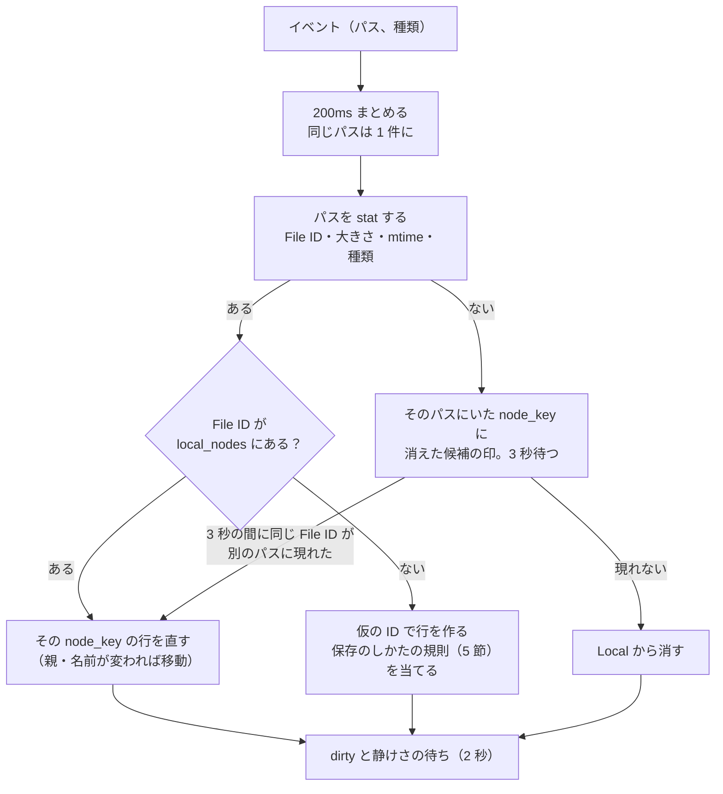
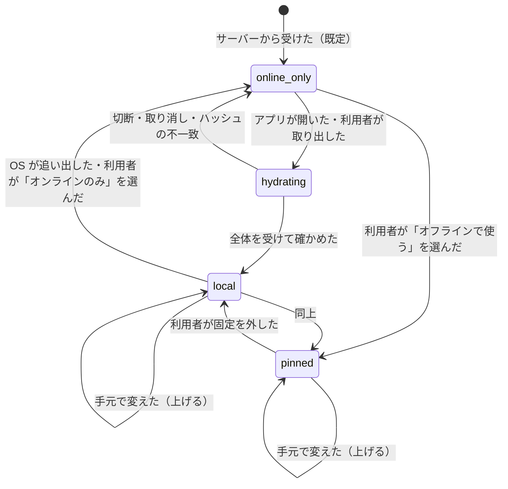

# File System Integration: Dropbox

`sync-core` と OS のファイルシステムの境目を決める。手元の変化の観測（Windows の ReadDirectoryChangesW、macOS の File Provider、イベントの溢れと走査し直し）、移動の検出（File ID・項目の ID）、アプリの保存のしかたの扱い、プレースホルダーと取り出し・追い出し、名前の対応（NFC・NFD、大文字小文字、表せない名前）、無視するファイル、拡張属性とパーミッション、シンボリックリンクを扱う。

前提となる決定は、基盤（[ADR-0001](../decisions/0001-platform-and-stack.md)）、衝突のモデル（[ADR-0006](../decisions/0006-sync-conflict-model.md)）、ノードと名前（[ADR-0008](../decisions/0008-node-identity-and-names.md)）、計画（[ADR-0009](../decisions/0009-planner-dirty-set-and-ordering.md)）、意図の記録（[ADR-0010](../decisions/0010-local-state-db-and-intent-log.md)）。この文書で決めたことは次の ADR にある。

| ADR | 決定 |
| --- | --- |
| [0015](../decisions/0015-local-change-observation-and-move-detection.md) | 手元の変化は、Windows では ReadDirectoryChangesW を手がかりにして File ID で Local を直し、macOS では File Provider の呼び出しを手がかりにする。イベントが溢れたら、その部分を走査し直す。移動は File ID・項目の ID で結び、結べない削除は 3 秒待ってから削除とする。「一時のファイルに書いて置き換える」保存は、元のノードの中身の変更として扱う |
| [0016](../decisions/0016-placeholders-and-hydration-policy.md) | macOS は File Provider の replicated の拡張、Windows は Cloud Files API のプレースホルダーを使う。新しい端末の既定はオンラインのみ。取り出しはファイルの全体（部分の取り出しはしない）。「オフラインで使う」は固定で、OS の追い出しの対象にしない。本システムからは自動で追い出さない |
| [0017](../decisions/0017-local-names-and-unsyncable-items.md) | 手元の名前は OS のバイト列のまま持ち、`name_key` で比べる。表せない名前・同じ `name_key` の 2 つ目・シンボリックリンク・固定の無視の一覧は「同期しない項目」として状態に出す。属性は実行の属性だけを同期し、拡張属性・ACL・タグは同期しない |

## 1. 目的と範囲

- 扱う：
  - 手元の変化の観測と、イベントの溢れ・スリープからの復帰での走査し直し
  - 移動の検出、アプリの保存のしかた（置き換え、ロックのファイル）
  - macOS の File Provider と Windows の Cloud Files API のプレースホルダー、取り出し・追い出し・固定
  - 手元の名前とサーバーの名前の対応、表せない名前、大文字小文字だけの名前の変更
  - 無視するファイル、拡張属性・パーミッション、シンボリックリンク・ハードリンク、長いパス
- 扱わない：
  - 計画・衝突・意図の記録（[sync-engine.md](sync-engine.md)）
  - プロセスの形と資源の配り方（[desktop-client.md](desktop-client.md)）
  - `name_key` の作り方そのもの（[ADR-0008](../decisions/0008-node-identity-and-names.md)）
  - ブロックの取り出しと組み立て（[block-storage.md](block-storage.md)）

## 2. 本家と OS の形（確かめたこと）

いずれも 2026-10-09 に確認。

| 項目 | 内容 | 出典 |
| --- | --- | --- |
| Windows の監視 | ReadDirectoryChangesW は、内部の溜めが溢れると溜めの中身を捨て、返す大きさを 0 にする。全部を記録できなかったときは `ERROR_NOTIFY_ENUM_DIR` で失敗し、ディレクトリーを列挙して変化を求めるよう求める。ネットワーク越しの監視では溜めは 64 KB まで | Microsoft Learn, [ReadDirectoryChangesW](https://learn.microsoft.com/en-us/windows/win32/api/winbase/nf-winbase-readdirectorychangesw) |
| Windows のプレースホルダー | Windows 10 1709 からの Cloud Files API。状態は、プレースホルダー・完全なファイル（必要なら OS が中身を捨てうる）・固定した完全なファイル（オフラインで使えることが保証される）の 3 つ。取り出しの方針はアプリとエンジンの方針の大きいほう。中核のフィルターは NTFS だけ | Microsoft Learn, [Build a Cloud Sync Engine that Supports Placeholder Files](https://learn.microsoft.com/en-us/windows/win32/cfapi/build-a-cloud-file-sync-engine) |
| Windows の手元の変化 | 完全なファイルが手元で変わったら、エンジンがサービスへ知らせてマージを決める（サンプルはディレクトリーの監視で検出する） | 同上 |
| macOS の File Provider | 本家の File Provider を使うバージョンは macOS 12.5 以降が要る | Dropbox Help Center, [Dropbox on File Provider](https://help.dropbox.com/installs/dropbox-for-macos-support) |
| macOS の名前 | APFS は名前の正規化の形を保ったまま、正規化の違いを区別せずに引ける。HFS+ は NFD で持つ（Apple は古い文書としている） | Apple, [APFS Guide の FAQ](https://developer.apple.com/library/archive/documentation/FileManagement/Conceptual/APFS_Guide/FAQ/FAQ.html) |
| 本家の名前 | パスは大文字小文字を区別しない。名前の大文字小文字はできるだけ保つ | [HTTP API documentation](https://www.dropbox.com/developers/documentation/http/documentation) |

- **未検証**（`placeholder-platform-survey` で確かめる）：
  - File Provider の replicated の拡張の呼び出しの形（作成・変更・削除の呼び出し、`baseVersion`、変化の列挙と合図、取り出しと追い出し）、拡張のメモリーの上限、拡張が落ちたときに OS が未通知の変化を呼び直すか。Apple の文書の本文を、この文書の時点で取得できなかった。
  - Cloud Files API でプレースホルダーを同期のルートの外へ移したときの振る舞い、長いパスの扱い。
- 本家の無視するファイルの一覧、シンボリックリンク・拡張属性の扱いは、公式の資料で確かめなかった（**未検証**）。

## 3. 要件と NFR

| NFR | この領域での要件 |
| --- | --- |
| NFR-004 | 監視の取りこぼし・溢れ・スリープ・クラッシュの後も、走査し直しで Local を正しく作り直す。移動を削除と作成に取り違えない |
| NFR-008 | 静かなときにファイルシステムを周期的に走査しない。最初の走査（SSD、100 万ファイル）10 分以内。保存から送信の開始まで p95 3 秒 |
| K5 | 名前の試験の集まりの全場面で、名前の重複・ループ・消し合い 0 件 |

## 4. 手元の変化の観測

### 4.1 OS ごとの入口

[ADR-0015](../decisions/0015-local-change-observation-and-move-detection.md) で決める。

| OS | 同期のルート | 変化の入口 | ノードの ID |
| --- | --- | --- | --- |
| Windows 10 1709 以降（NTFS） | Cloud Files API の同期のルート（`%USERPROFILE%\<Brand>`） | ReadDirectoryChangesW（同期のルートの全体、溜め 1 MiB、非同期）。Cloud Files の呼び出し（取り出しの要求、削除・名前の変更の知らせ）も手がかりにする | File ID（`FILE_ID_INFO` の 128 ビット） |
| macOS 13 以降（APFS） | File Provider の領域 | File Provider の拡張の呼び出し（作成・変更・削除） | File Provider の項目の ID（＝ `node_id`、手元で作ったものは OS が付けた ID を仮の ID に結ぶ） |

- macOS では、同期のルートの中の変化を FSEvents で見ない。File Provider の領域では、OS が項目の ID と変わった項目を知らせる。FSEvents は使わない（**本家の構成は未検証**）。
- macOS の最低のバージョンを 13 にするのは、本家が求める 12.5 より 1 つ上で、`placeholder-platform-survey` で確かめる対象を絞るため（[desktop-client.md](desktop-client.md) の 3 節）。
- イベントは「どこかが変わった」の手がかりにだけ使う。Local の行は、手がかりのパスを `stat`（File ID・大きさ・`mtime`・`ctime`・種類）して作る。イベントの中身（名前、操作の種類）を信じて Local を直さない。

### 4.2 イベントから Local へ

- 消えた候補を 3 秒待つのは、同期のルートの中の移動が、別々のイベント（消えた・現れた）で届くことがあるため。待つ間は計画に入れない。
- 同期のルートの外から入ったファイル（外から移した）は、新しい File ID なので作成になる。外へ出したファイルは、3 秒たっても現れないので削除になる（消しすぎの止めの対象。[sync-engine.md](sync-engine.md) の 10 節）。

### 4.3 走査し直し

| きっかけ | 範囲 |
| --- | --- |
| ReadDirectoryChangesW が 0 バイトを返した・`ERROR_NOTIFY_ENUM_DIR` | 同期のルートの全体 |
| 監視の溜めの処理が 5 秒以上遅れた | 同上 |
| スリープ・休止からの復帰、時計の大きな飛び | 同上（ただし低い優先度で） |
| クライアントの起動 | 同上（前回の終わりが正常でも行う） |
| File Provider が「変化を列挙し直せ」を求めた、拡張が落ちた（**未検証**の振る舞い） | 領域の全体 |
| 同期のルートの持ち主の印が合わない | 走査しない。同期を止める（[sync-engine.md](sync-engine.md) の 10.3 節） |

手順：

1. 走査の世代 `scan_gen` を上げる。
2. 深さ優先でディレクトリーを列挙し、各項目を `stat` する。1 秒に 5,000 項目を上限にし、利用者の操作の妨げにならない速さにする（100 万ファイルで約 3.5 分）。
3. 項目ごとに File ID で `local_nodes` を引き、違いがあれば直して `dirty` を付ける。`scan_gen` を書く。
4. 最後に、`scan_gen` が古いままの Local の行を消す（消えたもの）。
5. 走査の間に届いたイベントは、走査の後に当てる。

- 走査し直しは Synced を変えない。だから、溢れた間に起きた削除も、Synced と比べて正しく「手元で消した」と判断できる（[ADR-0006](../decisions/0006-sync-conflict-model.md)）。
- ハッシュは、`(File ID, 大きさ, mtime, ctime)` が Synced と違うファイルだけ取り直す。

## 5. アプリの保存のしかた

| 保存のしかた | 観測 | 扱い |
| --- | --- | --- |
| その場の上書き | 同じ File ID の大きさ・`mtime` の変化 | 中身の変更 |
| 一時のファイルに書いて置き換える（`ReplaceFile`、`rename(tmp, P)`） | P の File ID が新しくなり、元の File ID は消えるか別の名前（`~WRL0001.tmp` など）へ移る | 2 秒の窓の中で、P にいたノード X の File ID が消え（か無視の名前へ移り）、P に新しい File ID が現れたら、新しいファイルを **X の中身の変更** とする（`node_key` を保つ） |
| 元を退避名へ移し、新しいものを P に作り、退避を消す（Office） | 上と同じ形が 3 つのイベントに分かれる | 同上 |
| ロックのファイル（`~$名前.docx`、`.~lock.名前#`） | 作成と削除 | 無視の一覧（8.3 節）。同期しない |
| 書き込みの途中の大きなファイル | 大きさが増え続ける | 静けさの待ち（[sync-engine.md](sync-engine.md) の 6.4 節） |

- 置き換えを中身の変更として扱うのは、バージョン履歴と共有リンクを同じノードに続けるためである。削除と作成として扱うと、履歴とリンクが切れる。

## 6. プレースホルダー

### 6.1 状態

[ADR-0016](../decisions/0016-placeholders-and-hydration-policy.md) で決める。

| 状態 | Windows の Cloud Files | macOS の File Provider |
| --- | --- | --- |
| `online_only` | プレースホルダー | 中身のない項目（**未検証**の呼び名） |
| `local` | 完全なファイル（OS が捨てうる） | 取り出した項目（OS が追い出しうる） |
| `pinned` | 固定した完全なファイル | 「ダウンロードしたままにする」の指定（**未検証**） |

- 新しい端末の既定は `online_only`（[architecture/README.md](README.md) の 6 節）。手元のフォルダーを持つ端末から移る（既存の中身を同期のルートへ入れる）ときは、手元にある中身を `local` として扱い、送らずに済むものはハッシュで結び付ける。
- フォルダー単位の「オフラインで使う」は、子孫をすべて `pinned` にし、後から足されたものも `pinned` で取り出す。

### 6.2 取り出し

- 取り出しはファイルの全体にする。Windows はエンジンの取り出しの方針を「全体」にする。アプリが部分の取り出しを求めても、方針の大きいほうが採られる（Microsoft Learn の資料）。macOS も全体を渡す。
- 取り出しの要求を受けたら、block-storage の領域の組み立て（手元のブロックの索引にあるブロックを写し、ないものを取る）で一時のファイルを作り、`content_sha256` を確かめてから OS に渡す。
- 取り出しは優先度の最も高い転送にする（[sync-engine.md](sync-engine.md) の 8 節）。
- オフラインのときの取り出しは、すぐに失敗を返す（アプリを待たせない）。状態の表示に「オフラインのため開けません」を出す。
- 取り出しの途中の切断は、確かめたブロックを手元のブロックの索引に残し、再開で残りだけを取る。

### 6.3 追い出し

- 本システムからは、`local` を自動で `online_only` に戻さない（MVP）。利用者の操作と、OS の空き容量の不足での追い出しだけにする。
- 手元で変えてまだ上げていないファイルは、追い出しを拒む（Windows は追い出しの要求に失敗を返す。macOS の振る舞いは**未検証**）。

### 6.4 OS の違いと寄せ方

| 項目 | macOS（File Provider） | Windows（Cloud Files） | 本システム |
| --- | --- | --- | --- |
| 手元の木の持ち主 | OS が領域の木を持ち、変化を拡張に知らせる（**未検証**の詳細） | 普通の NTFS のフォルダー。エンジンが監視する | どちらも Local を `sync-core` に持ち、計画は同じ |
| 移動の検出 | OS が項目の ID で知らせる | File ID で結ぶ（4.2 節） | 結んだ後は同じ |
| 衝突の検出 | OS が `baseVersion` を渡す（**未検証**） | なし（エンジンが決める） | `baseVersion` は手がかりにだけ使い、決定表で決める |
| 名前の制限 | APFS（255 UTF-8 バイト、`/` と NUL 以外） | NTFS（予約の名前、使えない文字、末尾の空白とピリオド） | 8 節 |

## 7. 例

### 7.1 大文字小文字を区別しないボリュームでの、大文字小文字だけの名前の変更

**Windows の端末 W で `report.xlsx` を `Report.xlsx` にする。**

1. ReadDirectoryChangesW が古い名前と新しい名前の組を知らせる。どちらのパスも `stat` すると同じ File ID が返る（大文字小文字を区別しないので古い名前でも引ける）。
2. Local の行は File ID で引けるので、`node_key` X の `name` を `Report.xlsx` に直す。`name_key` は変わらない（`report.xlsx`）。
3. 計画：`Lc = place`（名前だけ）、`Rc = none`。`move`（同じ親、名前 `Report.xlsx`、`base_node_ver`）を送る。
4. サーバー：同じノードの名前の変更として受ける。一意の検査は自分自身を除いて行う（[ADR-0008](../decisions/0008-node-identity-and-names.md)）。

**macOS の端末 M がその変化を受ける。**

1. `list/continue` で X の `upsert`（名前 `Report.xlsx`）を受ける。Remote の `name` が変わる。
2. 計画：`Rc = place`、`Lc = none`。手元の操作：名前の変更。File Provider には、項目の名前の変化として渡す。
3. 大文字小文字だけの変更で、手元に `report.xlsx` と `Report.xlsx` の 2 つができることはない。名前の変更の往復も起きない（`name_key` が同じで、Synced が新しい名前に進むため）。

**大文字小文字を区別する APFS のボリュームで、`a.txt` と `A.txt` を同じフォルダーに作った。**

- 先に Local に入った `a.txt` を同期する。`A.txt` は同じ `name_key` の 2 つ目として `unsyncable`（理由 `name_collision`）にし、状態の表示に出す。黙って消さない（[ADR-0008](../decisions/0008-node-identity-and-names.md)）。利用者が名前を変えれば同期する。

### 7.2 macOS の NFC・NFD の名前

**NFD の名前を作るアプリで、`が.txt` を保存した。** 手元の名前のバイト列は NFD（「か」＋濁点、`E3 81 8B E3 82 99`）。

1. Local の `local_name` に NFD のバイト列をそのまま持つ。`name` は NFC（`E3 81 8C`）、`name_key` も NFC から作る。
2. `create` で、サーバーへは NFC の名前を送る。
3. Windows の端末は NFC の名前で手元に作る。macOS の他の端末も NFC の名前で作る。

**同じファイルを、NFC で名前を返すアプリで開いて保存した。**

- 項目の ID（File ID）は同じ。手元の名前のバイト列が NFC に変わって見えても、NFC が Synced の `name` と同じなので、名前の変化とみなさない。手元の名前を書き換えない（往復を起こさない。[ADR-0008](../decisions/0008-node-identity-and-names.md)）。

**NFC の `が.txt` と NFD の `が.txt` を同じフォルダーに作った（APFS は区別せずに引くが、両方作れる場合）。**

- `name_key` が同じなので、2 つ目を `unsyncable`（`name_collision`）にする。

**サーバーで他の端末が `が.txt` を `がぎ.txt` に変えた。** 手元の NFD の名前のファイルを、NFC の新しい名前に変える。以後、手元の名前は NFC になる（サーバーからの名前の変更は NFC で書く）。

### 7.3 Windows で表せない名前

macOS で `会議:議事録.txt` と `CON.txt` が作られた。

- Windows の端末は、Remote の 2 つの行を、手元に作らない。Local に `unsyncable`（理由 `invalid_char`・`reserved_name`）の行を作り、状態の表示に「同期できない名前 2 件」と出す。サーバーの名前は変えない。
- Synced には「手元にない、表せない」として入れる。計画は、これを削除と見なさない。
- 他の端末で名前が `会議-議事録.txt` に変われば、Windows の端末は普通に取り出す。

## 8. 名前と同期しない項目

[ADR-0017](../decisions/0017-local-names-and-unsyncable-items.md) で決める。

### 8.1 名前の対応

- 手元の名前（OS が返すバイト列。Windows は UTF-16 を UTF-8 に直したもの）を `local_name` に持つ。比べるのは `name_key` だけ（[ADR-0008](../decisions/0008-node-identity-and-names.md)）。
- 手元で、Windows の UTF-16 の不正な列（対にならないサロゲート）を含む名前は、UTF-8 に直せないので `unsyncable`（`invalid_encoding`）にする。

### 8.2 同期しない項目の理由のコード

| 理由のコード | 当たるもの | 方向 |
| --- | --- | --- |
| `invalid_char` | Windows の `<>:"/\|?*`、制御文字 | サーバー → Windows |
| `reserved_name` | `CON`・`PRN`・`AUX`・`NUL`・`COM1`〜`COM9`・`LPT1`〜`LPT9`（拡張子つきも） | 同上 |
| `trailing_space_dot` | 末尾の空白・ピリオド | 同上 |
| `path_too_long` | Windows で 32,767 UTF-16 単位を超えるパス、macOS で 1,024 バイトを超えるパス | サーバー → 手元 |
| `name_too_long` | NFC で 255 バイトを超える名前（サーバーが拒む） | 手元 → サーバー |
| `name_collision` | 同じ親の同じ `name_key` の 2 つ目 | 手元 → サーバー |
| `invalid_encoding` | UTF-8 に直せない名前 | 手元 → サーバー |
| `symlink` | シンボリックリンク、ジャンクション | 手元 → サーバー |
| `ignored` | 8.3 節の固定の一覧 | 手元 → サーバー |
| `special_file` | ソケット、FIFO、デバイス | 手元 → サーバー |

- Windows で 260 文字を超えるパスは同期する（エンジンは `\\?\` の形で扱う）。ただし状態の表示に「一部のアプリで開けない場合があります」を出す。

### 8.3 無視する一覧

固定の一覧（`ignored`）。同期のルートのどこにあっても、上げず、取り出さない。

| 名前 | 理由 |
| --- | --- |
| `.DS_Store`、`.localized` | macOS の Finder の設定 |
| `Thumbs.db`、`desktop.ini`、`ehthumbs.db` | Windows のエクスプローラーの設定 |
| `~$*`（Office のロック）、`.~lock.*#` | アプリのロック |
| `.<brand>.cache`（同期のルート直下） | 本システムの作業のフォルダー |
| `Icon\r` | macOS のフォルダーのアイコン |

- 利用者が足せる無視の規則は MVP では持たない（[sync-engine.md](sync-engine.md) の 17 節）。

### 8.4 属性・リンク

| 対象 | 扱い |
| --- | --- |
| 実行の属性（POSIX の `x`） | 同期する（`exec_bit`）。Windows では手元に表さず、サーバーの値を保つ |
| 拡張属性、Finder のタグ、ACL、所有者、Windows の属性（読み取り専用を除く） | 同期しない。手元の値は、置き換えのときに残さない |
| 読み取り専用 | 同期しない。読み取り専用のファイルの置き換えは、属性を外して置き、元に戻す |
| シンボリックリンク、ジャンクション | たどらない。上げない（`symlink`） |
| ハードリンク | それぞれ独立のファイルとして同期する。サーバーでは重複排除でブロックを重ねる |
| macOS のパッケージ（`.app`、`.bundle` など） | 普通のフォルダーとして同期する |
| 空のファイル | ブロックを持たないファイルとして同期する（[ADR-0002](../decisions/0002-chunking-and-block-addressing.md)） |

## 9. 障害のときの振る舞い

| 障害 | 振る舞い |
| --- | --- |
| イベントの溢れ | 4.3 節の走査し直し |
| 監視の開始の失敗（権限、ボリュームが NTFS でない） | 同期を止め、理由を出す。Cloud Files は NTFS だけ（Microsoft Learn の資料） |
| 同期のルートがネットワークのドライブ | 同期のルートに選べない（設定の時点で拒む） |
| File Provider の拡張が落ちた | OS が拡張を起動し直す（**未検証**）。起動のたびに領域の全体の走査し直し |
| アンチウイルスがファイルを開いたまま | 置き換えを待つ（[sync-engine.md](sync-engine.md) の 13 節） |
| 取り出しの途中の切断 | 6.2 節 |
| 時計の変更 | `mtime` の比べで、違えばハッシュを取り直すだけ。判断は変わらない |

## 10. 上限

| 項目 | 値 |
| --- | --- |
| ReadDirectoryChangesW の溜め | 1 MiB（ローカルのボリューム） |
| イベントのまとめ | 200ms |
| 消えた候補の待ち | 3 秒 |
| 走査の速さの上限 | 1 秒 5,000 項目 |
| 保存の置き換えの窓 | 2 秒 |
| パスの長さ | Windows 32,767 UTF-16 単位、macOS 1,024 バイト |
| 名前 | NFC で 255 バイト（[ADR-0008](../decisions/0008-node-identity-and-names.md)） |

## 11. テスト

決定表：

- **DT-FS-001（同期しない項目）**：8.2 節の理由のコード × OS。
- **DT-FS-002（保存のしかた）**：5 節の表の各行 × OS。
- **DT-FS-003（走査し直しのきっかけ）**：4.3 節の表。

性質ベーステスト（模型のファイルシステム。[quality.md](../quality.md) の 2.2.1 節 A）：

- **PROP-FS-001（走査し直しの一致）**：任意の操作の列とイベントの欠け・溢れの後、走査し直した Local が、イベントを欠けなく当てた Local と一致する。
- **PROP-FS-002（移動の保存）**：同期のルートの中の任意の移動は、イベントの分かれ方・順序によらず、同じ `node_key` の移動になる（削除と作成にならない）。
- **PROP-FS-003（置き換えの保存）**：一時のファイルに書いて置き換える保存は、同じ `node_key` の中身の変更になる。
- **PROP-FS-004（名前の往復なし）**：NFC・NFD・大文字小文字だけの違いを任意に混ぜた名前の操作の列で、静かになった後に名前の変更の操作が出ない。

ファイルシステムの端の場合の試験（実機。[quality.md](../quality.md) の 2.2.1 節 B）：7 節の例、8 節の各行、6 節の状態の遷移を、macOS（APFS の 2 種類のボリューム）と Windows（NTFS）で流す。

## 12. Story の候補

| Epic | Story | 中身 |
| --- | --- | --- |
| E5 | `placeholder-platform-survey` | 2 節の**未検証**の項目、6.4 節の差 |
| E5 | `fs-watcher-windows` | 4 節の Windows、走査し直し、移動の検出（ADR-0015。PROP-FS-001・002） |
| E5 | `fs-observer-macos` | 4 節の macOS（File Provider の呼び出しから Local へ）（ADR-0015） |
| E5 | `save-pattern-detection` | 5 節（DT-FS-002、PROP-FS-003） |
| E5 | `macos-file-provider` | 6 節の macOS（ADR-0016） |
| E5 | `windows-cloud-files` | 6 節の Windows（ADR-0016） |
| E5 | `name-mapping-and-unsyncable` | 7・8 節（ADR-0017。DT-FS-001、PROP-FS-004） |
| E5 | `fs-edge-case-suite` | 11 節の実機の場面 |

## 13. 未解決の問い

### 決定

2026-10-09 の既定案。`placeholder-platform-survey` と実機の試験で覆りうる。

- **macOS の入口**：File Provider の呼び出しだけで、FSEvents は使わない（ADR-0015）。
- **macOS の最低のバージョン**：13。
- **移動の待ち**：3 秒（ADR-0015）。
- **取り出し**：全体。自動の追い出しなし（ADR-0016）。
- **長いパス**：Windows で 260 文字を超えても同期する。
- **属性**：実行の属性だけ（ADR-0017）。
- **シンボリックリンク**：同期しない（ADR-0017）。

### 持ち越し

| 問い | いつ・どう決めるか |
| --- | --- |
| File Provider の replicated の拡張の呼び出し・メモリーの上限・落ちたときの振る舞い | E5 の前の `placeholder-platform-survey`（**未検証**） |
| Cloud Files のプレースホルダーを同期のルートの外へ移したときの振る舞い | 同上 |
| 空き容量の不足での本システムからの自動の追い出し | MVP の後、利用者の声で |
| 利用者が足せる無視の規則 | 同上（[sync-engine.md](sync-engine.md) の 17 節） |
| Finder のタグの同期 | 同上 |
| 本家のシンボリックリンク・拡張属性の扱い | 公式の資料で確かめなかった（**未検証**） |

## 14. quality.md・runbooks・data-model への項目

### quality.md

- 2.2.1 節 B の「ファイルの種類」の場面に、8.2 節の理由のコードの全行と、5 節の保存のしかたを足す。
- PROP-FS-001〜004 を E5 のリリースの基準にする。

### runbooks

- `client-regression.md` に、走査し直しの率の急増（OS の更新の直後）の見方を足す。

### data-model への項目

ローカルの状態の DB（[sync-engine.md](sync-engine.md) の 18 節の表に足す）。

| 表・列 | 中身 | 節 |
| --- | --- | --- |
| `local_nodes.local_name` | OS が返す名前のバイト列 | 8.1 |
| `local_nodes.file_id` | Windows の 128 ビットの File ID、macOS の File Provider の項目の ID。一意の索引 | 4.1 |
| `local_nodes.unsyncable` | 8.2 節の理由のコード | 8.2 |
| `local_nodes.hydration` | `online_only`・`hydrating`・`local`・`pinned` | 6.1 |
| `local_nodes.scan_gen` | 走査の世代 | 4.3 |
| `local_nodes.vanish_at` | 消えた候補の印（単調な時計） | 4.2 |

サーバーの側：

| 対象 | 中身 | 節 |
| --- | --- | --- |
| `nodes.exec_bit` | 実行の属性 | 8.4 |

## 出典

いずれも 2026-10-09 に確認。

- Microsoft Learn, [ReadDirectoryChangesW function](https://learn.microsoft.com/en-us/windows/win32/api/winbase/nf-winbase-readdirectorychangesw)
- Microsoft Learn, [Build a Cloud Sync Engine that Supports Placeholder Files](https://learn.microsoft.com/en-us/windows/win32/cfapi/build-a-cloud-file-sync-engine)
- Apple, [APFS Guide の FAQ](https://developer.apple.com/library/archive/documentation/FileManagement/Conceptual/APFS_Guide/FAQ/FAQ.html)
- Dropbox Help Center, [Dropbox on File Provider](https://help.dropbox.com/installs/dropbox-for-macos-support)
- Dropbox Developers, [HTTP API documentation](https://www.dropbox.com/developers/documentation/http/documentation)
