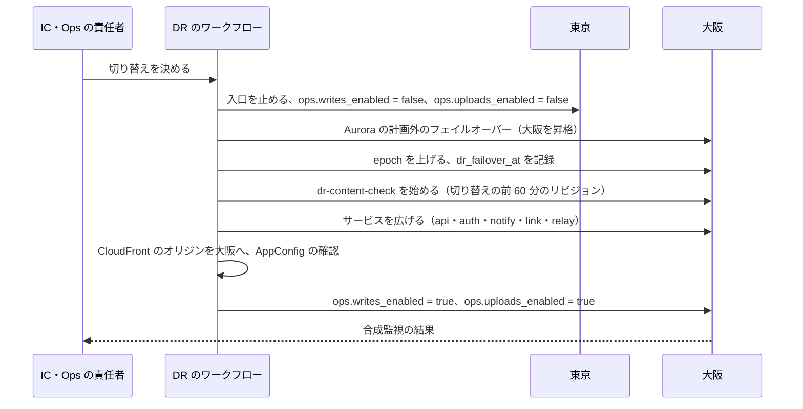

# Infrastructure: Dropbox

AWS のアカウントとネットワーク、入口（Web・API・認証・合図・共有リンク・利用者の中身・クライアントの配布）、S3 への直接の送受信、外への送信、サービスの分け方と配置、データの置き場所、バックアップと災害復旧（大阪、`epoch`、中身の待ちと送り直しの依頼）、段階を上げる基準、S2 のシャード、S3 のセル、Terraform、保存 1 TB と配信 1 TB の費用を決める。他の題材（Google Calendar・Linear の [infrastructure.md](infrastructure.md)）を土台にし、この題材に固有の事情だけを変える（[ADR-0001](../decisions/0001-platform-and-stack.md)）。

| ADR | 決定 |
| --- | --- |
| [0047](../decisions/0047-accounts-network-ingress-and-service-placement.md) | アカウントとネットワークは他の題材の形に、クライアントの署名と配布の `release` のアカウントを足す。中身はサーバーを通さず、アップロードは S3 の東京のリージョンのエンドポイントへ直接、ダウンロードは `content.<brand>usercontent.<domain>` の CloudFront から。利用者のファイルを開くタスクは、外への経路も S3・DB・KMS の権限も持たない sandbox のサブネットに置く。Webhook の送信は egress のサブネットから出す |
| [0048](../decisions/0048-disaster-recovery-and-content-pending.md) | 大阪のウォームスタンバイへ人の判断で切り替え、書き込みを止めてから昇格し、`epoch` を上げる。切り替えの前 60 分に確定したリビジョンのブロックを大阪で確かめ、欠けたものを「中身の待ち」にして、持つ端末に送り直しを求める。戻すときは計画の switchover で、`epoch` を上げない |
| [0049](../decisions/0049-stage-up-criteria-sharding-and-cells.md) | 段階を上げる基準を、Aurora の writer・容量・表の大きさ・commit のピーク・接続の数で決め、上限の 70% で次の段階の準備を始める。S2 は名前空間の持ち主のテナントを単位に Aurora のクラスタへ分け、ディレクトリを小さなクラスタに置く。S3 はセルとリージョン |

ログ・メトリクス・SLI は [observability.md](observability.md)、負荷と台数の根拠は [capacity.md](capacity.md)、CI とリリースは [delivery.md](delivery.md)、暗号化と統制は [security.md](security.md) にある。

数値のうち「初期見積もり」と書いたものは、E13 の負荷試験の前の仮の値である。AWS の仕様で確かめていないものは「未検証」と書く。

## 1. AWS アカウントの構成

ADR-0047。

| アカウント | OU | 中身 |
| --- | --- | --- |
| management | Root | Organizations、SCP、IAM Identity Center、請求 |
| security | Security | GuardDuty・Security Hub・Inspector の委任管理者、調査用のロール |
| log-archive | Security | 組織の CloudTrail、Config、VPC フローログ、アプリのログの長期の写し。Object Lock。東京 → 大阪へ写す |
| shared | Infrastructure | ECR（東京・大阪にレプリケーション）、Route 53（`<brand>.<domain>`、`<brand>usercontent.<domain>`）、Managed Grafana、Terraform の状態のバケット |
| edge | Infrastructure | CloudFront、WAF（CloudFront 用）、ACM（us-east-1）、CloudFront のログ |
| release | Infrastructure | クライアントの署名（HSM か書き出せない署名のサービスの鍵）、更新の目録と成果物のバケット、配布の CloudFront（`dl.<brand>.<domain>`）。署名のジョブは 2 人の承認（[delivery.md](delivery.md) の 5 節） |
| dev、staging | Workloads/NonProd | 開発・検証。staging は本番と同じ構成を最小の台数で持ち、負荷試験と DR の訓練の時だけ広げる |
| synthetics | Workloads/NonProd | 合成監視の端末（macOS は EC2 Mac、Windows は EC2）、CI の実機の機械 |
| prod | Workloads/Prod | 本番（東京と大阪） |

- **SCP**（Workloads の OU）：東京・大阪以外のリージョンを禁止する（CloudFront・WAF・ACM・IAM の us-east-1 のグローバルなサービスを除く）。データの所在の約束は法務の L5 で確定する。CloudTrail・Config・GuardDuty の停止、KMS の鍵の削除の予約・無効化、S3 の Object Lock の解除、`blocks` のバケットのバージョニングの停止を、break-glass のロール以外に禁止する。
- 本番のデータを本番のアカウントの外に出さない。匿名化したコピーも作らない（他の題材と同じ）。

## 2. ネットワーク

### 2.1 prod の VPC（東京・大阪で同じ形）

| サブネット | 置くもの | 外への経路 |
| --- | --- | --- |
| public | `alb-app`、`alb-notify`、NAT ゲートウェイ | Internet Gateway |
| private | `api`、`link`、`auth`、`notify`、`relay`、`worker-*`（下の 2 つを除く） | NAT → Network Firewall（宛先の許可リスト） |
| egress | `webhook-sender` | 専用の NAT（Elastic IP を公開する）。VPC エンドポイントと isolated への経路を持たない |
| sandbox | `preview-renderer`、`text-extractor`、`content-scanner` | **なし。** S3 のゲートウェイのエンドポイント（方針で `blocks`・`blocklists` の GET と `previews` の PUT だけ）と、インターフェースのエンドポイント（ECR、CloudWatch Logs、ジョブの SQS）だけ |
| isolated | Aurora、ElastiCache（Valkey）、OpenSearch | なし |

- VPC エンドポイント（private）：S3、SQS、SNS、KMS、Secrets Manager、AppConfig、CloudWatch Logs、X-Ray、ECR、STS、SES（API）、Firehose。
- sandbox のタスクのロールは、イメージの取得、ログの出力、自分のジョブのキュー（`preview-renderer` は `preview-jobs-interactive`・`preview-jobs`、`text-extractor` は `text-extract-jobs`、`content-scanner` は `scan-jobs`）の受信・削除・見えない時間の変更と、結果のキュー `sandbox-results` への送信だけ。S3・DB・KMS の権限を持たない。入出力はジョブごとの署名つき URL で行う（[ADR-0032](../decisions/0032-sandboxed-preview-pipeline.md)、[security.md](security.md) の 3.4 節）。SQS のエンドポイントの方針も、同じ範囲に絞る。
- セキュリティグループはサービスごとに入る側と出る側を明示する。

### 2.2 入口とホスト名

| ホスト名 | 入口 | 振り分け | オリジン |
| --- | --- | --- | --- |
| `www.<brand>.<domain>` | CloudFront＋WAF | 既定：Web の殻（ハッシュつきの資産） | S3（静的） |
| 同 | 同 | `/s/*`（共有リンク） | `alb-app` → `link` |
| `api.<brand>.<domain>` | CloudFront＋WAF | `/v1/*`（公開 API と自社のクライアントの API は同じ） | `alb-app` → `api` |
| `auth.<brand>.<domain>` | CloudFront＋WAF | ログイン、SSO、SCIM（`/scim/v2/*`）、OAuth、端末の登録 | `alb-app` → `auth` |
| `notify.<brand>.<domain>` | CloudFront＋WAF | WebSocket | `alb-notify` → `notify` |
| `content.<brand>usercontent.<domain>` | CloudFront（署名つき URL、クッキーなし） | `/b/*`（ブロック）、`/p/*`（プレビュー）、`/x/*`（組み立てたダウンロード。[ADR-0054](../decisions/0054-server-assembled-downloads.md)）、`/l/*`（共有リンクから出す中身。国外のエッジの扱いを分けるための接頭辞。[shared-links.md](shared-links.md) の 11 節） | OAC で S3 `blocks`・`previews`・`exports`（東京）。`/b/*` は大阪の写しを第 2 のオリジンにする（6.3 節）。OAC は SSE-KMS のオブジェクトを読める（鍵の方針で CloudFront の配信に復号を許す。[Restrict access to an Amazon S3 origin](https://docs.aws.amazon.com/AmazonCloudFront/latest/DeveloperGuide/private-content-restricting-access-to-s3.html)、2026-10-09 に確認） |
| `dl.<brand>.<domain>` | CloudFront（release のアカウント） | インストーラー、更新の目録と成果物 | S3（release） |
| `<brand>-incoming-apne1.s3.ap-northeast-1.amazonaws.com` | S3 のリージョンのエンドポイント（直接） | 署名つきの PUT（`incoming` だけ） | — |

- **アップロードは CloudFront を通さない。** クライアントは署名つきの PUT で S3 の東京のエンドポイントへ直接送る（[ADR-0007](../decisions/0007-block-storage-layout-on-s3.md)）。利用者は日本にいて、Transfer Acceleration の利得は小さいと見込む（E2 の `presigned-upload-poc` で測る）。バケットの方針で `aws:SecureTransport` を必須にする。
- **WebSocket**（`notify`）：CloudFront → `alb-notify` → `notify`。CloudFront の WebSocket の扱い（流れない接続を切る時間など）は、Linear の [infrastructure.md](infrastructure.md) の 2.2 節で 2026-09-28 に確かめた事実を、Google Calendar の題材を通じて引き継ぐ。`notify` は 30 秒ごとに ping を送る。ALB のアイドルの時間切れは 120 秒。
- **WAF**（CloudFront）：共通のルール、IP の評判、IP ごとのレート制限。会社の NAT の後ろに 1,000 台の端末がいる前提で、IP ごとの上限は粗くし、細かい上限はアプリでトークンごとに数える。

| 入口 | IP ごとの上限（5 分） |
| --- | --- |
| `auth`（ログインの送信） | 300 |
| `api` | 100,000 |
| `www/s/*` | 3,000。当たらないトークンの引きは `link` が数え、IP で 1 分 30 回を超えたら WAF の IP の集合へ 1 時間載せる（[ADR-0028](../decisions/0028-shared-link-abuse-controls.md)） |
| `notify`（接続） | 6,000 |

### 2.3 外への送信

| 送信 | 経路 | 理由 |
| --- | --- | --- |
| Webhook（`webhook-sender`） | egress → 専用の NAT | 利用者の決める宛先。送信の直前に名前を引き、私的・リンクローカル・メタデータのアドレスへの接続を拒む（SSRF） |
| IdP のメタデータ・JWKS（SSO） | private → NAT → Network Firewall（チームが登録した IdP のホスト名を許可リストへ自動で足す） | [accounts-and-teams.md](accounts-and-teams.md) の 10.2 節 |
| モバイルの通知（APNs・FCM） | private → NAT → Network Firewall（配信のサービスのホスト名の許可リスト） | 通知の中身は ID だけ。外国にある第三者への提供は法務の L4 |
| メール | VPC エンドポイント（SES の API） | — |
| ハッシュの一覧の取得（中身の検査） | private → NAT → Network Firewall（指定の機関のホスト名） | 法務の L2 の後（[security.md](security.md) の 6 節） |

## 3. ECS サービスと配置

ADR-0047。すべて Fargate（ARM64）。サービスごとにタスク定義と IAM ロールを分ける。台数は [capacity.md](capacity.md) の 5 節。

| サービス | 役割 | DB のロール | スケールの指標 |
| --- | --- | --- | --- |
| `api` | 公開 API と自社のクライアントの API。木の読み出し、commit、`list/continue`、共有、復元、管理、署名つき URL。`packages/committer` | `app`（RLS） | CPU 50%、要求数 |
| `link` | 共有リンクの解決 | `app`、`link_resolver`（X2） | CPU |
| `auth` | ログイン、SSO、SCIM、OAuth、端末の登録と更新、端末の状態の確かめ | `auth`（RLS の外のスキーマ） | CPU |
| `notify` | WebSocket の終端と合図、取り消しの合図での切断 | なし（Valkey だけ） | タスクあたりの接続の数（目標 20,000） |
| `relay` | outbox → Valkey の合図、SNS・SQS | `relay`（X4） | outbox の最古の行の年齢 |
| `worker-block-verifier` | `incoming` の確かめ、写し、索引 | `blocks` | キューの最古の年齢 |
| `worker-block-gc`、`worker-block-scrubber` | GC、照合 | `maintenance`（X3） | 時刻と残り |
| `worker-preview-orchestrator` | プレビュー・抽出・検査のジョブ、署名つき URL の発行、出力の確かめ | `app` | キューの年齢 |
| `preview-renderer`・`text-extractor`・`content-scanner`（sandbox） | 利用者のファイルを開く変換 | なし | キューの年齢 |
| `worker-indexer` | OpenSearch へ名前と本文 | `app` | キューの年齢 |
| `worker-restore-runner` | 復元と巻き戻しのバッチ | `app` | ジョブの残り |
| `worker-mass-change-detector` | 一斉の変更の検知 | `app` | キューの年齢 |
| `webhook-sender`（egress） | Webhook の送信 | なし | 同時の送信の数 |
| `worker-export-builder` | フォルダーの ZIP と 1 つの URL のダウンロードの組み立て（[ADR-0054](../decisions/0054-server-assembled-downloads.md)）。`blocks`・`blocklists` の読み出しと `exports` の書き込みだけ | なし | キューの年齢 |
| `worker-*`（その他） | `mailer`、`mobile-push`、`quota`、`activity-exporter`、`lifecycle`、`tenant-purge`、`slo-aggregator`、`dr-content-check` | 用途ごと | キューの年齢 |

- `packages/committer` はサービスではなくライブラリで、`api` と `worker-restore-runner`・`lifecycle`・`tenant-purge` の中で動く（[ADR-0001](../decisions/0001-platform-and-stack.md)）。
- 要求を受けるサービス（`api`・`link`・`auth`・`notify`）は中身を通さない。`worker-block-verifier` は S3 の中の写しと属性の読み出しだけを行う（[ADR-0007](../decisions/0007-block-storage-layout-on-s3.md)）。中身を読むのは、sandbox の変換と `worker-export-builder`（解釈せずにつなぐだけ）に限る（[ADR-0054](../decisions/0054-server-assembled-downloads.md)）。

### 3.1 AZ の障害への備え

- 各サービスは、残る 2 AZ で最大負荷をさばける台数を常に持つ。平常の使用率を 2/3 以下に保つ（[capacity.md](capacity.md) の 5 節）。
- `notify` の 1 AZ の喪失で、その AZ の接続（約 3 分の 1）が再接続する。クライアントは 0〜30 秒の乱数で待ち、`list/continue` で取り戻す（[capacity.md](capacity.md) の 3 節）。

## 4. データの置き場所（S1）

| 置き場所 | 中身 | 冗長 |
| --- | --- | --- |
| Aurora PostgreSQL 18 | ノード、リビジョン、`ns_journal`、ブロックの索引と参照、名前空間と共有、共有リンク、アカウントとチーム、outbox、監査（管理と安全） | 3 AZ、Global Database で大阪へ |
| S3 `blocks`・`blocklists` | ブロックの中身、大きな一覧 | バージョニング、大阪へ CRR（Replication Time Control） |
| S3 `incoming` | 送られたばかりのブロック | 東京・大阪のそれぞれに置く。写さない（2 日で消える） |
| S3 `previews` | プレビューのキャッシュ | 写さない（作り直せる） |
| S3 `exports` | 組み立てたダウンロード（1 日） | 写さない |
| S3 `audit` | 監査の写し、活動の事象 | Object Lock、大阪へ CRR |
| OpenSearch | 名前と本文の索引 | 3 AZ。大阪への写し方は [search.md](search.md) で決める（作り直せる写し） |
| ElastiCache（Valkey） | 合図の pub/sub、レート制限、取り消しの一覧、キャッシュ | クラスタモード、レプリカ。失ってよい（取り消しの一覧は DB にもある） |
| SQS・SNS | 検証、プレビュー、索引、Webhook、通知のキュー | 東京だけ。大阪は空のキュー（outbox から作り直す） |
| AppConfig | `release.*`、`ops.*`、`content_scan_policy`、クライアントの最低のバージョン | 東京・大阪に同じ構成（Terraform）。切り替えは両方に当てる |
| Secrets Manager | カーソルの HMAC の鍵、CloudFront の署名の鍵 ほか | 大阪へレプリカ |

## 5. S1 の構成（初期見積もり）

根拠は [capacity.md](capacity.md)。

| リソース | 構成 |
| --- | --- |
| Aurora PostgreSQL 18 | writer `db.r8g.16xlarge` × 1、reader 同型 × 2（別の AZ）。I/O-Optimized。大阪の Global Database の二次に reader `db.r8g.8xlarge` × 1 |
| RDS Proxy | 使わない（`SET LOCAL` で接続が固定される。他の題材と同じ） |
| ElastiCache（Valkey） | `cache.r7g.xlarge`、クラスタモード 6 シャード × （プライマリ 1＋レプリカ 1）。大阪は小さい別のクラスタ（空） |
| OpenSearch | [search.md](search.md) の大きさ（E9 の `search-sizing-poc`） |
| ECS | [capacity.md](capacity.md) の 5.2 節（東京 平均 約 450 vCPU） |
| NAT ゲートウェイ | private × 3、egress × 3（東京）。大阪も同じ |
| 大阪（ウォームスタンバイ） | 各サービスを最小 1〜2 タスク、Aurora の二次に reader 1 台、Valkey は小さい別のクラスタ、`incoming` のバケット、`dr-content-check` は止めておく |

## 6. バックアップと災害復旧

ADR-0048。

### 6.1 バックアップ

| 対象 | 方法 | 保持 |
| --- | --- | --- |
| Aurora | 自動バックアップ（PITR）＋ AWS Backup の連続バックアップ。Vault Lock | 35 日 |
| S3 `blocks`・`blocklists` | バージョニング（古いバージョンを 30 日）、大阪への CRR。別のバックアップは取らない（S3 の耐久性に任せ、論理の守りは GC の猶予と照合。[ADR-0007](../decisions/0007-block-storage-layout-on-s3.md)） | 30 日 |
| S3 `audit` | Object Lock、大阪への CRR | 法務の L3・L6 |
| `previews`、`incoming`、Valkey、SQS、OpenSearch | バックアップしない | 作り直せる・失ってよい |

### 6.2 AZ の障害（NFR-005：RPO 0、RTO 5 分）

| 部品 | 動き | 目安 |
| --- | --- | --- |
| Aurora | 別の AZ の reader へ自動でフェイルオーバー。コミット済みを失わない | 通常 60 秒未満（他の題材で確認） |
| フェイルオーバーの間 | `api` は 503 と `Retry-After`。クライアントは差分を読んでから commit を送り直す（commit は冪等のキーを持たないが、条件つきなので二重に確定しない。[metadata-and-journal.md](metadata-and-journal.md) の 4.6 節） | 数十秒 |
| `notify` | その AZ の接続が切れ、残る AZ へ再接続 | 数十秒 |
| S3・CloudFront | AZ の障害の影響を受けない前提（リージョンのサービス） | — |
| ECS | 残る AZ でタスクを起動し直す | 数分 |

### 6.3 リージョンの障害（NFR-005：メタデータ RPO 1 分・RTO 1 時間、中身 RPO 15 分）

切り替えは人（IC と Ops の責任者）の判断で行い、手順はワークフローで自動化する。手順は runbook `disaster-recovery.md`。



- **Aurora**：Global Database の計画外のフェイルオーバーで、複製の遅れの分を失いうる。古い一次の書き込みを止める仕組みは最善努力である。これらの事実は Linear の [infrastructure.md](infrastructure.md) の 6.3 節で 2026-09-28 に確かめたもの（[Using switchover or failover in Amazon Aurora Global Database](https://docs.aws.amazon.com/AmazonRDS/latest/AuroraUserGuide/aurora-global-database-disaster-recovery.html)）を、Google Calendar の題材を通じて引き継ぐ。`AuroraGlobalDBRPOLag` が 10 秒を 5 分超えたら呼び出す（[runbooks/README.md](../runbooks/README.md) の 4 節）。
- **`epoch` を必ず上げる**（[ADR-0005](../decisions/0005-namespace-journal-and-cursors.md)）。失った commit の番号が、大阪で別の操作に振り直されるため。古い `epoch` のカーソルはすべて 409 `reset` になり、端末は木を読み直して Synced と比べる。手元の変更は失わない（[ADR-0006](../decisions/0006-sync-conflict-model.md)）。取り直しの殺到の広げ方は [capacity.md](capacity.md) の 3.3 節。
- **outbox**：大阪の `relay` は、昇格した DB の outbox の未送信の行から流し直す。Worker と Webhook は重複を受けても同じ結果になる（冪等）。
- **中身**：6.4 節。
- **ダウンロード**：`content` の CloudFront は `/b/*` に東京と大阪の 2 つのオリジンを持ち、東京が 5xx を返せば大阪の写しから読む（オリジンのフェイルオーバー）。SSE-KMS のバケット 2 つと OAC と鍵の方針の組み合わせで動くかは E1 の `edge-and-waf` で確かめる（**未検証**）。
- **東京へ戻す**：計画作業として Aurora の switchover（RPO 0）で戻す。番号が保たれるので `epoch` を上げない。大阪で受けたブロックは、大阪 → 東京の CRR の規則（平常から設定しておく）で東京へ写る。双方向の CRR で写しが送り返されない（ループしない）ことは、E1 の `s3-buckets-baseline` で確かめる（**未検証**）。

### 6.4 中身の待ちと送り直しの依頼

メタデータ（RPO 1 分）と中身（CRR、目標 15 分）の遅れの差で、大阪のメタデータが、大阪にまだないブロックを指すことがある（[ADR-0007](../decisions/0007-block-storage-layout-on-s3.md) の DR）。

1. `dr-content-check` が、`dr_failover_at` の前 60 分に確定したリビジョン（RTC の目標 15 分の 4 倍）のブロックを、大阪の `blocks` で HeadObject して確かめる。60 分より前のブロックは届いているとみなし、照合（[ADR-0007](../decisions/0007-block-storage-layout-on-s3.md) の毎週の突き合わせ）で後から確かめる。
2. 欠けたブロックを `content_pending_blocks(tenant_id, hash, since)` に入れ、それを指すリビジョンを `content_state = pending` にする。
3. `pending` のリビジョンのダウンロードは 503 `content_pending`（`Retry-After`）を返す。Web と API は「復旧中」を示す。
4. 端末は `epoch` の取り直しで木を読み直す。サーバーは `pending` のノードに印を付けて返す。手元のファイルの `content_sha256` がリビジョンと同じ端末は、欠けたブロックをアップロードの流れ（[block-storage.md](block-storage.md) の 4 節）で送る。`block-verifier` が確かめて `live` にし、全部そろったリビジョンを `ready` に戻す。
5. 東京が戻ったら、東京の `blocks` から残りを写す（CRR が終わるのを待つか、写しのジョブ）。
6. 東京を失い、どの端末も持たない中身は失われる。そのリビジョンは `lost` にし、前のリビジョンを残したまま持ち主に知らせる。数を SEV1 の報告に入れる（NFR-005 の中身の RPO 15 分を超えたものを数える）。

- 確かめの量：S1 の 1 時間の新しいデータは、送信の平均 450 MB/秒（[capacity.md](capacity.md) の 1 節）で約 1.6 TB、ブロックの平均を 4 MiB〜1 MiB として約 40 万〜160 万個。HeadObject を 1,000 並行（1 回 50ms と見て 1 秒 2 万）で、数十秒〜2 分（本システムの見込み。E13 の `dr-failover-drill` で測る）。

### 6.5 論理的な破損と、テナントの戻し

- **利用者の誤操作・ランサムウェア**：製品の巻き戻し（[versions-and-recovery.md](versions-and-recovery.md)）で戻す。DB の PITR を使わない。
- **全体の破損**（誤ったマイグレーション）：PITR で隔離した VPC に新しいクラスタを戻し、失われた行だけを `packages/committer` の保守の経路で書き戻す。差分としてジャーナルに載せ、`epoch` を上げない。本番のクラスタを上書きしない。
- **ブロックの GC の誤り**：S3 の古いバージョンから戻す（runbook `block-integrity-incident.md`、[ADR-0007](../decisions/0007-block-storage-layout-on-s3.md)）。
- **索引の破損**：OpenSearch は Aurora から作り直す。

### 6.6 大阪の待機の構成の確認

| 確認 | 頻度 |
| --- | --- |
| 大阪からの合成監視（大阪の `alb-app` へ直接、読み出しだけ） | 1 分 |
| CRR の遅れ（`ReplicationLatency`、`OperationsPendingReplication`） | 1 分（15 分を超えたら呼び出し） |
| 大阪の Terraform の plan に差分がない | 日次 |
| ECR・Secrets Manager のレプリカ、大阪の KMS の鍵の方針 | 日次 |
| 大阪の AppConfig（`ops.*`、クライアントの最低のバージョン）が東京と同じ | 5 分 |
| Fargate の vCPU のクォータが大阪でも東京と同じ | 月次 |
| 大阪の `blocks` の抜き取りの読み出し（CloudFront の第 2 のオリジン経由） | 1 時間 |

## 7. 段階を上げる判断の基準

ADR-0049。月次のキャパシティのレビュー（[capacity.md](capacity.md) の 7 節）で次を見る。どれかが基準を超えたら、次の段階の準備を始める。移行に四半期ほどかかるので、上限の手前で始める。

| 指標 | S1 の上限（想定） | 準備を始める基準 |
| --- | --- | --- |
| Aurora の writer の CPU（ピークの p95） | 70% | 50% が 4 週続く |
| commit のピーク | 5,000 件/秒 | 3,500 件/秒 |
| Aurora のクラスタの容量 | 256 TiB（PostgreSQL 17.5 以降の上限） | 100 TiB |
| 最大の表（分割の 1 つ） | 32 TiB（PostgreSQL の表の上限） | 10 TiB |
| ノード | 25 億 | 17.5 億 |
| `notify` の同時の接続 | 40 万 | 28 万 |
| 1 名前空間の commit（最大の名前空間） | 1 秒 200 件（[ADR-0005](../decisions/0005-namespace-journal-and-cursors.md)） | 上位の名前空間が 1 秒 140 件に 1 日 1 時間以上 |

- Aurora の容量と表の上限は [Quotas and constraints for Amazon Aurora](https://docs.aws.amazon.com/AmazonRDS/latest/AuroraUserGuide/CHAP_Limits.html)（2026-10-09 に確認）。
- 1 名前空間の上限は段階では解けない。チームのフォルダーを分ける案内と 429 で扱う（[ADR-0005](../decisions/0005-namespace-journal-and-cursors.md)）。

## 8. S2 のシャードと S3 のセル

ADR-0049。

### 8.1 S2

- **名前空間の持ち主のテナントを単位に、Aurora のクラスタへ分ける。** テナントのすべての名前空間・ブロックの索引・参照は同じクラスタにある。ブロックの索引と `ns_block_refs` はテナントの中で閉じる（[ADR-0003](../decisions/0003-dedupe-scope-and-privacy.md)）ので、commit はクラスタをまたがない。
- **ディレクトリのクラスタ**（小さい、Global Database）：`accounts`・`auth` のスキーマ、`ns_directory`（名前空間 → テナント → クラスタ）、`ns_access`（主体 → 名前空間）、`link_tokens`。[ADR-0004](../decisions/0004-tenancy-namespaces-and-rls.md) の RLS の外の表を、ここへ移す。
- **クラスタをまたぐ読み出し**：`list/continue` は、カーソルの名前空間をクラスタごとにまとめて並べて読む。カーソルの形は変えない（[ADR-0005](../decisions/0005-namespace-journal-and-cursors.md) の `positions` は名前空間ごと）。
- **クラスタをまたぐ書き込み**：名前空間をまたぐ移動とコピーは、既にバッチの非同期の操作（[metadata-and-journal.md](metadata-and-journal.md) の 6 節）で、各段が冪等なので、クラスタをまたいでもそのまま動く。重複排除の写し（X1）は、写し元のクラスタの参照を読む。
- Relay、`block-gc`、`block-scrubber`、`quota` はクラスタごとに動かす。
- テナントのクラスタの移し方は、S2 の着手の前に別の ADR で決める。

### 8.2 S3

- スタック一式をセルとして複製し、テナントをセルとリージョンに固定する。ディレクトリだけを全体で持つ。
- 入口のホスト名は変えず、`api` のエッジでトークンからセルを引いて振り分ける（トークンにセルの ID を含める形を [ADR-0041](../decisions/0041-accounts-auth-and-device-credentials.md) の接頭辞の後に足す）。
- 別のセルのテナントの共有フォルダーの読み書きは、セルの間の内部の経路で、持ち主のセルへ送る。海外のリージョンはテナントをリージョンに固定する形で足す（E19、法務の L5）。

## 9. CI/CD と Terraform

### 9.1 CI/CD

他の題材と同じ（GitHub Actions、OIDC、1 回ビルドして同じイメージを昇格させる、prod は Ops の承認）。この題材に固有の関門とクライアントの配布は [delivery.md](delivery.md)。

```
main へのマージ ─▶ ビルド ─▶ shared の ECR ─▶ dev ─▶ staging（E2E・k6・シミュレーター）─▶ prod（Ops の承認）
クライアント ─▶ release のアカウントで署名 ─▶ dl.<brand>.<domain>（段階の配布。delivery の領域）
```

### 9.2 Terraform の配置

開発リポジトリの `infra/` に置く。状態ファイルは shared のバケット（東京、大阪へ写す）。

| ルートモジュール | 中身 | 変更の承認 |
| --- | --- | --- |
| `org/` | Organizations、SCP、Identity Center | Ops の責任者＋セキュリティの担当 |
| `security/` | GuardDuty、Security Hub、Config、log-archive | 同上 |
| `global/edge` | CloudFront（`www`・`api`・`auth`・`notify`・`content`）、WAF、ACM、Route 53。変数 `active_region` | Ops（WAF のルールは `security:sensitive`） |
| `release/` | 配布のバケットと CloudFront、署名の鍵 | Ops＋セキュリティの担当 |
| `regional/network` | VPC、サブネット（sandbox を含む）、NAT、Network Firewall、VPC エンドポイント | Ops |
| `regional/data` | Aurora、Valkey、OpenSearch、S3（CRR、ライフサイクル、Object Lock）、SQS、SNS | Ops。状態を持つリソースの削除・置き換えは CI で拒否 |
| `regional/keys` | KMS の鍵と鍵の方針 | `security:sensitive` |
| `regional/services` | ECS のクラスタ、サービス、タスク定義、ALB、オートスケール | Ops |
| `regional/config` | AppConfig（`ops.*`、`content_scan_policy`、最低のバージョン） | Ops |

- plan のポリシー検査（OPA・Checkov）で、次を拒否する。
  - isolated・sandbox のサブネットの経路表に NAT・IGW
  - sandbox のタスクのロールに S3・DB・KMS の権限、自分のジョブのキューの受信・削除・見えない時間の変更と `sandbox-results` への送信より広い SQS の権限
  - sandbox の S3 のゲートウェイのエンドポイントの方針が、決めたバケットと操作より広い
  - egress のサブネットから VPC エンドポイント・isolated への経路
  - クライアントへの署名の役割が `incoming` の PUT より広い（[ADR-0007](../decisions/0007-block-storage-layout-on-s3.md)）
  - `worker-export-builder` のロールが `blocks`・`blocklists` の `GetObject` と `exports` の `PutObject` より広い、`exports` のライフサイクルが 1 日より長い（[ADR-0054](../decisions/0054-server-assembled-downloads.md)）
  - `blocks`・`blocklists` のバージョニングの停止、古いバージョンのライフサイクルが 30 日未満
  - 人のロールに `blocks` の `GetObject`・`kms-blocks` の復号（[security.md](security.md) の 9 節）
  - Aurora のパラメーターに `rds.global_db_rpo` を置く（他の題材と同じ）

## 10. 費用（保存 1 TB と配信 1 TB）

[architecture/README.md](README.md) の 2.1 節の式に、AWS の公開の価格（AWS Price List API、S3 の東京・大阪は 2026-09-28 の公開分、データ転送は 2026-09-16 の公開分、CloudFront は 2026-10-03 の公開分。いずれも 2026-10-09 に取得）を入れる。1 TB は 1,000 GB とする。

### 10.1 保存 1 TB・月（物理、重複排除の後）

| 項目 | 前提 | USD |
| --- | --- | --- |
| 東京の保存（Intelligent-Tiering） | 層の割合を高頻度 30%・低頻度 50%・アーカイブの即時 20% と仮定（**本システムの想定**。E13 の後に実測で置き換える）。単価は高頻度 0.023（500 TB を超える分）、低頻度 0.0138、アーカイブの即時 0.005 USD/GB・月 | 14.80 |
| Intelligent-Tiering の監視 | 平均 4 MiB のブロックで約 23.8 万オブジェクト × 0.0025 USD/1,000 | 0.60 |
| 128 KiB 未満のブロック（Standard） | バイトの 2% と仮定。Intelligent-Tiering との差 | 0.16 |
| 大阪の写し（Glacier Instant Retrieval、小さいものは Standard） | 0.005 USD/GB・月 | 5.40 |
| CRR の転送 | 新しいデータは保存の月 9%（1 日 0.3%）。東京 → 大阪の転送 0.09 USD/GB ＋ Replication Time Control 0.015 USD/GB | 9.45 |
| 要求 | 新しいブロックの `incoming` の PUT・写し（各 0.0047 USD/1,000）、HeadObject × 2、大阪の Glacier Instant Retrieval の PUT（0.02 USD/1,000） | 0.65 |
| 削除の後の 30 日 | 削除を保存の月 3% と仮定。東京と大阪 | 0.60 |
| **合計** | | **約 32** |

- [architecture/README.md](README.md) の 2.1 節の仮の予算（30〜45 USD）の中に入る。最も大きいのは東京の保存と CRR の転送である。
- 小さなファイルの多いテナントでは、要求とオブジェクトの数が増える（[block-storage.md](block-storage.md) の 9 節の表で 40 倍）。パックは S2 の前に決める（[ADR-0020](../decisions/0020-small-block-packing-for-s2.md)）。
- Glacier Instant Retrieval は 90 日より前に消すと残りの日数を課金される。GC で消したブロックの大阪の分にかかる（小さいので上に含めた）。

### 10.2 配信 1 TB

| 項目 | 単価 | 1 TB あたり USD |
| --- | --- | --- |
| CloudFront の日本からの外への転送 | 最初の 10 TB 0.114、次の 40 TB 0.089、次の 100 TB 0.086、次の 350 TB 0.084、次の 524 TB 0.080、次の 4 PB 0.070、5 PB を超える分 0.060 USD/GB | 60〜114（量で下がる） |
| CloudFront の HTTPS の要求 | 0.012 USD/10,000。1 TB で約 23.8 万要求 | 0.29 |
| キャッシュに当たらなかった S3 の GET | 0.00037 USD/1,000 | 0.09 |
| S3 から CloudFront への転送 | 0 USD | 0 |

- S1 の月の配信を約 3.9 PB（平均 1.5 GB/秒。[capacity.md](capacity.md) の 1 節）とすると、階段の単価の加重の平均は約 **73 USD/TB**、月 約 29 万 USD。保存（13 PB × 32 USD = 月 約 42 万 USD）と並ぶ大きな項目である。
- アップロード（S3 への受信）の転送は無料。要求の費用は 10.1 節に含めた。
- CloudFront の個別の価格の契約で下がる余地があるかは確かめていない（**未検証**。PM・Ops が交渉）。
- 費用の全体（Aurora、ECS、OpenSearch を含む月の合計）は [capacity.md](capacity.md) の 6 節。

## 11. Story の候補

| Epic | Story | 中身 |
| --- | --- | --- |
| E1 | `aws-accounts-and-network` | 1 節と 2.1 節（sandbox・egress を含む）、Network Firewall、VPC エンドポイント。データの所在は法務：L5 |
| E1 | `edge-and-waf` | 2.2 節の CloudFront の配信、WAF、ホスト名、`content` のオリジンのフェイルオーバーの確かめ。国外のエッジの扱いは法務：L5 |
| E1 | `ecs-services-skeleton` | 3 節のサービスとロール |
| E1 | `terraform-root-modules` | 9.2 節とポリシー検査 |
| E1 | `s3-buckets-baseline` | バケット、CRR（双方向の規則の確かめ）、TLS の強制の確かめ |
| E1 | `osaka-warm-standby` | 5 節の大阪の骨格、Global Database、6.6 節の確認 |
| E5 | `release-account-and-distribution` | `release` のアカウント、`dl.<brand>.<domain>`、署名の鍵の置き場所（delivery と共同） |
| E13 | `dr-failover-workflow` | 6.3 節のワークフロー、`epoch`、`dr-content-check`、中身の待ちと送り直し（ADR-0048） |
| E13 | `dr-failover-drill` | DR の訓練（staging 四半期、本番の switchover 年 1 回） |
| E13 | `cost-baseline` | 10 節の層の割合と単価を請求の実績で置き換える |

## 12. 未解決の問い

### 決定

2026-10-09 の既定案。E1 と E13 で覆りうる。

- **入口**：アップロードは S3 へ直接、ダウンロードは `content` の CloudFront、`release` のアカウントを分ける（ADR-0047）。
- **sandbox**：外への経路も S3・DB・KMS の権限も持たない（ADR-0047）。
- **DR**：ウォームスタンバイ、`epoch`、中身の待ちと端末からの送り直し（ADR-0048）。
- **S2・S3**：名前空間の持ち主のテナントでのクラスタ、ディレクトリ、セル（ADR-0049）。

### 持ち越し

| 問い | いつ・どう決めるか |
| --- | --- |
| データの所在の約束、国外のエッジのキャッシュ | **法務の確認待ち：L5** |
| `content` のオリジンのフェイルオーバーと SSE-KMS・OAC の組み合わせ | E1 の `edge-and-waf`（**未検証**） |
| 双方向の CRR で写しがループしないこと | E1 の `s3-buckets-baseline`（**未検証**） |
| CloudFront のアクセスのログから `/s/` のトークンを落とせるか | E6 の `shared-links`（**未検証**） |
| Transfer Acceleration の要否 | E2 の `presigned-upload-poc` |
| DR の取り直しを、失った commit を見た端末だけに絞る（[ADR-0005](../decisions/0005-namespace-journal-and-cursors.md) の `epoch` の改良） | Dev のテックリード。ADR-0005 の更新が要る（[capacity.md](capacity.md) の 3.3 節） |
| Intelligent-Tiering の層の割合、CloudFront の個別の価格 | E13 の `cost-baseline` |
| S2 のテナントの移し方 | S2 の着手の前に別の ADR |

## 13. quality.md・runbooks・data-model への項目

### quality.md

- 2.2.1 節 D の DR の訓練に、6.4 節の流れ（切り替えの前 60 分の確かめ、`pending`、端末からの送り直し、`lost` の数）を足す。E13 の合否基準：DR の訓練で、メタデータ RPO 1 分・RTO 1 時間、`lost` が 0（訓練では東京が戻る前提）。
- IAM・バケット・サブネットのポリシー検査（9.2 節）を E1 の合否基準に足す。

### runbooks

- `disaster-recovery.md`：6.3・6.4 節のワークフロー、`dr-content-check` の進み具合、`lost` の扱いと知らせ、東京へ戻す手順。
- `cdn-origin-failover.md`：`content` の東京のオリジンの障害の見分けと、大阪からの配信の確かめ。

### data-model への項目

| 表・置き場所 | 中身 | 節 |
| --- | --- | --- |
| `platform_state`（保守用のスキーマ） | `epoch` の全体の値、`dr_failover_at`、切り替えの記録 | 6.3 |
| `content_pending_blocks`（テナントの表） | `(tenant_id, hash)`、`since`、状態 | 6.4 |
| `revisions` に足す列 | `content_state`（`ready`・`pending`・`lost`） | 6.4 |
| `ns_directory`・`tenant_directory`（S2 からディレクトリのクラスタ） | 名前空間 → テナント → クラスタ、テナント → クラスタ・セル・リージョン | 8 |
| AppConfig | `ops.writes_enabled`、`ops.uploads_enabled` | 6.3 |

## 出典

いずれも 2026-10-09 に確認（他の題材から引き継いだものは、その日付を書いた）。

- AWS Price List API（[Using the bulk API](https://docs.aws.amazon.com/awsaccountbilling/latest/aboutv2/using-the-aws-price-list-bulk-api.html)）の `AmazonS3`（ap-northeast-1・ap-northeast-3）、`AWSDataTransfer`（ap-northeast-1）、`AmazonCloudFront`、`AmazonRDS`（ap-northeast-1）、`AmazonECS`（ap-northeast-1）の公開の価格
- AWS, [Quotas and constraints for Amazon Aurora](https://docs.aws.amazon.com/AmazonRDS/latest/AuroraUserGuide/CHAP_Limits.html)：Aurora PostgreSQL 17.5 以降のクラスタの上限 256 TiB、PostgreSQL の表の上限 32 TiB
- AWS, [Best practices design patterns: optimizing Amazon S3 performance](https://docs.aws.amazon.com/AmazonS3/latest/userguide/optimizing-performance.html)：接頭辞ごとに 1 秒 3,500 の PUT・COPY・POST・DELETE、5,500 の GET・HEAD。広がる間は 503 が出る
- AWS, [Using switchover or failover in Amazon Aurora Global Database](https://docs.aws.amazon.com/AmazonRDS/latest/AuroraUserGuide/aurora-global-database-disaster-recovery.html)（Linear の [infrastructure.md](infrastructure.md) で 2026-09-28 に確認）
