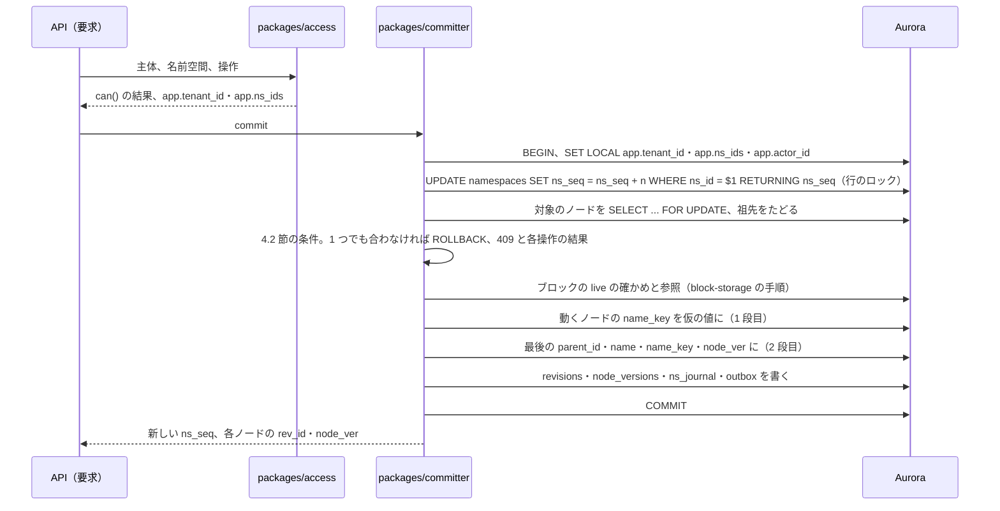
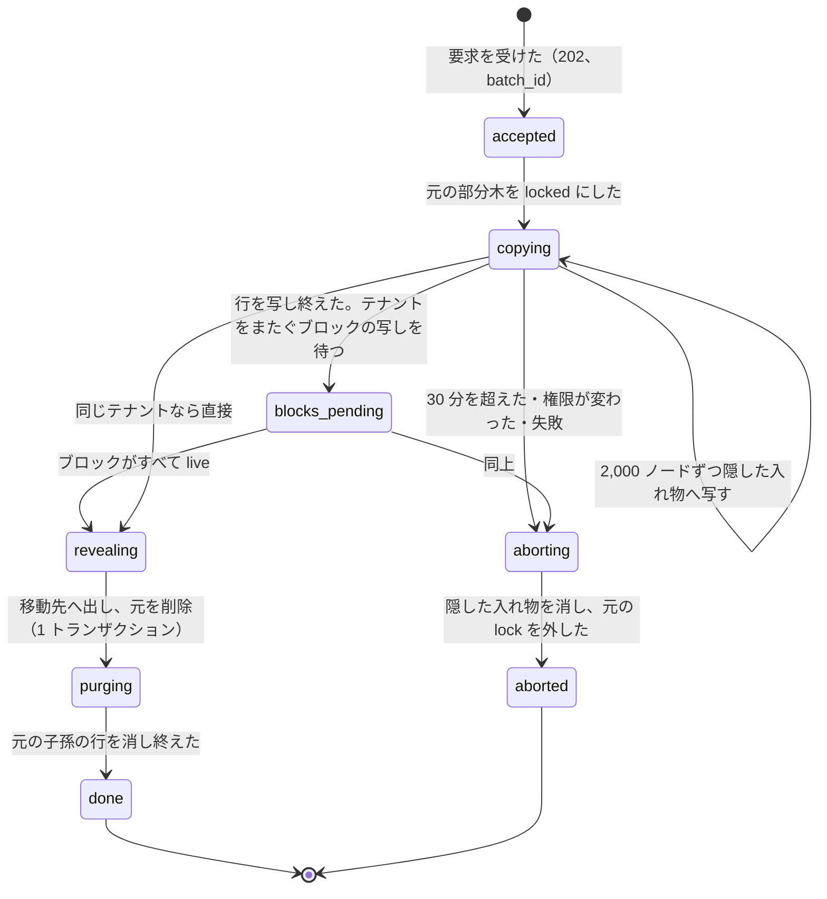

# Metadata and Journal: Dropbox

サーバーのメタデータとジャーナルを決める。ノード・リビジョン・ジャーナルの表、`packages/committer` の手順と条件、操作の種類と意味、名前空間をまたぐ移動とコピー、大きな木の一覧のページング、ジャーナルの分割と保持、カーソルの取り直しを扱う。

前提となる決定は、テナントと RLS（[ADR-0004](../decisions/0004-tenancy-namespaces-and-rls.md)）、ジャーナルとカーソル（[ADR-0005](../decisions/0005-namespace-journal-and-cursors.md)）、衝突のモデル（[ADR-0006](../decisions/0006-sync-conflict-model.md)）、ノードと名前（[ADR-0008](../decisions/0008-node-identity-and-names.md)）。この文書で決めたことは次の ADR にある。

| ADR | 決定 |
| --- | --- |
| [0021](../decisions/0021-committer-operations-and-conditions.md) | commit の操作は `create`・`update`・`move`・`delete`・`undelete` の 5 つ。ファイルの削除は `base_rev` と `base_node_ver`、フォルダーの削除は `base_seq`（読み終えた番号の後に子孫が変わっていない）を条件にする。フォルダーの削除と `undelete` は根の 1 行だけを変え、子孫は祖先で決まる。1 つの commit の置き場所の変化は、`name_key` を仮の値にしてから最後の値にする 2 段で当てる。ジャーナルに、利用者に返さない `purge` の操作を足す |
| [0022](../decisions/0022-cross-namespace-batch-move-and-copy.md) | 名前空間をまたぐ移動とコピーは、バッチの操作にする。移動先の名前空間の隠した入れ物に 2,000 ノードずつ写し、最後に 1 つのトランザクションで、移動先へ出す（子孫の一覧を読ませる印つき）と、元の削除（`moved_to` つき）を書く。移動の間、元の部分木への書き込みを 409 `subtree_locked` で待たせる。写した行のジャーナルは利用者に返さない |
| [0023](../decisions/0023-tree-listing-snapshot-and-journal-retention.md) | 木の一覧は `node_id` の順のページで、始めの番号（`snapshot_seq`）と終わりの番号（`listing_end_seq`）を返す。クライアントは一覧の後に `snapshot_seq` からジャーナルを当て、`listing_end_seq` まで読んでから親のない行を捨てる。ジャーナルは日の分割で 92 日を過ぎたら落とし、カーソルは最後の利用から 90 日で取り直しにする |

## 1. 目的と範囲

- 扱う：
  - `namespaces`・`nodes`・`revisions`・`ns_journal`・`ns_batches` の表の形
  - `packages/committer` の 1 回の commit の手順、条件、上限、応答
  - 操作の種類と意味（フォルダーの削除と子孫、`undelete`、`purge`）
  - 名前空間をまたぐ移動とコピー
  - 木の一覧（同期の最初、`mount`、取り直し）と、フォルダーの子の一覧のページング、パスの解決
  - ジャーナルの分割と保持、`floor_seq`、カーソルの取り直し
  - マウントのノード（`kind='mount'`、`mount_ns_id`）は普通のノードと同じ `name_key` の一意と移動の規則に従う。載せる・外すの意味と権限は [namespaces-and-sharing.md](namespaces-and-sharing.md) の 4.2 節（[ADR-0024](../decisions/0024-shared-folder-mounts-and-grants.md)）。
- 扱わない：
  - 時点の木と復元・巻き戻し・保持の期限（[versions-and-recovery.md](versions-and-recovery.md)。`node_versions` の表はそちら）
  - ブロックの参照・索引・必要なブロックの答え（[block-storage.md](block-storage.md)、[ADR-0003](../decisions/0003-dedupe-scope-and-privacy.md)）
  - `can()` と載せる・外すの権限（[namespaces-and-sharing.md](namespaces-and-sharing.md)）
  - 合図・long-poll・公開 API の形（[api-and-webhooks.md](api-and-webhooks.md)）
  - クライアントの計画（[sync-engine.md](sync-engine.md)）

## 2. 本家の形（確かめたこと）

いずれも 2026-10-09 に確認。

| 項目 | 内容 | 出典 |
| --- | --- | --- |
| 差分の取得 | `list_folder` でカーソルを返し、`list_folder/continue` で続きを取り、`list_folder/longpoll` で変化を待つ。Webhook はアカウントの一覧だけを持ち、アプリはカーソルで取りに来る | [Webhooks](https://docs.dropboxapi.com/dropbox-api/docs/webhooks)、[HTTP API documentation](https://www.dropbox.com/developers/documentation/http/documentation) |
| パスと ID | パスは大文字小文字を区別しない。ID は区別する。名前空間の相対のパスの考え方がある | [HTTP API documentation](https://www.dropbox.com/developers/documentation/http/documentation) |

- 本家の内部のメタデータの形、ジャーナル、カーソルの中身と有効の期間、名前空間をまたぐ移動の内部の手順は、公開の資料で確かめられなかった（**未検証**）。

## 3. 要件と NFR

| NFR | この領域での要件 |
| --- | --- |
| NFR-001 | 1 フォルダー 1,000 件までの読み出し p99 300ms。操作 100 件までの commit p99 500ms |
| NFR-002 | 確定から合図まで（outbox → Relay → Notify）p99 2 秒（伝播の 5 秒の内訳） |
| NFR-004 | 条件なしの上書きを持たない。削除が後から確定した変更を巻き込まない |
| NFR-010 | 変更 2,000 件以下の `list/continue` p99 1 秒。カーソルは最後の利用から 90 日。取り直しは期限切れ・`floor_seq` より古い・`epoch` の更新だけ（載せた名前空間の変更では取り直しにしない） |
| NFR-009 | 名前空間をまたぐ 10 万ファイルの移動 p95 10 分（この領域の目標。復元の 10 分にそろえる） |

## 4. `packages/committer`

### 4.1 commit の要求

```
commit {
  ns_id,
  base_seq,                 // クライアントがその名前空間を読み終えた番号（フォルダーの削除の条件）
  ops: [                    // 1〜1,000
    { op: "create",   temp_id, parent_id, name, is_folder, blocklist?, exec_bit? },
    { op: "update",   node_id, base_rev, blocklist, exec_bit? },
    { op: "move",     node_id, base_node_ver, parent_id, name },
    { op: "delete",   node_id, base_node_ver, base_rev? },   // ファイルは base_rev が必須
    { op: "undelete", node_id, base_node_ver }               // ファイルだけ
  ]
}
```

- `parent_id` は、同じ commit の `create` の `temp_id` を指してよい。
- `blocklist` は、ブロックの一覧（1,024 ブロック以下）か、アップロードのセッションの ID（大きなファイル。[block-storage.md](block-storage.md)）。

### 4.2 条件

[ADR-0021](../decisions/0021-committer-operations-and-conditions.md) で決める。

| 操作 | 条件 | 合わないときの 409 の理由 |
| --- | --- | --- |
| `create` | 親が見えている（削除されていない、祖先も削除されていない）。親の中に同じ `name_key` の見えているノードがない | `parent_missing`・`name_exists` |
| `update` | `rev_id = base_rev`。ノードと祖先が見えている | `rev_mismatch`・`deleted` |
| `move` | `node_ver = base_node_ver`。行き先の親が見えている。行き先に同じ `name_key` がない（自分を除く）。循環しない。深さ 256 段以内 | `node_ver_mismatch`・`name_exists`・`cycle`・`too_deep` |
| `delete`（ファイル） | `node_ver = base_node_ver` かつ `rev_id = base_rev` | `node_ver_mismatch`・`rev_mismatch` |
| `delete`（フォルダー） | `node_ver = base_node_ver`。`base_seq` の後に、その子孫に触れたジャーナルの行がない。`base_seq ≥ floor_seq` | `subtree_changed`・`reset` |
| `undelete`（ファイル） | `node_ver = base_node_ver`（削除の後の値）。親が見えている。同じ `name_key` がない | `node_ver_mismatch`・`parent_missing`・`name_exists` |
| どれも | ノードが名前空間をまたぐバッチの対象の部分木にない | `subtree_locked`（`Retry-After`） |

- ファイルの `delete` に `base_rev` を求めるのは、他の端末の中身の変更の後に確定した削除が、その変更を黙って巻き込まないためである（[sync-engine.md](sync-engine.md) の 11.1 節）。[ADR-0006](../decisions/0006-sync-conflict-model.md) は削除の条件を `base_node_ver` と書いており、この ADR で `base_rev` を足す。
- フォルダーの `delete` の `subtree_changed` は、決定表の 9（フォルダーの削除と、中への追加・変更）をサーバーで見つけるためにある。調べ方：その名前空間の `seq > base_seq` のジャーナルの行（多くは少ない）について、`node_id` の祖先をたどり、削除するフォルダーに当たるかを見る。祖先のたどりは 1 回の commit の中でキャッシュする。行が 10,000 を超えたら `subtree_changed` として返し、クライアントに読み直させる。

### 4.3 フォルダーの削除と子孫

- フォルダーの `delete` は、根の 1 行の `deleted_at` と `node_ver` だけを変える。子孫の行は変えない。子孫が見えるかは、祖先に削除があるかで決まる。
- ジャーナルには根の `delete` の 1 行だけを書く。読む側は、子孫も消えたとみなす。
- フォルダーの `undelete` は API に出さない（クライアントの計画では使わない。[sync-engine.md](sync-engine.md) の 6.2 節）。削除したフォルダーの復元は、[versions-and-recovery.md](versions-and-recovery.md) の復元の操作が、根の `undelete` を内部で使う。その時点の子孫（削除の前に個別に消されていなかったもの）がそろって戻る。ジャーナルには根の `upsert` を `subtree_listing` つきで 1 行書き、端末に子孫を一覧で読ませる（5.2 節）。
- 削除の理由を `deleted_reason`（`user`・`moved`・`rewind`・`restore_replaced`）に持つ。「削除したファイル」の一覧は `moved` を出さない。

### 4.4 1 回の commit の手順



- 1 つの commit は全部が通るか全部が通らない（[ADR-0005](../decisions/0005-namespace-journal-and-cursors.md)）。
- **2 段の置き場所**：1 段目で、動くノード（`move`・`delete`・`undelete`）の `name_key` を `'\x00' || node_id`（NUL は名前に使えないので、他の名前とぶつからない）にし、2 段目で最後の値にする。一意の索引（`(ns_id, parent_id, name_key) WHERE deleted_at IS NULL`）は、どの時点でも満たされる。名前の入れ替え（A↔B）や輪の形の移動を 1 つの commit で受けられる。
- **循環の検査**：動くフォルダーについて、行き先の親から祖先をたどり、自分に当たれば `cycle`。2 段目の後の状態で調べる。
- 足りないブロックがあれば、確定せずに「送れ」の一覧と署名つき URL を返す（[ADR-0003](../decisions/0003-dedupe-scope-and-privacy.md)、[block-storage.md](block-storage.md)）。名前空間の行のロックは、この判定の前に取らない（ブロックの照会を先に行い、ロックの時間を短くする）。

### 4.5 応答

| 結果 | 状態 | 中身 |
| --- | --- | --- |
| 確定 | 200 | `ns_seq`、操作ごとの `node_id`（`temp_id` の付け替え）・`rev_id`・`node_ver` |
| ブロックが足りない | 200（`need_blocks`） | ブロックごとの答え（[ADR-0003](../decisions/0003-dedupe-scope-and-privacy.md)） |
| 条件の不一致 | 409 | 合わなかった操作の番号、理由、そのノードの今の状態（読める範囲だけ） |
| 書き込みの上限 | 429 | `Retry-After` |
| 権限 | 403 | — |

### 4.6 冪等

commit に冪等のキーを持たせない。応答が届かずに送り直すと、条件が合わずに 409 になるか（変更・移動・削除）、`name_exists` になる（作成）。クライアントは差分を読んでから計画し直し、決定表の「そろった」の行で吸収する（[ADR-0010](../decisions/0010-local-state-db-and-intent-log.md)）。公開 API の利用者向けの冪等のキーが要るかは、[api-and-webhooks.md](api-and-webhooks.md) で決める。

### 4.7 上限

| 項目 | 値 |
| --- | --- |
| 1 回の commit の操作 | 1,000（[ADR-0005](../decisions/0005-namespace-journal-and-cursors.md)） |
| 1 名前空間の書き込み | 1 秒 200 commit（見込み。`namespace-write-throughput-poc`）。超えたら 429 |
| 名前空間の行のロックの保持 | 目標 p99 50ms。commit の文の時間切れ 2 秒 |
| フォルダーの削除の `subtree_changed` の調べ | `base_seq` の後の行 10,000 まで |
| 深さ | 256 段（[ADR-0008](../decisions/0008-node-identity-and-names.md)） |
| フォルダーの直下の子 | 上限を置かない。一覧はページで返す |

## 5. ジャーナル

### 5.1 行

[ADR-0005](../decisions/0005-namespace-journal-and-cursors.md) の行に、次の列を足す。

| 列 | 中身 |
| --- | --- |
| `node_ver` | 操作の後の置き場所のバージョン |
| `deleted_reason` | `delete` の理由 |
| `moved_to_ns`・`moved_to_seq` | 名前空間をまたぐ移動の元の `delete` に付ける |
| `moved_from_ns` | 移動先の `upsert` に付ける |
| `subtree_listing` | 真なら「このフォルダーの子孫を一覧で読め」（6 節） |
| `batch_id` | バッチの操作の行。利用者に返さない行の印（6・7 節） |
| `job_id` | 復元・巻き戻しの行（[versions-and-recovery.md](versions-and-recovery.md)） |
| `kind`・`mount_ns_id` | ノードの種類（`file`・`folder`・`mount`）と載せる名前空間。`is_folder` は `kind` から作る（[data-model.md](data-model.md) の D-2） |
| `on_behalf_of` | 管理者のアクセスの対象のメンバー（[ADR-0043](../decisions/0043-admin-roles-device-wipe-and-member-access.md)、[data-model.md](data-model.md) の D-9） |

`op` の値：`upsert`・`delete`・`mount`・`unmount`（[ADR-0005](../decisions/0005-namespace-journal-and-cursors.md)）に、`purge` を足す。`purge` は保持の期限・名前空間をまたぐ移動の後始末で行を消したことを表し、`list/continue` は返さない（[ADR-0021](../decisions/0021-committer-operations-and-conditions.md)）。

### 5.2 `list/continue` での返し方

- `seq` より後の行を読み、`batch_id` がある行と `purge` を飛ばす。同じノードの行は最後の 1 件にまとめる。
- `delete` の行で `deleted_reason = moved` のものは、`moved_to_ns`・`moved_to_seq` を付けて返す。クライアントは移動先を読むまで手元の削除を保留する（[sync-engine.md](sync-engine.md) の 9.2 節）。
- `subtree_listing` の行は、そのフォルダーの行と「子孫を一覧で読め」の印を返す。クライアントは 8 節の一覧の手順で、そのフォルダーの子孫を読む。

## 6. 名前空間をまたぐ移動とコピー

[ADR-0022](../decisions/0022-cross-namespace-batch-move-and-copy.md) で決める。名前空間の中の移動は 1 行の変更で済む（[ADR-0008](../decisions/0008-node-identity-and-names.md)）。名前空間をまたぐと、移動先の名前空間に子孫のすべての行が要る（[ADR-0004](../decisions/0004-tenancy-namespaces-and-rls.md) の Consequences）。

### 6.1 状態



### 6.2 手順（移動）

1. **受け付け**：API が `can()` で、元の名前空間の書き込みと、移動先の名前空間の書き込みを確かめる。移動先の親と名前を確かめる（ここでは予約しない）。`ns_batches` に行を作り、元の名前空間の `locked_subtrees` に根の `node_id` を入れる（元の名前空間の commit で書く）。以後、元の部分木への commit は `subtree_locked` になる。
2. **写す**：元の部分木を `node_id` の順に 2,000 ノードずつ読み、移動先の名前空間の隠した入れ物（`hidden_batch_id` を持つフォルダーの行。木に出ない）の下に、同じ `node_id` で行を書く。保持の期間の中のリビジョンも写し、移動先の `ns_block_refs` を足す。1 回のトランザクションで移動先の名前空間の行のロックを取り、`batch_id` つきのジャーナルの行を書く（ジャーナルを通らない書き込みを作らない。利用者には返さない）。
3. **ブロック**：元と移動先のテナントが違えば、ブロックを移動先のテナントへ写す（[ADR-0004](../decisions/0004-tenancy-namespaces-and-rls.md) の X1、[block-storage.md](block-storage.md)）。すべてが `live` になるまで待つ。
4. **出す**（1 トランザクション。2 つの名前空間の行を `ns_id` の順にロックする）：
   - 移動先：根を隠した入れ物から行き先の親へ移す。名前がふさがっていれば ` 2`・` 3` を足す。ジャーナルに `upsert`（`subtree_listing`、`moved_from_ns`）を 1 行。
   - 元：根を `delete`（`deleted_reason = moved`、`moved_to_ns`、`moved_to_seq`）。ジャーナルに 1 行。`locked_subtrees` から外す。
5. **後始末**：元の名前空間の子孫の行とリビジョンを 2,000 ずつ消し、元の `ns_block_refs` を減らす。ジャーナルには `batch_id` つきの `purge` を書く。

- コピーは、新しい `node_id` で写し、元を消さない。元を lock しない代わりに、写す元を `node_versions` の `snapshot_seq` の時点の木にする（[versions-and-recovery.md](versions-and-recovery.md)）。途中の書き込みが混ざらない。
- 移動の要求を出したクライアントには 202 と `batch_id` を返す。クライアントの手元は既に移動の後の形で、Synced はジャーナルで「出す」の行を受けたときに進める。

### 6.3 例：10 万ファイルのフォルダーを共有フォルダーへ移す

利用者 A（個人のテナント TA）が、自分のルートの名前空間 N_A の `撮影素材`（10 万ファイル、フォルダー 2,000、平均 2 ブロック、リビジョンは平均 3）を、チーム T の共有フォルダーの名前空間 N_S へ移す。

| 段 | 量 | 時間の見込み |
| --- | --- | --- |
| 写す | 10.2 万ノード、30 万リビジョン。2,000 ノードずつ 51 回のトランザクション（各 300ms、N_S のロックは各 50ms 未満に分けて取る） | 約 20 秒 |
| ブロック | テナントが違うので、20 万ブロックを TA から T へ S3 の中で写す（並行 500 本、1 秒 500 件） | 約 7 分 |
| 出す | 1 トランザクション、2 行とジャーナル 2 行 | 100ms 未満 |
| 後始末 | 10.2 万ノード、30 万リビジョンを N_A から消す | 約 30 秒（出した後なので、利用者は待たない） |

- 合計で約 8 分。p95 10 分の目標の中。同じテナントの中なら、ブロックの写しがなく 1 分未満。
- その間、N_A の `撮影素材` の中への保存は `subtree_locked` で待つ。A の端末は「移動中」と表示する。
- 端末の見え方：
  - A の端末（N_A と N_S の両方を載せている）：N_A の差分に `撮影素材` の `delete`（`moved_to` N_S、番号 s）が来る。N_S を s まで読むまで手元の削除を保留する。N_S の `upsert`（`subtree_listing`）が来たら、子孫の一覧を読む。`node_id` が手元のノードと同じなので、手元ではフォルダーの移動だけになる（中身を取り直さない）。
  - チーム T の他のメンバーの端末：N_S の `upsert`（`subtree_listing`）を受け、子孫の一覧を読んでプレースホルダーを作る。
  - 途中の状態（半分だけ写した木）は、どの端末にも見えない。

## 7. 一覧とパスの解決

[ADR-0023](../decisions/0023-tree-listing-snapshot-and-journal-retention.md) で決める。

### 7.1 木の一覧（同期の最初、`mount`、取り直し、`subtree_listing`）

- `list_tree(ns_id, root_node_id?, after_node_id?, limit=2,000)`。最初のページで `snapshot_seq`（その時点の `ns_seq`）を返す。
- 中身：`deleted_at IS NULL AND hidden_batch_id IS NULL` の行を `node_id` の順に返す。祖先の削除は調べない。
- 最後のページで `listing_end_seq`（その時点の `ns_seq`）と、`snapshot_seq` から始まるカーソルを返す。
- クライアントの手順：
  1. ページをすべて読み、行を仮の木に入れる。
  2. `snapshot_seq` からジャーナルを当てる（`list/continue`）。行は「操作の後の状態」を持つので、一覧が新しい状態を読んでいても、順に当てれば最後の状態に収束する。
  3. `listing_end_seq` まで当てた後、根から届かない行（親がない、祖先が削除）を捨てる。
- 祖先の削除を一覧で調べないのは、1 行ごとに祖先をたどる費用を避けるためである。捨てる判断を `listing_end_seq` の後にするのは、一覧の途中で作られた親（`node_id` がページの位置より前）を、ジャーナルで受ける前に子を捨てないためである。

### 7.2 フォルダーの子の一覧（Web・モバイル・公開 API）

- `list_children(ns_id, parent_id, cursor?, limit=1,000)`。`(ns_id, parent_id, name_key)` の索引で、見えている子を `name_key` の順に返す。親と祖先が見えていることを最初に確かめる。
- フォルダーの子のカーソルは、その名前空間の位置だけを持つ（[ADR-0005](../decisions/0005-namespace-journal-and-cursors.md)）。

### 7.3 パスの解決

- パスを NFC にし、段ごとに `name_key` を作り、根から `(ns_id, parent_id, name_key)` で 1 段ずつ引く（[ADR-0008](../decisions/0008-node-identity-and-names.md)）。載せた名前空間（`ns_mounts`）をまたぐときは、載せた名前空間の根へ移る。
- よく使うパスの前半（深さ 4 段まで）を、`(ns_id, parent_id, name_key) → node_id` の形で Valkey にキャッシュする（60 秒）。キャッシュは解決の手がかりにだけ使い、最後の段は DB で確かめる。

## 8. 保持とカーソル

### 8.1 ジャーナルの分割と保持

- `ns_journal` は `committed_at` の日で分割する（`pg_partman`）。92 日を過ぎた分割を落とす。保持の期間は法務の L6 の後に確定する（[ADR-0005](../decisions/0005-namespace-journal-and-cursors.md)）。
- カーソルは、最後の利用（`issued_at`）から 90 日を過ぎたら取り直しにする。`list/continue` のたびに、位置を今の `ns_seq` まで進めたカーソルを出し直す（変化のない名前空間も進める）。
- これで、90 日以内に使ったカーソルの位置より後の行は、すべて 90 日以内に書かれたもので、分割の保持（92 日）の中にある。名前空間ごとに分割の下限を数えなくてよい。
- `floor_seq` は、名前空間ごとに行を落とす特別な場合（テナントの削除、名前空間の作り直し、ジャーナルの手での修復）だけに上げる。カーソルの位置が `floor_seq` より古ければ取り直し。

### 8.2 取り直しの理由

| 理由 | 応答 |
| --- | --- |
| `issued_at` から 90 日を過ぎた | 409 `reset`（`expired`） |
| 位置が `floor_seq` より古い | 409 `reset`（`truncated`） |
| `epoch` が今と違う（DR の切り替え、DB の時点への戻し） | 409 `reset`（`epoch`） |
| 載せた名前空間の集合・役割が変わった | 取り直しにしない。足された名前空間は番号 0 から、外された名前空間は `unmount` で返す（[ADR-0005](../decisions/0005-namespace-journal-and-cursors.md)） |

- 復元・巻き戻しはジャーナルの普通の行として流すので、`epoch` を上げない（[versions-and-recovery.md](versions-and-recovery.md)）。[ADR-0005](../decisions/0005-namespace-journal-and-cursors.md) の「時点への復元で上げる」は、DB を時点へ戻す運用の操作を指すと読む。

## 9. 障害のときの振る舞い

| 障害 | 振る舞い |
| --- | --- |
| commit の途中で API が落ちた | トランザクションが戻る。クライアントは応答なしとして、差分を読んでから計画し直す |
| 名前空間のロックの待ちが長い | 2 秒で時間切れ、429。`namespace-lock-contention.md` |
| バッチの途中で Worker が落ちた | `ns_batches` の位置から再開する。写した行は `node_id` で重ねて書かない（あれば飛ばす） |
| バッチが 30 分を超えた | 中止。隠した入れ物を消し（`purge`）、元の lock を外す。利用者に失敗を知らせ、クライアントの手元は次の差分で元の場所に戻る |
| バッチの途中で権限が変わった | 中止（同上） |
| ジャーナルの番号の欠け | 番号はロックの下で振るので欠けない。欠けを見つけたら SEV、`journal-gap.md` |
| 一覧の途中でカーソルが期限切れ | 一覧のページのカーソルは 24 時間で切れ、最初からやり直す |

## 10. テスト

決定表：

- **DT-META-001（commit の条件）**：4.2 節の操作 × 条件 × 理由。
- **DT-META-002（取り直しの理由）**：8.2 節。
- **DT-META-003（バッチの中止）**：6.1 節の中止の遷移。

性質ベーステスト（fast-check。[quality.md](../quality.md) の 2.2.1 節 E）：

- **PROP-META-001（差分と全件の一致）**：任意の書き込みの列（並行、載せる・外す、名前空間をまたぐ移動とコピー、フォルダーの削除と `undelete`、復元）と、任意の時点のカーソルで、差分を順に当てた木が、全件を読み直した木と一致する。
- **PROP-META-002（一覧と差分）**：一覧の途中に任意の書き込みを混ぜても、7.1 節の手順で作った木が、`listing_end_seq` の後の全件と一致する。
- **PROP-META-003（一意）**：任意の commit の列の後、どの親にも同じ `name_key` の見えている子は 2 つない。2 段の置き場所で入れ替えが通る。
- **PROP-META-004（削除が変更を巻き込まない）**：任意の並行の `update` と `delete` で、確定した中身が、最終の木か `undelete` できる削除にある（`base_rev` の条件）。
- **PROP-META-005（途中を見せない）**：名前空間をまたぐ移動の任意の段の時点で、どの名前空間の一覧と差分にも、写しの途中の行が出ない。移動の後、移動先の部分木は元の部分木と同じ形と中身を持つ。
- **PROP-META-006（循環なし）**：任意の `move` の列の後、どのノードも自分の祖先にならない。

結合テスト（Testcontainers）：`packages/committer` を通らない `nodes` への書き込みを DB のロールで拒む。2 段の置き場所が一意の索引を一度も破らない。

負荷：`namespace-write-throughput-poc`（1 名前空間 1 秒 200 commit、ロックの待ちの p99）、6.3 節の 10 万ファイルの移動。

## 11. Story の候補

| Epic | Story | 中身 |
| --- | --- | --- |
| E3 | `namespace-write-throughput-poc` | 4.7 節の上限 |
| E3 | `nodes-and-revisions` | 12 節の表、一意の索引 |
| E3 | `commit-conditional-ops` | 4 節（ADR-0021。DT-META-001、PROP-META-003・004・006） |
| E3 | `list-folder-and-cursor` | 7・8 節（ADR-0023。DT-META-002、PROP-META-001・002） |
| E3 | `mount-unmount` | 載せる・外すと番号 0 からの一覧 |
| E3 | `cross-namespace-move` | 6 節（ADR-0022。DT-META-003、PROP-META-005） |
| E3 | `journal-retention` | 8.1 節（法務：L6） |
| E3 | `journal-diff-prop-tests` | PROP-META-001・002 |
| E3 | `path-resolution-cache` | 7.3 節 |

## 12. 未解決の問い

### 決定

2026-10-09 の既定案。E3 の PoC と性質ベーステストで覆りうる。

- **操作**：5 つ。ファイルの削除に `base_rev`、フォルダーの削除に `base_seq`（ADR-0021）。
- **フォルダーの削除**：根の 1 行。子孫は祖先で決まる（ADR-0021）。
- **2 段の置き場所**：仮の `name_key` を経る（ADR-0021）。
- **`purge`**：ジャーナルに足し、利用者に返さない（ADR-0021）。
- **名前空間をまたぐ移動**：隠した入れ物に写して 1 回で出す。元を lock（ADR-0022）。
- **リビジョンの履歴**：移動で移す（バージョン履歴はファイルに付いていく）。
- **一覧**：`node_id` の順、`snapshot_seq` と `listing_end_seq`（ADR-0023）。
- **保持**：分割 92 日、カーソル 90 日、`floor_seq` は特別な場合だけ（ADR-0023）。

### 持ち越し

| 問い | いつ・どう決めるか |
| --- | --- |
| 1 名前空間の書き込みの上限 | E3 の前の `namespace-write-throughput-poc` |
| 名前空間をまたぐ移動の間、元の部分木を待たせる時間（最大 30 分）が利用者に受け入れられるか | E3 の負荷試験と社内の試用。長ければ、写しの後に差分を追いかける形を検討する |
| フォルダーの削除の `subtree_changed` の調べの上限（10,000 行） | E3 の負荷試験 |
| 公開 API の冪等のキー | [api-and-webhooks.md](api-and-webhooks.md) |
| ジャーナルの保持の期間 | 法務の L6 |
| 本家の内部のジャーナルとカーソル | 公開の資料にない（**未検証**のまま） |

## 13. quality.md・runbooks・data-model への項目

### quality.md

- 2.2.1 節 E の書き込みの列に、フォルダーの削除と `undelete`、2 段の置き場所（入れ替え）、名前空間をまたぐコピー、一覧の途中の書き込みを足す。PROP-META-001〜006 を E3 のリリースの基準にする。
- シミュレーターのサーバーの模型に、4.2 節の条件（ファイルの削除の `base_rev`、フォルダーの削除の `base_seq`）を入れ、本物の `packages/committer` と契約の試験で比べる。

### runbooks

- `namespace-lock-contention.md` に、バッチ（6 節）のロックの取り方と、`subtree_locked` の急増の見方を足す。
- `cross-namespace-batch-stuck.md`（新しい手順の候補）：止まったバッチの見つけ方、中止のしかた。

### data-model への項目

| 表 | 中身 | 鍵・索引 | 節 |
| --- | --- | --- | --- |
| `namespaces` | `tenant_id`、`ns_id`、`kind`、`root_node_id`、`ns_seq`、`floor_seq`（`epoch` は名前空間に持たず、全体の 1 つの値を `platform_state` に持つ。[infrastructure.md](infrastructure.md) の 13 節） | 主キー `(tenant_id, ns_id)` | 4、8 |
| `nodes` | [ADR-0008](../decisions/0008-node-identity-and-names.md) の列に、`kind`（`file`・`folder`・`mount`）、`mount_ns_id`（`kind='mount'` のとき載せる名前空間。[ADR-0024](../decisions/0024-shared-folder-mounts-and-grants.md)）、`deleted_reason`、`hidden_batch_id`、`exec_bit`、`size`・`content_sha256`（今のリビジョンの写し）、`created_at`。`is_folder` は `kind` から求める | 主キー `(tenant_id, ns_id, node_id)`。一意 `(ns_id, parent_id, name_key) WHERE deleted_at IS NULL`。索引 `(ns_id, node_id) WHERE deleted_at IS NULL AND hidden_batch_id IS NULL` | 4.3、7 |
| `revisions` | `rev_id`（UUIDv7）、`node_id`、`size`、`content_sha256`、`blocklist_hash`、`chunker_version`、`blocklist`（1,024 ブロックまで）か S3 の番地、`exec_bit`、`client_modified_at`、`actor_id`、`device_id`、`created_seq`、`created_at`、`superseded_at`、`restored_from_rev_id` | 主キー `(tenant_id, ns_id, rev_id)`。索引 `(ns_id, node_id, created_seq)` | 4 |
| `ns_journal` | [ADR-0005](../decisions/0005-namespace-journal-and-cursors.md) の列に、5.1 節の列。`op` に `purge` | 主キー `(tenant_id, ns_id, seq)`。日の分割 | 5 |
| `ns_batches` | `batch_id`、`kind`（`cross_ns_move`・`cross_ns_copy`）、`src_ns`、`dst_ns`、`root_node_id`、`dst_parent_id`、`name`、`snapshot_seq`、`state`、`progress_node_id`、`hidden_root_id`、`created_by`、`deadline_at` | 主キー `(tenant_id, batch_id)`。RLS は両方の名前空間 | 6 |
| `locked_subtrees` | `ns_id`、`root_node_id`、`batch_id` | 主キー `(tenant_id, ns_id, root_node_id)` | 6.2 |
| Valkey `path:{ns_id}:{parent_id}:{name_key}` | パスの解決のキャッシュ（60 秒） | — | 7.3 |

## 出典

いずれも 2026-10-09 に確認。

- Dropbox Developers, [Webhooks](https://docs.dropboxapi.com/dropbox-api/docs/webhooks)
- Dropbox Developers, [HTTP API documentation](https://www.dropbox.com/developers/documentation/http/documentation)
