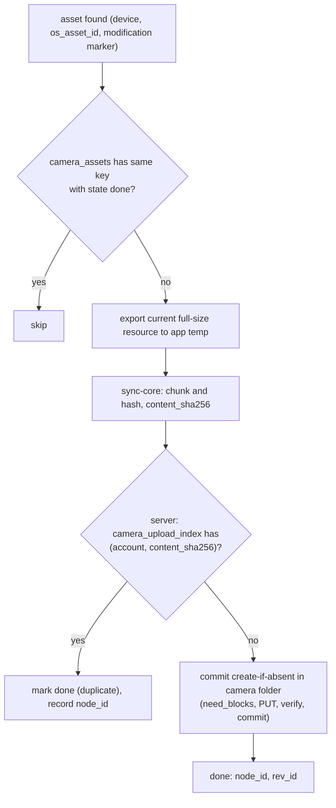
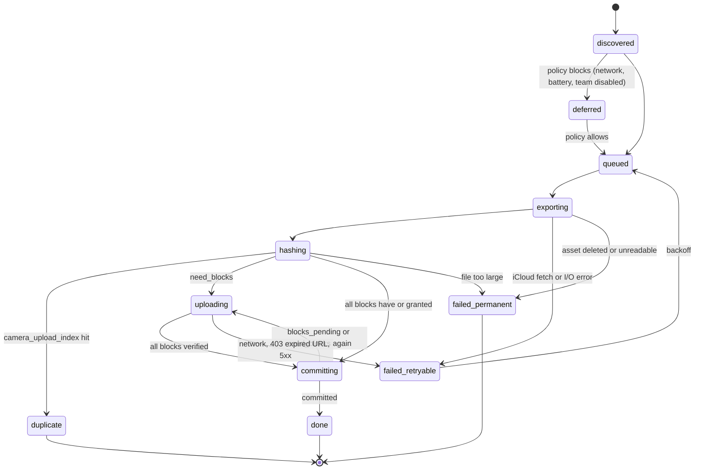

# Mobile and camera upload: Dropbox

モバイルのアプリ（iOS・Android）の範囲と、カメラのアップロード、オフラインの保存、通知を決める。カメラのアップロードは、写真のライブラリの見つけ方、重ねない仕組み、元の形式（HEIC など）、バックグラウンドの制約の中での送り方、電池と回線の方針、再開を扱う。

前提となる決定は次のとおり。

- モバイルは Swift・Kotlin の UI と、UniFFI で呼ぶ `sync-core`。木の全体の同期はしない（[ADR-0001](../decisions/0001-platform-and-stack.md)）
- 写真のライブラリの新しい項目を、OS の写真の ID と内容のハッシュで重ねずに上げる。元の形式のまま上げ、変換はプレビューだけ（[architecture/README.md](README.md) の 6 節）
- 分割、アップロードの許可とセッション、再開（[ADR-0002](../decisions/0002-chunking-and-block-addressing.md)、[block-storage.md](block-storage.md)）
- 書き込みは条件つき（[ADR-0006](../decisions/0006-sync-conflict-model.md)）。カーソルと `list/continue`（[ADR-0005](../decisions/0005-namespace-journal-and-cursors.md)）
- 法務の確認待ち：L4（モバイルの通知の配信のサービスへの提供、外国にある第三者）

この文書で決めたことは次の ADR にある。

| ADR | 決定 |
| --- | --- |
| [0036](../decisions/0036-camera-upload-identity-and-background.md) | カメラのアップロードは、端末の中は（端末, OS の写真の ID, 変更の印）で、アカウントの中は `content_sha256` で重ねない。元の形式（編集した写真は今の見た目の全体の大きさの資源）をそのまま上げる。前景では直接、背景では iOS は背景の URLSession と BGProcessingTask、Android は WorkManager と `dataSync` の前景のサービスで送り、署名つき URL の期限切れは起こされたときに取り直す。既定は写真はモバイルの回線でも上げ、動画は Wi-Fi だけ、電池が 20% 未満で充電していなければ止める |
| [0037](../decisions/0037-mobile-offline-files-and-content-free-push.md) | モバイルのオフラインの保存は、利用者が指定したファイルとフォルダーだけを、その名前空間のカーソルで追い、アプリの中で読み取り専用で持つ。端末の切り離しで消す。通知は、APNs・FCM に種類と ID だけを渡し、名前などの中身はアプリが API から取って端末の中で組み立てる |

## 1. 範囲

- 扱う：
  - モバイルのアプリの機能の範囲
  - カメラのアップロード：見つけ方、重ねない、形式、置き場所と名前、背景の送り方、電池と回線、状態と再開、チームの方針
  - オフラインの保存：指定、追従、容量、消し方
  - 通知の中身と経路
- 扱わない：
  - ブロックの送り方そのもの（[block-storage.md](block-storage.md)）
  - プレビューの作り方（[previews-and-thumbnails.md](previews-and-thumbnails.md)）。HEIC の表示はここで作ったプレビューを使う
  - 端末の登録と遠隔の切り離し（`desktop-client.md` の端末の登録と `accounts-and-teams.md`）
  - ストアの審査と配布（`delivery.md`）
  - iOS の Files アプリとの統合（File Provider）。MVP で持たない（13 節）

## 2. 要件

| 要件 | 目標 | NFR |
| --- | --- | --- |
| カメラのアップロードの速さ | OS がアプリに時間を与えてから、20 MB 以下の写真の確定まで p95 5 分 | NFR-012 |
| 重ねない | 合成の写真のライブラリで、同じ写真の重複 0、漏れ 0 | quality.md の 5 節の E10 |
| 失わない | 送り切る前のアプリの終了・端末の再起動・回線の切断で、写真を飛ばさない。確定した写真を端末の操作で消さない | NFR-004、NFR-005 |
| 再開 | 検証済みのブロックを送り直さない | NFR-003 |
| 中身を外へ出さない | 通知の配信のサービスに、ファイルの名前と中身を渡さない | NFR-007、法務の L4 |

## 3. 本家の形（確かめたこと）

| 項目 | 内容 | 出典 |
| --- | --- | --- |
| モバイルの回線 | 既定では、Wi-Fi がないときモバイルの回線でも上げる。設定で止められる | [Camera uploads overview](https://help.dropbox.com/create-upload/camera-uploads-overview)（2026-10-09 に確認） |
| 電池 | 既定では、電池が少ないと自動のアップロードを止める | 同上 |
| iOS の夜間 | 夜間に上げるには、アプリを開いたまま、Wi-Fi、充電していること | 同上 |
| 置き場所 | 「Camera Uploads」という名前のフォルダー。アップロードの間は名前と場所を変えられない。後でファイルを移すのはよい | 同上 |
| Live Photo | iOS の Live Photo を上げられる | 同上 |
| チーム | チームの管理者が有効・無効を決められる | 同上 |
| HEIC の扱い、名前の付け方、重複の判定 | 同上の資料に書かれていない（**未検証**） | — |

## 4. アプリの範囲

| 機能 | MVP | 備考 |
| --- | --- | --- |
| 一覧、並べ替え、検索 | あり | 開いているフォルダーの名前空間のカーソルで差分を受ける（[ADR-0005](../decisions/0005-namespace-journal-and-cursors.md)） |
| プレビュー | あり | サーバーのプレビュー（WebP）。元のファイルは開くときに取る |
| アップロード（手動） | あり | 共有のシート、ファイルの選択 |
| 名前の変更・移動・削除・フォルダーの作成 | あり | 条件つきの書き込み（`base_node_ver`） |
| 共有フォルダー・共有リンクの作成 | あり | Web と同じ API |
| オフラインの保存 | あり（指定したものだけ） | 9 節 |
| カメラのアップロード | あり | 5〜8 節 |
| 通知 | あり | 10 節。法務の L4 |
| 木の全体の同期、他のアプリでの編集 | なし | デスクトップの役目 |
| iOS の Files アプリ、Android の文書の提供者 | なし | 13 節 |

## 5. カメラのアップロードの見つけ方

ADR-0036。

- **iOS**：写真のライブラリの変更の通知と、永続の変更の印（`PHPersistentChangeToken`）から差分を取る。印が使えない（古い・失効）ときは、作成の日時で全体を走査し直す。API の名前と利用できる OS のバージョンは Apple の資料で確かめる（**未検証**）。
- **Android**：MediaStore の世代の番号（`GENERATION_ADDED`・`GENERATION_MODIFIED`）で差分を取る。世代が使えない機種では、`DATE_ADDED` と ID で走査する。同じく Android の資料で確かめる（**未検証**）。
- **最初の有効化**：既定は「これから撮るものだけ」。利用者が「今までの写真もすべて」を選んだら、新しいものから古いものへ順に上げる。
- **アクセスの範囲**：iOS の限定のアクセス、Android の部分のアクセスでは、選ばれた写真だけを上げ、画面にその旨を出す。
- 見つけた項目はローカルの状態の DB の `camera_assets` に入れる。名前空間の木と別の表で、Remote・Local・Synced の木は使わない（モバイルは木の全体を同期しないため）。

## 6. 重ねない

ADR-0036。

- **端末の中**：（端末, OS の写真の ID, 変更の印）が同じで `done` の項目は上げない。写真を編集したら変更の印が変わり、同じノードの新しいリビジョンとして上げる（`base_rev` の条件つき。ノードが既に消されていれば新しいファイルとして作る）。
- **アカウントの中**：サーバーの `camera_upload_index(tenant_id, ns_id, account_id, content_sha256 → node_id)` を引き、同じ中身を既に上げていれば上げない。複数の端末、機種の変更、再インストールで重ねないため。この照会は本人が上げたものだけを引くので、他人の有無を漏らさない。
- **ブロックの重複**：上の後でも、ブロックの重複排除の答え（[ADR-0003](../decisions/0003-dedupe-scope-and-privacy.md)）が別に効く。
- 利用者がカメラのアップロードのフォルダーから写真を消しても、`camera_upload_index` の行は残し、同じ写真を上げ直さない（利用者が意図して消したものを蘇らせない）。行は 1 年で消す。

## 7. 形式・置き場所・名前

ADR-0036。

- **形式**：元の形式をそのまま上げる（HEIC・HEIF、JPEG、PNG、DNG、MOV（HEVC・H.264）、MP4）。HEIC を JPEG に変換して保存しない。表示は、サーバーのプレビュー（libheif で WebP。[previews-and-thumbnails.md](previews-and-thumbnails.md)）で行う。
- **編集した写真**：今の見た目の全体の大きさの資源（iOS は編集の後の全体の画像）を上げる。編集の前の元は上げない。利用者が見ている写真と同じものを残すため。
- **Live Photo**：静止画を上げる。対の動画（`.mov`）は「Live Photo の動画も上げる」（既定 オフ、容量のため）で上げ、同じ名前の別の拡張子にする。
- **iCloud に最適化した写真**：端末に元がないとき、取り出しを許すのは Wi-Fi のときだけ。
- **置き場所**：利用者のルート（チームのメンバーは本人のフォルダー）の `カメラアップロード`（英語の設定では `Camera Uploads`）。フォルダーはノードの ID で持ち、利用者が名前を変えたり移したりしても、その ID のフォルダーに上げ続ける。フォルダーが消されたら、新しく作る。
- **名前**：撮影の日時（端末のタイムゾーン）で `YYYY-MM-DD HH.MM.SS.<ext>`。同じ名前があれば ` (1)`・` (2)` を足す。作成は「その親にその `name_key` がまだない」の条件で行い、409 なら番号を進める（[ADR-0006](../decisions/0006-sync-conflict-model.md)）。撮影の日時がない項目は、ライブラリに入った日時を使う。

## 8. 背景での送り方と方針

ADR-0036。

### 8.1 OS ごとの仕組み

| OS | 前景 | 背景 |
| --- | --- | --- |
| iOS | `sync-core` が直接、並行 4 本で送る | (1) 背景の更新の短い時間：新しい項目の見つけと、小さな写真の分割と commit。(2) BGProcessingTask（回線と、設定により外部の電源を条件に）：まとめて分割・ハッシュ、ブロックをファイルに書き出す。(3) 背景の URLSession の upload のタスク：書き出したブロックのファイルを、アプリが止まっていても OS が送る。終わるとアプリが短く起こされ、検証の待ちと commit を行い、次のブロックの URL を取る |
| Android | 同上 | WorkManager（制約：回線の種類、電池が少なくない）。長いアップロード（動画など 100 MB 超）は `dataSync` の種類の前景のサービスで、通知を出して送る |

- 背景の時間の長さと頻度は OS が決める。本家も、iOS の夜間のアップロードにアプリを開いたままにすることを求めている（3 節）。NFR-012 は「OS がアプリに時間を与えてから」で測る。
- iOS の背景の URLSession は、タスクを OS が後で始めることがある。署名つき URL（15 分。[ADR-0007](../decisions/0007-block-storage-layout-on-s3.md)）が切れて 403 になったら、起こされたときに URL を取り直してタスクを作り直す。1 回に作るタスクは 16 ブロックまでにして、切れる URL を減らす。切れる頻度は `mobile-background-upload-poc` で測る。
- Android の `dataSync` の前景のサービスの使える時間の上限（新しい OS での制限）は Android の資料で確かめる（**未検証**）。上限に当たったら WorkManager に戻す。

### 8.2 電池と回線の方針

| 条件 | 既定 | 設定 |
| --- | --- | --- |
| 写真をモバイルの回線で上げる | 上げる（本家に寄せる。3 節） | 止められる |
| 動画をモバイルの回線で上げる | 上げない | 上げられる |
| OS の省データ（iOS の低データモード、Android のデータセーバー） | 上げない | 変えられない（OS の設定に従う） |
| ローミング | 上げない | 変えられない |
| 電池 20% 未満で充電していない | 止める（本家に寄せる。3 節） | 変えられない |
| 省電力モード | 止める | 変えられない |
| 端末の温度が高い（OS の熱の状態が重い以上） | 止める | 変えられない |
| 背景のとき、外部の電源を待つ | 動画だけ待つ | 写真も待てる |

- チームの管理者が、カメラのアップロードを無効にできる（本家と同じ。3 節）。無効のとき、チームのメンバーの端末は新しく見つけたものを上げない（`camera_assets` は残す）。
- 容量を超えたら止め、利用者に知らせる。容量が戻ったら再開する。

## 9. 状態と再開

ADR-0036。

- 状態は `camera_assets` に持ち、状態の遷移の前に書く（意図の記録。`sync-engine.md` と同じ考え方）。アプリが落ちても、再起動で状態から続ける。
- 書き出したファイルとブロックのファイルは、アプリの一時の領域に置き、`done` か `failed_permanent` で消す。一時の領域の上限は 2 GB（それを超える動画は、ブロックを順に書き出して送り、送ったものから消す）。
- 再開：`upload_id` と検証済みの番号を `camera_assets` に持ち、`upload_session/status`（[block-storage.md](block-storage.md) の 4.4 節）で合わせる。
- `failed_retryable` の後退：1 分、5 分、15 分、1 時間、以後 6 時間ごと。7 日続いたら利用者に知らせる。
- 写真の ID が端末から消えた（利用者が端末から消した）とき、送り切っていなければ `failed_permanent` にし、送ったブロックは許可の期限で捨てる。

## 10. 通知

ADR-0037。

- APNs・FCM に渡すのは `{type, event_id}` だけ（例：`share_invite`、`event_id` は不透明な ID）。名前、メールアドレス、ファイルの名前を入れない。
- iOS：通知の拡張（Notification Service Extension）が、端末のトークンで API の `notifications/get { event_id }` を呼び、文を組み立てる。取れなければ「新しいお知らせがあります」とだけ出す。
- Android：データのメッセージで受け、アプリが同じく API から取って通知を作る。
- 通知の種類（MVP）：共有フォルダーへの招待、共有リンクの帯域の上限、カメラのアップロードの停止（容量、長い失敗）、一斉の変更の検知（`versions-and-recovery.md`）。
- APNs・FCM へ端末のトークンと不透明な ID を渡すこと自体が、外国にある第三者への提供に当たるかは**法務の確認待ち：L4**。結論まで `release.mobile-push` の裏に置き、アプリの中の通知の一覧（開いたときに取る）だけを出す。

## 11. オフラインの保存

ADR-0037。

- 利用者が「オフラインで使う」を指定したファイルとフォルダーだけを端末に持つ。フォルダーを指定したら、その子孫を持つ。
- 指定したものの名前空間ごとにカーソルを持ち、アプリが前景になったとき、背景の更新のとき、合図を受けたとき（前景のときだけ WebSocket）に `list/continue` で差分を受け、変わったファイルの新しいリビジョンを取る。回線の方針は 8.2 節の写真と同じ。
- ブロックは手元のブロックの索引で重ねて取る（[block-storage.md](block-storage.md) の 7.2 節）。
- 端末の中ではアプリの領域に置き、iOS はデータ保護の区分（最初のロックの解除の後まで保護）、Android はアプリの専用の領域に置く。他のアプリへは共有のシートで写しを渡すだけで、アプリの中のファイルを直接は開かせない（読み取り専用）。
- 上限：端末の空きの 20% かつ利用者の設定（既定 5 GB）。超える指定は受けない。
- 端末の切り離し（遠隔）を受けたら、オフラインの保存、カメラのアップロードの一時のファイル、ローカルの状態の DB を消す。
- 指定したファイルが削除・移動・権限の取り消しで見えなくなったら、手元の写しを消し、利用者に知らせる。モバイルでは手元で編集しないので、消して失う手元の変更はない。

## 12. 障害のときの振る舞い

| 事象 | 起きること | 備え |
| --- | --- | --- |
| OS が背景の時間を与えない | 上がらない | 前景になったら直接送る。7 日上がらなければ知らせる。NFR-012 は与えられた後で測る |
| 写真のライブラリの変更の印の失効 | 差分が取れない | 全体を走査し直し、端末の中とアカウントの中の重ねない仕組みで重複を防ぐ |
| 署名つき URL の期限切れ | 背景の送りが 403 | 起こされたときに取り直す |
| アプリの再インストール | `camera_assets` が消える | アカウントの中の `camera_upload_index` で重ねない |
| 同じ写真を 2 台が同時に上げる | 2 つ作りうる | 名前の作成の条件と `camera_upload_index` の一意（`(account_id, content_sha256)`）で、後の commit は 409 にし、重複として `done` にする |
| 通知の中身の取得の失敗 | 文が出せない | 決まった文だけを出す |

## 13. 上限

| 対象 | 値 |
| --- | --- |
| 1 つの項目 | 2 TiB（ファイルの上限）。一時の領域は 2 GB を超えない |
| 前景の並行 | 4 本（`ops.client_upload_concurrency` の値と小さい方） |
| 背景の URLSession のタスク | 1 回 16 ブロック |
| オフラインの保存 | 端末の空きの 20%、既定 5 GB |
| `camera_upload_index` の行の保持 | 1 年 |

## 14. data-model への項目

| 表・置き場 | 中身 | 主キー・索引 | 節 |
| --- | --- | --- | --- |
| `camera_upload_index`（名前空間の表、利用者のルートの名前空間） | `account_id`、`content_sha256`、`node_id`、`device_id`、`created_at` | `(tenant_id, ns_id, account_id, content_sha256)` 一意 | 6 |
| `camera_upload_settings`（テナントの表） | アカウントごとの設定（回線、Live Photo の動画、外部の電源）、カメラのアップロードのフォルダーの `node_id` | `(tenant_id, account_id)` | 7、8.2 |
| `team_policies` に足す列 | `camera_uploads_enabled` | — | 8.2 |
| `notification_events`（テナントの表） | `event_id`、`account_id`、`type`、参照する ID、`created_at`、`read_at`。90 日で消す | `(tenant_id, account_id, event_id)` | 10 |
| `push_tokens`（RLS の外、`devices` に付く） | 端末、APNs・FCM のトークン、更新の時刻 | `(device_id)` | 10 |
| 端末の SQLite | `camera_assets`（端末, OS の写真の ID, 変更の印, 状態, `content_sha256`, `upload_id`, 検証済みの番号, `node_id`）、`offline_pins`、名前空間ごとのカーソル | — | 5、9、11 |

## 15. テスト

- **合成の写真のライブラリ**（quality.md の 5 節の E10）：生成した画像と動画（HEIC、JPEG、DNG、MOV、Live Photo の対、編集した写真、iCloud に最適化した写真、撮影の日時のない項目、同じ秒の連写）を、シミュレーターと実機の写真のライブラリに入れる。本物の写真を使わない。
- **PROP-CAM-001（重複 0・漏れ 0）**：任意の追加・編集・削除・アプリの終了・再インストール・2 台の同時の有効化・回線の切断の列の後、静かになったら、カメラのアップロードのフォルダーに、ライブラリの各項目の今の資源がちょうど 1 つある（利用者が消したものと方針で止めたものを除く）。
- **PROP-CAM-002（意図して消したものを蘇らせない）**：利用者がサーバーで消した写真は、上げ直されない。
- **DT-CAM-001（方針）**：8.2 節の表 × 写真・動画 × 前景・背景。
- **背景の試験**：iOS の背景の URLSession と BGProcessingTask、Android の WorkManager と前景のサービスを、実機で OS の制約（低データモード、省電力、熱）を変えて流す（`mobile-background-upload-poc`）。
- **通知**：APNs・FCM に渡す本文に、名前・メールアドレスが含まれないこと（送る直前の本文の検査）。

## 16. Story の候補

| Epic | Story | 中身 |
| --- | --- | --- |
| E10 | `mobile-core-bindings` | `sync-core` の UniFFI |
| E10 | `mobile-browse-preview` | 4 節 |
| E10 | `mobile-background-upload-poc` | 8.1 節の OS の仕組みの振る舞い、URL の期限切れの頻度（新しい Story の提案） |
| E10 | `camera-upload` | 5〜9 節（ADR-0036。PROP-CAM-001・002、DT-CAM-001） |
| E10 | `mobile-offline-files` | 11 節（ADR-0037） |
| E10 | `mobile-notifications` | 10 節（ADR-0037）。法務：L4 |

## 17. 未解決の問い

### 決定

2026-10-09 の既定案。

- **重ねない**：端末の中は OS の写真の ID と変更の印、アカウントの中は `content_sha256`（ADR-0036）。
- **形式**：元のまま。編集した写真は今の見た目。Live Photo の動画は既定でオフ（ADR-0036）。
- **回線と電池**：写真はモバイルの回線でも、動画は Wi-Fi だけ、電池 20% 未満で止める（ADR-0036）。
- **通知**：中身を APNs・FCM に渡さない（ADR-0037）。
- **オフラインの保存**：指定したものだけ、読み取り専用（ADR-0037）。

### 持ち越し

| 問い | いつ・どう決めるか |
| --- | --- |
| iOS の背景の URLSession で 15 分の URL が切れる頻度。高ければ、モバイルの背景の送信の URL の期限を延ばす（[ADR-0007](../decisions/0007-block-storage-layout-on-s3.md) の値の変更） | `mobile-background-upload-poc` の後、block-storage の領域で ADR を起票する |
| iOS・Android の API の名前と OS のバージョン（変更の印、世代、前景のサービスの時間の上限） | `mobile-background-upload-poc`。Apple・Google の資料で確かめる（今は**未検証**） |
| 通知の配信のサービスへの提供 | **法務の確認待ち：L4** |
| 送った写真を端末から消して空きを作る機能 | MVP の後 |
| iOS の Files アプリ・Android の文書の提供者との統合 | MVP の後。File Provider の経験（E5）を見てから |
| 本家の HEIC の扱い、名前の付け方 | 公式の資料に書かれていない（**未検証**） |

## 出典

- Dropbox Help Center, [Camera uploads overview](https://help.dropbox.com/create-upload/camera-uploads-overview)（2026-10-09 に確認）
