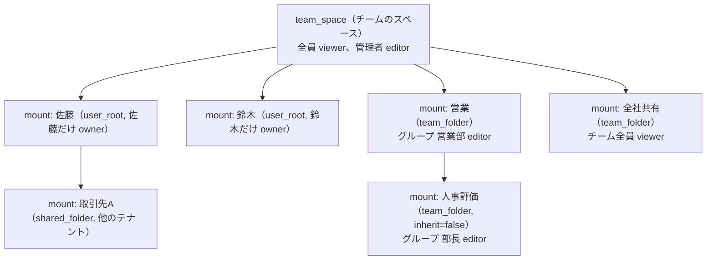
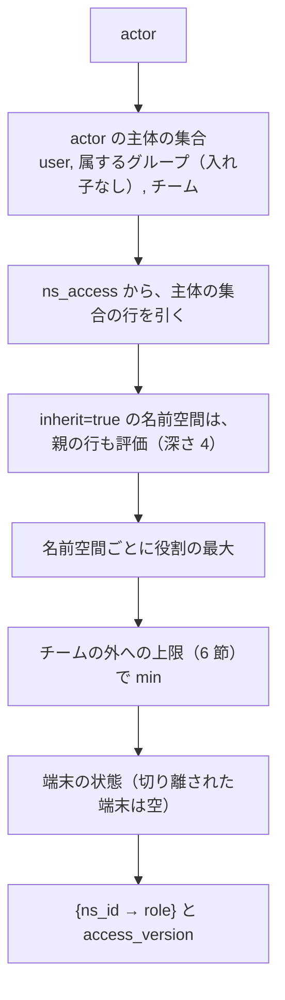
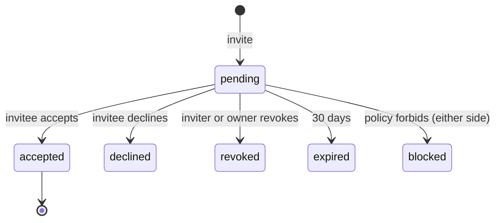

# Namespaces and sharing: Dropbox

名前空間の種類と木への載せ方（マウント）、共有フォルダーの招待・参加・退出・外し、役割（持ち主・編集・閲覧）、チームのスペースとチームのフォルダー、チームの外への共有の方針、容量の数え方、持ち主の移し替えを決める。

前提となる決定は次のとおり。

- テナントと名前空間、`ns_mounts`、`ns_access`、`can()`、テナントをまたぐ経路 X1〜X5（[ADR-0004](../decisions/0004-tenancy-namespaces-and-rls.md)）
- ジャーナルの `mount`・`unmount`、カーソルの `mount_hash`（[ADR-0005](../decisions/0005-namespace-journal-and-cursors.md)）
- 衝突の決定表の行 12（役割が下がった・外されたときの手元の変更。[ADR-0006](../decisions/0006-sync-conflict-model.md)）
- 重複排除の答えと、容量を論理の大きさで数えること（[ADR-0003](../decisions/0003-dedupe-scope-and-privacy.md)）

この文書で決めたことは次の ADR にある。

| ADR | 決定 |
| --- | --- |
| [0024](../decisions/0024-shared-folder-mounts-and-grants.md) | 共有フォルダーは 1 つの名前空間で、参加した人のルートに「マウントのノード」として載る。マウントのノードは普通のノードと同じ `name_key` の一意と移動の規則に従う。共有フォルダーの中に共有フォルダーを作らない。権限は `ns_grants`（利用者・グループ・チームに役割）で持ち、要求ごとに `access_version` 付きで読める名前空間の集合を求める。既存のフォルダーの共有は、新しい名前空間への移動として行う |
| [0025](../decisions/0025-team-space-and-external-sharing-policy.md) | チームのメンバーのルートはチームのスペース（`team_space`）で、最上位にチームのフォルダーと、本人だけに見える本人のフォルダー（`user_root`）を載せる。最上位は管理者だけが変える。チームのフォルダーの中の制限したフォルダーは別の名前空間で、親の権限を継ぐか継がないかを持つ（深さ 4 まで）。チームの外への共有の方針は、共有フォルダー・参加・共有リンクの 3 つで持ち、狭めたら超えた付与を無効にし、広げても自動で戻さない |
| [0026](../decisions/0026-membership-lifecycle-and-quota.md) | 自分で抜けるときと、外されるときを分ける。外されたら、まず読めなくし、その後に、持ち主が許した場合だけ外した時点の写しを外された人のルートへ作る。容量は名前空間の持ち主のテナントだけに論理の大きさで数え、メンバーには数えない。持ち主の移し替えは同じテナントの中だけで、テナントをまたぐ移し替えは写しで行う |

## 1. 範囲

- 扱う：
  - 名前空間の種類、利用者の木の組み立て、マウントのノード
  - 権限の付与（`ns_grants`）と、読める名前空間の集合の求め方
  - 共有フォルダーの作成・招待・参加・退出・外し・共有の解除
  - チームのスペース、チームのフォルダー、制限したフォルダーと権限の継承
  - チームの外への共有の方針と、変更の効き方
  - 容量の数え方、持ち主の移し替え
  - 名前空間と共有の `can()` の決定表
- 扱わない：
  - 共有リンク（[shared-links.md](shared-links.md)）
  - 名前空間をまたぐ移動・コピーのバッチの仕組み（[metadata-and-journal.md](metadata-and-journal.md)）。この文書はいつ使うかを決める
  - 外されたときの手元のファイルの扱い（[sync-engine.md](sync-engine.md)。[ADR-0006](../decisions/0006-sync-conflict-model.md) の行 12）
  - チーム・グループ・SCIM・管理の役割（[accounts-and-teams.md](accounts-and-teams.md)）
  - 監査ログの形（[security.md](security.md)）

## 2. 要件

| 要件 | 目標 | NFR |
| --- | --- | --- |
| 漏れ | 外されたメンバー、閲覧の役割、他のテナントの人、制限したフォルダーの非メンバーに、読めない名前空間の名前・中身・有無が届いた事象 0 件 | NFR-007、K7 |
| 取り消しの効き | 外す・方針で無効にするの確定から、その主体の新しい要求が拒まれるまで 5 秒以内（キャッシュの消し込みを含む） | NFR-007 |
| 参加の伝播 | 参加の確定から、参加した人のオンラインの端末に `mount` が届くまで p99 5 秒 | NFR-002 |
| 権限の判定の速さ | 読める名前空間の集合の解決 p99 20ms（キャッシュに当たれば 2ms） | NFR-001 |
| 中身を失わない | 外された・閲覧に下がった人の手元の未送信の変更を失わない | NFR-004、[ADR-0006](../decisions/0006-sync-conflict-model.md) |
| 1 つの判定 | すべての経路が `can()` を通す | [ADR-0004](../decisions/0004-tenancy-namespaces-and-rls.md) |

## 3. 本家の形（確かめたこと）

| 項目 | 内容 | 出典 |
| --- | --- | --- |
| 名前空間 | API に名前空間の相対のパス（`ns:`）がある。内部の形は公開されていない | [HTTP API documentation](https://www.dropbox.com/developers/documentation/http/documentation)（2026-10-09 に確認） |
| 共有フォルダーの役割、入れ子の禁止、退出時のコピー | 公式の資料で確かめられなかった（**未検証**） | — |
| 共有フォルダーの容量の数え方、メンバーの上限 | 公式の資料で確かめられなかった（**未検証**。[intent.md](../intent.md) の「選定・計測で決めるもの」） | — |
| チームのスペースの形、制限したフォルダー、権限の継承 | 公式の資料で確かめられなかった（**未検証**） | — |

本家の形を確かめられなかったので、この文書の値はどれも本システムの決定である。本家と違うと確かめられたら、[architecture/README.md](README.md) の 1.4 節に行を足す。

## 4. 名前空間と木

### 4.1 種類

| 種類 | 持ち主のテナント | 主な付与 | どこに載るか |
| --- | --- | --- | --- |
| `user_root` | 個人：本人のテナント。チームのメンバー：チームのテナント | 本人に `owner` | 個人：端末の木のルート。チームのメンバー：チームのスペースの最上位（4.3 節） |
| `shared_folder` | 作った人のルートの持ち主のテナント | 作った人に `owner`、招いた人・グループに `editor`・`viewer` | 参加した人のルートか、本人のフォルダーの中 |
| `team_space` | チーム | チームの全員に `viewer`、管理者に `editor` | チームのメンバーの端末の木のルート |
| `team_folder` | チーム | グループ・利用者に `editor`・`viewer`。持ち主はチーム | チームのスペースの最上位か、チームのフォルダーの中（制限したフォルダー） |

### 4.2 マウントのノード

ADR-0024。

- 名前空間を載せる場所は、載せる側の名前空間のノード（`kind='mount'`、`mount_ns_id`）として表す。`ns_mounts` はこのノードを引くビューにする（[ADR-0004](../decisions/0004-tenancy-namespaces-and-rls.md) の名前空間の表の一覧の名前を残す。[data-model.md](data-model.md) の D-3）。
- マウントのノードは、普通のフォルダーと同じく `(ns_id, parent_id, name_key)` の一意に入る。名前の変更・移動は、載せる側の名前空間の `upsert` としてジャーナルに載る（[ADR-0005](../decisions/0005-namespace-journal-and-cursors.md)）。載せた名前空間の中は変わらない。
- 参加のときに同じ名前があれば、` (2)`・` (3)` を足した名前で載せる。名前は参加した人ごとに違ってよい。
- 利用者の木は、ルートの名前空間から、マウントのノードを、その主体が読める名前空間だけたどって組み立てる。読めない名前空間のマウントのノードは、名前ごと返さない（4.3 節の他の人の本人のフォルダー）。
- 入れ子の規則：
  - `shared_folder` の中に `shared_folder` を載せない。共有フォルダーの中のフォルダーを共有しようとしたら 400 `nested_share`。
  - 共有フォルダーを含むフォルダーを共有しようとしたら 400 `contains_share`。
  - チームのフォルダーの中の制限したフォルダー（`team_folder`）は、深さ 4 まで入れ子にできる。
  - 個人の `shared_folder` を、チームのフォルダーの中へ移せない（持ち主のテナントが違う。移したいときはコピー）。

### 4.3 チームのメンバーの木

ADR-0025。

- チームのメンバーの `root_ns` はチームのスペース。最上位には、本人のフォルダー（本人の `user_root`）と、読めるチームのフォルダーだけが見える。他のメンバーの本人のフォルダーのマウントのノードは、名前も返さない。
- 最上位は管理者だけが変えられる（チームのスペースの `editor`）。メンバーが最上位にファイルを置こうとしたら 403。
- 本人のフォルダーの名前は、管理者が決めた表示の名前。本人は変えられない（チームのスペースのノードのため）。
- チームのメンバーが他のテナントの共有フォルダーに参加したら、本人のフォルダーの中に載せる。
- チームのスペースは、チームのフォルダーとメンバーの数のマウントのノードを持つ（3 万席で約 3 万のノード）。メンバーの追加・削除は、チームのスペースのジャーナルに 1 行ずつ載る。読む側は、読めないマウントのノードの行を返さない。

### 4.4 制限したフォルダーと権限の継承

- チームのフォルダーの中の一部の人だけのフォルダーは、別の `team_folder` の名前空間にし、`ns_grants.inherit` を持つ。
  - `inherit=true`：親の名前空間の付与に、自分の付与を足す（親で読める人は読める）。
  - `inherit=false`：自分の付与だけ（制限したフォルダー）。
- 親をたどるのは深さ 4 まで。読める名前空間の集合を求めるとき、継ぐ名前空間は親の付与を合わせて評価する（5.2 節）。
- 継承を `false` に変えたら、親だけで読めていた人は読めなくなる。外すのと同じに扱う（7 節）。

## 5. 権限の付与

### 5.1 付与

`ns_grants(tenant_id, ns_id, principal_type, principal_id, role, inherit, disabled_reason, granted_by, granted_at)`。

- `principal_type`：`user`・`group`・`team`（チームの全員）。
- `role`：`owner`・`editor`・`viewer`。`owner` は名前空間に 1 つ（`shared_folder` は利用者、`team_space`・`team_folder` はチーム）。
- `disabled_reason`：`external_policy`（方針で無効）、`account_suspended` など。無効の行は判定に使わない。
- `ns_access`（[ADR-0004](../decisions/0004-tenancy-namespaces-and-rls.md) の RLS の外の表）は、`ns_grants` から作る「主体 → 名前空間、役割、持ち主のテナント」の写しで、`packages/access` だけが書く。主体は `user`・`group`・`team` のまま持ち、利用者ごとに展開しない（グループ 1 つに 1 万人いても 1 行）。

### 5.2 読める名前空間の集合

ADR-0024。

- 結果を Valkey に `acc:<actor>:<access_version>` で 10 分持つ。`access_version` は、主体に関わる付与・グループ・方針・端末の変更で上げる番号（アカウントの行に持つ）。変更の確定で上げ、上げた後の要求は古いキャッシュを使わない（2 節の 5 秒）。
- `app.ns_ids` に入れるのは、この集合のうち、要求が触れる名前空間だけ（1,000 以下。[ADR-0004](../decisions/0004-tenancy-namespaces-and-rls.md)）。
- カーソルの `mount_hash`（[ADR-0005](../decisions/0005-namespace-journal-and-cursors.md)）は、この集合のうち、利用者の木に載る名前空間と役割から作る。

### 5.3 `can()` の決定表

DT-NS-001。`R` は 5.2 節の役割（`none` を含む）。上の行から当てる。

| 操作 | 許す条件 |
| --- | --- |
| `read`（一覧、中身、プレビュー、検索の結果） | `R ≥ viewer` |
| `write`（作成・変更・移動・名前の変更・削除） | `R ≥ editor`。`team_space` の最上位は管理者だけ |
| `restore`（ファイル・フォルダーの復元） | `R ≥ editor` |
| `rewind`（名前空間・フォルダーの巻き戻し） | `user_root`・`shared_folder`：`R = owner`。`team_folder`：`R ≥ editor` とチームの管理者（[versions-and-recovery.md](versions-and-recovery.md) と揃えた） |
| `invite`（利用者・グループを足す） | `shared_folder`：`R ≥ editor` かつ名前空間の方針 `members_can_invite`（既定 `editor`）。`team_folder`：管理者 |
| `change_role`・`remove_member` | `shared_folder`：`R = owner`、または `editor` で方針 `editors_can_manage`（既定 なし）。`team_folder`：管理者 |
| `unshare`（共有の解除） | `R = owner` |
| `transfer_owner` | `R = owner`、相手は同じテナントの `editor`（9 節） |
| `leave` | `R ∈ {editor, viewer}`。`owner` は移し替えるか解除する。チームのフォルダーからは抜けられない（選択型の同期で手元から外す） |
| `create_link` | [shared-links.md](shared-links.md) の DT-LINK-001 |
| 外への招待 | 上の条件かつ 6 節の方針 |

- `packages/access` の外で役割の文字列を比べない（[ADR-0004](../decisions/0004-tenancy-namespaces-and-rls.md) の lint）。

## 6. チームの外への共有の方針

ADR-0025。`team_policies` に持つ。値は本システムの既定。

| 設定 | 選択肢 | 既定 | 効く場所 |
| --- | --- | --- | --- |
| `external_share_out` | チームの名前空間に外の人を招ける・閲覧だけ招ける・招けない | 招ける | `invite`、付与の上限 |
| `external_join_in` | メンバーが外の共有フォルダーに参加できる・できない | できる | 招待の受け入れ |
| `external_links` | [shared-links.md](shared-links.md) の 6 節 | — | リンクの作成と解決 |
| `allow_keep_copy` | 外されたメンバー・抜けたメンバーが写しを持てる | 持てない | 7 節 |
| `members_can_create_shared_folders` | メンバーが本人のフォルダーの中を共有できる | できる | `invite` |

- 「外の人」は、主体のテナントが名前空間の持ち主のテナントと違うこと。チームのメンバーでない個人のアカウントは外の人。
- **狭めたとき**：上限を超える `ns_grants` の行を `disabled_reason='external_policy'` にし、7 節の「外す」と同じ手順で `unmount` を書く。1,000 行ずつ流す。参加できなくなったメンバーの、外の共有フォルダーのマウントも同じく外す。
- **広げたとき**：無効にした行を自動で戻さない。持ち主が付け直す。黙って広がることを避けるため。
- 方針の変更は監査ログに書く（[security.md](security.md)）。

## 7. 参加・退出・外し

ADR-0024・0026。

### 7.1 招待の状態

- アカウントのないメールアドレスへの招待は、招待のトークン（`<brand>_inv_` の形、ハッシュで持つ。[data-model.md](data-model.md) の D-18）をメールで送り、アカウントを作って受けたときに有効にする。
- チームのフォルダーは招待を経ない。グループに付与すれば、メンバーのチームのスペースに載る。
- 受け入れは、招かれた人のテナントの文脈で、本人のルートにマウントのノードを `mount` として書く（[ADR-0004](../decisions/0004-tenancy-namespaces-and-rls.md) の X5）。

### 7.2 自分で抜ける・外される・共有の解除

| 操作 | 権限の順 | 手元（[sync-engine.md](sync-engine.md)） | 写し |
| --- | --- | --- | --- |
| 自分で抜ける（`leave`） | 本人の付与を消す → `access_version` を上げる → 本人のルートに `unmount` | 変えていないファイルは消す。手元で変えたファイルは「`<Brand>` に保存できなかった変更」へ（[ADR-0006](../decisions/0006-sync-conflict-model.md) の行 12） | 本人が「写しを残す」を選び、方針（`allow_keep_copy`。個人の名前空間は常に可）が許せば、抜けた時点の写しを本人のルートに作る |
| 外される（`remove_member`） | 付与を消す → `access_version` → `unmount`（X5） | 同上 | 持ち主が外すときに「写しを残すことを許す」（既定 なし）を選び、方針が許したときだけ |
| 共有の解除（`unshare`） | すべての付与を消す（持ち主を除く）→ 各メンバーに `unmount` | 同上 | 持ち主が許したときだけ、各メンバーに写し |
| 方針で無効 | 6 節 | 同上 | 作らない |

- **読めなくするのを先にする。** 写しは、読めなくした後に、`restore-runner` がシステムの作業として作る。外した時点の `ns_seq`（S）を記録し、S の時点の木を写す。写しの作業は、持ち主の許可を監査ログに残す。
- 写しは、名前空間をまたぐコピーのバッチ（[metadata-and-journal.md](metadata-and-journal.md)）で作る。ブロックは、写し先のテナントが違えば X1 で写す（写しの時点で読めていた中身なので漏れない）。写しは写し先の容量に数える（8 節）。
- 写しを作らないとき、外された人の手元の変えていないファイルは消える。変えたファイルだけが残る。
- 持ち主は抜けられない。持ち主のアカウントの削除は、共有の解除と同じに扱う（メンバーへの写しは作らない）。チームのメンバーの退職は [accounts-and-teams.md](accounts-and-teams.md) で扱い、本人のフォルダーはチームに残る。

## 8. 容量

ADR-0026。

- 容量は**名前空間の持ち主のテナント**に、論理の大きさ（削除していないファイルの今のリビジョンの大きさの和）で数える。メンバーの容量には数えない。
- バージョン履歴と削除したファイルは数えない（保持の期間の中の中身は、本システムの費用として持つ）。プランの約束の文言は法務の L6 の後。
- 数え方：
  - `packages/committer` が、commit ごとに名前空間の `logical_bytes` を差分で増減する（同じトランザクション）。
  - `quota` の Worker が 1 分ごとに、テナントが持つ名前空間の和を `tenant_usage` に書く。
  - commit は、大きさを増やす操作のとき、`tenant_usage.bytes + 今の commit の増分 ≤ 上限 + 余裕` を確かめる。余裕は min(1 GiB, 上限の 1%)。1 分の遅れの間の超過を、この余裕で引き受ける。
  - 超えたら、大きさを増やす操作を 507 `owner_quota_exceeded` で拒む。削除と、大きさの増えない変更は受ける。
- 共有フォルダーのメンバーが書いて持ち主の容量を超えたら、メンバーにも同じエラーを返す。持ち主の容量の正確な値はメンバーに見せない。
- 重複排除で減った量は見せない（[ADR-0003](../decisions/0003-dedupe-scope-and-privacy.md)）。

## 9. 持ち主の移し替え

ADR-0026。

- 名前空間の持ち主のテナントは、作ってから変えない。テナントの行（ブロックの S3 のキー、RLS の `tenant_id`）を書き換えないため。
- `transfer_owner` は、同じテナントの中の `editor` へだけ行う（個人のテナントは 1 人なので、個人の共有フォルダーは移せない）。
- テナントをまたいで持ち主を変えたいとき（個人から会社のチームへ移す）は、新しい名前空間への写し（7.2 節の写しと同じバッチ）を作り、メンバーを付け直し、古い名前空間を解除する。画面では「移し替え（写しを作る）」として示す。
- 個人のアカウントからチームへの移り（[accounts-and-teams.md](accounts-and-teams.md)）では、本人の `user_root` と本人が持つ共有フォルダーを、この写しで移す。

## 10. 既存のフォルダーの共有

ADR-0024。

1. 利用者が自分のルートのフォルダー F を共有する。`can(actor, invite)` と 4.2 節の入れ子の規則を確かめる。
2. 新しい `shared_folder` の名前空間 N を作り、F の子孫を N へ移す。名前空間をまたぐ移動のバッチ（[metadata-and-journal.md](metadata-and-journal.md)）を使い、`node_id` を保つ（[ADR-0008](../decisions/0008-node-identity-and-names.md)）。
3. F の場所にマウントのノードを置き、F のノードを消す（同じ `name_key` のため、同じトランザクションで入れ替える）。
4. 招待を送る。

- 10 万ファイルのフォルダーの共有は数分かかる。途中の状態を端末に見せない形は [metadata-and-journal.md](metadata-and-journal.md) で決める。共有の操作の状態（`preparing`・`ready`・`failed`）を画面に出す。
- 共有の解除は逆にしない（N の中身を F へ戻さない）。持ち主のルートのマウントのノードは残し、メンバーだけを外す。

## 11. 障害のときの振る舞い

| 事象 | 起きること | 備え |
| --- | --- | --- |
| `access_version` の更新とキャッシュのずれ | 外した人の要求が最大 10 分通る | `access_version` を要求ごとに DB（reader）から引き、キャッシュのキーに含める。引けないときは閉じる側に倒す（503） |
| X5 の `unmount` の書き込みの失敗 | 外された人の端末の木に、読めないマウントが残る | 付与を消した時点で読めない（`list/continue` は読めない名前空間を返さない）。`unmount` は outbox で再試行する |
| グループの写しの遅れ（SCIM） | グループのメンバーの役割が古い | [accounts-and-teams.md](accounts-and-teams.md) の遅れの監視。`access_version` は写しの更新でも上げる |
| 写しの作業の失敗 | 外された人に写しができない | `restore-runner` の再試行。権限は既に外しているので、漏れではない |
| 方針の変更で大量の無効化 | 多くの端末の取り直し | 1,000 行ずつ流す。取り直しの集中は [ADR-0005](../decisions/0005-namespace-journal-and-cursors.md) のとおり引き受ける |
| `can()` の誤り（新しいバージョン） | 漏れ | 応答の監査で見つけ、前のイメージへ戻す。規則はフラグにしない（[runbooks](../runbooks/README.md) の 3 節）。SEV1 の候補 |

## 12. 上限

| 対象 | 値 | 超えたとき |
| --- | --- | --- |
| 共有フォルダーの直接の利用者の付与 | 5,000 | 400 `too_many_members`（グループを使うよう示す） |
| 1 名前空間のグループの付与 | 500 | 同上 |
| 利用者が載せる名前空間 | 1,000 | 参加を 400 `too_many_mounts` |
| 制限したフォルダーの入れ子 | 深さ 4 | 400 |
| 待っている招待（1 名前空間） | 1,000 | 400 |
| 招待の送信（1 アカウント・1 日） | 500（悪用の対策） | 429 |
| 招待の期限 | 30 日 | `expired` |

## 13. data-model への項目

| 表 | 中身 | 主キー・索引 | 節 |
| --- | --- | --- | --- |
| `namespaces` に足す列 | `kind`、`owner_principal`、`logical_bytes`、`share_state`（`preparing`・`ready`・`failed`）、`parent_ns_id`（継承の親）、`policy`（`members_can_invite`・`editors_can_manage`） | `(tenant_id, ns_id)` | 4.1、4.4、8、10 |
| `nodes` に足す列 | `kind`（`file`・`folder`・`mount`）、`mount_ns_id` | 一意 `(ns_id, parent_id, name_key)` は変えない | 4.2 |
| `ns_grants`（名前空間の表） | 5.1 節 | `(tenant_id, ns_id, principal_type, principal_id)` | 5.1 |
| `ns_access`（RLS の外） | 主体、名前空間、役割、持ち主のテナント、`inherit`、無効の理由 | `(principal_type, principal_id, ns_id)`、`(ns_id)` | 5.1 |
| `accounts` に足す列 | `access_version` | — | 5.2 |
| `ns_invites`（名前空間の表） | 招く人、相手（アカウントかメールのハッシュ）、役割、状態、トークンのハッシュ、期限 | `(tenant_id, ns_id, invite_id)`、`(token_hash)` | 7.1 |
| `team_policies` に足す列 | 6 節の設定 | `(tenant_id)` | 6 |
| `tenant_usage` | `bytes`、`computed_at` | `(tenant_id)` | 8 |
| `membership_copy_jobs`（テナントの表） | 写しの作業：元の名前空間、時点 `seq`、写し先、許した人、状態 | `(tenant_id, job_id)` | 7.2、9 |
| Valkey | `acc:<actor>:<access_version>` | 期限 10 分 | 5.2 |

## 14. テスト

決定表：

- **DT-NS-001（`can()`）**：5.3 節の表 × 名前空間の種類 × 役割 × 内と外 × 方針。
- **DT-NS-002（読める名前空間の集合）**：5.2 節の流れ × 直接・グループ・チームの付与 × 継承の有無と深さ × 方針の上限 × 切り離された端末。
- **DT-NS-003（退出と写し）**：7.2 節の表 × 方針 `allow_keep_copy` × 名前空間の種類。

性質ベーステスト：

- **PROP-NS-001（外された後の漏れなし）**：任意の招待・参加・抜ける・外す・解除・方針の変更・継承の変更の列の後、読めない主体への応答（一覧、`list/continue`、検索、プレビュー、ブロックの URL、Webhook）に、その名前空間の名前・中身・有無が出ない（[ADR-0004](../decisions/0004-tenancy-namespaces-and-rls.md) の Confirmation、quality.md の 2.2.1 節 F）。
- **PROP-NS-002（他の人の本人のフォルダーが見えない）**：チームのスペースのジャーナルを読む任意のメンバーに、他のメンバーのマウントのノードの行が返らない。
- **PROP-NS-003（役割の単調）**：付与を足すと役割は下がらず、方針を狭めると上がらない。
- **PROP-NS-004（容量）**：任意の commit の列で、`logical_bytes` の和が、削除していないファイルの大きさの和と一致する。上限 + 余裕を超える確定がない。
- **PROP-NS-005（写しは読めなくした後）**：外す操作の記録で、写しの作業の開始が、付与の削除の確定より後にある。写しの中身は時点 S の木と一致する。

シミュレーター（quality.md の 2.2.1 節 A）：参加と退出、役割の変更の操作を生成器に足す（既にある項目の具体化）。

## 15. Story の候補

| Epic | Story | 中身 |
| --- | --- | --- |
| E6 | `access-can` | 5 節（ADR-0024。DT-NS-001・002、PROP-NS-003） |
| E6 | `shared-folders` | 4.2 節、7 節、10 節（ADR-0024・0026。DT-NS-003、PROP-NS-001・005） |
| E6 | `team-space-and-folders` | 4.3・4.4 節（ADR-0025。PROP-NS-002） |
| E6 | `external-sharing-policy` | 6 節（ADR-0025） |
| E6 | `quota-accounting` | 8 節（ADR-0026。PROP-NS-004） |
| E6 | `ownership-transfer` | 9 節（新しい Story の提案） |
| E6 | `leak-path-tests` | 14 節の経路 |

## 16. 未解決の問い

### 決定

2026-10-09 の既定案。

- **マウント**：マウントのノードとして載せ、入れ子の共有フォルダーを禁ずる（ADR-0024）。
- **チームのスペース**：最上位はチームのフォルダーと本人のフォルダー、管理者だけが変える（ADR-0025）。
- **権限の継承**：制限したフォルダーごとに `inherit` を持つ（ADR-0025）。
- **外への方針の既定**：招ける・参加できる・写しを持てない（ADR-0025）。
- **容量**：持ち主のテナントだけに論理の大きさで数える（ADR-0026）。
- **写し**：読めなくした後、持ち主・方針が許すときだけ（ADR-0026）。
- **持ち主の移し替え**：同じテナントの中だけ（ADR-0026）。

### 持ち越し

| 問い | いつ・どう決めるか |
| --- | --- |
| 本家の容量の数え方、入れ子の規則、退出の時のコピー | 公式の資料で確かめられなかった（**未検証**）。本家と違うと分かれば 1.4 節に行を足す |
| 容量を持ち主だけに数えると、無料の利用者が大きな共有フォルダーに書ける | 悪用の計測を E6 の試用で見る。多ければ、書いた人の容量にも数える案を ADR で検討 |
| 管理者がメンバーの本人のフォルダーを見る | **法務の確認待ち：L7**（[accounts-and-teams.md](accounts-and-teams.md)） |
| 退職したメンバーの本人のフォルダーの扱い | [accounts-and-teams.md](accounts-and-teams.md) |
| 大きなフォルダーの共有の途中の見せ方 | [metadata-and-journal.md](metadata-and-journal.md) |

## 出典

- Dropbox Developers, [HTTP API documentation](https://www.dropbox.com/developers/documentation/http/documentation)（2026-10-09 に確認）
