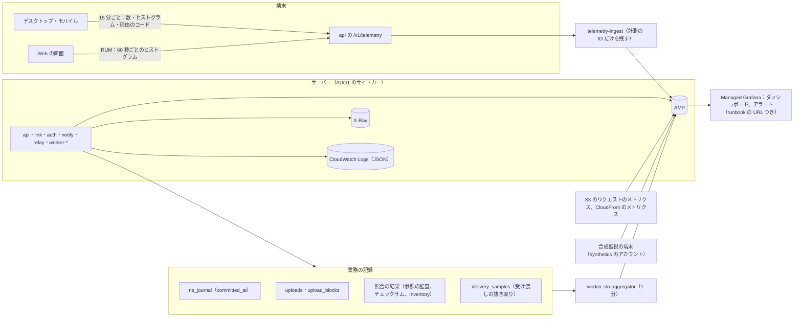

# Observability: Dropbox

ログ・メトリクス・トレース、中身を出さない規則、SLI の計測（確定から他の端末への伝播、アップロードの成功、ブロックの耐久性の監査、ジャーナルの連続、端末の健全さ）、端末の匿名の計測とその守り、応答の監査、アラートと runbook の対応、合成監視、ダッシュボードを決める。道具は他の題材と同じ（OpenTelemetry（ADOT）→ AMP、X-Ray、CloudWatch Logs、Managed Grafana）。

**SLO の値とアラートの一覧の正本は [runbooks/README.md](../runbooks/README.md)** にある。この文書は、その定義の計測とアラートの条件の実装を書く。値を変えるときは runbooks/README.md を先に変え、ここを合わせる。

| ADR | 決定 |
| --- | --- |
| [0050](../decisions/0050-sli-from-ledgers-synthetics-and-client-telemetry.md) | 正しさと伝播の SLI は、トレースの抜き取りではなく、業務の記録（ジャーナル、アップロードの行、照合の結果）と合成監視の端末から全件で数える。伝播はサーバーの時計だけで測る「受け渡しの遅れ」と、合成監視の端末で測る「開けるまで」の 2 つにする。端末の計測は、30 日で替える計測の ID で、数・ヒストグラム・理由のコードだけを送り、名前・パス・中身のハッシュ・アカウントを送らない。利用者とチームは断れる |

## 1. 全体の流れ

## 2. 計装

### 2.1 中身を出さない

- ログ・トレース・メトリクス・端末の計測・エラーの報告に、**ファイルとフォルダーの名前、パス、中身、中身のハッシュ（`content_sha256`、ブロックのハッシュ）、共有リンクのトークン、検索の語、メールアドレス、トークン**を出さない（[AGENTS.md](../../AGENTS.md)）。
- 出してよいもの：`tenant_id`、`ns_id`、`node_id`、`rev_id`、`upload_id`、`device_id`（サーバーの中だけ。端末の計測には出さない）、`ns_seq`、理由のコード、件数、大きさ、時間、バージョン（`chunker_version`、`names_version`、クライアントのバージョン）、クライアントの種類。
- ブロックのハッシュはサーバーのログに出さない。調査でブロックを指すときは、ブロックの行の内部の ID（`block_id`）を使う。ハッシュは、他人のファイルの有無の確かめに使えるため（[ADR-0003](../decisions/0003-dedupe-scope-and-privacy.md)）。
- アクセスのログは、経路の ID の部分を残し、問い合わせの部分を落とす。`/s/<token>` の経路は残さない（[security.md](security.md) の 3.2 節）。
- `Authorization`、クッキー、`<Brand>-Signature`、署名つき URL の署名の部分は、どの層でも伏せる。
- 秘密と名前の形の走査（`<brand>_at_`・`<brand>_rt_` などの接頭辞、メールアドレスの形、64 桁の 16 進数（ハッシュ）、利用者のホームのディレクトリのパスの形）を、ログに常時流し、見つけたら呼び出す。

### 2.2 トレース

- W3C Trace Context。`api` の要求ごとにトレースを始め、outbox の行と SQS のメッセージの属性で `traceparent` を Worker へ運ぶ。
- アップロードは `upload_id`、復元と巻き戻しはジョブの ID で、トレースとは別に全件を結ぶ（業務の記録）。トレースは抜き取りなので、全件の追跡に使わない。
- サンプリング：要求は 1%、エラーと 1 秒を超えるものは全部（テールサンプリング）。

### 2.3 メトリクスの次元

- `tenant_id`・`ns_id` はメトリクスの次元にしない。テナントの大きさの帯（`tenant_band`：S・M・L・XL）と、名前空間の種類（`ns_kind`）を使う。
- 名前空間ごとの値が要るもの（ロックの待ち、429、購読の数）は、上位 50 だけを 1 分ごとに別のメトリクス（`top_ns_*`）に出す。
- クライアントの種類（`client_kind`：`desktop:macos`・`desktop:windows`・`mobile:ios`・`mobile:android`・`web`・`api`）と主のバージョン（`client_major`）。

## 3. 業務の記録からの SLI

ADR-0050。[runbooks/README.md](../runbooks/README.md) の 1 節の SLI ごとに、計測の場所を決める。

### 3.1 伝播

伝播を 2 つの層で測る。

| 層 | 測るもの | 計測 | 使う SLI |
| --- | --- | --- | --- |
| 受け渡しの遅れ（全体） | 確定（`ns_journal.committed_at`）から、他の端末の `list/continue` がその操作を返した時刻まで。どちらもサーバーの時計 | `api` が、`list/continue` の応答に含めた操作のうち、書いた端末と別の端末へのものを、端末と名前空間の組ごとに最も古い 1 つだけ `delivery_samples` に数える（ヒストグラム） | 「伝播」p99 5 秒（NFR-002）の母集団の値。合成監視と並べて見る |
| 開けるまで（合成監視） | 1 MiB 以下のファイルを端末 A で保存してから、端末 B でファイルが開ける（中身のハッシュが合う）まで | 合成監視の 2 台（7 節） | 「伝播」p99 5 秒、「小さなファイルの届き」p95 10 秒（NFR-002、K3）の正本 |

- 受け渡しの遅れは、オフラインの端末を含めないため、`list/continue` の時点で WebSocket がつながっていた端末だけを数える（`notify` の接続の印を要求に付ける）。
- 端末の手元での組み立てと置き換えの時間は、端末の計測（4 節）の `apply_latency` のヒストグラムで見る。SLO には使わない。

### 3.2 アップロードの成功

| 部分 | 良いイベント | 計測 |
| --- | --- | --- |
| `incoming` への PUT | 5xx・時間切れでない PUT | S3 のリクエストのメトリクス（`incoming` のバケット、5xx の数と全数）。端末の計測の `upload_put_result` の理由のコードで補う |
| 確かめ | `upload_blocks` が `awaiting` から `verified` になったもの。チェックサムの不一致（端末の誤り）は数えない | `upload_blocks` の状態の移りを `slo-aggregator` が 1 分ごとに数える |
| 確かめの速さ | PUT から `verified` までの p99 | 同上（`block-verifier` の滞留の呼び出しは [runbooks/README.md](../runbooks/README.md) の 4 節） |

- 「アップロードの可用性」（月間 99.9%）は、PUT と確かめの良いイベントの和を全数で割る。
- アップロードが期限（[block-storage.md](block-storage.md) の 10 節）で `expired` になった数を別に見る（端末の不具合の兆候）。

### 3.3 中身の耐久性

| 照合 | 頻度 | 悪いイベント | アラート |
| --- | --- | --- | --- |
| ブロックの参照の監査（その日のリビジョンと抜き取りのリビジョンのブロックが `live` で S3 にある） | 毎日 | 参照のあるブロックが索引にない・S3 にない | 1 件で呼び出し（SEV1 の候補）。GC を止める |
| チェックサムの照合（0.1% の抜き取り） | 毎日 | S3 の SHA-256 と番地の不一致 | 1 件で呼び出し |
| S3 Inventory と索引の突き合わせ | 毎週 | 索引にあり S3 にない行 | 1 件で呼び出し。索引にない S3 のオブジェクトは GC の対象として数える |
| CRR の遅れ | 1 分 | `ReplicationLatency` が 15 分を超える | 呼び出し（[infrastructure.md](infrastructure.md) の 6.6 節） |
| DR の後の中身 | 切り替えの後 | `content_state = lost` | 1 件で SEV1 の報告に入れる（[ADR-0048](../decisions/0048-disaster-recovery-and-content-pending.md)） |

- 照合のジョブは、結果を `integrity_audit_runs`（日付、種類、調べた数、不一致の数、`block_id` の一覧）に書く。ジョブが動かなかった日は「不明」として呼び出す（0 件と見なさない）。

### 3.4 ジャーナルの連続

- `slo-aggregator` が、1 分ごとに、その分に書かれた名前空間ごとに、`ns_journal` の `seq` が連続していること（欠けも重複もない）を確かめる。欠けの数を `journal_gap_total` に出す（[runbooks/README.md](../runbooks/README.md) の「ジャーナルの連続」）。
- `ns_seq` を振ったトランザクションがロールバックすると番号が欠ける作りにしないことは、`packages/committer` の側の約束である（[metadata-and-journal.md](metadata-and-journal.md)）。

### 3.5 その他の SLI

| SLI | 計測 |
| --- | --- |
| メタデータと同期の可用性 | `api` の要求（木の読み出し、commit、`list/continue`）の 5xx・時間切れ。エッジ（CloudFront）と `api` の両方で数え、悪いほうを採る |
| ダウンロードの可用性 | CloudFront（`content`）の `/b/*` の 5xx の率。オリジンのフェイルオーバーで救われたものは良いイベント |
| 共有リンクの可用性 | `link` と `content` の `/s/` 由来の要求の 5xx |
| commit・読み出し・差分の速さ | `api` のヒストグラム（操作の数・件数の帯で分ける） |
| 権限の分離 | 応答の監査（5 節） |
| 端末の健全さ | 端末の計測（4 節）の「同期が 1 時間を超えて止まっていない端末の割合」 |
| 復元、プレビュー、検索、Webhook | 各領域（[versions-and-recovery.md](versions-and-recovery.md)、[previews-and-thumbnails.md](previews-and-thumbnails.md)、[search.md](search.md)、[api-and-webhooks.md](api-and-webhooks.md)）の業務の記録 |

## 4. 端末の匿名の計測

ADR-0050。範囲は法務の L1（外部送信規律の公表）の後に確定する。

### 4.1 送るもの

| 区分 | 項目 |
| --- | --- |
| 状態 | 同期の状態（`idle`・`syncing`・`paused`・`blocked`・`error`）、止まっている時間の帯、止まった理由のコード |
| 同期の数 | 競合のコピーの作成、消しすぎの止め、走査し直し、監視の溢れ、同期できない名前（理由ごと）、409 の数、取り直し、手元の削除をゴミ箱へ移した数 |
| 速さ | `apply_latency`（`list/continue` の受け取りから手元に置くまで）、保存から送信の開始まで（NFR-008）のヒストグラム |
| 送受信 | アップロード・ダウンロードの結果の理由のコード、再試行の数、503 の数、速さの帯 |
| 資源 | 静かなときの CPU の割合、常駐のメモリー、ローカルの状態の DB の大きさの帯、ファイルの数の帯（1 万ごとではなく桁の帯） |
| 環境 | クライアントのバージョン、OS とそのバージョン、ファイルシステムの種類（APFS・NTFS、大文字小文字の区別）、`chunker_version`、`names_version` |
| 異常終了 | スタックの跡（記号を解いたもの）、異常の種類、クライアントのバージョン |

- **送らないもの**：名前、パス、中身、中身・ブロックのハッシュ、ノードの ID、アカウントの ID、メールアドレス、端末の名前、`device_id`、IP アドレス（受けた後に捨てる）。
- 異常終了の報告は、スタックの跡だけを送り、メモリーのダンプを送らない。スタックの跡の文字列から、利用者のホームのディレクトリのパスと、ファイルの名前に見える部分を端末で消してから送る。

### 4.2 識別と集め方

- 端末は、計測のためだけの乱数の ID（`telemetry_id`）を持ち、30 日ごとに作り直す。アカウント・端末の ID と結ばない。
- 送信は 15 分ごとにまとめる（60 秒の集計のヒストグラムと数）。`api.<brand>.<domain>/v1/telemetry` へ、端末の資格情報で認証して送る（悪用を防ぐため）。受けた `telemetry-ingest` は、資格情報を確かめた後、アカウントと端末の ID と IP アドレスを捨て、`telemetry_id` だけを残して AMP とログに書く。
- 計測の生の記録は 90 日で消す。集計したメトリクスは 13 か月。
- **断れる**：利用者は設定で計測を止められる。チームは方針で、メンバーの端末の計測を止められる。止めた端末は、端末の健全さの SLI の母集団から外れる（割合を別に見る）。
- 端末の健全さの SLI の「1 時間を超えて止まった」は、止まった理由のコードで分け、利用者の一時停止・容量の超過・同期できない名前だけのものを悪いイベントに数えない。

### 4.3 Web の画面の RUM

- 一覧の表示（NFR-001 の Web の一覧 p95 1 秒）、アップロードの開始までの時間、エラーの率を、60 秒ごとのヒストグラムで送る。名前・パス・検索の語を送らない。外部の RUM のサービスを使わない（L1）。

## 5. 応答の監査

- `api` と `link` の応答を 0.1% 抜き取り、返した各項目（名前空間、ノードの ID、署名つき URL の対象のリビジョン）を、`can()` に通し直して比べる。名前と中身は記録せず、ID と項目の有無だけを比べる（[quality.md](../quality.md) の 4.2 節）。
- 重複排除の答え（「送らなくてよい」）も抜き取り、要求した主体が読める名前空間の参照にあったかを確かめ直す（[ADR-0003](../decisions/0003-dedupe-scope-and-privacy.md)）。
- 不一致は 1 件で呼び出し（SEV1 の候補。runbook `access-leak-response.md`）。

## 6. アラート

### 6.1 バーンレート

- 可用性の SLO は、1 時間の窓で 14.4 倍かつ 5 分の窓で 14.4 倍なら呼び出し、6 時間で 6 倍なら呼び出し、3 日で 1 倍ならチケット（[runbooks/README.md](../runbooks/README.md) の 1 節）。
- 0 が目標の SLI（耐久性、チェックサム、権限の分離）は、1 件で呼び出す。ジャーナルの欠けは 1 件でチケット、10 件で呼び出し。

### 6.2 アラートの一覧と runbook

| アラート | 条件 | 重さ | runbook |
| --- | --- | --- | --- |
| メタデータと同期の SLO | 6.1 節のバーンレート | page・ticket | `incident-response.md` |
| ブロックの参照の監査 | 不一致 1 件、または照合が動かなかった | page | `block-integrity-incident.md` |
| チェックサムの照合 | 不一致 1 件 | page | `block-checksum-mismatch.md` |
| `block-verifier` の滞留 | SQS の最古が 60 秒 | page | `upload-pipeline-lag.md` |
| 名前空間のロックの待ち | 上位の名前空間の p99 200ms が 10 分 | ticket | `namespace-lock-contention.md` |
| ジャーナルの欠け | 1 件・10 件 | ticket・page | `journal-gap.md` |
| 伝播 | 合成監視の p99 が 30 秒を 10 分、または受け渡しの遅れの p99 が 30 秒を 10 分 | page | `propagation-lag.md` |
| カーソルの取り直し | 1 時間の取り直しの数が前の週の同じ時間の 5 倍 | ticket | `cursor-reset-spike.md` |
| 権限の漏れの疑い | 応答の監査の不一致 1 件 | page | `access-leak-response.md` |
| 端末の健全さ、クライアントの異常終了、競合・消しすぎの止めの急増 | [quality.md](../quality.md) の 4.1 節の基準 | ticket（配布の段階の間は page） | `client-regression.md` |
| 一斉の変更の検知の急増 | 1 時間の検知の数が前の週の 5 倍 | ticket | `mass-change-response.md` |
| CRR の遅れ、Aurora Global Database の遅れ | 15 分、`AuroraGlobalDBRPOLag` 10 秒が 5 分 | page | `disaster-recovery.md` |
| 秘密・名前の形がログに出た | 1 件 | page | `incident-response.md` |
| 人のロールの復号・`GetObject` の試み | 1 件 | page | `access-leak-response.md` |

- すべてのアラートは、対応する runbook の URL を注釈に持つ（CI で検査する。[runbooks/README.md](../runbooks/README.md) の 4 節）。

## 7. 合成監視

- `synthetics` のアカウントに、macOS（EC2 Mac）と Windows（EC2）のデスクトップのクライアントを 2 組ずつ置き、本番の社内の監視用のチームにつなぐ。社内の監視用のチームは SLO の計算から除き、別に見る（[runbooks/README.md](../runbooks/README.md) の 1 節）。
- 5 分ごとに回す場面：

| 場面 | 測るもの |
| --- | --- |
| A で 1 MiB 以下のファイルを保存 → B で開ける | 伝播、小さなファイルの届き |
| A と B で同じファイルを同時に編集 | 競合のコピーが 1 つでき、両方の中身が残る |
| 共有フォルダーへの参加と退出 | `mount`・`unmount` の反映 |
| 共有リンクの作成と匿名の取得 | 共有リンクの可用性 |
| 削除と復元 | 復元の反映 |
| 100 MB のファイルの送信（30 分ごと） | 送信の速さ、再開 |

- 大阪からの読み出しだけの合成監視は [infrastructure.md](infrastructure.md) の 6.6 節。

## 8. ダッシュボード

| ダッシュボード | 中身 |
| --- | --- |
| SLO の一覧 | 1 節の SLI の今の値、エラーバジェットの残り |
| 同期の健全さ | 伝播の 2 つの層、`list/continue` の速い道の率、合図の窓の広がり、末尾のキャッシュの当たり、取り直し |
| ブロックとアップロード | 送信の量、優先度ごとの 429、S3 の 503 の率、`block-verifier` の滞留、照合の結果 |
| 端末 | クライアントのバージョンごとの健全さ、異常終了の率、競合・消しすぎの止め・走査し直しの率、資源の使い方（配布の段階と並べる） |
| 名前空間 | 上位 50 の書き込み・ロックの待ち・429・購読の数 |
| 費用 | TB あたりの費用、Intelligent-Tiering の層の割合、配信の量（[capacity.md](capacity.md) の 7 節） |

## 9. ログの保持とアクセス

- アプリのログは CloudWatch Logs に 30 日、log-archive に 13 か月（[security.md](security.md) の 8.1 節）。
- ログを読めるのは Ops とオンコールの Dev。ログに中身がない前提だが、`tenant_id` と `node_id` から利用者を結べるので、調査のロールは JIT にする（[security.md](security.md) の 9 節）。
- 開示の請求で記録を出す手順は法務の L3（runbook `legal-request.md`）。

## 10. テスト

| 種類 | 内容 |
| --- | --- |
| lint | ログ・トレース・メトリクスの呼び出しに、名前・パス・ハッシュ・トークンの型の値を渡すコードを禁止する（型で印を付ける） |
| 結合 | ログの走査（2.1 節）が、試験で仕込んだ名前・ハッシュ・トークンを見つける |
| 性質ベース | 任意の `list/continue` の列で、`delivery_samples` が端末と名前空間の組ごとに 1 つだけ、書いた端末を除いて数える |
| 端末の計測 | 端末の計測の送信の本文に、試験の木の名前・パス・ハッシュ・ノードの ID が含まれない（試験の木の名前を本文から探す） |
| アラート | 全アラートに runbook の注釈がある。照合のジョブが動かなかった日に「不明」で呼び出す |

## 11. Story の候補

| Epic | Story | 中身 |
| --- | --- | --- |
| E1 | `otel-baseline` | 2 節の計装、中身を出さない規則と走査 |
| E3 | `propagation-sli` | 3.1 節の受け渡しの遅れ（`delivery_samples`） |
| E2 | `upload-sli` | 3.2 節 |
| E2 | `block-scrubber-and-audit` | 3.3 節の照合の結果と「不明」の扱い（block-storage と共同） |
| E5 | `client-telemetry` | 4 節。範囲は法務：L1 |
| E13 | `synthetic-devices` | 7 節 |
| E13 | `slo-dashboards-alerts` | 6・8 節 |
| E6 | `response-audit` | 5 節 |

## 12. 未解決の問い

### 決定

- **伝播**：受け渡しの遅れ（サーバーの時計）と、合成監視の開けるまでの 2 層（ADR-0050）。
- **端末の計測**：30 日で替える計測の ID、数と理由のコードだけ、断れる（ADR-0050）。
- **ブロックのハッシュをログに出さない**：`block_id` で指す（2.1 節）。

### 持ち越し

| 問い | いつ・どう決めるか |
| --- | --- |
| 端末の計測の範囲と公表、同意の要否 | **法務の確認待ち：L1** |
| 記録の保持と開示 | **法務の確認待ち：L3** |
| 受け渡しの遅れを SLO の正本にするか（今は合成監視が正本） | E13 の後に、2 つの層の差を見て Ops と QA が決める |
| 異常終了の報告に部品の外部のサービスを使うか | E5。使うなら外部送信規律（L1）とサブプロセッサー（L9）に入る |

## 13. quality.md・runbooks・data-model への項目

### quality.md

- 4.1 節の「伝播」の判定基準に、受け渡しの遅れ（3.1 節）を並べて書く。
- 4.2 節の端末の健全さに、送らないもの（4.1 節）の試験を足す。

### runbooks

- [runbooks/README.md](../runbooks/README.md) の 1 節の「伝播」の良いイベントの説明に、受け渡しの遅れの層があることを書き足す（正本は合成監視のまま）。
- `client-regression.md`：端末の計測のダッシュボードの見方、計測を止めた端末の割合。

### data-model への項目

| 表・置き場所 | 中身 | 節 |
| --- | --- | --- |
| `delivery_samples`（保守用のスキーマ、日の分割、14 日） | `ns_id`、`seq`、`committed_at`、`served_at`、`client_kind`（端末の ID は持たない） | 3.1 |
| `integrity_audit_runs`（保守用のスキーマ） | 日付、種類、調べた数、不一致の数、`block_id` の一覧 | 3.3 |
| `slo_minutely`（保守用のスキーマ） | SLI ごとの 1 分の良いイベントと全数 | 3 |
| AMP（`telemetry_*`） | 端末の計測の集計（`telemetry_id` は次元にしない） | 4 |
| CloudWatch Logs `telemetry-raw`（90 日） | 端末の計測の生の記録（`telemetry_id` だけ） | 4.2 |

## 出典

- 本家の端末の計測の範囲は、公式の資料で確かめていない（**未検証**）。
