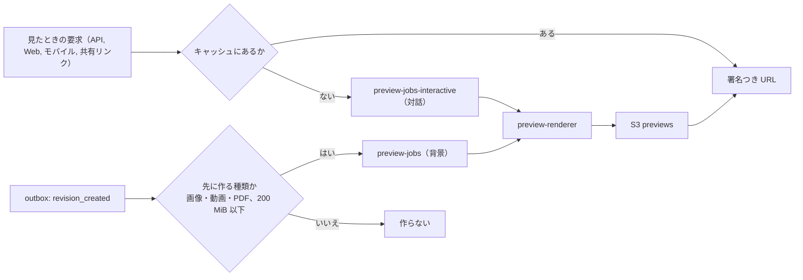
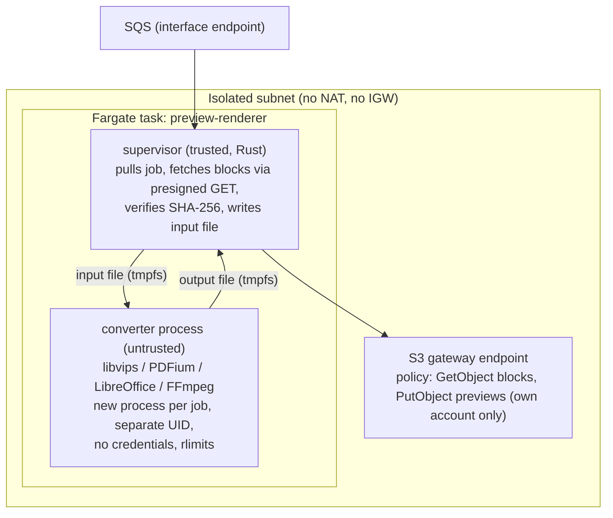
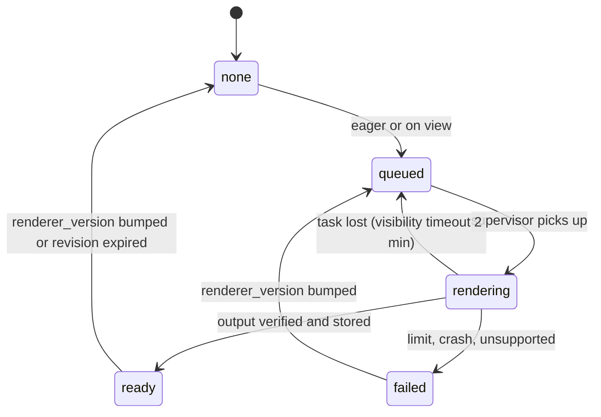

# Previews and thumbnails: Dropbox

プレビューとサムネイルを決める。対応する形式、作る時（先に作るか見たときに作るか）、利用者のファイルを開く隔離した変換、上限、動画の最初の画面、出力の形、S3 と CloudFront のキャッシュ、配信と無効化、共有リンクからの使い方を扱う。本文の抽出（検索のため）も同じ隔離の仕組みで動かすので、その入口もここで決める。

前提となる決定は次のとおり。

- プレビューのキャッシュは `<brand>-previews-apne1` の `p/<tenant_id>/<rev_id>/<kind>`、90 日で消す（[ADR-0007](../decisions/0007-block-storage-layout-on-s3.md)）
- 変換は、ネットワークのない隔離したタスクで、時間・メモリー・出力の大きさの上限を付けて動かす。利用者の中身は `<brand>usercontent.<domain>` からだけ返す（[AGENTS.md](../../AGENTS.md)）
- 第三者の汎用の部品（画像の変換、PDF の描画、Office の文書の変換、動画の最初の画面）を使う（[architecture/README.md](README.md) の 4 節）
- すべての経路が `can()` を通す（[ADR-0004](../decisions/0004-tenancy-namespaces-and-rls.md)）
- 法務の確認待ち：L1（中身を機械で読むこと）、L5（国外のエッジ）

この文書で決めたことは次の ADR にある。

| ADR | 決定 |
| --- | --- |
| [0032](../decisions/0032-sandboxed-preview-pipeline.md) | 変換は、外へ出る道のない区画の Fargate のタスクで、信頼する監督のプロセスと、信頼しない変換のプロセス（ジョブごとに作り直す、別の利用者、資源の上限）に分ける。変換のプロセスは資格情報も URL も持たず、入力と出力はファイルで受け渡す。出力は監督が安全な復号器で読み直して作り直してから置く。タスクは 50 ジョブか 10 分で作り直す |
| [0033](../decisions/0033-preview-cache-and-delivery.md) | プレビューは画像と動画と PDF の 1 頁目のサムネイルだけを確定の後に先に作り、他は見たときに作る。キャッシュは S3 のリビジョンのキーに、変換器のバージョンを `kind` に含めて置き、内容のハッシュで別のリビジョンと使い回さない。配信は `can()` の後に、CloudFront の署名つき URL（10 分、共有リンクは 5 分）で `<brand>usercontent.<domain>` から返す |

## 1. 範囲

- 扱う：
  - 対応する形式と、作るもの（サムネイル、頁の画像、テキスト）
  - 作る時、優先度、待ち行列
  - 隔離した変換（ネットワーク、資格情報、プロセス、上限）
  - 出力の検査と形式
  - キャッシュのキーと再利用、無効化
  - 配信の URL と、共有リンクからの使い方
  - 本文の抽出の入口（抽出したテキストを索引に渡すまで）
- 扱わない：
  - 索引と検索（[search.md](search.md)）
  - 共有リンクの解決とダウンロードの禁止の意味（[shared-links.md](shared-links.md)）
  - マルウェアの検査、違法なコンテンツの照合（`security.md`）
  - ネットワークの区画と egress の構成の全体（`infrastructure.md`）
  - 動画のストリーミングの変換（[intent.md](../intent.md) の Non-goals）

## 2. 要件

| 要件 | 目標 | NFR |
| --- | --- | --- |
| サムネイル（最初） | 確定から、または見たときの要求から p95 2 秒（16 MiB 以下の画像） | NFR-011 |
| サムネイル（キャッシュ） | p95 200ms | NFR-011 |
| 文書のプレビュー | 最初の頁の画像 p95 5 秒（20 MiB 以下の PDF・Office の文書） | 本システムの目標 |
| 隔離 | 変換のプロセスから、外への通信・他のジョブの中身・資格情報に届かない | quality.md の 2.2.1 節 I |
| 漏れ | 読めないリビジョンのプレビューを返さない。キャッシュのキーで権限を飛ばさない | NFR-007 |
| 中身のドメイン | 利用者の中身を本体のドメインから返さない | [AGENTS.md](../../AGENTS.md) |

## 3. 本家の形（確かめたこと）

- 本家の対応する形式、プレビューの大きさ、変換の仕組みは、この文書の時点で公式の資料で確かめなかった（**未検証**）。[intent.md](../intent.md) の MVP の範囲（画像、PDF、Office の文書、動画の最初の画面、テキスト）に従う。

## 4. 形式と出力

| 種類 | 入力の形式 | 変換の部品（第三者の汎用） | 作るもの |
| --- | --- | --- | --- |
| 画像 | JPEG、PNG、GIF（最初のコマ）、WebP、HEIC・HEIF、TIFF、BMP | libvips（HEIF は libheif） | サムネイル 64・256・1024 px（長い辺）、プレビュー 2048 px |
| PDF | PDF | PDFium | サムネイル（1 頁目）、頁の画像 1600 px（最初の 10 頁は先に、以後は見たときに、最大 300 頁） |
| Office の文書 | docx、xlsx、pptx、doc、xls、ppt、odt、ods、odp | LibreOffice（ヘッドレス）で PDF にし、PDF と同じ | 同上 |
| テキスト | txt、md、csv、json、ソースコード（拡張子の一覧） | 監督の中の自前の処理（文字コードの判定：UTF-8、UTF-16、Shift_JIS、EUC-JP） | 最初の 256 KiB の UTF-8 のテキスト |
| 動画 | MP4、MOV、M4V、WebM、AVI、MKV | FFmpeg | 最初の画面（1 秒目か長さの 10% の早い方の近くのキーフレーム）のサムネイル 3 大きさ |
| 音声・その他 | — | — | 作らない（形式のアイコン） |

- 出力の画像はすべて WebP（品質 80）。透明を持つ画像も WebP。
- 頁の画像にしたのは、利用者の PDF をブラウザの PDF の部品で開かないため。文字の選択はできないが、本文の検索（[search.md](search.md)）で補う。
- 画像の EXIF の向きを当ててから縮める。出力に元のメタデータ（位置の情報を含む）を残さない。
- 動画は再生の変換をしない（[intent.md](../intent.md) の Non-goals）。短い低い画質の再生は MVP の後に、費用を測ってから決める。
- RAW の写真、PSD、AI、CAD の形式は MVP の後。

## 5. 作る時

ADR-0033。

- **先に作る**：画像・動画・PDF の 1 頁目のサムネイル（256 px）。グリッドの表示とカメラのアップロードの一覧で、見たときに待たせないため。対象は 200 MiB 以下のファイル。
- **見たときに作る**：それ以外の大きさ、頁の画像、Office の文書、テキスト、200 MiB を超えるファイル。
- 待ち行列は 2 つ。対話（`preview-jobs-interactive`）を背景より先に取る。対話の待ちの p95 が 1 秒を超えたら、背景の取り出しを止める。
- 見たときの要求は、キャッシュになければ `202 { state: "generating", retry_after_ms: 300 }` を返す。Web とモバイルは最長 10 秒まで待ち、待てなければ形式のアイコンを出す。
- 本文の抽出（`text-extractor`）は、チームのプランの名前空間の文書について、確定の後に背景の待ち行列で行う（[search.md](search.md)）。仕組みは同じ隔離の変換で、出力はテキストだけ。
- 中身を機械で読む処理（先に作るサムネイル、本文の抽出）を有効にする範囲は**法務の確認待ち：L1**。結論まで、先に作る処理は `release.eager-thumbnails`、本文の抽出は `release.fulltext-extraction` の裏に置く。見たときに作る処理は、利用者が自分で見る操作に応じたものとして先に出す（これも L1 の結論で見直す）。

## 6. 隔離した変換

ADR-0032。

### 6.1 構成

- **ネットワーク**：タスクは `infrastructure.md` の sandbox の区画（NAT もインターネットのゲートウェイもない）に置く。セキュリティグループの外向きは、S3 のゲートウェイのエンドポイントの接頭辞の一覧、ECR と CloudWatch Logs のインターフェイスのエンドポイント、ジョブの受け取りの SQS のインターフェイスのエンドポイントだけ。SQS のエンドポイントの方針で、2 つのジョブの待ち行列の受信と削除だけを許す（`infrastructure.md` の 2 節の選択肢のうち、SQS で受ける形を選ぶ。RunTask の上書きの引数で渡す形は、タスクの起動の時間でサムネイルの速さを満たせないため）。S3 のエンドポイントの方針で、本システムのアカウントの `blocks`・`blocklists` の読み出しと `previews` の書き込みだけを許す（他のアカウントのバケットへの書き出しを止める）。
- **資格情報**：タスクのロールは、イメージの取得、ログの出力、2 つのジョブの待ち行列の受信と削除だけを持ち、S3・DB・KMS の権限を持たない。ジョブを出す側（private の Worker `preview-orchestrator`）が、そのジョブのブロックの GET の署名つき URL と、出力のキーの PUT の署名つき URL（どちらも 10 分。`security.md` の 3.4 節）をジョブに入れる。
- **プロセス**：監督は信頼するコード（自前、Rust）で、ジョブを取り、ブロックを取り、SHA-256 を確かめて入力のファイルを作る。変換のプロセスは、ジョブごとに新しく起こし、別の利用者 ID、読み取り専用のルートのファイルシステム、ジョブごとの tmpfs、資源の上限（7 節）で動かす。変換のプロセスは URL も資格情報も見ない（環境の変数を空にして起こす）。
- **出力の検査**：監督は、変換の出力を、メモリー安全な復号器（Rust の画像の部品）で読み直し、大きさを確かめ、WebP に作り直してから PUT する。変換のプロセスが出したバイトをそのまま配らない（多言語のファイル、壊れた画像で受け手を突く攻撃を避ける）。テキストは UTF-8 として検査し、制御文字を除く。
- **作り直し**：タスクは 50 ジョブか 10 分で終え（`security.md` の 3.4 節の 100 回か 1 時間より短くする）、新しいタスクに替える。変換のプロセスが上限で落ちたら、その時点でタスクを終える。乗っ取られた変換のプロセスが、次のジョブを見る時間を短くするため。
- **混ぜない**：1 つのタスクで同時に 1 ジョブだけを動かす。テナントは混ざりうる（タスクをテナントごとにしない）。混ざる危険は、上の作り直しと、資格情報を持たないことで抑える。より強い隔離（ジョブごとの microVM）は `security.md` の持ち越し（13 節）。

### 6.2 ジョブ

- ジョブ：`{job_id, tenant_id, rev_id, kind, renderer_version, input: [{url, sha256, size, offset}], output_url, limits}`。名前とパスを含めない（形式の判定は拡張子ではなく、`rev` の `mime_hint` と中身の先頭のバイトで行う）。
- 動画は、ファイルの先頭の 32 MiB と末尾の 32 MiB のブロックだけを取り、間を空けた疎のファイルにする。FFmpeg がそれ以上を読もうとしたら失敗として扱い、アイコンにする（`moov` が末尾にある MP4 は末尾で読める）。
- PDF・Office の文書は、500 MiB までを全体で取る。
- 結果は `preview_entries` に `ready` か `failed`（理由のコード）で書く。`failed` は同じ `renderer_version` では作り直さない（悪いファイルを何度も開かない）。

## 7. 上限

| 対象 | 値 | 超えたとき |
| --- | --- | --- |
| 入力の大きさ | 画像 100 MiB、PDF・Office 500 MiB（Office は 100 MiB）、テキストは先頭 1 MiB を読む、動画は先頭と末尾の 32 MiB | `failed: too_large` |
| 画像の画素の数 | 1 億画素（復号の前にヘッダーで確かめる） | `failed: too_many_pixels` |
| PDF の頁 | 先に 10 頁、最大 300 頁 | 残りは作らない |
| 時間（CPU） | 画像 10 秒、PDF の 1 頁 10 秒、Office の PDF 化 60 秒、動画 20 秒 | 変換のプロセスを止め、`failed: timeout` |
| 時間（壁の時計） | 上の 2 倍 | 同上 |
| メモリー | 2 GiB（Office は 3 GiB）。タスクは 4 vCPU・8 GiB | `failed: oom`、タスクを作り直す |
| 出力 | 1 つの画像 4 MiB、テキスト 256 KiB、1 ジョブの合計 64 MiB | `failed: output_too_large` |
| 展開 | 圧縮の比 100 倍、入れ子の深さ 10（Office、ZIP の中） | `failed: bomb` |
| 子のプロセス | 32 | 止める |

## 8. キャッシュ

ADR-0033。

- キー：`p/<tenant_id>/<rev_id>/<kind>`（[ADR-0007](../decisions/0007-block-storage-layout-on-s3.md)）。`kind` は `thumb256.r3.webp`、`page0001.r3.webp` のように、大きさ・頁と `renderer_version` を含める。変換器を直したら `renderer_version` を上げ、古いキーは 90 日で消える。
- **使い回さない**：`preview_entries(tenant_id, ns_id, rev_id, kind, renderer_version, state)` を名前空間の表に置き、リビジョンごとに作る。同じ `content_sha256` の別のリビジョン（コピー、カメラのアップロードの重複）でも作り直す。作り直しの有無と速さから、読めない名前空間に同じ中身があることを推測させないため（[ADR-0003](../decisions/0003-dedupe-scope-and-privacy.md)、`security.md` の 3.5 節）。費用は、先に作るのが 256 px のサムネイルだけなので小さい。
- 無効化：リビジョンは不変なので、中身が変われば新しい `rev_id` のキーになる。無効化は要らない。リビジョンの保持の期限が切れたら `preview_entries` を消し、S3 は 90 日で消える。テナントの削除では接頭辞 `p/<tenant_id>/` を消す。

## 9. 配信

- API の `get_thumbnail { rev_id | node_id, size }`・`get_preview { rev_id, page }` は、`can(actor, read, rev)` とリビジョンの中身の検査の結果（`scan_state` が `hash_match` なら返さない。`security.md` の 6 節）を確かめてから、`content.<brand>usercontent.<domain>/p/...` の CloudFront の署名つき URL（10 分）を返す。
- 共有リンクは Link が `can()` の後に署名する（5 分）。リンクの URL は [shared-links.md](shared-links.md) の 11 節の別の接頭辞にする。
- 応答のヘッダー：`Content-Type: image/webp` か `text/plain; charset=utf-8` に固定、`X-Content-Type-Options: nosniff`、`Content-Security-Policy: sandbox; default-src 'none'`、`Content-Disposition: inline`、`Cache-Control: private, max-age=600`（ブラウザ）。エッジでは 1 日。
- 画面のグリッドで 100 枚のサムネイルを出すとき、署名は 100 回。同じ `(rev_id, kind)` の URL は Valkey に 5 分持つ。
- 国外のエッジでのキャッシュは**法務の確認待ち：L5**（[shared-links.md](shared-links.md) の 11 節と同じ枠）。

## 10. 状態

- 同じ `(rev_id, kind)` のジョブは 1 つにまとめる（`preview_entries` の `queued` の行で重複を弾く）。
- タスクを失ったジョブは 3 回まで作り直し、以後は `failed: crash`。

## 11. 障害のときの振る舞い

| 事象 | 起きること | 備え |
| --- | --- | --- |
| 変換の部品の脆弱性 | 変換のプロセスの乗っ取り | 6 節の隔離。部品の更新は `renderer_version` を上げて出す。重大な脆弱性では、その形式の変換を `ops.preview_formats_enabled` で止める（`security.md` の AppConfig の項目） |
| 対話の待ち行列の詰まり | サムネイルが出ない | 背景の取り出しを止める。タスクを自動で増やす（待ちの長さで、最大 200 タスク） |
| 悪いファイルの繰り返し | 同じファイルで何度も落ちる | `failed` を同じバージョンで作り直さない |
| S3 のエンドポイントの方針の誤り | 変換が入力を読めない | 結合テストで、許す・拒むの両方を確かめる |
| ブロックの SHA-256 の不一致 | 誤った入力 | 監督が拒み、`failed: input_mismatch`。ブロックの照合（[block-storage.md](block-storage.md) の 6 節）に知らせる |

## 12. data-model への項目

| 表・置き場 | 中身 | 主キー・索引 | 節 |
| --- | --- | --- | --- |
| `preview_entries`（名前空間の表） | `rev_id`、`kind`、`renderer_version`、`state`、`reason`、`bytes`、`created_at` | `(tenant_id, ns_id, rev_id, kind)` | 8、10 |
| `revisions` に足す列 | `mime_hint`（クライアントの申告と先頭のバイトの判定） | — | 6.2 |
| `extracted_texts`（名前空間の表） | `rev_id`、`extractor_version`、`text_key`（S3）、`chars`、`state` | `(tenant_id, ns_id, rev_id)` | 5、[search.md](search.md) |
| S3 | `previews` の `p/<tenant_id>/<rev_id>/<kind>`。抽出したテキストは `p/<tenant_id>/<rev_id>/text.e<version>.txt` | 90 日 | 8 |
| SQS | `preview-jobs-interactive`、`preview-jobs`、`text-extract-jobs` | 見えない時間 2 分 | 5 |
| Valkey | 署名つき URL のキャッシュ | 5 分 | 9 |

## 13. テスト

- **ファジング**（quality.md の 2.2.1 節 I）：画像・PDF・Office・動画の入口に、壊れたファイル、巨大な展開、深い入れ子、画素の爆弾を、変換の部品ごとに夜間に流す。落ちても隔離の外に影響しないこと、7 節の上限で止まることを確かめる。
- **隔離の検査**：変換のプロセスから、(1) 外の IP への接続、(2) 他のアカウントの S3 への PUT、(3) 環境の変数・メタデータのエンドポイント（`169.254.170.2`）での資格情報の取得、(4) 監督のプロセスへの ptrace、(5) 前のジョブの tmpfs の読み出し、を試すテストのファイルを用意し、すべて失敗することを確かめる。
- **PROP-PREV-001（読めないプレビューを返さない）**：任意の名前空間・共有・リンクの列で、`can()` が拒むリビジョンのプレビューの URL を返さない。
- **PROP-PREV-002（使い回さない）**：読めない名前空間だけに同じ中身があるときと、ないときとで、主体への応答（`202` か URL か、ジョブの数）が一致する。
- **PROP-PREV-003（出力の作り直し）**：変換のプロセスの任意の出力のバイトについて、配られるバイトは監督が作り直した WebP か UTF-8 のテキストだけである。
- 結合テスト：ヘッダー（9 節）、本体のドメインから中身が返らないこと。
- 負荷：サムネイルの p95 2 秒・200ms（NFR-011）。

## 14. Story の候補

| Epic | Story | 中身 |
| --- | --- | --- |
| E9 | `preview-sandbox` | 6・7 節（ADR-0032。隔離の検査、ファジング）。法務：L1 |
| E9 | `thumbnails` | 4 節の画像と動画、5 節、8・9 節（ADR-0033。PROP-PREV-001・002） |
| E9 | `document-previews` | 4 節の PDF・Office・テキスト |
| E9 | `text-extraction` | 5 節の本文の抽出（新しい Story の提案。`search-fulltext-team` の前）。法務：L1 |

## 15. 未解決の問い

### 決定

2026-10-09 の既定案。

- **隔離**：監督と変換のプロセスに分け、変換は資格情報を持たない（ADR-0032）。
- **出力**：監督が作り直した WebP とテキストだけ（ADR-0032）。
- **作る時**：画像・動画・PDF の 1 頁目のサムネイルだけを先に（ADR-0033）。
- **使い回し**：しない。リビジョンごとに作る（ADR-0033、`security.md` の 3.5 節）。
- **文書のプレビュー**：頁の画像。ブラウザで利用者の PDF を開かない。
- **動画**：最初の画面だけ。

### 持ち越し

| 問い | いつ・どう決めるか |
| --- | --- |
| 中身を機械で読む処理（先に作るサムネイル、本文の抽出）の同意と範囲 | **法務の確認待ち：L1** |
| 国外のエッジでのキャッシュ | **法務の確認待ち：L5** |
| ジョブごとの microVM など、より強い隔離 | `security.md` の脅威モデルと、外部のペンテスト（E13）の結果で決める |
| 動画の短い低い画質の再生 | MVP の後。費用を測ってから |
| RAW・PSD・CAD のプレビュー | MVP の後。チームの業種（設計・映像・建設）の求めで順を決める |
| 本家の対応する形式と大きさ | 公式の資料で確かめなかった（**未検証**） |
