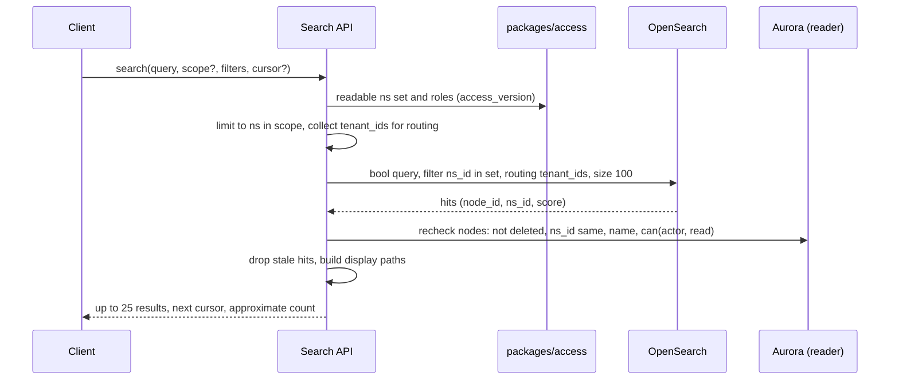
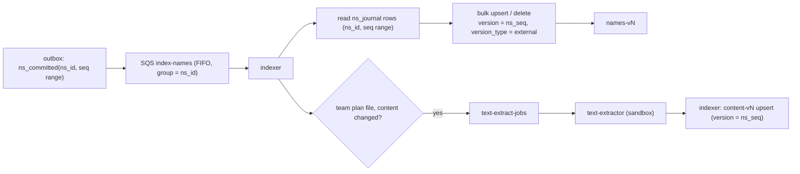

# Search: Dropbox

名前と本文の検索を決める。索引の形、日本語の解析、権限で絞る照会と結果の確かめ直し、ジャーナルからの索引の更新、作り直し、プランごとの範囲、S2 の分け方、OCR の将来（E15）を扱う。

前提となる決定は次のとおり。

- 検索は Amazon OpenSearch Service。索引は写しで、Aurora と S3 から作り直せる。権限の判定は持たせず、返す前に `can()` で確かめ直す。名前は n-gram、本文は形態素と n-gram（[ADR-0001](../decisions/0001-platform-and-stack.md)）
- 名前はすべてのプラン、本文はチームのプラン（テキスト、PDF の文字の層、Office の文書）。OCR は E15（[architecture/README.md](README.md) の 6 節）
- 社内の処理は outbox から SNS・SQS で受け、ジャーナルと食い違わない（[ADR-0005](../decisions/0005-namespace-journal-and-cursors.md)）
- パスの写しは持たない。検索の索引だけが写しを持てる（[ADR-0008](../decisions/0008-node-identity-and-names.md)）
- 本文の抽出は、プレビューと同じ隔離の変換で行う（[previews-and-thumbnails.md](previews-and-thumbnails.md)）
- 法務の確認待ち：L1（本文の抽出と索引は中身を機械で読む処理）

この文書で決めたことは次の ADR にある。

| ADR | 決定 |
| --- | --- |
| [0034](../decisions/0034-search-index-and-permission-filter.md) | 索引はノードごとの文書で、名前の索引（全プラン）と本文の索引（チームのプランの名前空間）に分け、テナントの ID で経路を決める。照会は `packages/access` が求めた読める名前空間の集合で絞り、上位の結果を Aurora で `can()` と今の名前・場所に確かめ直してから返す。索引の更新は outbox の合図で `ns_journal` を読み、`ns_seq` を外部のバージョンにして当てる。パスは返す時に Aurora で作る |
| [0035](../decisions/0035-ocr-deferred-to-e15.md) | 画像と走査した PDF の OCR は MVP で持たず、E15 で、日本語の試験の集まりでの文字の誤りの率と 1,000 頁あたりの費用を測ってから決める。MVP の索引には OCR のための別の項目（`body_ocr`）と抽出器のバージョンだけを用意し、本文と混ぜない |

## 1. 範囲

- 扱う：
  - 索引の文書と項目、名前の索引と本文の索引の分け方
  - 日本語の解析（名前、本文）と照会の作り方
  - 権限で絞る照会、結果の確かめ直し、件数の扱い
  - 索引の更新、遅れ、作り直し
  - フォルダーの中だけの検索、絞り込み（種類、更新の時刻）
  - S2 の分け方、OCR の将来
- 扱わない：
  - 本文の抽出の隔離（[previews-and-thumbnails.md](previews-and-thumbnails.md)）
  - 読める名前空間の集合の求め方（[namespaces-and-sharing.md](namespaces-and-sharing.md) の 5.2 節）
  - 検索の入力の IME（E7 の `web-ime`）
  - OpenSearch のクラスタの構成と運用（`infrastructure.md`、`capacity.md`）

## 2. 要件

| 要件 | 目標 | NFR |
| --- | --- | --- |
| 名前の検索の速さ | p99 1 秒 | NFR-011 |
| 名前の索引の遅れ | 確定から名前の検索に出るまで p95 60 秒 | NFR-011 |
| 本文の索引の遅れ | 確定から本文の検索に出るまで p95 15 分 | NFR-011 |
| 取りこぼし | 日本語の部分一致で名前を取りこぼさない（1 文字の照会を含む） | NFR-011 |
| 漏れ | 読めない名前空間の名前・抜粋・件数が、結果に出ない | NFR-007、quality.md の 2.2.1 節 F |
| 作り直し | 索引の全体を、Aurora と S3 から作り直せる | [ADR-0001](../decisions/0001-platform-and-stack.md) |

## 3. 本家の形（確かめたこと）

- 本家の検索の対象（名前、本文、画像の文字）とプランごとの区分、日本語の部分一致の振る舞いは、この文書の時点で公式の資料で確かめなかった（**未検証**）。
- Amazon OpenSearch Service で日本語の解析の部品（Kuromoji、ICU）を使えるかは、`search-sizing-poc` で確かめる（**未検証**）。

## 4. 索引の文書

ADR-0034。

### 4.1 名前の索引 `names-v<N>`

ノード（ファイル・フォルダー）ごとに 1 文書。文書の ID は `node_id`。マウントのノードは入れない（載せた名前空間の最上位のノードを、その名前空間の文書として入れる）。

| 項目 | 型・解析 | 用途 |
| --- | --- | --- |
| `tenant_id` | keyword | 経路（routing）と絞り込み |
| `ns_id` | keyword | 権限の絞り込み |
| `node_id`、`parent_id` | keyword | 確かめ直し |
| `ancestor_ids` | keyword の配列（名前空間の最上位まで、深さ 256 まで） | フォルダーの中だけの検索 |
| `name` | text：`ja_name_ngram`（1〜2 文字の n-gram） | 部分一致 |
| `name.exact` | keyword（`name_key`） | 完全一致の上げ |
| `name.prefix` | text：edge n-gram（1〜20 文字） | 前方一致の上げ |
| `ext` | keyword | 種類の絞り込み |
| `is_folder` | boolean | 絞り込み |
| `size`、`modified_at` | long、date | 絞り込み、並べ替え |
| `ns_seq` | — | 外部のバージョン（6 節） |

- 名前とパスは、この索引の中だけに写す（[ADR-0008](../decisions/0008-node-identity-and-names.md)）。表示のパスは入れない。返す時に Aurora で作る（5.3 節）。

### 4.2 本文の索引 `content-v<N>`

チームのプランの名前空間（持ち主のテナントがチームのプラン）の、今のリビジョンのファイルごとに 1 文書。

| 項目 | 型・解析 | 用途 |
| --- | --- | --- |
| `tenant_id`、`ns_id`、`node_id`、`rev_id` | keyword | 絞り込み、確かめ直し |
| `ancestor_ids` | keyword の配列 | フォルダーの中だけ |
| `body` | text：`ja_body_morph`（形態素） | 語の一致 |
| `body.ngram` | text：`ja_body_bigram`（2 文字の n-gram） | 形態素で切れない語の取りこぼしを防ぐ |
| `body_ocr` | text（E15 まで空。ADR-0035） | OCR の文字 |
| `extractor_version` | keyword | 作り直しの判定 |

- 本文は 1 ファイルの先頭 1 MiB の文字まで（抽出の上限は [previews-and-thumbnails.md](previews-and-thumbnails.md) の 7 節と合わせる）。
- 本文は索引に入れるが、`_source` に本文を持たない（`body` は `store: false`、`_source` から除く）。抜粋は 5.3 節のとおり、確かめ直しの後に S3 の抽出のテキストから作る。索引の写しの中に本文の全体の写しを増やさないため。

### 4.3 解析

| 解析器 | 正規化 | 分け方 |
| --- | --- | --- |
| `ja_name_ngram` | ICU の正規化（NFKC と case folding）、ひらがなとカタカナを揃える、長音と中黒の揺れを揃える | 1〜2 文字の n-gram |
| `ja_body_morph` | 同上 | Kuromoji（search の分け方）、品詞で助詞・記号を除く |
| `ja_body_bigram` | 同上 | 2 文字の n-gram |

- 検索の正規化は `name_key`（NFC と case folding）より緩くする。全角と半角、ひらがなとカタカナを同じにする。検索は見つけるためのもので、名前の一意（[ADR-0008](../decisions/0008-node-identity-and-names.md)）とは目的が違う。
- 照会の語も同じ解析を通す。1 文字の語は 1 文字の n-gram で、2 文字以上は 2 文字の n-gram の連なり（`match_phrase`）で探す。
- 英字の語は、n-gram と別に `name.prefix` で前方一致を上げる。

## 5. 照会

ADR-0034。

### 5.1 流れ

- 読める名前空間の集合で `terms` の絞り込みをする。集合が 10,000 を超える主体（ほとんどいない）は、名前空間を 10,000 ずつに分けて照会する。
- 経路（routing）は、集合の名前空間の持ち主のテナントの ID の集まり（多くの利用者で 1〜5）。叩く分片を減らす。
- 本文の検索は、主体のプランが本文の検索を含むときだけ `content-v<N>` も照会し、名前と本文の結果を点数で混ぜる（本文の一致は 0.5 倍）。
- フォルダーの中だけの検索は、そのフォルダーが名前空間の最上位なら `ns_id` の絞り込み、それ以外は `ancestor_ids` の絞り込み。

### 5.2 件数と並び

- 件数は「約」として返し、1,000 を超えたら「1,000 件以上」にする。読める名前空間だけを絞った後の数なので漏れではないが、確かめ直しで落ちる分があり、正確な数にならないため。
- 並びは点数（名前の完全一致 ＞ 前方一致 ＞ 部分一致 ＞ 本文）、同じ点数は更新の時刻の新しい順。
- 続きの取得は `search_after` の値を署名した不透明なカーソル（15 分）にする。

### 5.3 確かめ直し

- 索引の上位 100 件を Aurora（reader）で 1 回に引き、次を確かめる：ノードがある・削除されていない・`ns_id` が同じ・`can(actor, read, node)`。名前と場所は Aurora の今の値で返す（索引の遅れで古い名前を返さない）。
- 落ちた結果は返さず、次の 100 件を引き足す（最大 3 回）。
- 抜粋（本文の一致の周り 120 文字）は、確かめ直しが通った結果だけについて、S3 の抽出のテキスト（`extracted_texts`）から作る。照会の語の位置は、同じ解析で探す。
- 表示のパスは、親をたどって作る（[ADR-0008](../decisions/0008-node-identity-and-names.md)。パスの解決のキャッシュは `metadata-and-journal.md`）。主体の木の中のパス（マウントの場所から）で返す。

## 6. 索引の更新

ADR-0034。

- 合図は outbox、中身は `ns_journal`。indexer は合図の `seq` の範囲のジャーナルの行を読み、ノードごとに最後の状態に畳んでから当てる。
- OpenSearch の文書のバージョンに `ns_seq` を使い（`version_type=external`）、古い更新が新しい更新を上書きしない。削除も同じバージョンで当てる。
- SQS は FIFO で、メッセージのグループを `ns_id` にする（名前空間の中の順序を保つ）。外部のバージョンがあるので、順序が崩れても結果は同じ。
- 名前空間ごとに `index_checkpoints(ns_id, names_seq, content_seq)` を持つ。合図が落ちても、5 分ごとの掃除で `namespaces.ns_seq` と比べて追いつく。
- **祖先の移動**：フォルダーの移動・名前の変更で、子孫の `ancestor_ids` が変わる。indexer は、移動したフォルダーを祖先に持つ文書を `update_by_query` で直す（1 回 10,000 件ずつ、背景の優先度）。名前の変更だけなら子孫は変えない（`ancestor_ids` は ID なので）。直すまでの間、フォルダーの中だけの検索は古い場所で絞られる（5.3 節の確かめ直しで、範囲の外のものは落とす）。
- **名前空間をまたぐ移動**：元の名前空間の `delete` と、移動先の `upsert` として当てる（[ADR-0008](../decisions/0008-node-identity-and-names.md)）。文書の ID は `node_id` のままで、`ns_id` が変わる。
- **共有の変更**：権限は照会の時に絞るので、索引を直さない。
- **プランの変更**：チームのプランへ上げたら、本文の索引を名前空間ごとに背景で作る。下げたら、本文の文書を消す。

## 7. 作り直し

- 解析器か項目を変えたら、新しい番号の索引（`names-v<N+1>`）を作り、名前空間ごとに Aurora の今の木（ジャーナルではなく木の一覧）から入れ、その時点の `ns_seq` を `index_checkpoints` に記録し、以後をジャーナルから追う。全部が追いついたら別名（alias）を切り替える。
- 本文の作り直しは、S3 の抽出のテキストから入れる。抽出器のバージョンが変わったときだけ、抽出し直す。
- S1 の量（名前 25 億文書）の作り直しの時間と大きさは `search-sizing-poc` で測る。目安は 48 時間以内。

## 8. 規模と S2

- S1：名前の索引 25 億文書。1 文書の大きさ（n-gram を含む）を 1 KB と見て、主の 2.5 TB、写しを 1 つで 5 TB。分片は 1 つ 30〜50 GB で、主の分片 64。本文の索引はチームのプランの文書だけで、量は PoC で測る。すべて `search-sizing-poc` で確かめる（本システムの見込み）。
- 書き込み：commit のピーク 5,000 件/秒に、1 件あたり平均 2 ノードの変更として、1 秒 1 万文書の更新。`bulk` で 1 回 1,000 文書にまとめる。
- S2：テナントの集まり（コホート）ごとに索引を分け、`ns_directory`（[ADR-0004](../decisions/0004-tenancy-namespaces-and-rls.md)）にテナントの索引の位置を持つ。照会は、主体の読める名前空間の持ち主のテナントの索引だけを叩く。大きなチーム（10 万席）は専用の索引にする。

## 9. 障害のときの振る舞い

| 事象 | 起きること | 備え |
| --- | --- | --- |
| OpenSearch が落ちる | 検索が使えない | 検索だけを 503 にし、同期・一覧は続ける。Web は「検索が使えない」と出す。SLO は検索の SLI で見る |
| 索引の遅れ | 新しいファイルが出ない、消えたものが出る | 消えたものは確かめ直しで落ちる。名前の索引の遅れの p95 が 10 分を超えたらチケット（[runbooks](../runbooks/README.md)） |
| 確かめ直しの誤り | 漏れ | 応答の監査（抜き取りを `can()` に通し直す）。漏れの経路を `ops.search_enabled` で止め、前のイメージへ戻す |
| 祖先の直しの遅れ | フォルダーの中だけの検索に古い場所の結果 | 確かめ直しで範囲の外を落とす |
| 抽出の失敗 | 本文が出ない | 名前の検索は出る。`failed` の理由ごとに数える |

## 10. data-model への項目

| 表・置き場 | 中身 | 主キー・索引 | 節 |
| --- | --- | --- | --- |
| `index_checkpoints`（名前空間の表） | `names_seq`、`content_seq`、`index_version`、`updated_at` | `(tenant_id, ns_id)` | 6、7 |
| `extracted_texts`（名前空間の表） | [previews-and-thumbnails.md](previews-and-thumbnails.md) の 12 節 | `(tenant_id, ns_id, rev_id)` | 4.2、5.3 |
| `ns_directory` に足す列（S2） | `search_cohort` | — | 8 |
| OpenSearch | `names-v<N>`、`content-v<N>`、別名 `names`・`content` | 文書の ID は `node_id`、routing は `tenant_id` | 4 |
| SQS | `index-names`（FIFO、グループは `ns_id`）、`text-extract-jobs` | — | 6 |

## 11. テスト

- **日本語の取りこぼしの集まり**（E9 の合否基準）：1 文字の名前（「株」）、ひらがなとカタカナの揺れ（「ほうこく」と「ホウコク」）、全角と半角（「ＡＢＣ」と「ABC」、「ｶﾞ」と「ガ」）、NFD の名前、長音の揺れ（「サーバー」と「サーバ」）、複合語の部分（「議事録」の中の「事録」）、拡張子の中の一致、絵文字。照会と期待する結果の組を表にして、すべて当たることを確かめる。
- **PROP-SRCH-001（読めないものを返さない）**：任意の名前空間・共有・退出・方針の変更・索引の遅れの列で、検索の結果（名前、パス、抜粋、件数の上限の扱い）に、主体の読めない名前空間のものが出ない。
- **PROP-SRCH-002（索引と木の一致）**：任意の書き込みの列の後、indexer が追いついたら、名前の索引の文書の集まりが、削除されていないノードの集まりと一致する（`node_id`、`ns_id`、`name`、`ancestor_ids`）。
- **PROP-SRCH-003（古い更新で戻らない）**：任意の順序で合図とジャーナルを当てても、文書は最後の `ns_seq` の状態になる。
- 負荷：名前の検索 p99 1 秒、更新の遅れ p95 60 秒（`search-sizing-poc` と E13）。

## 12. Story の候補

| Epic | Story | 中身 |
| --- | --- | --- |
| E9 | `search-sizing-poc` | 8 節の大きさ、4.3 節の解析の部品、作り直しの時間 |
| E9 | `search-names` | 4.1・4.3・5・6 節（ADR-0034。PROP-SRCH-001〜003、取りこぼしの集まり） |
| E9 | `search-fulltext-team` | 4.2 節、6 節の本文の流れ。法務：L1 |
| E9 | `search-reindex` | 7 節（新しい Story の提案） |
| E15 | `ocr-evaluation` | ADR-0035 の計測 |

## 13. 未解決の問い

### 決定

2026-10-09 の既定案。

- **索引の分け方**：名前と本文の 2 つの索引、テナントで経路（ADR-0034）。
- **権限**：読める名前空間で絞り、上位を Aurora で確かめ直す（ADR-0034）。
- **更新**：outbox の合図とジャーナル、`ns_seq` を外部のバージョンに（ADR-0034）。
- **パス**：索引に表示のパスを持たず、返す時に作る。
- **検索の正規化**：NFKC と case folding、ひらがなとカタカナを揃える（`name_key` より緩い）。
- **OCR**：E15 で測ってから（ADR-0035）。

### 持ち越し

| 問い | いつ・どう決めるか |
| --- | --- |
| 本文の抽出と索引（中身を機械で読む処理）の同意と範囲 | **法務の確認待ち：L1** |
| OpenSearch での Kuromoji・ICU の使用、索引の大きさ、作り直しの時間 | `search-sizing-poc` |
| 個人のプランの利用者が、チームの共有フォルダーの本文を検索できるか | 今は主体のプランで決める（個人のプランは名前だけ）。E9 の試用で見直す |
| 本家の検索の範囲と振る舞い | 公式の資料で確かめなかった（**未検証**） |
