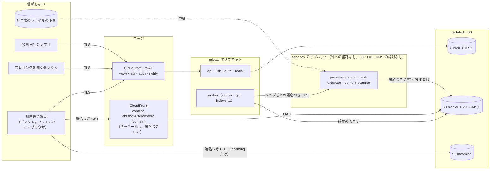
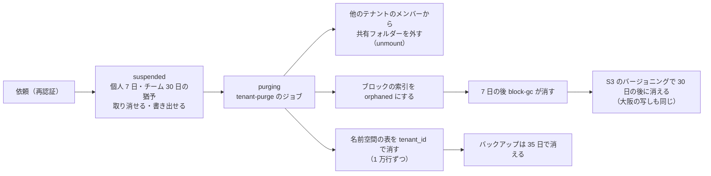

# Security: Dropbox

脅威モデル、信頼境界、利用者の中身のドメイン、暗号化と鍵、中身の検査（マルウェアと違法なコンテンツのハッシュの照合）の枠、監査ログ、データのライフサイクル（解約・削除・保持）、社内の運用者のアクセス、セキュリティの試験、インシデントへの対応を決める。法務の判断が要るもの（L1〜L4、L6、L7、L9）は枠だけを作り、結論を出さない。

| ADR | 決定 |
| --- | --- |
| [0044](../decisions/0044-encryption-keys-and-secrets.md) | 転送中は TLS 1.2 以上。保存時は、データの種類ごと・リージョンごとのカスタマー管理の KMS の鍵（S3 はバケットキー）。テナントごとの鍵は MVP で持たない（消去は本当に消す）。アプリの秘密（カーソルの HMAC、CloudFront の署名の鍵、Webhook の秘密）は鍵の ID つきで 2 つを並べて回す。端末の上では資格情報を OS の鍵の保管庫に置き、モバイルのオフラインのファイルだけを暗号化する |
| [0045](../decisions/0045-audit-log-and-data-lifecycle.md) | 監査ログを、管理と安全の事象（Aurora、操作と同じトランザクション）と、ファイルの活動の事象（Firehose → S3 の Object Lock、Athena で引く）と、プラットフォームの事象に分け、名前を持たず ID で持つ。日ごとのハッシュの連鎖で改ざんを見つける。保持の期間を `retention_policies` の 1 つの表で持つ。解約・削除は猶予の後に `tenant_id` で消し、ブロックは GC の経路で消す。完全な削除は 24 時間の後に実行する。値は法務の L3・L6 の後に確定する |
| [0046](../decisions/0046-content-scanning-framework.md) | マルウェアの検査と違法なコンテンツのハッシュの照合は、隔離した `content-scanner` で行う枠だけを作り、範囲（共有リンクで外に出すものだけか、すべてか）を AppConfig の `content_scan_policy` で切り替える。法務の L1・L2 の結論まで本番の範囲は空。見つけても中身を消さず、共有と配信の経路だけを止め、人が確かめる |

前提：テナントと `can()`（[ADR-0004](../decisions/0004-tenancy-namespaces-and-rls.md)）、重複排除の範囲（[ADR-0003](../decisions/0003-dedupe-scope-and-privacy.md)）、S3 の置き方（[ADR-0007](../decisions/0007-block-storage-layout-on-s3.md)）、端末の資格情報（[ADR-0041](../decisions/0041-accounts-auth-and-device-credentials.md)）。

## 1. 目標と前提

- **守るもの**：利用者のファイルの中身と名前、共有の範囲、ファイルを失わないこと。
- **目標**：
  - 読めない名前空間の名前・中身・有無が、どの経路にも届かない（NFR-007、K7）。
  - 確定した中身を、攻撃でも誤操作でも失わない。消されても、保持の期間の中で戻せる（NFR-005、NFR-009）。
  - 利用者のファイルを開く処理が乗っ取られても、他人のファイルと内部の網に届かない。
  - 社内の運用者が、利用者の中身を日常の権限で読めない。
- **前提**：物理の保存と AWS の基盤は AWS の責任の範囲。中身の暗号化はサーバー側（SSE-KMS）で、エンドツーエンドの暗号化と顧客の鍵は MVP の後（E16）。

## 2. 信頼境界

| 境界 | 守り |
| --- | --- |
| 端末 → エッジ | TLS、WAF、トークン（[ADR-0041](../decisions/0041-accounts-auth-and-device-credentials.md)）、レート制限 |
| 端末 → S3 | `incoming` への署名つき PUT だけ。正規のキーに書けない（[ADR-0007](../decisions/0007-block-storage-layout-on-s3.md)） |
| エッジ → 利用者の中身 | 別の登録可能なドメイン、クッキーなし、署名つき URL（4 節） |
| サービス → DB | RLS、`can()`、DB のロールで `packages/committer` の外の書き込みを拒む（[ADR-0004](../decisions/0004-tenancy-namespaces-and-rls.md)、[ADR-0005](../decisions/0005-namespace-journal-and-cursors.md)） |
| サービス → 隔離のタスク | ジョブごとの署名つき URL だけを渡す。タスクのロールに S3・DB・KMS の権限を持たせない（3.4 節） |
| 運用者 → 本番 | JIT、人のロールに中身の読み出しを与えない（9 節） |

## 3. 脅威モデル

### 3.1 マルウェアとランサムウェアの同期

| 脅威 | 対策 |
| --- | --- |
| 端末のランサムウェアが同期のフォルダーを暗号化し、全端末とサーバーへ広がる | 変更は新しいリビジョンで、古いリビジョンは保持の期間の中で残る。`mass-change-detector` が一斉の変更を検知し p95 5 分で知らせる（NFR-009）。時点を選んで巻き戻す（[versions-and-recovery.md](versions-and-recovery.md)） |
| ランサムウェアが手元のファイルを消し、削除が同期で広がる | 消しすぎの止め（1 回の計画で 1,000 ファイルか木の 10%。[ADR-0006](../decisions/0006-sync-conflict-model.md)）。削除したファイルは保持の期間の中で戻せる |
| 乗っ取った資格情報でバージョン履歴まで消す | 完全な削除は再認証を求め、24 時間の後に実行し、その間は取り消せる。知らせを送る（8.3 節、[ADR-0045](../decisions/0045-audit-log-and-data-lifecycle.md)） |
| 共有フォルダーに置いたマルウェアが、他のメンバーの端末に届く | 本システムは中身を実行しない。検査の枠（6 節）は法務の L1 の後。受けたファイルに OS の「インターネットから来た」の印（macOS の quarantine の拡張属性、Windows の Mark of the Web）を付けるかは [file-system-integration.md](file-system-integration.md) で決める（持ち越し） |

### 3.2 共有リンクの総当たりと収集

| 脅威 | 対策 |
| --- | --- |
| トークンの総当たり | トークンは 128 ビット以上の乱数。`link_tokens` にはトークンの SHA-256 だけを持つ（[ADR-0004](../decisions/0004-tenancy-namespaces-and-rls.md)）。当たらないトークンを IP で 1 分 30 回引いたら 1 時間止める（[ADR-0028](../decisions/0028-shared-link-abuse-controls.md)）。止めた IP は WAF の IP の集合へ載せ、エッジで止める |
| 存在の確かめ | 存在しない・無効・期限切れのトークンに、匿名の要求者へ同じ応答（状態のコードと時間）を返す。文言の違いを出すかは [shared-links.md](shared-links.md) で決めるが、無効・期限切れを知らせるのは作った人が自分で開いたときだけにする |
| 漏れたリンクの拡散（検索エンジン、リファラー） | 共有リンクのページに `X-Robots-Tag: noindex`、`Referrer-Policy: no-referrer`。トークンをログ・トレース・メトリクスに出さない（[observability.md](observability.md) の 2.1 節）。CloudFront のアクセスのログから `/s/` の経路を落とせるかは**未検証**（[infrastructure.md](infrastructure.md) の持ち越し） |
| ボットの大量のダウンロード | リンクごと・IP ごとのダウンロードの上限、WAF のボットの対策（[shared-links.md](shared-links.md)） |

### 3.3 アカウントの乗っ取りからの一括の削除

| 段階 | 対策 |
| --- | --- |
| 乗っ取りを難しくする | パスワードを持たない。パスキーを推す。メールのコードの試行の上限。新しい端末のログインの知らせ（[accounts-and-teams.md](accounts-and-teams.md) の 5 節） |
| 乗っ取った後の被害を絞る | 危ない操作の再認証（同 5.5 節）。1,000 を超えるノードの一括の削除、アカウント全体の巻き戻し、完全な削除、他の端末の切り離し、全体のスコープのアプリの許可が当たる |
| 気づく | 一斉の変更の検知（本人とチームの `security_admin` へ知らせる）、監査ログ、端末の一覧 |
| 戻す | すべてのセッションと端末の取り消し、時点を選んだ巻き戻し（runbook `account-takeover.md`） |

### 3.4 プレビューの変換を狙う悪意のあるファイル

プレビュー・サムネイル・本文の抽出・中身の検査は、第三者の汎用の部品（画像の変換、PDF の描画、Office の文書の変換、動画の最初の画面）で利用者のファイルを開く。部品の脆弱性を突かれる前提で、次の要件を置く。部品と上限の値は [previews-and-thumbnails.md](previews-and-thumbnails.md) で決める。

- **ネットワークを持たない**：sandbox のサブネットは、インターネットと他のサブネットへの経路を持たない。置くのは、S3 のゲートウェイのエンドポイント（方針で `blocks`・`blocklists` の GET と `previews` の PUT に限る）と、ECR・CloudWatch Logs・ジョブの SQS のインターフェースのエンドポイントだけ（[infrastructure.md](infrastructure.md) の 2.1 節）。
- **権限を持たない**：タスクのロールは、イメージの取得、ログの出力、ジョブのキューの受信と削除だけ。S3・DB・KMS の権限を持たない。入力と出力は、オーケストレーター（private の Worker）がジョブごとに作る、期限 10 分の署名つき URL だけで行う（[ADR-0032](../decisions/0032-sandboxed-preview-pipeline.md)）。
- **上限**：1 つの変換を新しいプロセスで行い、CPU の時間、メモリー、出力の大きさ、展開の比率に上限を付ける。プロセスは root でなく、ルートのファイルシステムを読み取り専用にし、一時の領域は変換ごとに消す。タスクは 100 回の変換か 1 時間で入れ替える。
- **出力を信用しない**：出力は画像・PDF・テキストの決めた形式だけにし、オーケストレーターが形式を確かめてからキャッシュに入れる。
- **利用者の中身のドメイン**から返す（4 節）。

### 3.5 重複排除の横の漏れ

[ADR-0003](../decisions/0003-dedupe-scope-and-privacy.md) の規則（テナントの中だけ、読める名前空間の参照にあるときだけ「送らなくてよい」）を守る。加えて、次の横の経路を塞ぐ。

| 経路 | 対策 |
| --- | --- |
| commit の答えの違い | ADR-0003 の表。答えの形を、読めない名前空間の中身に依らせない |
| 送信の後の確かめの時間（テナントに既にあれば写さないので速い） | クライアントに見える「確かめの完了」までの時間を、負荷試験の環境で 2 つの世界で比べる（[quality.md](../quality.md) の 2.2.1 節 G）。分布の差が見分けられる（1 万の試行で KS 検定の p < 0.01）なら、ブロックの大きさから見込んだ写しの時間まで完了を待たせる |
| 容量の増え方 | 論理の大きさで数える（[accounts-and-teams.md](accounts-and-teams.md) の 7.2 節） |
| プレビューのキャッシュ、検索の索引 | キーをテナントとリビジョンにし、内容のハッシュで共有しない（[ADR-0007](../decisions/0007-block-storage-layout-on-s3.md) の `previews` のキー） |
| エラーの違い | 「送れ」のブロックの URL とエラーの種類を、索引にあるかないかで変えない |

### 3.6 端末の盗難と切り離し

- 資格情報は OS の鍵の保管庫に置く。更新には端末の鍵の署名が要る（[ADR-0041](../decisions/0041-accounts-auth-and-device-credentials.md)）。
- 切り離しで同期はすぐ止まり、選べば次の接続で消去する（[ADR-0043](../decisions/0043-admin-roles-device-wipe-and-member-access.md)）。
- 手元の同期のフォルダーは平文のファイルである。ディスクの暗号化（FileVault、BitLocker）は OS の機能に任せる。チームの方針で端末のディスクの暗号化を必須にできるかは、OS から確かめる手段の調査が要る（持ち越し）。

### 3.7 公開 API、OAuth のアプリ、Webhook

- アプリのスコープ、チームのアプリの許可、レート制限は [api-and-webhooks.md](api-and-webhooks.md)。トークンの形と保存は [ADR-0041](../decisions/0041-accounts-auth-and-device-credentials.md) と同じ。
- Webhook の送信は egress のサブネットから出し、送信の直前に名前を引いて、私的なアドレス・リンクローカル・メタデータのアドレスへの接続を拒む（SSRF。[infrastructure.md](infrastructure.md) の 2.3 節）。
- Webhook と通知に名前・中身を入れない（[ADR-0005](../decisions/0005-namespace-journal-and-cursors.md)）。

### 3.8 社内の運用者

9 節。

### 3.9 供給網

| 対象 | 対策 |
| --- | --- |
| サーバーの依存 | 依存の固定、SBOM、脆弱性の走査、本家の実装の禁止の一覧（[ADR-0001](../decisions/0001-platform-and-stack.md)） |
| クライアントの署名の鍵（Apple の Developer ID、Windows のコード署名、更新の署名の鍵） | 署名の鍵は `release` のアカウントの HSM か、鍵を書き出せない署名のサービスに置く。署名のジョブは 2 人の承認で動く（[delivery.md](delivery.md) の 5 節） |
| 更新の配布の乗っ取り | 更新の目録と成果物に署名し、クライアントは埋め込んだ公開鍵で確かめる。HTTPS だけに頼らない（[delivery.md](delivery.md) の 5 節） |
| CI の資格情報 | GitHub Actions の OIDC で、長い期限の鍵を持たない（他の題材と同じ） |

## 4. 利用者の中身のドメインと Web の守り

- **利用者の中身は `content.<brand>usercontent.<domain>` からだけ返す。** 本体（`<brand>.<domain>`）と別の登録可能なドメインにし、本体のクッキーが届かず、中身の中のスクリプトが本体の文脈で動かないようにする。
- `content` はクッキーを使わない。読み出しは CloudFront の署名つき URL（ブロックは 1 時間、プレビューは 10 分）で、`can()` で許したときだけ出す（[ADR-0007](../decisions/0007-block-storage-layout-on-s3.md)）。
- 応答のヘッダー：
  - すべて：`X-Content-Type-Options: nosniff`、`Cross-Origin-Resource-Policy: cross-origin`（Web の画面から読むため）、`Strict-Transport-Security`。
  - ダウンロード：`Content-Disposition: attachment`。
  - 画面の中に出すプレビュー：`Content-Security-Policy: sandbox; default-src 'none'; img-src 'self'; style-src 'unsafe-inline'`。HTML・SVG の利用者のファイルをそのまま返さない（変換した画像か PDF だけ）。
- **本体のドメイン**：厳しい CSP（`script-src 'self'` とハッシュ、`frame-ancestors 'none'`）、HSTS（preload を目指す）、Web の画面の資産はハッシュつきの不変の名前。
- 共有リンクの画面（`www.<brand>.<domain>/s/<token>`）は、本体のドメインで殻を出し、中身は `content` から読む。

## 5. 暗号化と鍵

ADR-0044。

### 5.1 転送中

- エッジ（CloudFront、ALB）は TLS 1.2 以上（1.3 を優先）。古い暗号を外したセキュリティの方針を使う。
- S3 への直接のアップロード：バケットの方針で `aws:SecureTransport` を必須にする。TLS のバージョンの下限をバケットの方針で強制できるか（`s3:TlsVersion` の条件）は `s3-buckets-baseline` で確かめる（**未検証**）。
- 内部：Aurora（`rds.force_ssl`）、Valkey の転送中の暗号化、OpenSearch のノード間の暗号化と HTTPS。サービスの間は ALB から ECS まで TLS。

### 5.2 保存時

| 対象 | 鍵 | 注記 |
| --- | --- | --- |
| S3 `incoming`・`blocks`・`blocklists` | `kms-blocks`（リージョンごと） | SSE-KMS とバケットキー（[ADR-0007](../decisions/0007-block-storage-layout-on-s3.md)） |
| S3 `previews` | `kms-previews` | 作り直せる |
| S3 `audit`、活動の事象 | `kms-audit` | Object Lock |
| Aurora | `kms-aurora` | 大阪の二次は大阪の鍵 |
| OpenSearch、Valkey | `kms-search`、`kms-cache` | |
| Secrets Manager | `kms-secrets` | 大阪へレプリカ |
| CloudWatch Logs、Firehose | `kms-logs` | |

- 鍵はデータの種類ごと・リージョンごとに分ける。大阪の写しは大阪の鍵で暗号化し直す（S3 の CRR、Aurora Global Database）。マルチリージョンの鍵は使わない（鍵の影響の範囲を絞る）。
- 鍵の方針で、`kms:Decrypt` を決めたサービスのロールだけに許す。人のロールは、break-glass を除いて復号できない（9 節）。
- 鍵は 1 年で自動で回す。鍵の削除の予約・無効化は SCP で break-glass に限る（[infrastructure.md](infrastructure.md) の 1 節）。
- **テナントごとの鍵を持たない。** 消去は行とオブジェクトを本当に消すことで行う（8 節）。顧客の鍵（BYOK）とエンドツーエンドの暗号化は E16。

### 5.3 アプリの秘密

| 秘密 | 置き場所 | 回し方 |
| --- | --- | --- |
| カーソルの HMAC の鍵（[ADR-0005](../decisions/0005-namespace-journal-and-cursors.md)） | Secrets Manager | 鍵の ID をカーソルに入れ、1 年ごとに新しい鍵で署名し、古い鍵での確かめを 100 日残す（カーソルの 90 日より長く） |
| CloudFront の署名つき URL の鍵の組 | Secrets Manager（秘密鍵）、CloudFront の信頼する鍵のグループ（公開鍵） | 90 日ごと。2 つの鍵を並べる |
| 端末の状態の確かめ、招待、SCIM のトークン | DB にハッシュだけ | — |
| Webhook の署名の秘密（アプリごと） | Aurora に、`kms-secrets` での封筒の暗号化で | アプリが作り直す |
| SAML の SP の署名の鍵、APNs・FCM の資格情報、メールの送信の鍵 | Secrets Manager | 期限の 30 日前に知らせる |

### 5.4 端末の上

- 資格情報と端末の鍵は OS の鍵の保管庫（[ADR-0041](../decisions/0041-accounts-auth-and-device-credentials.md)）。
- ローカルの状態の DB とブロックの索引は暗号化しない。隣の同期のフォルダーが平文で、暗号化しても守りが増えないため。OS の利用者の権限で、他の利用者から読めないようにする。
- モバイルのオフラインのファイルは、鍵の保管庫の鍵で暗号化して持つ（切り離しで鍵を消せば読めなくなる。[ADR-0043](../decisions/0043-admin-roles-device-wipe-and-member-access.md)）。

## 6. 中身の検査の枠

ADR-0046。法務の L1（中身を機械で読むことと通信の秘密）と L2（違法なコンテンツのハッシュの照合の範囲）の確認待ち。**仕組みを作り、範囲は空で始める。**

| 検査 | 方法 | 範囲の候補 |
| --- | --- | --- |
| マルウェア | 第三者の汎用の検査の部品を `content-scanner`（sandbox）で動かす。定義の更新は毎日イメージを作り直して入れる（タスクはネットワークを持たない） | `link_public`：共有リンクで外の人へ配るファイル。`all_uploads`：すべての新しいリビジョン |
| 違法なコンテンツのハッシュの照合 | 指定の機関から受けたハッシュの一覧と、リビジョンの `content_sha256` を突き合わせる（中身を読まない）。知覚的なハッシュ（似た画像）は、部品と許諾を決めてから足す | 同上 |

- 範囲は AppConfig の構成 `content_scan_policy`（検査ごとに `none`・`link_public`・`all_uploads`）で決める。法務の結論まで本番は `none`。構成の変更は監査ログに残す。
- **見つけても中身を消さない・変えない。** リビジョンに `scan_state`（`clean`・`malicious`・`hash_match`）を付け、次だけを止める：
  - `malicious`：共有リンクでの配信とプレビューを止め、持ち主に知らせる。持ち主と名前空間のメンバーのダウンロードは警告つきで続ける。
  - `hash_match`：そのリビジョンの共有リンク・プレビュー・共有の追加を止め、人（信頼と安全の担当）の確認へ回す。届出・保全・アカウントの扱いは法務の L2 の手順で決める。
- 同期の経路は止めない（止めると端末の木が食い違う）。持ち主の同期を止める必要があるかは L2 で決める。
- 利用者からの通報の入口は [shared-links.md](shared-links.md)。runbook は `abuse-and-takedown.md`（法務の L2 の後）。

## 7. 監査ログ

ADR-0045。

| 種類 | 置き場所 | 書くもの | 読める人 |
| --- | --- | --- | --- |
| 管理と安全の事象（`tenant_audit_events`） | Aurora、月で分割、テナントの RLS | ログイン、端末の登録・切り離し・消去、共有と共有リンクの作成・変更・無効化、方針の変更、管理の役割、SSO・SCIM の設定、管理者のアクセスの許可、一斉の変更の検知、巻き戻し、完全な削除、アプリの許可、Webhook、書き出し | 本人（個人のテナント）、チームの `team_admin`・`auditor` |
| ファイルの活動の事象（`activity_events`） | Firehose → S3（`audit` のバケット、Parquet、テナントと日で分割）。Athena で引く | 作成・変更・移動・削除・復元（`ns_journal` から写す）、ダウンロード・プレビュー・共有リンクでのアクセス（Link と配信の URL の発行から） | チームの `team_admin`・`auditor`。チームのプランだけ |
| プラットフォームの事象（`platform_audit_events`） | Aurora の保守用のスキーマ | 運用者の JIT のアクセス、break-glass、データの直接の修正、`epoch` の更新、検査の構成の変更、法的な保全 | セキュリティの担当 |

- 1 行は `(id, tenant_id, at, actor_kind, actor_id, on_behalf_of, device_id, action, target_kind, target_id, ns_id, reason_code, request_id, ip, prev_hash, row_hash)`。**ファイルの名前・パス・中身を持たない。** 画面と書き出しで、`can()` で許した範囲の名前をその時に引いて付ける。名前を引けないもの（保持の期間を過ぎた）は ID だけを出す。メンバーのルートの名前空間の名前を管理者に見せるかは法務の L7。
- 管理と安全の事象は、操作と同じ DB のトランザクションで書く。書けなければ操作も失敗させる。
- 活動の事象は、`ns_journal` を読む `activity-exporter`（outbox から）と、Link・配信の URL の発行から Firehose へ送る。欠けを、ジャーナルの番号と事象の数の照合で日ごとに確かめる。
- 改ざんの検出：テナントごと・日ごとに `row_hash = SHA-256(prev_hash ‖ 正規化した行)` の連鎖を作り、日の終わりの値を `audit` のバケット（Object Lock のコンプライアンスモード）へ書く。毎日確かめる。
- IP アドレスを持つ期間と、開示の請求への応じ方は法務の L3（runbook `legal-request.md`）。

## 8. データのライフサイクル

ADR-0045。値は法務の L3・L6 の後に確定する。

### 8.1 保持の期間（既定）

| データ | 既定 | 消し方 |
| --- | --- | --- |
| 古いリビジョン、削除したファイル | プランの保持（30・180・365 日） | `lifecycle` が `packages/committer` で期限切れにし、参照を減らす（[versions-and-recovery.md](versions-and-recovery.md)） |
| 参照 0 のブロック | 7 日の猶予の後に消す。S3 のバージョニングで 30 日 | `block-gc`（[ADR-0007](../decisions/0007-block-storage-layout-on-s3.md)） |
| `ns_journal` | 92 日（カーソルは最後の利用から 90 日） | 日の分割を落とす（[ADR-0023](../decisions/0023-tree-listing-snapshot-and-journal-retention.md)） |
| `incoming` | 2 日 | S3 のライフサイクル |
| `previews` | 90 日 | S3 のライフサイクル |
| 管理と安全の事象 | 1 年（Aurora） | 月の分割を落とす |
| 活動の事象、監査の写し | 1 年（S3 の Object Lock） | Object Lock の期限とライフサイクル |
| 端末の最後の接続の IP アドレス | 90 日 | 日次のジョブ |
| アプリのログ | CloudWatch Logs 30 日、log-archive 13 か月 | 保持の設定 |
| Aurora のバックアップ | 35 日 | 期限で消える |

- 値の正本は `retention_policies`（データの種類 → 期間、根拠、法務の結論のバージョン）と Terraform の S3 のライフサイクル。CI が両者を比べる。

### 8.2 解約とアカウントの削除

- 猶予の間は、ログイン・同期・共有リンク・API・Webhook を止める。チームの管理者は書き出しと取り消しをできる。
- 他のテナントのメンバーの木から、そのテナントの共有フォルダーを外すことは、ジャーナルに載せる（[ADR-0004](../decisions/0004-tenancy-namespaces-and-rls.md) の X5、[ADR-0005](../decisions/0005-namespace-journal-and-cursors.md)）。メンバーの手元の扱いは [sync-engine.md](sync-engine.md)。
- 消える日の目安：チームは、猶予 30 日＋消す処理 1 日＋GC の猶予 7 日＋S3 の古いバージョン 30 日 = 約 68 日。バックアップの 35 日は、この間に終わる。顧客に示す日数は法務の L6・L9。
- 消した事実（テナントの ID、時刻、行とオブジェクトの数）をプラットフォームの事象に残す。

### 8.3 完全な削除

- 利用者が保持の期間の前に、削除したファイル・古いバージョンを完全に消す操作は、再認証を求め、24 時間の後に実行する。その間は取り消せ、本人（チームは `content_admin` と `security_admin`）に知らせる。
- 実行は `packages/committer` で期限切れと同じ経路にし、ブロックは GC の経路で消える。

### 8.4 法的な保全

- 法務の L6 の結論でリーガルホールドを MVP に入れるなら、`legal_holds`（テナント・名前空間・メンバーの単位、期間）を立て、`lifecycle`・`tenant-purge`・`block-gc`・完全な削除が、保全の対象を飛ばす。仕組みの置き場所だけを決め、MVP に入れるかは L6。

## 9. 社内の運用者のアクセス

- 本番のデータへの常時のアクセスを持たない。IAM Identity Center の JIT（1 時間、承認つき）で、調査のロールを使う。
- **人のロールは利用者の中身を読めない。** `blocks`・`blocklists`・`previews` のバケットの方針で、人のロールの `GetObject` を拒む。`kms-blocks` の鍵の方針で、人のロールの復号を拒む。Aurora の調査のロールは、名前の列（`nodes.name`）を読めないビューだけを使う。
- break-glass（障害の復旧で中身に触れる必要があるとき）は、2 人の承認、時間の上限、プラットフォームの事象への記録で行う。
- サポートは、利用者の中身を見ない。見る必要があるときは、利用者が自分で共有リンクをサポートに渡す。

## 10. セキュリティの試験

| 試験 | 中身 | いつ |
| --- | --- | --- |
| 漏れの経路の表 | [quality.md](../quality.md) の 2.2.1 節 F。この文書で足す主体：停止した主体、切り離した端末、期限の切れた管理者の許可、`hash_match` のリビジョンの共有リンク | PR・夜間 |
| 重複排除の 2 つの世界 | 同 G。確かめの完了の時間の分布（3.5 節） | PR（形）、負荷試験の環境（時間） |
| 隔離の検査 | sandbox のタスクから外への通信、他のジョブの URL への書き込み、上限の超過、ロールの権限（IAM の方針の検査） | PR（方針の検査）、夜間（実の環境） |
| ファジング | プレビュー・抽出の入口（同 I） | 夜間 |
| ヘッダーの検査 | 4 節のヘッダー、`content` にクッキーがないこと、本体から利用者の中身が返らないこと | PR |
| IAM・バケット・鍵の方針の検査 | 人のロールの `GetObject`・復号の拒否、クライアントの署名の役割が `incoming` だけ（[ADR-0007](../decisions/0007-block-storage-layout-on-s3.md)） | PR（Terraform の plan） |
| 監査ログ | 対象の操作が監査の行を書けないとき失敗する。連鎖の検証。活動の事象の欠けの照合 | PR・日次 |
| DAST | Web、API、共有リンク、`auth` | 夜間（staging） |
| 外部のペンテスト | 共有リンク、プレビュー、API、デスクトップのクライアント、端末の資格情報 | E13（`pentest-external`） |

## 11. 脆弱性の管理

- 依存とイメージの走査（Inspector、CI）。High 以上は 7 日、Critical は 48 時間で直す。プレビューの変換の部品は、告知から 48 時間で入れ替えるか、その形式の変換を止める（`ops.preview_formats_enabled` で形式ごとに止める）。
- クライアントの脆弱性は、最低のバージョン（[delivery.md](delivery.md) の 5.4 節）で古いバージョンの同期を止めて更新を促す。
- 脆弱性の報告の窓口（`security.txt`）と、報奨金の制度は GA の前に決める（持ち越し）。

## 12. インシデントへの対応

| 区分 | 例 | 初動 |
| --- | --- | --- |
| 権限の漏れ | 応答の監査の不一致、読めない名前空間の名前が届いた報告 | SEV1 の候補。経路をフラグか前のイメージで止める。runbook `access-leak-response.md` |
| 中身の消失 | ブロックの参照の監査の不一致 | SEV1 の候補。`ops.block_gc_enabled` を止める。`block-integrity-incident.md` |
| 乗っ取り | 一斉の変更と新しい端末の組 | `account-takeover.md` |
| 隔離の違反 | sandbox からの外への通信の試み | `preview-sandbox-incident.md`。その形式の変換を止める |
| 漏えい等の報告 | 個人データの漏えいの疑い | 報告の義務を負う者と期限は法務の L4。手順は `incident-response.md` に法務の連絡を入れる |

## 13. 法務の論点（法務の確認待ち）

| # | この領域で待つこと | 設計の置き場所 |
| --- | --- | --- |
| L1 | 中身を機械で読む処理（プレビュー、索引、検査）に同意が要るか、同意の取り方。端末の匿名の計測の外部送信規律 | 6 節の範囲、[observability.md](observability.md) の 4 節 |
| L2 | ハッシュの照合の範囲、見つけたときの手順と届出、送信防止措置 | 6 節 |
| L3 | IP アドレス・アクセスの記録の保持、開示の請求と捜査機関の照会への応じ方 | 7 節、8.1 節 |
| L4 | 委託か取得か、漏えい等の報告の義務 | 12 節、[accounts-and-teams.md](accounts-and-teams.md) |
| L6 | 保持の期間、解約の後の消去の期限、リーガルホールド | 8 節 |
| L7 | 管理者のアクセスと、監査ログで管理者にメンバーのファイルの名前を見せるか | 7 節、[accounts-and-teams.md](accounts-and-teams.md) の 11.2 節 |
| L9 | DPA、サブプロセッサーの一覧、顧客に示す消去の日数 | 8.2 節 |

## 14. Story の候補

| Epic | Story | 中身 |
| --- | --- | --- |
| E1 | `kms-keys-and-secrets` | 5.2・5.3 節の鍵、鍵の方針、秘密の回し方 |
| E1 | `audit-log-table-and-archive` | 7 節の管理と安全の事象、連鎖、Object Lock の写し。保持は法務：L3・L6 |
| E1 | `operator-access-baseline` | 9 節の JIT、人のロールの中身の拒否、名前を読めないビュー |
| E9 | `preview-sandbox` | 3.4 節の要件（previews-and-thumbnails と共同）。法務：L1 |
| E6 | `usercontent-domain-headers` | 4 節のドメインとヘッダー |
| E12 | `activity-events-pipeline` | 7 節の活動の事象（Firehose、Athena、欠けの照合） |
| E12 | `data-lifecycle` | 8 節の `retention_policies`、`tenant-purge`、完全な削除の 24 時間。法務：L6 |
| E12 | `content-scanner-framework` | 6 節の枠、`content_scan_policy`、`scan_state`。法務：L1・L2 |
| E13 | `pentest-external` | 10 節 |

## 15. 未解決の問い

### 決定

2026-10-09 の既定案。

- **鍵**：データの種類ごと・リージョンごとの KMS の鍵、テナントごとの鍵なし（ADR-0044）。
- **監査ログ**：3 つの種類、名前を持たない、連鎖（ADR-0045）。
- **消去**：猶予の後に `tenant_id` で消し、ブロックは GC の経路。完全な削除は 24 時間の後（ADR-0045）。
- **中身の検査**：枠だけを作り、範囲は空（ADR-0046）。
- **sandbox**：外への経路も S3・DB・KMS の権限も持たず、ジョブごとの署名つき URL だけ（3.4 節）。

### 持ち越し

| 問い | いつ・どう決めるか |
| --- | --- |
| 中身の検査の範囲、見つけたときの手順 | **法務の確認待ち：L1・L2** |
| 保持の期間、消去の期限、リーガルホールド | **法務の確認待ち：L6** |
| IP アドレスとアクセスの記録の保持、開示の手順 | **法務の確認待ち：L3** |
| 監査ログでメンバーのファイルの名前を管理者に見せるか | **法務の確認待ち：L7** |
| 受けたファイルに OS の「インターネットから来た」の印を付けるか | E5、[file-system-integration.md](file-system-integration.md) |
| 端末のディスクの暗号化をチームの方針で求められるか | E5 の `placeholder-platform-survey` と合わせて調べる |
| 確かめの完了の時間の差を待たせて埋める必要があるか | E2 の `dedupe-two-worlds-tests` の結果 |
| 脆弱性の報告の窓口と報奨金 | E13 |
| S3 のバケットの方針で TLS のバージョンを強制できるか | E1 の `s3-buckets-baseline`（**未検証**） |

## 16. quality.md・runbooks・data-model への項目

### quality.md

- 2.2.1 節 F の漏れの経路の表に、主体「停止した主体」「切り離した端末」「期限の切れた管理者の許可」と、経路「`hash_match` のリビジョンの共有リンク」「監査ログの画面（名前の解決）」を足す。
- 2.2.1 節 G に、確かめの完了の時間の分布の比べを足す（3.5 節）。
- E13 の合否基準：IAM・バケット・鍵の方針の検査が緑、監査ログの連鎖と欠けの照合が 7 日続けて 0。

### runbooks

- `account-takeover.md`（3.3 節）。
- `abuse-and-takedown.md`：6 節の `hash_match` の人の確認（法務の L2 の後）。
- `legal-request.md`：7 節の記録の書き出し（法務の L3 の後）。
- `tenant-purge.md`：8.2 節の進み具合の確かめと止め方。

### data-model への項目

| 表・置き場所 | 中身 | 節 |
| --- | --- | --- |
| `tenant_audit_events`（テナントの表、月の分割） | 7 節の 1 行の形 | 7 |
| `platform_audit_events`（保守用のスキーマ） | 運用者、break-glass、`epoch`、検査の構成 | 7 |
| `audit_chain_heads`（保守用のスキーマ） | テナントと日 → 連鎖の最後の値、写した時刻 | 7 |
| S3 `audit` のバケットの `activity/` | 活動の事象（Parquet、テナントと日で分割）。Glue のテーブル | 7 |
| `retention_policies` | データの種類 → 期間、根拠、法務の結論のバージョン | 8.1 |
| `tenants.status` に `purging`、`tenant_purge_jobs` | 消す処理の進み具合 | 8.2 |
| `pending_purges`（名前空間の表） | 完全な削除の予約（実行の時刻、取り消し） | 8.3 |
| `legal_holds`（テナントの表） | 保全の対象と期間（法務の L6 の後） | 8.4 |
| `revisions` に足す列 | `scan_state`、`scanned_at`、`scan_engine_version` | 6 |
| AppConfig | `content_scan_policy`、`ops.preview_formats_enabled` | 6、11 |

## 出典

いずれも 2026-10-09 に確認。

- AWS, [Checking object integrity](https://docs.aws.amazon.com/AmazonS3/latest/userguide/checking-object-integrity.html)（[ADR-0007](../decisions/0007-block-storage-layout-on-s3.md) で確認したもの）
- Dropbox Help Center, [How to remote wipe files from a computer](https://help.dropbox.com/delete-restore/delete-dropbox-device)：消去は安全な消去ではない
