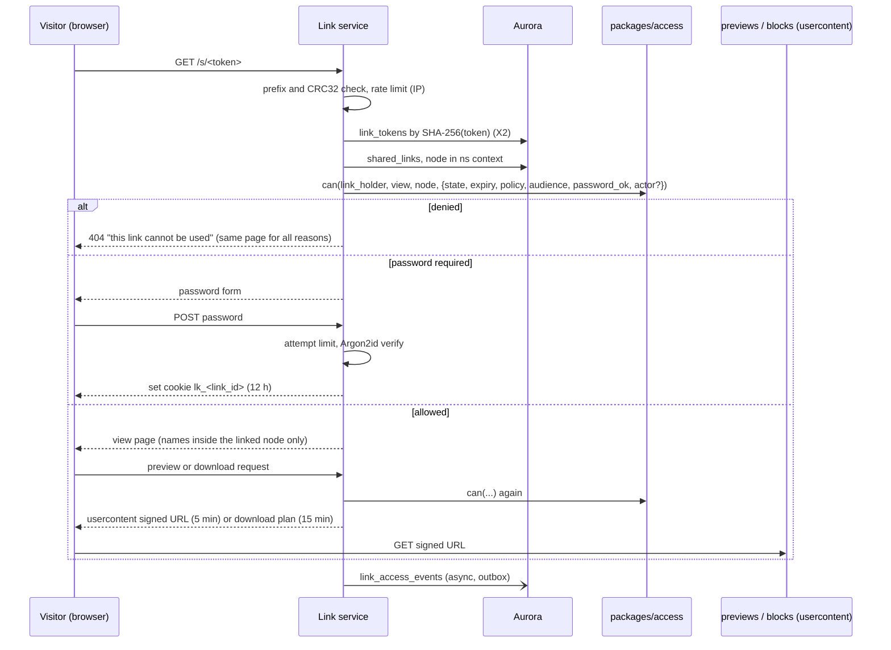
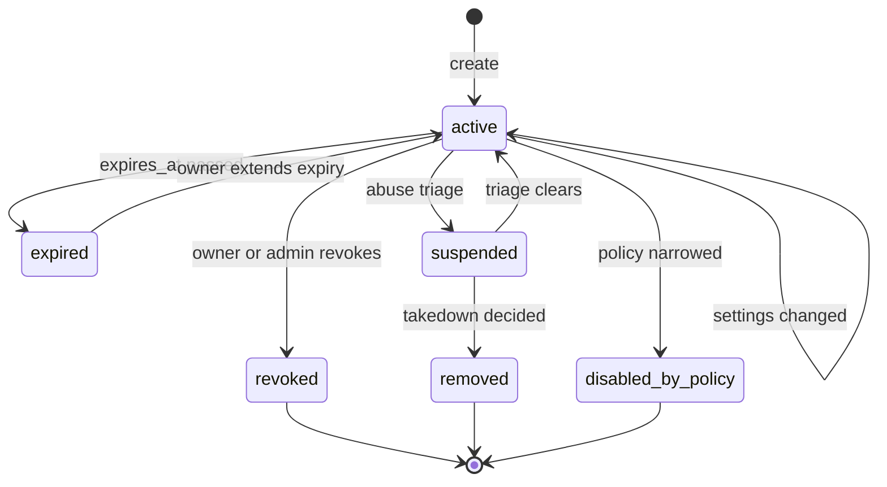
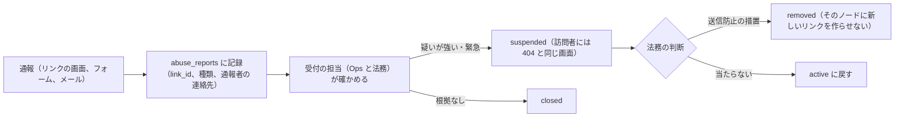

# Shared links: Dropbox

共有リンクを決める。リンクの形とトークン、見せる相手（だれでも・チーム・メンバー）、パスワード、期限、ダウンロードの禁止、チームの方針、解決の流れ、アクセスの記録、無効化、悪用の対策（レート制限、帯域の上限、総当たり）、違法なコンテンツの通報の入口を扱う。

前提となる決定は次のとおり。

- 共有リンクの主体は「リンクを持つ人」で `view` だけを持つ。パスワード・期限・方針は `can()` の入力。`link_tokens` は RLS の外の表で、解決は X2 の経路（[ADR-0004](../decisions/0004-tenancy-namespaces-and-rls.md)）
- リンクは閲覧だけ。パスワード・期限・ダウンロードの禁止は有料のプラン。チームの方針で「チームの中だけ」「パスワードを必須」を強制できる（[architecture/README.md](README.md) の 6 節の決定）
- ノードは ID で指す（[ADR-0008](../decisions/0008-node-identity-and-names.md)）
- 利用者の中身は `<brand>usercontent.<domain>` からだけ返す（[AGENTS.md](../../AGENTS.md)）
- 法務の確認待ち：L1（通信の秘密と中身を機械で読むこと）、L2（違法・有害なコンテンツ、送信防止措置）、L3（発信者情報の記録）、L5（国外のエッジのキャッシュ）

この文書で決めたことは次の ADR にある。

| ADR | 決定 |
| --- | --- |
| [0027](../decisions/0027-shared-link-model-and-resolution.md) | リンクは名前空間とノードの ID を指し、見せる相手（`anyone`・`team`・`members`）、パスワード、期限、ダウンロードの可否を持つ。トークンは `<brand>_sl_` の接頭辞、190 ビットの乱数、6 文字の検査の値で、ハッシュだけを持つ。解決のたびに、リンクの状態・今の方針・見せる相手・パスワード・ノードの今の場所を確かめ、使えない理由を利用者に区別して見せない |
| [0028](../decisions/0028-shared-link-abuse-controls.md) | リンクの悪用は、IP とリンクごとのレート制限、パスワードの試行の上限、リンクごとの 1 日の帯域の上限、作成の上限で抑える。通報はリンクの画面とフォームから受け、`suspended`（戻せる）と `removed`（戻さない）の 2 つの状態で止める。違法なコンテンツの判断・期限・照合の範囲は法務の結論まで決めず、`anyone` のリンクの公開を `release.shared-links-public` の裏に置く |

## 1. 範囲

- 扱う：
  - リンクの行、トークン、URL の形
  - 見せる相手、パスワード、期限、ダウンロードの禁止、プランごとの可否
  - チームの方針と、変更の効き方
  - 解決の流れ（ファイルのリンク、フォルダーのリンクの中の一覧）
  - リンクの状態、無効化、アクセスの記録
  - 悪用の対策、通報の入口と止め方
- 扱わない：
  - プレビューの作り方（[previews-and-thumbnails.md](previews-and-thumbnails.md)）。この文書はリンクから使う条件を決める
  - フォルダーの ZIP の組み立ての仕組み（[ADR-0054](../decisions/0054-server-assembled-downloads.md)）
  - WAF とボットの対策の構成（[security.md](security.md)、[infrastructure.md](infrastructure.md)）
  - 違法なコンテンツの対応の手順と開示の請求（[security.md](security.md)。法務の L2・L3）

## 2. 要件

| 要件 | 目標 | NFR |
| --- | --- | --- |
| 止まる | 無効化・期限切れ・パスワードの不一致・方針の変更の後、中身を返さない。無効化と方針の変更の確定から、新しい要求が拒まれるまで 60 秒以内。既に出した中身の URL は最長 15 分で切れる | NFR-007、[intent.md](../intent.md) の「守るべき振る舞い」 |
| 漏れ | リンクの指すノードの外（親のフォルダー、兄弟、名前空間の他の部分）の名前・中身・有無を返さない | NFR-007、K7 |
| 推測できない | トークンを総当たりで当てられない | NFR-007 |
| 可用性 | 共有リンクの表示とダウンロード 月間 99.9% | NFR-006 |
| 速さ | リンクの解決 p99 300ms（パスワードの確かめを除く） | NFR-001 |

## 3. 本家の形（確かめたこと）

| 項目 | 内容 | 出典 |
| --- | --- | --- |
| パスワード・期限・ダウンロードの設定のプラン | Professional、Essentials、Standard、Advanced、Business、Business Plus、Enterprise | [Link expiration and passwords](https://help.dropbox.com/share/link-expiration)（2026-10-09 に確認） |
| 見せる相手 | 「リンクを知っている全員」と「チームのメンバー」。直接追加した人は、リンクの設定に関わらず元の権限を持つ | 同上 |
| フォルダーのリンクの制限 | フォルダーの設定で、メンバーでない人がリンクを開くと、アクセスの依頼を求められる | 同上 |
| トークンの形、帯域の上限、レート制限 | 公式の資料で確かめられなかった（**未検証**） | — |

- 本システムは、本家の 2 つの見せる相手に `members`（その名前空間を既に読める人だけ）を足す。リンクを「場所を伝える」ためだけに使う場面（チームの中でのファイルの指し示し）で、権限を広げないため。本家との意図した違いとして [architecture/README.md](README.md) の 1.4 節に載せた。
- 「アクセスの依頼」は MVP で持たない（16 節）。

## 4. リンクの形

### 4.1 行とトークン

ADR-0027。

- `shared_links(tenant_id, ns_id, link_id, node_id, created_by, audience, password_hash, expires_at, download_allowed, state, state_reason, created_at, updated_at)`。名前空間の表（RLS は `ns_id`）。
- `link_tokens(token_hash, link_id, ns_id, tenant_id)`。RLS の外の表で、Link のロールだけが読む（[ADR-0004](../decisions/0004-tenancy-namespaces-and-rls.md)）。
- トークン：`<brand>_sl_` ＋ 32 文字の base62 の乱数（約 190 ビット）＋ 6 文字の base62 の CRC32。CRC32 で、打ち間違いと、シークレットの走査での誤検知を DB を引かずに弾く（リポジトリ共通の [ADR-0006](../../../../docs/decisions/0006-brand-neutral-identifiers.md) の接頭辞と検査の値の形）。
- URL：`https://www.<brand>.<domain>/s/<token>`。ファイルの名前を URL に入れない（リンクを渡された先のログに名前を残さない）。
- 解決の索引に持つのは `SHA-256(token)` だけ。持ち主の画面でリンクを何度でも写せるよう、トークンを KMS で暗号化した列（`token_ciphertext`）を `shared_links` に持つ。復号は持ち主か管理者の要求の時だけ、`can(actor, manage_link)` の後に行う。
- 1 つのノードに、作った人ごとに有効なリンクは 1 つ（同じ人がもう一度作ると、今のリンクを返す）。ノードあたりの有効なリンクは 50 まで。

### 4.2 設定とプラン

| 設定 | 値 | 無料のプラン | 有料（個人）・チーム |
| --- | --- | --- | --- |
| `audience` | `anyone`・`team`・`members` | `anyone`・`members` | すべて（`team` はチームだけ） |
| パスワード | 8〜128 文字。Argon2id（メモリー 64 MiB、3 回、並列 1）で持つ | なし | あり |
| 期限 | 1 時間〜方針の上限。時刻で持つ | なし | あり |
| ダウンロード | 許す・禁ずる | 許す | 選べる |

- プランの区分は、本家の確かめた区分（3 節）に寄せる。区分の名前は [accounts-and-teams.md](accounts-and-teams.md) のプランに合わせる。
- プランを下げたら、有料の設定を持つリンクは消さずに、解決のときに有料の設定を「より厳しい側」で扱う（パスワードと期限は効かせ続ける。ダウンロードの禁止も効かせ続ける）。黙って広げないため。

### 4.3 `team` と `members`

- `team`：ログインしていて、名前空間の持ち主のチームのメンバーであること。チームの外の人のリンクには使えない（個人の名前空間では作れない）。
- `members`：ログインしていて、`can(actor, read, ns)` が通ること。リンクは新しい権限を与えない。
- どちらも、ログインしていない人には「ログインが要る」だけを見せる（中身の名前を見せない）。

## 5. 解決

### 5.1 流れ

- `can()` の入力：リンクの状態、期限、今の方針（6 節）、見せる相手、パスワードの確かめの有無、ログインした主体、ノードが今も名前空間 `ns_id` の中にあり、削除されていないこと、今のリビジョンの中身の検査の結果（`scan_state` が `malicious`・`hash_match`・`integrity_mismatch` なら配信とプレビューを止める。`pending` は検査の範囲に入る `anyone` のリンクでだけ「確認中」にする。[security.md](security.md) の 6 節、[ADR-0046](../decisions/0046-content-scanning-framework.md)）。
- 拒否の理由（ない・無効・期限切れ・方針・ノードがない）を訪れた人に区別して見せない。理由はアクセスの記録にだけ残す。パスワードの入力の画面だけは、有効なリンクで出る（避けられない）。
- パスワードの確かめの印は、`lk_<link_id>` の署名つきの Cookie（12 時間、`HttpOnly`、`Secure`、`SameSite=Lax`、`www` のドメイン）に、リンクの `password_version` を入れる。パスワードを変えたら、古い印は効かない。
- 中身の URL（プレビュー 5 分、ダウンロードの計画のブロックの URL 15 分）は、確かめた後にだけ出す。無効化の後も、出した URL は最長 15 分使える（2 節）。

### 5.2 ファイルとフォルダー

- **ファイルのリンク**：名前、大きさ、更新の時刻、プレビュー、（許すなら）ダウンロード。最新のリビジョンを見せる。リンクを作った時点のリビジョンに固定しない。
- **フォルダーのリンク**：そのフォルダーの子孫だけを見せる。パスはリンクのフォルダーからの相対で、上の階層の名前を返さない。中のマウントのノード（制限したフォルダー、[namespaces-and-sharing.md](namespaces-and-sharing.md) の 4.4 節）は、リンクの名前空間と違うので、名前ごと返さない。
- 一覧はページつき（1 ページ 200 件）。フォルダーの全体のダウンロード（ZIP）は `export-builder` が組み立てる（[ADR-0054](../decisions/0054-server-assembled-downloads.md)。E7 の `web-download` と同じ仕組み）。10,000 ファイル・20 GiB まで。組み立てた ZIP の URL は 15 分で、ダウンロードの禁止のリンクでは作らない。
- ノードが同じ名前空間の中で移動・名前の変更をしても、リンクは使える（ID で指すため）。別の名前空間へ移ったら、`ns_id` が合わないので使えない（その時点の名前空間の権限の文脈が変わるため）。削除の後に復元したら、また使える。

### 5.3 ダウンロードの禁止

- `download_allowed=false` のリンクでは、元の中身（ブロック）の URL を出さない。見せるのはプレビュー（画像の WebP、文書のページの画像、テキスト）だけ。
- プレビューのない形式（未対応、上限の超過）は「プレビューできません」とだけ出す。
- 画面の写しは防げない。禁止は「元のファイルを渡さない」の意味であると、作る画面で示す。

## 6. チームの方針

`team_policies`（[namespaces-and-sharing.md](namespaces-and-sharing.md) の 6 節の `external_links`）。値は本システムの既定。

| 設定 | 選択肢 | 既定 |
| --- | --- | --- |
| `link_audience_max` | `anyone`・`team`・`members`・作れない | `anyone` |
| `link_default_audience` | 上の範囲の中 | `team` |
| `link_require_password_for_anyone` | する・しない | しない |
| `link_max_expiry_days` | なし・1〜365 | なし |
| `link_allow_download_for_anyone` | 許す・許さない | 許す |

- 方針は**解決のたびに**今の値で評価する（Link のキャッシュは 60 秒）。作った時の値で決めない。
- 方針を狭めて既存のリンクが上限を超えたら、リンクは `disabled_by_policy` の扱いで解決できなくなる。行の設定は書き換えない。方針を広げても自動では戻らない（`state` を `disabled_by_policy` に確定して書き、持ち主が直す）。確定の書き込みは方針の変更の Worker が 1,000 件ずつ行い、それまでの間も解決のたびの評価で止まる。
- 期限の上限を縮めたら、上限を超える期限のリンクは、方針の変更の時点から上限の日数で切れる。

## 7. 状態

ADR-0027・0028。

- `expired` は時刻で決まり、解決のたびに比べる（行の書き換えは後で Worker が行う）。
- `revoked`・`removed`・`disabled_by_policy` は戻さない。持ち主は新しいリンクを作る（`removed` のノードには作れない。0028）。
- ノードの削除は状態を変えない（5.2 節）。名前空間の共有の解除・持ち主のアカウントの停止は、解決のときの `can()` で止まる。
- 状態の変化は監査ログに書く（[security.md](security.md)）。

## 8. アクセスの記録

- `link_access_events(tenant_id, ns_id, link_id, at, kind, result, actor_id?, client_ip, ua_class, reason_code)`。`kind`：`view`・`preview`・`download`・`password_fail`・`denied`。
- 持ち主と管理者には、日ごとの回数と、ログインした訪問者（`team`・`members` のリンク）を見せる。`anyone` のリンクの訪問者の IP は見せない。
- IP の保持の期間と、開示の請求に使う範囲は**法務の確認待ち：L3**。結論までは 90 日で消す（監査ログの写しとは別）。
- ログ・メトリクス・トレースにトークンと名前を書かない。`link_id` と理由のコードだけ（[AGENTS.md](../../AGENTS.md)）。

## 9. 悪用の対策

ADR-0028。値は本システムの既定で、`ops.*` で下げられる。

| 対象 | 上限 | 超えたとき |
| --- | --- | --- |
| 解決（IP ごと） | 1 分 300 回（すべてのリンクの和） | 429。WAF のレート制限 |
| 当たらないトークン（IP ごと） | 1 分 30 回 | 1 時間、その IP の解決を止める（WAF） |
| 解決（リンクごと） | 1 分 6,000 回 | 429（人気のリンクの集中を他に広げない） |
| パスワードの試行 | （リンク, IP）で 15 分 5 回、リンクで 1 時間 100 回 | 15 分か 1 時間、そのリンクのパスワードの確かめを 429。持ち主に知らせる |
| 1 日の帯域（リンクごと、日本時間の 0 時で戻す） | 無料 20 GB、有料の個人 200 GB、チーム 1 TB | その日のダウンロードを止め、プレビューだけにする。持ち主に知らせる |
| リンクの作成（アカウント） | 1 日 1,000 | 429 |
| `anyone` のリンクの作成（新しい無料のアカウント） | 作成から 24 時間は 1 日 20 | 429（使い捨てのアカウントでの配布を抑える） |

- 帯域は Link が出したダウンロードの計画の大きさで数える（CloudFront の実の量ではない）。止めた後に出た URL は出さない。
- 帯域の本家の値は確かめられなかった（**未検証**）。

## 10. 違法なコンテンツの通報

ADR-0028。設計の枠だけを決め、手順・期限・判断の基準は**法務の確認待ち：L2**（開示の記録は L3）。

- 止めるのはリンクだけで、持ち主のアカウントのファイルは消さない。アカウントへの措置は [security.md](security.md) と法務の判断。
- 持ち主への知らせの要否と時期、通報者への回答、記録の保持は L2・L3 の結論で決める。
- 既知の違法なコンテンツのハッシュの照合とマルウェアの検査は、[security.md](security.md) の中身の検査の枠（[ADR-0046](../decisions/0046-content-scanning-framework.md)。`content_scan_policy` の `link_public`）を使い、この文書では別に作らない。結果（`scan_state`）を解決の `can()` の入力にする（5.1 節）。範囲は**法務の確認待ち：L1・L2**で、結論まで空。
- **`anyone` のリンクの公開は、L1・L2・L5 の結論まで `release.shared-links-public` の裏に置く。** `team`・`members` のリンクは先に出してよい（不特定の人に公開しないため）。ただし公開の判断は PM と法務が行う。

## 11. 国外のエッジ

- プレビューとブロックの配信は CloudFront を使う。国外のエッジで共有リンクの中身をキャッシュしてよいかは**法務の確認待ち：L5**。
- 枠：結論が「国外でキャッシュしない」なら、Link が出す URL を、キャッシュしない配信の振る舞い（`Cache-Control: private, no-store` を返す別の経路）に向ける。持ち主自身のダウンロードの経路と分けられるよう、リンクの URL は `content.<brand>usercontent.<domain>/l/...` の別の接頭辞にしておく。

## 12. 障害のときの振る舞い

| 事象 | 起きること | 備え |
| --- | --- | --- |
| 方針のキャッシュの遅れ | 方針を狭めた後、最長 60 秒は古い方針で解決する | 2 節の目標の中。即時が要る場合は、方針の変更で Link のキャッシュを消す合図を送る |
| `link_tokens` と `shared_links` の食い違い | 解決できない | 両方を同じトランザクションで書く（`packages/committer` の外の表なので、Link の作成の関数で 1 つのトランザクションにする）。毎日突き合わせる |
| Valkey が落ちる | レート制限が効かない | WAF のレート制限を外側に持つ。Valkey のない間は、パスワードの確かめを止める（閉じる側） |
| 帯域の集計の遅れ | 上限を少し超える | 集計は Valkey の数で即時、日次で DB と突き合わせる |

## 13. data-model への項目

| 表 | 中身 | 主キー・索引 | 節 |
| --- | --- | --- | --- |
| `shared_links`（名前空間の表） | 4.1 節の列、`password_version`、`token_ciphertext` | `(tenant_id, ns_id, link_id)`、`(ns_id, node_id)` | 4.1 |
| `link_tokens`（RLS の外） | `token_hash`（SHA-256）→ `link_id`、`ns_id`、`tenant_id` | `(token_hash)` | 4.1 |
| `link_access_events`（名前空間の表、日で分割） | 8 節。保持は L3 の結論まで 90 日 | `(tenant_id, ns_id, link_id, at)` | 8 |
| `link_bandwidth_daily` | `link_id`、日、バイト | `(tenant_id, link_id, day)` | 9 |
| `abuse_reports`（RLS の外、運用のロールだけ） | 対象の `link_id`、種類、通報者の連絡先、状態、判断、担当 | `(report_id)`、`(link_id)` | 10 |
| `team_policies` に足す列 | 6 節の設定 | — | 6 |
| Valkey | レート制限の数、帯域の日の数、方針のキャッシュ | 各 1 分〜1 日 | 9、6 |

## 14. テスト

決定表：

- **DT-LINK-001（作成）**：プラン × 方針 × 見せる相手 × パスワード・期限・ダウンロードの設定 × ノードの状態（`removed` の対象）× 名前空間の役割（`can(actor, create_link)` は `R ≥ viewer`、ただし `team_folder` と `shared_folder` は名前空間の方針 `members_can_create_links`（既定 `viewer` 以上））。
- **DT-LINK-002（解決）**：状態 × 期限 × 方針（今の値）× 見せる相手とログインの有無 × パスワードの印 × ノードの場所（同じ名前空間・別の名前空間・削除）→ 許す・パスワード・拒否（同じ画面）。

性質ベーステスト：

- **PROP-LINK-001（止まる）**：任意の作成・設定の変更・無効化・方針の変更・期限・共有の解除の列の後、拒否されるべき解決が中身・名前を返さない。
- **PROP-LINK-002（範囲の外を返さない）**：任意の木とフォルダーのリンクで、応答の名前とパスが、リンクのフォルダーの子孫に限られ、中のマウントのノードを含まない。
- **PROP-LINK-003（理由を区別しない）**：拒否の理由の違う 2 つのリンクで、訪問者への応答（状態のコード、本文、ヘッダー）が一致する。
- **PROP-LINK-004（パスワードの印）**：パスワードを変えた後、古い印で中身が返らない。

結合テスト：トークンの CRC32 の誤りが DB を引かずに 404。レート制限と帯域の上限の各行（仮想の時計）。ダウンロードの禁止のリンクで、ブロックの URL が応答に現れない。

外部のペンテスト（E13）：トークンの総当たり、パスワードの総当たり、フォルダーのリンクからの上の階層の推測。

## 15. Story の候補

| Epic | Story | 中身 |
| --- | --- | --- |
| E6 | `shared-links` | 4〜8 節（ADR-0027。DT-LINK-001・002、PROP-LINK-001〜004）。`anyone` の公開は法務：L1・L2・L5 |
| E6 | `link-abuse-controls` | 9 節（ADR-0028）。新しい Story の提案 |
| E6 | `link-abuse-report` | 10 節。法務：L2 |
| E6 | `leak-path-tests` | 漏れの経路の表の「共有リンク」の行に、PROP-LINK-002・003 を足す |

## 16. 未解決の問い

### 決定

2026-10-09 の既定案。

- **見せる相手**：`anyone`・`team`・`members`（ADR-0027）。
- **トークン**：`<brand>_sl_`、190 ビット、CRC32、ハッシュで持つ（ADR-0027）。
- **拒否の理由**：訪問者に区別して見せない（ADR-0027）。
- **方針**：解決のたびに今の値で評価する。広げても戻さない（ADR-0027）。
- **悪用の対策**：9 節の値（ADR-0028）。
- **通報**：`suspended` と `removed` の 2 段（ADR-0028）。

### 持ち越し

| 問い | いつ・どう決めるか |
| --- | --- |
| `anyone` のリンクの公開、中身の照合、通報の手順と期限 | **法務の確認待ち：L1・L2** |
| 訪問者の IP の保持と開示 | **法務の確認待ち：L3** |
| 国外のエッジのキャッシュ | **法務の確認待ち：L5** |
| フォルダーのリンクの「アクセスの依頼」 | 本家にはある（3 節）。MVP の後に、E6 の試用で求めが多ければ足す |
| 編集のリンク、リンクの中への書き込み | 持たない（[roadmap.md](../roadmap.md) の延期の一覧） |
| 帯域の上限の値 | E13 の負荷試験と費用のモデル（[capacity.md](capacity.md)）で見直す |

## 出典

- Dropbox Help Center, [Link expiration and passwords](https://help.dropbox.com/share/link-expiration)（2026-10-09 に確認）
