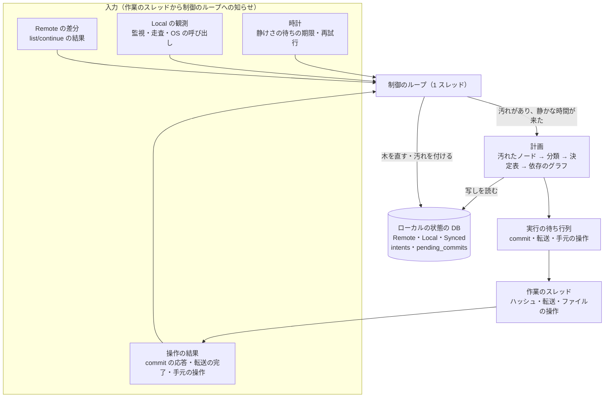
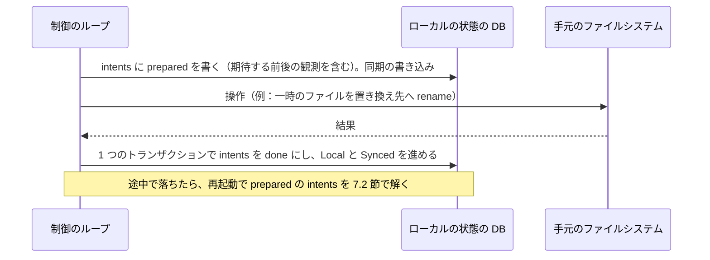
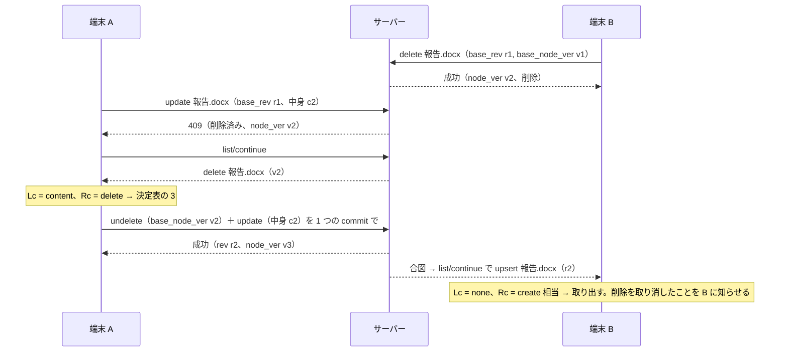
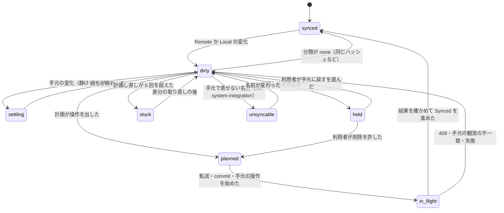

# Sync Engine: Dropbox

`sync-core` の同期エンジンを決める。3 つの木の形、計画（変化の求め方、操作の順序、依存）、衝突の決定表の当て方、意図の記録とクラッシュからの再開、選択型の同期、名前空間を外されたときの手元の扱い、帯域と並行の制御、時計に頼らない判断、消しすぎの止めを扱う。

前提となる決定は、基盤（[ADR-0001](../decisions/0001-platform-and-stack.md)）、分割（[ADR-0002](../decisions/0002-chunking-and-block-addressing.md)）、ジャーナルとカーソル（[ADR-0005](../decisions/0005-namespace-journal-and-cursors.md)）、衝突のモデル（[ADR-0006](../decisions/0006-sync-conflict-model.md)）、ノードと名前（[ADR-0008](../decisions/0008-node-identity-and-names.md)）。この文書で決めたことは次の ADR にある。

| ADR | 決定 |
| --- | --- |
| [0009](../decisions/0009-planner-dirty-set-and-ordering.md) | 計画は、汚れた（変化の届いた）ノードだけを Synced と比べて変化を分類し、決定表で操作を決め、依存のグラフで並べる。1 回の計画は 3 つの木の 1 つの読み取りの写しに対して決定的で、出した操作の結果を確かめてから木を進める |
| [0010](../decisions/0010-local-state-db-and-intent-log.md) | ローカルの状態の DB は SQLite（WAL）の 1 つのファイルで、3 つの木・意図の記録・送った commit を持つ。手元のファイルの操作は「意図を書く → 操作 → 結果を書く」の順にし、再起動では観測と期待の値を比べて進めるか捨てる。応答の届かない commit は、記録を残したまま差分を取り直してから計画し直す |
| [0011](../decisions/0011-selective-sync-and-access-loss.md) | 選択型の同期で外したフォルダーは、Synced に「外した」の印を持ち、Local と比べない。名前空間を外された・閲覧に下がったときは、変更のない手元のファイルを消し、手元で変えたものは「`<Brand>` に保存できなかった変更」へ移して上げる |

## 1. 目的と範囲

- 扱う：
  - 3 つの木（Remote・Local・Synced）の形と、ノードの結び付け、仮の ID
  - 計画：汚れたノードの集め方、変化の分類、決定表（[ADR-0006](../decisions/0006-sync-conflict-model.md) の 13 行）の当て方、操作の順序と依存
  - 意図の記録、送った commit の記録、クラッシュからの再開
  - 走査し直し、同期のフォルダーが見えないときの停止
  - 消しすぎの止め
  - 選択型の同期、名前空間を載せる・外す・役割の変化の手元での扱い
  - 帯域と並行の制御、再試行、時計に頼らない判断
  - 決定的な同期のシミュレーターに要る差し替えの境目
- 扱わない：
  - OS の監視・移動の検出・プレースホルダー・手元の名前の対応（[file-system-integration.md](file-system-integration.md)）
  - プロセスの形・UI・資源の上限の配り方・端末の登録（[desktop-client.md](desktop-client.md)）
  - commit の受け付け・ジャーナル・カーソルのサーバーの側（[metadata-and-journal.md](metadata-and-journal.md)）
  - ブロックの送受信・ローカルのブロックの索引・ダウンロードの組み立て（[block-storage.md](block-storage.md)）
  - バージョンと復元・巻き戻し（[versions-and-recovery.md](versions-and-recovery.md)）
  - WebSocket の合図と long-poll の形（[api-and-webhooks.md](api-and-webhooks.md)）

## 2. 本家の形（確かめたこと）

いずれも 2026-10-09 に確認。

| 項目 | 内容 | 出典 |
| --- | --- | --- |
| 同期エンジンの言語と構成 | Rust で書き直した。大部分を 1 つの決定的な制御のスレッドで動かす | [Rewriting the heart of our sync engine](https://dropbox.tech/infrastructure/rewriting-the-heart-of-our-sync-engine) |
| 3 つの木 | Remote・Local・Synced。Synced をマージの基準にする | [Testing our new sync engine](https://dropbox.tech/infrastructure/-testing-our-new-sync-engine) |
| 試験 | 計画の乱択の試験と、ファイルシステム・ネットワーク・時計を模した全体の乱択の試験。シードから再現する | 同上 |
| 競合のコピー | 編集した人の名前、「conflicted copy」、日付を名前に付ける。後に保存されたほうがコピーになる | [Conflicted copy](https://help.dropbox.com/organize/conflicted-copy) |

- 本家の計画の規則、操作の順序、意図の記録の形、消しすぎの止めの閾値は、公開の資料で確かめられなかった（**未検証**）。本システムの規則は 4〜9 節で決める。本家のコードとプロトコルは使わない（[リポジトリ共通の ADR-0007](../../../../docs/decisions/0007-no-reuse-of-original-implementation.md)）。

## 3. 要件と NFR

| NFR | この領域での要件 |
| --- | --- |
| NFR-004 | 静かになった後に収束する。確定した中身と手元だけの中身を黙って消さない。ぶつかった変更は競合のコピーで残す |
| NFR-002 | サーバーの変化を受けてから計画を立てるまで p99 200ms（1,000 ノードの変化まで）。1 MiB 以下のファイルの取り出しを優先する |
| NFR-008 | 静かなときに計画を回さない（汚れたノードがなければ眠る）。計画の作業の集合は最大 50,000 ノードに区切る |
| NFR-008 | 保存から送信の開始まで p95 3 秒（2 秒の静けさの待ちを含む） |
| NFR-010 | カーソルの取り直しで手元の変更を失わない（Synced を残す） |

## 4. 構成と制御のループ

`sync-core` は 1 つの制御のスレッドで、イベントを順に処理する。I/O（ファイルシステム、ネットワーク、時計、乱数）は差し替えられる形の境目（trait）を通す。シミュレーターは同じループを模型の I/O で回す（[ADR-0001](../decisions/0001-platform-and-stack.md)）。

- 制御のループだけが 3 つの木を書く。作業のスレッドは結果を知らせるだけにする。
- 作業のスレッドは、ハッシュ 2 本、アップロード 8 本、ダウンロード 8 本、手元のファイルの操作 1 本、HTTP の制御の要求 4 本（8 節）。
- 計画は、汚れたノードがあり、そのどれもが静けさの待ちを終えたときだけ回す。何もなければループは眠る（NFR-008）。

## 5. 3 つの木

### 5.1 ノードの形

3 つの木は、同じ形の行を別の表に持つ（[ADR-0010](../decisions/0010-local-state-db-and-intent-log.md)）。

| 項目 | Remote | Local | Synced | 説明 |
| --- | --- | --- | --- | --- |
| `node_key` | ○ | ○ | ○ | サーバーの `node_id`。手元で作ってまだ確定していないものは仮の ID（`tmp:` ＋ UUIDv7） |
| `ns_id` | ○ | ○ | ○ | 名前空間 |
| `parent_key` | ○ | ○ | ○ | 親 |
| `name` | ○（NFC） | ○（OS のバイト列） | ○（NFC） | 表示の名前 |
| `name_key` | ○ | ○ | ○ | NFC＋case folding（[ADR-0008](../decisions/0008-node-identity-and-names.md)） |
| `is_folder` | ○ | ○ | ○ | |
| `rev_id`・`node_ver` | ○ | — | ○ | サーバーの中身と置き場所のバージョン |
| `content_sha256`・`size` | ○ | ○（分かっていれば） | ○ | 中身の同一性 |
| `file_id` | — | ○ | ○ | inode・File ID。File Provider では OS の項目の ID |
| `mtime`・`ctime` | — | ○ | ○ | 変わったかもしれないの手がかり |
| `exec_bit` | ○ | ○ | ○ | 実行の属性だけ（[file-system-integration.md](file-system-integration.md) の 8 節） |
| `excluded` | — | — | ○ | 選択型の同期で外した（9 節） |
| `unsyncable` | — | ○ | — | 手元で表せない・同じ `name_key` の 2 つ目（理由のコード） |

- Synced の行は「最後に Remote と Local が一致したと確かめた状態」で、Remote の項目（`rev_id`・`node_ver`）と Local の項目（`file_id`・`mtime`）の両方を持つ。
- ノードの結び付けは `node_key` で行う。Local のノードは `file_id` から `node_key` を引く（`local_ids` の索引）。名前やパスで結ばない。

### 5.2 木の進め方

| 出来事 | Remote | Local | Synced |
| --- | --- | --- | --- |
| `list/continue` の差分を受けた | 当てる | — | — |
| 監視・走査で手元の変化を観測した | — | 当てる | — |
| commit が成功した | 応答の状態を当てる | — | 当てる（送った中身と置き場所で） |
| サーバーの中身を手元に置いた | — | 置いた後の観測を当てる | 当てる |
| 計画が「そろっている」と判断した（決定表の 1・5・10） | — | — | 当てる |
| 走査し直し | — | 作り直す | 変えない |
| カーソルの取り直し | 作り直す | — | 変えない |

- Synced を進めるのは、操作の結果を確かめた後だけにする。計画の時点では進めない。
- 仮の ID のノードは、作成の commit が成功したら、返った `node_id` に 3 つの木で付け替える（同じ DB のトランザクション）。

## 6. 計画

### 6.1 手順

1 回の計画は、3 つの木の 1 つの読み取りのトランザクション（SQLite の写し）の上で行い、同じ入力から同じ操作の列を出す（[ADR-0009](../decisions/0009-planner-dirty-set-and-ordering.md)）。

1. **汚れたノードを集める。** Remote・Local の更新で付いた `dirty` の印のノードを、`node_key` の順に最大 50,000 件取る。フォルダーの移動・削除が汚れたら、その子孫は読むが、汚れの集合には足さない（子孫は親の操作に含まれる）。
2. **変化を分類する。** 各ノードについて、Synced との差から手元の変化（`Lc`）とサーバーの変化（`Rc`）を次のどれかに分ける。`none`・`create`・`content`・`place`（親か名前の変化）・`content+place`・`delete`。中身の変化は `content_sha256` の違いで決める。`mtime` だけの違いは、ハッシュを取り直す依頼にして、この計画では `none` とする（6.4 節）。
3. **決定表で操作を決める。** `(Lc, Rc)` と、ノードの種類（ファイル・フォルダー）、親の状態（削除、外した）、名前空間の役割を入力に、[ADR-0006](../decisions/0006-sync-conflict-model.md) の決定表を上から当てる。表の結果を、具体的な操作（6.2 節）に直す。
4. **依存のグラフを作り、並べる。** 6.3 節の規則で辺を張り、トポロジカルの順に並べる。同じ順位の中は `node_key` の順で決定的にする。
5. **消しすぎの止めを確かめる。** 手元からサーバーへの削除の数を数え、閾値を超えたら削除だけを止める（10 節）。
6. **実行の待ち行列に入れる。** サーバーへの操作は名前空間ごとに commit にまとめる（既定 100 操作、最大 1,000）。手元の操作は意図の記録を通す（7 節）。

### 6.2 決定表の行と操作

決定表（[ADR-0006](../decisions/0006-sync-conflict-model.md)）の各行を、次の操作に直す。サーバーへの操作は [metadata-and-journal.md](metadata-and-journal.md) の 4 節の条件を付ける。

| 行 | 手元 `Lc` | サーバー `Rc` | 操作 |
| --- | --- | --- | --- |
| 前段 | 変化あり | `none` | 手元の変化をサーバーへ：`create`・`update`（`base_rev`）・`move`（`base_node_ver`）・`delete`（ファイルは `base_rev`＋`base_node_ver`、フォルダーは `base_seq`） |
| 前段 | `none` | 変化あり | サーバーの変化を手元へ：取り出す・置き換える・移す・消す（OS のゴミ箱へ） |
| 1 | `content` | `content`（同じハッシュ） | Synced を Remote の `rev_id` に進めるだけ |
| 2 | `content` | `content`（違う） | ① 手元のファイルを競合のコピーの名前へ移す（手元の操作）② 競合のコピーを `create` ③ Remote の中身を元の名前に置く |
| 3 | `content` | `delete` | 親が残っていればファイルを `undelete`（`base_node_ver` は削除の後の値）＋`update`。親が消えていれば、新しい `node_id` のフォルダーを `create` して、その中にファイルを `create` |
| 4 | `delete` | `content` | 手元へ取り出す（手元の削除を取り消す）。利用者に知らせる |
| 5 | `delete` | `delete` | Synced から消す |
| 6 | `place` | `content` | `move` を commit し、新しい中身を取り出す（両方当てる） |
| 7 | `place` | `place`（違う行き先） | 手元をサーバーの置き場所へ移す。手元の移動は捨てて知らせる |
| 8 | フォルダーの中への `create` | 親のフォルダーの `delete` | 新しい `node_id` のフォルダーを同じ名前で `create` し、足したものだけを中へ `create`。元のフォルダーの他の子は削除のまま |
| 9 | フォルダーの `delete` | 子孫の `create`・`content` | フォルダーの削除を送らない。サーバーで足された・変わった子孫と、その親の連なりを手元に作り直す。他の子孫の削除は、子ごとの `delete` で commit する |
| 10 | `create` | 同じ親・同じ `name_key` の `create`（同じ中身か、両方フォルダー） | 手元のノードを Remote の `node_id` に結び付ける（1 つにまとめる） |
| 11 | `create` | 同じ親・同じ `name_key` の `create`（違う） | 手元を競合のコピーの名前へ移して `create`。Remote を元の名前に置く |
| 12 | `content`・`create` | 役割が閲覧に下がった・外された | 「`<Brand>` に保存できなかった変更」へ移して利用者のルートに `create`（[ADR-0011](../decisions/0011-selective-sync-and-access-loss.md)） |
| 13 | `place` | 移動先が循環（サーバーが 409 `cycle`） | 手元をサーバーの置き場所へ戻す |

- 競合のコピーの名前は `<名前> (<端末の名前> の競合コピー <YYYY-MM-DD>).<拡張子>`。同じ名前があれば ` 2`・` 3` を足す（[ADR-0006](../decisions/0006-sync-conflict-model.md)。文言は法務の L10 の後に確定）。
- 行 3 でファイルを `undelete` にするのは、バージョン履歴を同じノードに続けるためである。フォルダーを `undelete` にしないのは、フォルダーの `undelete` が削除の時点の子孫をまとめて戻す（[metadata-and-journal.md](metadata-and-journal.md) の 4.3 節）ため、行 8 の「他の子は削除のまま」に反するからである。

### 6.3 依存と順序

| # | 規則 | 理由 |
| --- | --- | --- |
| O1 | 親の `create` を子の `create`・`move`（そこへ）より先にする | 親がなければ作れない |
| O2 | ある名前を空ける操作（`move` で出る・`delete`）を、その名前を使う操作より先にする | 同じ親の `name_key` の一意 |
| O3 | 名前の入れ替え（A→B、B→A）や輪の形の移動は、サーバーへは 1 つの commit にまとめる。手元では仮の名前（`.<brand>-tmp-<node_key>`）を経る | サーバーは 1 つの commit の中の置き場所の変化を 2 段で当てる（[metadata-and-journal.md](metadata-and-journal.md) の 4.4 節） |
| O4 | 子孫の `move`（外へ出す）を、親の `delete` より先にする | 外へ出したものを巻き込んで消さない |
| O5 | 手元の削除は、子から親の順にする | 手元のファイルシステムの操作の順 |
| O6 | 競合のコピーへの手元の移動（行 2・11）を、元の名前への取り出しより先にする | 手元だけの中身を上書きしない |
| O7 | 中身の `update`・`create` は、必要なブロックの送信が終わってから commit に入れる | commit がブロックを求める |
| O8 | 名前空間をまたぐ移動は、単独の要求にし、他の操作と同じ commit に入れない | サーバーでバッチの操作になる（[metadata-and-journal.md](metadata-and-journal.md) の 6 節） |

- グラフに循環が残ったら（O3 で解けない形）、その成分の操作を出さずに、成分の中の最小の `node_key` を仮の名前へ移す操作だけを出して、次の計画に回す。計画が止まることを優先する（[quality.md](../quality.md) の性質「止まる」）。

### 6.4 時計に頼らない判断

- 勝ち負けに時刻を使わない（[ADR-0006](../decisions/0006-sync-conflict-model.md)）。
- 手元の変化の手がかりは `(file_id, size, mtime, ctime)` の組で、どれかが Synced と違えばハッシュを取り直す。ハッシュが同じなら `none` として Synced の `mtime` を直す。
- **静けさの待ち**：手元の変化を観測したら、大きさと `mtime` が 2 秒変わらなくなるまで待つ。60 秒たっても変わり続けるファイル（ログなど）は、その時点で読んでハッシュを取り、読み終えたときに大きさと `mtime` が読み始めと同じなら採る。違えば、待ちを 2 倍にして（最大 10 分）やり直す。
- 待ちと再試行の時間は単調な時計で測る。壁時計の巻き戻り・飛びの影響を受けない。

### 6.5 計画の上限

| 項目 | 値 | 超えたとき |
| --- | --- | --- |
| 1 回の計画の汚れたノード | 50,000 | 残りは次の計画に回す（`node_key` の順） |
| 1 つの commit の操作 | 既定 100、最大 1,000 | 分ける。サーバーの上限は 1,000（[ADR-0005](../decisions/0005-namespace-journal-and-cursors.md)） |
| 同時に commit を送る名前空間 | 4 | 待つ |
| 1 つの名前空間の commit | 1 本ずつ | 条件（`base_rev`）が前の commit の結果に依るため |
| 409 の後の計画し直し | 同じノードで 5 回まで | 6 回目からは、そのノードを `stuck` にして状態の表示に出し、差分を取り直してから再開する |

## 7. 意図の記録とクラッシュからの再開

### 7.1 手元のファイルの操作

手元のファイルの操作（置き換え、移動、削除、フォルダーの作成）は、次の順で行う（[ADR-0010](../decisions/0010-local-state-db-and-intent-log.md)）。

- 受けた中身は、同期のフォルダーと同じボリュームの作業のフォルダー（`.<brand>.cache/staging`）に組み立て、ハッシュを確かめてから置き換える。置き換えの直前に、手元のファイルの観測が計画の時の Local と同じかを確かめる。違えば操作を捨て、決定表の 2 として計画し直す（[ADR-0006](../decisions/0006-sync-conflict-model.md)）。
- macOS の File Provider と Windows の Cloud Files API の管理のファイルは、OS の API を通して置く（[file-system-integration.md](file-system-integration.md)）。意図の記録は同じ形で書き、OS からの完了の知らせを「操作の後の観測」にする。

### 7.2 再起動での解き方

`prepared` のまま残った意図を、手元の観測と期待の値で解く。

| 操作 | 「済んだ」と判断する観測 | 「済んでいない」と判断する観測 | どちらでもない |
| --- | --- | --- | --- |
| 置き換え（staging → 先） | 先のファイルの `file_id` が staging のファイルの ID で、ハッシュが期待と同じ | 先が期待の前の観測のまま、staging が残っている | 意図を捨て、staging を消し、そのパスを汚して走査する |
| 移動・名前の変更 | 元にない。先に期待の `file_id` がある | 元に期待の `file_id` があり、先にない | 同上 |
| 削除（OS のゴミ箱へ） | 元にない | 元に期待の `file_id` がある | 同上 |
| フォルダーの作成 | 先にフォルダーがある | 先にない | 同上 |

- 「済んだ」なら結果を書く。「済んでいない」なら、Local がまだ期待の前の観測と同じときだけやり直す。どちらでもなければ、捨てて計画し直す。二重に消す・二重に作ることを起こさない。
- 手元の操作は、どれも同じ結果になるならやり直してよい形にする（冪等）。削除の やり直しは「元にあれば、そのときの `file_id` が期待と同じときだけ消す」とする。

### 7.3 応答の届かない commit

- commit を送る前に、`pending_commits` に（名前空間、操作の列、送った単調な時刻）を書く。応答を受けたら消す。
- 再起動のとき、または応答が届かずに時間切れになったとき、`pending_commits` が残っていれば、その名前空間の `list/continue` を先に読み終えてから計画し直す。サーバーで確定していれば、Remote に結果が現れ、決定表の 1（同じハッシュ）・10（同じ作成）・行き先が同じ移動として「そろった」になる。確定していなければ、同じ操作がもう一度出る。
- このため、commit に冪等のキーを持たせない。条件つきの書き込みと決定表で、二重の確定を起こさない（[metadata-and-journal.md](metadata-and-journal.md) の 4.6 節）。

## 8. 帯域と並行の制御

| 項目 | 既定 | 決め方 |
| --- | --- | --- |
| アップロードの並行 | 8 本 | `ops.client_upload_concurrency`（AppConfig で配る） |
| ダウンロードの並行 | 8 本 | 同上の組 |
| ハッシュ・分割 | 2 スレッド、OS の低い優先度 | 電池で動くときは 1 スレッド |
| 帯域 | 制限なし。利用者が上り・下りを KB/秒で決められる | トークンの桶（1 秒分の深さ） |
| 優先度 | ① 利用者が開いたファイルの取り出し ② 1 MiB 以下のファイル ③ その他を小さい順 ④ 2 GiB 超 | NFR-002 を小さなファイルで守る |
| 再試行 | 指数の待ち（1 秒から 5 分）に ±20% の揺らぎ | 揺らぎは差し替えた乱数から取る（シミュレーターで再現できる） |
| 429・`Retry-After` | ヘッダーの値に従う | 名前空間ごとに待つ |
| 一時停止 | 利用者の操作で、転送と commit を止める。監視と Local の更新は続ける | 再開で計画し直す |

- 大きなファイル（2 GiB 超）は 1 本ずつにし、小さなファイルの転送を塞がない。
- 帯域の制限は、ブロックの PUT・GET の本文にだけかける。commit と `list/continue` にはかけない。

## 9. 選択型の同期と名前空間の変化

### 9.1 選択型の同期

[ADR-0011](../decisions/0011-selective-sync-and-access-loss.md) で決める。

- 利用者がフォルダー F を外すと、Synced の F に `excluded` を付ける。F の子孫は Local と比べない。Remote の F の子孫は受け続けるが、計画は飛ばす。
- 手元の F の子孫は、Local と Synced が同じもの（変更なし）だけを消す。手元で変えたものがあれば、先に上げてから消す。サーバーへの削除は出さない。
- 外したフォルダーは手元の木に出さない（オンラインのみのプレースホルダーとしても出さない。[architecture/README.md](README.md) の 6 節）。
- 外した F と同じ親・同じ `name_key` の名前を手元で作ったら、手元のものを `<名前> (選択型の同期の競合)` に移して新しいフォルダーとして上げる。F を黙って戻さない。
- F を戻すと、`excluded` を外し、F の子孫を Synced に「手元にない」として入れて、取り出しの計画を立てる。

### 9.2 載せる・外す・役割の変化

| 出来事 | 手元の扱い |
| --- | --- |
| `mount`（共有フォルダーに参加） | その名前空間を番号 0 から読み（木の一覧）、Remote に足す。手元の同じ場所に同じ `name_key` の名前があれば、決定表の 10・11 で扱う |
| `unmount`（外された） | 名前空間の子孫で、Local と Synced が同じものは手元から消す（OS のゴミ箱を使わない）。手元で変えたもの・作ったものは、利用者のルートの「`<Brand>` に保存できなかった変更/<共有フォルダーの名前>/」へ移して上げ、知らせる |
| 役割が閲覧に下がった | 手元の変更の commit が 403 になる。決定表の 12 で、変えたものを上の場所へ移して上げる。手元の元のファイルはサーバーの中身に戻す |
| 名前空間をまたぐ移動の削除の側（`moved_to` つきの `delete`） | 移動先の名前空間を載せていれば、そちらを `moved_to` の番号まで読むまで、手元の削除を保留する。届いたら手元のファイルを移すだけにする（[metadata-and-journal.md](metadata-and-journal.md) の 6 節） |

- `unmount` で手元から消すものを OS のゴミ箱に入れないのは、権限を失った中身を端末に残し続けないためである。中身は持ち主の名前空間に残る。

## 10. 消しすぎの止め

### 10.1 規則

[ADR-0006](../decisions/0006-sync-conflict-model.md) の閾値を、次のとおり数える。

- 数えるのは、手元の変化からサーバーへ出す `delete` の対象のファイルの数（フォルダーの削除はその子孫のファイルを数える）。サーバーからの削除を手元に当てるものは数えない（OS のゴミ箱へ移す）。
- 直近 5 分の窓（単調な時計）の合計が、**1,000 ファイル**か、同期している木のファイルの **10%** を超えたら、窓の中で未送信の削除と、以後の削除を `held_deletes` に入れて止める。
- 止めている間も、削除以外の変更（作成・中身の変更・移動）は同期を続ける。
- 利用者への確かめ（デスクトップの通知と状態の画面）：「削除を同期する」「手元に戻す」の 2 つ。
  - 「削除を同期する」：`held_deletes` を順に commit する。この確かめは 1 時間の窓で有効で、同じ窓の追加の削除は止めない。
  - 「手元に戻す」：止めた削除の対象を、サーバーから手元へ取り出す（Synced を「手元にない」にして計画する）。
- 確かめがないまま 7 日たったら、もう一度知らせる。黙って削除を送らない。

### 10.2 例：3,000 ファイルのフォルダーを同期のフォルダーの外へ出した

利用者が `~/<Brand>/案件/2025` （3,000 ファイル、木の全体は 40,000 ファイル）を外付けのディスクへドラッグした。OS は移動ではなく、同期のフォルダーからの削除として見せる。

1. 監視が `2025` の削除を知らせる。Local から消える。計画は `2025` を `delete`（フォルダー、`base_seq`）にしようとする。
2. 子孫のファイルの数は 3,000。窓の合計 3,000 ＞ 1,000。止める。`held_deletes` に 1 行（フォルダー `2025`、3,000 ファイル）。
3. 同じ時間に別のフォルダーで保存した `見積.xlsx` の中身の変更は、通常どおり上がる。
4. 通知：「3,000 個のファイルを `<Brand>` から削除しようとしています」。利用者が「削除を同期する」を選ぶ → フォルダーの `delete` を 1 つの commit で送る。サーバーでは削除したファイルとして保持の期間の間、戻せる（[versions-and-recovery.md](versions-and-recovery.md)）。
5. 利用者が「手元に戻す」を選んだら、`2025` の子孫を取り出す。オンラインのみの既定（[file-system-integration.md](file-system-integration.md) の 6 節）では、プレースホルダーとして戻るだけで、中身は送らない。

### 10.3 同期のフォルダーが見えないとき

同期のフォルダーそのものが見えない（外付けのディスクが外れた、フォルダーが移された、持ち主の印 `.<brand>.cache/root-id` が合わない）ときは、消しすぎの止めではなく、同期を止めて「同期のフォルダーが見つかりません」を出す（[ADR-0006](../decisions/0006-sync-conflict-model.md)）。削除として計画しない。

## 11. 例

### 11.1 編集と削除の競争（決定表の 3・4）

端末 A と端末 B は、`報告.docx`（`rev` r1、`node_ver` v1）を Synced に持つ。

**順 1：B の削除が先に確定する。**

**順 2：A の編集が先に確定する。** A の `update`（`base_rev` r1）が通り r2 になる。B の `delete` は `base_rev` r1 を条件に持つので 409 になる。B は差分で r2 を受け、`Lc = delete`、`Rc = content` で決定表の 4：中身を取り出し、削除を取り消したと知らせる。

- どちらの順でも、c2 は最終の木に残る。ファイルの `delete` に `base_rev` を条件として付けるのは、この順 2 のためである（[metadata-and-journal.md](metadata-and-journal.md) の 4.2 節）。

### 11.2 名前の変更と編集の競争（決定表の 6）

A が `図面.dwg` を `図面_最終.dwg` に名前を変える。B が同時に `図面.dwg` の中身を変える。

- 名前の変更は `base_node_ver` だけ、中身の変更は `base_rev` だけを条件にする。どちらの順でも両方通る。
- A は差分で r2（中身）を受け、Synced と比べて `Lc = place`（自分の名前の変更は既に確定して Synced に入っている）・`Rc = content` → 中身を取り出す。B は `node_ver` の変化を受け、手元のファイルの名前を変える。
- 最終：両方の端末で `図面_最終.dwg` が r2 の中身を持つ。競合のコピーは作らない。

### 11.3 オフラインの編集の後の競合のコピー（決定表の 2）

1. 端末 A（名前「A-PC」）がオフラインで `見積.xlsx`（r1）を c_A に変える。Local は c_A、Synced は r1。
2. その間に端末 B が c_B を確定し r2 になる。
3. A がオンラインに戻る。先に `list/continue` を読み、Remote が r2 になる。計画：`Lc = content(c_A)`、`Rc = content(c_B)`、ハッシュが違う → 決定表の 2。
4. 操作の順（O6）：
   1. 手元の操作：`見積.xlsx` を `見積 (A-PC の競合コピー 2026-10-09).xlsx` へ移す（意図の記録を通す。`file_id` は変わらない）。
   2. 競合のコピーを `create`（「その名前がまだない」の条件、c_A のブロックは送る）。
   3. r2 を staging に組み立て、`見積.xlsx` として置く。
5. 最終：両方の端末に `見積.xlsx`（c_B）と競合のコピー（c_A）がある。どちらの中身も失わない。
- A がオンラインに戻ってすぐ差分を読む前に `update`（`base_rev` r1）を送っていたら、409 になり、差分を読んでから同じ計画になる。

### 11.4 名前の入れ替え（O3）

A が `a.txt` と `b.txt` の名前を入れ替える（`a.txt`→`tmp`→…）。Local は最終の形だけを見る。計画は 2 つの `move` が互いの名前を空けることに依る輪を見つけ、1 つの commit にまとめて送る。サーバーは 2 段で当てる。他の端末では、仮の名前を経て入れ替える。

## 12. 状態

ノードごとの同期の状態（状態の表示とシミュレーターの到達の計測に使う）。

## 13. 障害のときの振る舞い

| 障害 | 振る舞い |
| --- | --- |
| クラッシュ・電源断 | 7.2 節で意図を解き、7.3 節で `pending_commits` を解く。Local は走査し直しで作り直す（Synced は残す） |
| 監視のイベントの溢れ | 走査し直し（[file-system-integration.md](file-system-integration.md) の 4.3 節）。Synced を基準にするので、溢れの間の削除を誤らない |
| ネットワークの切断 | 転送と commit を止め、手元の変化を Local に貯める。戻ったら先に `list/continue` |
| カーソルの取り直し（409 `reset`） | Remote を作り直す（番号 0 からの一覧）。Synced と比べて差を当てる。手元の変更を失わない |
| ディスクの満杯 | 取り出しを止める。アップロードと commit は続ける。状態の表示に出す |
| ファイルのロック（他のアプリが開いている） | 置き換えを 30 秒ごとに最大 1 時間待つ。その間に手元が変われば決定表の 2 |
| ローカルの状態の DB の破損 | DB を作り直す：Remote を番号 0 から取り、Local を走査する。Synced がないので、手元とサーバーで中身が違うファイルはすべて決定表の 11 として競合のコピーにする（消さない） |
| 時計の巻き戻り | 判断に壁時計を使わないので影響しない。競合のコピーの名前の日付だけが変わる |

## 14. 上限

| 項目 | 値 |
| --- | --- |
| 1 端末の同期の木 | 100 万ファイルで NFR-008 を満たす。300 万ファイルまで動く（それを超えたら選択型の同期を勧める） |
| 1 回の計画の汚れたノード | 50,000 |
| 1 つの commit | 既定 100 操作、最大 1,000 |
| 消しすぎの止め | 5 分の窓で 1,000 ファイルか 10% |
| 静けさの待ち | 2 秒。変わり続けるファイルは 60 秒から最大 10 分 |
| 同じノードの計画し直し | 5 回 |

## 15. テスト

決定表（spec から読み込む）：

- **DT-SYNC-001（衝突）**：[ADR-0006](../decisions/0006-sync-conflict-model.md) の 13 行と、6.2 節の前段の 2 行。ファイルとフォルダー、親の状態の組み合わせ。
- **DT-SYNC-002（再開）**：7.2 節の表の操作 × 観測。
- **DT-SYNC-003（選択型の同期と名前空間の変化）**：9 節の各行。

性質ベーステスト（[quality.md](../quality.md) の 2.2.1 節 A。PR 2,000 試行、夜間 200,000 試行）とシミュレーター（PR 1 万、夜間 1,000 万の場面）：

- **PROP-SYNC-001（収束）**：静かになった後、全端末の Local（`excluded` と `unsyncable` を除く）がサーバーの木と一致する。
- **PROP-SYNC-002（中身を失わない）**：書かれたすべての中身が、最終の木か、保持の期間の中のバージョン履歴か、「`<Brand>` に保存できなかった変更」にある。
- **PROP-SYNC-003（黙って上書きしない）**：同じ元からの違う 2 つの編集は、最終の木に両方が現れる。
- **PROP-SYNC-004（止まる）**：静かになった後、有限の計画で操作が空になる。名前の往復が起きない。
- **PROP-SYNC-005（計画の決定性）**：同じ 3 つの木から同じ操作の列が出る。汚れの集合の取り出しの順を変えても同じ。
- **PROP-SYNC-006（Synced の単調）**：Synced は、確かめた結果でしか進まない（計画の後・実行の前にクラッシュしても、Synced は計画の前と同じ）。
- **PROP-SYNC-007（クラッシュの位置）**：意図の記録の各位置（prepared の後、操作の後、結果の前）でのクラッシュの後、二重の削除・二重の作成がない。
- **PROP-SYNC-008（消しすぎの止め）**：任意の削除の列で、確かめなしに窓の閾値を超えた削除が commit されない。
- **PROP-SYNC-009（外された名前空間）**：`unmount` の後、手元で変えた中身は「保存できなかった変更」にあり、変えていないファイルは手元にない。

到達の計測：決定表の各行・6.3 節の各順序の規則・7.2 節の各行に、夜間の場面で届いた回数を記録する。0 回の行があれば生成器を直す。

## 16. Story の候補

| Epic | Story | 中身 |
| --- | --- | --- |
| E4 | `sync-core-skeleton` | 4 節の制御のループ、I/O の境目、ローカルの状態の DB（ADR-0010） |
| E4 | `three-trees-model` | 5 節の形、ノードの結び付け、仮の ID の付け替え |
| E4 | `planner-and-conflict-table` | 6 節の手順・操作・順序（ADR-0009。DT-SYNC-001、PROP-SYNC-004・005） |
| E4 | `intent-log-and-recovery` | 7 節（ADR-0010。DT-SYNC-002、PROP-SYNC-006・007） |
| E4 | `rescan-and-overflow` | 走査し直し、10.3 節の停止 |
| E4 | `mass-delete-guard` | 10 節（PROP-SYNC-008） |
| E4 | `conflicted-copy-naming` | 競合のコピーの名前（法務：L10） |
| E4 | `transfer-scheduler` | 8 節の並行・優先度・帯域・再試行 |
| E4 | `sync-simulator` | シミュレーター、サーバーの模型、契約の試験（PROP-SYNC-001〜003） |
| E4 | `planner-randomized-tests` | 計画の層の乱択の試験と縮め |
| E5 | `selective-sync` | 9.1 節（ADR-0011。DT-SYNC-003） |
| E6 | `unmount-and-role-change-client` | 9.2 節（ADR-0011。PROP-SYNC-009）。namespaces-and-sharing と共同 |

## 17. 未解決の問い

### 決定

2026-10-09 の既定案。E4 のシミュレーターと E5 の実機の試験で覆りうる。

- **計画の形**：汚れたノードだけを分類し、依存のグラフで並べる（ADR-0009）。
- **commit の冪等**：冪等のキーを持たず、条件つきの書き込みと決定表で吸収する（7.3 節）。
- **ファイルの削除の条件**：`base_node_ver` に加えて `base_rev` を付ける（11.1 節）。
- **行 3 の作り直し**：ファイルは `undelete`、フォルダーは新しい `node_id`（6.2 節）。
- **意図の記録**：SQLite の同じ DB、`intents` は同期の書き込み（ADR-0010）。
- **選択型の同期と外された名前空間**：ADR-0011。
- **消しすぎの窓**：5 分の窓で数え、確かめは 1 時間有効。

### 持ち越し

| 問い | いつ・どう決めるか |
| --- | --- |
| 小さな木（数十ファイル）で 10% の閾値が少ない削除でも止まる。下限（例：50 ファイル未満は止めない）を足すか | E4 のシミュレーターと社内の試用で、止めの率を見て。足すなら ADR-0006 を直す（QA と PM） |
| 利用者が決める無視の規則（`node_modules` など） | E5 の後の利用者の声。MVP は選択型の同期だけ |
| 競合のコピーの文言 | 法務の L10 |
| 1 回の計画の上限 50,000 と 100 万ファイルの走査し直しの時間 | E5 の `client-resource-bench` |
| 本家の計画の規則と消しすぎの止めの閾値 | 公式の資料で確かめられなかった（**未検証**のまま） |

## 18. quality.md・runbooks・data-model への項目

### quality.md

- DT-SYNC-001〜003 と PROP-SYNC-001〜009 を E4 のリリースの基準にする（夜間 1,000 万の場面が 7 日続けて緑、決定表の全行に到達）。
- シミュレーターの操作の生成器に、名前の入れ替え（11.4 節）、名前空間をまたぐ移動の保留（9.2 節）、`pending_commits` の残った再起動を足す。
- 本番：`stuck` のノードの数、409 の後の計画し直しの回数、消しすぎの止めの率を、端末の匿名の計測に足す。

### runbooks

- `client-regression.md` に、`stuck` の急増と消しすぎの止めの急増の見方を足す（理由のコードごと）。

### data-model への項目

ローカルの状態の DB（SQLite。端末の中。サーバーの data-model とは別の節にする）。

| 表 | 中身 | 鍵・索引 | 節 |
| --- | --- | --- | --- |
| `remote_nodes` | 5.1 節の Remote の項目、`dirty` | 主キー `node_key`。索引 `(parent_key, name_key)`・`(dirty)` | 5 |
| `local_nodes` | 5.1 節の Local の項目、`local_name`（OS のバイト列）、`unsyncable`、`settle_until` | 主キー `node_key`。索引 `(file_id)` 一意・`(parent_key, name_key)`・`(dirty)` | 5、6.4 |
| `synced_nodes` | 5.1 節の Synced の項目、`excluded` | 主キー `node_key`。索引 `(parent_key, name_key)` | 5、9.1 |
| `intents` | `intent_id`、`kind`、`node_key`、前後のパス、staging のパス、期待する観測（`file_id`・`size`・`mtime`・`sha256`）、`state` | 主キー `intent_id`。索引 `(state)` | 7 |
| `pending_commits` | `ns_id`、操作の列（JSON）、送った単調な時刻 | 主キー `(ns_id, seq)` | 7.3 |
| `held_deletes` | 止めた削除、ファイルの数、窓の始まり、利用者の答え | 主キー `node_key` | 10 |
| `cursors` | 名前空間ごとのカーソル（不透明な文字列）と読み終えた番号、`pending_moved_to` | 主キー `account_id` | 9.2 |
| `sync_meta` | `root_id`（持ち主の印）、`schema_version`、`names_version`、`chunker_version` | — | 10.3 |

サーバーの側への提案：

| 対象 | 中身 | 節 |
| --- | --- | --- |
| commit の `delete`（ファイル） | `base_rev` を必須にする | 11.1 |
| commit の `delete`（フォルダー） | `base_seq` を必須にする | 6.2 |
| commit の `undelete` | ファイルの削除を取り消す操作 | 6.2 |
| `ns_journal` の `delete` | `moved_to_ns`・`moved_to_seq` | 9.2 |

## 出典

いずれも 2026-10-09 に確認。

- dropbox.tech, [Rewriting the heart of our sync engine](https://dropbox.tech/infrastructure/rewriting-the-heart-of-our-sync-engine)
- dropbox.tech, [Testing our new sync engine](https://dropbox.tech/infrastructure/-testing-our-new-sync-engine)
- Dropbox Help Center, [Conflicted copy](https://help.dropbox.com/organize/conflicted-copy)
