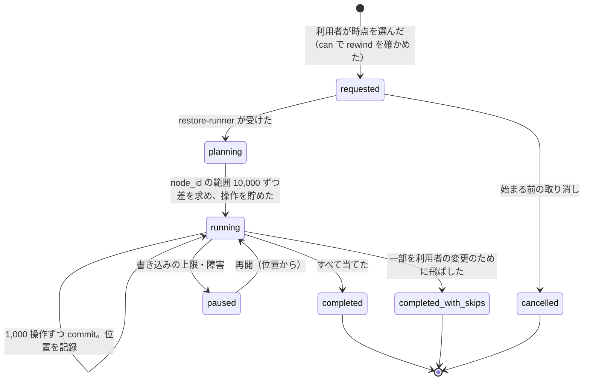
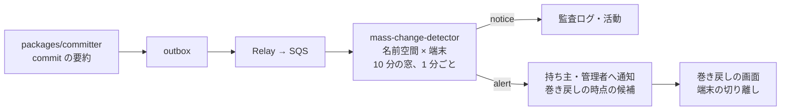

# Versions and Recovery: Dropbox

バージョンと復元を決める。リビジョンと置き場所の履歴の保持、保持の期間とプラン、保持の期限での消去、ファイルのバージョンの復元、削除したファイル・フォルダーの復元、名前空間とフォルダーの巻き戻し（時点の選び方、バッチの実行、さらに巻き戻せること）、一斉の変更の検知を扱う。

前提となる決定は、ブロックの参照と GC（[ADR-0003](../decisions/0003-dedupe-scope-and-privacy.md)、[ADR-0007](../decisions/0007-block-storage-layout-on-s3.md)）、ジャーナル（[ADR-0005](../decisions/0005-namespace-journal-and-cursors.md)）、衝突のモデル（[ADR-0006](../decisions/0006-sync-conflict-model.md)）、commit の操作（[ADR-0021](../decisions/0021-committer-operations-and-conditions.md)）。この文書で決めたことは次の ADR にある。

| ADR | 決定 |
| --- | --- |
| [0029](../decisions/0029-revision-and-placement-retention.md) | 中身のリビジョンと置き場所のバージョン（`node_versions`）を、置き換えられた・削除された時刻からプランの保持の日数だけ持つ。今のリビジョンと見えているノードは期限で消さない。期限の処理は `packages/committer` を通して `purge` を書き、ブロックの参照を減らす。保持を短くするプランの変更は 30 日の猶予の後に効かせる |
| [0030](../decisions/0030-restore-and-rewind-as-journaled-batches.md) | 復元と巻き戻しは、時点 t の木（`node_versions` から作る）と今の木の差を、条件つきの普通の操作に直し、1,000 操作ずつの commit で流すバッチにする。新しいリビジョンを作って古い中身を指し、削除は「削除したファイル」に残す。途中の利用者の変更は条件で見つけて飛ばし、結果に出す。`epoch` は上げない。巻き戻しもまた巻き戻せる |
| [0031](../decisions/0031-mass-change-detection.md) | 一斉の変更は、outbox の commit の要約から、名前空間と端末ごとの 10 分の窓で数える。中身は読まない。閾値を超えたら持ち主と管理者に p95 5 分で知らせ、窓の始まりの 5 分前を巻き戻しの時点として示す。自動では止めない・巻き戻さない |

## 1. 目的と範囲

- 扱う：
  - リビジョンと置き場所のバージョンの保持、プランの保持の期間、期限での消去
  - ファイルのバージョンの一覧と復元
  - 削除したファイル・フォルダーの一覧と復元
  - 巻き戻し（名前空間の単位とフォルダーの単位）、時点の選び方、実行、取り消し
  - 一斉の変更の検知と通知
- 扱わない：
  - ブロックの GC・照合・S3 のバージョニングからの戻し（block-storage.md、[ADR-0007](../decisions/0007-block-storage-layout-on-s3.md)）
  - commit の手順と条件（[metadata-and-journal.md](metadata-and-journal.md)）
  - クライアントの消しすぎの止め（[sync-engine.md](sync-engine.md) の 10 節）
  - 復元・巻き戻しの権限の決定表（namespaces-and-sharing.md の `can()`）
  - 画面（E7 の `web-restore-ui`）、通知の配信（api-and-webhooks.md、mobile-and-camera-upload.md）
  - リーガルホールド・解約の後の消去（security.md、accounts-and-teams.md）

## 2. 本家の形（確かめたこと）

いずれも 2026-10-09 に確認。

| 項目 | 内容 | 出典 |
| --- | --- | --- |
| バージョン履歴の期間 | Basic・Plus・Family 30 日、Professional・Essentials・Business・Standard 180 日、Business Plus・Advanced・Enterprise 365 日。延ばす追加の製品がある | [Version history overview](https://help.dropbox.com/delete-restore/version-history-overview) |
| 削除したファイルの復元 | 上と同じ区分の期間。大量の変更には Rewind を勧める | [Recover deleted files](https://help.dropbox.com/delete-restore/recover-deleted-files-folders) |
| Rewind | アカウント全体かフォルダーを、バージョン履歴の範囲の中の時点へ戻す。活動のグラフで日を選び、細かく変更を選ぶ。チームのフォルダーは別に巻き戻す | [Rewind](https://help.dropbox.com/delete-restore/rewind) |

- 本家の Rewind の内部の手順、巻き戻しの後の取り消し、一斉の変更の検知の規則、保持の期間の数え始め（置き換えられた時刻か、作られた時刻か）は、公式の資料で確かめられなかった（**未検証**）。

## 3. 要件と NFR

| NFR | この領域での要件 |
| --- | --- |
| NFR-009 | 10 万ファイルのフォルダーの復元 10 分以内。100 万ファイルの名前空間の巻き戻し 1 時間以内。一斉の変更の検知から利用者への通知まで p95 5 分 |
| NFR-005 | 保持の期間の中のリビジョンの中身を失わない（参照を保つ） |
| NFR-004 | 復元・巻き戻しが、途中の利用者の変更を黙って上書きしない |
| NFR-010 | 復元・巻き戻しもジャーナルに載せ、端末は普通の差分として受ける（取り直しにしない） |

## 4. 保持

### 4.1 何を持つか

[ADR-0029](../decisions/0029-revision-and-placement-retention.md) で決める。

| 対象 | 表 | 保持の数え始め |
| --- | --- | --- |
| 中身のリビジョン | `revisions` | 次のリビジョンに置き換えられた時刻（`superseded_at`）。ノードが削除されたら、その時の今のリビジョンは `deleted_at` から |
| 置き場所のバージョン（親・名前・削除の状態と、そのときのリビジョン） | `node_versions` | 次のバージョンに置き換えられた時刻（`valid_to_at`） |
| 削除したノード | `nodes`（`deleted_at`） | `deleted_at`。祖先の削除で見えなくなった子孫は、祖先の `deleted_at` |

- 今のリビジョンと、見えているノードの今のバージョンは、期限で消さない。
- `node_versions` は、`packages/committer` がノードの置き場所かリビジョンを変えるたびに、同じトランザクションで 1 行足し、前の行の `valid_to_seq`・`valid_to_at` を埋める。ジャーナル（90 日）より長く、時点の木を作るために持つ。

### 4.2 プランの保持の期間

| プラン | 期間 | 備考 |
| --- | --- | --- |
| 無料、個人の有料 | 30 日 | 本家の区分の既定（[architecture/README.md](README.md) の 6 節） |
| チームの標準 | 180 日 | 同上 |
| チームの上位 | 365 日 | 同上 |

- 期間は名前空間の持ち主のテナントのプランで決める。共有フォルダーは持ち主のテナントの期間に従う。
- プランを上げたら、すぐ長い期間にする（まだ消していないものが伸びる）。下げたら、30 日の猶予の後に短い期間にする（猶予の間に利用者が戻せる）。
- 約束の文言、解約の後の扱い、電子帳簿保存法の要件への対応をうたうかは、**法務の確認待ち**（L6・L8）。設計は期間を設定で変えられる形にし、短縮に猶予を持たせる。

### 4.3 期限での消去

`lifecycle` の Worker が名前空間ごとに 1 日 1 回回る（[ADR-0004](../decisions/0004-tenancy-namespaces-and-rls.md) の X3。テナントを 1 つずつ文脈に設定する）。

1. 期限を過ぎた `revisions`（今のリビジョンでないもの）、`node_versions`、削除したノード（祖先の削除で見えないものを含む）を、`node_id` の順に 1,000 件ずつ選ぶ。
2. `packages/committer` で 1 回のトランザクションにし、行を消し、`ns_block_refs` を減らし、ジャーナルに `purge` を 1 行（件数を持つ）書く。`purge` は利用者に返さない（[ADR-0021](../decisions/0021-committer-operations-and-conditions.md)）。
3. 参照の和が 0 になったブロックは `orphaned` になり、7 日の猶予の後に GC が消す。消した後も S3 のバージョニングで 30 日戻せる（[ADR-0007](../decisions/0007-block-storage-layout-on-s3.md)）。

- 名前空間のロックは 1,000 件ずつ短く取る。利用者の書き込みの多い時間（平日 9〜18 時）は 1 名前空間 1 秒 1 回までに抑える。
- 中身が最後に消えるまでの日数は、保持の期間＋7 日（GC の猶予）＋30 日（S3 のバージョニング）と大阪の写し。解約・削除の約束は**法務の確認待ち**（L6）。

## 5. ファイルのバージョンと削除したファイルの復元

### 5.1 ファイルのバージョンの復元

- 一覧：`revisions` の `(ns_id, node_id, created_seq)` の索引で、保持の中のリビジョンを新しい順に返す。名前空間をまたぐ移動で写したリビジョンも含む（[ADR-0022](../decisions/0022-cross-namespace-batch-move-and-copy.md)）。
- 復元：選んだリビジョン r_old の中身で、新しいリビジョン r_new を作る `update`（`base_rev` は利用者が見ていた今のリビジョン）。r_new はブロックの一覧を r_old から写し、`restored_from_rev_id` を持つ。ブロックは送らない（参照を足すだけ）。
- 今のリビジョンが利用者の見ていたものと違えば 409。画面は読み直して確かめさせる。

### 5.2 削除したファイル・フォルダーの復元

- 一覧：その名前空間の、`deleted_reason` が `moved` でない削除したノードのうち、祖先が見えているもの（削除の根）を、削除の新しい順に返す。フォルダーは子孫の数を添える。
- ファイルの復元：`undelete`（`base_node_ver` は削除の後の値）。
- フォルダーの復元：根の `undelete`（内部の操作）。削除の時点の子孫（それより前に個別に消されていなかったもの）がそろって戻る（[metadata-and-journal.md](metadata-and-journal.md) の 4.3 節、[quality.md](../quality.md) の 2.2.1 節 H）。
- 親が消えていたら、親の連なりも復元する。親の連なりの根から順に `undelete` する。
- 同じ親に同じ `name_key` の見えているノードがあれば、復元するものの名前に ` (復元 <YYYY-MM-DD>)` を足す。今のものを上書きしない。
- 10 万ファイルのフォルダーでも、根の 1 行の変更なので、秒の単位で終わる（NFR-009 の 10 分の中）。端末は根の `upsert`（`subtree_listing`）を受け、子孫の一覧を読む（[ADR-0023](../decisions/0023-tree-listing-snapshot-and-journal-retention.md)）。

## 6. 巻き戻し

[ADR-0030](../decisions/0030-restore-and-rewind-as-journaled-batches.md) で決める。

### 6.1 時点の木

- 利用者が選ぶのは時刻 t。名前空間の番号 S_t = `max(valid_from_seq) where committed_at ≤ t`（`node_versions` の `(ns_id, valid_from_at)` の索引）に直す。
- 時点の木：`node_versions` のうち `valid_from_seq ≤ S_t < coalesce(valid_to_seq, ∞)` の行。フォルダーの単位では、そのフォルダーの `node_id` から、時点の木の親の連なりで子孫をたどる。
- 選べる時点は、保持の期間の中だけ（期限を過ぎたバージョンは消えている）。画面は、`node_versions` の 1 時間ごとの変化の数を活動のグラフとして出し、利用者が日と時刻を選ぶ。

### 6.2 差から操作へ

時点の木 T_t と今の木 T_now を、`node_id` で突き合わせる。

| T_t | T_now | 操作 | 順 |
| --- | --- | --- | --- |
| ない | 見えている | `delete`（`deleted_reason = rewind`） | A |
| ある | 見えている（置き場所が違う） | `move`（T_t の親と名前へ） | B |
| ある | 削除・見えない | ファイルは `undelete`、フォルダーは根の `undelete` ではなく、T_t の子孫だけを戻す（子ごとに `undelete`） | B |
| ある（中身 r_t） | 見えている（中身が違う） | `update`（r_t のブロックの一覧で新しいリビジョン） | C |
| ある | 見えている（同じ） | なし | — |

- 順は A（消して名前を空ける）→ B（置き場所）→ C（中身）。同じ順の中は、親を先にする。名前の入れ替えは同じ commit に入れる（2 段の置き場所。[ADR-0021](../decisions/0021-committer-operations-and-conditions.md)）。
- フォルダーの `undelete` を子ごとにするのは、根の `undelete` が「削除の時点の子孫」を戻し、T_t の子孫と違うことがあるためである。
- 操作には、巻き戻しの計画の時に読んだ `rev_id`・`node_ver` を条件として付ける。

### 6.3 実行

- `restore-runner` は、`node_id` の範囲 10,000 ずつ差を求め、1,000 操作ずつ `packages/committer` で commit する。ジャーナルの行には `job_id` を付ける。端末は普通の差分として受ける。
- **途中の利用者の変更**：commit が 409 になったら、その操作を外して残りを送り直す。外したノードは `skipped`（理由 `changed_after_start`）として結果に出す。利用者の新しい変更を上書きしない。
- **冪等**：落ちて再開したら、記録した位置から、その範囲の差を求め直す。既に当てたノードは「同じ」になり、操作が出ない。
- **書き込みの上限**：巻き戻しの commit は、その名前空間の上限（1 秒 200 commit）の半分までに抑え、利用者の書き込みの余地を残す。
- `epoch` は上げない。カーソルの取り直しは起きない（[metadata-and-journal.md](metadata-and-journal.md) の 8.2 節）。
- **取り消し（さらに巻き戻す）**：巻き戻しの始まりの直前の番号 S_before を `rewind_jobs` に持つ。取り消しは、S_before への巻き戻しを同じ手順で行う。巻き戻しで消したものは「削除したファイル」に `deleted_reason = rewind` で残る。

### 6.4 速さの見込み

| 対象 | 操作の数 | commit | 時間の見込み |
| --- | --- | --- | --- |
| 100 万ファイルの名前空間（全部の中身が変わった） | 100 万 | 1,000 回（1 回 400ms、1 秒 100 commit まで） | 差の計算 約 10 分＋commit 約 7 分＝約 17 分 |
| 10 万ファイルのフォルダー | 10 万 | 100 回 | 約 2 分 |

- NFR-009 の 1 時間・10 分の中。100 万ファイルの訓練は E13 の `rewind-drill`。

### 6.5 例：フォルダーを時点へ戻す

チーム T のチームのフォルダー `経理`（名前空間 N、1.2 万ファイル）で、10 月 9 日 14:05 に、ある端末がランサムウェアに感染した。14:05〜14:20 に 8,000 ファイルの中身が変わり、拡張子が `.locked` に変わった。14:30 に別のメンバーが、無事な `予算.xlsx` を保存した。

1. 14:12 に一斉の変更の検知（7 節）が `alert` を出し、14:15 に管理者へ通知する。示す時点は 14:00（窓の始まり 14:05 の 5 分前）。
2. 管理者が端末を切り離し（accounts-and-teams.md）、`経理` を 14:00 へ巻き戻す。S_t は 14:00 の時点の番号。
3. 差：
   - 名前の変わった 8,000 ファイル（`請求書.pdf` → `請求書.pdf.locked`）：T_t では `請求書.pdf`、今は `.locked` の名前と違う中身。操作 B（`move` で名前を戻す）と C（`update` で 14:00 の中身）。
   - 感染した端末が足した `README_DECRYPT.txt`（各フォルダーに 1 つ、200 個）：T_t にない → A（`delete`）。
   - `予算.xlsx`：T_t と今で中身が違う（14:30 の保存）→ C。
4. 実行：A（200）→ B（8,000）→ C（8,001）、17 回の commit。14:30 の `予算.xlsx` の保存は、巻き戻しの計画が 14:30 の後なら「今」に含まれ、14:00 の中身へ戻す対象になる。
   - これを避けるため、画面は「時点の後に変わったファイル」を、端末と人ごとにまとめて見せ、利用者が対象から外せる（本家の「細かく変更を選ぶ」に寄せる）。管理者は感染した端末の変更だけを選び、`予算.xlsx` を外す。
5. 結果：8,000 ファイルが元の名前と中身に戻り、`README_DECRYPT.txt` は「削除したファイル」へ。端末は普通の差分として受ける。暗号化された中身のリビジョンもバージョン履歴に残る。
6. 誤りに気づいたら、S_before（14:40 の巻き戻しの直前）への巻き戻しで取り消せる。

### 6.6 対象の選び方

| 選び方 | 内容 |
| --- | --- |
| 名前空間の全体 | 利用者のルート、チームのフォルダー。載せた共有フォルダーは含めない（それぞれ別に巻き戻す。本家もチームのフォルダーを別にする） |
| フォルダー | そのフォルダーの子孫（時点の木の子孫と今の子孫の和） |
| 変更の絞り込み | 時点の後の変更を、端末・人・拡張子で絞って対象から外す |

- 巻き戻しの権限は `can(actor, rewind, ns)`。個人のルートは持ち主、チームのフォルダーは編集の役割以上と管理者（namespaces-and-sharing.md の決定表）。

## 7. 一斉の変更の検知

[ADR-0031](../decisions/0031-mass-change-detection.md) で決める。

### 7.1 入力

- `packages/committer` が commit ごとに outbox へ書く要約（名前空間、端末、主体、操作の種類ごとの数、拡張子の変わった名前の変更の数、新しく現れた拡張子とその数）。名前・中身は入れない。
- 中身は読まない（エントロピーの計算などはしない）。中身を読む処理は通信の秘密の論点（**法務の確認待ち** L1）に当たるため、MVP ではメタデータだけで判断する。

### 7.2 規則

`mass-change-detector` が、名前空間 × 端末ごとに、10 分の滑る窓（1 分ごとに評価）で数える。

| 信号 | `notice` | `alert` |
| --- | --- | --- |
| 中身の変更＋削除＋名前の変更の数 | 1,000 か、名前空間のファイルの 20%（200 以上のとき） | 5,000 か 50% |
| 拡張子の変わった名前の変更の割合 | 変更 200 以上のうち 30% | 200 以上のうち 60% |
| 新しく現れた 1 つの拡張子のファイルの数 | 100 | 500 |
| 削除の数 | 1,000 | 5,000 |

- どれか 1 つが `alert`、または 2 つが `notice` なら `alert`。1 つだけ `notice` なら `notice`。
- 写真の取り込み（作成だけ）、ビルドの出力（作成と削除が同じフォルダーで繰り返す）を除くため、作成は数えない。

### 7.3 応答

| 水準 | 応答 |
| --- | --- |
| `notice` | 監査ログに記録する。利用者の画面の活動に出す |
| `alert` | 名前空間の持ち主（チームは管理者と、その端末の利用者）へ、メール・デスクトップの通知・Web の帯で知らせる。p95 5 分（NFR-009）。巻き戻しの時点の候補（窓の始まりの 5 分前）と、対象の端末を示す |

- 自動で同期を止めない・巻き戻さない。誤検知で利用者の作業を止めないため。管理者は端末の切り離し（accounts-and-teams.md）と巻き戻しを 1 つの画面で行える。
- 同じ名前空間 × 端末の `alert` は、1 時間に 1 回までにまとめる。
- 検知の率と誤検知の率は、合成の「暗号化らしい変更」と通常の大量の変更で測る（[quality.md](../quality.md) の 2.2.1 節 H）。閾値は E8 の試験と本番の分布で直す。

## 8. 障害のときの振る舞い

| 障害 | 振る舞い |
| --- | --- |
| `restore-runner` が落ちた | 記録した位置から再開。差を求め直すので二重に当てない |
| 巻き戻しの途中で権限が変わった | 次の commit で 403。`paused`、利用者に知らせる |
| 保持の期限の処理が止まった | 消すのが遅れるだけ（中身は失わない）。7 日止まったら警報 |
| 保持の期限の処理の誤り（今のリビジョンを消そうとした） | `packages/committer` が今のリビジョンの `purge` を拒む。ブロックは GC の猶予と S3 のバージョニングで戻せる |
| 検知の遅れ（SQS の滞留） | 窓は commit の時刻で数えるので、遅れても検知はする。通知の遅れを SLI に出す |

## 9. 上限

| 項目 | 値 |
| --- | --- |
| 保持の期間 | 30・180・365 日（プラン） |
| プランの短縮の猶予 | 30 日 |
| 巻き戻しの対象 | 1 回 1 名前空間、最大 500 万ファイル（それを超えたらフォルダーに分ける） |
| 巻き戻しの commit | 1,000 操作、名前空間の上限の半分 |
| 同時の巻き戻し | 1 名前空間 1 つ、1 テナント 10 |
| 検知の窓 | 10 分、1 分ごと |

## 10. テスト

決定表：

- **DT-VER-001（差から操作）**：6.2 節の表。
- **DT-VER-002（保持の数え始め）**：4.1 節の表 × プランの変更。
- **DT-VER-003（検知の水準）**：7.2 節の信号の組み合わせ。

性質ベーステスト（[quality.md](../quality.md) の 2.2.1 節 H）：

- **PROP-VER-001（巻き戻しの一致）**：任意の書き込みの列と時点 t で、途中の利用者の変更がなければ、巻き戻しの後の木（対象の部分）が t の時点の木と一致する。
- **PROP-VER-002（さらに巻き戻せる）**：巻き戻しの後に S_before へ巻き戻すと、巻き戻しの前の木と一致する。
- **PROP-VER-003（途中の変更を上書きしない）**：巻き戻しの間の任意の利用者の変更は、最終の木に残るか、`skipped` に出る。
- **PROP-VER-004（フォルダーの復元）**：削除したフォルダーを戻すと、削除の時点の子孫がそろって戻る。
- **PROP-VER-005（保持）**：任意の commit・期限の処理の列で、保持の期間の中のリビジョンと今のリビジョンのブロックが `live` である（[ADR-0007](../decisions/0007-block-storage-layout-on-s3.md) の性質と合わせる）。
- **PROP-VER-006（差分で届く）**：復元・巻き戻しの後、どの端末のカーソルも取り直しにならず、差分を当てた木が全件と一致する。

負荷・訓練：10 万ファイルのフォルダーの復元（10 分）、100 万ファイルの名前空間の巻き戻し（1 時間。E13 の `rewind-drill`）、検知の通知の p95 5 分。

## 11. Story の候補

| Epic | Story | 中身 |
| --- | --- | --- |
| E8 | `node-versions-history` | 4.1 節の `node_versions` を `packages/committer` で書く（ADR-0029） |
| E8 | `revision-retention` | 4.2・4.3 節（ADR-0029。DT-VER-002、PROP-VER-005。法務：L6・L8） |
| E8 | `version-history-restore` | 5.1 節 |
| E8 | `deleted-restore` | 5.2 節（PROP-VER-004） |
| E8 | `namespace-rewind` | 6 節（ADR-0030。DT-VER-001、PROP-VER-001〜003・006） |
| E8 | `mass-change-detector` | 7 節（ADR-0031。DT-VER-003） |
| E8 | `restore-prop-tests` | PROP-VER-001〜006 |
| E13 | `rewind-drill` | 6.4 節の 100 万ファイルの訓練 |

## 12. 未解決の問い

### 決定

2026-10-09 の既定案。E8 の試験と E13 の訓練で覆りうる。

- **保持の数え始め**：置き換えられた・削除された時刻から（ADR-0029）。
- **時点の木**：`node_versions` を持つ。ジャーナルの 90 日に頼らない（ADR-0029）。
- **プランの短縮**：30 日の猶予（ADR-0029）。
- **巻き戻し**：普通の条件つきの操作のバッチ。`epoch` を上げない。途中の変更は飛ばす（ADR-0030）。
- **巻き戻しの単位**：名前空間かフォルダー。載せた共有フォルダーは含めない。
- **検知**：メタデータだけ。自動で止めない（ADR-0031）。

### 持ち越し

| 問い | いつ・どう決めるか |
| --- | --- |
| 保持の約束の文言、解約の後の消去の期限、リーガルホールド | 法務の L6 |
| 電子帳簿保存法の要件への対応をうたうか（削除の制限、訂正の履歴） | 法務の L8。うたうなら、保持の期間の中の `purge` の禁止と、削除の制限を足す |
| 検知の閾値 | E8 の合成の試験と本番の分布 |
| 中身を読む検知（エントロピー） | 法務の L1 の後。端末で計算して数だけ送る形を検討する |
| 自動で同期を止める選択肢（管理者の方針） | 誤検知の率を見てから |
| `node_versions` の行の数と費用（S1 で 25 億ノード × バージョンの数） | E8 の前に、バージョンの数の分布を合成で測る（capacity.md） |
| 本家の Rewind の内部と検知の規則 | 公式の資料で確かめられなかった（**未検証**のまま） |

## 13. quality.md・runbooks・data-model への項目

### quality.md

- 2.2.1 節 H に PROP-VER-001〜006 と DT-VER-001〜003 を入れ、E8 のリリースの基準にする。
- 巻き戻しの性質の生成器に、巻き戻しの間の利用者の変更、名前の入れ替え、削除したフォルダーの中の個別の削除を入れる。
- 本番：巻き戻しの `skipped` の数、期限の処理の遅れ、検知の `alert` の数と、その後に巻き戻しが行われた割合（誤検知の目安）。

### runbooks

- `mass-change-response.md`：`alert` の確かめ方、端末の切り離しと巻き戻しの手順、時点の選び方。
- `restore-job-stuck.md`（新しい手順の候補）：止まった復元・巻き戻しの見つけ方と再開。
- `retention-lifecycle-lag.md`（新しい手順の候補）：期限の処理の遅れ。

### data-model への項目

| 表 | 中身 | 鍵・索引 | 節 |
| --- | --- | --- | --- |
| `node_versions` | `tenant_id`、`ns_id`、`node_id`、`node_ver`、`parent_id`、`name`、`name_key`、`is_folder`、`deleted`、`rev_id`、`valid_from_seq`・`valid_from_at`、`valid_to_seq`・`valid_to_at`、`actor_id`、`device_id`、`job_id` | 主キー `(tenant_id, ns_id, node_id, valid_from_seq)`。索引 `(ns_id, valid_from_at)`・`(ns_id, valid_to_at)`（期限の処理）。月の分割 | 4.1、6.1 |
| `revisions` に足す列 | `superseded_at`、`restored_from_rev_id` | 索引 `(ns_id, superseded_at)` | 4.1、5.1 |
| `nodes` に足す列 | `deleted_reason`（`rewind` を含む） | 索引 `(ns_id, deleted_at)` | 5.2 |
| `rewind_jobs` | `job_id`、`kind`（`rewind`・`folder_restore`）、`ns_id`、`root_node_id`、`target_seq`、`before_seq`、`filters`、`state`、`progress_node_id`、`applied`、`skipped`、`requested_by` | 主キー `(tenant_id, job_id)` | 6.3 |
| `rewind_skips` | `job_id`、`node_id`、理由のコード | 主キー `(job_id, node_id)` | 6.3 |
| `retention_policies` | テナント（プラン）ごとの期間、短縮の効く日 | 主キー `tenant_id` | 4.2 |
| `mass_change_events` | `ns_id`、`device_id`、窓、信号ごとの数、水準、通知の時刻 | 主キー `(tenant_id, event_id)` | 7 |
| outbox のイベント `commit_summary` | 7.1 節の要約（名前・中身なし） | — | 7.1 |

## 出典

いずれも 2026-10-09 に確認。

- Dropbox Help Center, [Version history overview](https://help.dropbox.com/delete-restore/version-history-overview)
- Dropbox Help Center, [Recover deleted files](https://help.dropbox.com/delete-restore/recover-deleted-files-folders)
- Dropbox Help Center, [Rewind](https://help.dropbox.com/delete-restore/rewind)
