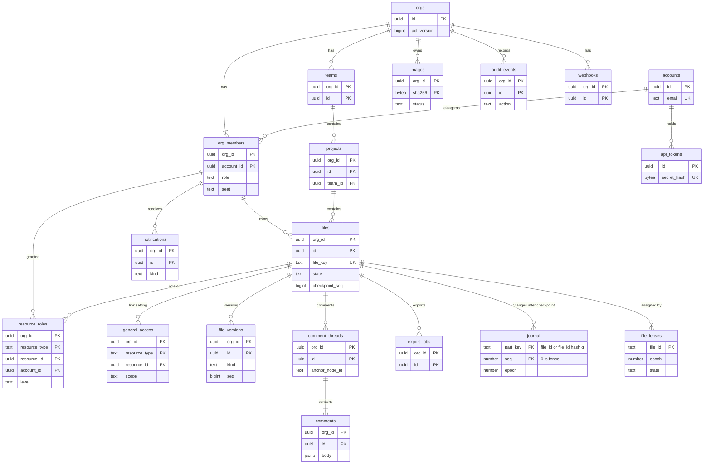

# Data model: Figma

データモデルの正本。表・列・キー・索引・分割・保持と、DB の外の置き場所（DynamoDB、S3、Valkey、SQS、AppConfig、ブラウザ）の形と、ファイルの中身（ノードとプロパティ）の形を、ここと [data-model/](data-model/identity.md) の下の文書にまとめる。

- テナントの分け方は [ADR-0005](../decisions/0005-tenancy-and-document-routing.md)、ファイルの中身の置き場所は [ADR-0003](../decisions/0003-journal-and-checkpoints.md)・[ADR-0024](../decisions/0024-journal-items-and-fencing.md)・[ADR-0025](../decisions/0025-content-addressed-checkpoints-and-loading.md)、割り当ては [ADR-0047](../decisions/0047-router-task-liveness-and-file-assignment.md)、大阪への切り替えの世代は [ADR-0048](../decisions/0048-osaka-dr-with-journal-generations.md)、ノードとプロパティは [ADR-0006](../decisions/0006-node-types-and-property-table.md)〜[ADR-0008](../decisions/0008-canonical-binary-serialization.md) に従う。
- **形（表・列・キー・プロパティの番号）はこの文書と data-model/ を正とする。** 振る舞い（いつ書くか、誰が読めるか、どう検証するか）は、各領域の文書を正とする。両者が食い違ったら、実装を止めて Dev（テックリード）に確かめる。
- 実装の変更（`changes/`）でマイグレーションや `schema/properties.toml` を書くときは、この文書と領域の文書を同じ PR で直す。
- 2026-09-28 に、全領域の文書と ADR から表と列を集め、足りない表を最小の形で足し、食い違いを直した（9.1 節）。

## 1. 文書の構成

量が多いので、領域ごとにファイルを分けた。

| ファイル | 内容 | 表 | ER 図 |
| --- | --- | --- | --- |
| この文書 | 規約、全体の ER 図、表の索引、横断の不変条件、テナントの文脈、保持、決めたこと | — | 1 |
| [data-model/identity.md](data-model/identity.md) | アカウントと認証（Better Auth）、利用者の設定 | 7 | 1 |
| [data-model/organization.md](data-model/organization.md) | 組織、ドメイン、メンバーとシート、SSO、チーム、プロジェクト、ファイル、最近のファイル | 10 | 1 |
| [data-model/sharing.md](data-model/sharing.md) | 役割、一般アクセス、招待、アクセスとシートの申請 | 5 | 1 |
| [data-model/file-storage.md](data-model/file-storage.md) | 版、保存のジョブ、DynamoDB（ジャーナル・フェンス・割り当て・生存）、S3 の files バケット | 2（＋ DynamoDB 3） | 2 |
| [data-model/document.md](data-model/document.md) | ノードの種類、プロパティの表（番号つき）、ID、木の不変条件、チェックポイント・ジャーナルの直列化 | — | 1 |
| [data-model/comments-and-notifications.md](data-model/comments-and-notifications.md) | コメント、メンション、既読、購読、通知、メールのまとめ | 9 | 2 |
| [data-model/events-and-audit.md](data-model/events-and-audit.md) | outbox、無効化の outbox、監査ログ、リーガルホールド | 7 | 1 |
| [data-model/assets.md](data-model/assets.md) | 画像、組織のフォント、書き出し、サムネイル | 4 | 1 |
| [data-model/extensions.md](data-model/extensions.md) | ライブラリ（E13）、プラグイン（E14） | 10 | 2 |
| [data-model/public-api.md](data-model/public-api.md) | OAuth のアプリ、トークン、Webhook、冪等性（E15） | 8 | 1 |
| [data-model/stores.md](data-model/stores.md) | Valkey、S3 のキー、SQS、outbox の出来事、Webhook の封筒、OpenSearch、AppConfig、ブラウザ | — | — |

合計：Aurora の表 62（`app` 43、`global` 18、`realtime` 1）、DynamoDB の表 3。ER 図は 14（全体 1、領域 13。うち 2 つは表でない実体の概念の図）。

## 2. 規約

### 2.1 置き場所

| 置き場所 | 中身 | 正本か | 失ったとき |
| --- | --- | --- | --- |
| Aurora PostgreSQL 18（writer 1＋reader 1、Global Database で大阪に reader） | メタデータ（`app`・`global`・`realtime` の 3 つのスキーマ） | メタデータの正本 | PITR 35 日から戻す |
| DynamoDB `journal` | チェックポイントより後の確定した変更と、フェンス | 変更の正本 | PITR 35 日。大阪のレプリカ |
| DynamoDB `file_leases`・`ds_liveness` | ファイルの割り当て、タスクの生存 | 持ち主の正本 | `file_leases` は PITR。`ds_liveness` は各タスクが 2 秒で書き直す |
| S3 files | チェックポイント（マニフェストとチャンク）、大きな変更、取り戻した版 | ファイルの中身の正本 | 古い版 30 日、大阪への複製 |
| S3 assets | 画像、フォント、書き出し、サムネイル、コメントの添付、ライブラリの blob、プラグインのコード | バイト列の正本 | 同上 |
| S3 log-archive | 監査のアーカイブ | アーカイブの正本 | Object Lock |
| Document Server のメモリ | 開いたファイルの今の状態、セッションの表、直近の確定した変更 | 正本ではない | ジャーナルとチェックポイントから戻す |
| Valkey（3 クラスタ） | チケットの `jti`、再開のトークンの `rid`、`acl_version`、取り消しの印、持ち主のキャッシュ、レート制限、Realtime のキャッシュと pub/sub | 正本ではない | 安全側に倒し、作り直す |
| SQS | Worker のジョブ | 正本ではない | outbox と表から作り直す |
| OpenSearch（延期） | ファイルの中身の検索の索引 | 正本ではない | チェックポイントから作り直す |
| AppConfig | フラグ、書き込みを受けるリージョンと世代、`min_client_build`、GPU のブロックリスト | 設定の正本 | — |
| ブラウザ | IndexedDB（チャンクのキャッシュ、プラグインの保存）、Cache Storage、`localStorage` | 正本ではない | 取り直す |
| 開発リポジトリ | `schema/properties.toml`、`schema/history.json`、`fonts/catalog.toml` | 定義の正本 | — |

- 請求と金額は扱わない（課金はこれから決める。[permissions-and-sharing.md](permissions-and-sharing.md) の 4.4 節）。金額の型は使わない。

### 2.2 ID

| ID | 形 | 規則 |
| --- | --- | --- |
| 表の ID | `uuid`（UUIDv7） | 既定値は PostgreSQL 18 の `uuidv7()`。Better Auth の表も UUIDv7 にする |
| `file_key` | `text`（base62、22 文字。128 ビットの乱数） | URL・共有のリンク・公開 API・Webhook の封筒・能力のチケットの外側で使う。**内部の `files.id` を外に出さない**（[permissions-and-sharing.md](permissions-and-sharing.md) の 8 節）。組織をまたいで一意（D-5） |
| `file_id` | `uuid` | `files.id`。S3 のキー、DynamoDB のキー、ジョブに使う。組織をまたいで一意 |
| `NodeId` | `(session_id: u32, local_id: u32)`。文字列では `"{session_id}:{local_id}"` | ファイルの中だけで一意（[ADR-0007](../decisions/0007-node-ids-and-tree-invariants.md)）。Aurora では `text` で持ち、`^[0-9]+:[0-9]+$` を CHECK する（D-20） |
| `session_id` | `u32` | ファイルごとにサーバーが振る。`0` はサーバーの操作 |
| `seq` | `bigint` | ファイルの中の確定の連番。ID ではなく位置 |
| `epoch` | `N`（DynamoDB） | 割り当てごとに 1 上がる。フェンスと `file_leases` で同じ値 |
| `region_gen` | `integer` | 大阪への切り替えの世代。1 から |
| ハッシュ | `bytea`（SHA-256、32 バイト） | 画像・チャンク・フォント・ライブラリの blob は中身の SHA-256 で名付ける。キーの中では 16 進の小文字 |
| outbox の ID | `bigint`（identity） | `outbox`・`global_outbox`・`realtime_invalidations` だけ。中継が `ORDER BY id` で読む |
| トークン | `<brand>pat_`・`<brand>oat_`・`<brand>ort_`・`<brand>ogt_` の接頭辞＋32 バイトの乱数＋CRC32 | DB にはハッシュだけ（[api-and-webhooks.md](api-and-webhooks.md) の 3.1 節） |
| `user_id` | `uuid` | 直列化の形式（`JournalBatch`、セッションの表、送受信のメッセージ）の中の名前。`global.accounts.id` を指す。表の列では `account_id` と書く |

### 2.3 スキーマとテナンシー

**テナントの表**（`app` スキーマ）は、次の形にそろえる（ADR-0005）。

```sql
CREATE TABLE app.<t> (
  org_id uuid NOT NULL REFERENCES app.orgs (id),
  id     uuid NOT NULL DEFAULT uuidv7(),
  ...
  PRIMARY KEY (org_id, id)
);
ALTER TABLE app.<t> ENABLE ROW LEVEL SECURITY;
ALTER TABLE app.<t> FORCE ROW LEVEL SECURITY;
CREATE POLICY tenant_isolation ON app.<t>
  USING      (org_id = current_setting('app.org_id')::uuid)
  WITH CHECK (org_id = current_setting('app.org_id')::uuid);
```

- 主キーと外部キーは `org_id` を先頭に含む複合キーにする。別の組織の行を参照する外部キーは、DB が拒否する。
- 索引の先頭も `org_id` にする。例外は `org_members (account_id)` の索引と、組織をまたぐ一意（`files.file_key`・`files.id`・`invitations.token_hash`・`org_domains.domain`）だけで、どれも下の `tenant_resolver` の関数だけが使う。
- `current_setting` は `missing_ok` なしで呼ぶ。文脈の設定を忘れたらエラーになる（安全側）。
- `orgs` はテナントの根で、`id = current_setting('app.org_id')::uuid` のポリシーを持つ。
- **テナントの表から `global` の表へ外部キーを張らない**（D-2）。`account_id`・`*_by`・`plugin_id`・`app_id`・`token_id` は論理の参照で、書くサービス関数が確かめる。S3 の段階で `global` を別のクラスタに分けるため（ADR-0005 の横の分割）。アカウントの行は消さずに匿名にするので、参照は切れない。
- **1 つのトランザクションで、複数の `org_id` の行を書かない**（ADR-0005。I-2）。

| スキーマ | 中身 | RLS |
| --- | --- | --- |
| `app` | テナントの表（43） | FORCE RLS |
| `global` | アカウントと認証、利用者の設定、運用者の監査、プラグイン、OAuth のアプリとトークン、組織に属さない outbox（18） | なし。触れるモジュールをロールと lint で限る |
| `realtime` | `realtime_invalidations`（1） | RLS の例外。`app` ロールに権限を与えない |

RLS の例外は `realtime.realtime_invalidations` だけ。足すときは、この表と [security.md](security.md) を合わせて直し、Dev のテックリードの承認を得る。

DB のロール：

| ロール | 使う主体 | 権限 |
| --- | --- | --- |
| `migrator` | マイグレーション | すべての表の所有者。FORCE RLS の対象 |
| `app` | API・Realtime edge・Worker・Document Server・Render Worker | `app` の表を RLS の下で読み書き。`global` のプラグインの表を読む。`global` の認証とトークンの表、`realtime` には権限なし。`BYPASSRLS` なし |
| `auth` | API の中の認証とトークンのモジュール | `global` の認証の表（[identity.md](data-model/identity.md)）とトークンの表（[public-api.md](data-model/public-api.md)）の読み書き、`global_outbox` への INSERT |
| `relay` | Worker の中の中継 | `outbox`・`global_outbox` の全行の SELECT・DELETE（[events-and-audit.md](data-model/events-and-audit.md) の 2 節） |
| `realtime_owner` | トリガーの関数の所有者（NOLOGIN） | `realtime.realtime_invalidations` への INSERT |
| `realtime_invalidator` | Realtime invalidator | `realtime.realtime_invalidations` の SELECT |
| `audit_exporter` | 監査のアーカイブの送り出し | `audit_events`・`operator_audit_events` の全行の SELECT、`audit_export_checkpoints` の読み書き |
| `ops_console` | 運用者の画面 | `operator_audit_events`・`plugin_blocklist`・`plugin_reviews` への書き込み。組織のデータは組織の文脈を設定して `app` と同じ規則で扱う |
| `tenant_resolver` | 組織をまたぐ `SECURITY DEFINER` 関数の所有者（NOLOGIN） | 下の関数が読む表だけに `TO tenant_resolver USING (true)` のポリシーを持つ。`BYPASSRLS` なし |

組織をまたぐ正当な読み書きは、`tenant_resolver` が所有する関数だけで行う。関数は引数で必ず絞り、決まった列だけを返す。

| 関数 | 用途 | 定めた場所 |
| --- | --- | --- |
| `resolve_file_key(file_key)` | URL・公開 API の `file_key` から `(org_id, file_id, state)` を引く。以後はその `org_id` の文脈で判定する（ADR-0005 の「ファイルを持つ組織の文脈で読む」） | [organization.md](data-model/organization.md) の `files` |
| `list_my_orgs(account_id)` | 組織の切り替え、アカウントの匿名化 | [organization.md](data-model/organization.md) の `org_members` |
| `resolve_org_domain(domain)` | 確認済みのドメインの持ち主の組織（メンバーとゲストの判定、SSO の振り分け、ドメインの重なりの確認） | `org_domains` |
| `accept_invitation(token_hash, account_id)` | 招待の受け入れ（組織の行と役割を作る） | [sharing.md](data-model/sharing.md) の `invitations` |
| `count_unread_notifications(account_id)` | 組織ごとの未読の数 | [comments-and-notifications.md](data-model/comments-and-notifications.md) の `notifications` |
| `get_user_preferences(account_id)`・`set_user_preferences(account_id, …)` | 利用者の設定 | [identity.md](data-model/identity.md) |
| `scheduler_due_items(kind, until, limit)` | 期限の来た行の `org_id` と主キーだけを返す。一般アクセスの期限、メールのまとめ、保存のジョブ、Webhook の再試行、版の期限、`pending` の画像、フォントの削除、チームの削除の期限、解約の期限、冪等性の鍵の期限。Worker は受け取った `org_id` で文脈を設定し、行を RLS の下で読み直す | 各表の索引の節 |

### 2.4 命名

- 表の名前は複数形の snake_case。列は snake_case。本家の内部の名前を使わない（リポジトリ共通の [ADR-0006](../../../../docs/decisions/0006-brand-neutral-identifiers.md)）。表・キー・バケット・ドメインのブランドの部分は `<brand>` と書く。
- 外部キーの列は `<参照先の単数>_id`。人を指す列は `account_id`、役割があれば `<役割>_account_id`（`owner_account_id`・`mentioned_account_id`）。操作した人は `<動詞>_by`（`created_by`・`trashed_by`・`granted_by`）で、中身は `accounts.id`。運用者は `text` の運用者の ID。
- 時刻は `<過去分詞>_at`。状態は領域の文書の呼び方に合わせ、`state`（遷移を持つもの）か `status`（取り込み・配送の結果）にする。
- ハッシュは `<名前>_hash` か `sha256`（`bytea`）。暗号文は `<名前>_enc` か `<名前>_ciphertext`（`bytea`）。
- 検索用の正規化の列は `<名前>_norm`。

### 2.5 型

| 用途 | 型 | 規則 |
| --- | --- | --- |
| ID | `uuid` | 2.2 節 |
| 連番・バイト数 | `bigint` | `seq`・`size_bytes`。小さい数は `integer`・`smallint` |
| 時刻 | `timestamptz` | UTC。DynamoDB と直列化の形式では UNIX 秒・ミリ秒の数 |
| 期間 | `integer`（秒） | 列名に単位を付ける（`session_max_age_seconds`）。`interval` は使わない |
| 列挙 | `text` ＋ `CHECK (x IN (...))` | PostgreSQL の `ENUM` は使わない（値の追加を expand / contract で扱いやすくするため） |
| 座標 | `real` | ファイルの中身の `f32` に合わせる |
| 本文・設定の束 | `jsonb` | Zod で検証してから書く |
| ID・名前の小さな集合 | `text[]`・`uuid[]` | 増えうるものは子の表にする |
| ハッシュ・暗号文 | `bytea` | |
| IP | `inet` | |
| `NodeId` | `text` | 2.2 節 |

### 2.6 時刻の列と削除

- ほぼすべての表に `created_at timestamptz NOT NULL DEFAULT now()` を持たせる。更新される表は `updated_at` も持ち、サービス関数で更新する（トリガーは使わない。例外は Realtime の無効化のトリガー）。

| 形 | 使う表 | 規則 |
| --- | --- | --- |
| **状態の遷移で消す** | `files`（`trashed → purging → purged`）、`orgs`（`cancelling → purged`） | 完全な削除のジョブが中身を消し、行は `id`・`org_id`・`purged_at` だけ残す（監査のため） |
| **墓標** | `comments`、`comment_threads` | `deleted_at` を設定し、本文を空にする。行はファイルの完全な削除で消す |
| **論理削除** | `teams`（28 日で戻せる）、`org_fonts`（7 日後に S3 から消す）、`libraries`（`unpublished_at`）、`plugins`（`removed`） | 期限の後にジョブが消す |
| **無効化** | `org_members` | 行を消さない。`deactivated_at` |
| **匿名化** | `global.accounts` | 行を消さない。個人の情報を消す（[identity.md](data-model/identity.md)） |
| **物理削除** | 関係の表（`team_members`・`resource_roles`・`comment_reactions` など）、期限付きの表 | その場で `DELETE`。時間で切る表はパーティションごと落とす |

- 完全な削除・掃除のジョブは、`legal_holds` の印を先に確かめ、印のあるものを飛ばす（[security.md](security.md) の 7 節）。
- S3 の削除は東京と大阪の両方のバケットで行う（ADR-0045。I-13）。

### 2.7 暗号化

- 保存時の暗号化は、データの種類ごとの KMS の鍵（マルチリージョン）で行う（[ADR-0044](../decisions/0044-encryption-keys-and-client-cache.md)）：`journal`（DynamoDB）、`files`（S3 files）、`assets`（S3 assets）、`metadata`（Aurora・Valkey）、`logs`、`secrets`。組織ごとの鍵は MVP で持たない。
- 列ごとに暗号化するのは次の列だけ。

| 列 | 方式 | 理由 |
| --- | --- | --- |
| `two_factors.secret`・`backup_codes` | Better Auth の暗号化 | 照合に復号が要る |
| `auth_identities.*_token_enc` | Better Auth の `encryptOAuthTokens` | IdP のトークンを平文で持たない |
| `org_sso_configs.oidc_client_secret_enc` | KMS の `metadata` の鍵でエンベロープ暗号化 | IdP へ送るので復号が要る |
| `webhooks.secret_ciphertext`・`secret_next_ciphertext` | KMS でエンベロープ暗号化 | HMAC の署名に使うので復号が要る（[api-and-webhooks.md](api-and-webhooks.md) の 6.3 節） |

- **照合だけに使う秘密は、ハッシュだけを置く**（SHA-256、定数時間で比べる）：確認コード、招待のトークン、API のトークン、OAuth の `client_secret`・認可コード。
- ブラウザの IndexedDB のチャンクは暗号化しない（ADR-0044）。

### 2.8 分割

| 表 | 分割 | 単位 | 落とす時期 |
| --- | --- | --- | --- |
| `outbox`・`global_outbox` | `RANGE (created_at)` | 1 日 | 空になった日 |
| `realtime.realtime_invalidations` | `RANGE (created_at)` | 1 時間 | 2 時間を過ぎたもの（1 分より古い行は読まない） |
| `audit_events`・`operator_audit_events` | `RANGE (id)` | 1 か月 | 1 年を過ぎたもの（アーカイブの送り出しの後） |
| `webhook_deliveries` | `RANGE (event_id)` | 1 日 | 7 日を過ぎたもの |

- **時間で切る表は、UUIDv7 の ID の範囲で切る**（Slack と同じ。D-23）。PostgreSQL は、分割した表の主キーと一意の制約に分割キーを含めることを求める。ID で切れば、主キーがそのまま時間の範囲になる。一意の制約で二重を防ぎたい表（`notifications`）は分割せず、期限の行を ID の範囲で消す。
- outbox の類は一意の制約を持たないので、`created_at` で切る。
- パーティションの作成と削除は、定期のジョブ（1 日 1 回）で 7 日先まで作る。

### 2.9 規模の前提（S1）

各表の「S1 の規模」は次の前提からの見積もりで、E7・E12 の負荷試験と試用の期間の計測で置き換える。

| 項目 | 値 | 出典 |
| --- | --- | --- |
| 利用者（月間） | 10 万 | [README.md](README.md) の 3 節 |
| アカウント | 約 15 万 | 月間の 1.5 倍（仮定） |
| 組織 | 約 3 万 | 暗黙の組織を含む（仮定） |
| ファイル | 約 300 万 | 1 人 30（仮定） |
| 同時に開いたファイル | 1 万（編集中 3,000） | [capacity.md](capacity.md) の 1 節 |
| 確定する変更 | 1 日 5,000 万（ピーク毎秒 4,200） | 同上 |
| ファイルを開く | 1 日 40 万 | 同上 |
| コメント | 1 日 10 万 | 仮定 |

### 2.10 スキーマの変更

- Aurora の表は、無停止の expand / contract で変える。列の削除・改名・型の変更・既定値のない `NOT NULL` の追加を、同じリリースで行わない（[ADR-0055](../decisions/0055-staged-rollout-and-schema-changes.md)）。
- テナントの表の追加は、`org_id`、複合キー、`FORCE ROW LEVEL SECURITY`、ポリシーをマイグレーションの lint で検査する。RLS の例外は 2.3 節の許可リストと照らす。
- プロパティの表の変更は、サーバー → クライアント → 書き込みの解禁（`schema.<prop>.write`）の順（ADR-0055）。追加以外の変更は `schema-breaking` のラベルと Dev のテックリードの承認が要る（ADR-0053）。

## 3. 全体の ER 図

主な実体と関係だけ。列と細かい関係は領域の図にある。`journal`・`file_leases` は DynamoDB、ほかは Aurora。



図の `part_key` は、DynamoDB の区分キー `pk` を指す（Mermaid では `pk` を属性名に使えないため）。

ファイルの中身（ノードの木）の概念の図は [document.md](data-model/document.md) の 1 節にある。

## 4. 表の索引

「内」は `app` のテナントの表（FORCE RLS）、「外」は `global`、「例外」は RLS の例外。

| 表 | 文書 | テナント | 振る舞いを定める文書 |
| --- | --- | --- | --- |
| `accounts` | [identity](data-model/identity.md) | 外 | [security.md](security.md) の 4 節、ADR-0043 |
| `auth_identities` | [identity](data-model/identity.md) | 外 | 同上 |
| `sessions` | [identity](data-model/identity.md) | 外 | 同上 |
| `passkeys` | [identity](data-model/identity.md) | 外 | 同上 |
| `two_factors` | [identity](data-model/identity.md) | 外 | 同上 |
| `verification_codes` | [identity](data-model/identity.md) | 外 | 同上 |
| `user_preferences` | [identity](data-model/identity.md) | 外 | [editor-and-tools.md](editor-and-tools.md) の 20 節 |
| `orgs` | [organization](data-model/organization.md) | 根（RLS あり） | [permissions-and-sharing.md](permissions-and-sharing.md)、[security.md](security.md) |
| `org_domains` | [organization](data-model/organization.md) | 内 | [permissions-and-sharing.md](permissions-and-sharing.md) の 3.2 節、[security.md](security.md) の 4 節 |
| `org_members` | [organization](data-model/organization.md) | 内 | [permissions-and-sharing.md](permissions-and-sharing.md) の 3・4 節、[search.md](search.md) の 3.1 節 |
| `org_sso_configs` | [organization](data-model/organization.md) | 内 | [security.md](security.md) の 4 節（E12） |
| `org_notification_policies` | [organization](data-model/organization.md) | 内 | [comments-and-notifications.md](comments-and-notifications.md) の 4.5 節 |
| `teams` | [organization](data-model/organization.md) | 内 | [permissions-and-sharing.md](permissions-and-sharing.md) の 3.3 節 |
| `team_members` | [organization](data-model/organization.md) | 内 | 同上 |
| `projects` | [organization](data-model/organization.md) | 内 | [permissions-and-sharing.md](permissions-and-sharing.md) |
| `files` | [organization](data-model/organization.md) | 内 | [permissions-and-sharing.md](permissions-and-sharing.md)、[file-storage-and-history.md](file-storage-and-history.md)、[search.md](search.md) |
| `file_visits` | [organization](data-model/organization.md) | 内 | [search.md](search.md) の 3.1 節 |
| `resource_roles` | [sharing](data-model/sharing.md) | 内 | [permissions-and-sharing.md](permissions-and-sharing.md) の 4.3 節 |
| `general_access` | [sharing](data-model/sharing.md) | 内 | 同 4.3・7 節 |
| `invitations` | [sharing](data-model/sharing.md) | 内 | 同 6.1 節 |
| `access_requests` | [sharing](data-model/sharing.md) | 内 | 同 6.4 節 |
| `seat_requests` | [sharing](data-model/sharing.md) | 内 | 同 4.4 節 |
| `file_versions` | [file-storage](data-model/file-storage.md) | 内 | [file-storage-and-history.md](file-storage-and-history.md) の 8 節 |
| `file_storage_jobs` | [file-storage](data-model/file-storage.md) | 内 | 同 5.4・10・11 節 |
| `comment_threads` | [comments-and-notifications](data-model/comments-and-notifications.md) | 内 | [comments-and-notifications.md](comments-and-notifications.md) の 3 節 |
| `comments` | [comments-and-notifications](data-model/comments-and-notifications.md) | 内 | 同上 |
| `comment_attachments` | [comments-and-notifications](data-model/comments-and-notifications.md) | 内 | 同上 |
| `comment_reactions` | [comments-and-notifications](data-model/comments-and-notifications.md) | 内 | 同上 |
| `comment_mentions` | [comments-and-notifications](data-model/comments-and-notifications.md) | 内 | 同 4.1 節 |
| `comment_read_states` | [comments-and-notifications](data-model/comments-and-notifications.md) | 内 | 同 3 節 |
| `file_comment_subscriptions` | [comments-and-notifications](data-model/comments-and-notifications.md) | 内 | 同 4.2 節 |
| `notifications` | [comments-and-notifications](data-model/comments-and-notifications.md) | 内 | 同 4.4 節 |
| `email_digest_queue` | [comments-and-notifications](data-model/comments-and-notifications.md) | 内 | 同 4.3 節 |
| `outbox` | [events-and-audit](data-model/events-and-audit.md) | 内（`relay` は全行） | [README.md](README.md) の 5 節 |
| `global_outbox` | [events-and-audit](data-model/events-and-audit.md) | 外 | ADR-0043 |
| `realtime_invalidations` | [events-and-audit](data-model/events-and-audit.md) | 例外 | [ADR-0028](../decisions/0028-realtime-metadata-subscriptions.md) |
| `audit_events` | [events-and-audit](data-model/events-and-audit.md) | 内（追記だけ） | [ADR-0045](../decisions/0045-audit-log-and-data-lifecycle.md) |
| `operator_audit_events` | [events-and-audit](data-model/events-and-audit.md) | 外（追記だけ） | 同上 |
| `audit_export_checkpoints` | [events-and-audit](data-model/events-and-audit.md) | 外 | 同上 |
| `legal_holds` | [events-and-audit](data-model/events-and-audit.md) | 内 | [security.md](security.md) の 7 節 |
| `images` | [assets](data-model/assets.md) | 内 | [export-and-assets.md](export-and-assets.md) の 6 節 |
| `org_fonts` | [assets](data-model/assets.md) | 内 | 同 7 節 |
| `export_jobs` | [assets](data-model/assets.md) | 内 | 同 4・5 節、[api-and-webhooks.md](api-and-webhooks.md) の 4 節 |
| `file_thumbnails` | [assets](data-model/assets.md) | 内 | [export-and-assets.md](export-and-assets.md) の 8 節 |
| `libraries` | [extensions](data-model/extensions.md) | 内 | [components-and-libraries.md](components-and-libraries.md) の 7 節 |
| `library_versions` | [extensions](data-model/extensions.md) | 内 | 同上 |
| `library_assets` | [extensions](data-model/extensions.md) | 内 | 同上 |
| `file_library_links` | [extensions](data-model/extensions.md) | 内 | 同上 |
| `plugins` | [extensions](data-model/extensions.md) | 外 | [plugins.md](plugins.md) の 9・10 節 |
| `plugin_versions` | [extensions](data-model/extensions.md) | 外 | 同上 |
| `plugin_reviews` | [extensions](data-model/extensions.md) | 外 | 同上 |
| `plugin_blocklist` | [extensions](data-model/extensions.md) | 外 | 同上 |
| `org_plugin_policies` | [extensions](data-model/extensions.md) | 内 | 同上 |
| `org_plugin_allowlist` | [extensions](data-model/extensions.md) | 内 | 同上 |
| `oauth_apps` | [public-api](data-model/public-api.md) | 外 | [api-and-webhooks.md](api-and-webhooks.md) の 3 節 |
| `oauth_authorization_codes` | [public-api](data-model/public-api.md) | 外 | 同 3.3 節 |
| `oauth_grants` | [public-api](data-model/public-api.md) | 外 | 同 3 節 |
| `api_tokens` | [public-api](data-model/public-api.md) | 外 | 同 3 節 |
| `org_oauth_app_allowlist` | [public-api](data-model/public-api.md) | 内 | 同 3.4 節 |
| `webhooks` | [public-api](data-model/public-api.md) | 内 | 同 6 節 |
| `webhook_deliveries` | [public-api](data-model/public-api.md) | 内 | 同 6.4 節 |
| `idempotency_keys` | [public-api](data-model/public-api.md) | 内 | 同 4 節 |

DynamoDB：

| 表 | 文書 | 複製 | 振る舞いを定める文書 |
| --- | --- | --- | --- |
| `journal` | [file-storage](data-model/file-storage.md) の 3.1 節 | グローバル（MREC） | [file-storage-and-history.md](file-storage-and-history.md) の 4 節、ADR-0024、ADR-0048 |
| `file_leases` | [file-storage](data-model/file-storage.md) の 3.2 節 | グローバル（MREC） | [infrastructure.md](infrastructure.md) の 5 節、ADR-0047 |
| `ds_liveness` | [file-storage](data-model/file-storage.md) の 3.3 節 | リージョンごと | 同上、ADR-0051 |

## 5. DB の外の置き場所

| 置き場所 | 文書 |
| --- | --- |
| DynamoDB の項目とキーの設計、GSI | [file-storage.md](data-model/file-storage.md) の 3 節 |
| S3 の files バケット | [file-storage.md](data-model/file-storage.md) の 5 節 |
| S3 の assets・log-archive・shared バケット | [stores.md](data-model/stores.md) の 3 節 |
| チェックポイント・ジャーナルの本体・セッションの表の形 | [document.md](data-model/document.md) の 5 節 |
| プロパティの表（番号つき） | [document.md](data-model/document.md) の 3 節 |
| Valkey のキーと pub/sub | [stores.md](data-model/stores.md) の 2 節 |
| SQS のジョブ | [stores.md](data-model/stores.md) の 4 節 |
| outbox の出来事 | [stores.md](data-model/stores.md) の 5 節 |
| Webhook の封筒 | [stores.md](data-model/stores.md) の 6 節 |
| OpenSearch、AppConfig | [stores.md](data-model/stores.md) の 7・8 節 |
| IndexedDB・Cache Storage・`localStorage` | [stores.md](data-model/stores.md) の 9 節 |

## 6. 横断の不変条件

実装とテストで守る規則。DB の制約で守れるものは制約にし、守れないものは性質ベーステストで確かめる。

### 6.1 メタデータ

| # | 不変条件 | 守り方 | 決めた場所 |
| --- | --- | --- | --- |
| I-1 | 組織の中の行は、別の組織の行を参照しない | 複合外部キー、RLS | ADR-0005 |
| I-2 | 1 つのトランザクションで、複数の `org_id` の行を書かない | サービス関数の lint、結合テスト | ADR-0005 |
| I-3 | `file_key` は組織をまたいで一意で、内部の `files.id` を外に出さない | `UNIQUE (file_key)`、API の出力の型 | [permissions-and-sharing.md](permissions-and-sharing.md) の 8 節 |
| I-4 | `files.team_id` は `projects.team_id` と等しい（下書きは NULL） | 移動と同じトランザクション、毎日の見張り | 同 9.3 節 |
| I-5 | ファイルの所有者は 1 人で、`files.owner_account_id` だけで表す | `resource_roles` の CHECK | D-12 |
| I-6 | 権限に効く変更は、同じトランザクションで `orgs.acl_version` を 1 上げ、監査ログと `acl.changed` を書く | サービス関数、表駆動の結合テスト | ADR-0031 |
| I-7 | `files.checkpoint_seq` は後退しない。版の行はチェックポイントの更新と同じトランザクションで足す | `WHERE checkpoint_seq < :s` | [file-storage-and-history.md](file-storage-and-history.md) の 5.2 節 |
| I-8 | 画像の重複の除去と署名は、ファイルを持つ組織の `images` の `ready` の行だけで行う | 主キー `(org_id, sha256)`、PROP-EA-002 | ADR-0035 |
| I-9 | 監査ログは追記だけで、操作と同じトランザクションに 1 件ある | `app` に UPDATE・DELETE を与えない、トリガーで拒否 | ADR-0045 |
| I-10 | Valkey のキー・チャンネル、S3 のキー、ジョブは、組織かファイルで区切る | [stores.md](data-model/stores.md) の 1 節の形、レビュー | ADR-0005 |
| I-11 | ファイルの中身（名前、テキスト、画像、コメントの本文）を、ログ・メトリクス・監査ログ・通知の行・outbox・ジョブのエラーに入れない | 型、lint、レビュー | 本題材の AGENTS.md |
| I-12 | Valkey・SQS・OpenSearch・ブラウザを失っても、正本から作り直せる | 配信の経路に状態を持たせない | [README.md](README.md) の 1 節 |
| I-13 | S3 の削除（掃除・完全な削除・mark-and-sweep・ライフサイクル）は、東京と大阪の両方で行う | `file_storage_jobs.region`、両方のバケットの規則 | ADR-0045 |
| I-14 | `realtime_invalidations` は ID のキーだけを持ち、`app` ロールから読めない | ロールの権限 | ADR-0028 |

### 6.2 ジャーナルとフェンス

| # | 不変条件 | 守り方 | 決めた場所 |
| --- | --- | --- | --- |
| J-1 | 変更は、ジャーナルに書けてから `Ack`・`Committed` を出す | file actor の順序、PROP-FS-001 | ADR-0003 |
| J-2 | ジャーナルの書き込みは、フェンスの `epoch` の一致と `seq` の未使用の 2 つを条件にした 1 つの `TransactWriteItems` | 書き込みの関数を 1 つにする | ADR-0024、本題材の AGENTS.md |
| J-3 | フェンスの `epoch` は増えるだけで、`file_leases.epoch` と同じ値。新しい持ち主はフェンスを上げてからジャーナルを読む | `epoch < :E` の条件、PROP-FS-007 | ADR-0024、ADR-0047 |
| J-4 | 1 つの世代の中で、項目の `seq` の範囲は隙間なく続く。飛びがあれば読み込みを止め、`maintenance`（`journal_gap`） | 回復での検査、障害注入 | [file-storage-and-history.md](file-storage-and-history.md) の 4.4 節 |
| J-5 | 再試行は同じ `ClientRequestToken` と同じ中身で行い、二重に書かれない | `hash(file_id, epoch, start_seq)` | ADR-0024 |
| J-6 | `session_id` は二度振らない。振ったことをジャーナルに書いてから渡す | `next_session_id` をチェックポイントとジャーナルから戻す | ADR-0007 |
| J-7 | チェックポイント A と `(A, B]` のジャーナルから作った状態は、チェックポイント B と同じバイト列 | 正準形、PROP-FS-002、影の検証 | ADR-0008 |

### 6.3 木と並び

| # | 不変条件 | 守り方 | 決めた場所 |
| --- | --- | --- | --- |
| T1〜T9 | 木の不変条件（[document.md](data-model/document.md) の 4 節） | `doc-model` の検証器だけに書く。PROP-DM-001 | ADR-0007 |
| O-1 | 同じ親の子の `OrderKey` は一意で、64 バイト以下。当てた後に 48 バイトを超えたら、その親の子をすべて同じ `seq` の中で振り直す | サーバーの書き換え（`session_id = 0`）、PROP-MP-003 | [ADR-0010](../decisions/0010-ordering-keys-and-cycle-rejection.md) |
| O-2 | 親の付け替えで循環を作る変更は、`ChangeSet` 全体を拒否する | 当てる前に新しい親から根までたどる。PROP-MP-002 | ADR-0010 |
| O-3 | まとめての挿入は乱数の接頭辞を付け、2 人のまとまりが交ざらない | PROP-MP-008 | ADR-0010 |
| O-4 | コンポーネントの参照に循環がない（T9 を含む） | Document Server の参照のグラフ | [components-and-libraries.md](components-and-libraries.md) の 3.5 節 |

### 6.4 世代（大阪への切り替え）

| # | 不変条件 | 守り方 | 決めた場所 |
| --- | --- | --- | --- |
| G-1 | 世代 `g ≥ 2` のジャーナルは `{file_id}#g{g}`、マニフェストは `checkpoints/g{g}/`、大きな変更は `journal-blobs/g{g}/` に書く。チャンクは世代で分けない | キーを作る関数を 1 つにする | ADR-0048 |
| G-2 | 新しい世代の `seq` は、フェンスの `base_end_seq + 1` から続く | 回復の手順 | ADR-0048 |
| G-3 | `file_leases.region_gen` が今の世代でない割り当ては「持ち主なし」とみなす | Router | ADR-0047、ADR-0048 |
| G-4 | 取り戻した版は `salvage/g{g}/` に置き、今のファイルに自動で混ぜない | `file_versions.kind = dr_salvaged` | ADR-0048 |
| G-5 | 大阪で確定した変更は、東京の遅れた項目が後から届いても失われない | G-1 のキーの分離、性質ベーステスト | ADR-0048 |

## 7. テナントの文脈

```
要求 ─▶ 認証のミドルウェア
         1. セッション（Cookie）か API のトークンから account_id を得る。匿名の閲覧者は anonymous_session_id
         2. 資源の組織を決める
            - ファイル：resolve_file_key(file_key) → (org_id, file_id)
            - 組織の画面：パスの org_id と list_my_orgs で所属を確かめる
         3. BEGIN; SET LOCAL app.org_id = …; SET LOCAL app.account_id = …
       ─▶ ハンドラー（以降のクエリはすべて RLS の下。判定関数で権限を確かめる）
       ─▶ COMMIT（SET LOCAL の値はここで消える）
```

- ゲストとリンクを知っている人も、**ファイルを持つ組織の文脈**で読む（ADR-0005）。主体の所属の組織の行は判定に使わない。
- Worker は、ジョブの `org_id` で文脈を設定してから処理する。スケジューラーは `scheduler_due_items` で `org_id` を得る。
- Document Server と回復のジョブは、`file_leases.org_id` で文脈を設定する（D-6）。Document Server が Aurora に書くのは `files` のチェックポイントの列、`file_versions`、`outbox`（`file.checkpointed`・`file.edit_idle`）だけ。
- `app.account_id` は、監査ログの行為者と、行為者で絞る処理に使う。RLS のポリシーには使わない（ポリシーは組織の単位だけ）。

## 8. 保持の一覧

保持と削除の期間の正本は [security.md](security.md) の 7 節（法務の確認待ち、[intent.md](../intent.md) の L4）。表ごとの値は各文書にある。

| データ | 保持 |
| --- | --- |
| ジャーナルの項目 | 書いてから 30 日（TTL）。PITR 35 日 |
| チェックポイント | 48 時間はすべて、30 日までは 1 日 1 つ。版の印のあるものは版に従う |
| 版 | 無料のプラン 30 日、有料はすべて |
| ゴミ箱のファイル | 自動では消さない |
| チームの削除 | 28 日で戻せなくなる |
| 組織の解約 | 28 日の猶予 |
| アカウントの削除 | 30 日の猶予の後に匿名化 |
| 通知 | 90 日 |
| メールのまとめ | 送ってから 7 日 |
| 書き出しの結果 | 14 日（URL は 24 時間） |
| 監査ログ | Aurora に 1 年、アーカイブに 7 年（既定案） |
| Webhook の配送の記録 | 7 日 |
| 冪等性の鍵 | 24 時間 |
| 無効化の outbox | 1 分（パーティションは 2 時間） |
| バックアップ（PITR）・S3 の古い版 | 35 日・30 日。どの削除でも最終の期限 |

## 9. 決めたこと

### 9.1 データモデルの設計（2026-09-28）

PM の方針（判断が要るところは推奨案でよい）により、次のとおり決めた。アーキテクチャの決定（ADR）は変えていない。

| # | 論点 | 決定 | 直した文書 |
| --- | --- | --- | --- |
| D-1 | 形の正本の置き場所。前は「各表の正本は領域の文書」だった | 形はこの文書と data-model/ を正とし、振る舞いは領域の文書を正とする。1,500 行を超えるので領域ごとに分けた | この文書、[README.md](README.md) の 8 節 |
| D-2 | テナントの表から `global` の表への外部キー | 張らない。論理の参照にし、サービス関数で確かめる。S3 で `global` を分けられるようにする | — |
| D-3 | 匿名の閲覧者のセッション（24 時間）の置き場所がなかった | 表を持たず、API が署名した Cookie に ID と期限だけを入れる | — |
| D-4 | `oauth_grants`・`api_tokens` は「RLS。利用者の所属の組織」とされていたが、トークンは複数の組織のファイルに使え、組織が決まる前に引く | `global` に置き、`auth` ロールだけが触れる。列の `user_id`・`owner_user_id` を `account_id`・`owner_account_id` に揃えた | [api-and-webhooks.md](api-and-webhooks.md) の 14 節 |
| D-5 | URL は `file_key` だけを持つのに、一意は `(org_id, file_key)` だった。組織の文脈を決める前に引けない | `UNIQUE (file_key)`（組織をまたぐ）と `resolve_file_key` の関数。`files.id` も組織をまたいで一意 | — |
| D-6 | Document Server と回復のジョブが Aurora の組織の文脈を得る手段がなかった | `file_leases` に `org_id` を足す（割り当てのときに Gateway がチケットから渡す） | [infrastructure.md](infrastructure.md) の 5.1 節 |
| D-7 | プロパティの表で、`stroke_align`・`stroke_cap`・`stroke_join`・`dash_pattern` が 1 つの番号 12 に、`polygon_count`・`star_inner_radius` が 41 に並んでいた。ライブラリの写しの出どころのプロパティがなかった | 12 を `stroke_align`、43〜45 を `stroke_cap`・`stroke_join`・`dash_pattern`、41 を `polygon_count`、46 を `star_inner_radius` にした。範囲で書いた番号は名前の順に振る。69 `library_source` を予約（E13） | [document-model.md](document-model.md) の 4.2 節 |
| D-8 | `NodeType` の値が決まっていなかった | 1〜17 を振り、0 を使わず、32〜63 をホワイトボードに予約 | — |
| D-9 | `realtime_invalidations` の列名が 2 つの節で違った（`table`・`key_columns` と `table_name`・`key`）。1 分で消すと行の削除が多い | `table_name`・`key` に揃えた。1 時間のパーティションにし、1 分より古い行は読まず、2 時間でパーティションを落とす | [comments-and-notifications.md](comments-and-notifications.md) の 5.2 節 |
| D-10 | outbox の表と、出来事を Gateway へ届ける経路がなかった | `outbox`（`app`）と `global_outbox`（組織に属さない出来事）を置き、Worker の中の Relay が読む。制御の出来事は Valkey の `ctl:*` のチャンネル、仕事は SQS | — |
| D-11 | 監査ログの「outbox で送る」の形 | `audit_events` 自身を outbox として `id` の順に読み、位置を `audit_export_checkpoints` に持つ | — |
| D-12 | ファイルの所有者を表す場所が 2 つありえた（`files.owner_account_id` と `resource_roles` の `owner`）。4.3 節の計算は下書きの所有者だけを扱っていた | `files.owner_account_id` だけで表し、`resource_roles` のファイルの行に `owner` を置かない。実効の水準の計算で、所有者は下書きに限らず `owner` にする | [permissions-and-sharing.md](permissions-and-sharing.md) の 4.3・16 節 |
| D-13 | 確認済みのドメインの置き場所が `orgs` と `org_sso_configs.verified_domains` に分かれていた | `org_domains` の表にし、組織をまたいで一意にする。SSO の対象はその組織の確認済みのドメイン | [security.md](security.md) の 14 節、[permissions-and-sharing.md](permissions-and-sharing.md) の 16 節 |
| D-14 | メールのプレビューの方針が `orgs` の列と `org_notification_policies` の両方に書かれていた | `org_notification_policies` に置く | — |
| D-15 | Realtime の問い合わせ（Q3・Q4）が `file_id` で絞るのに、`comment_reactions`・`comment_read_states` が `file_id` を持たなかった | 非正規化の `file_id` を足した（`comment_mentions`・`comment_attachments` も）。コメントの削除は墓標 | [comments-and-notifications.md](comments-and-notifications.md) の 3.1 節 |
| D-16 | `webhook_deliveries` の主キーが `id`（イベントの ID）だけで、1 つの出来事を複数の Webhook に送れなかった | 主キーを `(org_id, event_id, webhook_id)` にし、`id` を `event_id` と改めた | [api-and-webhooks.md](api-and-webhooks.md) の 14 節 |
| D-17 | ライブラリの blob とプラグインのコードのバケットが決まっていなかった | assets バケットに置き、CloudFront の振る舞いで配信を分ける | — |
| D-18 | 組織の OAuth のアプリの許可リストと、個人のトークンの禁止の置き場所がなかった | `org_oauth_app_allowlist` と `orgs.oauth_apps_mode`・`orgs.pat_disabled` | — |
| D-19 | 通知の二重を防ぐ一意の制約と、時間の分割が両立しない | `notifications` は分割しない。90 日の行は ID の範囲で消す | — |
| D-20 | Aurora の中の `NodeId` の型 | `"{session_id}:{local_id}"` の `text` | — |
| D-21 | 版と保存のジョブの列が、世代と取り戻しに足りなかった | `file_versions.region_gen`・`files.checkpoint_gen` を足し、`file_storage_jobs.kind` に `dr_salvage` を足した | [file-storage-and-history.md](file-storage-and-history.md) の 17 節 |
| D-22 | 領域の文書が使うのに定義のない表 | 最小の形で足した：`auth_identities`・`two_factors`（Better Auth）、`oauth_authorization_codes`、`audit_export_checkpoints`、`outbox`・`global_outbox`、`org_domains`、`org_oauth_app_allowlist`。列も最小に足した（`orgs.full_seat_limit`・`state`・`purge_after`、`invitations.role_on_accept`、`teams.deleted_at`、`file_thumbnails.id` など） | — |
| D-23 | 時間で切る表の切り方 | UUIDv7 の ID の範囲で切る（Slack と同じ）。outbox の類だけ `created_at` | — |

### 9.2 統合の工程で決めたこと（2026-09-27）

| 論点 | 決定 |
| --- | --- |
| `files` の列が 3 つの領域に分かれていた | 1 つの定義にまとめ、列ごとに持ち主を書いた（今は [organization.md](data-model/organization.md) の `files`） |
| Router の表：file-storage-and-history.md は `file_leases` を「ADR-0005 のリース」とし、ADR-0005 はファイルごとのリースの延長の例を示していた | ADR-0047 の「タスクの生存（`ds_liveness`）＋ファイルの割り当て（`file_leases`）」に揃え、ADR-0005・README・file-storage-and-history.md・multiplayer.md を書き換えた |
| ジャーナルとマニフェストのキーに、世代 2 以降の形がなかった | `{file_id}#g{g}`・`checkpoints/g{g}/` を足し、file-storage-and-history.md の 4.1・5 節も揃えた |
| file-storage-and-history.md の 11.2 節の「大阪の複製は削除が伝わる」は S3 では成り立たない | 完全な削除・掃除・mark-and-sweep・ライフサイクルを両方のバケットで行う（ADR-0045）。`file_storage_jobs.region` で手順を分けて記録する |
| `user_preferences` の RLS の扱い | `global` スキーマに置き、`account_id` で絞る関数を通す |
| コメントの添付のキーの形が他の資産と違った | `comment-attachments/{org_id}/{file_id}/{asset_id}` に揃えた |
| `files.team_id` の非正規化の書き換えの手順が決まっていなかった | ファイル・プロジェクトの移動と同じトランザクションで書き換え、`acl_version` を上げる（permissions-and-sharing.md の 9.3 節） |
| 大阪への切り替えで取り戻した編集の版の種類 | `file_versions.kind` に `dr_salvaged` を足した |
| 取り戻した版のマニフェストの置き場所 | `files/{file_id}/salvage/g{g}/{seq:020}`。取り戻した `seq` は今の世代の `seq` と重なりうるので `checkpoints/` と分けた |
| ジャーナルの飛び・不変条件の破れ・運用者の停止で使うファイルの状態 | `files.state = maintenance` と `maintenance_reason` を足した |
| ChangeSet の `origin`、マニフェストの `features`、表の列 `public_api`・`api_name`・`api_since`・`public_plugin` | すべて document-model.md に取り込んだ |
| CDN の署名とキャッシュの鍵 | 含めない。キャッシュのオブジェクトは中身のハッシュで名付け、パスに組織かファイルを含む |

## 10. 残した問い

| 問い | いつ・どう決めるか |
| --- | --- |
| プロジェクトの削除の形（ゴミ箱に入れるか、配下のファイルをどうするか） | E9 の `spec.md`。領域の文書に記述がない |
| ライブラリの写しを置く「`imported` の根」のノードの種類（隠れた `CANVAS` か、新しい種類か） | E13 の前。[components-and-libraries.md](components-and-libraries.md) の 7.2 節 |
| レイアウトグリッドのプロパティ（上書きの表にあるが、プロパティの表にない） | E5・E6。番号は 47〜49 から振る |
| 復元の差分を当てた利用者の ID をどの項目に持つか（`JournalBatch` の `session_opens` か、`origin` の付帯か） | E7 の `version-restore` |
| アカウントのアイコンの置き場所（S3 のキーと列） | E1 の認証の骨格 |
| 利用者が消したコメントの本文を、リーガルホールドの間に残すか | 法務（L4） |
| S3 の横の分割で、`file_key` の組織をまたぐ一意と `global` の表を、どこに置くか（ディレクトリの表） | S2 の前の分割の ADR |
| Realtime のキャッシュ（`rtq:`）の値に行の中身を持つか | E1 の Realtime の最小の形 |
| S1 の規模の仮定（組織・ファイル・コメントの数） | E7・E12 の計測と試用の期間 |
| すべてのテナントの表に RLS があり、2.3 節の例外が網羅されていることの照合 | E1 のマイグレーションの CI |
