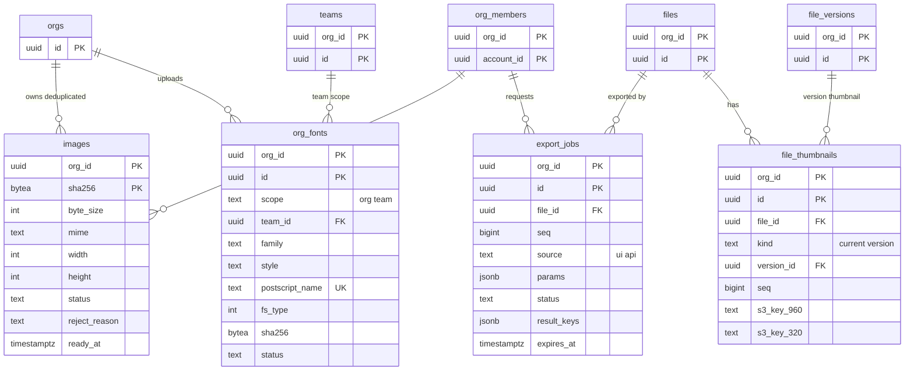

# Data model: 画像・フォント・書き出し・サムネイル

[data-model.md](../data-model.md) の一部。規約は、そちらの 2 節に従う。振る舞いは [export-and-assets.md](../export-and-assets.md)、[ADR-0034](../../decisions/0034-export-rendering-split.md)〜[ADR-0036](../../decisions/0036-font-sources-and-licensing.md) を正とする。

すべて `app` スキーマのテナントの表（`org_id`、複合キー、FORCE RLS）。バイト列は S3 の assets バケットにあり、キーの形は [stores.md](stores.md) の 3 節。ファイルの中身は、画像を `image_hash`（SHA-256）で、フォントを名前で参照する（[document.md](document.md) の 5.4 節）。

## 1. ER 図

## 2. 表

### images

画像の台帳。組織ごとに中身の SHA-256 で重複を除く（ADR-0035）。組織をまたいで除かない。

| 列 | 型 | NULL | 既定 | 説明 |
| --- | --- | --- | --- | --- |
| `org_id` | `uuid` | NO | | |
| `sha256` | `bytea` | NO | | 正規化の後のバイト列の SHA-256（32 バイト） |
| `byte_size` | `integer` | NO | | 20 MiB まで |
| `mime` | `text` | NO | | `image/png`・`image/jpeg`・`image/gif`・`image/webp` |
| `width`・`height` | `integer` | NO | | 長辺 4,096 px まで |
| `status` | `text` | NO | `'pending'` | `pending`・`ready`・`rejected`・`taken_down` |
| `reject_reason` | `text` | YES | | `format`・`size`・`decode`・`metadata`・`threat`・`hash_mismatch` |
| `uploaded_by` | `uuid` | NO | | 最初に上げた人 |
| `created_at` | `timestamptz` | NO | `now()` | |
| `ready_at` | `timestamptz` | YES | | |
| `taken_down_at` | `timestamptz` | YES | | 権利の侵害の申し立ての取り下げ（L2） |

- 主キー：`(org_id, sha256)`。
- CHECK：`octet_length(sha256) = 32`、`status IN (...)`、`(status = 'rejected') = (reject_reason IS NOT NULL)`、`(status = 'taken_down') = (taken_down_at IS NOT NULL)`、`width BETWEEN 1 AND 4096`、`height BETWEEN 1 AND 4096`、`byte_size BETWEEN 1 AND 20971520`。
- 索引：
  - 主キー：登録（`POST …/images`）と署名（`images:sign`。`status = 'ready'` の行だけに URL を出す）。
  - `(created_at) WHERE status = 'pending'`：24 時間 `pending` の行の掃除（`scheduler_due_items`）。
  - `(org_id, created_at)`：週 1 回の mark-and-sweep（作って 7 日を過ぎたものだけを候補にする）。
- Realtime の購読の対象（`ready` への変化を他の人の画面に伝える）。
- 削除：mark-and-sweep で、どのチェックポイントの `blob_refs_chunk` にもない行と S3 のオブジェクトを消す（東京と大阪の両方）。取り下げは行を `taken_down` で残し、オブジェクトを消す。
- S1 の規模：約 2,000 万行（仮定）。

### org_fonts

組織・チームのフォント（ADR-0036）。

| 列 | 型 | NULL | 既定 | 説明 |
| --- | --- | --- | --- | --- |
| `org_id`・`id` | `uuid` | NO | | 主キー |
| `scope` | `text` | NO | | `org`・`team` |
| `team_id` | `uuid` | YES | | `team` のとき |
| `family`・`style` | `text` | NO | | `name` の表から読んだ名前 |
| `weight` | `smallint` | NO | | 100〜900 |
| `italic` | `boolean` | NO | | |
| `postscript_name` | `text` | NO | | |
| `fs_type` | `integer` | NO | | `OS/2` の `fsType`（PDF への埋め込みの判断。L1 が決まるまではすべてアウトライン化） |
| `sha256` | `bytea` | NO | | S3 のキー |
| `byte_size` | `integer` | NO | | 50 MiB まで |
| `status` | `text` | NO | `'pending'` | `pending`・`ready`・`rejected`・`deleted`・`taken_down` |
| `reject_reason` | `text` | YES | | |
| `license_confirmed_by`・`license_confirmed_at` | `uuid`・`timestamptz` | NO | | 「権利を持つか、ライセンスを受けている」の確認 |
| `uploaded_by` | `uuid` | NO | | |
| `created_at` | `timestamptz` | NO | `now()` | |
| `deleted_at` | `timestamptz` | YES | | 7 日後に S3 から消す |

- 主キー：`(org_id, id)`。外部キー：`(org_id, team_id)` → `teams`。
- 一意：`UNIQUE NULLS NOT DISTINCT (org_id, scope, team_id, postscript_name) WHERE deleted_at IS NULL`。
- CHECK：`(scope = 'team') = (team_id IS NOT NULL)`、`status IN (...)`、`(status = 'deleted') = (deleted_at IS NOT NULL)`、`weight BETWEEN 1 AND 1000`、`byte_size BETWEEN 1 AND 52428800`。
- 索引：`(org_id, family, style) WHERE status = 'ready'`（エディタのフォントの一覧、Render Worker の収集）、`(deleted_at) WHERE status = 'deleted'`（7 日後の S3 の削除）。
- 上限：1 組織 2,000 ファイル（サービス関数で検査）。
- ゲストとリンクを知っている人に配るかは法務の確認待ち（L1）。
- S1 の規模：数万行。

### export_jobs

サーバーでの書き出し（一括の書き出し、公開 API の `/v1/images`）。画面からの書き出しはクライアントで描くので行を作らない。

| 列 | 型 | NULL | 既定 | 説明 |
| --- | --- | --- | --- | --- |
| `org_id`・`id` | `uuid` | NO | | 主キー。API の `job_id` |
| `file_id` | `uuid` | NO | | |
| `seq` | `bigint` | NO | | 描くバージョン（確定した `seq`） |
| `version_id` | `uuid` | YES | | バージョンを指定したとき |
| `requested_by` | `uuid` | NO | | 利用者 |
| `api_token_id` | `uuid` | YES | | `source = api` のとき（`global.api_tokens.id`） |
| `source` | `text` | NO | | `ui`・`api` |
| `params` | `jsonb` | NO | | ノードの ID の一覧（最大 5,000）と `ExportSetting` |
| `status` | `text` | NO | `'queued'` | `queued`・`running`・`succeeded`・`partial`・`failed`・`expired` |
| `result_keys` | `jsonb` | YES | | ノードの ID → S3 のキー（描けなかったノードは `null`）。一括は ZIP のキー |
| `substituted_fonts` | `text[]` | NO | `'{}'` | 代わりのフォントで描いたファミリーの名前 |
| `pixels` | `bigint` | NO | `0` | 描いた画素の合計（API の画素の予算の記録） |
| `error_code` | `text` | YES | | |
| `created_at` | `timestamptz` | NO | `now()` | |
| `started_at`・`finished_at` | `timestamptz` | YES | | |
| `expires_at` | `timestamptz` | NO | | 作成から 14 日（結果の保持） |

- 主キー：`(org_id, id)`。外部キー：`(org_id, file_id)` → `files`。
- CHECK：`source IN (...)`、`status IN (...)`、`(source = 'api') = (api_token_id IS NOT NULL)`。
- 索引：`(org_id, file_id, created_at DESC)`、`(expires_at) WHERE status <> 'expired'`（期限の掃除）。
- 判定：作るときと、実行の直前に判定関数で確かめる（[permissions-and-sharing.md](../permissions-and-sharing.md) の 11 節）。
- 保持：14 日で `expired` にし、30 日で行を消す。結果の S3 のオブジェクトはライフサイクルで 14 日。
- S1 の規模：1 日数万行（仮定）。

### file_thumbnails

ファイルとバージョンのサムネイル。

| 列 | 型 | NULL | 既定 | 説明 |
| --- | --- | --- | --- | --- |
| `org_id`・`id` | `uuid` | NO | | 主キー |
| `file_id` | `uuid` | NO | | |
| `kind` | `text` | NO | | `current`・`version` |
| `version_id` | `uuid` | YES | | `version` のとき |
| `seq` | `bigint` | NO | | 描いた `seq` |
| `node_id` | `text` | NO | | 描いたノード（`thumbnail_node` か既定の選び方の結果） |
| `s3_key_960`・`s3_key_320` | `text` | NO | | `thumbnails/{org_id}/{file_id}/{seq}-{960,320}.webp` |
| `rendered_at` | `timestamptz` | NO | `now()` | |

- 主キー：`(org_id, id)`。外部キー：`(org_id, file_id)` → `files`、`(org_id, version_id)` → `file_versions`。
- 一意：`UNIQUE (org_id, file_id) WHERE kind = 'current'`、`UNIQUE (org_id, version_id) WHERE kind = 'version'`。
- CHECK：`(kind = 'version') = (version_id IS NOT NULL)`。
- 索引：一意索引（ファイルの一覧の API が、判定の後に署名付き URL を付ける）。
- 更新：`current` の行を新しい `seq` で置き換え、古いオブジェクトを 7 日後に消す（`file_storage_jobs` の `gc` の手順で消す）。バージョンの行はバージョンと同じ期間残す。
- S1 の規模：約 300 万行（`current`）＋名前付きのバージョンの数。
