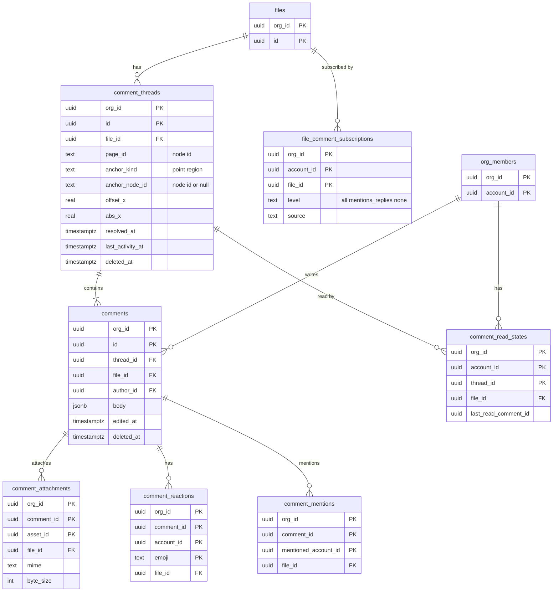
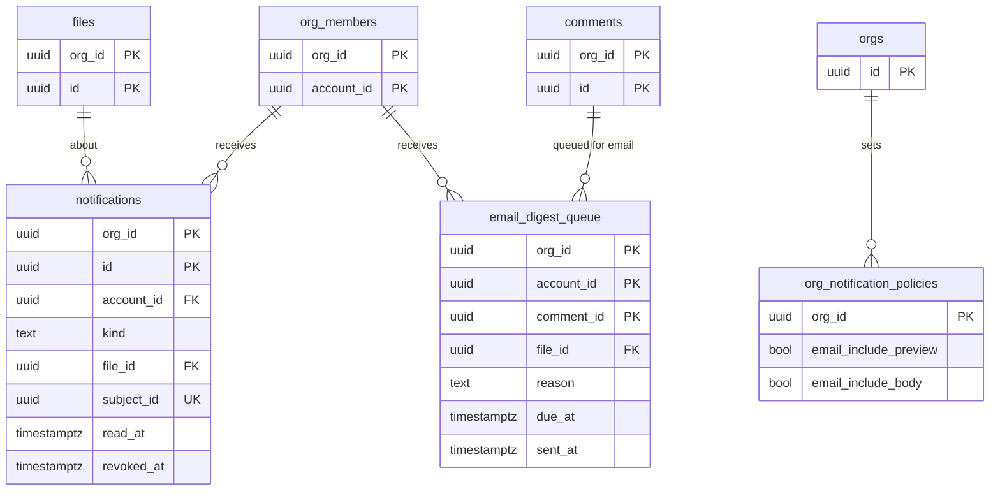

# Data model: コメントと通知

[data-model.md](../data-model.md) の一部。規約は、そちらの 2 節に従う。振る舞いは [comments-and-notifications.md](../comments-and-notifications.md)、[ADR-0027](../../decisions/0027-comments-anchored-to-nodes-in-metadata.md)、[ADR-0028](../../decisions/0028-realtime-metadata-subscriptions.md) を正とする。

すべて `app` スキーマのテナントの表（`org_id`、複合キー、FORCE RLS）。ゲストの行も、ファイルを持つ組織の `org_id` で持つ。無効化の outbox（`realtime.realtime_invalidations`）は [events-and-audit.md](events-and-audit.md) にある。

Realtime の購読の対象の表（AFTER のトリガーで無効化のキーを書く）：`comment_threads`・`comments`・`comment_reactions`・`comment_read_states`・`notifications`。問い合わせは 1 つの表への等価の条件だけなので、各表は購読の条件の列（`org_id`・`file_id`・`account_id`）を自分で持つ（非正規化。data-model.md の 9.1 節の D-15）。

## 1. ER 図

### 1.1 コメント

### 1.2 通知

`org_notification_policies` の定義は [organization.md](organization.md) にある。

## 2. コメント

### comment_threads

キャンバスの位置・領域に固定したスレッド。ノードの ID と相対の位置で固定する（ADR-0027）。

| 列 | 型 | NULL | 既定 | 説明 |
| --- | --- | --- | --- | --- |
| `org_id`・`id` | `uuid` | NO | | 主キー |
| `file_id` | `uuid` | NO | | |
| `page_id` | `text` | NO | | 作ったページの `NodeId`（`"{session_id}:{local_id}"`） |
| `anchor_kind` | `text` | NO | | `point`・`region` |
| `anchor_node_id` | `text` | YES | | 最上位のフレーム・コンポーネント・グループ（インスタンスの根を含む）。導出したノードには固定しない |
| `offset_x`・`offset_y` | `real` | YES | | 固定先のノードの座標系での位置 |
| `region_w`・`region_h` | `real` | YES | | `region` のときの大きさ |
| `abs_x`・`abs_y` | `real` | NO | | 作ったときのキャンバスの絶対座標 |
| `resolved_at`・`resolved_by` | `timestamptz`・`uuid` | YES | | 解決。誰でもできる |
| `created_by` | `uuid` | NO | | |
| `created_at` | `timestamptz` | NO | `now()` | |
| `last_activity_at` | `timestamptz` | NO | `now()` | 返信・解決で進める（一覧の並び） |
| `deleted_at` | `timestamptz` | YES | | 最初のコメントの削除でスレッドごと消した |

- 主キー：`(org_id, id)`。外部キー：`(org_id, file_id)` → `files`。
- CHECK：`anchor_kind IN ('point','region')`、`(anchor_kind = 'region') = (region_w IS NOT NULL AND region_h IS NOT NULL)`、`(anchor_node_id IS NULL) = (offset_x IS NULL)`、`page_id ~ '^[0-9]+:[0-9]+$'`。
- 索引：`(org_id, file_id, last_activity_at DESC) WHERE deleted_at IS NULL`（`fileComments(file_id)` の Q1、一覧の並べ替え）。
- 上限：1 ファイル 10,000（超えたら、解決済みの古いものから読み込みを遅らせる）。
- 削除：ファイルの完全な削除で行を消す。
- S1 の規模：約 1,000 万行（仮定）。

### comments

| 列 | 型 | NULL | 既定 | 説明 |
| --- | --- | --- | --- | --- |
| `org_id`・`id` | `uuid` | NO | | 主キー |
| `thread_id` | `uuid` | NO | | |
| `file_id` | `uuid` | NO | | 非正規化（Q2、通知） |
| `author_id` | `uuid` | NO | | 書いた人（`accounts.id`） |
| `body` | `jsonb` | NO | | リッチテキストの JSON（太字・斜体・取り消し線・リスト・URL・絵文字・メンション `{type: "mention", account_id}`）。10,000 文字まで。Zod で検証してから書く |
| `edited_at` | `timestamptz` | YES | | |
| `deleted_at` | `timestamptz` | YES | | 本人の削除。墓標にする |
| `created_at` | `timestamptz` | NO | `now()` | |

- 主キー：`(org_id, id)`。外部キー：`(org_id, thread_id)` → `comment_threads`、`(org_id, file_id)` → `files`。
- 索引：`(org_id, file_id, thread_id, id)`（Q2）、`(org_id, file_id, author_id)`（2 件目のコメントでの自動の購読の判定）、`(org_id, author_id, created_at DESC)`（1 人 1 時間 100 件の上限。組織をまたぐ合計は Valkey のレート制限で数える）。
- 削除：墓標。同じトランザクションで `deleted_at` を設定し、`body` を `{"v":1,"blocks":[]}` にし、`comment_attachments`・`comment_reactions`・`comment_mentions` の行を消し、消えたメンションの未読の通知に `revoked_at` を付ける。戻せない（本家と同じ）。墓標の行はファイルの完全な削除で消す。スレッドの最初のコメントの削除は、スレッドの `deleted_at` と全コメントの墓標を同じトランザクションで書く。
- 編集：本文を書き換え、`edited_at` を設定する。前の本文は持たない。
- S1 の規模：1 日約 10 万行、1 年で約 3,600 万行（仮定）。

### comment_attachments

画像の添付（1 コメント 5 つ、PNG・JPEG・GIF、1 つ 10 MB）。

| 列 | 型 | NULL | 既定 | 説明 |
| --- | --- | --- | --- | --- |
| `org_id`・`comment_id`・`asset_id` | `uuid` | NO | | 主キー |
| `file_id` | `uuid` | NO | | S3 のキーに使う |
| `mime` | `text` | NO | | `image/png`・`image/jpeg`・`image/gif` |
| `byte_size` | `integer` | NO | | 10 MB まで |
| `width`・`height` | `integer` | NO | | |
| `created_at` | `timestamptz` | NO | `now()` | |

- 主キー：`(org_id, comment_id, asset_id)`。外部キー：`(org_id, comment_id)` → `comments ON DELETE CASCADE`。
- CHECK：`mime IN (...)`、`byte_size BETWEEN 1 AND 10485760`。1 コメント 5 つまではサービス関数で検査する。
- S3：`comment-attachments/{org_id}/{file_id}/{asset_id}`（[stores.md](stores.md) の 3 節）。コメントを書く前に署名付き PUT で上げる。行のないオブジェクトは、1 日ごとの掃除で 24 時間後に消す。
- S1 の規模：約 200 万行（仮定）。

### comment_reactions

| 列 | 型 | NULL | 既定 | 説明 |
| --- | --- | --- | --- | --- |
| `org_id`・`comment_id`・`account_id` | `uuid` | NO | | |
| `emoji` | `text` | NO | | 絵文字の短縮名 |
| `file_id` | `uuid` | NO | | 非正規化（Q3） |
| `created_at` | `timestamptz` | NO | `now()` | |

- 主キー：`(org_id, comment_id, account_id, emoji)`。外部キー：`(org_id, comment_id)` → `comments ON DELETE CASCADE`。
- CHECK：`emoji ~ '^[a-z0-9_+-]{1,64}(::skin-tone-[2-6])?$'`。
- 索引：`(org_id, file_id)`（`fileComments` の Q3）。
- S1 の規模：約 500 万行。

### comment_mentions

人へのメンション。通知の受け手の決め方（[comments-and-notifications.md](../comments-and-notifications.md) の 4.2 節）に使う。

| 列 | 型 | NULL | 既定 | 説明 |
| --- | --- | --- | --- | --- |
| `org_id`・`comment_id`・`mentioned_account_id` | `uuid` | NO | | |
| `file_id` | `uuid` | NO | | 非正規化 |
| `created_at` | `timestamptz` | NO | `now()` | |

- 主キー：`(org_id, comment_id, mentioned_account_id)`。外部キー：`(org_id, comment_id)` → `comments ON DELETE CASCADE`。
- 索引：`(org_id, mentioned_account_id, created_at DESC)`（自分へのメンションの一覧）。
- 上限：1 コメント 50 人。編集で作り直し、増えた人にだけ通知する。
- S1 の規模：約 500 万行。

### comment_read_states

スレッドごとの既読。

| 列 | 型 | NULL | 既定 | 説明 |
| --- | --- | --- | --- | --- |
| `org_id`・`account_id`・`thread_id` | `uuid` | NO | | |
| `file_id` | `uuid` | NO | | 非正規化（Q4） |
| `last_read_comment_id` | `uuid` | NO | | 読んだ最後のコメント。UUIDv7 なので大小が時刻の順。後退させない（`GREATEST`） |
| `updated_at` | `timestamptz` | NO | `now()` | |

- 主キー：`(org_id, account_id, thread_id)`。外部キー：`(org_id, thread_id)` → `comment_threads ON DELETE CASCADE`。
- 索引：`(org_id, account_id, file_id)`（`fileComments` の Q4）。
- 「未読にする」は `last_read_comment_id` を 1 つ前のコメントに戻す操作として、`GREATEST` を使わない別のサービス関数で書く。
- S1 の規模：約 2,000 万行（仮定）。

### file_comment_subscriptions

ファイルごとのメールの通知の設定と、自動の購読。

| 列 | 型 | NULL | 既定 | 説明 |
| --- | --- | --- | --- | --- |
| `org_id`・`account_id`・`file_id` | `uuid` | NO | | |
| `level` | `text` | NO | | `all`・`mentions_replies`・`none` |
| `source` | `text` | NO | | `owner_default`・`auto_two_comments`・`explicit`。`explicit` は自動で上書きしない |
| `updated_at` | `timestamptz` | NO | `now()` | |

- 主キー：`(org_id, account_id, file_id)`。外部キー：`(org_id, file_id)` → `files ON DELETE CASCADE`。
- 索引：`(org_id, file_id) WHERE level = 'all'`（受け手の決め方の 5 行目）。
- 行がなければ `mentions_replies` とみなす。
- S1 の規模：約 500 万行。

## 3. 通知

### notifications

アプリ内の通知。ID だけを持ち、名前・本文を持たない。表示のたびに判定関数を通して読み直す。

| 列 | 型 | NULL | 既定 | 説明 |
| --- | --- | --- | --- | --- |
| `org_id`・`id` | `uuid` | NO | | 主キー |
| `account_id` | `uuid` | NO | | 受け手 |
| `kind` | `text` | NO | | `comment_mention`・`comment_reply`・`comment_on_file`・`invite`・`access_request`・`seat_request`・`library_update` |
| `file_id` | `uuid` | YES | | `seat_request` などファイルのないものは NULL |
| `subject_id` | `uuid` | NO | | コメント・招待・申請・ライブラリのバージョンなどの ID |
| `actor_account_id` | `uuid` | YES | | きっかけの人（コメントを書いた人、招待した人）。表示の名前は読み直す |
| `created_at` | `timestamptz` | NO | `now()` | |
| `read_at` | `timestamptz` | YES | | |
| `revoked_at` | `timestamptz` | YES | | 消えたメンション・取り消した招待 |

- 主キー：`(org_id, id)`。
- 一意：`UNIQUE (org_id, account_id, kind, subject_id)`（Worker の再試行で二重に作らない。`ON CONFLICT DO NOTHING`）。
- CHECK：`kind IN (...)`、`kind IN ('seat_request') OR file_id IS NOT NULL`。
- 索引：`(org_id, account_id, id DESC)`（`myNotifications(org_id)`）、`(org_id, account_id) WHERE read_at IS NULL AND revoked_at IS NULL`（未読の数）。組織をまたぐ未読の数は `count_unread_notifications(account_id)` の関数で出す。
- 保持：90 日。1 日ごとのジョブが `id` の範囲（UUIDv7 の時刻）で古い行を消す。パーティションにしない（一意の制約に分割キーを含められないため。data-model.md の 9.1 節の D-19）。
- S1 の規模：1 日約 30 万行、90 日で約 2,700 万行（仮定）。

### email_digest_queue

メールのまとめの待ち行列。受け手とファイルごとに、最初のコメントから 2 分まとめる（メンションは待たない）。

| 列 | 型 | NULL | 既定 | 説明 |
| --- | --- | --- | --- | --- |
| `org_id`・`account_id`・`comment_id` | `uuid` | NO | | 主キー |
| `file_id` | `uuid` | NO | | まとめの単位 |
| `reason` | `text` | NO | | `mention`・`reply`・`all` |
| `due_at` | `timestamptz` | NO | | 送る予定の時刻 |
| `sent_at` | `timestamptz` | YES | | 送った時刻 |
| `skipped_reason` | `text` | YES | | `read`（アプリで読んだ）・`forbidden`（送る直前の判定で読めない）・`suppressed`（バウンス） |
| `created_at` | `timestamptz` | NO | `now()` | |

- 主キー：`(org_id, account_id, comment_id)`（同じ受け手に同じコメントのメールは 1 回まで。PROP の「1 回だけ」）。
- CHECK：`reason IN (...)`、`sent_at IS NULL OR skipped_reason IS NULL`。
- 索引：`(due_at) WHERE sent_at IS NULL AND skipped_reason IS NULL`（1 分ごとのスケジューラー。`scheduler_due_items('email_digest', …)`）、`(org_id, account_id, file_id) WHERE sent_at IS NULL AND skipped_reason IS NULL`（まとめ）。
- 保持：送った・飛ばしたから 7 日で消す。
- S1 の規模：常に数十万行。
