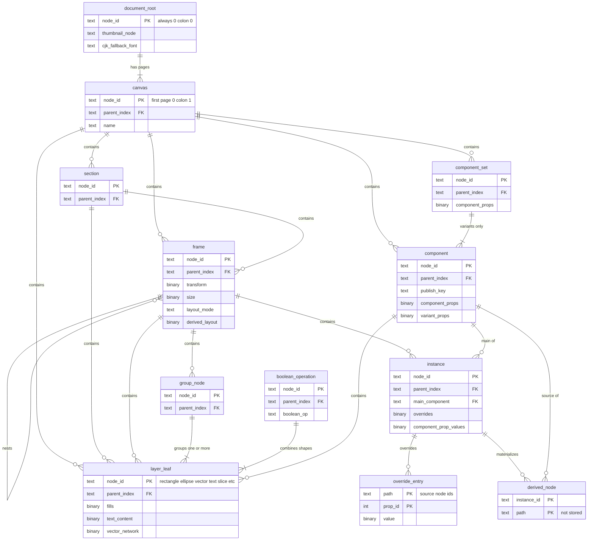

# Data model: ファイルの中身（ドキュメントのモデル）

[data-model.md](../data-model.md) の一部。ファイルの中身は表ではなく、ノードとプロパティの木で持つ。プロパティの表の正本は、開発リポジトリの `schema/properties.toml`（[ADR-0006](../../decisions/0006-node-types-and-property-table.md)）。この文書は、その表の要約（番号を含む）と、チェックポイント・ジャーナル・セッションの表の直列化の形をまとめる。振る舞い（検証、競合の解き方、導出）は [document-model.md](../document-model.md)、[multiplayer.md](../multiplayer.md)、[components-and-libraries.md](../components-and-libraries.md)、[layout.md](../layout.md) を正とする。

- 番号（`NodeType` の値、`prop_id`）は、一度振ったら変えない。消したものの番号は再利用しない。
- `schema/properties.toml` を書くときは、この文書の 3 節の番号と一致させる。食い違ったら、実装を止めて Dev（テックリード）に確かめる。

## 1. ノードのモデルの概念の図

ノードの種類ごとの親子の関係。実際の保存は「`NodeId` → プロパティの対応」の 1 つの表で、親は子のプロパティ `parent_index` で指す（[ADR-0002](../../decisions/0002-central-authoritative-multiplayer.md)）。図の実体はノードの種類で、表ではない。



- `layer_leaf` は子を持たない種類（`RECTANGLE`・`ELLIPSE`・`POLYGON`・`STAR`・`LINE`・`VECTOR`・`TEXT`・`SLICE`）をまとめたもの。`boolean_operation` と `group_node` は、レイヤーを持てる親（`FRAME` など）の子になる。
- `derived_node` と `override_entry` は保存しない概念（`derived_node`）と、`overrides` の Map の要素（`override_entry`）である。
- 親子の組み合わせの正は 2 節の表。

## 2. ノードの種類

`NodeType` は `u8`。値はこの文書で振った（data-model.md の 9.1 節の D-8）。

| 値 | 種類 | 親になれる種類 | 子になれる種類 | MVP | 持ち主 |
| --- | --- | --- | --- | --- | --- |
| 1 | `DOCUMENT` | なし（根） | `CANVAS` | ○ | document-model |
| 2 | `CANVAS` | `DOCUMENT` | レイヤー | ○ | document-model |
| 3 | `FRAME` | `CANVAS`・`FRAME`・`GROUP`・`SECTION`・`COMPONENT` | レイヤー | ○ | layout |
| 4 | `GROUP` | `FRAME` と同じ | レイヤー（1 つ以上） | ○ | editor-and-tools |
| 5 | `SECTION` | `CANVAS`・`SECTION` | レイヤー | ○ | editor-and-tools |
| 6〜10 | `RECTANGLE`・`ELLIPSE`・`POLYGON`・`STAR`・`LINE` | レイヤーを持てる種類 | なし | ○ | editor-and-tools |
| 11 | `VECTOR` | 同上 | なし | ○ | editor-and-tools |
| 12 | `TEXT` | 同上 | なし | ○ | editor-and-tools |
| 13 | `BOOLEAN_OPERATION` | 同上 | 図形・`VECTOR`・`BOOLEAN_OPERATION`（1 つ以上） | ○ | editor-and-tools |
| 14 | `COMPONENT` | `CANVAS`・`FRAME`・`SECTION`・`COMPONENT_SET` | レイヤー | ○ | components |
| 15 | `COMPONENT_SET` | `CANVAS`・`FRAME`・`SECTION` | `COMPONENT` だけ | ○ | components |
| 16 | `INSTANCE` | レイヤーを持てる種類 | なし（導出） | ○ | components |
| 17 | `SLICE` | レイヤーを持てる種類 | なし | ○ | export-and-assets |
| 32〜63 | 予約（`STICKY`・`CONNECTOR`・`SHAPE_WITH_TEXT` など） | — | — | MVP の後 | — |

- 0 は使わない（未設定を見分けるため）。
- 「レイヤー」は `DOCUMENT`・`CANVAS` 以外の種類。「レイヤーを持てる種類」は `CANVAS`・`FRAME`・`GROUP`・`SECTION`・`COMPONENT`。
- 種類は作った後に変えない（[document-model.md](../document-model.md) の 3 節）。

## 3. プロパティの表（要約）

列の意味は [document-model.md](../document-model.md) の 4.1 節。`kind` は競合の単位（`scalar` は値全体、`map` は要素の鍵ごと）。「種類」はプロパティを持てるノードの種類。

| id | name | type | kind | 種類 | 持ち主 | 備考 |
| --- | --- | --- | --- | --- | --- | --- |
| 1 | `parent_index` | `ParentIndex { parent: NodeId, key: OrderKey }` | scalar | `DOCUMENT` 以外 | document-model | 親と位置を 1 つの単位にする |
| 2 | `name` | `String`（1〜512 バイト） | scalar | すべて | document-model | |
| 3 | `visible` | `bool` | scalar | レイヤー | document-model | |
| 4 | `locked` | `bool` | scalar | レイヤー | document-model | |
| 5 | `transform` | `Affine2x3`（f32×6） | scalar | レイヤー | document-model | 移動と回転は同じ単位 |
| 6 | `size` | `Vec2`（f32×2） | scalar | レイヤー | document-model | |
| 7 | `opacity` | `f32`（0〜1） | scalar | レイヤー | document-model | |
| 8 | `blend_mode` | `BlendMode`（u8。18 種） | scalar | レイヤー | document-model | |
| 9 | `fills` | `Vec<Paint>`（最大 32） | scalar | 図形・フレーム・テキスト | document-model | 配列全体が 1 つの単位 |
| 10 | `strokes` | `Vec<Paint>`（最大 32） | scalar | 同上 | document-model | |
| 11 | `stroke_weight` | `f32` | scalar | 同上 | document-model | |
| 12 | `stroke_align` | `StrokeAlign`（u8） | scalar | 同上 | document-model | |
| 13 | `corner_radius` | `CornerRadii`（f32×4） | scalar | 矩形・フレーム・コンポーネント | document-model | 四隅は同じ単位 |
| 14 | `effects` | `Vec<Effect>`（最大 16） | scalar | レイヤー | document-model | 影・ぼかし（半径 0〜1,000） |
| 15 | `is_mask` | `bool` | scalar | レイヤー | document-model | |
| 16 | `clips_content` | `bool` | scalar | フレーム・コンポーネント | document-model | |
| 17 | `constraints` | `Constraints { h: u8, v: u8 }` | scalar | レイヤー | layout | |
| 18 | `layout_mode` | `LayoutMode`（u8） | scalar | フレーム・コンポーネント | layout | `none`・`horizontal`・`vertical` |
| 19 | `layout_wrap` | `LayoutWrap`（u8） | scalar | 同上 | layout | |
| 20 | `item_spacing` | `f32` | scalar | 同上 | layout | |
| 21 | `counter_axis_spacing` | `f32` | scalar | 同上 | layout | |
| 22〜25 | `padding_top`・`padding_right`・`padding_bottom`・`padding_left` | `f32` | scalar | 同上 | layout | 四辺を別の単位にする |
| 26 | `primary_axis_align` | u8 | scalar | 同上 | layout | |
| 27 | `counter_axis_align` | u8 | scalar | 同上 | layout | |
| 28 | `counter_axis_align_content` | u8 | scalar | 同上 | layout | |
| 29 | `primary_sizing` | u8 | scalar | 同上 | layout | |
| 30 | `counter_sizing` | u8 | scalar | 同上 | layout | |
| 31 | `strokes_included_in_layout` | `bool`（既定 true） | scalar | 同上 | layout | |
| 32 | `item_reverse_z_index` | `bool` | scalar | 同上 | layout | |
| 33 | `layout_positioning` | u8 | scalar | オートレイアウトの子 | layout | |
| 34 | `layout_grow` | u8（0・1） | scalar | 同上 | layout | |
| 35 | `layout_align` | u8 | scalar | 同上 | layout | |
| 36〜39 | `min_width`・`max_width`・`min_height`・`max_height` | `Option<f32>` | scalar | レイヤー | layout | それぞれ別の単位 |
| 40 | `vector_network` | `VectorNetwork`（最大 1 MiB） | scalar | `VECTOR` | editor-and-tools | 領域ごとの `fills` を含む |
| 41 | `polygon_count` | u32 | scalar | `POLYGON`・`STAR` | document-model | |
| 42 | `boolean_op` | `BoolOp`（u8） | scalar | `BOOLEAN_OPERATION` | document-model | |
| 43 | `stroke_cap` | `StrokeCap`（u8） | scalar | 図形・フレーム・テキスト | document-model | data-model.md の 9.1 節の D-7 で番号を分けた |
| 44 | `stroke_join` | `StrokeJoin`（u8） | scalar | 同上 | document-model | 同上 |
| 45 | `dash_pattern` | `Vec<f32>`（最大 16） | scalar | 同上 | document-model | 同上 |
| 46 | `star_inner_radius` | `f32`（0〜1） | scalar | `STAR` | document-model | 同上 |
| 50 | `text_content` | `TextContent { chars, runs }`（最大 64 KiB） | scalar | `TEXT` | document-model | 文字と書式の範囲を 1 つの単位にする |
| 51 | `font_family` | `String` | scalar | `TEXT` | document-model | 範囲の書式がないときの既定 |
| 52 | `font_style` | `String` | scalar | `TEXT` | document-model | |
| 53 | `font_size` | `f32` | scalar | `TEXT` | document-model | |
| 54 | `line_height` | `LineHeight` | scalar | `TEXT` | document-model | |
| 55 | `letter_spacing` | `LetterSpacing` | scalar | `TEXT` | document-model | |
| 56 | `text_align_h` | u8 | scalar | `TEXT` | document-model | |
| 57 | `text_align_v` | u8 | scalar | `TEXT` | document-model | |
| 58 | `text_auto_resize` | u8 | scalar | `TEXT` | document-model | |
| 60 | `component_props` | `Map<PropKey, ComponentPropDef>` | map | `COMPONENT`・`COMPONENT_SET` | components | |
| 61 | `main_component` | `NodeId` | scalar | `INSTANCE` | components | |
| 62 | `overrides` | `Map<OverrideKey, Value>` | map | `INSTANCE` | components | 1 インスタンス 5,000 項目まで |
| 63 | `variant_props` | `Map<PropKey, String>` | map | `COMPONENT` | components | |
| 64 | `component_prop_values` | `Map<PropKey, Value>` | map | `INSTANCE` | components | |
| 65 | `component_prop_refs` | `Map<PropRefTarget, PropKey>` | map | コンポーネントの中のレイヤー | components | |
| 66 | `publish_key` | `String`（128 ビットの乱数） | scalar | `COMPONENT` | components | |
| 67 | `publish_hidden` | `bool` | scalar | `COMPONENT` | components | |
| 68 | `removed_at` | 時刻（UNIX ミリ秒、u64） | scalar | `COMPONENT` | components | |
| 69 | `library_source` | `LibrarySource { library_id, asset_key, version }` | scalar | `COMPONENT`・`COMPONENT_SET` | components | 予約（E13）。取り込んだ写しの出どころ（[components-and-libraries.md](../components-and-libraries.md) の 7.2 節） |
| 70 | `export_settings` | `Vec<ExportSetting>`（最大 16） | scalar | レイヤー | export-and-assets | |
| 80 | `derived_layout` | `DerivedLayout { transform, size }` | scalar | レイヤー | layout | `derived`。Undo に入れない |
| 90 | `plugin_data` | `Map<(PluginId, Key), Bytes>` | map | すべて | plugins | 予約（E14）。鍵 100 バイト、値 100 KiB、1 ノード 1 プラグイン 1 MiB |
| 91 | `thumbnail_node` | `Option<NodeId>` | scalar | `DOCUMENT` | export-and-assets | |
| 92 | `cjk_fallback_font` | `FontRef { family, style }` | scalar | `DOCUMENT` | rendering-engine | 同梱のフォントだけ |

- 空いている番号（47〜49、59、71〜79、81〜89、93〜）は、同じ持ち主の領域の近くの番号から使う。
- 範囲で書いた番号（22〜25、36〜39）は、表に書いた名前の順に 1 つずつ振る。
- 表の列 `default`・`validate`・`derived`・`since`・`public_api`・`api_name`・`api_since`・`public_plugin` は `schema/properties.toml` にだけ持つ。

### 3.1 値の型

| 型 | 符号化 | 備考 |
| --- | --- | --- |
| `bool`・`u8`〜`u32`・`i32` | LEB128（`bool` は 1 バイト） | |
| `f32` | リトルエンディアン 4 バイト | NaN・無限を拒否。`-0.0` は `0.0` に。`f64` は使わない |
| `String` | 長さ（LEB128）＋ UTF-8 | NFC に正規化しない。上限はバイトで数える |
| `Bytes` | 長さ＋バイト列 | |
| `NodeId` | `session_id`・`local_id` の 2 つの LEB128 | 文字列では `"{session_id}:{local_id}"` |
| `OrderKey` | 長さ＋ ASCII | base-62、64 バイト以下（[ADR-0010](../../decisions/0010-ordering-keys-and-cycle-rejection.md)） |
| 固定長の構造（`Vec2`・`Affine2x3`・`CornerRadii`） | f32 の並び | |
| `Vec<T>` | 要素の数＋要素 | |
| `Map<K, V>` | 要素の数＋（鍵、値）を鍵の昇順 | |
| 列挙 | u8 | |
| `Paint` | タグ（単色・線形・放射・角度・ダイヤモンド・画像）＋中身 | 画像は `image_hash: [u8; 32]`（SHA-256） |

### 3.2 ID と鍵

| 名前 | 形 | 範囲 | 決めた場所 |
| --- | --- | --- | --- |
| `NodeId` | `(session_id: u32, local_id: u32)` | ファイルの中で一意。`0:0` は `DOCUMENT`、`0:1` は最初の `CANVAS`、`session_id = 0` はサーバーの操作 | [ADR-0007](../../decisions/0007-node-ids-and-tree-invariants.md) |
| `session_id` | u32 | ファイルごとにサーバーが `next_session_id` から振る。ジャーナルに `session_open` を書いてから渡す。二度振らない | ADR-0007 |
| `OrderKey` | base-62 の可変長の文字列 | 同じ親の子で一意。48 バイトを超えたらその親の子を振り直す | ADR-0010 |
| `PropKey` | `NodeId` と同じ形 | コンポーネントのプロパティの定義の ID。クライアントが振る | [ADR-0022](../../decisions/0022-component-properties-and-variants-by-id.md) |
| `OverrideKey` | `(path: [NodeId], prop_id)` | `path` はメインの中の元のノードの ID の列 | [ADR-0021](../../decisions/0021-derived-instances-and-override-keys.md) |
| `InstanceSubId` | `(instance_id, path)` | 導出したノードの ID。保存しない | ADR-0021 |
| `publish_key` | 128 ビットの乱数の文字列 | ライブラリの資産の鍵（`library_assets.asset_key`） | [ADR-0023](../../decisions/0023-library-snapshots-imported-into-files.md) |

## 4. 木の不変条件

どの確定した状態（サーバーの `seq` の各点）でも成り立つ（[document-model.md](../document-model.md) の 5 節。検証器は `doc-model` の中にだけ書く）。

| # | 不変条件 |
| --- | --- |
| T1 | 根は `DOCUMENT` がちょうど 1 つで、ID は `0:0`。`parent_index` を持たない |
| T2 | 根以外のノードは、生きている親をちょうど 1 つ持つ |
| T3 | 親をたどると、必ず根に着く（循環がない） |
| T4 | 親と子の種類の組み合わせが 2 節の表に合う |
| T5 | 同じ親の子の `OrderKey` は一意で、形式が正しく、64 バイト以下 |
| T6 | 深さは 256 以下 |
| T7 | `CANVAS` は 1 つ以上ある |
| T8 | `GROUP`・`BOOLEAN_OPERATION` は子を 1 つ以上持つ |
| T9 | `INSTANCE` の `main_component` が、自分を含むコンポーネントを指さない |

## 5. 直列化の形

1 つの形式を、通信・ジャーナル・チェックポイントで使う（[ADR-0008](../../decisions/0008-canonical-binary-serialization.md)）。ノードのプロパティは `(prop_id: varint, len: varint, value)` のタグ付きで並べ、知らない `prop_id` は読み飛ばして保つ。正準形は、ノードは ID の昇順、プロパティは `prop_id` の昇順、既定値は書かない、`map` は鍵の昇順。

### 5.1 チェックポイント

```
Manifest（S3 files/{file_id}/checkpoints/[g{g}/]{seq:020}。圧縮しない）
  magic "<brand>DOC", format_version: u16, schema_hash: [u8; 16]
  file_id: uuid, seq: u64, created_at: u64（UNIX ミリ秒）
  features: [FlagId]                 // その seq の時点の文書のフラグ（ADR-0055）
  next_session_id: u32
  sessions_chunk: ChunkRef           // 5.2 節
  document_chunk: ChunkRef           // DOCUMENT と全 CANVAS のノード
  pages: [ { page_id: NodeId, chunks: [ChunkRef], node_count: u32, raw_bytes: u64 } ]
  blob_refs_chunk: ChunkRef          // 5.4 節

ChunkRef { sha256: [u8; 32], compressed_bytes: u32, raw_bytes: u32 }

PageChunk（zstd レベル 3。4 MiB を超えたら ID の順に分ける）
  nodes: [ { id: NodeId, node_type: u8, props: [(prop_id, len, value)] } ]   // ID の昇順
```

### 5.2 セッションの表（`sessions_chunk`）

[multiplayer.md](../multiplayer.md) の 4.4 節。チェックポイントに含め、ジャーナルから戻せる。

| 項目 | 型 | 説明 |
| --- | --- | --- |
| `session_id` | u32 | |
| `user_id` | uuid | `global.accounts.id`。匿名の閲覧者は書き込めないので現れない |
| `last_client_seq` | u32 | 確定した最後の `client_seq`（再送の重複を除く） |
| `opened_seq` | u64 | `session_open` を書いた `seq` |
| `last_active_at` | u64 | UNIX ミリ秒 |

- `verified_level`（再開のトークンの上限）はメモリにだけ持ち、書かない。
- 30 日使われていないセッションは、チェックポイントの表から外す。`next_session_id` は戻さない。

### 5.3 ジャーナルの本体（`JournalBatch`）

```
JournalBatch {                       // zstd で圧縮して journal.body か journal-blobs に置く
  entries: [ {
    seq: u64, session_id: u32, client_seq: u32, committed_at_ms: u64,
    origin: Origin,                  // 5.5 節
    ops: [Op],                       // まとめの後（file-storage-and-history.md の 4.3 節）
    server_ops: [Op],                // サーバーが書き換えた値・足した操作
  } ],
  session_opens: [ { session_id: u32, user_id: uuid, seq: u64 } ],
}
```

- 利用者の ID は `session_opens` にだけ書く。各変更には `session_id` だけを書く。
- 復元の差分は `session_id = 0` の 1 つの変更にする（[file-storage-and-history.md](../file-storage-and-history.md) の 9 節）。実行した利用者の ID をどの項目に持つかは、data-model.md の 10 節の残した問い。

### 5.4 画像・フォントの参照（`blob_refs_chunk`）

```
BlobRefs {
  images: [ [u8; 32] ],              // 参照する画像の SHA-256。昇順・重複なし
  fonts:  [ { family: String, style: String } ],   // 参照するフォントの名前。昇順
}
```

- 複製（`assets.copy_refs`）・画像の mark-and-sweep・書き出しのフォントの収集に使う（[export-and-assets.md](../export-and-assets.md) の 6.5 節）。

### 5.5 変更の操作

```
Op =
  | Create { id: NodeId, node_type: u8, props: [(prop_id, Value)] }   // parent_index を必ず含む
  | Set    { id: NodeId, prop: u16, value: Value }
  | MapSet { id: NodeId, prop: u16, key: MapKey, value: Option<Value> }
  | Delete { id: NodeId }                                            // 子孫もまとめて消す。墓標を持たない

ChangeSet { ops: [Op], origin: Origin }      // 原子的に当たる。直列化で 4 MiB 以下
Origin = User | Plugin { plugin_id: uuid, version_id: uuid } | LayoutRepair | Server
```

### 5.6 送受信で運ぶ形

`LoadPlan`（チャンクの署名付き URL と `tail`）とメッセージの形は、保存しないので [multiplayer.md](../multiplayer.md) の 4.2 節と [file-storage-and-history.md](../file-storage-and-history.md) の 6.1 節を正とする。

## 6. 大きさの上限

| 項目 | 上限 |
| --- | --- |
| 1 ファイルのノード | 100 万（30 万で警告） |
| 1 ページのノード | 30 万 |
| 1 ファイルのページ | 1,000 |
| 深さ | 256 |
| 1 ノードの子 | 10 万 |
| 導出したノード（1 ファイル） | 50 万。入れ子の深さ 16 |
| チェックポイント全体（圧縮の前） | 2 GiB |

正は [document-model.md](../document-model.md) の 11 節と [components-and-libraries.md](../components-and-libraries.md) の 3.3 節。
