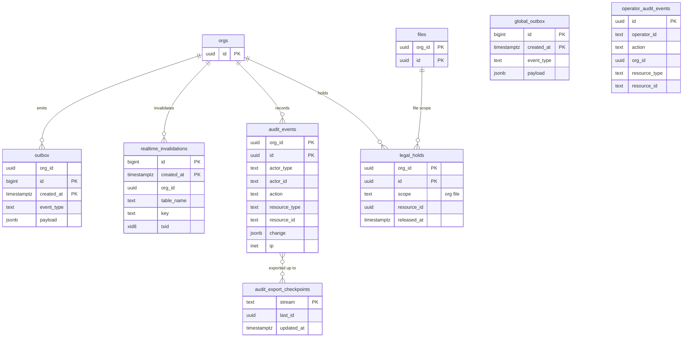

# Data model: 出来事・無効化・監査

[data-model.md](../data-model.md) の一部。規約は、そちらの 2 節に従う。振る舞いは [comments-and-notifications.md](../comments-and-notifications.md) の 5 節、[security.md](../security.md) の 6・7 節、[ADR-0028](../../decisions/0028-realtime-metadata-subscriptions.md)、[ADR-0031](../../decisions/0031-org-acl-version-and-connection-revalidation.md)、[ADR-0045](../../decisions/0045-audit-log-and-data-lifecycle.md) を正とする。

| 表 | スキーマ | テナント | 読み書きする主体 |
| --- | --- | --- | --- |
| `outbox` | `app` | 内（`relay` は全行） | `app` が書く、`relay` が読んで消す |
| `global_outbox` | `global` | 外 | `auth`・`app`（関数）が書く、`relay` が読んで消す |
| `realtime_invalidations` | `realtime` | RLS の例外 | トリガーの関数が書く、`realtime_invalidator` が読む |
| `audit_events` | `app` | 内（追記だけ。`audit_exporter` は全行） | `app` が書く |
| `operator_audit_events` | `global` | 外（追記だけ） | 運用者の画面が書く |
| `audit_export_checkpoints` | `global` | 外 | `audit_exporter` |
| `legal_holds` | `app` | 内 | 運用者の画面（組織の文脈で） |

## 1. ER 図



## 2. outbox と中継

README の「transactional outbox → SQS」（[architecture/README.md](../README.md) の 5 節）の表。業務の変更と同じトランザクションで積み、中継（Relay。Worker のサービスの中の常駐のループ）が読んで配る（data-model.md の 9.1 節の D-10）。

```
業務のトランザクション ── INSERT outbox ──▶ COMMIT
Relay（relay ロール）：SELECT … ORDER BY id LIMIT 500 FOR UPDATE SKIP LOCKED
  ├─ 制御の出来事 → Valkey の pub/sub（ctl:org:{org_id}・ctl:acct:{account_id}・ctl:global）→ Gateway・Realtime
  ├─ 仕事の出来事 → SQS（notify・search-index・webhook-delivery など）→ Worker
  └─ 送れたら DELETE
```

- 配送は少なくとも 1 回。受け手は `(event_type, payload の ID)` で重複を除く。
- 出来事の種類と中身、どこへ送るかは [stores.md](stores.md) の 5 節。

### outbox

| 列 | 型 | NULL | 既定 | 説明 |
| --- | --- | --- | --- | --- |
| `org_id` | `uuid` | NO | | |
| `id` | `bigint` | NO | identity | 中継が `ORDER BY id` で読む |
| `event_type` | `text` | NO | | 例：`acl.changed`・`comment.created`・`file.checkpointed` |
| `payload` | `jsonb` | NO | | ID と数だけ。名前・本文を入れない |
| `created_at` | `timestamptz` | NO | `now()` | |
| `attempts` | `integer` | NO | `0` | 送れなかった回数 |

- 主キー：`(created_at, id)`（分割キーを含める）。
- 分割：`RANGE (created_at)`、1 日。空になった日のパーティションを落とす。
- RLS：`app` は自分の組織の行の INSERT だけ（SELECT・DELETE を与えない）。`relay` は全行の SELECT・DELETE と `attempts` の UPDATE（`TO relay USING (true)` のポリシー）。
- 索引：`(id)`（中継の読み取り）。
- `attempts` が 10 を超えた行は、`outbox_dead` の代わりにアラームを出して残す（手で流し直す）。
- S1 の規模：1 日約 300 万行。滞留は通常 1 秒未満。

### global_outbox

組織に属さない出来事（`session.revoked`、`plugin.blocklisted`、`account.anonymized`）。形は `outbox` から `org_id` を除いたもの。

| 列 | 型 | NULL | 既定 | 説明 |
| --- | --- | --- | --- | --- |
| `id` | `bigint` | NO | identity | |
| `event_type` | `text` | NO | | |
| `payload` | `jsonb` | NO | | |
| `created_at` | `timestamptz` | NO | `now()` | |
| `attempts` | `integer` | NO | `0` | |

- 主キー：`(created_at, id)`。分割：`RANGE (created_at)`、1 日。
- S1 の規模：1 日数万行。

## 3. realtime_invalidations

Realtime の無効化の outbox（ADR-0028）。購読の対象の表の AFTER INSERT・UPDATE・DELETE のトリガーが、同じトランザクションで無効化のキーを書く。中身は ID のキーだけで、テナントのデータを持たない。RLS の例外（data-model.md の 2.3 節）。

| 列 | 型 | NULL | 既定 | 説明 |
| --- | --- | --- | --- | --- |
| `id` | `bigint` | NO | identity | invalidator が `ORDER BY id` で読む |
| `created_at` | `timestamptz` | NO | `now()` | |
| `org_id` | `uuid` | NO | | |
| `table_name` | `text` | NO | | 変わった表（例 `comments`） |
| `key` | `text` | NO | | 等価の条件の列の値から作る無効化のキー（例 `comments:{org_id}:file_id={file_id}`）。1 行の変更から、購読の条件の列ごとに 1 行 |
| `txid` | `xid8` | NO | `pg_current_xact_id()` | 読み取りと無効化の行き違いを見分ける |

- 主キー：`(created_at, id)`。分割：`RANGE (created_at)`、1 時間。
- 保持：invalidator は 1 分より古い行を読まない。2 時間を過ぎたパーティションを落とす（行の削除で表が膨らまないようにする。data-model.md の 9.1 節の D-9）。
- 権限：トリガーの関数（`SECURITY DEFINER`、所有者は `realtime_owner`）が INSERT する。`realtime_invalidator` ロールが SELECT する。`app` ロールには権限を与えない。
- UPDATE で条件の列が変わったら、古い値と新しい値の両方のキーを書く（行が購読から外れたことも伝える）。
- 索引：`(id)`。
- S1 の規模：購読の対象の表への書き込みの数と同じ（ピーク毎秒数百行）。

## 4. 監査

### audit_events

組織の監査ログ（ADR-0045）。操作と同じトランザクションで書く。**名前・本文を書かない。**

| 列 | 型 | NULL | 既定 | 説明 |
| --- | --- | --- | --- | --- |
| `org_id`・`id` | `uuid` | NO | | 主キー。`id` は UUIDv7（時刻の順） |
| `occurred_at` | `timestamptz` | NO | `now()` | |
| `actor_type` | `text` | NO | | `account`・`operator`・`api_token`・`plugin`・`system` |
| `actor_id` | `text` | NO | | アカウントの ID、運用者の ID、トークンの ID、プラグインの ID |
| `on_behalf_of` | `uuid` | YES | | トークン・プラグインのときの利用者（`accounts.id`） |
| `action` | `text` | NO | | 例：`file.trash`・`share.role_changed`・`member.seat_changed`・`file.opened`（[security.md](../security.md) の 6 節の表） |
| `resource_type` | `text` | NO | | `org`・`team`・`project`・`file`・`member`・`font`・`image`・`plugin`・`oauth_app`・`api_token`・`webhook` |
| `resource_id` | `text` | NO | | 内部の ID（画像はハッシュの 16 進を書かず、`images` の行の鍵を書かない。`resource_type = image` は取り下げの記録の ID） |
| `change` | `jsonb` | NO | `'{}'` | 変更前後の水準・範囲だけ（例 `{"level": ["view","edit"]}`） |
| `ip` | `inet` | YES | | |
| `user_agent_class` | `text` | YES | | `browser`・`api`・`worker` などの種類だけ |
| `request_id` | `text` | YES | | |

- 主キー：`(org_id, id)`。
- 分割：`RANGE (id)`、1 か月（UUIDv7 の時刻の範囲）。1 年を過ぎたパーティションを落とす。
- 追記だけ：`app` には INSERT だけを与える。UPDATE・DELETE をトリガーでも拒否する。
- 索引：`(org_id, id DESC)`（組織の管理者の画面と CSV）、`(org_id, resource_type, resource_id, id DESC)`（資源ごとの履歴）。
- アーカイブ：この表自身を outbox として読む（data-model.md の 9.1 節の D-11）。`audit_exporter` が `id` の順に読み、log-archive の S3（Object Lock）へ送り、位置を `audit_export_checkpoints` に書く。
- 間引き：`file.opened` は利用者・ファイルごとに 1 時間に 1 回（Valkey の印で間引く）。
- S1 の規模：1 日約 50 万行、1 年で約 1.8 億行（仮定）。

### operator_audit_events

運用者（Ops・サポート）の操作。組織の監査ログとは別に書く（ADR-0045）。

| 列 | 型 | NULL | 既定 | 説明 |
| --- | --- | --- | --- | --- |
| `id` | `uuid` | NO | `uuidv7()` | |
| `occurred_at` | `timestamptz` | NO | `now()` | |
| `operator_id` | `text` | NO | | IAM Identity Center の利用者 |
| `action` | `text` | NO | | 例：`version.restore`・`file.duplicate`・`takedown`・`break_glass`・`plugin.blocklist`・`file.maintenance` |
| `org_id` | `uuid` | YES | | 対象の組織 |
| `resource_type`・`resource_id` | `text` | YES | | |
| `ticket_ref` | `text` | YES | | 依頼・インシデントの番号 |
| `reason_code` | `text` | NO | | 理由の分類 |
| `ip` | `inet` | YES | | |

- 主キー：`(id)`。分割：`RANGE (id)`、1 か月。
- 追記だけ。同じ操作の組織側の記録も `audit_events`（`actor_type = operator`）に書く。
- 索引：`(org_id, id DESC)`、`(operator_id, id DESC)`。
- 保持：Aurora に 1 年、アーカイブ 7 年（既定案。法務の確認待ち、L4）。
- S1 の規模：1 日数百行。

### audit_export_checkpoints

監査のアーカイブの送り出しの位置。

| 列 | 型 | NULL | 既定 | 説明 |
| --- | --- | --- | --- | --- |
| `stream` | `text` | NO | | `audit_events`・`operator_audit_events` |
| `last_id` | `uuid` | NO | | 送った最後の `id` |
| `last_batch_sha256` | `bytea` | YES | | 前のバッチのハッシュ（アーカイブの鎖） |
| `updated_at` | `timestamptz` | NO | `now()` | |

- 主キー：`(stream)`。S1 の規模：2 行。
- 同じ時刻の未確定のトランザクションを飛ばさないよう、`occurred_at` が 1 分より古い行までだけを送る。

### legal_holds

リーガルホールド。印のある組織・ファイルは、掃除と削除のジョブが飛ばす（[security.md](../security.md) の 7 節）。使う条件は法務の確認待ち。

| 列 | 型 | NULL | 既定 | 説明 |
| --- | --- | --- | --- | --- |
| `org_id`・`id` | `uuid` | NO | | 主キー |
| `scope` | `text` | NO | | `org`・`file` |
| `resource_id` | `uuid` | NO | | `org` なら `org_id`、`file` なら `file_id` |
| `reason` | `text` | NO | | 内部の分類と依頼の番号。ファイルの中身を書かない |
| `created_by` | `text` | NO | | 運用者の ID |
| `created_at` | `timestamptz` | NO | `now()` | |
| `released_at`・`released_by` | `timestamptz`・`text` | YES | | |

- 主キー：`(org_id, id)`。
- CHECK：`scope IN ('org','file')`、`scope <> 'org' OR resource_id = org_id`。
- 索引：`(org_id, scope, resource_id) WHERE released_at IS NULL`（削除・掃除のジョブが最初に確かめる）。
- S1 の規模：数十行。
