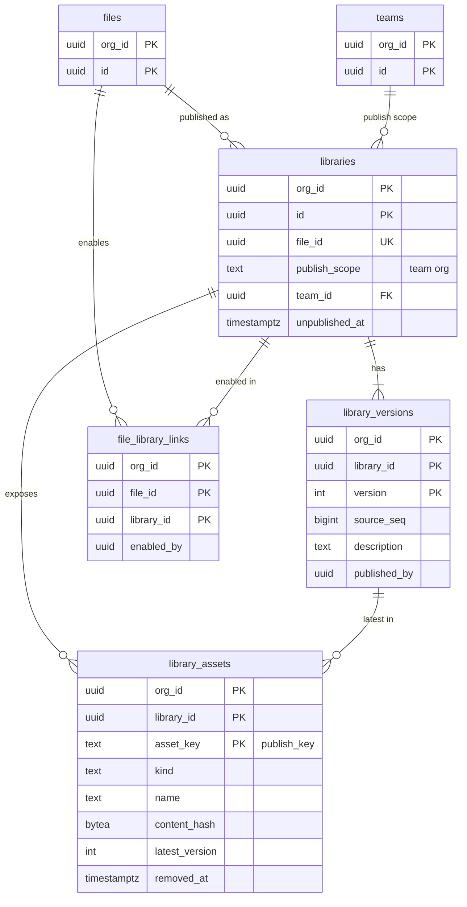

# Data model: ライブラリとプラグイン（MVP の後）

[data-model.md](../data-model.md) の一部。規約は、そちらの 2 節に従う。振る舞いは [components-and-libraries.md](../components-and-libraries.md) の 7 節（E13）、[plugins.md](../plugins.md)（E14）、[ADR-0023](../../decisions/0023-library-snapshots-imported-into-files.md)、[ADR-0037](../../decisions/0037-plugin-sandbox-quickjs-wasm.md)〜[ADR-0039](../../decisions/0039-plugin-distribution-and-review.md) を正とする。

どちらも MVP の後に作る。表の形は目標の形で、Epic の `spec.md` で確かめてから作る。

| 表 | スキーマ | テナント |
| --- | --- | --- |
| `libraries`・`library_versions`・`library_assets`・`file_library_links` | `app` | 内（FORCE RLS） |
| `plugins`・`plugin_versions`・`plugin_reviews`・`plugin_blocklist` | `global` | 外。組織の中のプラグインも `org_id` の列で持つ |
| `org_plugin_policies`・`org_plugin_allowlist` | `app` | 内（FORCE RLS） |

## 1. ER 図

### 1.1 ライブラリ（E13）

### 1.2 プラグイン（E14）

```mermaid
erDiagram
    plugins ||--|{ plugin_versions : "has"
    plugin_versions ||--o{ plugin_reviews : "reviewed by"
    plugins ||--o{ plugin_blocklist : "blocked"
    plugin_versions ||--o{ plugin_blocklist : "version blocked"
    orgs ||--o{ org_plugin_policies : "sets"
    orgs ||--o{ org_plugin_allowlist : "allows"
    plugins ||--o{ org_plugin_allowlist : "allowed in"

    plugins {
        uuid id PK
        text owner_kind "user org"
        uuid owner_id
        uuid org_id
        text visibility
        text name
        text status
    }
    plugin_versions {
        uuid id PK
        uuid plugin_id FK
        text api_version
        jsonb manifest
        bytea bundle_sha256
        bytea ui_sha256
        text review_status
    }
    plugin_reviews {
        uuid id PK
        uuid plugin_version_id FK
        text kind
        text result
        jsonb findings
    }
    plugin_blocklist {
        uuid id PK
        uuid plugin_id FK
        uuid version_id FK
        text reason
        timestamptz lifted_at
    }
    org_plugin_policies {
        uuid org_id PK
        bool plugins_enabled
        text public_mode
        bool allow_wildcard_network
    }
    org_plugin_allowlist {
        uuid org_id PK
        uuid plugin_id PK
        uuid pinned_version_id
    }
    orgs {
        uuid id PK
    }
```

## 2. ライブラリ

ライブラリは公開の時点の不変のスナップショットで配り、使う側のファイルに写しを取り込む（ADR-0023）。写しの出どころはプロパティ 69 `library_source`（[document.md](document.md) の 3 節）。ライブラリは組織をまたがない（ゲストは組織のライブラリを使えない）。

### libraries

| 列 | 型 | NULL | 既定 | 説明 |
| --- | --- | --- | --- | --- |
| `org_id`・`id` | `uuid` | NO | | 主キー |
| `file_id` | `uuid` | NO | | ライブラリのファイル |
| `publish_scope` | `text` | NO | | `team`・`org`（組織のプラン） |
| `team_id` | `uuid` | YES | | `team` のとき |
| `created_by` | `uuid` | NO | | |
| `created_at`・`updated_at` | `timestamptz` | NO | `now()` | |
| `unpublished_at` | `timestamptz` | YES | | 公開をやめた |

- 主キー：`(org_id, id)`。一意：`UNIQUE (org_id, file_id)`。
- 外部キー：`(org_id, file_id)` → `files`、`(org_id, team_id)` → `teams`。
- CHECK：`(publish_scope = 'team') = (team_id IS NOT NULL)`。
- 索引：`(org_id, publish_scope, team_id) WHERE unpublished_at IS NULL`（使えるライブラリの一覧）。
- 公開先の変更は `acl_version` を上げる（`library.use` の判定に効く）。
- S1 の規模：数万行（仮定）。

### library_versions

| 列 | 型 | NULL | 既定 | 説明 |
| --- | --- | --- | --- | --- |
| `org_id`・`library_id` | `uuid` | NO | | |
| `version` | `integer` | NO | | 1 から増える |
| `source_seq` | `bigint` | NO | | 公開した時点のライブラリのファイルの `seq` |
| `description` | `text` | YES | | 2,000 文字まで |
| `published_by` | `uuid` | NO | | |
| `published_at` | `timestamptz` | NO | `now()` | |

- 主キー：`(org_id, library_id, version)`。外部キー：`(org_id, library_id)` → `libraries`。
- 書き方：公開の Worker が `library_assets` と同じトランザクションで書き、outbox に `library.version_published` を積む。
- S1 の規模：数十万行。

### library_assets

| 列 | 型 | NULL | 既定 | 説明 |
| --- | --- | --- | --- | --- |
| `org_id`・`library_id` | `uuid` | NO | | |
| `asset_key` | `text` | NO | | 元のコンポーネントの `publish_key` |
| `kind` | `text` | NO | | `component`・`component_set`（スタイル・変数は延期） |
| `name` | `text` | NO | | 公開の時点の名前（ログに書かない） |
| `content_hash` | `bytea` | NO | | blob の SHA-256。前のバージョンと同じなら blob を作らない |
| `latest_version` | `integer` | NO | | この資産が最後に変わったバージョン |
| `removed_at` | `timestamptz` | YES | | 公開から外れた |
| `updated_at` | `timestamptz` | NO | `now()` | |

- 主キー：`(org_id, library_id, asset_key)`。外部キー：`(org_id, library_id, latest_version)` → `library_versions`。
- 索引：`(org_id, library_id) WHERE removed_at IS NULL`（資産の一覧）。
- blob：`libraries/{org_id}/{library_id}/assets/{asset_key}/{content_hash}`（[stores.md](stores.md) の 3 節）。1 資産 5 MB、1 ライブラリ 10,000 資産まで。
- 別のファイルへの移動（`publish_key` の付け替え）は、移動先のライブラリの行に移す（元に戻せない）。
- S1 の規模：数百万行（仮定）。

### file_library_links

ファイルでライブラリを有効にした記録。

| 列 | 型 | NULL | 既定 | 説明 |
| --- | --- | --- | --- | --- |
| `org_id`・`file_id`・`library_id` | `uuid` | NO | | |
| `enabled_by` | `uuid` | NO | | |
| `enabled_at` | `timestamptz` | NO | `now()` | |

- 主キー：`(org_id, file_id, library_id)`。外部キー：`(org_id, file_id)` → `files ON DELETE CASCADE`、`(org_id, library_id)` → `libraries ON DELETE CASCADE`。
- 索引：`(org_id, library_id)`（公開のとき、「更新あり」を知らせるファイルを集める）。
- Realtime の購読の対象（`fileLibraryUpdates(file_id)`）。
- S1 の規模：数百万行。

## 3. プラグイン

### plugins

| 列 | 型 | NULL | 既定 | 説明 |
| --- | --- | --- | --- | --- |
| `id` | `uuid` | NO | `uuidv7()` | manifest の `id` |
| `owner_kind` | `text` | NO | | `user`・`org` |
| `owner_id` | `uuid` | NO | | `user` なら `accounts.id`、`org` なら `orgs.id` |
| `org_id` | `uuid` | YES | | 組織の中のプラグイン（`visibility = org`）の組織 |
| `visibility` | `text` | NO | | `private_dev`・`org`・`public` |
| `name` | `text` | NO | | |
| `status` | `text` | NO | `'active'` | `active`・`suspended`・`removed` |
| `created_at`・`updated_at` | `timestamptz` | NO | `now()` | |

- 主キー：`(id)`。
- CHECK：`(visibility = 'org') = (org_id IS NOT NULL)`、`owner_kind <> 'org' OR owner_id = org_id`。
- 索引：`(org_id) WHERE visibility = 'org'`、`(visibility, status) WHERE visibility = 'public'`（公開の一覧）、`(owner_kind, owner_id)`。
- 読み方：`app` ロールが直接読む。組織の中のプラグインは、読む側の組織の `org_id` で絞ることをリポジトリの関数で必ず行う（RLS がないため。lint で `plugins` の直接の問い合わせを禁じる）。
- S1 の規模：数万行。

### plugin_versions

すべてのバージョンを不変に保存する（ADR-0039）。

| 列 | 型 | NULL | 既定 | 説明 |
| --- | --- | --- | --- | --- |
| `id` | `uuid` | NO | `uuidv7()` | |
| `plugin_id` | `uuid` | NO | | |
| `api_version` | `text` | NO | | プラグイン API の semver |
| `manifest` | `jsonb` | NO | | manifest の全体 |
| `bundle_sha256`・`ui_sha256` | `bytea` | NO | | ホストは読み込んだバイト列と照らす |
| `network_access` | `jsonb` | NO | | `allowedDomains` と `reasoning` |
| `permissions` | `text[]` | NO | `'{}'` | `currentuser`・`activeusers` など |
| `review_status` | `text` | NO | | `not_required`・`pending`・`approved`・`rejected` |
| `created_at` | `timestamptz` | NO | `now()` | |
| `published_at` | `timestamptz` | YES | | |

- 主キー：`(id)`。外部キー：`plugin_id` → `plugins`。
- 索引：`(plugin_id, id DESC)`（最新のバージョン）、`(review_status) WHERE review_status = 'pending'`（審査の待ち）。
- 更新しない（`review_status`・`published_at` を除く）。
- S1 の規模：数十万行。

### plugin_reviews

| 列 | 型 | NULL | 既定 | 説明 |
| --- | --- | --- | --- | --- |
| `id` | `uuid` | NO | `uuidv7()` | |
| `plugin_version_id` | `uuid` | NO | | |
| `kind` | `text` | NO | | `automated`・`manual` |
| `result` | `text` | NO | | `pass`・`fail`・`needs_changes` |
| `findings` | `jsonb` | NO | `'[]'` | 規則の ID と場所 |
| `reviewer_id` | `text` | YES | | 運用者の ID（`manual`） |
| `created_at` | `timestamptz` | NO | `now()` | |

- 主キー：`(id)`。外部キー：`plugin_version_id` → `plugin_versions`。索引：`(plugin_version_id)`。

### plugin_blocklist

停止のスイッチ。入れると `global_outbox` に `plugin.blocklisted` を積み、Realtime で全クライアントに配る（5 分以内に止める）。

| 列 | 型 | NULL | 既定 | 説明 |
| --- | --- | --- | --- | --- |
| `id` | `uuid` | NO | `uuidv7()` | |
| `plugin_id` | `uuid` | NO | | |
| `version_id` | `uuid` | YES | | NULL はプラグイン全体 |
| `reason` | `text` | NO | | 分類のコード |
| `created_by` | `text` | NO | | 運用者の ID |
| `created_at` | `timestamptz` | NO | `now()` | |
| `lifted_at` | `timestamptz` | YES | | 解除 |

- 主キー：`(id)`。一意：`UNIQUE NULLS NOT DISTINCT (plugin_id, version_id) WHERE lifted_at IS NULL`。
- 索引：一意索引（ホストの読み込みの前の確かめ）。
- 同じ操作を `operator_audit_events` に書く。

### org_plugin_policies

| 列 | 型 | NULL | 既定 | 説明 |
| --- | --- | --- | --- | --- |
| `org_id` | `uuid` | NO | | 主キー |
| `plugins_enabled` | `boolean` | NO | `true` | |
| `public_mode` | `text` | NO | `'all'` | `all`・`allowlist` |
| `allow_wildcard_network` | `boolean` | NO | `false` | `allowedDomains: ["*"]` を許すか |
| `updated_by` | `uuid` | NO | | |
| `updated_at` | `timestamptz` | NO | `now()` | |

- 主キー：`(org_id)`。行がなければ既定値。変更は監査ログに書く。

### org_plugin_allowlist

| 列 | 型 | NULL | 既定 | 説明 |
| --- | --- | --- | --- | --- |
| `org_id`・`plugin_id` | `uuid` | NO | | |
| `pinned_version_id` | `uuid` | YES | | バージョンを固定するとき |
| `approved_by` | `uuid` | NO | | |
| `approved_at` | `timestamptz` | NO | `now()` | |

- 主キー：`(org_id, plugin_id)`。`global.plugins` への外部キーは張らない（data-model.md の 2.3 節）。サービス関数で存在を確かめる。
