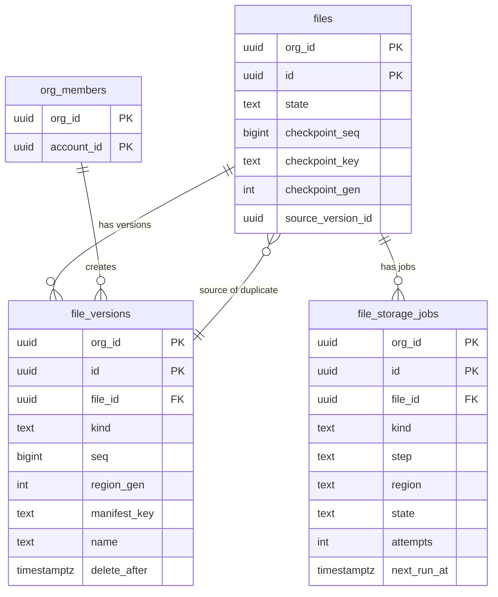
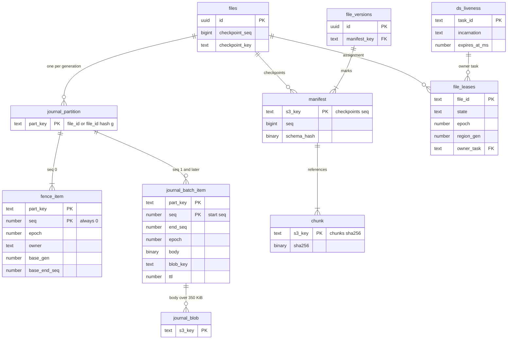

# Data model: ファイルの保存・バージョン・割り当て

[data-model.md](../data-model.md) の一部。規約は、そちらの 2 節に従う。振る舞いは [file-storage-and-history.md](../file-storage-and-history.md)、[infrastructure.md](../infrastructure.md) の 5・7 節、[ADR-0003](../../decisions/0003-journal-and-checkpoints.md)、[ADR-0024](../../decisions/0024-journal-items-and-fencing.md)〜[ADR-0026](../../decisions/0026-version-history-restore-and-deletion.md)、[ADR-0047](../../decisions/0047-router-task-liveness-and-file-assignment.md)、[ADR-0048](../../decisions/0048-osaka-dr-with-journal-generations.md) を正とする。

ファイルの中身は、3 つの置き場所に分かれる。中身そのものの形（ノード、プロパティ、直列化）は [document.md](document.md) にある。

| 置き場所 | 中身 | 正本か |
| --- | --- | --- |
| Aurora `files`・`file_versions`・`file_storage_jobs` | 最新のチェックポイントの位置、バージョンの一覧、ジョブ | メタデータの正本 |
| DynamoDB `journal` | チェックポイントより後の確定した変更と、フェンス | 変更の正本 |
| DynamoDB `file_leases`・`ds_liveness` | ファイルの割り当てとタスクの生存 | 持ち主の正本 |
| S3 files バケット | マニフェスト、チャンク、大きな変更、取り戻したバージョン | ファイルの中身の正本 |

## 1. ER 図

### 1.1 Aurora の表



### 1.2 置き場所をまたぐ概念の図

表ではない実体（DynamoDB の項目、S3 のオブジェクト）を含む。キーの関係を示す。



図の `part_key` は、DynamoDB の区分キー `pk` を指す（Mermaid では `pk` を属性名に使えないため）。

## 2. Aurora

### file_versions

バージョンの一覧。バージョンはチェックポイントに印を付けたもの（ADR-0026）。

| 列 | 型 | NULL | 既定 | 説明 |
| --- | --- | --- | --- | --- |
| `org_id`・`id` | `uuid` | NO | | 主キー |
| `file_id` | `uuid` | NO | | |
| `kind` | `text` | NO | | `auto`・`named`・`restore_before`・`restore_after`・`dr_salvaged`（[file-storage-and-history.md](../file-storage-and-history.md) の 8.1 節） |
| `seq` | `bigint` | NO | | バージョンの `seq` |
| `region_gen` | `integer` | NO | `1` | その `seq` の世代（ADR-0048）。`dr_salvaged` は元の世代 |
| `manifest_key` | `text` | NO | | マニフェストのキー（`dr_salvaged` は `salvage/` の下。5 節） |
| `name` | `text` | YES | | 名前付きのバージョン（1〜200 文字。ログに書かない） |
| `description` | `text` | YES | | 2,000 文字まで |
| `created_by` | `uuid` | YES | | 作った人。`auto` と `dr_salvaged` は NULL |
| `restored_from_version_id` | `uuid` | YES | | `restore_before`・`restore_after` の元のバージョン |
| `created_at` | `timestamptz` | NO | `now()` | |
| `delete_after` | `timestamptz` | YES | | 無料のプランの保持（30 日）。有料は NULL |

- 主キー：`(org_id, id)`。外部キー：`(org_id, file_id)` → `files`。
- CHECK：`kind IN (...)`、`(kind = 'named') = (name IS NOT NULL)`、`seq >= 0`、`region_gen >= 1`。
- 索引：`(org_id, file_id, id DESC)`（バージョンの一覧。新しい順に 50 件ずつ）、`(delete_after) WHERE delete_after IS NOT NULL`（無料のプランの期限。`scheduler_due_items`）。
- 書き方：チェックポイントの `files` の更新と同じトランザクションで足す（`checkpoint_seq < :s` の条件で、再試行でも二重にならない）。
- 保持：無料のプランは 30 日。過ぎたバージョンは、最新の 1 つを除いて消す（掃除でマニフェストも消す）。プランを下げたとき、既存のバージョンの `delete_after` を埋める。
- 削除：ファイルの完全な削除で消す。
- S1 の規模：1 年で約 5,000 万行（編集されたファイル 1 日 5 万 × 自動のバージョン 3。仮定）。

### file_storage_jobs

掃除・完全な削除・複製・復元・回復・取り戻しのジョブ。手順ごとの進み具合を持ち、途中で止まっても続きからやり直せる（[file-storage-and-history.md](../file-storage-and-history.md) の 11.2 節）。

| 列 | 型 | NULL | 既定 | 説明 |
| --- | --- | --- | --- | --- |
| `org_id`・`id` | `uuid` | NO | | 主キー |
| `file_id` | `uuid` | NO | | |
| `kind` | `text` | NO | | `gc`・`purge`・`duplicate`・`restore`・`orphan_recovery`・`dr_salvage` |
| `region` | `text` | NO | | 手順を行うリージョン（`ap-northeast-1`・`ap-northeast-3`）。`purge` と `gc` は東京と大阪を別の行にする（ADR-0045） |
| `step` | `text` | NO | | 今の手順の名前（例：`purge` は `lease`・`journal`・`s3`・`assets`・`metadata`・`finalize`） |
| `params` | `jsonb` | NO | `'{}'` | 例：複製の `dst_file_id`・`version_id`、取り戻しの `base_gen`・`base_end_seq` |
| `state` | `text` | NO | `'queued'` | `queued`・`running`・`succeeded`・`failed`・`cancelled` |
| `attempts` | `integer` | NO | `0` | |
| `next_run_at` | `timestamptz` | NO | `now()` | |
| `last_error` | `text` | YES | | エラーの種類のコードだけ。中身を含めない |
| `created_by` | `uuid` | YES | | 利用者の操作なら人。定期のジョブは NULL |
| `created_at`・`updated_at` | `timestamptz` | NO | `now()` | |
| `finished_at` | `timestamptz` | YES | | |

- 主キー：`(org_id, id)`。外部キー：`(org_id, file_id)` → `files`（`purged` の行も残るので切れない）。
- 一意：`UNIQUE (org_id, file_id, kind, region) WHERE state IN ('queued','running')`（同じファイルの同じ種類のジョブを 2 つ動かさない）。
- CHECK：`kind IN (...)`、`state IN (...)`、`region IN (...)`、`attempts >= 0`。
- 索引：`(next_run_at) WHERE state IN ('queued','running')`（`scheduler_due_items('file_storage_jobs', …)`）、`(org_id, file_id, created_at DESC)`（運用の調べ）。
- 保持：終わってから 30 日で消す。
- S1 の規模：常に数十万行（毎日の掃除 1 日 5 万 × 2 リージョン × 30 日。仮定）。

## 3. DynamoDB

3 つともオンデマンド。暗号化は KMS の `journal` の鍵（[security.md](../security.md) の 5.2 節）。属性の型は DynamoDB の `S`（文字列）・`N`（数）・`B`（バイナリ）・`BOOL`。

| 表 | 複製 | TTL の属性 | PITR | その他 |
| --- | --- | --- | --- | --- |
| `journal` | グローバルテーブル（MREC、大阪） | `ttl` | 35 日 | warm throughput 毎秒 5 万の書き込み単位（[ADR-0052](../../decisions/0052-journal-throughput-and-hot-file-budget.md)） |
| `file_leases` | グローバルテーブル（MREC、大阪） | `ttl` | 35 日 | GSI `by_owner` |
| `ds_liveness` | リージョンごと（複製しない） | `ttl` | なし | |

### 3.1 journal

```
journal  PK: pk (S)   SK: seq (N)

pk = "{file_id}"          世代 1
   = "{file_id}#g{g}"     世代 g ≥ 2（ADR-0048）
file_id は UUID の小文字の 36 文字
```

**フェンスの項目**（`seq = 0`。持ち主が変わるときだけ書く）：

| 属性 | 型 | 説明 |
| --- | --- | --- |
| `pk`・`seq` | S・N | `seq = 0` |
| `epoch` | N | 今の持ち主の `epoch`。`file_leases.epoch` と同じ値 |
| `owner` | S | Document Server のタスクの ID |
| `fenced_at` | N | UNIX ミリ秒 |
| `base_gen` | N | 世代 2 以降だけ：回復の元の世代 |
| `base_end_seq` | N | 世代 2 以降だけ：元の世代から当てた最後の `seq`。この世代の `seq` は `base_end_seq + 1` から続く |

**ジャーナルの項目**（`seq ≥ 1`。1 つのまとまり）：

| 属性 | 型 | 説明 |
| --- | --- | --- |
| `pk`・`seq` | S・N | `seq` はまとまりの最初の `seq` |
| `end_seq` | N | まとまりの最後の `seq` |
| `epoch` | N | 書いた持ち主の `epoch` |
| `fmt` | N | 本体の形式のバージョン |
| `body` | B | `zstd(JournalBatch)`（[document.md](document.md) の 5.3 節）。350 KiB を超えるときは持たない |
| `blob_key` | S | `body` の代わりに S3 に置いたときのキー（5 節） |
| `body_sha256` | B | 圧縮した本体の SHA-256（32 バイト） |
| `bytes` | N | 圧縮の前の大きさ |
| `written_at` | N | UNIX 秒 |
| `ttl` | N | `written_at + 30 日`（ADR-0024） |

- CHECK に当たる規則（書き手が守る）：`body` と `blob_key` のどちらか 1 つだけ。`end_seq >= seq`。項目は 400 KB 以下。
- 書き込み（ADR-0024）：

```
TransactWriteItems(
  ClientRequestToken = hash(file_id, epoch, start_seq)     // 36 文字以内
  ConditionCheck: journal[pk, 0]          epoch = :my_epoch
  Put:            journal[pk, start_seq]  attribute_not_exists(seq)
)
```

- フェンス：`UpdateItem journal[pk, 0] SET epoch = :E, owner = :me, fenced_at = :now IF attribute_not_exists(epoch) OR epoch < :E`。
- 読み取りのパターン：

| 用途 | 操作 |
| --- | --- |
| 回復・Render Worker・file-read | `Query pk = :pk AND seq > :checkpoint_seq`（強い整合性。1 MB ごとに続きを読む） |
| 世代をまたぐ回復 | 今の世代の `seq = 0` を読み、`base_*` がなければ元の世代の `pk` を `Query`（ADR-0048） |
| 完全な削除 | 全世代の `pk` を `Query` し、`BatchWriteItem` の削除（25 件ずつ） |
| `dr-salvage` | 元の世代の `pk` で `seq > base_end_seq` を `Query` |

- 索引（GSI）は持たない。1 ファイルの書き込みは末尾の 1 パーティションに集まる（[capacity.md](../capacity.md) の 4.2 節。1 ファイルの予算は毎秒 400 単位）。
- S1 の規模：1 日約 5,000 万件の変更（まとまりで平均毎秒 580 項目）、30 日で約 2.3 TB（東京と大阪で各 1 つ）。

### 3.2 file_leases

ファイルの割り当て（ADR-0047）。割り当て・手放し・削除のときだけ書く。延ばさない。

| 属性 | 型 | 説明 |
| --- | --- | --- |
| `file_id` | S | PK |
| `org_id` | S | ファイルを持つ組織。割り当てるときに Gateway が能力のチケットから渡す。Document Server と回復のジョブは、これで Aurora の組織の文脈を設定する（data-model.md の 9.1 節の D-6） |
| `state` | S | `owned`・`handoff`・`released`・`deleted` |
| `owner_task`・`owner_incarnation` | S | 持ち主のタスクと、その起動ごとの乱数 |
| `epoch` | N | 割り当てごとに + 1。ジャーナルのフェンスの `epoch` と同じ値。`deleted` は最大値（2^53 − 1） |
| `region_gen` | N | 割り当てた世代。今の世代でなければ「持ち主なし」とみなす（ADR-0048） |
| `assigned_at`・`released_at` | N | UNIX ミリ秒 |
| `released_seq` | N | `released`・`handoff` のときの `durable_seq` |
| `recover_then_release` | BOOL | 回復だけの割り当て（回復してチェックポイントを書き、接続が 0 なら `released`） |
| `gsi_owner` | S | `owned`・`handoff` の間だけ `owner_task`。疎な GSI のキー |
| `ttl` | N | `deleted` のときだけ、400 日後 |

- 割り当て：`UpdateItem ... SET epoch = epoch + 1, state = owned, owner_task = :t, ... IF epoch = :old`（初めてなら `attribute_not_exists(file_id)`）。
- 手放し：`SET state = released, released_seq = :s, released_at = :now REMOVE gsi_owner IF owner_task = :me AND epoch = :e`。
- GSI `by_owner`：PK `gsi_owner`、SK `file_id`。射影は `KEYS_ONLY` に `org_id`・`epoch`・`state` を足す（INCLUDE）。回復のジョブが落ちたタスクのファイルを集める。毎日の見張りも読む。
- 持ち主が有効なのは、`state = owned` で、`ds_liveness[owner_task]` の `incarnation` が一致し、`expires_at_ms + 2 秒 > now` のときだけ。
- S1 の規模：開かれたことのあるファイルの数（約 300 万項目）。`owned`・`handoff` は同時に開いたファイルの数（約 1 万）。

### 3.3 ds_liveness

Document Server のタスクの生存と負荷。リージョンの中の事実なので複製しない。

| 属性 | 型 | 説明 |
| --- | --- | --- |
| `task_id` | S | PK。ECS のタスクの ID |
| `incarnation` | S | 起動ごとの乱数 |
| `pool` | S | `ds-standard`・`ds-large`（ADR-0051） |
| `az`・`addr` | S | AZ と、Gateway がつなぐアドレス |
| `state` | S | `active`・`draining`・`full` |
| `expires_at_ms` | N | 2 秒ごとに `now + 10 秒` へ延ばす |
| `files`・`conns` | N | 開いたファイルの数、接続の数 |
| `mem_used`・`mem_budget` | N | バイト（ADR-0051 の受け入れの判断） |
| `ttl` | N | `expires_at_ms / 1000 + 1 日` |

- 延長：`UpdateItem ... SET expires_at_ms = :t ... IF incarnation = :me`。
- Router は 30 秒ごとに `Scan` する（タスクの数だけの小さな表。S1 で約 100 項目）。

## 4. 手順の順序（保存の不変条件）

| # | 規則 | 決めた場所 |
| --- | --- | --- |
| S-1 | 変更は、ジャーナルに書けてから `Ack`・`Committed` を出す | ADR-0003 |
| S-2 | ジャーナルの書き込みは、フェンスの `epoch` の一致と `seq` の未使用の 2 つを条件にした 1 つの `TransactWriteItems` | ADR-0024、本題材の AGENTS.md |
| S-3 | チェックポイントのマニフェストは、`durable_seq ≥ S` になってから書く。Aurora の `checkpoint_seq` はマニフェストの後に進める | [file-storage-and-history.md](../file-storage-and-history.md) の 5.2 節 |
| S-4 | 回復は、フェンスを上げてから、ジャーナルを強い整合性で読む。`seq` の飛びがあれば止め、`files.state = maintenance`（`journal_gap`） | 同 4.4 節 |
| S-5 | 掃除は `files.checkpoint_key` の指すマニフェストと、バージョンの印のあるマニフェストのチャンクを消さない。集合にないチャンクも 7 日は残す | 同 5.4 節 |
| S-6 | 完全な削除は、割り当てを `deleted` にしてから、ジャーナル・S3（東京と大阪）・メタデータの順に消す | 同 11.2 節、ADR-0045 |

## 5. S3 の files バケット

バケットは `<brand>-files-{env}-{region}`。SSE-KMS（`files` の鍵、バケットキー）、バージョニング（古いバージョンは 30 日）、東京 → 大阪のレプリケーション（RTC）。ライフサイクルの規則は両方のバケットに置く。**キーに `org_id` を入れない**（ファイルの組織は Aurora の `files` で決まる）。

| キー | 中身 | 書く | 消す |
| --- | --- | --- | --- |
| `files/{file_id}/checkpoints/{seq:020}` | マニフェスト（世代 1）。`seq` は 20 桁の 0 埋め | Document Server、複製のジョブ（`seq = 0`） | 掃除（5.3 節の保持）、完全な削除 |
| `files/{file_id}/checkpoints/g{g}/{seq:020}` | マニフェスト（世代 `g ≥ 2`） | Document Server | 同上 |
| `files/{file_id}/chunks/{sha256}` | zstd のチャンク（ページ・`document_chunk`・`sessions_chunk`・`blob_refs_chunk`）。`sha256` は 64 文字の 16 進。世代で分けない | Document Server、複製のジョブ（`CopyObject`） | 掃除（参照がなく 7 日を過ぎたもの）、完全な削除 |
| `files/{file_id}/journal-blobs/{start_seq}-{epoch}` | 350 KiB を超える `JournalBatch` の本体（世代 1） | Document Server | 掃除（ジャーナルの TTL の 30 日を過ぎたもの） |
| `files/{file_id}/journal-blobs/g{g}/{start_seq}-{epoch}` | 同（世代 `g ≥ 2`） | Document Server | 同上 |
| `files/{file_id}/salvage/g{g}/{seq:020}` | `dr-salvage` が取り戻したバージョンのマニフェスト（`g` は元の世代）。今の世代の `seq` と重なりうるので、`checkpoints/` と分ける | `dr-salvage` のジョブ | バージョンの保持に従う |

- オブジェクトのメタデータ：マニフェストに `x-amz-meta-schema-hash`・`x-amz-meta-format-version`、チャンクに `x-amz-meta-raw-bytes`。
- 配信：`files.<brand>usercontent.<domain>` の CloudFront。パスは `files/{file_id}/chunks/{sha256}`、署名付き URL は 5 分、`Cache-Control: public, max-age=31536000, immutable`。署名はキャッシュの鍵に含めない（[permissions-and-sharing.md](../permissions-and-sharing.md) の 11 節）。マニフェストとジャーナルの本体は CloudFront から配らない（Document Server と API が読む）。
- 大きさの上限：チェックポイント全体（圧縮の前）2 GiB、ページのチャンク 4 MiB（超えたら ID の順に分ける）。
- S1 の規模：約 300 万ファイル × 平均 1 MB（圧縮後）＋バージョンと 30 日の保持で、約 10 TB（仮定。[capacity.md](../capacity.md) の 6 節で見直す）。

## 6. 保持の一覧

| 対象 | 保持 | 消し方 |
| --- | --- | --- |
| ジャーナルの項目 | 書いてから 30 日 | TTL。回復のジョブで漏れを防ぐ（ADR-0047） |
| フェンスの項目 | ファイルがある間 | 完全な削除 |
| `file_leases` | ファイルがある間。`deleted` は 400 日 | TTL |
| `ds_liveness` | 期限 + 1 日 | TTL |
| バージョンの印のないチェックポイント | 48 時間はすべて、30 日までは 1 日 1 つ | 掃除（両方のバケット） |
| バージョン | 無料 30 日、有料はすべて | 掃除 |
| 大きな変更の本体 | 30 日 | 掃除 |
| S3 の古いバージョン | 30 日 | ライフサイクル（両方のバケット） |
| PITR（DynamoDB・Aurora） | 35 日 | 期限 |
