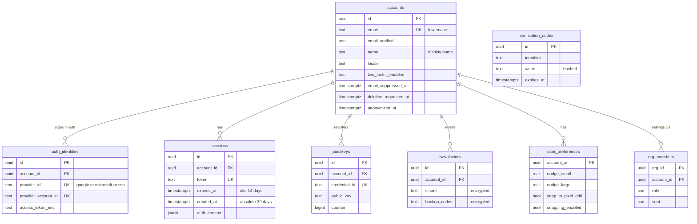

# Data model: アカウントと認証

[data-model.md](../data-model.md) の一部。規約は、そちらの 2 節に従う。振る舞いは [security.md](../security.md) の 4 節、[ADR-0043](../../decisions/0043-authentication-sessions-and-org-sso.md)、[editor-and-tools.md](../editor-and-tools.md) を正とする。

すべて `global` スキーマの表で、RLS を持たない（組織の外にある）。認証の表は Better Auth のモデルを snake_case の名前に写したもので、Slack の [identity.md](../../../../slack/docs/architecture/data-model/identity.md) と同じ形にする。

- 認証の表（`accounts`・`auth_identities`・`sessions`・`passkeys`・`two_factors`・`verification_codes`）に触れるのは、`auth` ロール（API の中の認証のモジュール）だけ。`app` ロールには権限を与えない。
- `user_preferences` は、`app` ロールから `tenant_resolver` の関数（`get_user_preferences`・`set_user_preferences`）を通して読み書きする（data-model.md の 2.3 節）。
- テナントの表は `account_id` を持つが、`global.accounts` への外部キーは張らない（data-model.md の 2.3 節）。アカウントの行は消さずに匿名にするので、参照は切れない。

## 1. ER 図

`org_members` は [organization.md](organization.md) の表。ここでは関係だけを示す。

## 2. 表

### accounts

ログインの主体（人）。Better Auth の `user` モデル。1 人が複数の組織に属せる（[permissions-and-sharing.md](../permissions-and-sharing.md) の 3.2 節）。

| 列 | 型 | NULL | 既定 | 説明 |
| --- | --- | --- | --- | --- |
| `id` | `uuid` | NO | `uuidv7()` | 主キー。テナントの表の `account_id`・`*_by` が指す |
| `email` | `text` | NO | | 小文字に正規化して保存する |
| `email_verified` | `boolean` | NO | `false` | 確認コードか IdP で確かめたら true。招待の受け入れはこれが true のときだけ |
| `name` | `text` | NO | `''` | 表示名（1〜100 文字）。組織の中の表示にも使う。検索用の正規化は `org_members.display_name_norm` に写す |
| `locale` | `text` | YES | | UI の言語（`ja`・`en`）。既定のフォントの選択に使う（[export-and-assets.md](../export-and-assets.md) の 7.2 節） |
| `two_factor_enabled` | `boolean` | NO | `false` | Better Auth の 2FA プラグインが持つ |
| `email_suppressed_at` | `timestamptz` | YES | | SES のバウンス・苦情で、通知のメールを止めた時刻（[comments-and-notifications.md](../comments-and-notifications.md) の 6 節） |
| `deletion_requested_at` | `timestamptz` | YES | | 本人が削除を求めた時刻。30 日の猶予の起点（[security.md](../security.md) の 7 節） |
| `anonymized_at` | `timestamptz` | YES | | 猶予の後に個人の情報（`email`・`name`）を消した時刻。行は残す |
| `created_at`・`updated_at` | `timestamptz` | NO | `now()` | |

- 主キー：`(id)`。
- 一意：`UNIQUE (email) WHERE anonymized_at IS NULL`。消したアカウントと同じメールで、新しいアカウントを作れる。
- CHECK：`anonymized_at IS NULL OR deletion_requested_at IS NOT NULL`。
- 索引：一意索引（メールでのログイン、招待の相手の照合）、`(deletion_requested_at) WHERE anonymized_at IS NULL AND deletion_requested_at IS NOT NULL`（削除の猶予の期限の見回り）。
- 削除：物理削除しない。匿名にするとき、`email` を `deleted+{id}@invalid` に、`name` を空にし、`auth_identities`・`sessions`・`passkeys`・`two_factors`・`user_preferences`・`global.api_tokens`・`global.oauth_grants` の行を消す。所有するファイルの移し先は [permissions-and-sharing.md](../permissions-and-sharing.md) の 10 節。
- S1 の規模：約 15 万行（月間の利用者 10 万の 1.5 倍。仮定）。

### auth_identities

認証の手段ごとの行（Google、Microsoft、組織の SSO）。Better Auth の `account` モデルを改名したもの。

| 列 | 型 | NULL | 既定 | 説明 |
| --- | --- | --- | --- | --- |
| `id` | `uuid` | NO | `uuidv7()` | |
| `account_id` | `uuid` | NO | | → `accounts.id` |
| `provider_id` | `text` | NO | | `google`・`microsoft`・`sso:{org_id}` |
| `provider_account_id` | `text` | NO | | IdP の中の利用者の ID |
| `access_token_enc`・`refresh_token_enc`・`id_token_enc` | `text` | YES | | Better Auth の `encryptOAuthTokens` で暗号化する |
| `access_token_expires_at`・`refresh_token_expires_at` | `timestamptz` | YES | | |
| `scope` | `text` | YES | | |
| `created_at`・`updated_at` | `timestamptz` | NO | `now()` | |

- 主キー：`(id)`。一意：`UNIQUE (provider_id, provider_account_id)`。
- 外部キー：`account_id` → `accounts (id) ON DELETE CASCADE`。
- 索引：`(account_id)`（設定の画面、アカウントの匿名化）。
- パスワードの列は使わない（パスワードを持たない。[security.md](../security.md) の 4 節）。
- S1 の規模：約 10 万行。

### sessions

ログインのセッション。正本は DB だけに置く。取り消しの印（2 分）だけを Valkey に置く（[stores.md](stores.md) の 2 節）。

| 列 | 型 | NULL | 既定 | 説明 |
| --- | --- | --- | --- | --- |
| `id` | `uuid` | NO | `uuidv7()` | 能力のチケット・再開のトークンの `auth_session_id`、監査ログが指す |
| `account_id` | `uuid` | NO | | → `accounts.id` |
| `token` | `text` | NO | | Cookie の値に対応する不透明なトークン。Better Auth が照合する |
| `expires_at` | `timestamptz` | NO | | アイドルの期限（14 日。使うたびに延びる） |
| `ip_address` | `inet` | YES | | |
| `user_agent` | `text` | YES | | |
| `auth_context` | `jsonb` | NO | `'{}'` | どの組織の SSO でいつ認証したか、MFA を満たした時刻（`{"sso": {"<org_id>": "<時刻>"}, "mfa_at": "<時刻>"}`） |
| `created_at`・`updated_at` | `timestamptz` | NO | `now()` | `created_at` は最長 30 日の起点 |

- 主キー：`(id)`。一意：`UNIQUE (token)`。
- 外部キー：`account_id` → `accounts (id) ON DELETE CASCADE`。
- CHECK：`expires_at <= created_at + interval '30 days'`。
- 索引：`(account_id)`（端末の一覧と一括の取り消し）、`(expires_at)`（期限切れの掃除）。
- 取り消しは Better Auth の API で行を消し、同じトランザクションで `global.global_outbox` に `session.revoked` を積む（[events-and-audit.md](events-and-audit.md)）。
- 保持：期限切れの行は 1 日ごとに消す。
- S1 の規模：約 30 万行（1 人平均 2 端末）。
- 匿名の閲覧者のセッション（`anonymous_session_id`、24 時間）は表を持たない。API が署名した Cookie に ID と期限だけを入れる（data-model.md の 9.1 節）。

### passkeys

WebAuthn の公開鍵。

| 列 | 型 | NULL | 既定 | 説明 |
| --- | --- | --- | --- | --- |
| `id` | `uuid` | NO | `uuidv7()` | |
| `account_id` | `uuid` | NO | | → `accounts.id` |
| `name` | `text` | YES | | 利用者が付けた名前 |
| `credential_id` | `text` | NO | | |
| `public_key` | `text` | NO | | |
| `counter` | `bigint` | NO | `0` | |
| `device_type`・`transports`・`aaguid` | `text` | YES | | |
| `backed_up` | `boolean` | NO | `false` | |
| `created_at` | `timestamptz` | NO | `now()` | |

- 主キー：`(id)`。一意：`UNIQUE (credential_id)`。索引：`(account_id)`。
- 外部キー：`account_id` → `accounts (id) ON DELETE CASCADE`。
- S1 の規模：約 5 万行。

### two_factors

TOTP の秘密とバックアップコード。

| 列 | 型 | NULL | 既定 | 説明 |
| --- | --- | --- | --- | --- |
| `id` | `uuid` | NO | `uuidv7()` | |
| `account_id` | `uuid` | NO | | → `accounts.id` |
| `secret` | `text` | NO | | Better Auth が暗号化して書く |
| `backup_codes` | `text` | NO | | 同上。10 個、1 回限り |

- 主キー：`(id)`。一意：`UNIQUE (account_id)`。
- 外部キー：`account_id` → `accounts (id) ON DELETE CASCADE`。
- S1 の規模：約 2 万行。

### verification_codes

メールの確認コードなど、短命の検証の値。Better Auth の `verification` モデル。

| 列 | 型 | NULL | 既定 | 説明 |
| --- | --- | --- | --- | --- |
| `id` | `uuid` | NO | `uuidv7()` | |
| `identifier` | `text` | NO | | 例：`email-otp:<email>` |
| `value` | `text` | NO | | ハッシュにした値（`storeOTP: "hashed"`） |
| `expires_at` | `timestamptz` | NO | | 確認コードは 10 分 |
| `created_at`・`updated_at` | `timestamptz` | NO | `now()` | |

- 主キー：`(id)`。索引：`(identifier)`、`(expires_at)`。
- 保持：期限切れを 1 時間ごとに消す。
- S1 の規模：数万行（常に短命）。

### user_preferences

組織をまたぐ編集の設定（[editor-and-tools.md](../editor-and-tools.md) の 20 節）。

| 列 | 型 | NULL | 既定 | 説明 |
| --- | --- | --- | --- | --- |
| `account_id` | `uuid` | NO | | 主キー。→ `accounts.id` |
| `nudge_small` | `real` | NO | `1` | 矢印キーの移動量（px。0.01〜1,000） |
| `nudge_large` | `real` | NO | `10` | Shift＋矢印キーの移動量（px。0.01〜1,000） |
| `snap_to_pixel_grid` | `boolean` | NO | `true` | |
| `snapping_enabled` | `boolean` | NO | `true` | |
| `updated_at` | `timestamptz` | NO | `now()` | |

- 主キー：`(account_id)`。外部キー：`account_id` → `accounts (id) ON DELETE CASCADE`。
- CHECK：`nudge_small BETWEEN 0.01 AND 1000`、`nudge_large BETWEEN 0.01 AND 1000`。
- 行がなければ既定値を返す（初めて変えたときに作る）。
- S1 の規模：約 5 万行。
