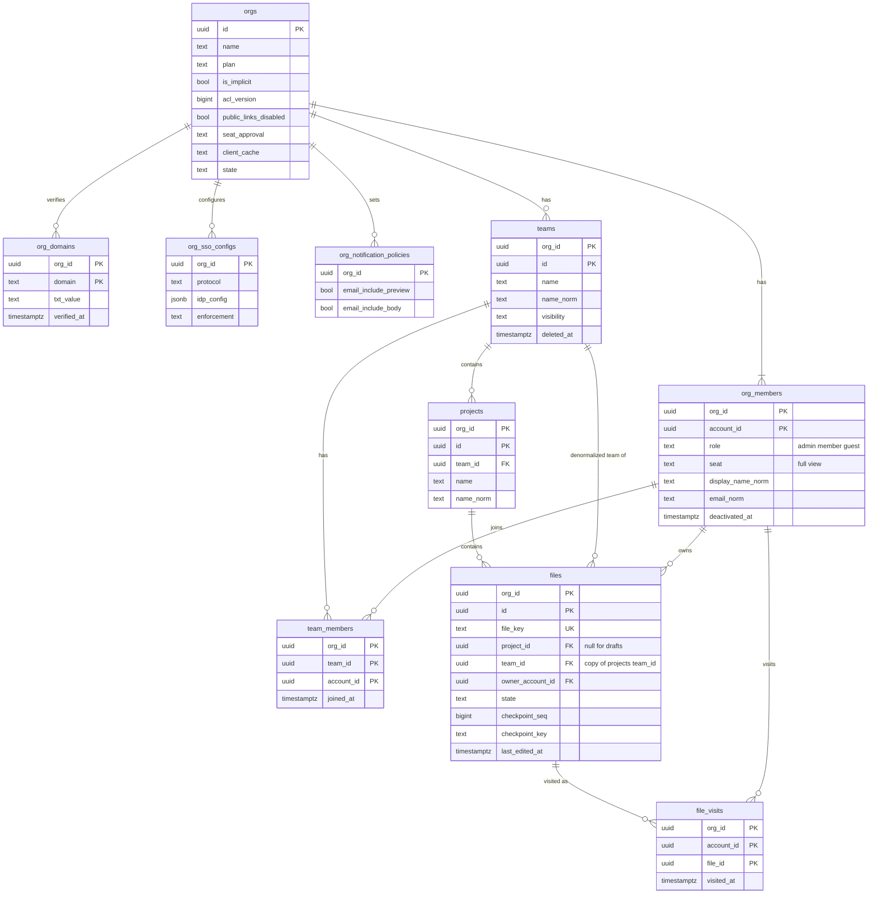

# Data model: 組織・チーム・プロジェクト・ファイル

[data-model.md](../data-model.md) の一部。規約は、そちらの 2 節に従う。振る舞いは [permissions-and-sharing.md](../permissions-and-sharing.md)、[file-storage-and-history.md](../file-storage-and-history.md)、[search.md](../search.md)、[security.md](../security.md)、[ADR-0005](../../decisions/0005-tenancy-and-document-routing.md)、[ADR-0029](../../decisions/0029-hierarchy-roles-seats-and-link-access.md)、[ADR-0031](../../decisions/0031-org-acl-version-and-connection-revalidation.md) を正とする。

すべて `app` スキーマのテナントの表（`org_id`、複合キー、FORCE RLS）。`orgs` はテナントの根で、`id = current_setting('app.org_id')::uuid` のポリシーを持つ。

## 1. ER 図

## 2. 組織

### orgs

組織（テナント）。本家のチームだけのプランでも、暗黙の組織を 1 つ作る（ADR-0005）。

| 列 | 型 | NULL | 既定 | 説明 |
| --- | --- | --- | --- | --- |
| `id` | `uuid` | NO | `uuidv7()` | 主キー。RLS の鍵 |
| `name` | `text` | NO | | 1〜100 文字 |
| `is_implicit` | `boolean` | NO | `false` | チームだけのプランのために作った暗黙の組織 |
| `plan` | `text` | NO | `'free'` | `free`・`professional`・`organization`。版の保持（無料 30 日）、リンクの期限、API のレート制限、ライブラリの公開を分ける。請求は範囲の外 |
| `acl_version` | `bigint` | NO | `0` | 権限に効く変更で同じトランザクションの中で 1 上げる（ADR-0031。[permissions-and-sharing.md](../permissions-and-sharing.md) の 9.1 節） |
| `public_links_disabled` | `boolean` | NO | `false` | `anyone` の一般アクセスを禁止する |
| `seat_approval` | `text` | NO | `'manual'` | `manual`・`auto_if_available`・`auto`（[permissions-and-sharing.md](../permissions-and-sharing.md) の 4.4 節） |
| `full_seat_limit` | `integer` | YES | | Full のシートの空きの上限。NULL は上限なし。`auto_if_available` で使う |
| `client_cache` | `text` | NO | `'allowed'` | `allowed`・`session_only`・`disabled`（[security.md](../security.md) の 5.3 節） |
| `session_max_age_seconds` | `integer` | YES | | メンバーのセッションの最長を短くする（MVP の後） |
| `pat_disabled` | `boolean` | NO | `false` | メンバーの個人のアクセストークンで、この組織のファイルを読ませない（[api-and-webhooks.md](../api-and-webhooks.md) の 3.4 節） |
| `oauth_apps_mode` | `text` | NO | `'all'` | `all`・`allowlist`。`allowlist` なら `org_oauth_app_allowlist` のアプリだけ（[public-api.md](public-api.md)） |
| `state` | `text` | NO | `'active'` | `active`・`cancelling`・`purged` |
| `cancel_requested_at` | `timestamptz` | YES | | 解約の猶予（28 日）の起点 |
| `purge_after` | `timestamptz` | YES | | この時刻を過ぎたら配下の全ファイルを完全な削除に回す |
| `created_at`・`updated_at` | `timestamptz` | NO | `now()` | |

- 主キー：`(id)`。
- CHECK：`plan IN (...)`、`seat_approval IN (...)`、`client_cache IN (...)`、`oauth_apps_mode IN (...)`、`state IN (...)`、`acl_version >= 0`、`(state = 'cancelling') = (cancel_requested_at IS NOT NULL AND purge_after IS NOT NULL)` を `state <> 'purged'` の範囲で。
- 索引：主キーだけ（要求の始めに `acl_version` と方針を 1 行で読む）。`purge_after` の見回りは `scheduler_due_items` の関数が `(purge_after) WHERE state = 'cancelling'` の索引で読む。
- ロックの順：権限の変更は `orgs`（`acl_version`）→ `projects` → `files` の順（[permissions-and-sharing.md](../permissions-and-sharing.md) の 9.3 節）。
- 格納：`fillfactor = 80`（`acl_version` の更新を HOT にする）。
- 削除：行は消さない。解約の完了で `state = 'purged'`、`name` を空にする。
- S1 の規模：約 3 万行（仮定。暗黙の組織を含む）。

### org_domains

組織の確認済みのドメイン（DNS の TXT で確かめる）。メンバーとゲストの見分け（[permissions-and-sharing.md](../permissions-and-sharing.md) の 3.2 節）と、組織の SSO の対象に使う。

| 列 | 型 | NULL | 既定 | 説明 |
| --- | --- | --- | --- | --- |
| `org_id` | `uuid` | NO | | |
| `domain` | `text` | NO | | 小文字の登録可能ドメイン（例 `example.co.jp`） |
| `txt_value` | `text` | NO | | 置いてもらう TXT の値（128 ビットの乱数）。秘密ではない |
| `verified_at` | `timestamptz` | YES | | 確かめた時刻 |
| `created_by` | `uuid` | NO | | 組織の管理者 |
| `created_at` | `timestamptz` | NO | `now()` | |

- 主キー：`(org_id, domain)`。
- 一意：`UNIQUE (domain) WHERE verified_at IS NOT NULL`（組織をまたぐ一意。確認は `tenant_resolver` の関数 `resolve_org_domain` で行い、他の組織の存在を画面に出さない）。
- 索引：主キー（組織の一覧）。
- 削除：管理者が外したら行を消す。`acl_version` を上げる（メンバーの判定に効く）。
- S1 の規模：数千行。

### org_members

組織の中の人（メンバー・ゲスト）とシート。アカウントはグローバル、組織の中の振る舞いはこの行で決まる（ADR-0043）。

| 列 | 型 | NULL | 既定 | 説明 |
| --- | --- | --- | --- | --- |
| `org_id`・`account_id` | `uuid` | NO | | 主キー |
| `role` | `text` | NO | | `admin`・`member`・`guest` |
| `seat` | `text` | NO | `'view'` | `full`・`view`（Dev・Collab は MVP の後） |
| `seat_assigned_at`・`seat_assigned_by` | `timestamptz`・`uuid` | YES | | Full を割り当てた時刻と人（自動の割り当ては NULL の人） |
| `display_name_norm` | `text` | NO | `''` | `normalizeForSearch(accounts.name)`（[search.md](../search.md) の 3.1 節） |
| `email_norm` | `text` | NO | | `normalizeForSearch(accounts.email)` |
| `joined_at` | `timestamptz` | NO | `now()` | |
| `deactivated_at`・`deactivated_by` | `timestamptz`・`uuid` | YES | | 無効化。行は消さない |
| `updated_at` | `timestamptz` | NO | `now()` | |

- 主キー：`(org_id, account_id)`。
- CHECK：`role IN (...)`、`seat IN (...)`。
- 索引：
  - 主キー：判定関数の段階 1（主体の組織の行）。
  - `(org_id, role) WHERE deactivated_at IS NULL`：管理者の一覧、シートの数え上げ。
  - `(account_id)`：`list_my_orgs` の関数だけが使う（組織の切り替え、アカウントの匿名化）。先頭が `org_id` でない索引の 1 つ（data-model.md の 2.3 節の例外）。
- 非正規化：`display_name_norm`・`email_norm` は、アカウントの名前・メールの変更のときに、組織ごとに別のトランザクションで書き直す（1 つのトランザクションで複数の組織の行を書かない。ADR-0005）。
- 役割・シート・無効化の変更は `acl_version` を上げる。
- S1 の規模：約 20 万行（ゲストを含む）。

### org_sso_configs

組織の SSO（E12。MVP の範囲の外）。対象は、この組織の確認済みのドメイン（`org_domains`）のメンバー。ゲストは対象の外（ADR-0043）。

| 列 | 型 | NULL | 既定 | 説明 |
| --- | --- | --- | --- | --- |
| `org_id` | `uuid` | NO | | 主キー |
| `protocol` | `text` | NO | | `saml`・`oidc` |
| `idp_config` | `jsonb` | NO | | SAML は IdP のメタデータ（entity ID、SSO の URL、証明書）、OIDC は issuer と client ID |
| `oidc_client_secret_enc` | `bytea` | YES | | KMS の `metadata` の鍵でエンベロープ暗号化 |
| `enforcement` | `text` | NO | `'any'` | `any`（どの方法でもよい）・`sso_only` |
| `enabled_at` | `timestamptz` | YES | | NULL は下書き |
| `updated_by` | `uuid` | NO | | |
| `updated_at` | `timestamptz` | NO | `now()` | |

- 主キー：`(org_id)`。CHECK：`protocol IN (...)`、`enforcement IN (...)`、`protocol = 'oidc' OR oidc_client_secret_enc IS NULL`。
- S1 の規模：数百行。

### org_notification_policies

メールの通知の組織の方針（[comments-and-notifications.md](../comments-and-notifications.md) の 4.5 節）。行がなければ既定値。

| 列 | 型 | NULL | 既定 | 説明 |
| --- | --- | --- | --- | --- |
| `org_id` | `uuid` | NO | | 主キー |
| `email_include_preview` | `boolean` | NO | `true` | メールにデザインのプレビューを入れる |
| `email_include_body` | `boolean` | NO | `true` | メールにコメントの本文を入れる |
| `updated_by` | `uuid` | NO | | |
| `updated_at` | `timestamptz` | NO | `now()` | |

- 主キー：`(org_id)`。S1 の規模：数千行。

## 3. チームとプロジェクト

### teams

| 列 | 型 | NULL | 既定 | 説明 |
| --- | --- | --- | --- | --- |
| `org_id`・`id` | `uuid` | NO | | 主キー |
| `name` | `text` | NO | | 1〜100 文字 |
| `name_norm` | `text` | NO | | `normalizeForSearch(name)` |
| `visibility` | `text` | NO | `'closed'` | `open`・`closed`・`secret`（[permissions-and-sharing.md](../permissions-and-sharing.md) の 3.3 節） |
| `created_by` | `uuid` | NO | | |
| `created_at`・`updated_at` | `timestamptz` | NO | `now()` | |
| `deleted_at`・`deleted_by` | `timestamptz`・`uuid` | YES | | 消したチーム。28 日の間は戻せる |

- 主キー：`(org_id, id)`。CHECK：`visibility IN (...)`。
- 索引：`(org_id, visibility) WHERE deleted_at IS NULL`（チームの一覧）、`(deleted_at) WHERE deleted_at IS NOT NULL`（28 日の期限の見回り。`scheduler_due_items`）。
- 可視性の変更と削除・戻しは `acl_version` を上げる。
- 削除：28 日を過ぎたら、配下のファイルの完全な削除を積み、行を消す（[file-storage-and-history.md](../file-storage-and-history.md) の 11.1 節）。
- S1 の規模：約 4 万行。

### team_members

チームへの参加。参加はチームを見せるだけで、中身に届かない（[permissions-and-sharing.md](../permissions-and-sharing.md) の 3.3 節）。役割は `resource_roles` の `team` の行に持つ。

| 列 | 型 | NULL | 既定 | 説明 |
| --- | --- | --- | --- | --- |
| `org_id`・`team_id`・`account_id` | `uuid` | NO | | 主キー |
| `joined_at` | `timestamptz` | NO | `now()` | |

- 主キー：`(org_id, team_id, account_id)`。
- 外部キー：`(org_id, team_id)` → `teams`、`(org_id, account_id)` → `org_members`。
- 索引：`(org_id, account_id)`（参加しているチーム。`readableScopes` の段）。
- 参加・退出は `acl_version` を上げる。退出で行を消す。
- S1 の規模：約 20 万行。

### projects

本家の「フォルダー」に当たる。呼び名は「プロジェクト」のまま（[permissions-and-sharing.md](../permissions-and-sharing.md) の 15 節）。

| 列 | 型 | NULL | 既定 | 説明 |
| --- | --- | --- | --- | --- |
| `org_id`・`id` | `uuid` | NO | | 主キー |
| `team_id` | `uuid` | NO | | |
| `name` | `text` | NO | | 1〜100 文字 |
| `name_norm` | `text` | NO | | |
| `created_by` | `uuid` | NO | | |
| `created_at`・`updated_at` | `timestamptz` | NO | `now()` | |

- 主キー：`(org_id, id)`。外部キー：`(org_id, team_id)` → `teams`。
- 索引：`(org_id, team_id)`（`teamProjects(team_id)` の購読、チームの移動での `files.team_id` の書き換え）。
- プロジェクトの削除の形は領域の文書にない（10 節の残した問い）。
- S1 の規模：約 20 万行。

## 4. ファイル

### files

ファイルの一覧と、最新のチェックポイントの位置。複数の領域が列を足す。列ごとに持ち主の領域を書く（持ち主の文書は振る舞いを決め、形はこの節が正本）。

| 列 | 型 | NULL | 既定 | 持ち主 | 説明 |
| --- | --- | --- | --- | --- | --- |
| `org_id` | `uuid` | NO | | permissions | ファイルを持つ組織。RLS の鍵 |
| `id` | `uuid` | NO | `uuidv7()` | permissions | 内部の ID。外に出さない。S3・DynamoDB のキーに使う |
| `file_key` | `text` | YES | | permissions | 128 ビットの乱数の base62（22 文字）。URL・公開 API・共有のリンクの鍵 |
| `name` | `text` | YES | | permissions | ファイルの名前（1〜200 文字。ログに書かない） |
| `name_norm` | `text` | YES | | search | `normalizeForSearch(name)` |
| `project_id` | `uuid` | YES | | permissions | 下書きは NULL |
| `team_id` | `uuid` | YES | | search | `projects.team_id` の写し（非正規化）。下書きは NULL（[permissions-and-sharing.md](../permissions-and-sharing.md) の 9.3 節） |
| `owner_account_id` | `uuid` | YES | | permissions | 所有者（`owner` の水準の唯一の出どころ。data-model.md の 9.1 節の D-12）。移譲で変わる |
| `state` | `text` | NO | `'creating'` | file-storage | 下の遷移 |
| `maintenance_reason` | `text` | YES | | file-storage・security | `operator`・`journal_gap`・`invariant_violation` |
| `maintenance_since` | `timestamptz` | YES | | file-storage | |
| `trashed_at`・`trashed_by` | `timestamptz`・`uuid` | YES | | file-storage | ゴミ箱 |
| `purged_at` | `timestamptz` | YES | | file-storage | 完全な削除の完了 |
| `checkpoint_seq` | `bigint` | NO | `0` | file-storage | 最新のチェックポイントの `seq`。後退しない |
| `checkpoint_key` | `text` | YES | | file-storage | マニフェストのキー（世代を含む。[file-storage.md](file-storage.md) の 5 節）。最初のチェックポイントまで NULL |
| `checkpoint_gen` | `integer` | NO | `1` | file-storage | `checkpoint_key` の世代（ADR-0048） |
| `node_count` | `integer` | NO | `0` | file-storage | 最新のチェックポイントのノードの数 |
| `size_bytes` | `bigint` | NO | `0` | file-storage | 圧縮の前の大きさ。Router のメモリの見積もり（ADR-0051） |
| `source_file_id`・`source_version_id` | `uuid` | YES | | file-storage | 複製の元（別の組織のこともある。外部キーを張らない） |
| `created_by` | `uuid` | YES | | file-storage | |
| `created_at` | `timestamptz` | NO | `now()` | file-storage | |
| `last_edited_at` | `timestamptz` | NO | `now()` | file-storage | チェックポイントのときに進める。一覧の並び |
| `updated_at` | `timestamptz` | NO | `now()` | — | メタデータ（名前・移動・状態）の変更 |

- 主キー：`(org_id, id)`。
- 一意：`UNIQUE (file_key)`（組織をまたぐ一意。`resolve_file_key` の関数が使う。data-model.md の 9.1 節の D-5）、`UNIQUE (id)`（S3・DynamoDB のキーが `file_id` だけなので、組織をまたいで重ならないことを DB でも守る）。
- 外部キー：`(org_id, project_id)` → `projects`、`(org_id, team_id)` → `teams`、`(org_id, owner_account_id)` → `org_members (org_id, account_id)`。
- CHECK：
  - `state IN ('creating','active','maintenance','trashed','purging','purged')`。
  - `(state = 'maintenance') = (maintenance_reason IS NOT NULL)`。
  - `state = 'purged' OR (file_key IS NOT NULL AND name IS NOT NULL AND owner_account_id IS NOT NULL)`。
  - `project_id IS NOT NULL OR team_id IS NULL`。
  - `(state IN ('trashed','purging')) <= (trashed_at IS NOT NULL)`（ゴミ箱・削除中は `trashed_at` を持つ）。
  - `checkpoint_seq >= 0`、`node_count >= 0`、`size_bytes >= 0`。
- 索引：
  - `(org_id, project_id, last_edited_at DESC) WHERE state = 'active'`：`projectFiles(project_id)`。
  - `(org_id, owner_account_id, last_edited_at DESC) WHERE project_id IS NULL AND state = 'active'`：下書き。
  - `(org_id, last_edited_at DESC) WHERE state = 'active'`：組織の最近の更新、名前の検索の走査（[search.md](../search.md) の 3.1 節）。
  - `(org_id, team_id) WHERE state = 'active'`：名前の検索の候補の段。
  - `(org_id, owner_account_id, trashed_at DESC) WHERE state = 'trashed'`：ゴミ箱の一覧。
  - `(org_id, state) WHERE state IN ('creating','maintenance','purging')`：見回り（止まった複製・削除、`maintenance` の数）。
- 状態の遷移：`creating → active`（作成・複製の完了）、`active ⇄ maintenance`（運用者、ジャーナルの飛び、不変条件の破れ）、`active ⇄ trashed`（`owner`）、`trashed → purging → purged`（完全な削除のジョブ）。`maintenance` の間、API は閲覧のチケットだけを出す。出入りは `acl_version` を上げる。`journal_gap` のときは Document Server も読み込まない（[runbooks/incident-response.md](../../runbooks/incident-response.md)）。
- チェックポイントの更新：`UPDATE files SET checkpoint_seq = :s, checkpoint_key = :k, checkpoint_gen = :g, node_count = :n, size_bytes = :b, last_edited_at = now() WHERE org_id = :org AND id = :file AND checkpoint_seq < :s AND state <> 'purging'`（[file-storage-and-history.md](../file-storage-and-history.md) の 5.2 節）。Document Server は、`file_leases.org_id`（[file-storage.md](file-storage.md) の 3.3 節）で組織の文脈を設定する。
- 移動：`project_id`・`team_id` を、`acl_version` と同じトランザクションで書く（[permissions-and-sharing.md](../permissions-and-sharing.md) の 9.3 節）。見張り：毎日 `files.team_id IS DISTINCT FROM projects.team_id` の行を数える。
- 完全な削除：`purged` の行は `id`・`org_id`・`state`・`purged_at` と既定値の列だけを残し、他の列を NULL にする（監査のため）。
- 格納：`fillfactor = 80`。チェックポイントの更新（編集中のファイル 3,000 で毎秒約 50 行）は、索引の列 `last_edited_at` を変えるので HOT にならない。S2 で重ければ、`last_edited_at` の更新を 5 分に 1 回へ間引く。
- S1 の規模：約 300 万行（利用者 1 人あたり 30。仮定）。

### file_visits

最近のファイル（[search.md](../search.md) の 3.1 節）。

| 列 | 型 | NULL | 既定 | 説明 |
| --- | --- | --- | --- | --- |
| `org_id`・`account_id`・`file_id` | `uuid` | NO | | 主キー |
| `visited_at` | `timestamptz` | NO | `now()` | 開いた時刻。1 時間に 1 回まで更新する |

- 主キー：`(org_id, account_id, file_id)`。外部キー：`(org_id, file_id)` → `files ON DELETE CASCADE`。
- 索引：`(org_id, account_id, visited_at DESC)`（`recentFiles()`）。
- 上限：1 人 1 組織 500 件。書き込みの後、501 件目より古い行を消す。
- ゲストが開いたファイルの行も、ファイルを持つ組織の `org_id` で持つ。
- S1 の規模：約 1,500 万行（仮定）。
