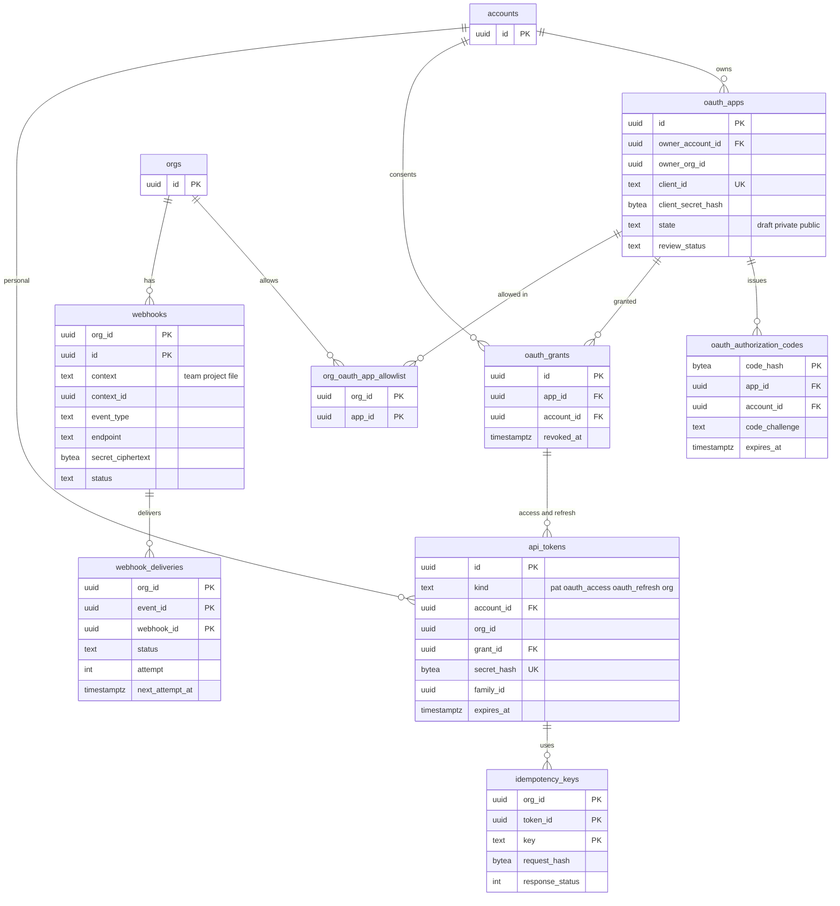

# Data model: 公開 API・トークン・Webhook（E15）

[data-model.md](../data-model.md) の一部。規約は、そちらの 2 節に従う。振る舞いは [api-and-webhooks.md](../api-and-webhooks.md)、[ADR-0040](../../decisions/0040-public-rest-api-surface.md)〜[ADR-0042](../../decisions/0042-api-versioning-and-rate-limits.md) を正とする。MVP の後に作る。

| 表 | スキーマ | テナント | 理由 |
| --- | --- | --- | --- |
| `oauth_apps`・`oauth_authorization_codes`・`oauth_grants`・`api_tokens` | `global` | 外 | トークンはアカウントに属し、複数の組織のファイルに使える。組織が決まる前（要求の最初）にハッシュで引く（data-model.md の 9.1 節の D-4） |
| `org_oauth_app_allowlist`・`webhooks`・`webhook_deliveries`・`idempotency_keys` | `app` | 内（FORCE RLS） | 組織の資源に付く |

- `global` の 4 つの表に触れるのは、API の中のトークンのモジュール（`auth` ロール）だけ。`app` ロールには権限を与えない。
- `/v1/image_jobs` の記録は別の表を持たない。`export_jobs`（`source = api`。[assets.md](assets.md)）を使う。

## 1. ER 図

## 2. アプリとトークン（`global`）

### oauth_apps

| 列 | 型 | NULL | 既定 | 説明 |
| --- | --- | --- | --- | --- |
| `id` | `uuid` | NO | `uuidv7()` | |
| `owner_account_id` | `uuid` | NO | | 作った人 |
| `owner_org_id` | `uuid` | YES | | `private` の範囲の組織 |
| `name` | `text` | NO | | 同意の画面に出す |
| `client_id` | `text` | NO | | 公開の ID |
| `client_secret_hash` | `bytea` | NO | | SHA-256。入れ替えの間の古い値は `client_secret_prev_hash` |
| `client_secret_prev_hash` | `bytea` | YES | | 24 時間だけ持つ |
| `redirect_uris` | `text[]` | NO | | 完全一致だけを許す |
| `state` | `text` | NO | `'draft'` | `draft`・`private`・`public` |
| `review_status` | `text` | NO | `'not_required'` | `not_required`・`pending`・`approved`・`rejected`（`public` は審査が要る） |
| `scopes` | `text[]` | NO | | 求めてよいスコープ（[api-and-webhooks.md](../api-and-webhooks.md) の 3.2 節） |
| `suspended_at` | `timestamptz` | YES | | 運用者の停止 |
| `created_at`・`updated_at` | `timestamptz` | NO | `now()` | |

- 主キー：`(id)`。一意：`UNIQUE (client_id)`。
- CHECK：`state IN (...)`、`state <> 'private' OR owner_org_id IS NOT NULL`、`state <> 'public' OR review_status = 'approved'`。
- 索引：`(owner_account_id)`（開発者の画面）。
- S1 の規模：数千行。

### oauth_authorization_codes

認可コード（30 秒・1 回）。PKCE（S256）を必須にする。

| 列 | 型 | NULL | 既定 | 説明 |
| --- | --- | --- | --- | --- |
| `code_hash` | `bytea` | NO | | コードの SHA-256 |
| `app_id` | `uuid` | NO | | |
| `account_id` | `uuid` | NO | | 同意した人 |
| `redirect_uri` | `text` | NO | | 交換のときに一致を確かめる |
| `code_challenge` | `text` | NO | | S256 |
| `scopes` | `text[]` | NO | | |
| `expires_at` | `timestamptz` | NO | | 30 秒 |
| `used_at` | `timestamptz` | YES | | 2 回目の交換は拒否し、その系列を失効させる |

- 主キー：`(code_hash)`。外部キー：`app_id` → `oauth_apps`、`account_id` → `accounts`。
- 保持：期限から 1 時間で消す。S1 の規模：常に数百行。

### oauth_grants

| 列 | 型 | NULL | 既定 | 説明 |
| --- | --- | --- | --- | --- |
| `id` | `uuid` | NO | `uuidv7()` | |
| `app_id` | `uuid` | NO | | |
| `account_id` | `uuid` | NO | | |
| `scopes` | `text[]` | NO | | |
| `granted_at` | `timestamptz` | NO | `now()` | |
| `revoked_at` | `timestamptz` | YES | | |

- 主キー：`(id)`。一意：`UNIQUE (app_id, account_id) WHERE revoked_at IS NULL`。
- 索引：`(account_id)`（設定の画面、アカウントの匿名化）。
- 失効で、同じ `grant_id` の `api_tokens` をすべて失効させる。
- S1 の規模：数万行。

### api_tokens

個人のアクセストークン、OAuth のアクセス・リフレッシュ、組織のトークン。SHA-256 のハッシュだけを持つ。

| 列 | 型 | NULL | 既定 | 説明 |
| --- | --- | --- | --- | --- |
| `id` | `uuid` | NO | `uuidv7()` | 監査ログ・レート制限の主体 |
| `kind` | `text` | NO | | `pat`・`oauth_access`・`oauth_refresh`・`org` |
| `account_id` | `uuid` | YES | | 主体の利用者（`org` は NULL） |
| `org_id` | `uuid` | YES | | `org` のトークンの組織 |
| `app_id` | `uuid` | YES | | OAuth のとき |
| `grant_id` | `uuid` | YES | | OAuth のとき |
| `name` | `text` | YES | | 利用者が付けた名前（`pat`・`org`） |
| `scopes` | `text[]` | NO | | 必須 |
| `resource_allowlist` | `jsonb` | YES | | `org` のトークンのプロジェクト・ファイルの許可リスト |
| `secret_hash` | `bytea` | NO | | 接頭辞を除いた本体の SHA-256 |
| `hint` | `text` | NO | | 画面に出す末尾 4 文字 |
| `expires_at` | `timestamptz` | NO | | `pat` は最大 1 年（既定 90 日）、アクセス 1 時間、リフレッシュ 90 日、`org` は最大 1 年 |
| `last_used_at` | `timestamptz` | YES | | 5 分に 1 回まで更新する |
| `revoked_at` | `timestamptz` | YES | | |
| `replaced_by` | `uuid` | YES | | リフレッシュの入れ替えの後の行 |
| `family_id` | `uuid` | YES | | リフレッシュの系列。古いものを使ったら系列を全部失効 |
| `created_at` | `timestamptz` | NO | `now()` | |

- 主キー：`(id)`。一意：`UNIQUE (secret_hash)`。
- CHECK：
  - `kind IN (...)`。
  - `(kind = 'org') = (org_id IS NOT NULL AND account_id IS NULL)`。
  - `kind IN ('oauth_access','oauth_refresh') = (app_id IS NOT NULL AND grant_id IS NOT NULL)`。
  - `kind <> 'oauth_refresh' OR family_id IS NOT NULL`、`cardinality(scopes) >= 1`。
- 索引：一意索引（要求ごとの照合）、`(account_id) WHERE revoked_at IS NULL`（設定の画面、匿名化）、`(grant_id)`、`(family_id)`、`(org_id) WHERE kind = 'org'`、`(expires_at)`（期限切れの掃除）。
- 組織の方針（`orgs.pat_disabled`、`oauth_apps_mode`）は、要求のたびに、読むファイルを持つ組織の行で確かめる（トークンの行は変えない）。
- 保持：期限切れ・失効から 30 日で消す。
- S1 の規模：数十万行。

## 3. 組織の資源（`app`）

### org_oauth_app_allowlist

組織の管理者が許す OAuth のアプリ（`orgs.oauth_apps_mode = 'allowlist'` のとき）。

| 列 | 型 | NULL | 既定 | 説明 |
| --- | --- | --- | --- | --- |
| `org_id`・`app_id` | `uuid` | NO | | |
| `approved_by` | `uuid` | NO | | |
| `approved_at` | `timestamptz` | NO | `now()` | |

- 主キー：`(org_id, app_id)`。S1 の規模：数千行。

### webhooks

| 列 | 型 | NULL | 既定 | 説明 |
| --- | --- | --- | --- | --- |
| `org_id`・`id` | `uuid` | NO | | 主キー |
| `context` | `text` | NO | | `team`・`project`・`file` |
| `context_id` | `uuid` | NO | | |
| `event_type` | `text` | NO | | `ping`・`file.updated`・`file.version_created`・`file.deleted`・`file.comment_created`・`library.published` |
| `endpoint` | `text` | NO | | https の URL（2,048 文字まで） |
| `description` | `text` | YES | | |
| `secret_ciphertext` | `bytea` | NO | | 32 バイトの秘密を KMS で暗号化したもの |
| `secret_next_ciphertext` | `bytea` | YES | | 入れ替えの 24 時間の新しい秘密 |
| `secret_rotated_at` | `timestamptz` | YES | | |
| `status` | `text` | NO | `'active'` | `active`・`paused` |
| `paused_reason` | `text` | YES | | `failing`・`gone`（410）・`creator_removed`・`manual` |
| `failing_since` | `timestamptz` | YES | | 3 日続けば `paused` |
| `created_by` | `uuid` | NO | | 配送の時点の判定の主体 |
| `created_at`・`updated_at` | `timestamptz` | NO | `now()` | |

- 主キー：`(org_id, id)`。
- CHECK：`context IN (...)`、`event_type IN (...)`、`(status = 'paused') = (paused_reason IS NOT NULL)`、`endpoint LIKE 'https://%'`。
- 索引：`(org_id, context, context_id, event_type) WHERE status = 'active'`（出来事から配送先を集める）、`(org_id, created_by)`（作った人が組織から外れたときに止める）。
- 上限：チーム 20・プロジェクト 5・ファイル 3、組織のファイルの Webhook 300（サービス関数で検査）。
- S1 の規模：数万行。

### webhook_deliveries

配送の記録（7 日）。1 つの出来事が複数の Webhook に届くので、主キーは（出来事、Webhook）。

| 列 | 型 | NULL | 既定 | 説明 |
| --- | --- | --- | --- | --- |
| `org_id` | `uuid` | NO | | |
| `event_id` | `uuid` | NO | | 封筒の `id`（UUIDv7）。受け手はこれで重複を除く |
| `webhook_id` | `uuid` | NO | | |
| `event_type` | `text` | NO | | |
| `envelope` | `jsonb` | NO | | 送る本文（ID だけ。[stores.md](stores.md) の 6 節） |
| `attempt` | `smallint` | NO | `0` | |
| `next_attempt_at` | `timestamptz` | YES | | 1 分・5 分・30 分・3 時間・12 時間の後 |
| `status` | `text` | NO | `'pending'` | `pending`・`delivered`・`failed`・`skipped_forbidden` |
| `last_status_code` | `smallint` | YES | | |
| `last_latency_ms` | `integer` | YES | | |
| `created_at`・`updated_at` | `timestamptz` | NO | `now()` | |

- 主キー：`(org_id, event_id, webhook_id)`。外部キー：`(org_id, webhook_id)` → `webhooks ON DELETE CASCADE`。
- 分割：`RANGE (event_id)`、1 日（UUIDv7 の時刻の範囲）。8 日目のパーティションを落とす。
- 索引：`(next_attempt_at) WHERE status = 'pending'`（再試行。`scheduler_due_items('webhook_retry', …)`）、`(org_id, webhook_id, event_id DESC)`（`GET /v1/webhooks/{id}/requests`）。
- S1 の規模：1 日数十万行（仮定）。

### idempotency_keys

公開 API の書き込み（コメント、Webhook の作成）の `Idempotency-Key`。24 時間同じ応答を返す。

| 列 | 型 | NULL | 既定 | 説明 |
| --- | --- | --- | --- | --- |
| `org_id` | `uuid` | NO | | 書いた資源の組織 |
| `token_id` | `uuid` | NO | | `global.api_tokens.id` |
| `key` | `text` | NO | | 利用者が送った値（255 文字まで） |
| `request_hash` | `bytea` | NO | | 方法・パス・本文の SHA-256。同じ鍵で違う要求なら 422 |
| `response_status` | `smallint` | YES | | 処理中は NULL |
| `response_body` | `jsonb` | YES | | |
| `created_at` | `timestamptz` | NO | `now()` | |
| `expires_at` | `timestamptz` | NO | | 24 時間 |

- 主キー：`(org_id, token_id, key)`。
- 索引：`(expires_at)`（1 時間ごとの掃除。`scheduler_due_items`）。
- S1 の規模：常に数十万行。
