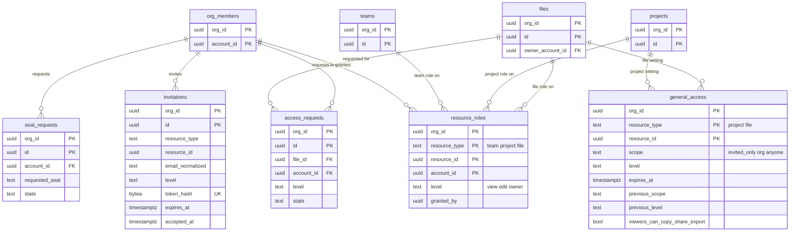

# Data model: 役割・共有・招待

[data-model.md](../data-model.md) の一部。規約は、そちらの 2 節に従う。振る舞いは [permissions-and-sharing.md](../permissions-and-sharing.md)、[ADR-0029](../../decisions/0029-hierarchy-roles-seats-and-link-access.md)〜[ADR-0031](../../decisions/0031-org-acl-version-and-connection-revalidation.md) を正とする。

すべて `app` スキーマのテナントの表（`org_id`、複合キー、FORCE RLS）。この節の表への書き込みは、すべて同じトランザクションで `orgs.acl_version` を 1 上げ、監査ログ（`audit_events`）と outbox の `acl.changed` を書く（data-model.md の I-6）。例外は `access_requests`・`seat_requests` の作成（申請は権限を変えない）。

## 1. ER 図

`resource_roles`・`general_access` は多態の参照（`resource_type` と `resource_id`）なので、DB の外部キーを張れない。書き込むサービス関数が、同じ組織に資源があることを確かめる。資源を消すとき（チームの削除の期限、ファイルの完全な削除）は、同じトランザクションで行を消す。

## 2. 表

### resource_roles

チーム・プロジェクト・ファイルに付けた個人の役割。上位の役割は下位へ届き、下位で下げない（ADR-0029）。

| 列 | 型 | NULL | 既定 | 説明 |
| --- | --- | --- | --- | --- |
| `org_id` | `uuid` | NO | | |
| `resource_type` | `text` | NO | | `team`・`project`・`file` |
| `resource_id` | `uuid` | NO | | |
| `account_id` | `uuid` | NO | | 役割を持つ人（メンバーかゲスト） |
| `level` | `text` | NO | | `view_prototype`（MVP の後）・`view`・`edit`・`owner` |
| `granted_by` | `uuid` | NO | | |
| `created_at`・`updated_at` | `timestamptz` | NO | `now()` | |

- 主キー：`(org_id, resource_type, resource_id, account_id)`。
- 外部キー：`(org_id, account_id)` → `org_members`。
- CHECK：`resource_type IN (...)`、`level IN (...)`、`NOT (resource_type = 'file' AND level = 'owner')`。ファイルの所有者は `files.owner_account_id` だけで表す（二重に持たない。data-model.md の 9.1 節の D-12）。チーム・プロジェクトの `owner` は `admin` の役割を写したもの。
- 索引：
  - 主キー：判定関数の段階 2（資源ごとの役割）、共有の画面（`fileAccess(file_id)`）。
  - `(org_id, account_id, resource_type)`：`readableScopes`（役割を持つチーム・プロジェクト・ファイル。[search.md](../search.md) の 3.3 節）。
- S1 の規模：約 500 万行（仮定）。

### general_access

プロジェクトとファイルの一般アクセス。チームには置かない（[permissions-and-sharing.md](../permissions-and-sharing.md) の 3.3 節）。ファイルの行がなければ、プロジェクトの行から届く。行がなければ「招待した人だけ」と同じ。

| 列 | 型 | NULL | 既定 | 説明 |
| --- | --- | --- | --- | --- |
| `org_id` | `uuid` | NO | | |
| `resource_type` | `text` | NO | | `project`・`file` |
| `resource_id` | `uuid` | NO | | |
| `scope` | `text` | NO | | `invited_only`・`org`・`anyone`。ファイルの `invited_only` は上位の一般アクセスを遮る |
| `level` | `text` | YES | | `view`・`edit`（`view_prototype` は MVP の後）。`invited_only` では NULL |
| `expires_at` | `timestamptz` | YES | | `anyone` の期限（有料のプラン。1 時間〜1 年） |
| `previous_scope`・`previous_level` | `text` | YES | | 期限の前の設定。期限で戻す先 |
| `viewers_can_copy_share_export` | `boolean` | NO | `true` | 閲覧者に複製・共有・書き出しを許す |
| `updated_by` | `uuid` | NO | | |
| `updated_at` | `timestamptz` | NO | `now()` | |

- 主キー：`(org_id, resource_type, resource_id)`。
- CHECK：`resource_type IN ('project','file')`、`scope IN (...)`、`(scope = 'invited_only') = (level IS NULL)`、`expires_at IS NULL OR scope = 'anyone'`、`previous_scope IS NULL OR previous_scope <> 'anyone'`。
- 索引：
  - 主キー：判定関数の段階 1。
  - `(org_id, scope, resource_type) WHERE scope = 'org'`：`readableScopes` の「一般アクセスが `org` の資源」。
  - `(expires_at) WHERE expires_at IS NOT NULL`：1 分ごとの期限のスケジューラー（`scheduler_due_items('general_access_expiry', …)`）。期限の過ぎた行を `previous_*` に戻す。
- 期限：判定の時点で `expires_at < now()` なら無効とみなす。スケジューラーの前でも後でも届かない（PROP の「期限」）。
- S1 の規模：約 100 万行（仮定）。

### invitations

チーム・プロジェクト・ファイルへのメールの招待。既存のアカウントには、招待と同時に `resource_roles` を作る（[permissions-and-sharing.md](../permissions-and-sharing.md) の 6.1 節）。

| 列 | 型 | NULL | 既定 | 説明 |
| --- | --- | --- | --- | --- |
| `org_id`・`id` | `uuid` | NO | | 主キー |
| `resource_type` | `text` | NO | | `team`・`project`・`file` |
| `resource_id` | `uuid` | NO | | |
| `email_normalized` | `text` | NO | | 小文字にしたメールアドレス |
| `level` | `text` | NO | | `view`・`edit` |
| `role_on_accept` | `text` | NO | | 受け入れで作る組織の行の役割（`member`・`guest`。確認済みのドメインで決める） |
| `token_hash` | `bytea` | NO | | 256 ビットの乱数のトークンの SHA-256 |
| `invited_by` | `uuid` | NO | | |
| `expires_at` | `timestamptz` | NO | | 作成から 30 日 |
| `accepted_at`・`accepted_account_id` | `timestamptz`・`uuid` | YES | | 1 回だけ |
| `revoked_at` | `timestamptz` | YES | | 取り消し |
| `created_at` | `timestamptz` | NO | `now()` | |

- 主キー：`(org_id, id)`。
- 一意：`UNIQUE (token_hash)`（組織をまたぐ引き当て。`accept_invitation` の関数だけが使う）。
- CHECK：`resource_type IN (...)`、`level IN ('view','edit')`、`role_on_accept IN ('member','guest')`、`accepted_at IS NULL OR revoked_at IS NULL`。
- 索引：`(org_id, resource_type, resource_id) WHERE accepted_at IS NULL AND revoked_at IS NULL`（共有の画面の保留中の招待）、`(org_id, invited_by, created_at)`（1 人 1 時間 100 件の上限）。
- 保持：受け入れ・取り消し・期限切れから 90 日で消す。
- S1 の規模：約 50 万行。

### access_requests

ファイルへのアクセスの申請（[permissions-and-sharing.md](../permissions-and-sharing.md) の 6.4 節）。

| 列 | 型 | NULL | 既定 | 説明 |
| --- | --- | --- | --- | --- |
| `org_id`・`id` | `uuid` | NO | | 主キー |
| `file_id` | `uuid` | NO | | |
| `account_id` | `uuid` | NO | | 申請した人（組織の行がまだないこともある） |
| `level` | `text` | NO | | `view`・`edit` |
| `state` | `text` | NO | `'pending'` | `pending`・`approved`・`denied`・`cancelled` |
| `decided_by`・`decided_at` | `uuid`・`timestamptz` | YES | | |
| `created_at` | `timestamptz` | NO | `now()` | |

- 主キー：`(org_id, id)`。外部キー：`(org_id, file_id)` → `files ON DELETE CASCADE`。
- 一意：`UNIQUE (org_id, file_id, account_id) WHERE state = 'pending'`。
- CHECK：`level IN (...)`、`state IN (...)`、`(state = 'pending') = (decided_at IS NULL)`。
- 索引：`(org_id, file_id) WHERE state = 'pending'`（共有の画面）、`(org_id, account_id, file_id, created_at DESC)`（24 時間に 1 回の上限）。
- 申請者はまだ組織の行を持たないことがあるので、`account_id` に `org_members` への外部キーを張らない。
- 保持：決定から 90 日で消す。S1 の規模：約 10 万行。

### seat_requests

Full のシートの申請（[permissions-and-sharing.md](../permissions-and-sharing.md) の 4.4 節の 5・6 行目）。

| 列 | 型 | NULL | 既定 | 説明 |
| --- | --- | --- | --- | --- |
| `org_id`・`id` | `uuid` | NO | | 主キー |
| `account_id` | `uuid` | NO | | |
| `requested_seat` | `text` | NO | `'full'` | MVP は `full` だけ |
| `file_id` | `uuid` | YES | | 申請のきっかけになったファイル（通知の文脈） |
| `state` | `text` | NO | `'pending'` | `pending`・`approved`・`denied` |
| `decided_by`・`decided_at` | `uuid`・`timestamptz` | YES | | |
| `created_at` | `timestamptz` | NO | `now()` | |

- 主キー：`(org_id, id)`。外部キー：`(org_id, account_id)` → `org_members`。
- 一意：`UNIQUE (org_id, account_id) WHERE state = 'pending'`。
- 索引：`(org_id, created_at DESC) WHERE state = 'pending'`（管理者の画面）。
- 承認は同じトランザクションで `org_members.seat = 'full'` と `acl_version` を書く。
- 保持：決定から 1 年で消す。S1 の規模：数万行。
