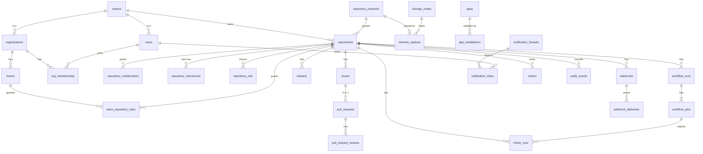

# Data model: GitHub

データモデルの正本。どこに何を置くか、テーブルの規則、ER 図、全テーブルの定義、Aurora の外の置き場所（Git・Valkey・S3・検索の索引）、横断の不変条件をまとめる。

- メタデータの正本は Aurora PostgreSQL、リポジトリの中身の正本は Git（[ADR-0005](../decisions/0005-git-as-source-of-truth.md)）。
- 権限はテナントの RLS ではなく、リポジトリの単位の判定関数 `can()` で守る（[ADR-0002](../decisions/0002-repository-permission-model.md)）。
- 各領域の文書は、振る舞いと理由を書く。テーブルの名前と列は、この文書と下の各ファイルを正とする。領域の文書の列の記述と食い違ったら、ここに合わせて直す。
- 実装の変更（`changes/`）でマイグレーションを書くときは、この文書を先に直す。

テーブルの定義は分量が多いので、領域ごとのファイルに分けた。

| 領域 | ファイル | テーブル |
| --- | --- | --- |
| アカウント・Organization・チーム・資格情報 | [data-model/identity.md](data-model/identity.md) | 26 |
| リポジトリと fork のネットワーク | [data-model/repositories.md](data-model/repositories.md) | 11 |
| Git のストレージのメタデータ | [data-model/git-storage-metadata.md](data-model/git-storage-metadata.md) | 13 |
| Issue | [data-model/issues.md](data-model/issues.md) | 14 |
| Pull Request とレビュー | [data-model/pull-requests.md](data-model/pull-requests.md) | 9 |
| ruleset・merge queue・チェック | [data-model/rulesets-and-checks.md](data-model/rulesets-and-checks.md) | 10 |
| Actions | [data-model/actions.md](data-model/actions.md) | 20 |
| リリース | [data-model/releases.md](data-model/releases.md) | 2 |
| 通知 | [data-model/notifications.md](data-model/notifications.md) | 9 |
| App・OAuth・Webhook | [data-model/apps-and-webhooks.md](data-model/apps-and-webhooks.md) | 15 |
| 検索 | [data-model/search.md](data-model/search.md) | 5 |
| 連携・監査・削除 | [data-model/platform.md](data-model/platform.md) | 6 |
| Aurora の外（Git・Valkey・S3・索引・Event） | [data-model/non-relational.md](data-model/non-relational.md) | — |

合計 140 テーブル。ER 図は領域ごとの 15 と全体の 1 の、計 16。Packages は MVP の外（[intent.md](../intent.md) の Non-goals）なので持たない。

## 1. 置き場所

| 置き場所 | 置くもの | 正本か | 失ったとき |
| --- | --- | --- | --- |
| Aurora PostgreSQL 18（東京。大阪は Global Database の二次） | アカウント、権限、Issue・PR・レビュー、ruleset、Actions の実行とジョブ、Webhook の設定と配信の記録、監査ログ、ルーティングの表、ref の写し | メタデータの正本。ref の写しは正本ではない | PITR とバックアップ（35 日）から戻す |
| Git のストレージ（ストレージのノードのローカル NVMe、3 つの複製） | objects、ref、ネットワークの共有の objects、ref のチェックサムのファイル | 中身の正本 | 残りの複製から作り直す。3 つとも失えば大阪の S3 のバックアップから戻す（[ADR-0003](../decisions/0003-replicated-git-storage.md)、[ADR-0032](../decisions/0032-disaster-recovery-strategy.md)） |
| Valkey（ElastiCache） | 権限の判定のキャッシュ、レート制限、Actions のキューの順番とライブのログ、差分の統計のキャッシュ、短いロック | 正本ではない | 作り直す。判定は DB を直接読む（fail-open にしない） |
| S3 | LFS、Git のバックアップ（大阪）、Actions のログ・成果物・キャッシュ、差分の本文のキャッシュ、bundle、Webhook のペイロード、コード検索のシャード、リリースの成果物、添付、受信のメール、アクセスログ | LFS・成果物・リリースの成果物・添付は正本。キャッシュ・シャードは正本ではない | 正本のものはバージョニングと大阪への複製で守る |
| OpenSearch | Issue・PR・リポジトリの検索の索引 | 正本ではない | DB と Git から作り直す |
| Zoekt（索引のノードのローカル NVMe、2 つの複製） | コード検索のシャード | 正本ではない | S3 のシャードか Git から作り直す（[ADR-0014](../decisions/0014-code-search-engine.md)） |

- Aurora は 1 つのクラスタ（メタデータ）から始める。受信箱の書き込みが writer を圧迫したら、通知だけのクラスタに分ける（[notifications.md](notifications.md) の 6.1 節）。
- S3（段階）では、リポジトリに属するテーブル（下の「権限の区分」が R のもの）はリポジトリのホームのリージョンに、アカウント・Organization・トークンなどはグローバルに置く（[ADR-0034](../decisions/0034-multi-region-repository-placement.md)。proposed）。

## 2. テーブルの規則

### 2.1 ID

- 主キーは `id bigint GENERATED ALWAYS AS IDENTITY`。REST・Webhook に数値の `id` として出す。
- GraphQL と REST の `node_id`（型と `id` を符号化した不透明な文字列）は、読み取りのときに計算する。列として持たない（[api-and-webhooks.md](api-and-webhooks.md) の 3.1 節）。
- ユーザーと Organization は、共通の名前空間 `owners` の `id` をそのまま使う（`users.id = owners.id`、`organizations.id = owners.id`）。
- 外に出す一意の文字列が要るもの（Webhook の配信の GUID、ref のトランザクション）は `uuid` にする。
- S3（段階）で複数のリージョンが ID を採番するときは、IDENTITY の範囲をリージョンごとに分ける（上位のビットをリージョンに割り当てる）。S1・S2 は 1 つの範囲で始める。
- Better Auth のテーブル（`users` を除く）は Better Auth の形式の文字列の ID を使う。`users.id` は数値の ID にする設定を使う（バージョンを固定するときに確かめる。[ADR-0019](../decisions/0019-authentication-and-token-model.md)）。

### 2.2 名前と型

| 対象 | 規則 |
| --- | --- |
| テーブル | snake_case の複数形。対応表は `a_b`（`issue_labels`） |
| 外部キー | `<単数形>_id`。リポジトリは必ず `repo_id`、持ち主は `owner_id` |
| 列挙 | `text` と `CHECK (x IN (...))`。PostgreSQL の enum 型は使わない（値の追加が移行を要するため） |
| SHA | `bytea`（SHA-1 は 20 バイト。SHA-256 のリポジトリを持つときは 32 バイト）。API と Event では 16 進の文字列 |
| 名前（login、リポジトリ名、ラベル名） | `citext`。大文字小文字を区別せずに一意 |
| 可変の中身 | `jsonb`（Event の payload、ruleset の引数、実行計画） |
| 小さく上限のある一覧 | 配列（`text[]`、`bigint[]`）。上限のないものは子のテーブルにする |
| 時刻 | `timestamptz`、UTC。日付は `date` |
| 大きさ | `bigint` のバイト数（`*_bytes`） |

- 時刻の列は `created_at`（`DEFAULT now()`）、`updated_at`（アプリが書く）、状態の時刻は `<状態>_at`（`closed_at`、`merged_at`）。
- ER 図は Mermaid の制約から、配列の型を `bigint_array`・`text_array` と書く。定義の表では `bigint[]`・`text[]` と書く。

### 2.3 権限の区分とテナント

RLS は使わない。持ち主（ユーザー・Organization）は「テナント」ではない。公開のリポジトリは誰でも読み、1 人の利用者が多数の持ち主のリポジトリを読むため（[ADR-0002](../decisions/0002-repository-permission-model.md)）。代わりに、テーブルごとに次の区分を決め、各テーブルの定義に書く。

| 区分 | 意味 | 読み取りの経路 |
| --- | --- | --- |
| R | リポジトリのデータ。`repo_id` を持つ | `can(actor, <権限>, repo)`。一覧は `accessPredicate(actor)` を `WHERE` に入れて前段で絞る |
| A | 権限の材料（コラボレーター、チーム、所属など） | `packages/authz` の中からだけ読む。他のパッケージからの読み取りを lint で禁止する |
| O | Organization・持ち主の設定 | 持ち主（Organization の owner、個人は本人）の判定を通す |
| U | 利用者の個人のデータ | 本人だけ。運用者は break-glass |
| S | システムの内部（ルーティング、キュー、キャッシュの状態） | サービスのロールだけ。利用者の要求は、判定を通った上位の資源を経てだけ届く |
| P | 運用者（監査、削除、措置） | 運用者のロール。操作は `platform_audit_events` に残す |

- **R のテーブルは、すべて `repo_id` を持つ。** PR の子は base のリポジトリの `repo_id` を持つ。`packages/authz` の判定を経ずに R のテーブルを読むことを lint で禁止する（[ADR-0002](../decisions/0002-repository-permission-model.md)、[ADR-0018](../decisions/0018-repository-roles-and-permission-composition.md)）。
- **ネットワークの単位の表（`repository_networks`、`network_replicas`、`pull_request_merge_states`、`commit_verifications`、`lfs_objects`）は R ではなく S にする。** 複数のリポジトリで共有するので `repo_id` を持てない。利用者の要求は、リポジトリの `can()` を通ってから、そのリポジトリの `network_id` を使って読む。
- **2 つのリポジトリにまたがる行**（`sub_issues`、`issue_references`、`pull_requests` の head）は、両方の `repo_id` を持ち、見せる側と相手の側の両方を判定する（[issues.md](issues.md) の 5.2・6.2 節）。
- **所有の階層**：`owners` → `repositories` → リポジトリのデータ。Organization の単位のもの（チーム、Issue の種類、Organization の ruleset・Webhook・シークレット・ランナーのグループ）は `org_id` か `(scope, scope_id)` を持つ。

### 2.4 削除

- 利用者が消せて復元できるもの（リポジトリ）と、見えなくしてから消すもの（Issue・コメント・リリース）は `deleted_at` を持つ論理削除にする。一覧の索引は `WHERE deleted_at IS NULL` の部分索引にする。
- リポジトリは 90 日の後、消去のジョブが関係する行・S3・索引・複製を消す。Issue・コメントは日次の消去で消す（[ADR-0030](../decisions/0030-data-retention-and-deletion.md)）。
- 消去の対象は `repo_id`（と `network_id`）を持つテーブルの一覧としてスキーマの定義から得る。CI で消し漏れを検査する。
- アカウントの削除は、行を `users.state = 'deleted'` にして個人情報を消し、他人のリポジトリに残る書き込みの作者を ghost（`users.kind = 'ghost'` の 1 行）に付け替える。
- 削除の記録と名前の予約は [data-model/platform.md](data-model/platform.md) と [data-model/repositories.md](data-model/repositories.md) にある。

### 2.5 暗号化

[ADR-0028](../decisions/0028-encryption-and-key-management.md) に従う。

| 種類 | 列の形 | 例 |
| --- | --- | --- |
| 保存時の暗号化（全体） | 列には何もしない。Aurora は CMK `db` | すべて |
| アプリ層のエンベロープ暗号化 | `<名前>_ciphertext bytea` と `<名前>_dek bytea`（CMK `app-secrets` で包んだデータキー）、`key_version integer` | Webhook の秘密、TOTP の種、Actions のシークレットの秘密鍵、OAuth のクライアントの秘密 |
| ハッシュ | `<名前>_hash bytea`（SHA-256）。表示用に `token_prefix`・`last4` | PAT、OAuth・App のトークン、インストールのトークン、登録のトークン |
| パスワード | Argon2id の文字列（Better Auth の `accounts`） | — |

- 平文の秘密情報・トークンを、どのテーブル・ログ・監査の `metadata` にも置かない。Actions のシークレットは、利用者が公開鍵で暗号化した値（sealed box）だけを持つ。

### 2.6 パーティションと大きな表

| テーブル | 方式 | 古いものの扱い |
| --- | --- | --- |
| `notification_inbox` | `user_id` のハッシュで 64 | 日次のジョブで 3 か月より古い未保存の行を消す |
| `notification_deliveries` | `event_created_at` の日ごとの範囲 | 14 日で `DROP` |
| `webhook_deliveries`・`webhook_delivery_attempts` | 日ごとの範囲 | 本文は 3 日で S3 から消し、行は 30 日で `DROP` |
| `installation_tokens` | 時間ごとの範囲 | 期限の 1 日後に `DROP` |
| `audit_events`・`platform_audit_events` | 月ごとの範囲 | 180 日・90 日の後に `DROP`（アーカイブは S3 に 400 日） |
| `push_events` | 週ごとの範囲 | 5 週で `DROP` |
| `ruleset_evaluations` | 月ごとの範囲 | 180 日で `DROP` |
| `actions_usage` | 月ごとの範囲 | 13 か月で `DROP` |

- 更新の多いテーブルは `fillfactor` を下げて HOT 更新にする（`repository_refs` 70、`workflow_jobs` 80、`repository_checksums` 70）。[capacity.md](capacity.md) の 3.4 節。
- `DROP` は migrator のロールが行う。`app` のロールは `audit_events` を UPDATE・DELETE できない（[ADR-0029](../decisions/0029-audit-log.md)）。

### 2.7 トランザクションの規則

- **outbox は、元の変更と同じトランザクションで書く。** push の確定は `repository_checksums`・`push_events`・`outbox` を 1 つのトランザクションで書く（[git-storage.md](git-storage.md) の 5.2 節）。
- **権限の属性の変更と `search_exclusions` は同じトランザクション**（[ADR-0015](../decisions/0015-search-permission-filtering.md)）。
- **権限の変更と `permission_epochs` の世代の更新は同じトランザクション**（[identity-and-permissions.md](identity-and-permissions.md) の 9 節）。
- **管理の操作と `audit_events` は同じトランザクション**（[ADR-0029](../decisions/0029-audit-log.md)）。
- Issue・PR の作成のトランザクションは、`repositories` の行のロックを取るので短く保つ（参照の抜き出し、通知、索引は outbox の後。[ADR-0017](../decisions/0017-shared-issue-numbering.md)）。

## 3. 全体の ER 図

領域をまたぐ主な関係だけを描く。領域ごとの詳しい図は各ファイルにある。

- `issues` と `pull_requests` は 1 対 0..1（`pull_requests.issue_id` が主キー）。`repositories` と `repository_checksums` は 1 対 1。どちらも図の記法の制約で `||--o{` で描いた。

## 4. 横断の不変条件

実装とテストで守る性質。テストの名前には、spec に移すときに振る `PROP-...` を含める。

| # | 不変条件 | 守る仕組み | 出典 |
| --- | --- | --- | --- |
| 1 | 成功を返した push は、2 つ以上の複製の ref と `repository_checksums.checksum` に反映されている | 3 相の手順。2 票以上の `ok` と 2 つ以上の `ack` の後に DB を確定し、その後にだけ成功を返す | [ADR-0006](../decisions/0006-ref-update-consensus.md)、[git-storage.md](git-storage.md) の 5 節 |
| 2 | 同じリポジトリの ref の更新は `version` で全順序を持ち、`push_events` と outbox の `repository.refs_updated` は `version` の順に 1 対 1 | `repository_checksums` の `pending_version` の CAS。確定と outbox を同じトランザクションで書く | [ADR-0006](../decisions/0006-ref-update-consensus.md) |
| 3 | 修復の後、`healthy` の複製のチェックサムは DB の `checksum` と等しい。読み取りは DB と一致する複製からだけ返す | 読み取りの要求にチェックサムを渡し、ノードが `NOT_IN_SYNC` を返す | [git-storage.md](git-storage.md) の 4.3・6 節 |
| 4 | 1 つのネットワークの複製は、異なる 3 つの AZ の 3 つのノードにある。同じネットワークのリポジトリは同じノードにある | 配置の関数。`network_replicas` の書き込みは配置の関数だけが行う | [ADR-0007](../decisions/0007-fork-network-object-sharing.md) |
| 5 | 1 つのネットワークの公開の種類は 1 つ（`repository_networks.visibility_class` と、属するリポジトリの `visibility` が一致する） | 公開の種類の変更は、ネットワークの分割が済むまで完了にしない | [ADR-0007](../decisions/0007-fork-network-object-sharing.md)、[identity-and-permissions.md](identity-and-permissions.md) の 6 節 |
| 6 | 非公開のネットワークでは、要求したリポジトリの ref から到達できない objects を、Git・Web・API のどれからも返さない | `gitd` の到達可能性の検査（commit-graph とビットマップ、`(repo_id, checksum, sha)` のキャッシュ） | [ADR-0007](../decisions/0007-fork-network-object-sharing.md) の 2026-09-28 の注記、[git-storage.md](git-storage.md) の 7.2 節 |
| 7 | Issue と PR の番号は、リポジトリの中で一意で、再利用しない。失敗した作成で欠番を出さない | `repositories.next_issue_number` を作成のトランザクションの中で `UPDATE ... RETURNING` で進める。`UNIQUE (repo_id, number)`。移動の元の番号は `issue_redirects` に残す | [ADR-0017](../decisions/0017-shared-issue-numbering.md) |
| 8 | DB の ref・SHA の写し（`repository_refs`、`pull_requests` の SHA、`code_index_state`）は正本ではない。マージの判定は Git の現在の ref で行う | 写しは `version` の順の Event で更新し、飛びは Git から作り直す | [ADR-0005](../decisions/0005-git-as-source-of-truth.md)、[pull-requests.md](pull-requests.md) の 6.2 節 |
| 9 | R のテーブルの行は、`can()` が読み取りを許す主体にだけ返る。一覧・検索は前段で絞る | `repo_id` の必須、lint、`accessPredicate`、`canMany`・`filterActorsCanRead` の一致の性質ベーステスト | [ADR-0002](../decisions/0002-repository-permission-model.md)、[ADR-0015](../decisions/0015-search-permission-filtering.md) |
| 10 | `search_exclusions` の未処理の行のリポジトリ・Issue は、どの検索にも出ない | 権限の属性の変更と同じトランザクションで行を書き、全ての検索が `must_not` に入れる | [ADR-0015](../decisions/0015-search-permission-filtering.md) |
| 11 | 1 つのジョブは 1 つのランナーにだけ渡る | `workflow_jobs` の状態の条件付き更新 | [ADR-0024](../decisions/0024-job-scheduling-and-fairness.md) |
| 12 | 受信箱の行は、古いイベントで新しい状態を上書きしない。1 イベントで 1 人に送るメールは最大 1 通 | `notification_inbox.last_event_id` の比較。`notification_deliveries` の主キー | [ADR-0016](../decisions/0016-notification-fanout.md) |
| 13 | 管理の操作は、成功すれば必ず `audit_events` に 1 件ある | 同じトランザクション。`app` のロールの UPDATE・DELETE の禁止 | [ADR-0029](../decisions/0029-audit-log.md) |

## 5. 段階ごとの変化

| 段階 | 変化 |
| --- | --- |
| S1 | 1 つの Aurora のクラスタ。受信箱は同じクラスタでハッシュの 64 分割 |
| S2 | 受信箱を通知だけのクラスタ（または DynamoDB。E10 で決める）に分ける。実効のロールの事前計算の表 `effective_repo_roles` を測って採るか決める（[identity-and-permissions.md](identity-and-permissions.md) の 13 節）。Enterprise のテーブル（`enterprises`、`enterprise_memberships`、`credential_sso_authorizations`）を有効にする |
| S3 | R のテーブルをリポジトリのホームのリージョンに、それ以外を Aurora Global Database に置く（[ADR-0034](../decisions/0034-multi-region-repository-placement.md)。proposed）。`network_replicas.voting = false` の読み取りの複製を他のリージョンに置く |
