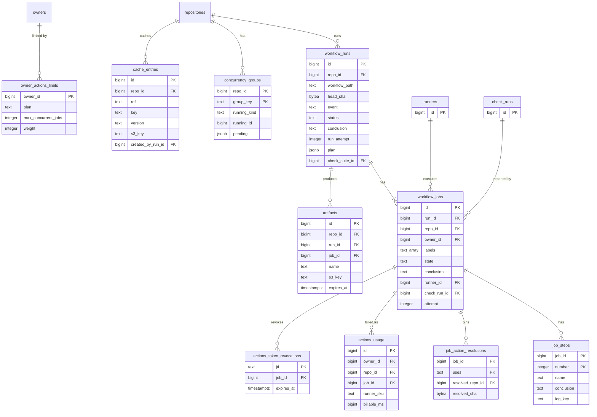
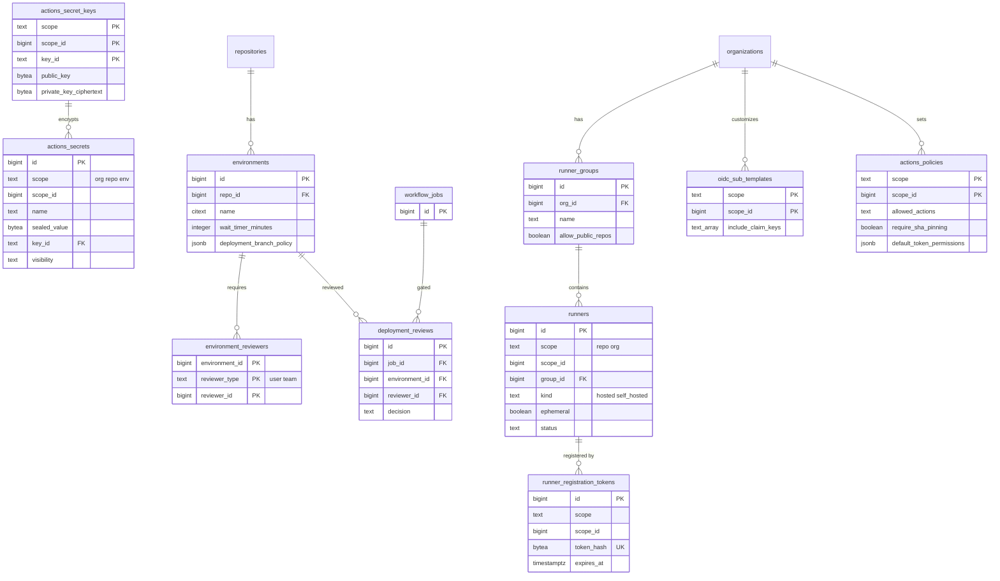

# Data model: Actions

[data-model.md](../data-model.md) の一部。振る舞いは [actions.md](../actions.md)、決定は [ADR-0024](../../decisions/0024-job-scheduling-and-fairness.md)・[ADR-0025](../../decisions/0025-secrets-and-fork-pr-policy.md)・[ADR-0026](../../decisions/0026-actions-oidc-provider.md)・[ADR-0027](../../decisions/0027-artifact-and-cache-storage.md)。

- すべてのテーブルは `repo_id`（リポジトリの範囲）か `(scope, scope_id)`（Organization・リポジトリ・環境の範囲）を持つ。読み取りは `can()` を通す。
- **キューの正本は `workflow_jobs` の `state = 'queued'` の行。** 配る順番は Valkey の上で計算し、失ったら DB から作り直す（ADR-0024）。
- シークレットの平文、`<BRAND>_TOKEN`、ジョブトークン、OIDC のトークンは、どのテーブルにも置かない。トークンは失効の表（`actions_token_revocations`）と、`installation_tokens`（`<BRAND>_TOKEN` は組み込みの App のインストールのトークン。[apps-and-webhooks.md](apps-and-webhooks.md)）だけを持つ。
- ログ・成果物・キャッシュの中身は S3（[non-relational.md](non-relational.md) の 3 節）。テーブルはメタデータだけ。
- S1 の行数：ジョブの開始 1 日 15 万件、実行 1 日 5 万件、保持 90 日（非公開は最長 400 日）からの見積もり。

## ER 図

### 実行・ジョブ・成果物

### シークレット・環境・ランナー・方針

- `actions_secrets`・`actions_secret_keys`・`oidc_sub_templates`・`actions_policies` は `(scope, scope_id)` の多態の参照で、Organization にもリポジトリにも付く。図では Organization への線だけを描いた。

## テーブル

### `workflow_runs`

ワークフローの実行。再実行は `run_attempt` を増やす。出典：[actions.md](../actions.md) の 3・4.1・15 節。

- 区分：R（`actions:read`）／分割：なし／保持：リポジトリの成果物の保持の設定（既定 90 日）の後に消す（本家は 2026-10-01 から実行の記録にも保持を広げる）／S1：450 万行

| 列 | 型 | NULL | 既定 | 説明 |
| --- | --- | --- | --- | --- |
| `id` | bigint | NO | IDENTITY | |
| `repo_id` | bigint | NO | | |
| `workflow_path` | text | NO | | `.<brand>/workflows/ci.yml` |
| `head_sha` | bytea | NO | | ワークフローを読んだコミット |
| `head_ref` | text | YES | | |
| `event` | text | NO | | `push`・`pull_request` など |
| `pull_request_id` | bigint | YES | | 契機の PR |
| `from_fork` | boolean | NO | false | fork の PR からの実行（シークレットを渡さない） |
| `actor_id` | bigint | NO | | |
| `trigger_actor_id` | bigint | NO | | 再実行した人 |
| `status` | text | NO | `'requested'` | `requested`・`queued`・`pending`・`in_progress`・`completed`・`action_required` |
| `conclusion` | text | YES | | `success`・`failure`・`cancelled`・`skipped`・`timed_out`・`action_required`・`startup_failure`・`neutral` |
| `run_attempt` | integer | NO | 1 | 50 まで |
| `plan` | jsonb | YES | | 実行計画（ジョブのグラフ、静的な値、参照するシークレットの名前）。`startup_failure` は NULL |
| `concurrency_group` | text | YES | | |
| `check_suite_id` | bigint | YES | | |
| `created_at` | timestamptz | NO | now() | |
| `updated_at` | timestamptz | NO | now() | |

- PK：`id`。FK：`repo_id` → `repositories.id`、`check_suite_id` → `check_suites.id`、`pull_request_id` → `pull_requests.issue_id`。
- CHECK：`run_attempt BETWEEN 1 AND 50`、`(status = 'completed') = (conclusion IS NOT NULL)`。
- 索引：`(repo_id, created_at DESC)` — 実行の一覧。`(repo_id, workflow_path, created_at DESC)` — ワークフローごとの一覧。`(created_at) WHERE status <> 'completed'` — 35 日の上限の取り消し。

### `workflow_jobs`

ジョブ。`queued` の行がキューの正本。状態の遷移は条件付き更新で行う。出典：同 4.2・5 節、[ADR-0024](../../decisions/0024-job-scheduling-and-fairness.md)。

- 区分：R／分割：なし（S2 で `owner_id` のハッシュ。Scheduler の区画に合わせる）／保持：実行と一緒に消す／S1：1,350 万行（`queued` は常時数千）

| 列 | 型 | NULL | 既定 | 説明 |
| --- | --- | --- | --- | --- |
| `id` | bigint | NO | IDENTITY | |
| `run_id` | bigint | NO | | |
| `repo_id` | bigint | NO | | |
| `owner_id` | bigint | NO | | 同時実行の上限と公平の単位 |
| `name` | text | NO | | |
| `matrix` | jsonb | YES | | 展開した値 |
| `labels` | text[] | NO | | `runs-on` |
| `runner_kind` | text | NO | | `hosted`・`self_hosted` |
| `state` | text | NO | `'created'` | `created`・`waiting`・`queued`・`assigned`・`in_progress`・`completed`・`skipped` |
| `conclusion` | text | YES | | 加えて `runner_lost` |
| `environment_id` | bigint | YES | | |
| `needs` | bigint[] | NO | `'{}'` | 待つジョブ |
| `runner_id` | bigint | YES | | |
| `attempt` | integer | NO | 1 | |
| `check_run_id` | bigint | YES | | |
| `queued_at` | timestamptz | YES | | FIFO の順 |
| `assigned_at` | timestamptz | YES | | 60 秒以内の受け取りの確認 |
| `last_heartbeat_at` | timestamptz | YES | | 5 分の途絶で `runner_lost` |
| `started_at` | timestamptz | YES | | |
| `completed_at` | timestamptz | YES | | |
| `created_at` | timestamptz | NO | now() | |

- PK：`id`。FK：`run_id` → `workflow_runs.id`（CASCADE）、`runner_id` → `runners.id`（`SET NULL`）、`check_run_id` → `check_runs.id`、`environment_id` → `environments.id`。`fillfactor = 80`。
- CHECK：`state IN (...)`、`state <> 'assigned' OR (runner_id IS NOT NULL AND assigned_at IS NOT NULL)`。
- 索引：
  - `(labels, owner_id, queued_at) WHERE state = 'queued'` — キューの作り直しと、持ち主の中の FIFO。
  - `(owner_id) WHERE state IN ('assigned','in_progress') AND runner_kind = 'hosted'` — 持ち主ごとの同時実行の数。
  - `(assigned_at) WHERE state = 'assigned'`、`(last_heartbeat_at) WHERE state = 'in_progress'` — 監視。
  - `(run_id)`。
- 割り当て：`UPDATE workflow_jobs SET state = 'assigned', runner_id = $r, assigned_at = now() WHERE id = $j AND state = 'queued'`（1 つのジョブを 2 つのランナーに渡さない）。

### `job_steps`

ジョブのステップ。ログは S3 のステップごとのオブジェクト。出典：同 9.1・10.1 節。

- 区分：R／分割：なし／保持：ジョブと一緒に消す／S1：1 億 3,500 万行

| 列 | 型 | NULL | 既定 | 説明 |
| --- | --- | --- | --- | --- |
| `job_id` | bigint | NO | | |
| `number` | integer | NO | | 1 から |
| `name` | text | NO | | |
| `state` | text | NO | `'pending'` | `pending`・`in_progress`・`completed` |
| `conclusion` | text | YES | | |
| `started_at` | timestamptz | YES | | |
| `completed_at` | timestamptz | YES | | |
| `log_key` | text | YES | | `logs/{repo_id}/{run_id}/{job_id}/{attempt}/{step}.log.zst` |

- PK：`(job_id, number)`。FK：`job_id` → `workflow_jobs.id`（CASCADE）。

### `job_action_resolutions`

`uses:` を配る直前に SHA に解決した記録。再実行でも同じ SHA を使う。出典：同 12 節。

- 区分：R／分割：なし／保持：ジョブと一緒に消す／S1：4,000 万行

| 列 | 型 | NULL | 既定 | 説明 |
| --- | --- | --- | --- | --- |
| `job_id` | bigint | NO | | |
| `uses` | text | NO | | `owner/repo@ref` |
| `resolved_repo_id` | bigint | NO | | |
| `resolved_sha` | bytea | NO | | |

- PK：`(job_id, uses)`。FK：`job_id` → `workflow_jobs.id`（CASCADE）。

### `concurrency_groups`

`concurrency` のグループ。1 行の行ロックで順序を決める。出典：同 4.3 節。

- 区分：R／分割：なし／保持：空になって 7 日で消す／S1：50 万行

| 列 | 型 | NULL | 既定 | 説明 |
| --- | --- | --- | --- | --- |
| `repo_id` | bigint | NO | | |
| `group_key` | text | NO | | 式を評価した文字列 |
| `running_kind` | text | YES | | `run`・`job` |
| `running_id` | bigint | YES | | `in_progress` の実行かジョブ |
| `pending` | jsonb | NO | `'[]'` | 待ち。既定 1、`queue: max` で 100 まで |
| `updated_at` | timestamptz | NO | now() | |

- PK：`(repo_id, group_key)`。CHECK：`(running_kind IS NULL) = (running_id IS NULL)`。

### `owner_actions_limits`

持ち主ごとの同時実行の上限と公平の重み。出典：同 5.1 節。

- 区分：P（運用者が引き上げる）／分割：なし／保持：持ち主と一緒に消す／S1：330 万行（行がなければプランの既定）

| 列 | 型 | NULL | 既定 | 説明 |
| --- | --- | --- | --- | --- |
| `owner_id` | bigint | NO | | |
| `plan` | text | NO | `'free'` | `free`・`pro`・`team`・`enterprise` |
| `max_concurrent_jobs` | integer | NO | 20 | 20・40・60・500 |
| `weight` | integer | NO | 1 | Deficit Round Robin の重み |
| `suspended_at` | timestamptz | YES | | 濫用で止めた |
| `suspended_reason` | text | YES | | |
| `updated_at` | timestamptz | NO | now() | |

- PK：`owner_id`。FK：`owner_id` → `owners.id`。

### `artifacts`

成果物のメタデータ。不変。出典：同 10.3 節、[ADR-0027](../../decisions/0027-artifact-and-cache-storage.md)。

- 区分：R／分割：なし／保持：`expires_at` で削除のジョブが S3 と一緒に消す（S3 のライフサイクルは 401 日の上限）／S1：2,000 万行

| 列 | 型 | NULL | 既定 | 説明 |
| --- | --- | --- | --- | --- |
| `id` | bigint | NO | IDENTITY | |
| `repo_id` | bigint | NO | | |
| `run_id` | bigint | NO | | |
| `job_id` | bigint | NO | | |
| `name` | text | NO | | |
| `size_bytes` | bigint | NO | | |
| `digest` | bytea | NO | | SHA-256 |
| `s3_key` | text | NO | | `artifacts/{repo_id}/{run_id}/{artifact_id}` |
| `from_fork` | boolean | NO | false | fork の PR の実行が作った（画面で印を付ける） |
| `expires_at` | timestamptz | NO | | 既定 90 日。公開 1〜90、非公開 1〜400 |
| `deleted_at` | timestamptz | YES | | |
| `created_at` | timestamptz | NO | now() | |

- PK：`id`。FK：`run_id` → `workflow_runs.id`、`job_id` → `workflow_jobs.id`。
- 索引：`(run_id)`、`(expires_at) WHERE deleted_at IS NULL` — 削除のジョブ。1 ジョブ 500 まで。

### `cache_entries`

依存のキャッシュ。範囲はリポジトリと ref の組。不変。出典：同 10.2 節。

- 区分：R（読み書きの範囲はジョブトークンで照合する）／分割：なし／保持：7 日使われないもの、リポジトリで 10 GB を超えた古いものを消す／S1：1,000 万行

| 列 | 型 | NULL | 既定 | 説明 |
| --- | --- | --- | --- | --- |
| `id` | bigint | NO | IDENTITY | |
| `repo_id` | bigint | NO | | |
| `ref` | text | NO | | 範囲。PR の実行は `refs/pull/N/merge` |
| `key` | text | NO | | |
| `version` | text | NO | | `path` と圧縮の方式のハッシュ |
| `size_bytes` | bigint | NO | | |
| `s3_key` | text | NO | | `caches/{repo_id}/{cache_id}` |
| `created_by_run_id` | bigint | NO | | 汚染の調査のため |
| `created_event` | text | NO | | |
| `created_sha` | bytea | NO | | |
| `last_accessed_at` | timestamptz | NO | now() | |
| `created_at` | timestamptz | NO | now() | |

- PK：`id`。UK：`(repo_id, ref, key, version)`。
- 索引：`(repo_id, ref, key text_pattern_ops)` — キーの前方一致の復元（`restore-keys`）。`(repo_id, last_accessed_at)` — 容量の追い出し。

### `actions_usage`

課金の分の記録。追記だけ。出典：同 14 節。

- 区分：O（持ち主の請求）／分割：`recorded_at` の月ごとの範囲／保持：13 か月／S1：2,000 万行

| 列 | 型 | NULL | 既定 | 説明 |
| --- | --- | --- | --- | --- |
| `id` | bigint | NO | IDENTITY | |
| `owner_id` | bigint | NO | | 請求の先（実行した人ではない） |
| `repo_id` | bigint | NO | | |
| `job_id` | bigint | YES | | 保存量の行は NULL |
| `kind` | text | NO | `'minutes'` | `minutes`・`artifact_storage`・`cache_storage` |
| `runner_sku` | text | YES | | `linux-2core` |
| `billable_ms` | bigint | YES | | 分へ切り上げた値 |
| `gb_hours` | numeric | YES | | 保存量 |
| `recorded_at` | timestamptz | NO | now() | |

- PK：`(id, recorded_at)`。索引：`(owner_id, recorded_at)` — 月の集計。非公開のリポジトリのホストされたランナーだけを記録する。

### `actions_token_revocations`

ジョブトークンの失効の表。ジョブの完了時に載せ、期限を過ぎたら消す。出典：同 6.6 節。

- 区分：S／分割：なし／保持：`expires_at` の後に消す／S1：常時 10 万行

| 列 | 型 | NULL | 既定 | 説明 |
| --- | --- | --- | --- | --- |
| `jti` | text | NO | | |
| `job_id` | bigint | NO | | |
| `expires_at` | timestamptz | NO | | トークンの期限 |
| `revoked_at` | timestamptz | NO | now() | |

- PK：`jti`。索引：`(expires_at)`。各サービスはこの表を短い間隔で読み、メモリに持つ。

### `actions_secrets`

シークレット。値は利用者が公開鍵で暗号化した sealed box のまま持つ。出典：同 6.1 節、[ADR-0025](../../decisions/0025-secrets-and-fork-pr-policy.md)。

- 区分：O・R（名前と更新日時だけを返す。値は Secrets service だけが復号する）／分割：なし／保持：削除で消す／S1：500 万行

| 列 | 型 | NULL | 既定 | 説明 |
| --- | --- | --- | --- | --- |
| `id` | bigint | NO | IDENTITY | |
| `scope` | text | NO | | `org`・`repo`・`env` |
| `scope_id` | bigint | NO | | Organization・リポジトリ・環境の ID |
| `repo_id` | bigint | YES | | `repo`・`env` のとき |
| `name` | text | NO | | |
| `sealed_value` | bytea | NO | | libsodium の sealed box。48 KB まで |
| `key_id` | text | NO | | 暗号化に使った公開鍵 |
| `visibility` | text | YES | | Organization のとき `all`・`private`・`selected` |
| `selected_repo_ids` | bigint[] | YES | | |
| `updated_at` | timestamptz | NO | now() | |

- PK：`id`。FK：`(scope, scope_id, key_id)` → `actions_secret_keys`。UK：`(scope, scope_id, name)`。
- CHECK：`scope IN (...)`、`(scope = 'org') = (visibility IS NOT NULL)`、`scope = 'org' OR repo_id IS NOT NULL`。上限は Organization 1,000、リポジトリ 100、環境 100。

### `actions_secret_keys`

sealed box の鍵の組。秘密鍵は `app-secrets` のエンベロープ暗号化。出典：同 6.1 節、[ADR-0028](../../decisions/0028-encryption-and-key-management.md)。

- 区分：S（公開鍵は API で返す。秘密鍵は Secrets service だけ）／分割：なし／保持：新しい鍵で全シークレットを入れ替えた後に消す／S1：130 万行

| 列 | 型 | NULL | 既定 | 説明 |
| --- | --- | --- | --- | --- |
| `scope` | text | NO | | `org`・`repo`・`env` |
| `scope_id` | bigint | NO | | |
| `key_id` | text | NO | | |
| `public_key` | bytea | NO | | |
| `private_key_ciphertext` | bytea | NO | | |
| `private_key_dek` | bytea | NO | | 包んだデータキー |
| `key_version` | integer | NO | 1 | |
| `created_at` | timestamptz | NO | now() | |

- PK：`(scope, scope_id, key_id)`。

### `environments`

デプロイの環境と保護の規則。出典：同 5.3 節。

- 区分：R（設定は admin）／分割：なし／保持：削除で消す／S1：50 万行

| 列 | 型 | NULL | 既定 | 説明 |
| --- | --- | --- | --- | --- |
| `id` | bigint | NO | IDENTITY | |
| `repo_id` | bigint | NO | | |
| `name` | citext | NO | | |
| `wait_timer_minutes` | integer | NO | 0 | 0〜43,200 |
| `deployment_branch_policy` | jsonb | YES | | デプロイできるブランチ・タグのパターン |
| `prevent_self_review` | boolean | NO | false | |
| `created_at` | timestamptz | NO | now() | |

- PK：`id`。FK：`repo_id` → `repositories.id`。UK：`(repo_id, name)`。CHECK：`wait_timer_minutes BETWEEN 0 AND 43200`。

### `environment_reviewers`

環境の必須のレビュアー（6 人またはチームまで）。

- 区分：R／分割：なし／保持：環境と一緒に消す／S1：30 万行

| 列 | 型 | NULL | 既定 | 説明 |
| --- | --- | --- | --- | --- |
| `environment_id` | bigint | NO | | |
| `reviewer_type` | text | NO | | `user`・`team` |
| `reviewer_id` | bigint | NO | | |

- PK：`(environment_id, reviewer_type, reviewer_id)`。FK：`environment_id` → `environments.id`（CASCADE）。

### `deployment_reviews`

`waiting` のジョブへの承認・否認。

- 区分：R／分割：なし／保持：ジョブと一緒に消す／S1：100 万行

| 列 | 型 | NULL | 既定 | 説明 |
| --- | --- | --- | --- | --- |
| `id` | bigint | NO | IDENTITY | |
| `job_id` | bigint | NO | | |
| `environment_id` | bigint | NO | | |
| `reviewer_id` | bigint | NO | | |
| `decision` | text | NO | | `approved`・`rejected` |
| `comment` | text | YES | | |
| `decided_at` | timestamptz | NO | now() | |

- PK：`id`。FK：`job_id` → `workflow_jobs.id`（CASCADE）、`environment_id` → `environments.id`。UK：`(job_id, reviewer_id)`。

### `runners`

ホストされたランナーとセルフホストのランナー。出典：同 9・11 節。

- 区分：R・O（登録の範囲の admin）／分割：なし／保持：エフェメラルは 1 日、永続は 14 日接続がなければ消す／S1：常時 5 万行

| 列 | 型 | NULL | 既定 | 説明 |
| --- | --- | --- | --- | --- |
| `id` | bigint | NO | IDENTITY | |
| `scope` | text | NO | | `repo`・`org`・`hosted`（ホストされたランナーのプール） |
| `scope_id` | bigint | YES | | `hosted` は NULL |
| `group_id` | bigint | YES | | |
| `name` | text | NO | | |
| `labels` | text[] | NO | | |
| `kind` | text | NO | | `hosted`・`self_hosted` |
| `ephemeral` | boolean | NO | false | ホストされたランナーは常に真 |
| `status` | text | NO | `'offline'` | `online`・`offline`・`busy` |
| `version` | text | YES | | エージェントのバージョン |
| `last_seen_at` | timestamptz | YES | | |
| `created_at` | timestamptz | NO | now() | |

- PK：`id`。FK：`group_id` → `runner_groups.id`。UK：`(scope, scope_id, name)`（`NULLS NOT DISTINCT`）。
- CHECK：`(scope = 'hosted') = (kind = 'hosted')`。
- 索引：`(last_seen_at)` — 接続のないランナーの削除。

### `runner_groups`

Organization のランナーのグループ。使えるリポジトリ・ワークフローを制限する。出典：同 11 節。

- 区分：O／分割：なし／保持：削除で消す／S1：5 万行

| 列 | 型 | NULL | 既定 | 説明 |
| --- | --- | --- | --- | --- |
| `id` | bigint | NO | IDENTITY | |
| `org_id` | bigint | NO | | |
| `name` | text | NO | | |
| `visibility` | text | NO | `'all'` | `all`・`selected` |
| `allowed_repo_ids` | bigint[] | NO | `'{}'` | |
| `allow_public_repos` | boolean | NO | false | 公開リポジトリのセルフホストのランナーは既定で使えない |
| `allowed_workflows` | text[] | NO | `'{}'` | 空はすべて |
| `created_at` | timestamptz | NO | now() | |

- PK：`id`。FK：`org_id` → `organizations.id`。UK：`(org_id, name)`。

### `runner_registration_tokens`

セルフホストのランナーの登録・削除のトークンと JIT の構成。

- 区分：S／分割：なし／保持：期限か使用の 1 日後に消す／S1：常時 1 万行

| 列 | 型 | NULL | 既定 | 説明 |
| --- | --- | --- | --- | --- |
| `id` | bigint | NO | IDENTITY | |
| `scope` | text | NO | | `repo`・`org` |
| `scope_id` | bigint | NO | | |
| `kind` | text | NO | | `registration`・`remove`・`jit` |
| `token_hash` | bytea | NO | | |
| `runner_id` | bigint | YES | | JIT で作ったランナー |
| `expires_at` | timestamptz | NO | | 1 時間 |
| `used_at` | timestamptz | YES | | |
| `created_by_id` | bigint | NO | | |

- PK：`id`。UK：`token_hash`。登録の速さは、範囲ごとに 5 分に 1,500 台まで。

### `oidc_sub_templates`

OIDC の `sub` に含める claim の設定。出典：同 7 節、[ADR-0026](../../decisions/0026-actions-oidc-provider.md)。

- 区分：O・R／分割：なし／保持：削除で消す／S1：1 万行

| 列 | 型 | NULL | 既定 | 説明 |
| --- | --- | --- | --- | --- |
| `scope` | text | NO | | `org`・`repo` |
| `scope_id` | bigint | NO | | |
| `use_default` | boolean | NO | true | |
| `include_claim_keys` | text[] | NO | `'{}'` | `repository_id`・`repository_owner_id` など |
| `updated_at` | timestamptz | NO | now() | |

- PK：`(scope, scope_id)`。

### `actions_policies`

Organization・リポジトリの Actions の方針。行がなければ既定。出典：同 6.3・6.4・6.5・10.3・12 節。

- 区分：O・R（admin）／分割：なし／保持：削除で消す／S1：20 万行

| 列 | 型 | NULL | 既定 | 説明 |
| --- | --- | --- | --- | --- |
| `scope` | text | NO | | `org`・`repo` |
| `scope_id` | bigint | NO | | |
| `enabled` | boolean | NO | true | |
| `allowed_actions` | text | NO | `'all'` | `all`・`local_only`・`selected` |
| `allowed_patterns` | text[] | NO | `'{}'` | |
| `blocked_patterns` | text[] | NO | `'{}'` | |
| `require_sha_pinning` | boolean | NO | false | |
| `default_token_permissions` | jsonb | NO | `'{"contents":"read"}'` | `<BRAND>_TOKEN` の既定の上限 |
| `fork_pr_approval` | text | NO | `'first_time_contributors'` | `first_time_new_users`・`first_time_contributors`・`all_outside_collaborators` |
| `private_fork_pr_runs` | boolean | NO | false | |
| `private_fork_pr_secrets` | boolean | NO | false | |
| `private_fork_pr_write_token` | boolean | NO | false | |
| `pull_request_target_allowed` | boolean | NO | false | 公開リポジトリでは既定で止める |
| `artifact_retention_days` | integer | NO | 90 | 公開 1〜90、非公開 1〜400 |
| `updated_at` | timestamptz | NO | now() | |

- PK：`(scope, scope_id)`。リポジトリの値は Organization の値より緩くできない（アプリで確かめる）。
