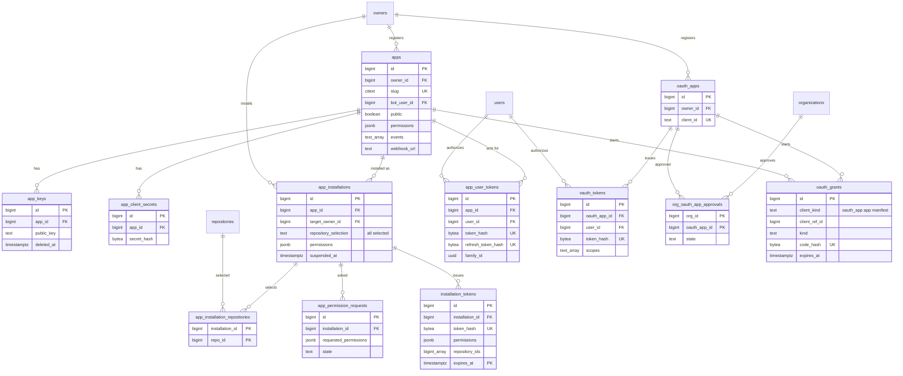
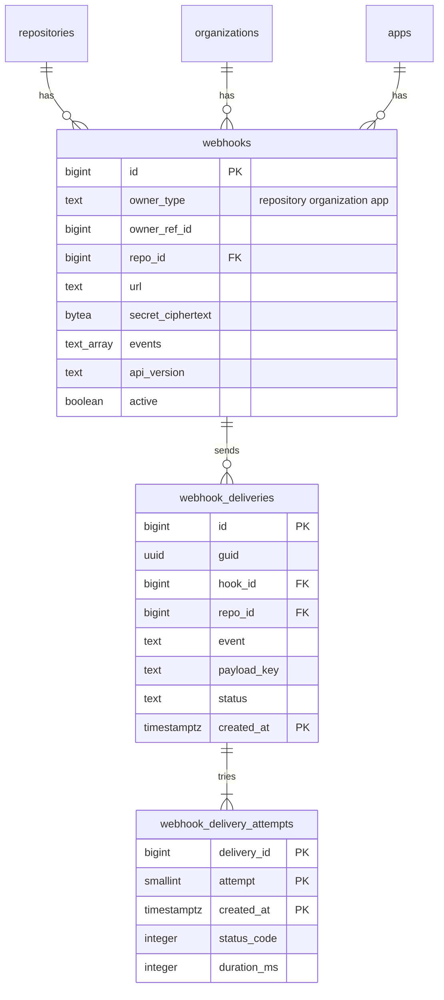

# Data model: App・OAuth・Webhook

[data-model.md](../data-model.md) の一部。振る舞いは [api-and-webhooks.md](../api-and-webhooks.md) の 7〜9・12 節、決定は [ADR-0020](../../decisions/0020-github-app-model.md)・[ADR-0022](../../decisions/0022-webhook-signing-and-delivery.md)・[ADR-0025](../../decisions/0025-secrets-and-fork-pr-policy.md)。

- App は「ロールを持たない主体」。インストールの権限 × インストールのリポジトリで決まる（区分 A として `packages/authz` が読む）。
- トークンは SHA-256 のハッシュだけを持つ。Webhook の秘密と OAuth のクライアントの秘密は `app-secrets` のエンベロープ暗号化。App の秘密鍵は保存しない（公開鍵だけ）。
- Actions の `<BRAND>_TOKEN` は、組み込みの App のインストールのトークンとして `installation_tokens` に載る（ADR-0025）。

## ER 図

### App と OAuth

### Webhook

## テーブル

### `apps`

App（本家の GitHub App に相当）。出典：[api-and-webhooks.md](../api-and-webhooks.md) の 7.1 節。

- 区分：O（公開の App の名前・説明は誰でも読める）／分割：なし／保持：削除で消す（インストールも消す）／S1：5 万行

| 列 | 型 | NULL | 既定 | 説明 |
| --- | --- | --- | --- | --- |
| `id` | bigint | NO | IDENTITY | JWT の `iss` |
| `owner_id` | bigint | NO | | ユーザーか Organization |
| `slug` | citext | NO | | |
| `name` | text | NO | | |
| `bot_user_id` | bigint | NO | | `<slug>[bot]` の利用者 |
| `public` | boolean | NO | false | 非公開は持ち主のアカウントにだけ入れられる |
| `builtin` | boolean | NO | false | Actions の組み込みの App |
| `permissions` | jsonb | NO | `'{}'` | 権限の名前と水準 |
| `events` | text[] | NO | `'{}'` | 購読する事象。要る権限を持つものだけ |
| `webhook_url` | text | YES | | `https` だけ |
| `webhook_secret_ciphertext` | bytea | YES | | |
| `webhook_secret_dek` | bytea | YES | | |
| `callback_urls` | text[] | NO | `'{}'` | |
| `client_id` | text | NO | | OAuth のフロー用 |
| `created_at` | timestamptz | NO | now() | |
| `updated_at` | timestamptz | NO | now() | |

- PK：`id`。FK：`owner_id` → `owners.id`、`bot_user_id` → `users.id`。UK：`slug`、`client_id`、`bot_user_id`。
- CHECK：`webhook_url IS NULL OR webhook_url LIKE 'https://%'`、`(webhook_url IS NULL) = (webhook_secret_ciphertext IS NULL)`（秘密は必須）。

### `app_keys`

App の公開鍵。秘密鍵は作成時に 1 回だけ渡し、保存しない。

- 区分：O／分割：なし／保持：削除の 30 日後に消す／S1：8 万行

| 列 | 型 | NULL | 既定 | 説明 |
| --- | --- | --- | --- | --- |
| `id` | bigint | NO | IDENTITY | |
| `app_id` | bigint | NO | | |
| `public_key` | text | NO | | PEM |
| `fingerprint_sha256` | text | NO | | |
| `created_at` | timestamptz | NO | now() | |
| `deleted_at` | timestamptz | YES | | |

- PK：`id`。FK：`app_id` → `apps.id`（CASCADE）。索引：`(app_id) WHERE deleted_at IS NULL` — JWT の検証。

### `app_client_secrets`

App のクライアントの秘密（ユーザーのトークンの取得に使う）。検証だけなのでハッシュで持つ。

- 区分：O／分割：なし／保持：削除で消す／S1：6 万行

| 列 | 型 | NULL | 既定 | 説明 |
| --- | --- | --- | --- | --- |
| `id` | bigint | NO | IDENTITY | |
| `app_id` | bigint | NO | | |
| `secret_hash` | bytea | NO | | |
| `last4` | text | NO | | |
| `last_used_at` | timestamptz | YES | | |
| `created_at` | timestamptz | NO | now() | |

- PK：`id`。FK：`app_id` → `apps.id`（CASCADE）。UK：`secret_hash`。

### `app_installations`

App × アカウントのインストール。出典：同 7.1 節。

- 区分：A（インストールした持ち主は O として設定を読み書きする）／分割：なし／保持：アンインストールで消す／S1：50 万行

| 列 | 型 | NULL | 既定 | 説明 |
| --- | --- | --- | --- | --- |
| `id` | bigint | NO | IDENTITY | |
| `app_id` | bigint | NO | | |
| `target_owner_id` | bigint | NO | | ユーザーか Organization |
| `repository_selection` | text | NO | | `all`・`selected` |
| `permissions` | jsonb | NO | | 承認済みの権限。増やす要求は `app_permission_requests` |
| `events` | text[] | NO | `'{}'` | 承認済みの事象 |
| `suspended_at` | timestamptz | YES | | |
| `suspended_by_id` | bigint | YES | | |
| `created_at` | timestamptz | NO | now() | |
| `updated_at` | timestamptz | NO | now() | |

- PK：`id`。FK：`app_id` → `apps.id`、`target_owner_id` → `owners.id`。UK：`(app_id, target_owner_id)`。
- 索引：`(target_owner_id)` — 持ち主の事象を購読するインストールを探す（Webhook の配信）。

### `app_installation_repositories`

`selected` のインストールのリポジトリ。

- 区分：A／分割：なし／保持：外すかリポジトリの削除で消す／S1：300 万行

| 列 | 型 | NULL | 既定 | 説明 |
| --- | --- | --- | --- | --- |
| `installation_id` | bigint | NO | | |
| `repo_id` | bigint | NO | | |
| `created_at` | timestamptz | NO | now() | |

- PK：`(installation_id, repo_id)`。FK：`installation_id` → `app_installations.id`（CASCADE）、`repo_id` → `repositories.id`（CASCADE）。
- 索引：`(repo_id)` — リポジトリの事象を購読するインストール（`filterActorsCanRead` に渡す bot の集合）。

### `app_permission_requests`

App が権限を増やしたときの、インストールの持ち主への承認の要求。承認までは旧い権限で動く。

- 区分：O／分割：なし／保持：決着の 90 日後に消す／S1：5 万行

| 列 | 型 | NULL | 既定 | 説明 |
| --- | --- | --- | --- | --- |
| `id` | bigint | NO | IDENTITY | |
| `installation_id` | bigint | NO | | |
| `requested_permissions` | jsonb | NO | | |
| `requested_events` | text[] | NO | `'{}'` | |
| `state` | text | NO | `'pending'` | `pending`・`approved`・`rejected`・`superseded` |
| `decided_by_id` | bigint | YES | | |
| `created_at` | timestamptz | NO | now() | |
| `decided_at` | timestamptz | YES | | |

- PK：`id`。FK：`installation_id` → `app_installations.id`（CASCADE）。UK：`(installation_id) WHERE state = 'pending'`。

### `installation_tokens`

インストールのトークン（1 時間）。`<BRAND>_TOKEN` もここに載る。出典：同 7.2 節、[actions.md](../actions.md) の 6.5 節。

- 区分：S／分割：`expires_at` の時間ごとの範囲／保持：期限の 1 日後に `DROP`／S1：常時 500 万行

| 列 | 型 | NULL | 既定 | 説明 |
| --- | --- | --- | --- | --- |
| `id` | bigint | NO | IDENTITY | 監査ログの `token_id` |
| `installation_id` | bigint | NO | | |
| `token_hash` | bytea | NO | | |
| `permissions` | jsonb | NO | | インストールの権限以下に絞った集合 |
| `repository_ids` | bigint[] | YES | | 最大 500。NULL はインストールの全リポジトリ |
| `workflow_job_id` | bigint | YES | | `<BRAND>_TOKEN` のとき |
| `expires_at` | timestamptz | NO | | |
| `revoked_at` | timestamptz | YES | | ジョブの完了で失効 |
| `created_at` | timestamptz | NO | now() | |

- PK：`(id, expires_at)`。UK：`(token_hash, expires_at)`（パーティションのキーを含める。検証は `token_hash` と「期限が今より後」で引く）。
- 索引：`(workflow_job_id) WHERE workflow_job_id IS NOT NULL` — ジョブの完了の失効。

### `app_user_tokens`

App のユーザーのトークン（8 時間）とリフレッシュトークン（6 か月、1 回限り）。出典：同 7.3 節。

- 区分：U／分割：なし／保持：リフレッシュの期限か失効の 30 日後に消す／S1：300 万行

| 列 | 型 | NULL | 既定 | 説明 |
| --- | --- | --- | --- | --- |
| `id` | bigint | NO | IDENTITY | |
| `app_id` | bigint | NO | | |
| `user_id` | bigint | NO | | |
| `token_hash` | bytea | NO | | `<brand>u_` |
| `refresh_token_hash` | bytea | NO | | `<brand>r_` |
| `family_id` | uuid | NO | | 入れ替えの系列。使い済みの再使用で系列ごと失効 |
| `expires_at` | timestamptz | NO | | |
| `refresh_expires_at` | timestamptz | NO | | |
| `rotated_at` | timestamptz | YES | | 次のトークンに入れ替えた時刻 |
| `revoked_at` | timestamptz | YES | | |
| `created_at` | timestamptz | NO | now() | |

- PK：`id`。FK：`app_id` → `apps.id`、`user_id` → `users.id`。UK：`token_hash`、`refresh_token_hash`。
- 索引：`(family_id)` — 系列の一斉の失効。`(user_id, app_id)`。

### `oauth_apps`

OAuth アプリ。既存の道具との互換のために持つ。出典：同 8 節。

- 区分：O／分割：なし／保持：削除でトークンと一緒に消す／S1：10 万行

| 列 | 型 | NULL | 既定 | 説明 |
| --- | --- | --- | --- | --- |
| `id` | bigint | NO | IDENTITY | |
| `owner_id` | bigint | NO | | |
| `name` | text | NO | | |
| `client_id` | text | NO | | |
| `client_secret_hash` | bytea | NO | | |
| `callback_url` | text | NO | | |
| `device_flow_enabled` | boolean | NO | false | |
| `created_at` | timestamptz | NO | now() | |

- PK：`id`。FK：`owner_id` → `owners.id`。UK：`client_id`。

### `oauth_tokens`

OAuth アプリのトークン。取り消すまで有効。ユーザー × アプリ × スコープの組で 10 まで。

- 区分：U／分割：なし／保持：失効の 30 日後に消す。1 年使われないものは自動で失効／S1：300 万行

| 列 | 型 | NULL | 既定 | 説明 |
| --- | --- | --- | --- | --- |
| `id` | bigint | NO | IDENTITY | |
| `oauth_app_id` | bigint | NO | | |
| `user_id` | bigint | NO | | |
| `token_hash` | bytea | NO | | `<brand>o_` |
| `last4` | text | NO | | |
| `scopes` | text[] | NO | | |
| `last_used_at` | timestamptz | YES | | |
| `revoked_at` | timestamptz | YES | | |
| `created_at` | timestamptz | NO | now() | |

- PK：`id`。FK：`oauth_app_id` → `oauth_apps.id`（CASCADE）、`user_id` → `users.id`。UK：`token_hash`。
- 索引：`(user_id, oauth_app_id, created_at)` — 組ごとの 10 の上限と、古いものからの失効。

### `org_oauth_app_approvals`

Organization の OAuth アプリの利用の承認。

- 区分：O／分割：なし／保持：取り消しで消す／S1：5 万行

| 列 | 型 | NULL | 既定 | 説明 |
| --- | --- | --- | --- | --- |
| `org_id` | bigint | NO | | |
| `oauth_app_id` | bigint | NO | | |
| `state` | text | NO | `'requested'` | `requested`・`approved`・`denied` |
| `decided_by_id` | bigint | YES | | |
| `updated_at` | timestamptz | NO | now() | |

- PK：`(org_id, oauth_app_id)`。

### `oauth_grants`

認可コード、デバイスのフローのコード、App のマニフェストの一時的な `code`。どれも短命で 1 回限り。出典：同 7.3・7.4・8 節。

- 区分：S／分割：なし／保持：期限か使用の 1 日後に消す／S1：常時 5 万行

| 列 | 型 | NULL | 既定 | 説明 |
| --- | --- | --- | --- | --- |
| `id` | bigint | NO | IDENTITY | |
| `client_kind` | text | NO | | `oauth_app`・`app`・`manifest` |
| `client_ref_id` | bigint | YES | | OAuth アプリか App の ID。マニフェストは変換で App を作るまで NULL |
| `kind` | text | NO | | `authorization_code`・`device_code`・`manifest_code` |
| `code_hash` | bytea | NO | | |
| `user_code` | text | YES | | デバイスのフローで利用者が入れる短いコード |
| `user_id` | bigint | YES | | 承認した利用者 |
| `scopes` | text[] | NO | `'{}'` | |
| `manifest` | jsonb | YES | | マニフェスト |
| `code_challenge` | text | YES | | PKCE |
| `redirect_uri` | text | YES | | |
| `expires_at` | timestamptz | NO | | 認可コード 10 分、デバイス 15 分、マニフェスト 1 時間 |
| `consumed_at` | timestamptz | YES | | |

- PK：`id`。UK：`code_hash`、`user_code`（`WHERE consumed_at IS NULL`）。索引：`(expires_at)`。

### `webhooks`

リポジトリ・Organization・App の Webhook。出典：同 9.1・9.2 節。

- 区分：R（リポジトリの Webhook は admin）・O（Organization は owner、App は持ち主）／分割：なし／保持：削除で消す。リポジトリの復元で戻す／S1：100 万行

| 列 | 型 | NULL | 既定 | 説明 |
| --- | --- | --- | --- | --- |
| `id` | bigint | NO | IDENTITY | `X-<Brand>-Hook-ID` |
| `owner_type` | text | NO | | `repository`・`organization`・`app` |
| `owner_ref_id` | bigint | NO | | リポジトリ・Organization・App の ID |
| `repo_id` | bigint | YES | | `repository` のとき |
| `url` | text | NO | | `https` だけ |
| `content_type` | text | NO | `'json'` | `json`・`form` |
| `secret_ciphertext` | bytea | NO | | 秘密は必須 |
| `secret_dek` | bytea | NO | | |
| `key_version` | integer | NO | 1 | |
| `events` | text[] | NO | `'{push}'` | |
| `api_version` | text | NO | | 作成時の最新の REST のバージョンに固定 |
| `active` | boolean | NO | true | |
| `created_at` | timestamptz | NO | now() | |
| `updated_at` | timestamptz | NO | now() | |

- PK：`id`。FK：`repo_id` → `repositories.id`。
- CHECK：`url LIKE 'https://%'`、`(owner_type = 'repository') = (repo_id IS NOT NULL)`。App の Webhook は `apps.webhook_url` を正とし、この表には配信の束ねのための行を 1 つ持つ。
- 索引：`(owner_type, owner_ref_id) WHERE active` — 事象に合う Webhook を探す。1 つの対象に事象の種類ごとに 20 まで。

### `webhook_deliveries`

配信の記録。ペイロードは事象の時点の写しで、S3 に圧縮して置く。出典：同 9.3〜9.5 節。

- 区分：R・O（Webhook と同じ）／分割：`created_at` の日ごとの範囲／保持：本文（S3）は 3 日、行は 30 日で `DROP`／S1：4 億行（1 日 1,300 万件 × 30 日）

| 列 | 型 | NULL | 既定 | 説明 |
| --- | --- | --- | --- | --- |
| `id` | bigint | NO | IDENTITY | |
| `guid` | uuid | NO | | `X-<Brand>-Delivery`。再試行・再配信で変えない |
| `hook_id` | bigint | NO | | |
| `repo_id` | bigint | YES | | 事象のリポジトリ（送る直前の判定に使う） |
| `installation_id` | bigint | YES | | App の配信 |
| `event` | text | NO | | |
| `action` | text | YES | | |
| `payload_key` | text | YES | | S3 のキー。3 日で消えたら NULL |
| `payload_bytes` | integer | NO | | 25 MB を超えたら送らない |
| `status` | text | NO | `'pending'` | `pending`・`succeeded`・`failed`・`skipped` |
| `attempts` | smallint | NO | 0 | 自動は 1 回＋3 回 |
| `next_attempt_at` | timestamptz | YES | | 1 分・10 分・1 時間（±20%） |
| `redelivery` | boolean | NO | false | |
| `created_at` | timestamptz | NO | now() | |

- PK：`(id, created_at)`。UK：`(guid, created_at)`。
- 索引：`(hook_id, created_at DESC)` — 配信の一覧（カーソルのページング）。`(next_attempt_at) WHERE status = 'pending'` — 再試行。
- Webhook の削除では消さない（FK を張らない。日ごとの `DROP` で消える）。

### `webhook_delivery_attempts`

試行ごとの結果。応答の本文は先頭だけ。

- 区分：`webhook_deliveries` と同じ／分割：`created_at` の日ごとの範囲／保持：応答の本文は 3 日で消し、行は 30 日で `DROP`／S1：4 億 5,000 万行

| 列 | 型 | NULL | 既定 | 説明 |
| --- | --- | --- | --- | --- |
| `delivery_id` | bigint | NO | | |
| `attempt` | smallint | NO | | |
| `created_at` | timestamptz | NO | now() | |
| `status_code` | integer | YES | | 接続の失敗は NULL |
| `error` | text | YES | | `timeout`・`ssrf_blocked`・`tls` など |
| `duration_ms` | integer | NO | | |
| `request_headers` | jsonb | YES | | 3 日で消す |
| `response_headers` | jsonb | YES | | 3 日で消す |
| `response_body_head` | text | YES | | 先頭 8 KB。3 日で消す |

- PK：`(delivery_id, attempt, created_at)`。
