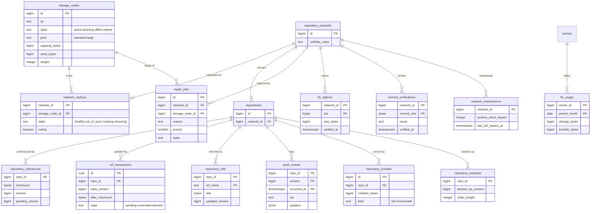

# Data model: Git のストレージのメタデータ

[data-model.md](../data-model.md) の一部。振る舞いは [git-storage.md](../git-storage.md)・[git-protocols.md](../git-protocols.md)、決定は [ADR-0003](../../decisions/0003-replicated-git-storage.md)・[ADR-0005](../../decisions/0005-git-as-source-of-truth.md)・[ADR-0006](../../decisions/0006-ref-update-consensus.md)・[ADR-0007](../../decisions/0007-fork-network-object-sharing.md)・[ADR-0008](../../decisions/0008-pack-caching-and-bundle-cdn.md)・[ADR-0009](../../decisions/0009-lfs-storage-on-s3.md)。

- ルーティングの表（`storage_nodes`、`repository_networks`、`network_replicas`、`repositories`）は reader から読み、配置の変更だけ writer に書く。フロントエンドは 5 秒の TTL でキャッシュする。
- `repository_checksums`・`ref_transactions` は ref の更新の合意の一部で、正しさの要（[ADR-0006](../../decisions/0006-ref-update-consensus.md)）。
- `repository_refs`・`push_events` は Git の写しで、正本ではない（ADR-0005）。
- Git の中身のディスク上の配置は [non-relational.md](non-relational.md) の 1 節にある。

## ER 図

- `repositories` と `repository_checksums` は 1 対 1（図の記法の制約で `||--o{` で描いた）。

## テーブル

### `storage_nodes`

ストレージのノード。出典：[git-storage.md](../git-storage.md) の 3・4.1 節。

- 区分：S／分割：なし／保持：`retired` の行は 1 年残す／S1：42 行（`large` の群は S2）

| 列 | 型 | NULL | 既定 | 説明 |
| --- | --- | --- | --- | --- |
| `id` | bigint | NO | IDENTITY | |
| `instance_id` | text | NO | | EC2 のインスタンスの ID |
| `az` | text | NO | | `ap-northeast-1a` など |
| `region` | text | NO | `'ap-northeast-1'` | |
| `pool` | text | NO | `'standard'` | `standard`・`large` |
| `state` | text | NO | `'active'` | `active`・`draining`・`offline`・`retired` |
| `capacity_bytes` | bigint | NO | | |
| `used_bytes` | bigint | NO | 0 | |
| `weight` | integer | NO | 100 | 配置の重み付きの乱択の重み |
| `created_at` | timestamptz | NO | now() | |
| `updated_at` | timestamptz | NO | now() | |

- PK：`id`。UK：`instance_id`。
- CHECK：`state IN (...)`、`used_bytes <= capacity_bytes`。
- 索引：`(az, state, pool)` — 新しいネットワークの配置の候補を AZ ごとに選ぶ。

### `network_replicas`

ネットワークの複製の場所と状態。出典：同 4.1・4.3・6 節。

- 区分：S／分割：なし／保持：`removing` を消し終えたら消す／S1：240 万行（80 万 × 3）

| 列 | 型 | NULL | 既定 | 説明 |
| --- | --- | --- | --- | --- |
| `network_id` | bigint | NO | | |
| `storage_node_id` | bigint | NO | | |
| `state` | text | NO | `'creating'` | `healthy`・`out_of_sync`・`creating`・`removing` |
| `voting` | boolean | NO | true | 合意に投票するか。S3 の他のリージョンの読み取りの複製は false |
| `last_verified_at` | timestamptz | YES | | 定期の照合で DB のチェックサムと一致した時刻 |
| `updated_at` | timestamptz | NO | now() | |

- PK：`(network_id, storage_node_id)`。FK：`network_id` → `repository_networks.id`、`storage_node_id` → `storage_nodes.id`。
- 索引：`(storage_node_id, state)` — ノードの退避と修復の対象の列挙。`(network_id) WHERE state <> 'healthy'` — 監視（`healthy` が 3 未満のネットワークの数）。
- 「投票する複製は異なる 3 つの AZ」は配置の関数で守る（SQL の制約にしない）。

### `repository_checksums`

確定した ref の状態の要約と、更新の通し番号。push の直列化の CAS に使う。出典：同 5 節、[ADR-0006](../../decisions/0006-ref-update-consensus.md)。

- 区分：S（読み取りの経路はルーティングの一部として読む）／分割：なし／保持：リポジトリの消去で消す／S1：100 万行

| 列 | 型 | NULL | 既定 | 説明 |
| --- | --- | --- | --- | --- |
| `repo_id` | bigint | NO | | |
| `checksum` | bytea | NO | 32 バイトの 0 | 全 ref の `H(refname, value)` の XOR（SHA-256） |
| `version` | bigint | NO | 0 | 確定した更新の通し番号 |
| `pending_version` | bigint | YES | | 予約中の番号。予約は 1 つだけ |
| `updated_at` | timestamptz | NO | now() | |

- PK：`repo_id`。FK：`repo_id` → `repositories.id`。`fillfactor = 70`。
- CHECK：`pending_version IS NULL OR pending_version = version + 1`、`octet_length(checksum) = 32`。
- 予約：`UPDATE ... SET pending_version = version + 1 WHERE repo_id = $1 AND version = $2 AND pending_version IS NULL`。確定：`SET checksum = $after, version = pending_version, pending_version = NULL`。

### `ref_transactions`

3 相の手順の途中の記録。回収のワーカーが `pending` を拾う。出典：同 5.2・5.3 節。

- 区分：S／分割：なし／保持：決着の 7 日後に消す／S1：常時数百行（1 日 350 万件を作って消す）

| 列 | 型 | NULL | 既定 | 説明 |
| --- | --- | --- | --- | --- |
| `id` | uuid | NO | | `txn_id` |
| `repo_id` | bigint | NO | | |
| `base_version` | bigint | NO | | 予約した時点の `version` |
| `before_checksum` | bytea | NO | | 投票の `before` |
| `after_checksum` | bytea | NO | | 投票の `after`。回収で、ここに達した複製を数える |
| `updates` | jsonb | NO | | `[{ref, before, after, forced}]` |
| `state` | text | NO | `'pending'` | `pending`・`committed`・`aborted` |
| `coordinator` | text | NO | | フロントエンドのタスクの ID |
| `created_at` | timestamptz | NO | now() | |
| `resolved_at` | timestamptz | YES | | |

- PK：`id`。FK：`repo_id` → `repositories.id`。
- 索引：`(created_at) WHERE state = 'pending'` — 30 秒を過ぎた `pending` の回収と、最古の経過時間の監視。
- CHECK：`state IN (...)`、`(state = 'pending') = (resolved_at IS NULL)`。

### `repair_jobs`

修復・複製の作成・再配置の待ち行列。SQS を使わず DB で進捗を持つ（[capacity.md](../capacity.md) の 3.5 節）。出典：同 4.1・6 節。

- 区分：S／分割：なし／保持：完了の 30 日後に消す／S1：平常 0。ノードの喪失で 7 万行

| 列 | 型 | NULL | 既定 | 説明 |
| --- | --- | --- | --- | --- |
| `id` | bigint | NO | IDENTITY | |
| `network_id` | bigint | NO | | |
| `repo_id` | bigint | YES | | 1 つのリポジトリの修復のとき |
| `source_node_id` | bigint | YES | | コピー元 |
| `storage_node_id` | bigint | YES | | 作り直す先・直す複製 |
| `reason` | text | NO | | `out_of_sync`・`node_lost`・`corrupt`・`drain`・`rebalance` |
| `priority` | smallint | NO | | 0 が最優先（`healthy` が 1 つ）、1（2 つ）、2（平準化） |
| `state` | text | NO | `'queued'` | `queued`・`running`・`done`・`failed` |
| `attempts` | integer | NO | 0 | |
| `lease_until` | timestamptz | YES | | 実行中の担当の期限 |
| `created_at` | timestamptz | NO | now() | |
| `updated_at` | timestamptz | NO | now() | |

- PK：`id`。FK：`network_id` → `repository_networks.id`、`storage_node_id`・`source_node_id` → `storage_nodes.id`。
- 索引：`(priority, created_at) WHERE state = 'queued'` — 優先順の取り出し。`(storage_node_id) WHERE state = 'running'` — ノードごとの同時数の上限（16）。
- UK：`(network_id, storage_node_id) WHERE state IN ('queued','running')` — 同じ修復を重ねない。

### `repository_refs`

ref の写し。表示・一覧・PR の探索に使う。出典：同 5.4 節、[capacity.md](../capacity.md) の 3.4 節。

- 区分：R（`contents:read`）／分割：なし／保持：リポジトリの消去で消す／S1：3,000 万行（平均 30 ref）

| 列 | 型 | NULL | 既定 | 説明 |
| --- | --- | --- | --- | --- |
| `repo_id` | bigint | NO | | |
| `ref_name` | text | NO | | `refs/heads/main` など。`refs/pull/*` を含む |
| `sha` | bytea | NO | | |
| `updated_version` | bigint | NO | | この値にした更新の `version` |

- PK：`(repo_id, ref_name)`。FK：`repo_id` → `repositories.id`。`fillfactor = 70`。
- 索引：PK の前方一致（`ref_name LIKE 'refs/heads/%'`）でブランチの一覧。`text_pattern_ops` の照合順序にする。
- 更新は `repository.refs_updated` を `version` の順に適用する。`updated_version` より古い Event は捨てる。

### `push_events`

確定した ref の更新の記録。リージョンの障害で失った push の列挙と、写しの作り直しに使う。監査は `audit_events` の `git.push` が持つ。出典：同 5.2 節、[ADR-0029](../../decisions/0029-audit-log.md)。

- 区分：S／分割：`occurred_at` の週ごとの範囲／保持：5 週（バックアップの 35 日を覆う）／S1：4,500 万行

| 列 | 型 | NULL | 既定 | 説明 |
| --- | --- | --- | --- | --- |
| `repo_id` | bigint | NO | | |
| `version` | bigint | NO | | |
| `pusher_type` | text | NO | | `user`・`app`・`deploy_key`・`system` |
| `pusher_id` | bigint | YES | | |
| `token_id` | bigint | YES | | 使った資格情報の ID |
| `via` | text | NO | | `ssh`・`https`・`web`・`api`・`merge`・`merge_queue` |
| `updates` | jsonb | NO | | `[{ref, before, after, forced}]`。1,000 件を超えたら S3 のキー |
| `occurred_at` | timestamptz | NO | now() | |

- PK：`(repo_id, version, occurred_at)`（パーティションのキーを含める。`version` の一意性は `repository_checksums` の CAS が守る）。
- `repository_checksums` の確定、outbox の `repository.refs_updated` と同じトランザクションで書く。

### `lfs_objects`

LFS の objects の登録。ネットワークの中で共有する。出典：[git-protocols.md](../git-protocols.md) の 7 節、[ADR-0009](../../decisions/0009-lfs-storage-on-s3.md)。

- 区分：S（batch API は、リポジトリの `can()` の後に `network_id` で引く）／分割：なし／保持：ネットワークの全リポジトリが消去されたら、S3 と一緒に消す／S1：4,000 万行

| 列 | 型 | NULL | 既定 | 説明 |
| --- | --- | --- | --- | --- |
| `network_id` | bigint | NO | | |
| `oid` | bytea | NO | | SHA-256（32 バイト） |
| `size_bytes` | bigint | NO | | |
| `uploaded_by_repo_id` | bigint | NO | | 最初に上げたリポジトリ |
| `verified_at` | timestamptz | NO | | `verify` で S3 の存在・大きさ・チェックサムを確かめた時刻 |

- PK：`(network_id, oid)`。FK：`network_id` → `repository_networks.id`。
- push の検査（LFS の pointer の objects があるか）と、batch の `upload` で既にあるかの判定に PK を使う。
- S3 のキーは `lfs/<network_id>/<oid の先頭 2 文字>/<oid>`（[non-relational.md](non-relational.md) の 3 節）。

### `lfs_usage`

LFS の容量と転送量。リポジトリの持ち主のアカウントごとに月で数える。出典：[git-protocols.md](../git-protocols.md) の 7.4 節。

- 区分：O／分割：なし／保持：13 か月／S1：300 万行

| 列 | 型 | NULL | 既定 | 説明 |
| --- | --- | --- | --- | --- |
| `owner_id` | bigint | NO | | |
| `period_month` | date | NO | | 月の初日 |
| `storage_bytes` | bigint | NO | 0 | 月の最大 |
| `transfer_bytes` | bigint | NO | 0 | download の合計 |
| `updated_at` | timestamptz | NO | now() | |

- PK：`(owner_id, period_month)`。上限を超えた upload は 403 で拒否する。

### `commit_verifications`

コミットの署名の検証の結果。検証した時点で固定し、後で鍵を消しても変えない。出典：[identity-and-permissions.md](../identity-and-permissions.md) の 3.3 節、[pull-requests.md](../pull-requests.md) の 5.5 節。

- 区分：S（コミットを読めるリポジトリの経路からだけ返す）／分割：なし／保持：ネットワークの消去で消す／S1：2 億行（署名のあるコミットだけ）

| 列 | 型 | NULL | 既定 | 説明 |
| --- | --- | --- | --- | --- |
| `network_id` | bigint | NO | | |
| `commit_sha` | bytea | NO | | |
| `result` | text | NO | | `verified`・`partially_verified`・`unverified` |
| `reason` | text | YES | | `unknown_key`・`bad_email` など（本家の `reason` の語彙） |
| `signature_type` | text | YES | | `gpg`・`ssh`・`platform`（サーバーが作ったコミット） |
| `key_fingerprint` | text | YES | | |
| `signer_user_id` | bigint | YES | | |
| `verified_at` | timestamptz | NO | now() | |

- PK：`(network_id, commit_sha)`。FK：`network_id` → `repository_networks.id`。

### `repository_bundles`

bundle-uri で配る bundle の一覧。clone の多い公開のリポジトリだけ。出典：[git-protocols.md](../git-protocols.md) の 6.4 節、[ADR-0008](../../decisions/0008-pack-caching-and-bundle-cdn.md)。

- 区分：S（公開のリポジトリだけ）／分割：なし／保持：新しい全体の bundle の 2 世代前より古いものを消す／S1：2 万行

| 列 | 型 | NULL | 既定 | 説明 |
| --- | --- | --- | --- | --- |
| `id` | bigint | NO | IDENTITY | |
| `repo_id` | bigint | NO | | |
| `kind` | text | NO | | `full`（週）・`incremental`（日） |
| `creation_token` | bigint | NO | | `heuristic = creationToken` の順 |
| `s3_key` | text | NO | | |
| `size_bytes` | bigint | NO | | |
| `created_at` | timestamptz | NO | now() | |

- PK：`id`。FK：`repo_id` → `repositories.id`。UK：`(repo_id, creation_token)`。
- 公開の種類を非公開にしたら、同じトランザクションで行を消し、S3 の削除を outbox で行う。

### `repository_backups`

Git のバックアップの進み具合。増分の bundle の起点を持つ。出典：[git-storage.md](../git-storage.md) の 9 節。

- 区分：S／分割：なし／保持：リポジトリの消去から 35 日で消す／S1：100 万行

| 列 | 型 | NULL | 既定 | 説明 |
| --- | --- | --- | --- | --- |
| `repo_id` | bigint | NO | | |
| `network_id` | bigint | NO | | |
| `backed_up_version` | bigint | NO | 0 | バックアップ済みの `version` |
| `backed_up_refs_key` | text | YES | | 大阪の S3 の ref の一覧のキー（次の増分の起点） |
| `chain_length` | integer | NO | 0 | 前回の全体の bundle からの増分の数。50 で全体を作り直す |
| `last_full_at` | timestamptz | YES | | |
| `updated_at` | timestamptz | NO | now() | |

- PK：`repo_id`。索引：`(updated_at)` — バックアップの遅れの監視（`repository_checksums.version` との差）。

### `network_maintenance`

保守のスケジューラの状態。repack などの契機を決める。出典：同 8 節。

- 区分：S／分割：なし／保持：ネットワークと一緒に消す／S1：80 万行

| 列 | 型 | NULL | 既定 | 説明 |
| --- | --- | --- | --- | --- |
| `network_id` | bigint | NO | | |
| `pushes_since_repack` | integer | NO | 0 | |
| `pack_count` | integer | NO | 0 | 最後に数えた値 |
| `loose_object_count` | integer | NO | 0 | |
| `geometric_repacks_since_full` | integer | NO | 0 | 8 回に 1 回、全体の repack |
| `last_repack_at` | timestamptz | YES | | |
| `last_full_repack_at` | timestamptz | YES | | |
| `last_fsck_at` | timestamptz | YES | | 週次の `fsck --connectivity-only` |
| `next_due_at` | timestamptz | YES | | |

- PK：`network_id`。索引：`(next_due_at)` — 保守の対象の取り出し。
