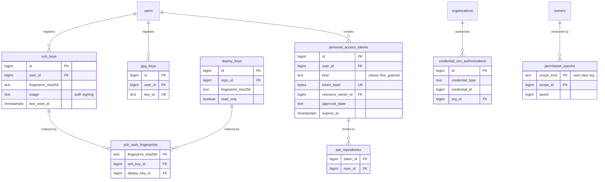

# Data model: アカウント・Organization・チーム・資格情報

[data-model.md](../data-model.md) の一部。振る舞いは [identity-and-permissions.md](../identity-and-permissions.md)、決定は [ADR-0018](../../decisions/0018-repository-roles-and-permission-composition.md)・[ADR-0019](../../decisions/0019-authentication-and-token-model.md)。規則（ID、型、権限の区分）は [data-model.md](../data-model.md) の 2 節。

- Better Auth は「だれか」だけを持つ（`users`・`accounts`・`sessions`・`passkeys`・`two_factors`・`verifications`）。Organization・チーム・ロールは自前のテーブルで持ち、`can()` が読む。
- 権限の材料のテーブル（区分 A）は `packages/authz` の中からだけ読む。
- S1 の行数は初期の見積もり（登録 300 万人、Organization 30 万）。E9 の負荷試験と実績で直す。

## ER 図

### アカウントと Organization

```mermaid
erDiagram
    owners ||--o{ users : "is a"
    owners ||--o{ organizations : "is a"
    owners ||--o{ owner_redirects : "renamed from"
    users ||--o{ accounts : "signs in with"
    users ||--o{ sessions : "has"
    users ||--o{ passkeys : "has"
    users ||--o{ two_factors : "has"
    users ||--o{ user_emails : "has"
    users ||--o{ verifications : "verifies"
    organizations ||--o{ org_memberships : "has"
    users ||--o{ org_memberships : "joins"
    organizations ||--o{ org_invitations : "sends"
    organizations ||--o{ teams : "has"
    teams ||--o{ teams : "parent of"
    teams ||--o{ team_memberships : "has"
    users ||--o{ team_memberships : "joins"
    teams ||--o{ team_closure : "ancestor"
    users ||--o{ user_blocks : "blocks"
    organizations ||--o{ org_blocks : "blocks"
    enterprises ||--o{ organizations : "groups"
    enterprises ||--o{ enterprise_memberships : "has"

    owners {
        bigint id PK
        text kind "user organization bot ghost"
        citext login UK
        timestamptz created_at
    }
    users {
        bigint id PK "owners.id"
        text kind "human bot ghost"
        citext email
        text state "active hidden suspended deleted"
        timestamptz two_factor_required_at
        integer credential_generation
    }
    organizations {
        bigint id PK "owners.id"
        text base_permission "none read write admin"
        boolean two_factor_required
        bigint enterprise_id FK
    }
    org_memberships {
        bigint org_id PK
        bigint user_id PK
        text role "owner member"
    }
    teams {
        bigint id PK
        bigint org_id FK
        bigint parent_team_id FK
        citext slug
        text privacy "visible secret"
    }
    team_memberships {
        bigint team_id PK
        bigint user_id PK
        text role "maintainer member"
    }
    team_closure {
        bigint ancestor_id PK
        bigint descendant_id PK
        integer depth
    }
    accounts {
        text id PK
        bigint user_id FK
        text provider_id
        text password_hash
    }
    sessions {
        text id PK
        bigint user_id FK
        text token UK
        timestamptz expires_at
    }
    passkeys {
        text id PK
        bigint user_id FK
        text credential_id UK
    }
    two_factors {
        text id PK
        bigint user_id FK
        bytea secret_ciphertext
    }
    verifications {
        text id PK
        text identifier
        timestamptz expires_at
    }
    user_emails {
        bigint id PK
        bigint user_id FK
        citext email
        timestamptz verified_at
    }
    org_invitations {
        bigint id PK
        bigint org_id FK
        bigint invitee_user_id FK
        timestamptz expires_at
    }
    user_blocks {
        bigint blocker_user_id PK
        bigint blocked_user_id PK
    }
    org_blocks {
        bigint org_id PK
        bigint blocked_user_id PK
    }
    owner_redirects {
        citext old_login PK
        bigint owner_id FK
    }
    enterprises {
        bigint id PK
        citext slug UK
    }
    enterprise_memberships {
        bigint enterprise_id PK
        bigint user_id PK
        text role
    }
```

### 資格情報

- `deploy_keys` の定義は [repositories.md](repositories.md) にある。

## テーブル

### `owners`

ユーザーと Organization の共通の名前空間。`/{owner}/{repo}` の `owner` を引く。App の bot と ghost も、`users` と ID をそろえるためにここに行を持つ（リポジトリは持てない）。出典：[identity-and-permissions.md](../identity-and-permissions.md) の 2.1 節。

- 区分：公開（login は誰でも引ける。状態が `hidden`・`suspended` のものは判定で隠す）／分割：なし／保持：削除の後も行は残し、`login` を `deleted-<id>` に置き換えて名前を解放する／S1：330 万行

| 列 | 型 | NULL | 既定 | 説明 |
| --- | --- | --- | --- | --- |
| `id` | bigint | NO | IDENTITY | `users.id`・`organizations.id` と同じ値 |
| `kind` | text | NO | | `user`・`organization`・`bot`・`ghost` |
| `login` | citext | NO | | 名前。user・organization は英数字とハイフンで 39 文字まで。bot は `<slug>[bot]`、ghost は `ghost` |
| `created_at` | timestamptz | NO | now() | |
| `renamed_at` | timestamptz | YES | | 最後に名前を変えた時刻 |

- PK：`id`。UK：`login`。
- CHECK：`kind IN ('user','organization','bot','ghost')`、`kind IN ('bot','ghost') OR login ~ '^[A-Za-z0-9][A-Za-z0-9-]{0,38}$' AND login !~ '(--|-$)'`。bot の名前は `[` を含むので、利用者の名前と衝突しない。
- 索引：UK が名前の解決（`WHERE login = $1`）に使われる。

### `users`

Better Auth の `user`。人間、App の bot、ghost（削除した利用者の付け替え先）を持つ。出典：同 2.1・3.1・11 節。

- 区分：U（プロフィールの公開の項目は誰でも読める）／分割：なし／保持：削除で `state = 'deleted'` にし、個人情報の列を消す（[ADR-0030](../../decisions/0030-data-retention-and-deletion.md)）／S1：300 万行

| 列 | 型 | NULL | 既定 | 説明 |
| --- | --- | --- | --- | --- |
| `id` | bigint | NO | | `owners.id` |
| `kind` | text | NO | `'human'` | `human`・`bot`・`ghost`（`owners.kind` の `user`・`bot`・`ghost` に対応） |
| `name` | text | YES | | 表示名 |
| `email` | citext | YES | | 主のメールアドレス（Better Auth の `email`） |
| `email_verified` | boolean | NO | false | |
| `image` | text | YES | | アバターの S3 のキー |
| `locale` | text | YES | | 画面の言語（`en`・`ja`） |
| `two_factor_enabled` | boolean | NO | false | |
| `two_factor_required_at` | timestamptz | YES | | 2FA が必須になった時刻。45 日＋7 日の起点 |
| `credential_generation` | integer | NO | 0 | パスワードの再設定で増やす。メールの返信のトークンを無効にする（[notifications.md](../notifications.md) の 7.3 節） |
| `app_id` | bigint | YES | | bot の元の App |
| `state` | text | NO | `'active'` | `active`・`hidden`・`suspended`・`deleted` |
| `state_reason` | text | YES | | 措置の理由とケースの ID |
| `created_at` | timestamptz | NO | now() | |
| `updated_at` | timestamptz | NO | now() | |

- PK：`id`。FK：`id` → `owners.id`、`app_id` → `apps.id`。
- UK：`email`（`WHERE state <> 'deleted'`）。
- CHECK：`(kind = 'bot') = (app_id IS NOT NULL)`、`kind IN (...)`、`state IN (...)`。
- 索引：`(two_factor_required_at) WHERE two_factor_enabled = false` — 2FA の督促とロックのジョブ。

### `accounts`

Better Auth の `account`。パスワードのログインの資格情報を持つ（ソーシャルログインは MVP の外）。出典：同 3.1 節。

- 区分：U（認証のサービスだけが読む）／分割：なし／保持：アカウントの削除で消す／S1：300 万行

| 列 | 型 | NULL | 既定 | 説明 |
| --- | --- | --- | --- | --- |
| `id` | text | NO | | Better Auth の ID |
| `user_id` | bigint | NO | | |
| `provider_id` | text | NO | `'credential'` | |
| `account_id` | text | NO | | Better Auth の形式 |
| `password_hash` | text | YES | | Argon2id |
| `created_at` | timestamptz | NO | now() | |
| `updated_at` | timestamptz | NO | now() | |

- PK：`id`。FK：`user_id` → `users.id`。UK：`(provider_id, account_id)`。索引：`(user_id)`。

### `sessions`

Better Auth の `session`。Web のログイン。出典：同 3.1 節。

- 区分：U／分割：なし／保持：期限切れを日次で消す。アイドル 14 日・絶対 90 日／S1：200 万行

| 列 | 型 | NULL | 既定 | 説明 |
| --- | --- | --- | --- | --- |
| `id` | text | NO | | |
| `user_id` | bigint | NO | | |
| `token` | text | NO | | Cookie の値の照合に使う Better Auth の識別子 |
| `expires_at` | timestamptz | NO | | |
| `ip_address` | inet | YES | | |
| `user_agent` | text | YES | | |
| `created_at` | timestamptz | NO | now() | sudo モードの `freshAge`（2 時間）の起点 |
| `updated_at` | timestamptz | NO | now() | |

- PK：`id`。FK：`user_id` → `users.id`。UK：`token`。索引：`(user_id)` — 端末の一覧と取り消し。`(expires_at)` — 掃除。

### `passkeys`

Better Auth の `passkey`。パスキーとセキュリティキー。出典：同 3.1 節。

- 区分：U／分割：なし／保持：本人が消すまで／S1：100 万行

| 列 | 型 | NULL | 既定 | 説明 |
| --- | --- | --- | --- | --- |
| `id` | text | NO | | |
| `user_id` | bigint | NO | | |
| `name` | text | YES | | |
| `credential_id` | text | NO | | WebAuthn の資格情報の ID |
| `public_key` | bytea | NO | | |
| `counter` | bigint | NO | 0 | |
| `device_type` | text | YES | | |
| `backed_up` | boolean | NO | false | |
| `transports` | text | YES | | |
| `created_at` | timestamptz | NO | now() | |

- PK：`id`。FK：`user_id` → `users.id`。UK：`credential_id`。索引：`(user_id)`。

### `two_factors`

Better Auth の `twoFactor`。TOTP の種とリカバリーコード。出典：同 3.1 節。

- 区分：U（認証のサービスだけが復号できる）／分割：なし／保持：2FA の無効化で消す／S1：150 万行

| 列 | 型 | NULL | 既定 | 説明 |
| --- | --- | --- | --- | --- |
| `id` | text | NO | | |
| `user_id` | bigint | NO | | |
| `secret_ciphertext` | bytea | NO | | TOTP の種。`app-secrets` のエンベロープ暗号化 |
| `secret_dek` | bytea | NO | | 包んだデータキー |
| `backup_codes_ciphertext` | bytea | NO | | 16 個、1 回限り |
| `key_version` | integer | NO | 1 | |

- PK：`id`。FK：`user_id` → `users.id`。UK：`user_id`。

### `verifications`

Better Auth の `verification`。メールの確認、パスワードの再設定の一時的な値。

- 区分：S／分割：なし／保持：期限の後に消す／S1：10 万行

| 列 | 型 | NULL | 既定 | 説明 |
| --- | --- | --- | --- | --- |
| `id` | text | NO | | |
| `identifier` | text | NO | | 対象（メールアドレスなど） |
| `value` | text | NO | | Better Auth の値 |
| `expires_at` | timestamptz | NO | | |
| `created_at` | timestamptz | NO | now() | |

- PK：`id`。索引：`(identifier)`、`(expires_at)`。

### `user_emails`

主のメールアドレス以外の追加のアドレス。確認済みのものだけをコミットの作者の照合と通知の宛先に使う。出典：同 2.1 節。

- 区分：U（コミットの作者の照合は S）／分割：なし／保持：本人が消すまで／S1：150 万行

| 列 | 型 | NULL | 既定 | 説明 |
| --- | --- | --- | --- | --- |
| `id` | bigint | NO | IDENTITY | |
| `user_id` | bigint | NO | | |
| `email` | citext | NO | | |
| `verified_at` | timestamptz | YES | | |
| `created_at` | timestamptz | NO | now() | |

- PK：`id`。FK：`user_id` → `users.id`。UK：`email`（`WHERE verified_at IS NOT NULL`。確認済みのアドレスは 1 人にだけ属す）。
- 索引：`(user_id)`。
- バウンス・苦情による停止は、アドレスの単位で `email_suppressions`（[notifications.md](notifications.md)）に持つ。

### `organizations`

Organization の設定と方針。出典：同 2.2・4.3 節、[api-and-webhooks.md](../api-and-webhooks.md) の 6.4 節。

- 区分：O（公開の項目は誰でも読める）／分割：なし／保持：削除で `state = 'deleted'`。名前は 90 日予約（`name_reservations`）／S1：30 万行

| 列 | 型 | NULL | 既定 | 説明 |
| --- | --- | --- | --- | --- |
| `id` | bigint | NO | | `owners.id` |
| `name` | text | YES | | 表示名 |
| `base_permission` | text | NO | `'read'` | `none`・`read`・`write`・`admin` |
| `members_can_create_repos` | boolean | NO | true | |
| `members_can_fork_private` | boolean | NO | false | |
| `collaborator_invites_by` | text | NO | `'repo_admins'` | `repo_admins`・`owners` |
| `two_factor_required` | boolean | NO | false | |
| `classic_pat_allowed` | boolean | NO | true | |
| `fine_grained_pat_approval` | boolean | NO | true | |
| `pat_max_lifetime_days` | integer | NO | 366 | |
| `oauth_app_restricted` | boolean | NO | true | 承認した OAuth アプリだけ |
| `default_repo_labels` | jsonb | YES | | 新しいリポジトリの既定のラベル。NULL なら本家と同じ 10 個 |
| `enterprise_id` | bigint | YES | | E10 |
| `state` | text | NO | `'active'` | `active`・`hidden`・`suspended`・`deleted` |
| `created_at` | timestamptz | NO | now() | |
| `updated_at` | timestamptz | NO | now() | |

- PK：`id`。FK：`id` → `owners.id`、`enterprise_id` → `enterprises.id`。
- CHECK：`base_permission IN (...)`、`pat_max_lifetime_days BETWEEN 1 AND 366`。
- 索引：`(enterprise_id) WHERE enterprise_id IS NOT NULL` — `accessPredicate` の `internal`。

### `org_memberships`

ユーザー × Organization のロール。出典：同 2.2 節。

- 区分：A／分割：なし／保持：脱退で消す／S1：500 万行

| 列 | 型 | NULL | 既定 | 説明 |
| --- | --- | --- | --- | --- |
| `org_id` | bigint | NO | | |
| `user_id` | bigint | NO | | |
| `role` | text | NO | `'member'` | `owner`・`member` |
| `two_factor_blocked_at` | timestamptz | YES | | 2FA の必須化で立ち入りを止めた時刻（メンバーは外さない） |
| `created_at` | timestamptz | NO | now() | |

- PK：`(org_id, user_id)`。FK：`org_id` → `organizations.id`、`user_id` → `users.id`。
- 索引：`(user_id)` — 利用者の所属の一覧と `accessPredicate`。`(org_id) WHERE role = 'owner'` — 最後の owner の検査。
- CHECK：`role IN ('owner','member')`。最後の owner は抜けられない（アプリで確かめる）。

### `org_invitations`

Organization への招待。受諾で `org_memberships` を作る。出典：同 2.2 節。

- 区分：O／分割：なし／保持：受諾・期限切れの 30 日後に消す／S1：20 万行

| 列 | 型 | NULL | 既定 | 説明 |
| --- | --- | --- | --- | --- |
| `id` | bigint | NO | IDENTITY | |
| `org_id` | bigint | NO | | |
| `invitee_user_id` | bigint | YES | | |
| `invitee_email` | citext | YES | | |
| `role` | text | NO | `'member'` | |
| `team_ids` | bigint[] | NO | `'{}'` | 受諾で入るチーム |
| `inviter_id` | bigint | NO | | |
| `expires_at` | timestamptz | NO | | 7 日 |
| `accepted_at` | timestamptz | YES | | |
| `created_at` | timestamptz | NO | now() | |

- PK：`id`。FK：`org_id` → `organizations.id`、`invitee_user_id`・`inviter_id` → `users.id`。
- CHECK：`num_nonnulls(invitee_user_id, invitee_email) = 1`。
- 索引：`(invitee_user_id) WHERE accepted_at IS NULL` — 本人の招待の一覧。`(org_id, created_at)`。

### `teams`

チーム。親は 1 つ。出典：同 4.4 節。

- 区分：A（表示は `privacy` に従う）／分割：なし／保持：削除で消す（`team_closure` を作り直す）／S1：50 万行

| 列 | 型 | NULL | 既定 | 説明 |
| --- | --- | --- | --- | --- |
| `id` | bigint | NO | IDENTITY | |
| `org_id` | bigint | NO | | |
| `parent_team_id` | bigint | YES | | |
| `name` | text | NO | | |
| `slug` | citext | NO | | `@org/slug` のメンション |
| `description` | text | YES | | |
| `privacy` | text | NO | `'visible'` | `visible`・`secret` |
| `created_at` | timestamptz | NO | now() | |
| `updated_at` | timestamptz | NO | now() | |

- PK：`id`。FK：`org_id` → `organizations.id`、`parent_team_id` → `teams.id`。UK：`(org_id, slug)`。
- CHECK：`privacy = 'visible' OR parent_team_id IS NULL`（secret は入れ子にできない）、`parent_team_id <> id`。循環と深さ（10 段）はアプリで確かめる。
- 索引：`(parent_team_id)`。

### `team_memberships`

チーム × ユーザー。出典：同 4.4 節。

- 区分：A／分割：なし／保持：脱退で消す／S1：300 万行

| 列 | 型 | NULL | 既定 | 説明 |
| --- | --- | --- | --- | --- |
| `team_id` | bigint | NO | | |
| `user_id` | bigint | NO | | |
| `role` | text | NO | `'member'` | `maintainer`・`member` |
| `created_at` | timestamptz | NO | now() | |

- PK：`(team_id, user_id)`。FK：`team_id` → `teams.id`、`user_id` → `users.id`。索引：`(user_id)` — 所属のチームの展開。

### `team_closure`

チームの祖先 × 子孫。親のロールを子に引き継ぐ計算を 1 回の SQL で行う。出典：同 4.3 節。

- 区分：A／分割：なし／保持：親の変更で作り直す／S1：100 万行

| 列 | 型 | NULL | 既定 | 説明 |
| --- | --- | --- | --- | --- |
| `ancestor_id` | bigint | NO | | |
| `descendant_id` | bigint | NO | | |
| `depth` | integer | NO | | 自分自身は 0 |

- PK：`(ancestor_id, descendant_id)`。FK：両方 → `teams.id`。
- 索引：`(descendant_id)` — 利用者の所属のチームから祖先のチームを引き、`team_repository_roles` を結ぶ。
- CHECK：`depth BETWEEN 0 AND 10`。

### `user_blocks`

利用者が利用者をブロックする。判定の段 5 と通知の除外に使う。

- 区分：A／分割：なし／保持：解除で消す／S1：50 万行

| 列 | 型 | NULL | 既定 | 説明 |
| --- | --- | --- | --- | --- |
| `blocker_user_id` | bigint | NO | | |
| `blocked_user_id` | bigint | NO | | |
| `created_at` | timestamptz | NO | now() | |

- PK：`(blocker_user_id, blocked_user_id)`。FK：両方 → `users.id`。索引：`(blocked_user_id)` — 通知の受け手から「行為者をブロックしている人」を引く。

### `org_blocks`

Organization が利用者をブロックする。

- 区分：A／分割：なし／保持：期限か解除で消す／S1：10 万行

| 列 | 型 | NULL | 既定 | 説明 |
| --- | --- | --- | --- | --- |
| `org_id` | bigint | NO | | |
| `blocked_user_id` | bigint | NO | | |
| `expires_at` | timestamptz | YES | | 一時的なブロック |
| `created_at` | timestamptz | NO | now() | |

- PK：`(org_id, blocked_user_id)`。FK：`org_id` → `organizations.id`、`blocked_user_id` → `users.id`。

### `ssh_keys`

利用者の SSH の鍵。認証用と署名用を分けて登録する。出典：同 3.3 節。

- 区分：U（Git フロントエンドは指紋で引く）／分割：なし／保持：本人が消すまで。1 年使われない鍵の扱いは PAT と同じ／S1：250 万行

| 列 | 型 | NULL | 既定 | 説明 |
| --- | --- | --- | --- | --- |
| `id` | bigint | NO | IDENTITY | |
| `user_id` | bigint | NO | | |
| `usage` | text | NO | | `auth`・`signing` |
| `key_type` | text | NO | | `ssh-ed25519`・`ecdsa-sha2-nistp256` など。DSA と 3072 ビット未満の RSA は拒否 |
| `public_key` | text | NO | | |
| `fingerprint_sha256` | text | NO | | |
| `title` | text | YES | | |
| `last_used_at` | timestamptz | YES | | 間引いて更新する |
| `created_at` | timestamptz | NO | now() | |

- PK：`id`。FK：`user_id` → `users.id`。UK：`(fingerprint_sha256, usage)`（同じ鍵を署名用に別に登録してよい）。
- 認証の鍵とデプロイキーをまたいだ指紋の一意性は `ssh_auth_fingerprints` で守る。
- 索引：`(user_id)`。

### `ssh_auth_fingerprints`

SSH の認証に使う指紋の登録簿。利用者の認証の鍵とデプロイキーをまたいで、指紋を 1 つの持ち主に限る。Git フロントエンドは指紋からここを 1 回引いて主体を決める。出典：同 3.3 節、[git-protocols.md](../git-protocols.md) の 3.1 節。

- 区分：S／分割：なし／保持：鍵の削除と同じトランザクションで消す／S1：300 万行

| 列 | 型 | NULL | 既定 | 説明 |
| --- | --- | --- | --- | --- |
| `fingerprint_sha256` | text | NO | | |
| `ssh_key_id` | bigint | YES | | 利用者の認証の鍵 |
| `deploy_key_id` | bigint | YES | | デプロイキー |

- PK：`fingerprint_sha256`。FK：`ssh_key_id` → `ssh_keys.id`（`ON DELETE CASCADE`）、`deploy_key_id` → `deploy_keys.id`（`ON DELETE CASCADE`）。
- CHECK：`num_nonnulls(ssh_key_id, deploy_key_id) = 1`。

### `gpg_keys`

コミットの署名の検証に使う GPG の鍵（S1 の後半）。出典：同 3.3 節。

- 区分：U（公開鍵は誰でも読める）／分割：なし／保持：本人が消すまで。消しても過去の検証の結果は変わらない（`commit_verifications`）／S1：30 万行

| 列 | 型 | NULL | 既定 | 説明 |
| --- | --- | --- | --- | --- |
| `id` | bigint | NO | IDENTITY | |
| `user_id` | bigint | NO | | |
| `key_id` | text | NO | | 16 桁の鍵の ID |
| `primary_key_id` | bigint | YES | | 副鍵のとき主鍵 |
| `public_key` | text | NO | | |
| `emails` | text[] | NO | `'{}'` | |
| `expires_at` | timestamptz | YES | | |
| `created_at` | timestamptz | NO | now() | |

- PK：`id`。FK：`user_id` → `users.id`、`primary_key_id` → `gpg_keys.id`。UK：`key_id`。

### `personal_access_tokens`

細粒度とクラシックの PAT。平文は持たない。出典：同 3.4・5.4 節、[api-and-webhooks.md](../api-and-webhooks.md) の 6 節。

- 区分：U（Organization の owner は、自分の資源に向く細粒度の PAT の承認のために一部を読む）／分割：なし／保持：期限・取り消しの 30 日後に消す（監査ログには ID が残る）／S1：500 万行

| 列 | 型 | NULL | 既定 | 説明 |
| --- | --- | --- | --- | --- |
| `id` | bigint | NO | IDENTITY | 監査ログとアクセスログの `token_id` |
| `user_id` | bigint | NO | | |
| `kind` | text | NO | | `classic`・`fine_grained` |
| `name` | text | NO | | |
| `token_hash` | bytea | NO | | SHA-256 |
| `token_prefix` | text | NO | | `<brand>p_`・`<brand>_pat_` |
| `last4` | text | NO | | 表示用 |
| `scopes` | text[] | YES | | クラシックのスコープ |
| `permissions` | jsonb | YES | | 細粒度の `{"contents":"write",...}` |
| `resource_owner_id` | bigint | YES | | 細粒度の 1 つの持ち主 |
| `repository_selection` | text | YES | | `all`・`selected`・`public_only` |
| `approval_state` | text | NO | `'not_required'` | `not_required`・`pending`・`approved`・`denied` |
| `expires_at` | timestamptz | NO | | 必須。最長 366 日 |
| `last_used_at` | timestamptz | YES | | |
| `revoked_at` | timestamptz | YES | | |
| `revoked_reason` | text | YES | | `user`・`leaked`・`inactive`・`operator` |
| `created_at` | timestamptz | NO | now() | |

- PK：`id`。FK：`user_id` → `users.id`、`resource_owner_id` → `owners.id`。UK：`token_hash`。
- CHECK：`(kind = 'classic') = (scopes IS NOT NULL)`、`(kind = 'fine_grained') = (permissions IS NOT NULL AND resource_owner_id IS NOT NULL)`、`expires_at <= created_at + interval '366 days'`。
- 索引：UK が認証の検証。`(user_id, created_at)` — 本人の一覧。`(resource_owner_id, approval_state) WHERE approval_state = 'pending'` — 承認の待ち。`(last_used_at) WHERE revoked_at IS NULL` — 1 年使われないものの自動の失効。

### `pat_repositories`

細粒度の PAT で選んだリポジトリ。

- 区分：U／分割：なし／保持：トークンと一緒に消す／S1：800 万行

| 列 | 型 | NULL | 既定 | 説明 |
| --- | --- | --- | --- | --- |
| `token_id` | bigint | NO | | |
| `repo_id` | bigint | NO | | |

- PK：`(token_id, repo_id)`。FK：`token_id` → `personal_access_tokens.id`（CASCADE）、`repo_id` → `repositories.id`（CASCADE）。
- 索引：`(repo_id)` — リポジトリの削除・移管での失効の確認。

### `credential_sso_authorizations`

資格情報（PAT・SSH の鍵・OAuth のトークン）× Organization の SSO の承認（E10）。出典：同 8 節。

- 区分：O／分割：なし／保持：取り消しで消す／S1：0（E10 から）

| 列 | 型 | NULL | 既定 | 説明 |
| --- | --- | --- | --- | --- |
| `id` | bigint | NO | IDENTITY | |
| `credential_type` | text | NO | | `pat`・`ssh_key`・`oauth_token` |
| `credential_id` | bigint | NO | | 多態の参照 |
| `org_id` | bigint | NO | | |
| `authorized_at` | timestamptz | NO | now() | |
| `revoked_at` | timestamptz | YES | | |

- PK：`id`。FK：`org_id` → `organizations.id`。UK：`(credential_type, credential_id, org_id)`。

### `permission_epochs`

権限のキャッシュの世代。権限の変更と同じトランザクションで上げる。出典：同 9 節。

- 区分：S／分割：なし／保持：無期限（行は主体・リポジトリ・Organization ごとに 1 つ）／S1：450 万行

| 列 | 型 | NULL | 既定 | 説明 |
| --- | --- | --- | --- | --- |
| `scope_kind` | text | NO | | `user`・`repo`・`org` |
| `scope_id` | bigint | NO | | |
| `epoch` | bigint | NO | 0 | |

- PK：`(scope_kind, scope_id)`。`fillfactor = 80`。

### `enterprises`

複数の Organization を束ねる（E10）。`internal` の読み取りの範囲。

- 区分：O／分割：なし／保持：削除で消す／S1：0

| 列 | 型 | NULL | 既定 | 説明 |
| --- | --- | --- | --- | --- |
| `id` | bigint | NO | IDENTITY | |
| `slug` | citext | NO | | |
| `name` | text | NO | | |
| `created_at` | timestamptz | NO | now() | |

- PK：`id`。UK：`slug`。

### `enterprise_memberships`

Enterprise のメンバー（E10）。`accessPredicate` の `E(u)` を作る。

- 区分：A／分割：なし／保持：脱退で消す／S1：0

| 列 | 型 | NULL | 既定 | 説明 |
| --- | --- | --- | --- | --- |
| `enterprise_id` | bigint | NO | | |
| `user_id` | bigint | NO | | |
| `role` | text | NO | `'member'` | `owner`・`member` |

- PK：`(enterprise_id, user_id)`。索引：`(user_id)`。

### `owner_redirects`

名前を変えたアカウントの旧い名前からの転送。旧い名前を他のアカウントが取ったら消す。出典：同 2.1・14 節。

- 区分：公開／分割：なし／保持：旧い名前が取られるまで／S1：20 万行

| 列 | 型 | NULL | 既定 | 説明 |
| --- | --- | --- | --- | --- |
| `old_login` | citext | NO | | |
| `owner_id` | bigint | NO | | |
| `created_at` | timestamptz | NO | now() | |

- PK：`old_login`。FK：`owner_id` → `owners.id`。
- 名前の登録（`owners.login` の挿入・変更）と同じトランザクションで、同じ名前の行を消す。
