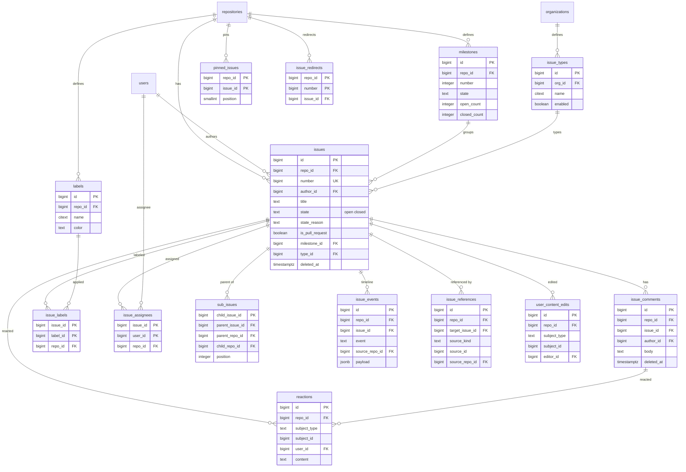

# Data model: Issue

[data-model.md](../data-model.md) の一部。振る舞いは [issues.md](../issues.md)、決定は [ADR-0017](../../decisions/0017-shared-issue-numbering.md)。

- Issue と Pull Request は同じ `issues` の行。PR は `pull_requests` の行（1 対 0..1）が付いたもの（[pull-requests.md](pull-requests.md)）。コメント、ラベル、担当者、マイルストーン、リアクション、タイムライン、通知のスレッドを共有する。
- すべてのテーブルは区分 R。`repo_id` を持ち、判定を経ない読み取りを lint で禁止する。
- 削除は論理削除（`deleted_at`）で、すぐに見えなくし、日次の消去のジョブで消す（[ADR-0030](../../decisions/0030-data-retention-and-deletion.md)）。PR は削除できない。
- S1 の行数：Issue 2,000 万・PR 1,000 万（リポジトリあたり 30）、コメント 8,000 万を前提にした見積もり。

## ER 図

## テーブル

### `issues`

Issue と PR の共通の行。番号はリポジトリごとに共有する。出典：[issues.md](../issues.md) の 1・2 節、[ADR-0017](../../decisions/0017-shared-issue-numbering.md)。

- 区分：R（Issue は `issues:read`、PR は `pull_requests:read`）／分割：なし／保持：論理削除の後、日次の消去（PR は消さない）。リポジトリの消去で消す／S1：3,000 万行

| 列 | 型 | NULL | 既定 | 説明 |
| --- | --- | --- | --- | --- |
| `id` | bigint | NO | IDENTITY | |
| `repo_id` | bigint | NO | | PR は base のリポジトリ |
| `number` | bigint | NO | | `repositories.next_issue_number` から採る |
| `is_pull_request` | boolean | NO | false | `pull_requests` の行があるか。作成時に決まり変わらない |
| `author_id` | bigint | NO | | 削除した利用者は ghost に付け替える |
| `title` | text | NO | | 256 文字まで |
| `body` | text | YES | | Markdown、65,536 文字まで |
| `state` | text | NO | `'open'` | `open`・`closed` |
| `state_reason` | text | YES | | `completed`・`not_planned`・`duplicate`・`reopened` |
| `locked` | boolean | NO | false | |
| `lock_reason` | text | YES | | `off-topic`・`too heated`・`resolved`・`spam` |
| `milestone_id` | bigint | YES | | |
| `type_id` | bigint | YES | | Organization の Issue の種類 |
| `comments_count` | integer | NO | 0 | 同じトランザクションで増減 |
| `reaction_counts` | jsonb | NO | `'{}'` | `{"+1": 3, ...}` |
| `closed_by_id` | bigint | YES | | |
| `transfer_state` | text | YES | | 非同期の移動の途中は `transferring` |
| `search_version` | bigint | NO | 0 | 行の更新ごとに増やす。OpenSearch の外部の版 |
| `created_at` | timestamptz | NO | now() | |
| `updated_at` | timestamptz | NO | now() | |
| `closed_at` | timestamptz | YES | | |
| `deleted_at` | timestamptz | YES | | |

- PK：`id`。FK：`repo_id` → `repositories.id`、`author_id`・`closed_by_id` → `users.id`、`milestone_id` → `milestones.id`、`type_id` → `issue_types.id`。
- UK：`(repo_id, number)`（削除したものも含める。番号は再利用しない）。
- CHECK：`state IN ('open','closed')`、`(state = 'closed') = (closed_at IS NOT NULL)`、`lock_reason IS NULL OR locked`、`char_length(title) <= 256`、`char_length(body) <= 65536`、`NOT (is_pull_request AND deleted_at IS NOT NULL)`。
- 索引：
  - `(repo_id, state, updated_at DESC) WHERE deleted_at IS NULL` — リポジトリの一覧（既定の並び）。
  - `(repo_id, is_pull_request, state, created_at DESC) WHERE deleted_at IS NULL` — Issue だけ・PR だけの一覧。
  - `(author_id, created_at DESC)` — 利用者の作った Issue。
  - `(milestone_id) WHERE milestone_id IS NOT NULL` — マイルストーンの中身。
  - `(deleted_at) WHERE deleted_at IS NOT NULL` — 日次の消去。

### `issue_comments`

Issue・PR のタイムラインのコメント。PR の行へのコメントは `review_comments`（[pull-requests.md](pull-requests.md)）。出典：同 2・8 節。

- 区分：R／分割：なし／保持：論理削除の後、日次の消去／S1：8,000 万行

| 列 | 型 | NULL | 既定 | 説明 |
| --- | --- | --- | --- | --- |
| `id` | bigint | NO | IDENTITY | |
| `repo_id` | bigint | NO | | |
| `issue_id` | bigint | NO | | |
| `author_id` | bigint | NO | | |
| `body` | text | NO | | 65,536 文字まで |
| `reaction_counts` | jsonb | NO | `'{}'` | |
| `minimized_reason` | text | YES | | 非表示の理由（`spam`・`off-topic` など） |
| `via` | text | NO | `'web'` | `web`・`api`・`email` |
| `created_at` | timestamptz | NO | now() | |
| `updated_at` | timestamptz | NO | now() | |
| `deleted_at` | timestamptz | YES | | |

- PK：`id`。FK：`issue_id` → `issues.id`、`repo_id` → `repositories.id`、`author_id` → `users.id`。
- 索引：`(issue_id, created_at) WHERE deleted_at IS NULL` — タイムライン。`(author_id, created_at)` — 利用者の削除での付け替え。
- 1 つの Issue に 2,500 件まで（アプリで確かめる）。

### `user_content_edits`

本文とコメントの編集の履歴。本文を読める人に見える。出典：同 2 節。

- 区分：R／分割：なし／保持：元の本文と一緒に消す／S1：1,500 万行

| 列 | 型 | NULL | 既定 | 説明 |
| --- | --- | --- | --- | --- |
| `id` | bigint | NO | IDENTITY | |
| `repo_id` | bigint | NO | | |
| `subject_type` | text | NO | | `issue`・`issue_comment`・`pull_request_review`・`review_comment`・`release` |
| `subject_id` | bigint | NO | | |
| `editor_id` | bigint | NO | | |
| `previous_body` | text | NO | | 編集の前の本文 |
| `created_at` | timestamptz | NO | now() | |

- PK：`id`。索引：`(subject_type, subject_id, created_at)`。

### `labels`

リポジトリのラベル。出典：同 3 節。

- 区分：R（作成・編集は write）／分割：なし／保持：削除で消す（`issue_labels` から外す。タイムラインは写しを持つ）／S1：1,200 万行（既定の 10 個 × 100 万＋独自）

| 列 | 型 | NULL | 既定 | 説明 |
| --- | --- | --- | --- | --- |
| `id` | bigint | NO | IDENTITY | |
| `repo_id` | bigint | NO | | |
| `name` | citext | NO | | |
| `color` | text | NO | | 6 桁の 16 進 |
| `description` | text | YES | | 100 文字まで |
| `created_at` | timestamptz | NO | now() | |

- PK：`id`。FK：`repo_id` → `repositories.id`。UK：`(repo_id, name)`。CHECK：`color ~ '^[0-9a-f]{6}$'`。

### `issue_labels`

Issue × ラベル。

- 区分：R／分割：なし／保持：外すかラベルの削除で消す／S1：4,000 万行

| 列 | 型 | NULL | 既定 | 説明 |
| --- | --- | --- | --- | --- |
| `issue_id` | bigint | NO | | |
| `label_id` | bigint | NO | | |
| `repo_id` | bigint | NO | | |
| `created_at` | timestamptz | NO | now() | |

- PK：`(issue_id, label_id)`。FK：`issue_id` → `issues.id`（CASCADE）、`label_id` → `labels.id`（CASCADE）。
- 索引：`(label_id)` — ラベルで絞った一覧、ラベルの削除。

### `milestones`

マイルストーン。番号は Issue と別の列。出典：同 4 節。

- 区分：R（作成・編集は write）／分割：なし／保持：削除で消す（Issue から外す）／S1：200 万行

| 列 | 型 | NULL | 既定 | 説明 |
| --- | --- | --- | --- | --- |
| `id` | bigint | NO | IDENTITY | |
| `repo_id` | bigint | NO | | |
| `number` | integer | NO | | `max(number) + 1`。一意制約の違反で再試行（作成の頻度が低いので `repositories` の行をロックしない） |
| `title` | text | NO | | |
| `description` | text | YES | | |
| `due_on` | date | YES | | |
| `state` | text | NO | `'open'` | `open`・`closed` |
| `open_count` | integer | NO | 0 | Issue の変更と同じトランザクションで更新 |
| `closed_count` | integer | NO | 0 | |
| `closed_at` | timestamptz | YES | | |
| `created_at` | timestamptz | NO | now() | |

- PK：`id`。FK：`repo_id` → `repositories.id`。UK：`(repo_id, number)`、`(repo_id, title)`。

### `issue_types`

Organization の Issue の種類。個人のリポジトリには種類がない。出典：同 5.1 節。

- 区分：O（読み取りは Organization のリポジトリを読める人）／分割：なし／保持：無効にしても消さない／S1：100 万行（既定の 3 × 30 万＋独自）

| 列 | 型 | NULL | 既定 | 説明 |
| --- | --- | --- | --- | --- |
| `id` | bigint | NO | IDENTITY | |
| `org_id` | bigint | NO | | |
| `name` | citext | NO | | |
| `description` | text | YES | | |
| `color` | text | YES | | |
| `enabled` | boolean | NO | true | 無効にしても付いている Issue から外さない |
| `position` | integer | NO | 0 | |
| `created_at` | timestamptz | NO | now() | |

- PK：`id`。FK：`org_id` → `organizations.id`。UK：`(org_id, name)`。1 つの Organization に 25 まで。

### `issue_assignees`

Issue × 担当者（10 人まで）。

- 区分：R／分割：なし／保持：外すまで／S1：1,500 万行

| 列 | 型 | NULL | 既定 | 説明 |
| --- | --- | --- | --- | --- |
| `issue_id` | bigint | NO | | |
| `user_id` | bigint | NO | | |
| `repo_id` | bigint | NO | | |
| `created_at` | timestamptz | NO | now() | |

- PK：`(issue_id, user_id)`。FK：`issue_id` → `issues.id`（CASCADE）、`user_id` → `users.id`。
- 索引：`(user_id, repo_id)` — 利用者の担当の一覧（`assignee:`）。

### `sub_issues`

親 × 子。子は親を 1 つだけ持つ。別のリポジトリの Issue も子にできる。出典：同 5.2 節。

- 区分：R（親と子の両方のリポジトリ。見せる側で相手を `canMany` で判定する）／分割：なし／保持：外すかどちらかの削除で消す／S1：200 万行

| 列 | 型 | NULL | 既定 | 説明 |
| --- | --- | --- | --- | --- |
| `child_issue_id` | bigint | NO | | |
| `parent_issue_id` | bigint | NO | | |
| `parent_repo_id` | bigint | NO | | |
| `child_repo_id` | bigint | NO | | |
| `position` | integer | NO | | 親の中の並び |
| `created_at` | timestamptz | NO | now() | |

- PK：`child_issue_id`（子は親を 1 つ）。FK：`child_issue_id`・`parent_issue_id` → `issues.id`（CASCADE）。
- 索引：`(parent_issue_id, position)` — 親の画面の子の一覧。
- CHECK：`child_issue_id <> parent_issue_id`。1 つの親に 100 件、8 段まで。循環は追加の時に再帰の問い合わせで拒否する。

### `issue_events`

タイムラインのイベント。追記だけ。出典：同 6.2 節。

- 区分：R（`source_repo_id` があれば、その判定も通す）／分割：なし（S2 で `repo_id` のハッシュを検討）／保持：Issue と一緒に消す／S1：1 億 5,000 万行

| 列 | 型 | NULL | 既定 | 説明 |
| --- | --- | --- | --- | --- |
| `id` | bigint | NO | IDENTITY | |
| `repo_id` | bigint | NO | | |
| `issue_id` | bigint | NO | | |
| `actor_id` | bigint | YES | | |
| `event` | text | NO | | `labeled`・`closed`・`cross-referenced`・`transferred` など（[issues.md](../issues.md) の 6.2 節の表） |
| `payload` | jsonb | NO | `'{}'` | ラベルの名前と色の写しなど |
| `source_repo_id` | bigint | YES | | 参照・移動・sub-issue の相手のリポジトリ |
| `created_at` | timestamptz | NO | now() | |

- PK：`id`。FK：`issue_id` → `issues.id`（CASCADE）。
- 索引：`(issue_id, created_at)` — タイムライン（コメントと時刻で合わせる）。

### `issue_references`

本文・コメントからの参照。参照された側のタイムラインの `cross-referenced` の元。出典：同 6.1 節。

- 区分：R（`repo_id` は参照された側、`source_repo_id` は参照した側。両方を判定する）／分割：なし／保持：どちらかの消去で消す／S1：2,000 万行

| 列 | 型 | NULL | 既定 | 説明 |
| --- | --- | --- | --- | --- |
| `id` | bigint | NO | IDENTITY | |
| `repo_id` | bigint | NO | | 参照された Issue のリポジトリ |
| `target_issue_id` | bigint | NO | | |
| `source_kind` | text | NO | | `issue`・`issue_comment`・`pull_request_review`・`review_comment`・`commit` |
| `source_id` | bigint | YES | | コミットのときは NULL |
| `source_commit_sha` | bytea | YES | | |
| `source_repo_id` | bigint | NO | | |
| `created_at` | timestamptz | NO | now() | |

- PK：`id`。FK：`target_issue_id` → `issues.id`（CASCADE）。
- UK：`(source_kind, source_id, source_commit_sha, target_issue_id)`（`NULLS NOT DISTINCT`）。
- CHECK：`num_nonnulls(source_id, source_commit_sha) = 1`。
- 索引：`(target_issue_id, created_at)`、`(source_repo_id)` — 参照した側のリポジトリの消去。

### `reactions`

8 種類のリアクション。対象は Issue の本文、コメント、レビューのコメント、リリース。出典：同 7 節。

- 区分：R／分割：なし／保持：外すか対象の削除で消す／S1：6,000 万行

| 列 | 型 | NULL | 既定 | 説明 |
| --- | --- | --- | --- | --- |
| `id` | bigint | NO | IDENTITY | |
| `repo_id` | bigint | NO | | |
| `subject_type` | text | NO | | `issue`・`issue_comment`・`review_comment`・`release` |
| `subject_id` | bigint | NO | | |
| `user_id` | bigint | NO | | |
| `content` | text | NO | | `+1`・`-1`・`laugh`・`confused`・`heart`・`hooray`・`rocket`・`eyes` |
| `created_at` | timestamptz | NO | now() | |

- PK：`id`。UK：`(subject_type, subject_id, user_id, content)`。
- 対象の `reaction_counts` を同じトランザクションで増減する。

### `pinned_issues`

リポジトリのピン留め（3 件まで）。出典：同 10 節。

- 区分：R（write 以上）／分割：なし／保持：外すまで／S1：30 万行

| 列 | 型 | NULL | 既定 | 説明 |
| --- | --- | --- | --- | --- |
| `repo_id` | bigint | NO | | |
| `issue_id` | bigint | NO | | |
| `position` | smallint | NO | | |

- PK：`(repo_id, issue_id)`。UK：`(repo_id, position)`。CHECK：`position BETWEEN 1 AND 3`。

### `issue_redirects`

移動した Issue の元の番号。元の URL・API を転送し、番号を再利用させない。出典：同 9 節、[ADR-0017](../../decisions/0017-shared-issue-numbering.md)。

- 区分：R（転送の先も判定を通す）／分割：なし／保持：元のリポジトリの消去で消す／S1：50 万行

| 列 | 型 | NULL | 既定 | 説明 |
| --- | --- | --- | --- | --- |
| `repo_id` | bigint | NO | | 元のリポジトリ |
| `number` | bigint | NO | | 元の番号 |
| `issue_id` | bigint | NO | | |
| `created_at` | timestamptz | NO | now() | |

- PK：`(repo_id, number)`。FK：`issue_id` → `issues.id`（CASCADE）。
- 移動のトランザクションで、`issues` の `repo_id`・`number` の書き換えと一緒に書く。
