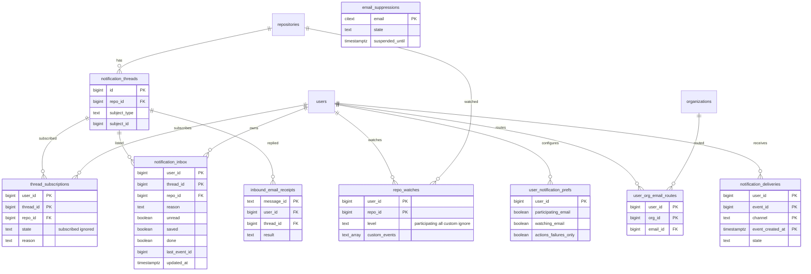

# Data model: 通知

[data-model.md](../data-model.md) の一部。振る舞いは [notifications.md](../notifications.md)、決定は [ADR-0016](../../decisions/0016-notification-fanout.md)。

- 受け手の決定は購読（`thread_subscriptions`）と watch（`repo_watches`）から行い、配る直前に `filterActorsCanRead` で確かめ直す。
- 受信箱（`notification_inbox`）は 1 人 1 スレッド 1 行。書き込みは `last_event_id` で古い更新を捨てる。一覧を返す前に `repo_id` の集合を `canMany` で確かめる。
- 通知の行に本文の写しを持たない。題名などは、スレッドの元（Issue など）を通常の経路で読んで作る。

## ER 図

## テーブル

### `notification_threads`

通知の単位（Issue、PR、リリース、ワークフローの実行）。受信箱と購読は、この ID で束ねる。出典：[notifications.md](../notifications.md) の 1 節。

- 区分：R／分割：なし／保持：元の対象の削除で消す（受信箱と購読も消す）／S1：3,500 万行

| 列 | 型 | NULL | 既定 | 説明 |
| --- | --- | --- | --- | --- |
| `id` | bigint | NO | IDENTITY | |
| `repo_id` | bigint | NO | | Issue の移動で書き換える |
| `subject_type` | text | NO | | `issue`・`pull_request`・`release`・`workflow_run` |
| `subject_id` | bigint | NO | | Issue・PR は `issues.id` |
| `created_at` | timestamptz | NO | now() | |

- PK：`id`。FK：`repo_id` → `repositories.id`。UK：`(subject_type, subject_id)`。
- メールの `Message-ID` の親と、返信のトークンに `id` を使う。

### `thread_subscriptions`

人 × スレッドの購読。出典：同 2.2・2.3 節。

- 区分：U（配信の planner は S として読む）／分割：なし／保持：スレッドの削除で消す。読めなくなった人の行は掃除のジョブで消す／S1：1 億行

| 列 | 型 | NULL | 既定 | 説明 |
| --- | --- | --- | --- | --- |
| `user_id` | bigint | NO | | |
| `thread_id` | bigint | NO | | |
| `repo_id` | bigint | NO | | |
| `state` | text | NO | `'subscribed'` | `subscribed`・`ignored` |
| `reason` | text | NO | | `author`・`comment`・`mention`・`manual` など。一度 `mention` なら `mention` のまま |
| `created_at` | timestamptz | NO | now() | |
| `updated_at` | timestamptz | NO | now() | |

- PK：`(user_id, thread_id)`。FK：`thread_id` → `notification_threads.id`（CASCADE）。
- 索引：`(thread_id, state)` — 受け手の候補（スレッドの `subscribed` の人と、除外の `ignored` の人）。

### `repo_watches`

人 × リポジトリの watch の水準。行がなければ既定（Participating and @mentions）。出典：同 2.1 節。

- 区分：U（planner は S）／分割：なし／保持：読めなくなった人の行は掃除のジョブで消す／S1：2,000 万行

| 列 | 型 | NULL | 既定 | 説明 |
| --- | --- | --- | --- | --- |
| `user_id` | bigint | NO | | |
| `repo_id` | bigint | NO | | |
| `level` | text | NO | | `participating`・`all`・`custom`・`ignore` |
| `custom_events` | text[] | NO | `'{}'` | `issues`・`pull_requests`・`releases` |
| `auto` | boolean | NO | false | 作成・push の権限で自動に作った行 |
| `created_at` | timestamptz | NO | now() | |

- PK：`(user_id, repo_id)`。FK：`repo_id` → `repositories.id`（CASCADE）。
- 索引：`(repo_id, level) WHERE level IN ('all','custom','ignore')` — 受け手の候補と除外。
- CHECK：`(level = 'custom') = (cardinality(custom_events) > 0)`。

### `notification_inbox`

Web の受信箱。出典：同 6 節。

- 区分：U（一覧を返す前に `canMany`）／分割：`user_id` のハッシュで 64／保持：Saved でない行は `updated_at` から 3 か月で消す。Saved は無期限／S1：1 億 5,000 万行

| 列 | 型 | NULL | 既定 | 説明 |
| --- | --- | --- | --- | --- |
| `user_id` | bigint | NO | | |
| `thread_id` | bigint | NO | | |
| `repo_id` | bigint | NO | | |
| `subject_type` | text | NO | | |
| `reason` | text | NO | | 2.3 節の `reason` |
| `unread` | boolean | NO | true | |
| `saved` | boolean | NO | false | |
| `done` | boolean | NO | false | 新しい活動で `false` に戻す |
| `last_event_id` | bigint | NO | | 最後に反映したイベント（outbox の `id`） |
| `updated_at` | timestamptz | NO | now() | |
| `last_read_at` | timestamptz | YES | | |

- PK：`(user_id, thread_id)`。
- 索引：`(user_id, done, updated_at DESC)` — 一覧のキーセットのページング。`(user_id) WHERE unread AND NOT done` — 未読の件数（999+ で打ち切る）。
- 書き込み：1,000 人ごとに `INSERT ... ON CONFLICT (user_id, thread_id) DO UPDATE ... WHERE notification_inbox.last_event_id < EXCLUDED.last_event_id`。

### `user_notification_prefs`

経路の設定。行がなければ既定。出典：同 5 節。

- 区分：U／分割：なし／保持：アカウントの削除で消す／S1：100 万行

| 列 | 型 | NULL | 既定 | 説明 |
| --- | --- | --- | --- | --- |
| `user_id` | bigint | NO | | |
| `participating_web` | boolean | NO | true | |
| `participating_email` | boolean | NO | true | |
| `watching_web` | boolean | NO | true | |
| `watching_email` | boolean | NO | false | |
| `actions_web` | boolean | NO | true | |
| `actions_email` | boolean | NO | true | |
| `actions_failures_only` | boolean | NO | true | |
| `email_comments` | boolean | NO | true | |
| `email_reviews` | boolean | NO | true | |
| `email_pushes` | boolean | NO | true | |
| `email_own_updates` | boolean | NO | false | |
| `default_email_id` | bigint | YES | | NULL は主のアドレス |
| `updated_at` | timestamptz | NO | now() | |

- PK：`user_id`。FK：`user_id` → `users.id`、`default_email_id` → `user_emails.id`。

### `user_org_email_routes`

Organization ごとのメールの宛先。

- 区分：U／分割：なし／保持：所属を外れたら消す／S1：10 万行

| 列 | 型 | NULL | 既定 | 説明 |
| --- | --- | --- | --- | --- |
| `user_id` | bigint | NO | | |
| `org_id` | bigint | NO | | |
| `email_id` | bigint | NO | | 確認済みのアドレス |

- PK：`(user_id, org_id)`。FK：`email_id` → `user_emails.id`（CASCADE）。

### `notification_deliveries`

メールの送信の冪等性の記録。行を作れたときだけ送る。出典：同 7.1 節。

- 区分：S／分割：`event_created_at` の日ごとの範囲／保持：14 日で `DROP`／S1：7,000 万行

| 列 | 型 | NULL | 既定 | 説明 |
| --- | --- | --- | --- | --- |
| `user_id` | bigint | NO | | |
| `event_id` | bigint | NO | | outbox の `id` |
| `channel` | text | NO | | `email`（Web の受信箱は `last_event_id` で冪等にするので持たない） |
| `event_created_at` | timestamptz | NO | | イベントの作成の時刻。再試行でも同じ値になるので主キーに含める |
| `state` | text | NO | `'pending'` | `pending`・`sent`・`skipped`・`digested` |
| `message_id` | text | YES | | イベントと受け手から決めた `Message-ID` |
| `sent_at` | timestamptz | YES | | |

- PK：`(user_id, event_id, channel, event_created_at)`。

### `email_suppressions`

バウンス・苦情で送信を止めたアドレス。主のアドレスと追加のアドレスの両方に効く。出典：同 7.4 節。

- 区分：S（利用者には設定の画面で状態を見せる）／分割：なし／保持：確かめ直して戻したら消す／S1：5 万行

| 列 | 型 | NULL | 既定 | 説明 |
| --- | --- | --- | --- | --- |
| `email` | citext | NO | | |
| `state` | text | NO | | `bouncing`（ハード）・`soft_suspended`・`complained` |
| `soft_bounce_count` | integer | NO | 0 | 72 時間に 3 回で 24 時間止める |
| `suspended_until` | timestamptz | YES | | ソフトバウンスの停止の期限 |
| `updated_at` | timestamptz | NO | now() | |

- PK：`email`。

### `inbound_email_receipts`

メールへの返信の取り込みの記録。`Message-ID` で 2 回投稿しない。出典：同 7.3 節。

- 区分：S／分割：なし／保持：30 日／S1：30 万行

| 列 | 型 | NULL | 既定 | 説明 |
| --- | --- | --- | --- | --- |
| `message_id` | text | NO | | |
| `user_id` | bigint | YES | | トークンが無効なら NULL |
| `thread_id` | bigint | YES | | |
| `result` | text | NO | | `posted`・`rejected` |
| `reason` | text | YES | | `bad_token`・`from_mismatch`・`forbidden`・`empty` |
| `comment_id` | bigint | YES | | |
| `received_at` | timestamptz | NO | now() | |

- PK：`message_id`。索引：`(received_at)`。
