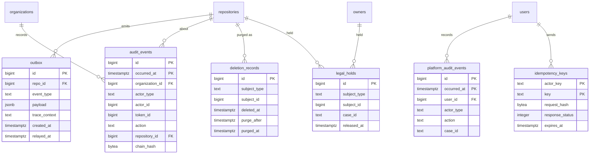

# Data model: 連携・監査・削除

[data-model.md](../data-model.md) の一部。振る舞いは [security.md](../security.md) の 6・14 節、[api-and-webhooks.md](../api-and-webhooks.md) の 3.3 節、決定は [ADR-0005](../../decisions/0005-git-as-source-of-truth.md)・[ADR-0029](../../decisions/0029-audit-log.md)・[ADR-0030](../../decisions/0030-data-retention-and-deletion.md)。

- outbox は、すべての領域の Event の出口。元の変更と同じトランザクションで書き、Relay が SQS へ流す。Event の形は [non-relational.md](non-relational.md) の 5 節。
- 監査ログは、管理の操作を同じトランザクションで `audit_events`（Organization・Enterprise）か `platform_audit_events`（それ以外）に書く。clone・fetch とアクセスの記録は DB に入れず、Firehose で S3 に集める（ADR-0029）。

## ER 図

## テーブル

### `outbox`

Event の出口。Relay が読んで SQS に送り、`relayed_at` を書く。出典：[README.md](../README.md) の 1 節、[git-storage.md](../git-storage.md) の 5.2 節、[observability.md](../observability.md) の 2 節。

- 区分：S／分割：なし（送った行を 1 日後に消すので小さい）／保持：送信から 1 日／S1：常時数十万行（1 日 3,000 万件）

| 列 | 型 | NULL | 既定 | 説明 |
| --- | --- | --- | --- | --- |
| `id` | bigint | NO | IDENTITY | 受信箱の `last_event_id`、通知の `event_id` |
| `repo_id` | bigint | YES | | リポジトリに属さない Event は NULL |
| `event_type` | text | NO | | `repository.refs_updated`・`issue.opened` など |
| `ordering_key` | text | YES | | 順序が要る Event の束ね（`repo:<id>` など） |
| `payload` | jsonb | NO | | ID と事象の時点の値。本文の写しは最小にする |
| `trace_context` | text | YES | | W3C の `traceparent` |
| `created_at` | timestamptz | NO | now() | |
| `relayed_at` | timestamptz | YES | | |

- PK：`id`。索引：`(id) WHERE relayed_at IS NULL` — Relay の取り出し。`(relayed_at)` — 掃除。
- `repository.refs_updated` の順序は payload の `version`、PR の Event は `pull_request_events.seq` が持つ。SQS は順序を保証しないので、受け手が版で並べ直す。

### `audit_events`

Organization・Enterprise の監査ログ。追記だけ。出典：[ADR-0029](../../decisions/0029-audit-log.md)。

- 区分：O（Organization の owner、Enterprise の管理者）／分割：`occurred_at` の月ごとの範囲／保持：180 日で `DROP`（S3 のアーカイブに 400 日）／S1：2 億 3,000 万行（`git.push` を含め 1 日 130 万件）

| 列 | 型 | NULL | 既定 | 説明 |
| --- | --- | --- | --- | --- |
| `id` | bigint | NO | IDENTITY | |
| `occurred_at` | timestamptz | NO | now() | |
| `organization_id` | bigint | YES | | |
| `enterprise_id` | bigint | YES | | |
| `actor_type` | text | NO | | `user`・`app`・`token`・`operator`・`system` |
| `actor_id` | bigint | YES | | |
| `token_id` | bigint | YES | | 使った資格情報の ID（値ではない） |
| `programmatic_access_type` | text | YES | | `web`・`pat`・`oauth`・`app_installation`・`app_user` |
| `action` | text | NO | | `repo.destroy`・`protected_branch.update`・`git.push` など |
| `repository_id` | bigint | YES | | |
| `target` | jsonb | YES | | 影響を受けた利用者・チームなど |
| `result` | text | NO | `'success'` | |
| `ip` | inet | YES | | |
| `user_agent` | text | YES | | |
| `request_id` | text | YES | | |
| `metadata` | jsonb | NO | `'{}'` | 変更の前後。本文・秘密情報・トークンの値を入れない |
| `chain_hash` | bytea | NO | | Organization ごとのハッシュの連鎖 |

- PK：`(id, occurred_at)`。
- CHECK：`num_nonnulls(organization_id, enterprise_id) >= 1`。
- 索引：`(organization_id, occurred_at DESC)` — Organization の監査ログの画面・API。`(repository_id, occurred_at DESC)`。`(token_id, occurred_at) WHERE token_id IS NOT NULL` — トークンの漏洩の影響の特定。
- `app` のロールは INSERT と SELECT だけ。UPDATE・DELETE をトリガーでも拒否する。列名は ADR-0029 に合わせ、`repo_id` ではなく `repository_id` を使う（区分は O で、R の lint の対象外）。

### `platform_audit_events`

どの Organization にも属さない記録（ログイン、個人の設定、運用者の操作と措置、アカウントの削除の完了）。本人の分をセキュリティログとして見せる。出典：同上、[security.md](../security.md) の 6 節。

- 区分：U（本人のセキュリティログ）・P（運用者）／分割：`occurred_at` の月ごとの範囲／保持：90 日で `DROP`（S3 のアーカイブに 400 日）／S1：4,500 万行

| 列 | 型 | NULL | 既定 | 説明 |
| --- | --- | --- | --- | --- |
| `id` | bigint | NO | IDENTITY | |
| `occurred_at` | timestamptz | NO | now() | |
| `user_id` | bigint | YES | | 記録の持ち主（セキュリティログの本人） |
| `actor_type` | text | NO | | |
| `actor_id` | bigint | YES | | |
| `token_id` | bigint | YES | | |
| `action` | text | NO | | `user.login`・`operator.suspend`・`account.purged` など |
| `repository_id` | bigint | YES | | |
| `case_id` | text | YES | | 運用者の措置のケースの ID |
| `result` | text | NO | `'success'` | |
| `ip` | inet | YES | | |
| `user_agent` | text | YES | | |
| `metadata` | jsonb | NO | `'{}'` | |
| `chain_hash` | bytea | NO | | |

- PK：`(id, occurred_at)`。索引：`(user_id, occurred_at DESC)` — 本人のセキュリティログ。`(actor_type, occurred_at) WHERE actor_type = 'operator'` — 運用者の操作の見直し。
- 書き込みの規則は `audit_events` と同じ。

### `idempotency_keys`

`POST` の `Idempotency-Key`（本家にない追加）。同じキー・同じ主体・同じ本文なら 24 時間は最初の応答を返す。出典：[api-and-webhooks.md](../api-and-webhooks.md) の 3.3 節。

- 区分：U／分割：なし／保持：24 時間の後に消す／S1：常時 200 万行

| 列 | 型 | NULL | 既定 | 説明 |
| --- | --- | --- | --- | --- |
| `actor_key` | text | NO | | 主体（`user:<id>`・`installation:<id>` など） |
| `key` | text | NO | | 255 文字まで |
| `request_hash` | bytea | NO | | メソッド・パス・本文のハッシュ。違えば 422 |
| `response_status` | integer | YES | | 処理中は NULL |
| `response_body` | jsonb | YES | | |
| `created_at` | timestamptz | NO | now() | |
| `expires_at` | timestamptz | NO | | |

- PK：`(actor_key, key)`。索引：`(expires_at)`。

### `deletion_records`

削除と消去の記録。バックアップから戻したときに削除を再適用するため、バックアップと別に 35 日以上持つ。出典：[ADR-0030](../../decisions/0030-data-retention-and-deletion.md)。

- 区分：P／分割：なし／保持：消去から 60 日（バックアップの 35 日を覆う）／S1：100 万行

| 列 | 型 | NULL | 既定 | 説明 |
| --- | --- | --- | --- | --- |
| `id` | bigint | NO | IDENTITY | |
| `subject_type` | text | NO | | `repository`・`user`・`organization`・`issue`・`issue_comment`・`release` |
| `subject_id` | bigint | NO | | |
| `network_id` | bigint | YES | | リポジトリのとき |
| `deleted_at` | timestamptz | NO | | |
| `purge_after` | timestamptz | NO | | リポジトリは 90 日後、アカウントは直ちに、Issue は翌日 |
| `purge_state` | text | NO | `'scheduled'` | `scheduled`・`running`・`done`・`held`・`cancelled`（復元） |
| `purged_at` | timestamptz | YES | | |
| `backup_expiry_at` | timestamptz | YES | | 消去＋35 日。バックアップの中から消える時刻 |

- PK：`id`。UK：`(subject_type, subject_id) WHERE purge_state <> 'cancelled'`。
- 索引：`(purge_after) WHERE purge_state = 'scheduled'` — 消去のジョブの取り出し。
- 消去のジョブは冪等にし、対象のテーブル・S3 の接頭辞・索引の一覧はスキーマの定義から得る。

### `legal_holds`

運用者が設定するリーガルホールド。消去のジョブに優先する。出典：同上。

- 区分：P／分割：なし／保持：解除の後も 1 年残す／S1：数十行

| 列 | 型 | NULL | 既定 | 説明 |
| --- | --- | --- | --- | --- |
| `id` | bigint | NO | IDENTITY | |
| `subject_type` | text | NO | | `repository`・`owner` |
| `subject_id` | bigint | NO | | |
| `case_id` | text | NO | | |
| `created_by` | text | NO | | 運用者 |
| `created_at` | timestamptz | NO | now() | |
| `released_at` | timestamptz | YES | | |

- PK：`id`。索引：`(subject_type, subject_id) WHERE released_at IS NULL` — 消去の前の確認。
