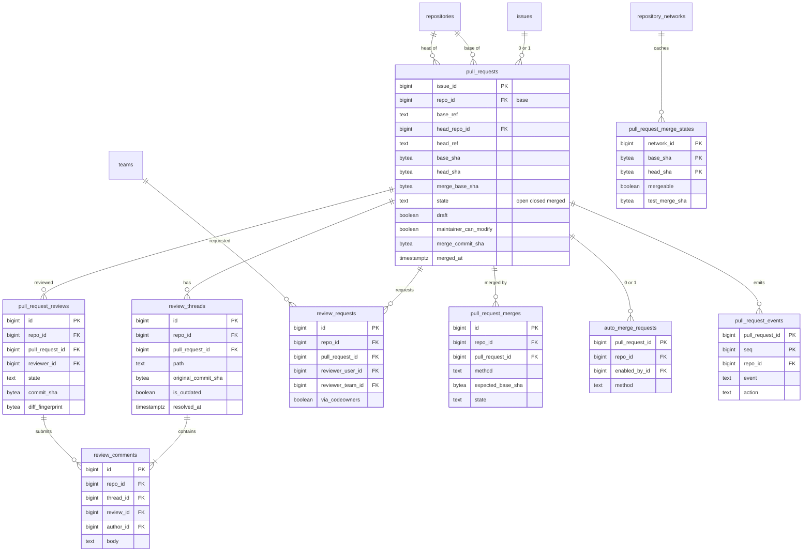

# Data model: Pull Request とレビュー

[data-model.md](../data-model.md) の一部。振る舞いは [pull-requests.md](../pull-requests.md)、決定は [ADR-0005](../../decisions/0005-git-as-source-of-truth.md)・[ADR-0010](../../decisions/0010-server-side-merge-and-diff.md)・[ADR-0017](../../decisions/0017-shared-issue-numbering.md)。ruleset・merge queue・チェックは [rulesets-and-checks.md](rulesets-and-checks.md)。

- PR の行は `issues` の行に 1 対 0..1 で付く。番号・タイトル・本文・状態の `open`/`closed` は `issues` が持つ。
- すべてのテーブルは base のリポジトリの `repo_id` を持つ（区分 R）。例外は `pull_request_merge_states`（ネットワークの単位のキャッシュ。区分 S）。
- SHA の列は Git の写し。マージの判定は Git の現在の ref で行う（ADR-0005、[pull-requests.md](../pull-requests.md) の 6.2 節）。

## ER 図

## テーブル

### `pull_requests`

PR に固有の列。出典：[pull-requests.md](../pull-requests.md) の 1・2・6 節。

- 区分：R（`pull_requests:read`。fork をまたぐ PR の head の操作は head のリポジトリも判定する）／分割：なし／保持：PR は削除できない。リポジトリの消去で消す／S1：1,000 万行

| 列 | 型 | NULL | 既定 | 説明 |
| --- | --- | --- | --- | --- |
| `issue_id` | bigint | NO | | `issues.id`。PR の ID |
| `repo_id` | bigint | NO | | base のリポジトリ（API の `base.repo`）。`issues.repo_id` と同じ |
| `base_ref` | text | NO | | `refs/heads/main` |
| `head_repo_id` | bigint | YES | | 同じリポジトリか、同じネットワークの fork。fork の削除で NULL |
| `head_ref` | text | NO | | |
| `base_sha` | bytea | NO | | 最後に観測した base の SHA（写し） |
| `head_sha` | bytea | NO | | 最後に観測した head の SHA（写し）。`refs/pull/{number}/head` と同じ |
| `merge_base_sha` | bytea | YES | | 三点の差分の起点 |
| `state` | text | NO | `'open'` | `open`・`closed`・`merged`。`issues.state` と同じトランザクションで書く |
| `draft` | boolean | NO | false | |
| `maintainer_can_modify` | boolean | NO | false | ユーザーが持つ fork だけ真にできる |
| `merge_method` | text | YES | | `merge`・`squash`・`rebase` |
| `merge_commit_sha` | bytea | YES | | open の間はテストマージ、merged の後は取り込んだコミット |
| `merged_at` | timestamptz | YES | | |
| `merged_by_id` | bigint | YES | | |
| `mergeability_requested_at` | timestamptz | YES | | 再計算を積んだ時刻（間引きに使う） |
| `last_viewed_at` | timestamptz | YES | | 画面・API で見られた時刻（再計算の優先） |
| `event_seq` | bigint | NO | 0 | `pull_request_events` の最後の `seq` |
| `created_at` | timestamptz | NO | now() | |
| `updated_at` | timestamptz | NO | now() | |

- PK：`issue_id`。FK：`issue_id` → `issues.id`、`repo_id` → `repositories.id`、`head_repo_id` → `repositories.id`（`ON DELETE SET NULL`）、`merged_by_id` → `users.id`。
- CHECK：`state IN (...)`、`(state = 'merged') = (merged_at IS NOT NULL)`、`NOT (draft AND state = 'merged')`。head のリポジトリが同じネットワークにあることはアプリで確かめる。
- 索引：
  - `(head_repo_id, head_ref) WHERE state = 'open'` — push の Event で head が動いた PR を探す。
  - `(repo_id, base_ref) WHERE state = 'open'` — base が動いた PR を探す。
  - `(repo_id, state, updated_at DESC)` — PR の一覧（`issues` と結ぶ前の絞り込み）。
- 更新は PR の行のロックで直列にする。Event の SHA が `head_sha` と同じなら何もしない。

### `pull_request_merge_states`

マージ可能かの計算の結果。入力の SHA で結果が決まるので、無効化せず追い出すだけ。出典：同 3.2・3.3 節。

- 区分：S（PR の `can()` を通った後、PR の `network_id`・`base_sha`・`head_sha` で引く）／分割：なし／保持：`computed_at` から 30 日で消す／S1：1,500 万行

| 列 | 型 | NULL | 既定 | 説明 |
| --- | --- | --- | --- | --- |
| `network_id` | bigint | NO | | |
| `base_sha` | bytea | NO | | |
| `head_sha` | bytea | NO | | |
| `mergeable` | boolean | YES | | NULL は「計算できない」（10 秒の上限） |
| `conflict_files` | text[] | NO | `'{}'` | |
| `test_merge_sha` | bytea | YES | | `refs/pull/{number}/merge` のコミット |
| `reason` | text | YES | | `timeout` など |
| `computed_at` | timestamptz | NO | now() | |

- PK：`(network_id, base_sha, head_sha)`。FK：`network_id` → `repository_networks.id`。
- 索引：`(computed_at)` — 追い出し。行がなければ API は `mergeable: null`（計算中）を返す。

### `pull_request_reviews`

レビュー。マージの判定は、レビュアーごとの最新の `APPROVED` か `CHANGES_REQUESTED` を使う。出典：同 4.1・4.5 節。

- 区分：R（`PENDING` は本人だけ）／分割：なし／保持：PR と同じ／S1：1,500 万行

| 列 | 型 | NULL | 既定 | 説明 |
| --- | --- | --- | --- | --- |
| `id` | bigint | NO | IDENTITY | |
| `repo_id` | bigint | NO | | |
| `pull_request_id` | bigint | NO | | |
| `reviewer_id` | bigint | NO | | |
| `state` | text | NO | `'PENDING'` | `PENDING`・`COMMENTED`・`APPROVED`・`CHANGES_REQUESTED`・`DISMISSED` |
| `body` | text | YES | | |
| `commit_sha` | bytea | NO | | 提出時の head の SHA（API の `commit_id`） |
| `merge_base_sha` | bytea | NO | | 提出時の merge base。変わったら承認を取り消す |
| `diff_fingerprint` | bytea | NO | | 三点の差分の指紋（ファイルごとの blob の組のハッシュ） |
| `dismissed_by_id` | bigint | YES | | |
| `dismissal_reason` | text | YES | | |
| `submitted_at` | timestamptz | YES | | |
| `created_at` | timestamptz | NO | now() | |
| `updated_at` | timestamptz | NO | now() | |

- PK：`id`。FK：`pull_request_id` → `pull_requests.issue_id`、`reviewer_id` → `users.id`。
- UK：`(pull_request_id, reviewer_id) WHERE state = 'PENDING'`（下書きは 1 人 1 つ）。
- CHECK：`state IN (...)`、`(state = 'PENDING') = (submitted_at IS NULL)`、`(state = 'DISMISSED') = (dismissed_by_id IS NOT NULL OR dismissal_reason IS NOT NULL)`。
- 索引：`(pull_request_id, reviewer_id, submitted_at DESC)` — レビュアーごとの最新の結論。

### `review_threads`

行・ファイルへのコメントのスレッド。head が動いたら位置を付け直す。出典：同 4.2・4.3 節。

- 区分：R／分割：なし／保持：PR と同じ／S1：1,200 万行

| 列 | 型 | NULL | 既定 | 説明 |
| --- | --- | --- | --- | --- |
| `id` | bigint | NO | IDENTITY | |
| `repo_id` | bigint | NO | | |
| `pull_request_id` | bigint | NO | | |
| `subject_type` | text | NO | `'line'` | `line`・`file` |
| `path` | text | NO | | |
| `original_commit_sha` | bytea | NO | | 最初のコメントの `commit_id` |
| `original_line` | integer | YES | | |
| `original_side` | text | YES | | `LEFT`・`RIGHT` |
| `original_start_line` | integer | YES | | 複数行 |
| `original_start_side` | text | YES | | |
| `line` | integer | YES | | 最新の `head_sha` での位置。outdated なら NULL |
| `is_outdated` | boolean | NO | false | |
| `positioned_head_sha` | bytea | YES | | 位置を付け直した head の SHA |
| `resolved_at` | timestamptz | YES | | |
| `resolved_by_id` | bigint | YES | | |
| `created_at` | timestamptz | NO | now() | |

- PK：`id`。FK：`pull_request_id` → `pull_requests.issue_id`。
- 索引：`(pull_request_id, path)` — 差分の画面。`(pull_request_id) WHERE resolved_at IS NULL` — 「会話の解決を必須にする」の未解決の数。
- CHECK：`subject_type = 'file' OR original_line IS NOT NULL`。

### `review_comments`

スレッドの中のコメント。提案（suggestion）は本文の中に持つ。出典：同 4.2・4.4 節。

- 区分：R／分割：なし／保持：論理削除の後、日次の消去／S1：3,000 万行

| 列 | 型 | NULL | 既定 | 説明 |
| --- | --- | --- | --- | --- |
| `id` | bigint | NO | IDENTITY | |
| `repo_id` | bigint | NO | | |
| `thread_id` | bigint | NO | | |
| `review_id` | bigint | YES | | 一緒に提出したレビュー（単独の返信は NULL） |
| `author_id` | bigint | NO | | |
| `body` | text | NO | | |
| `commit_sha` | bytea | NO | | 書いた時点の `commit_id` |
| `reaction_counts` | jsonb | NO | `'{}'` | |
| `created_at` | timestamptz | NO | now() | |
| `updated_at` | timestamptz | NO | now() | |
| `deleted_at` | timestamptz | YES | | |

- PK：`id`。FK：`thread_id` → `review_threads.id`、`review_id` → `pull_request_reviews.id`、`author_id` → `users.id`。
- 索引：`(thread_id, created_at)`、`(review_id)`。

### `review_requests`

レビューの依頼。ユーザーかチームのどちらか。出典：同 4.1・5.1 節。

- 区分：R／分割：なし／保持：取り消しの後も記録として残す（PR と同じ）／S1：1,500 万行

| 列 | 型 | NULL | 既定 | 説明 |
| --- | --- | --- | --- | --- |
| `id` | bigint | NO | IDENTITY | |
| `repo_id` | bigint | NO | | |
| `pull_request_id` | bigint | NO | | |
| `reviewer_user_id` | bigint | YES | | |
| `reviewer_team_id` | bigint | YES | | |
| `requested_by_id` | bigint | YES | | CODEOWNERS による依頼は NULL |
| `via_codeowners` | boolean | NO | false | |
| `created_at` | timestamptz | NO | now() | |
| `removed_at` | timestamptz | YES | | |

- PK：`id`。FK：`pull_request_id` → `pull_requests.issue_id`、`reviewer_user_id` → `users.id`、`reviewer_team_id` → `teams.id`。
- CHECK：`num_nonnulls(reviewer_user_id, reviewer_team_id) = 1`。
- UK：`(pull_request_id, reviewer_user_id, reviewer_team_id) WHERE removed_at IS NULL`（`NULLS NOT DISTINCT`）。
- 索引：`(reviewer_user_id) WHERE removed_at IS NULL` — `review-requested:` と通知。

### `pull_request_merges`

マージの開始と完了の記録。API が落ちても、ref の Event の処理がこれと照合して `merged` にする。出典：同 6.2 節。

- 区分：R／分割：なし／保持：PR と同じ／S1：700 万行

| 列 | 型 | NULL | 既定 | 説明 |
| --- | --- | --- | --- | --- |
| `id` | bigint | NO | IDENTITY | |
| `repo_id` | bigint | NO | | |
| `pull_request_id` | bigint | NO | | |
| `actor_id` | bigint | NO | | 自動マージでは予約した人 |
| `method` | text | NO | | `merge`・`squash`・`rebase` |
| `expected_base_sha` | bytea | NO | | |
| `head_sha` | bytea | NO | | |
| `via` | text | NO | `'api'` | `api`・`web`・`auto_merge`・`merge_queue`・`local_push` |
| `state` | text | NO | `'started'` | `started`・`succeeded`・`failed` |
| `merge_commit_sha` | bytea | YES | | |
| `failure_reason` | text | YES | | `base_moved`・`ruleset`・`conflict` など |
| `started_at` | timestamptz | NO | now() | |
| `finished_at` | timestamptz | YES | | |

- PK：`id`。FK：`pull_request_id` → `pull_requests.issue_id`。
- UK：`(pull_request_id) WHERE state = 'succeeded'` — 二重のマージを記録の側でも防ぐ。
- 索引：`(pull_request_id, started_at DESC)`。

### `auto_merge_requests`

自動マージの予約。PR に 1 つ。出典：同 9 節。

- 区分：R／分割：なし／保持：取り消し・実行の後も PR と一緒に残す／S1：30 万行

| 列 | 型 | NULL | 既定 | 説明 |
| --- | --- | --- | --- | --- |
| `pull_request_id` | bigint | NO | | |
| `repo_id` | bigint | NO | | |
| `enabled_by_id` | bigint | NO | | 予約した人。この人としてマージする |
| `method` | text | NO | | |
| `commit_title` | text | YES | | |
| `commit_message` | text | YES | | |
| `created_at` | timestamptz | NO | now() | |
| `disabled_at` | timestamptz | YES | | |
| `disabled_reason` | text | YES | | `unauthorized_push`・`base_changed`・`permission_lost`・`merged` |

- PK：`pull_request_id`。FK：`pull_request_id` → `pull_requests.issue_id`、`enabled_by_id` → `users.id`。
- 索引：`(repo_id) WHERE disabled_at IS NULL` — チェック・レビューの結果を受けた判定の対象。

### `pull_request_events`

PR ごとの Event の順序。受け手の重複と順序の扱いに使う。出典：同 11 節。

- 区分：R／分割：なし／保持：90 日（順序の番号は `pull_requests.event_seq` が持ち続ける）／S1：6,000 万行

| 列 | 型 | NULL | 既定 | 説明 |
| --- | --- | --- | --- | --- |
| `pull_request_id` | bigint | NO | | |
| `seq` | bigint | NO | | `pull_requests.event_seq` を同じトランザクションで進めた値 |
| `repo_id` | bigint | NO | | |
| `event` | text | NO | | `pull_request`・`pull_request_review` など |
| `action` | text | NO | | `opened`・`synchronize` など |
| `outbox_id` | bigint | NO | | |
| `created_at` | timestamptz | NO | now() | |

- PK：`(pull_request_id, seq)`。索引：`(created_at)` — 保持の削除。
