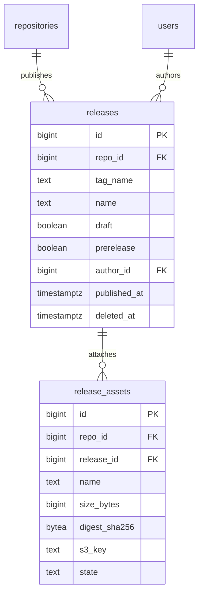

# Data model: リリース

[data-model.md](../data-model.md) の一部。リリースは領域の文書を持たない。次の記述から、最小の形で定めた。

- ロールの表の「リリースの作成・編集」（write 以上。[identity-and-permissions.md](../identity-and-permissions.md) の 5.3 節）
- 2FA の必須の対象の「リリースの作成者」（同 3.1 節）
- Webhook の `release`（[api-and-webhooks.md](../api-and-webhooks.md) の 9.1 節）、通知のスレッドの種類（[notifications.md](../notifications.md) の 1 節）
- 復元で戻すもの・消去で消す S3 の成果物（[ADR-0030](../../decisions/0030-data-retention-and-deletion.md)）、成果物のマルウェアのハッシュの照合（[security.md](../security.md) の 6 節）

Packages（パッケージのレジストリ）は MVP の外なので、テーブルを持たない（[intent.md](../../intent.md) の Non-goals）。

## ER 図

## テーブル

### `releases`

タグに付くリリース。タグそのものは Git の ref（`refs/tags/*`）が正本。

- 区分：R（`contents:read`。下書きは write 以上だけ）／分割：なし／保持：論理削除の後、日次の消去。リポジトリの消去で消す／S1：500 万行

| 列 | 型 | NULL | 既定 | 説明 |
| --- | --- | --- | --- | --- |
| `id` | bigint | NO | IDENTITY | |
| `repo_id` | bigint | NO | | |
| `tag_name` | text | NO | | |
| `target_commitish` | text | NO | | タグがまだないときに作る先 |
| `name` | text | YES | | |
| `body` | text | YES | | Markdown |
| `draft` | boolean | NO | false | |
| `prerelease` | boolean | NO | false | |
| `author_id` | bigint | NO | | |
| `reaction_counts` | jsonb | NO | `'{}'` | |
| `published_at` | timestamptz | YES | | |
| `created_at` | timestamptz | NO | now() | |
| `updated_at` | timestamptz | NO | now() | |
| `deleted_at` | timestamptz | YES | | |

- PK：`id`。FK：`repo_id` → `repositories.id`、`author_id` → `users.id`。
- UK：`(repo_id, tag_name) WHERE deleted_at IS NULL`。
- CHECK：`draft OR published_at IS NOT NULL`。
- 索引：`(repo_id, published_at DESC) WHERE deleted_at IS NULL AND NOT draft` — リリースの一覧と「最新」。

### `release_assets`

リリースの成果物。中身は S3（CMK `objects`）。

- 区分：R／分割：なし／保持：リリースと一緒に消す（S3 も）／S1：1,500 万行

| 列 | 型 | NULL | 既定 | 説明 |
| --- | --- | --- | --- | --- |
| `id` | bigint | NO | IDENTITY | |
| `repo_id` | bigint | NO | | |
| `release_id` | bigint | NO | | |
| `name` | text | NO | | |
| `label` | text | YES | | |
| `content_type` | text | NO | | |
| `size_bytes` | bigint | NO | | 2 GiB まで |
| `digest_sha256` | bytea | YES | | アップロードの完了で書く。マルウェアのハッシュの照合に使う |
| `s3_key` | text | NO | | `releases/{repo_id}/{release_id}/{asset_id}` |
| `state` | text | NO | `'starter'` | `starter`（アップロード中）・`uploaded`・`quarantined` |
| `download_count` | bigint | NO | 0 | 間引いて加算する |
| `uploader_id` | bigint | NO | | |
| `created_at` | timestamptz | NO | now() | |

- PK：`id`。FK：`release_id` → `releases.id`（CASCADE）、`repo_id` → `repositories.id`。UK：`(release_id, name)`。
