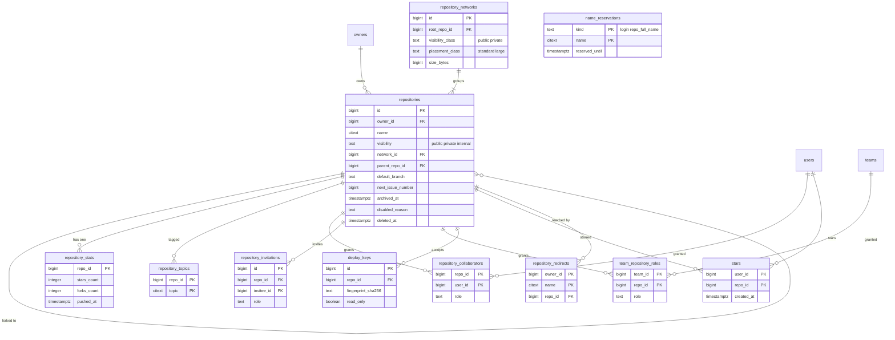

# Data model: リポジトリと fork のネットワーク

[data-model.md](../data-model.md) の一部。振る舞いは [identity-and-permissions.md](../identity-and-permissions.md) の 4・6 節、[git-storage.md](../git-storage.md) の 7・11 節、決定は [ADR-0002](../../decisions/0002-repository-permission-model.md)・[ADR-0007](../../decisions/0007-fork-network-object-sharing.md)・[ADR-0017](../../decisions/0017-shared-issue-numbering.md)・[ADR-0030](../../decisions/0030-data-retention-and-deletion.md)。

- 配置の単位は fork のネットワーク。fork を持たないリポジトリも、1 つだけのネットワークに属す。
- ディスク上のパスは `network_id` と `repo_id` から作る。名前の変更・移管でパスは変わらない。
- `repositories` の行は Issue・PR の採番でロックされる（ADR-0017）。更新の多い統計は `repository_stats` に分ける。

## ER 図

## テーブル

### `repository_networks`

fork のネットワーク。objects を共有する単位で、配置の単位。出典：[git-storage.md](../git-storage.md) の 4.1・7 節。

- 区分：S／分割：なし／保持：属するリポジトリがすべて消去されたら消す（LFS の objects を消してから）／S1：80 万行

| 列 | 型 | NULL | 既定 | 説明 |
| --- | --- | --- | --- | --- |
| `id` | bigint | NO | IDENTITY | ディスク上の `/data/networks/<下 2 桁>/<id>/` |
| `root_repo_id` | bigint | YES | | ネットワークの根。根を削除したら別の fork に移す |
| `visibility_class` | text | NO | | `public`・`private`（`internal` は `private` に入れる） |
| `placement_class` | text | NO | `'standard'` | `standard`・`large`（専用のノードの群） |
| `size_bytes` | bigint | NO | 0 | 保守のたびに書く |
| `created_at` | timestamptz | NO | now() | |
| `updated_at` | timestamptz | NO | now() | |

- PK：`id`。FK：`root_repo_id` → `repositories.id`（DEFERRABLE。作成の順序のため）。
- CHECK：`visibility_class IN ('public','private')`、`placement_class IN ('standard','large')`。
- 索引：`(placement_class, size_bytes DESC)` — 容量の平準化で大きいネットワークから移す。

### `repositories`

リポジトリ。権限・採番・ネットワークの参照の中心。出典：[identity-and-permissions.md](../identity-and-permissions.md) の 4.1・11 節、[issues.md](../issues.md) の 1 節、[pull-requests.md](../pull-requests.md) の 6.1 節。

- 区分：R（`metadata:read`）／分割：なし／保持：削除で `deleted_at`。90 日の後に消去（[ADR-0030](../../decisions/0030-data-retention-and-deletion.md)）／S1：100 万行（削除済みを含め 110 万）

| 列 | 型 | NULL | 既定 | 説明 |
| --- | --- | --- | --- | --- |
| `id` | bigint | NO | IDENTITY | |
| `owner_id` | bigint | NO | | ユーザーか Organization |
| `name` | citext | NO | | |
| `description` | text | YES | | |
| `visibility` | text | NO | | `public`・`private`・`internal`（`internal` は E10） |
| `network_id` | bigint | NO | | |
| `parent_repo_id` | bigint | YES | | fork の親 |
| `is_template` | boolean | NO | false | |
| `default_branch` | text | YES | | 空のリポジトリは NULL |
| `has_issues` | boolean | NO | true | Issue の機能 |
| `allow_merge_commit` | boolean | NO | true | |
| `allow_squash_merge` | boolean | NO | true | |
| `allow_rebase_merge` | boolean | NO | true | |
| `delete_branch_on_merge` | boolean | NO | false | |
| `squash_message_default` | text | NO | `'pr_title_body'` | `pr_title_body`・`pr_title_commits`・`commit_messages` |
| `next_issue_number` | bigint | NO | 1 | Issue と PR で共有する採番（ADR-0017） |
| `archived_at` | timestamptz | YES | | |
| `disabled_reason` | text | YES | | `abuse`・`legal`（HTTP 451）・`dmca` |
| `disabled_at` | timestamptz | YES | | |
| `created_at` | timestamptz | NO | now() | |
| `updated_at` | timestamptz | NO | now() | |
| `deleted_at` | timestamptz | YES | | |

- PK：`id`。FK：`owner_id` → `owners.id`、`network_id` → `repository_networks.id`、`parent_repo_id` → `repositories.id`。
- UK：`(owner_id, name) WHERE deleted_at IS NULL`。
- CHECK：`visibility IN (...)`、`parent_repo_id <> id`、`next_issue_number >= 1`、`(disabled_reason IS NULL) = (disabled_at IS NULL)`。`owner_id` が bot・ghost でないことはアプリで確かめる。
- 索引：
  - UK — `/{owner}/{repo}` の解決。
  - `(owner_id, visibility) WHERE deleted_at IS NULL` — `accessPredicate` の持ち主の単位の条件と、持ち主のリポジトリの一覧。
  - `(network_id)` — ネットワークの全リポジトリ（保守、分割、根の付け替え）。
  - `(parent_repo_id) WHERE parent_repo_id IS NOT NULL` — fork の一覧。
  - `(deleted_at) WHERE deleted_at IS NOT NULL` — 消去のジョブ。
- 採番：`UPDATE repositories SET next_issue_number = next_issue_number + 1 WHERE id = $1 RETURNING next_issue_number - 1`（ADR-0017）。`next_issue_number` を採番の関数の外で書くことを lint で禁止する。

### `repository_stats`

リポジトリの統計。`repositories` の行のロックと取り合わないよう分けた（ADR-0017 の Consequences）。

- 区分：R／分割：なし／保持：リポジトリと一緒に消す／S1：100 万行

| 列 | 型 | NULL | 既定 | 説明 |
| --- | --- | --- | --- | --- |
| `repo_id` | bigint | NO | | |
| `stars_count` | integer | NO | 0 | |
| `forks_count` | integer | NO | 0 | |
| `watchers_count` | integer | NO | 0 | |
| `open_issues_count` | integer | NO | 0 | Issue と PR の合計（本家の API と同じ） |
| `size_kib` | bigint | NO | 0 | 表示用（ネットワークの `size_bytes` とは別） |
| `primary_language` | text | YES | | go-enry の判定 |
| `pushed_at` | timestamptz | YES | | |
| `updated_at` | timestamptz | NO | now() | |

- PK：`repo_id`。FK：`repo_id` → `repositories.id`（CASCADE）。`fillfactor = 70`。

### `repository_topics`

トピック。検索の `topics` に写す。

- 区分：R／分割：なし／保持：リポジトリと一緒に消す／S1：150 万行

| 列 | 型 | NULL | 既定 | 説明 |
| --- | --- | --- | --- | --- |
| `repo_id` | bigint | NO | | |
| `topic` | citext | NO | | 小文字・数字・ハイフン、50 文字まで |

- PK：`(repo_id, topic)`。索引：`(topic)` — トピックの一覧。1 つのリポジトリに 20 まで（アプリで確かめる）。

### `repository_collaborators`

直接のコラボレーターとロール。出典：[identity-and-permissions.md](../identity-and-permissions.md) の 4.3 節。

- 区分：A／分割：なし／保持：外すまで。削除したリポジトリを復元しても戻す（招待は戻さない）／S1：300 万行

| 列 | 型 | NULL | 既定 | 説明 |
| --- | --- | --- | --- | --- |
| `repo_id` | bigint | NO | | |
| `user_id` | bigint | NO | | |
| `role` | text | NO | | `read`・`triage`・`write`・`maintain`・`admin` |
| `created_at` | timestamptz | NO | now() | |

- PK：`(repo_id, user_id)`。FK：`repo_id` → `repositories.id`、`user_id` → `users.id`。
- 索引：`(user_id)` — `accessPredicate` の `R(u)`。
- CHECK：`role IN (...)`。

### `repository_invitations`

コラボレーターの招待。出典：同 11 節。

- 区分：R（admin）／分割：なし／保持：受諾・期限切れの 30 日後に消す。復元では戻さない／S1：10 万行

| 列 | 型 | NULL | 既定 | 説明 |
| --- | --- | --- | --- | --- |
| `id` | bigint | NO | IDENTITY | |
| `repo_id` | bigint | NO | | |
| `invitee_id` | bigint | NO | | |
| `inviter_id` | bigint | NO | | |
| `role` | text | NO | | |
| `expires_at` | timestamptz | NO | | 7 日 |
| `accepted_at` | timestamptz | YES | | |
| `created_at` | timestamptz | NO | now() | |

- PK：`id`。FK：`repo_id` → `repositories.id`、`invitee_id`・`inviter_id` → `users.id`。
- UK：`(repo_id, invitee_id) WHERE accepted_at IS NULL`。索引：`(invitee_id) WHERE accepted_at IS NULL`。

### `team_repository_roles`

チーム × リポジトリのロール。親チームのロールは `team_closure` で子へ引き継ぐ。出典：同 4.3 節。

- 区分：A／分割：なし／保持：外すまで。復元では戻さない（本家と同じ）／S1：200 万行

| 列 | 型 | NULL | 既定 | 説明 |
| --- | --- | --- | --- | --- |
| `team_id` | bigint | NO | | |
| `repo_id` | bigint | NO | | |
| `role` | text | NO | | 5 つのロール |
| `created_at` | timestamptz | NO | now() | |

- PK：`(team_id, repo_id)`。FK：`team_id` → `teams.id`、`repo_id` → `repositories.id`。
- 索引：`(repo_id)` — `filterActorsCanRead` で、リポジトリから読めるチームを引く。

### `deploy_keys`

リポジトリに結び付いた SSH の鍵。Git の経路だけに使う。出典：同 3.3・5.4 節。

- 区分：R（admin）／分割：なし／保持：リポジトリと一緒に消す／S1：50 万行

| 列 | 型 | NULL | 既定 | 説明 |
| --- | --- | --- | --- | --- |
| `id` | bigint | NO | IDENTITY | |
| `repo_id` | bigint | NO | | |
| `title` | text | YES | | |
| `key_type` | text | NO | | |
| `public_key` | text | NO | | |
| `fingerprint_sha256` | text | NO | | 一意性は `ssh_auth_fingerprints` で守る |
| `read_only` | boolean | NO | true | |
| `added_by_id` | bigint | NO | | |
| `last_used_at` | timestamptz | YES | | |
| `created_at` | timestamptz | NO | now() | |

- PK：`id`。FK：`repo_id` → `repositories.id`、`added_by_id` → `users.id`。索引：`(repo_id)`。

### `stars`

利用者の star。Webhook の `star` と、検索の `stars` の元。

- 区分：R（star したリポジトリを読める人に見える）／分割：なし／保持：外すまで／S1：3,000 万行

| 列 | 型 | NULL | 既定 | 説明 |
| --- | --- | --- | --- | --- |
| `user_id` | bigint | NO | | |
| `repo_id` | bigint | NO | | |
| `created_at` | timestamptz | NO | now() | |

- PK：`(user_id, repo_id)`。索引：`(repo_id, created_at)` — star した人の一覧。
- `repository_stats.stars_count` を同じトランザクションで増減する。

### `repository_redirects`

リポジトリの名前の変更・移管の後の転送。旧い `owner/name` に同じ名前のリポジトリが作られたら消す。出典：[web.md](../web.md) の 2 節、[identity-and-permissions.md](../identity-and-permissions.md) の 14 節。

- 区分：R（転送の先も判定を通す）／分割：なし／保持：同じ名前が使われるまで／S1：30 万行

| 列 | 型 | NULL | 既定 | 説明 |
| --- | --- | --- | --- | --- |
| `owner_id` | bigint | NO | | 旧い持ち主 |
| `name` | citext | NO | | 旧い名前 |
| `repo_id` | bigint | NO | | 今のリポジトリ |
| `created_at` | timestamptz | NO | now() | |

- PK：`(owner_id, name)`。FK：`repo_id` → `repositories.id`（CASCADE）。
- リポジトリの作成・名前の変更と同じトランザクションで、同じ `(owner_id, name)` の行を消す。

### `name_reservations`

削除したアカウントの名前（90 日）と、人気のある公開のリポジトリの `OWNER/REPOSITORY`（永久）の予約。repojacking を防ぐ。出典：[ADR-0030](../../decisions/0030-data-retention-and-deletion.md)。

- 区分：S／分割：なし／保持：`reserved_until` を過ぎたら消す。永久の予約は消さない／S1：10 万行

| 列 | 型 | NULL | 既定 | 説明 |
| --- | --- | --- | --- | --- |
| `kind` | text | NO | | `login`・`repo_full_name` |
| `name` | citext | NO | | `login` か `owner/name` |
| `reserved_until` | timestamptz | YES | | NULL は永久 |
| `reason` | text | NO | | `account_deleted`・`org_deleted`・`popular_repo` |
| `created_at` | timestamptz | NO | now() | |

- PK：`(kind, name)`。アカウント・リポジトリの作成と名前の変更の前に引く。
