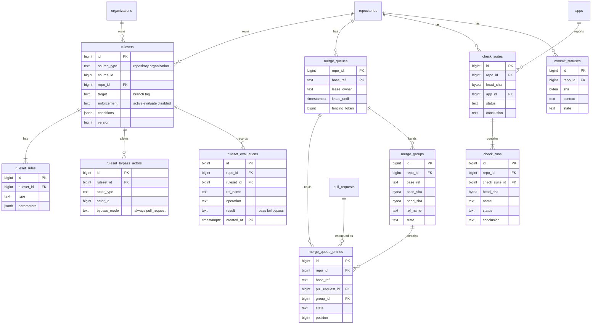

# Data model: ruleset・merge queue・チェック

[data-model.md](../data-model.md) の一部。振る舞いは [pull-requests.md](../pull-requests.md) の 5・8 節、[actions.md](../actions.md) の 4.2 節、決定は [ADR-0011](../../decisions/0011-rulesets-as-single-protection-model.md)・[ADR-0012](../../decisions/0012-merge-queue-with-speculative-groups.md)。

- ブランチの保護は ruleset だけで表す。旧来のブランチの保護の規則のテーブルは持たない（ADR-0011）。
- ruleset はリポジトリか Organization が持つ。Organization の ruleset は `repo_id` を持たない（区分 O。評価のときに対象のリポジトリへ当てはめる）。
- merge queue の状態は DB が正本で、base のブランチごとに 1 つの単一ライターの Worker が `merge_queues` のリースを取って進める（ADR-0012）。
- チェック（check suite・check run）と commit status は、コミットの SHA に付く。必須のチェックの判定と Actions のジョブの結果の表示に使う。

## ER 図

## テーブル

### `rulesets`

ruleset。対象の ref の条件と、強制の状態。出典：[pull-requests.md](../pull-requests.md) の 5.2 節。

- 区分：R（リポジトリの ruleset。読み取りは read、変更は admin）／O（Organization の ruleset。変更は owner）／分割：なし／保持：削除で消す（監査ログに残る）／S1：30 万行

| 列 | 型 | NULL | 既定 | 説明 |
| --- | --- | --- | --- | --- |
| `id` | bigint | NO | IDENTITY | |
| `source_type` | text | NO | | `repository`・`organization` |
| `source_id` | bigint | NO | | リポジトリか Organization の ID |
| `repo_id` | bigint | YES | | `source_type = 'repository'` のとき `source_id` と同じ |
| `name` | text | NO | | |
| `target` | text | NO | `'branch'` | `branch`・`tag` |
| `enforcement` | text | NO | `'active'` | `active`・`evaluate`・`disabled` |
| `conditions` | jsonb | NO | | `{"ref_name":{"include":[...],"exclude":[...]},"repository_name":{...}}`。`~DEFAULT_BRANCH` を含められる |
| `version` | bigint | NO | 1 | 変更ごとに増やす。Git フロントエンドのキャッシュの版 |
| `created_by_id` | bigint | NO | | |
| `created_at` | timestamptz | NO | now() | |
| `updated_at` | timestamptz | NO | now() | |

- PK：`id`。FK：`repo_id` → `repositories.id`。UK：`(source_type, source_id, name)`。
- CHECK：`(source_type = 'repository') = (repo_id IS NOT NULL)`、`source_type <> 'repository' OR repo_id = source_id`。1 つの持ち主に 75 まで。
- 索引：`(repo_id) WHERE enforcement <> 'disabled'`、`(source_id) WHERE source_type = 'organization' AND enforcement <> 'disabled'` — 評価のときに当てはまる ruleset を集める。

### `ruleset_rules`

ruleset の規則。1 つの ruleset に同じ種類は 1 つ。出典：同 5.2 節。

- 区分：`rulesets` と同じ／分割：なし／保持：ruleset と一緒に消す／S1：100 万行

| 列 | 型 | NULL | 既定 | 説明 |
| --- | --- | --- | --- | --- |
| `id` | bigint | NO | IDENTITY | |
| `ruleset_id` | bigint | NO | | |
| `type` | text | NO | | `creation`・`update`・`deletion`・`non_fast_forward`・`required_linear_history`・`required_signatures`・`pull_request`・`required_status_checks`・`merge_queue` |
| `parameters` | jsonb | NO | `'{}'` | 承認の数、必須のチェックの名前と送り手の App、merge queue の設定など |

- PK：`id`。FK：`ruleset_id` → `rulesets.id`（CASCADE）。UK：`(ruleset_id, type)`。
- `parameters` の形は規則の種類ごとの JSON Schema で検証する。

### `ruleset_bypass_actors`

ruleset を迂回できる主体。バイパスは ruleset ごとに判定する。出典：同 5.2・5.3 節。

- 区分：`rulesets` と同じ／分割：なし／保持：ruleset と一緒に消す／S1：20 万行

| 列 | 型 | NULL | 既定 | 説明 |
| --- | --- | --- | --- | --- |
| `id` | bigint | NO | IDENTITY | |
| `ruleset_id` | bigint | NO | | |
| `actor_type` | text | NO | | `repository_role`・`org_admin`・`team`・`app` |
| `actor_id` | bigint | YES | | チーム・App の ID |
| `role` | text | YES | | `admin`・`maintain`・`write`（`repository_role` のとき） |
| `bypass_mode` | text | NO | `'always'` | `always`・`pull_request` |

- PK：`id`。FK：`ruleset_id` → `rulesets.id`（CASCADE）。
- CHECK：`(actor_type = 'repository_role') = (role IS NOT NULL)`、`actor_type IN ('team','app') = (actor_id IS NOT NULL)`。

### `ruleset_evaluations`

`evaluate` の違反と、バイパスで通した操作の記録（Rule Insights に相当）。`active` の拒否も記録する。出典：同 5.3 節。

- 区分：R（admin）／分割：`created_at` の月ごとの範囲／保持：180 日（監査ログと同じ）／S1：9,000 万行

| 列 | 型 | NULL | 既定 | 説明 |
| --- | --- | --- | --- | --- |
| `id` | bigint | NO | IDENTITY | |
| `repo_id` | bigint | NO | | |
| `ruleset_id` | bigint | NO | | |
| `ref_name` | text | NO | | |
| `operation` | text | NO | | `create`・`update`・`delete`・`force_update`・`merge`・`enqueue` |
| `actor_id` | bigint | YES | | |
| `enforcement` | text | NO | | 評価した時点の状態 |
| `result` | text | NO | | `pass`・`fail`・`bypass` |
| `violations` | jsonb | NO | `'[]'` | 違反した規則と理由 |
| `before_sha` | bytea | YES | | |
| `after_sha` | bytea | YES | | |
| `pull_request_id` | bigint | YES | | |
| `created_at` | timestamptz | NO | now() | |

- PK：`(id, created_at)`。索引：`(repo_id, created_at DESC)` — Rule Insights の一覧。`(ruleset_id, created_at DESC)`。
- ruleset の削除では消さない（FK を張らない）。

### `merge_queues`

base のブランチごとのキュー。単一ライターのリースを持つ。出典：同 8.4 節、[ADR-0012](../../decisions/0012-merge-queue-with-speculative-groups.md)。

- 区分：S（画面は PR の判定を通して見せる）／分割：なし／保持：ruleset から merge queue の規則が外れたら消す／S1：1 万行

| 列 | 型 | NULL | 既定 | 説明 |
| --- | --- | --- | --- | --- |
| `repo_id` | bigint | NO | | |
| `base_ref` | text | NO | | |
| `lease_owner` | text | YES | | Worker のタスクの ID |
| `lease_until` | timestamptz | YES | | |
| `fencing_token` | bigint | NO | 0 | リースを取るたびに増やす。古い持ち主の書き込みを `WHERE fencing_token = $1` で拒む |
| `next_position` | bigint | NO | 1 | |
| `updated_at` | timestamptz | NO | now() | |

- PK：`(repo_id, base_ref)`。FK：`repo_id` → `repositories.id`。
- 設定（方式、同時のグループの数、グループの大きさ、待ち時間）は ruleset の `merge_queue` の規則の `parameters` を正とする。

### `merge_queue_entries`

キューの中の PR。出典：同 8 節。

- 区分：R／分割：なし／保持：終わってから 90 日／S1：常時 1 万行、累計 300 万行

| 列 | 型 | NULL | 既定 | 説明 |
| --- | --- | --- | --- | --- |
| `id` | bigint | NO | IDENTITY | |
| `repo_id` | bigint | NO | | |
| `base_ref` | text | NO | | |
| `pull_request_id` | bigint | NO | | |
| `head_sha` | bytea | NO | | 入れた時点の head |
| `position` | bigint | NO | | 先入れ先出しの順 |
| `group_id` | bigint | YES | | いま属すグループ |
| `state` | text | NO | `'queued'` | `queued`・`in_group`・`merged`・`dequeued` |
| `dequeue_reason` | text | YES | | `failed`・`manual`・`conflict`・`base_changed`・`timeout` |
| `enqueued_by_id` | bigint | NO | | |
| `enqueued_at` | timestamptz | NO | now() | |
| `finished_at` | timestamptz | YES | | |

- PK：`id`。FK：`(repo_id, base_ref)` → `merge_queues`、`pull_request_id` → `pull_requests.issue_id`、`group_id` → `merge_groups.id`。
- UK：`(pull_request_id) WHERE state IN ('queued','in_group')` — 1 つの PR は同時に 1 回だけ。
- 索引：`(repo_id, base_ref, position) WHERE state IN ('queued','in_group')` — キューの順。

### `merge_groups`

投機的なグループ。tip は「取り込んだ後の base の姿」そのもの。出典：同 8.3 節。

- 区分：R／分割：なし／保持：終わってから 90 日。ref は捨てたら消す／S1：累計 200 万行

| 列 | 型 | NULL | 既定 | 説明 |
| --- | --- | --- | --- | --- |
| `id` | bigint | NO | IDENTITY | |
| `repo_id` | bigint | NO | | |
| `base_ref` | text | NO | | |
| `base_sha` | bytea | NO | | 積んだ起点の base |
| `head_sha` | bytea | YES | | グループのコミット。作り終えるまで NULL |
| `ref_name` | text | YES | | `refs/heads/<brand>-readonly-queue/{base}/pr-{number}-{head_sha}` |
| `state` | text | NO | `'building'` | `building`・`checking`・`passed`・`failed`・`merged`・`destroyed` |
| `checks_deadline_at` | timestamptz | YES | | チェックの待ち時間の上限 |
| `created_at` | timestamptz | NO | now() | |
| `finished_at` | timestamptz | YES | | |

- PK：`id`。FK：`(repo_id, base_ref)` → `merge_queues`。
- 索引：`(repo_id, head_sha)` — チェックの結果からグループを引く。`(checks_deadline_at) WHERE state = 'checking'` — タイムアウト。

### `check_suites`

コミット × App のチェックのまとまり。Actions のワークフローの実行も 1 つの check suite を持つ。出典：[api-and-webhooks.md](../api-and-webhooks.md) の 3.4 節、[pull-requests.md](../pull-requests.md) の 5.4 節。

- 区分：R（`checks:read`）／分割：なし／保持：成果物の保持と同じ設定（既定 90 日、非公開は 400 日まで）の後に消す／S1：3,000 万行

| 列 | 型 | NULL | 既定 | 説明 |
| --- | --- | --- | --- | --- |
| `id` | bigint | NO | IDENTITY | |
| `repo_id` | bigint | NO | | |
| `head_sha` | bytea | NO | | |
| `head_branch` | text | YES | | |
| `app_id` | bigint | NO | | 送り手。Actions は組み込みの App |
| `status` | text | NO | `'queued'` | `queued`・`in_progress`・`completed` |
| `conclusion` | text | YES | | Checks API の値 |
| `created_at` | timestamptz | NO | now() | |
| `updated_at` | timestamptz | NO | now() | |

- PK：`id`。FK：`repo_id` → `repositories.id`、`app_id` → `apps.id`。UK：`(repo_id, head_sha, app_id)`。

### `check_runs`

1 つのチェック。必須のチェックは名前と送り手の App で照合する。出典：同上、[actions.md](../actions.md) の 4.2 節。

- 区分：R（`checks:read`。書き込みは送り手の App だけ）／分割：なし／保持：`check_suites` と同じ／S1：1 億 2,000 万行

| 列 | 型 | NULL | 既定 | 説明 |
| --- | --- | --- | --- | --- |
| `id` | bigint | NO | IDENTITY | |
| `repo_id` | bigint | NO | | |
| `check_suite_id` | bigint | NO | | |
| `head_sha` | bytea | NO | | |
| `name` | text | NO | | |
| `app_id` | bigint | NO | | `check_suites.app_id` の写し（なりすましの判定を 1 つの索引で行う） |
| `status` | text | NO | `'queued'` | |
| `conclusion` | text | YES | | `success`・`failure`・`neutral`・`cancelled`・`skipped`・`timed_out`・`action_required`・`stale` |
| `external_id` | text | YES | | |
| `details_url` | text | YES | | |
| `output` | jsonb | YES | | `title`・`summary`・`text`（65,535 文字まで） |
| `started_at` | timestamptz | YES | | |
| `completed_at` | timestamptz | YES | | |

- PK：`id`。FK：`check_suite_id` → `check_suites.id`（CASCADE）。
- 索引：`(repo_id, head_sha, name, app_id, id DESC)` — 必須のチェックの最新の結果（PR の `head_sha`、merge queue のグループの SHA）。

### `commit_statuses`

外部の CI の commit status。同じ `context` の最新が効く。出典：同上。

- 区分：R（`statuses:read`）／分割：なし／保持：`check_suites` と同じ／S1：5,000 万行

| 列 | 型 | NULL | 既定 | 説明 |
| --- | --- | --- | --- | --- |
| `id` | bigint | NO | IDENTITY | |
| `repo_id` | bigint | NO | | |
| `sha` | bytea | NO | | |
| `context` | text | NO | `'default'` | |
| `state` | text | NO | | `error`・`failure`・`pending`・`success` |
| `target_url` | text | YES | | |
| `description` | text | YES | | |
| `creator_id` | bigint | NO | | |
| `created_at` | timestamptz | NO | now() | |

- PK：`id`。FK：`repo_id` → `repositories.id`。
- 索引：`(repo_id, sha, context, created_at DESC)` — 最新の結果。1 つの SHA と `context` に 1,000 件まで（本家と同じ）。
