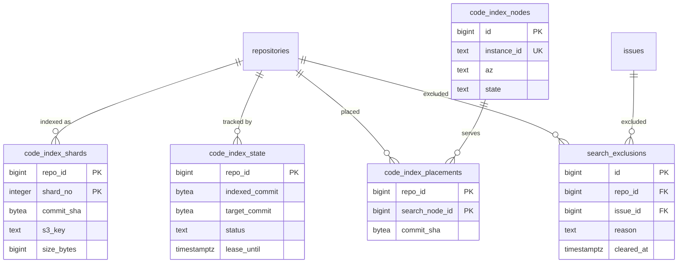

# Data model: 検索

[data-model.md](../data-model.md) の一部。振る舞いは [search.md](../search.md)、決定は [ADR-0014](../../decisions/0014-code-search-engine.md)・[ADR-0015](../../decisions/0015-search-permission-filtering.md)。

- コードの索引（Zoekt）と Issue・PR・リポジトリの索引（OpenSearch）は正本ではない。Aurora には、コードの索引の割り当てと進み具合、権限の属性の変更の除外の表だけを置く。
- 索引の文書の形（OpenSearch のマッピング、Zoekt のシャードの属性）は [non-relational.md](non-relational.md) の 4 節にある。

## ER 図

## テーブル

### `code_index_nodes`

Zoekt の索引のノード。出典：[search.md](../search.md) の 3.2 節。

- 区分：S／分割：なし／保持：退役の 30 日後に消す／S1：数十行

| 列 | 型 | NULL | 既定 | 説明 |
| --- | --- | --- | --- | --- |
| `id` | bigint | NO | IDENTITY | |
| `instance_id` | text | NO | | |
| `az` | text | NO | | |
| `state` | text | NO | `'active'` | `active`・`draining`・`offline` |
| `capacity_bytes` | bigint | NO | | |
| `used_bytes` | bigint | NO | 0 | |

- PK：`id`。UK：`instance_id`。

### `code_index_shards`

リポジトリの Zoekt のシャード（S3 が置き場）。大きなリポジトリは複数のシャードになる。出典：同 3.2・3.7 節。

- 区分：S（検索の結果は router が権限の条件を付けてから返す）／分割：なし／保持：新しいシャードに置き換えたら S3 と一緒に消す。リポジトリの削除で消す／S1：120 万行

| 列 | 型 | NULL | 既定 | 説明 |
| --- | --- | --- | --- | --- |
| `repo_id` | bigint | NO | | |
| `shard_no` | integer | NO | | 0 から |
| `commit_sha` | bytea | NO | | 索引したデフォルトブランチのコミット |
| `s3_key` | text | NO | | `code-index/{repo_id}/{commit_sha}/{shard_no}.zoekt` |
| `size_bytes` | bigint | NO | | 1 つ 4 GB 未満 |
| `built_at` | timestamptz | NO | now() | |

- PK：`(repo_id, shard_no)`。FK：`repo_id` → `repositories.id`。

### `code_index_placements`

リポジトリのシャードを置いたノード。異なる AZ の 2 つ。出典：同 3.2 節。

- 区分：S／分割：なし／保持：置き直しで消す／S1：200 万行

| 列 | 型 | NULL | 既定 | 説明 |
| --- | --- | --- | --- | --- |
| `repo_id` | bigint | NO | | |
| `search_node_id` | bigint | NO | | |
| `commit_sha` | bytea | YES | | そのノードが読み込み終えたコミット。NULL は読み込み中 |
| `updated_at` | timestamptz | NO | now() | |

- PK：`(repo_id, search_node_id)`。FK：`search_node_id` → `code_index_nodes.id`。
- 索引：`(search_node_id)` — ノードの故障での置き直し。
- 「両方のノードで検索できる」の判定（`code_index_lag`、除外の片付け）に `commit_sha` を使う。

### `code_index_state`

コードの索引の進み具合。イベントは `target_commit` を進めるだけにし、作業は `lease_until` で 1 台だけが取る。出典：同 3.3 節。

- 区分：S／分割：なし／保持：リポジトリの削除で消す／S1：100 万行

| 列 | 型 | NULL | 既定 | 説明 |
| --- | --- | --- | --- | --- |
| `repo_id` | bigint | NO | | |
| `indexed_commit` | bytea | YES | | 作り終えたコミット |
| `target_commit` | bytea | YES | | 作るべきコミット（デフォルトブランチの ref） |
| `target_updated_at` | timestamptz | YES | | 60 秒のまとめの起点 |
| `status` | text | NO | `'idle'` | `idle`・`pending`・`building`・`failed`・`skipped`（空、デフォルトブランチなし、fork の規則） |
| `partial` | boolean | NO | false | 2 GiB で打ち切った |
| `lease_until` | timestamptz | YES | | |
| `updated_at` | timestamptz | NO | now() | |

- PK：`repo_id`。FK：`repo_id` → `repositories.id`。
- 索引：`(target_updated_at) WHERE status = 'pending'` — まとめの時間を過ぎたものの取り出し。

### `search_exclusions`

権限の属性の変更（公開 → 非公開、持ち主・Enterprise の変更、削除、公開 → 非公開の Issue の移動）の後、索引の作り直しが済むまで検索から外す。出典：同 4.3 節、[ADR-0015](../../decisions/0015-search-permission-filtering.md)。

- 区分：S（すべての検索が毎回読む）／分割：なし／保持：`cleared_at` の 7 日後に消す／S1：常時 100 行未満

| 列 | 型 | NULL | 既定 | 説明 |
| --- | --- | --- | --- | --- |
| `id` | bigint | NO | IDENTITY | |
| `repo_id` | bigint | NO | | |
| `issue_id` | bigint | YES | | Issue の移動のとき |
| `reason` | text | NO | | `visibility_changed`・`owner_changed`・`enterprise_changed`・`deleted`・`issue_transferred` |
| `created_at` | timestamptz | NO | now() | |
| `cleared_at` | timestamptz | YES | | OpenSearch と Zoekt の両方が済んだ時刻 |

- PK：`id`。
- 索引：`(repo_id, issue_id) WHERE cleared_at IS NULL` — 検索のたびに未処理の行を読む。`(created_at) WHERE cleared_at IS NULL` — 15 分を超えて残る行の警報。
- 権限の属性を変える同じトランザクションで書く。
