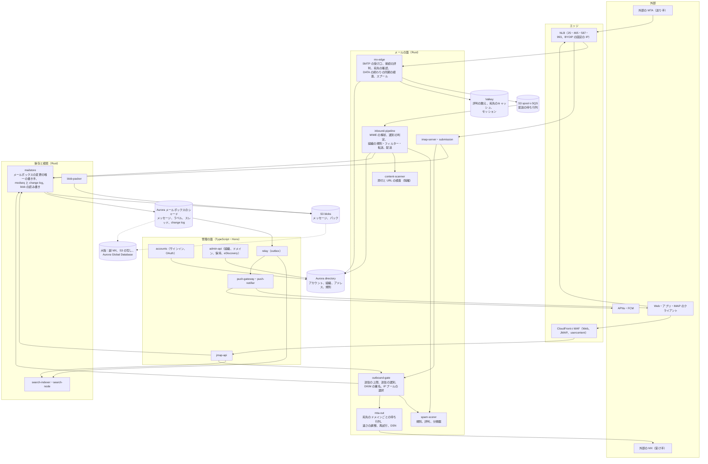

# Architecture: Gmail

全体像と横断的な方針。領域ごとの設計は、同じディレクトリに領域ごとのファイルとして置く（まだない。計画は 7 節）。品質の戦略は [quality.md](../quality.md)、Epic と Story は [roadmap.md](../roadmap.md)、SLO と運用は [runbooks/](../runbooks/README.md) にある。

## 1. 全体構成

### 1.1 コンテキスト

```
 外部の MTA（他社のメールのサービス、組織のメールのサーバー、送信の事業者）
      │ SMTP（25、STARTTLS）                                    ▲ SMTP（25、STARTTLS、MTA-STS）
      ▼                                                          │
┌──── 本システム（mx・smtp・imap・jmap・app.<brand>.<domain>）───────────────────────────────┐
│  受信の MX とスプール、送信者の認証、迷惑メールの選別、メールの保存（blob とメタデータ）、         │
│  ラベルとスレッド、検索、同期（JMAP・IMAP・プッシュ）、送信の MTA と評判、組織、保持と保留       │
└───────────────────────────────────────────────────────────────────────────┘
   ▲ Web・アプリ（JMAP、EventSource）  ▲ 第三者のアプリ（IMAP、SMTP の submission、OAuth）  │ 外向き
   │ SSO（SAML・OIDC）                  │                                                     ▼
 個人と組織の利用者、組織の管理者      既存のメールのアプリ                       APNs・FCM、DNS、外部の評判のデータ、
                                                                                    DMARC・TLS-RPT の報告の送り先
```

### 1.2 コンテナ



| コンテナ | 責務 |
| --- | --- |
| `mx-edge` | 受信の SMTP（25）。接続の評判と速さの上限、EHLO・STARTTLS、MAIL FROM の SPF の評価の開始、RCPT TO の宛先と容量の確認、DATA の終わりの同期の検査（DKIM・DMARC・ARC、既知のマルウェアのハッシュ、確信の高い規則）、スプールへの確定の後の 250（[ADR-0002](../decisions/0002-accept-then-filter.md)） |
| S3 spool・SQS | 受け付けた生のメッセージ（S3）と、配送の依頼（SQS）。250 の前に両方を確定する。掃除の役が、依頼の欠けたスプールを拾い直す |
| `inbound-pipeline` | MIME の解析、選別の判定（`spam-scorer`・`content-scanner`）、受け手ごとの組織の規則・利用者のフィルター・転送・不在の返信、`mailstore` への配送。`(spool_id, recipient)` で冪等 |
| `spam-scorer` | 規則、送信元の評判（IP、ドメイン、認証済みの識別子）、内容の分類器の推論。受信と送信の両方で使う（[ADR-0008](../decisions/0008-spam-pipeline-boundary-and-secrecy.md)） |
| `content-scanner` | 添付の静的な検査（署名とハッシュ、入れ子の書庫、マクロ、実行形式）と URL の取り出しと評判。ネットワークを持たない隔離したタスク |
| `mailstore` | メールボックスの状態の唯一の書き手。配送、ラベル、既読、スレッド、削除、容量。`modseq` を進め、change log と outbox を同じトランザクションで書く。blob の書き込みと読み出し（[ADR-0003](../decisions/0003-message-storage-layout-and-dedupe.md)、[ADR-0006](../decisions/0006-sync-protocol-jmap-imap-and-modseq.md)） |
| `blob-packer` | 1 日を過ぎた小さな blob を、パックのオブジェクトに詰め直す。生きている割合の低いパックを詰め直し、参照 0 の blob を消す |
| `search-indexer`・`search-node` | outbox からメッセージを読み、アカウントごとの索引のセグメントを作って S3 に置く。`search-node` はアカウントの範囲を受け持ち、NVMe にキャッシュして検索する（[ADR-0009](../decisions/0009-search-index-design.md)） |
| `jmap-api` | Web とアプリの API（JMAP の Core と Mail に本システムの拡張）。読み出しは `mailstore` と `search-node`、変更は `mailstore`、送信は `outbound-gate` へ |
| `push-gateway`・`push-notifier` | EventSource・WebSocket で接続中のクライアントへ状態の変化を送る。モバイルへ APNs・FCM で送る（中身は既定で持たない。法務の L3） |
| `imap-server`・`submission` | IMAP4rev2（993、CONDSTORE・QRESYNC、IDLE、OAuth）と SMTP の submission（465・587）。どちらも `mailstore`・`outbound-gate` の利用者 |
| `outbound-gate` | 元に戻す送信の窓と予約の送信の解放、アカウントの送信の上限、送信の内容の選別、乗っ取りの疑いでの保留、DKIM の署名、IP プールの選択。中の宛先は `mailstore` に直接配る |
| `mta-out` | 宛先のドメインごとの待ち行列と接続、MX の解決、MTA-STS、速さの調整（相手の 421・451 で絞る）、再試行と後退（最大 5 日）、DSN。BYOIP の IP を持つ EC2 で動く |
| `accounts`・`admin-api` | アカウント、サインイン、セッション、OAuth の認可のサーバー、組織、ドメイン、アドレス、グループ、配送の規則、保持と保留、eDiscovery、監査ログ |
| Aurora（directory） | アカウント、組織、ドメイン、アドレスの解決、規則、OAuth のクライアント。リージョンで 1 つ。FORCE RLS |
| Aurora（メールボックスのシャード） | メッセージ、ラベルの所属、スレッド、change log、IMAP の UID、下書き、送信の依頼。アカウントで分けた複数のクラスタ。FORCE RLS（[ADR-0007](../decisions/0007-tenancy-accounts-orgs-and-rls.md)） |
| S3 | スプール、blob とパック、索引のセグメント、報告。SSE-KMS と blob ごとの鍵。大阪へ CRR |
| Valkey | 接続と送信元の評判の数え、宛先の確認のキャッシュ、速さの上限、セッション。失ってよい |

原則は 6 つ。

- **確定してから 250。** 受信も送信も、耐久の置き場所（S3 と SQS、Aurora）に確定してから「受け付けた」と返す。受け付けた後は、配送か DSN のどちらかで必ず終わらせる（[ADR-0002](../decisions/0002-accept-then-filter.md)）。
- **SMTP の時点では安く確かなものだけ拒む。** 中身を深く見る判定は受け付けた後に行い、迷惑メールの箱か隔離に入れる。受け付けた後に送り返さない（[ADR-0002](../decisions/0002-accept-then-filter.md)）。
- **中身は blob、状態はメタデータ。** 生のメッセージは不変の blob（S3）に置き、ラベル・既読・スレッドはメタデータ（Aurora）に置く。状態の変更は blob に触れない（[ADR-0003](../decisions/0003-message-storage-layout-and-dedupe.md)）。
- **状態の書き手は 1 つ、変更は記録に。** メールボックスの変更は `mailstore` だけが書き、`modseq` と change log を同じトランザクションで残す。JMAP・IMAP・プッシュ・検索は、change log から追いつく（[ADR-0006](../decisions/0006-sync-protocol-jmap-imap-and-modseq.md)）。
- **アカウントで分ける。** メールボックスのシャード、索引、キャッシュの鍵は `account_id` を先頭に持つ。シャードはアカウントの単位で動かす（[ADR-0007](../decisions/0007-tenancy-accounts-orgs-and-rls.md)）。
- **機械だけが中身を見る。** 選別・索引・スレッド化は機械で行い、人の目に中身を出す経路を作らない。学習には特徴と同意のある報告だけを使う（[ADR-0008](../decisions/0008-spam-pipeline-boundary-and-secrecy.md)）。

### 1.3 主要な流れ

**A. 外部からメールを受け取り、受信箱に出す**

1. 送り手の MTA が `mx.<brand>.<domain>`（東京、優先度 10）へ接続する。`mx-edge` は、接続元の IP の評判（Valkey の数えと、評判のサービスの値）と、IP・/24・ASN ごとの接続の速さを確かめる。悪い評判は 554 で切り、評判の分からない IP の急な量は 421 で絞る。
2. EHLO、STARTTLS（TLS 1.2 以上）。MAIL FROM を受けたら SPF の評価を非同期で始める（RFC 7208、DNS の照会は 10 回まで）。
3. RCPT TO ごとに、アドレスを directory のキャッシュで解決する。ない宛先は 550 5.1.1、容量の超過は 452 4.2.2、停止したアカウントは 550 5.2.1。1 つのトランザクションの宛先は 100 まで。
4. DATA を受ける（SIZE は 50 MiB）。終わりに同期の検査（予算 10 秒）：DKIM の署名の検証、DMARC の評価（`p=reject` で揃いがなければ 550 5.7.26 の候補）、ARC の検査、既知のマルウェアのハッシュ、確信の高い規則。ここで拒むものは、送り手に 5xx を返し、後方散乱を作らない。
5. 生のメッセージと、封筒（MAIL FROM、宛先）、接続の情報、認証の結果を S3 のスプールに置き、SQS に配送の依頼を載せる。両方が確定したら `250 2.0.0 OK <spool_id>`。どちらかが失敗したら 451 4.3.0（[ADR-0002](../decisions/0002-accept-then-filter.md)）。
6. `inbound-pipeline` が依頼を受け、MIME を解析し、`spam-scorer`・`content-scanner` に判定を求める。判定は「受信箱」「迷惑メール」「隔離（組織）」「マルウェアとして添付を止める」のどれか。
7. 受け手ごとに、組織の配送の規則、利用者のフィルター、転送、不在の返信を当て、`mailstore.deliver(spool_id, recipient, verdict, labels)` を呼ぶ。`mailstore` は blob を書き（同じ配送の受け手の間で 1 つ）、メタデータ・ラベル・スレッド・`modseq`・change log・outbox を受け手のシャードの 1 つのトランザクションで書く。`(spool_id, recipient)` が既にあれば何もしない。
8. relay が outbox を読み、`push-gateway`（接続中のクライアントと IMAP の IDLE）、`push-notifier`（モバイル）、`search-indexer` へ流す。

**B. 利用者が送る**

1. クライアントが JMAP で下書きを保存し（`Email/set`）、送信を依頼する（`EmailSubmission/set`）。`mailstore` は送信の依頼を `release_at`（今＋元に戻す送信の窓、または予約の時刻）で保存し、受け付けを返す。この時点でメッセージは「送信済み」のラベルを持たない。
2. 窓の中の取り消しは、依頼を消して下書きに戻す。
3. `release_at` で `outbound-gate` が依頼を取り、アカウントの送信の上限、送信の内容の選別（`spam-scorer` の送信の側の判定）、乗っ取りの疑いを確かめる。疑いがあれば保留にして本人に知らせる。
4. 通れば、DKIM で署名し（本システムのドメインか組織のドメインの鍵）、送信済みのラベルを付ける。本システムの中の宛先は `mailstore` に直接配る（同じ blob）。外の宛先は、宛先のドメインごとの配送の依頼にして `mta-out` の待ち行列に載せる。
5. `mta-out` は MX を解決し、MTA-STS の方針を確かめ（`enforce` なら証明書の検証が通らなければ送らない）、ドメインごとの接続と速さで送る。4xx は後退して再試行し（最大 5 日）、5xx か期限切れで DSN を作って送り手の受信箱に配る。

**C. 状態の変化をクライアントへ届ける**

1. どの変更も、`mailstore` がアカウントの `modseq` を 1 つ進め、change log に（`modseq`、種類、メッセージ・スレッド・ラベルの ID）を書く。
2. `push-gateway` は、アカウントの接続中のクライアントへ JMAP の `StateChange` を、IMAP の IDLE のセッションへ通知を送る。中身は送らない。
3. クライアントは `Email/changes`（JMAP）か `QRESYNC`・`CHANGEDSINCE`（IMAP）で、手元の状態からの差分を取る。change log の保持（既定 30 日）より古い状態からは、全体の取り直しを求める（[ADR-0006](../decisions/0006-sync-protocol-jmap-imap-and-modseq.md)）。

**D. 検索する**

1. `jmap-api` が検索の文字列（`from:sato has:attachment 請求書 before:2026/09/01`）を、検索の IR に変換する。同じ IR を、利用者のフィルターの評価にも使う。
2. アカウントを受け持つ `search-node` が、本文の語（日本語は 2-gram、英語は語）で候補を絞り、変わらない属性（差出人、日付、大きさ、添付の有無、添付の名前）を doc values で当てる。
3. 変わる状態（ラベル、既読、スター）は、change log から追う、アカウントごとの状態のビットマップで当てる。日付の新しい順に ID を返し、`jmap-api` が `mailstore` から中身を取る（[ADR-0009](../decisions/0009-search-index-design.md)）。

**E. 利用者が迷惑メールを報告する**

1. 利用者が「迷惑メールを報告」を押すと、`mailstore` がラベルを迷惑メールへ変え、報告のイベントを outbox に書く。
2. 評判のサービスは、送信元の IP、認証済みのドメイン、URL のドメイン、中身の指紋（ハッシュ）を特徴として数える。中身そのものは使わない。
3. 利用者が「サンプルを提出する」に同意したときだけ、そのメッセージの写しを、報告のサンプルの置き場所（操作する人を限り、監査を残す）に写す（[ADR-0008](../decisions/0008-spam-pipeline-boundary-and-secrecy.md)）。

### 1.4 本家の形（確かめたこと）

| 項目 | 本家 | 出典 |
| --- | --- | --- |
| 送信者への要件 | 2024-02-01 から。全員に SPF か DKIM、PTR、TLS、迷惑メールの率 0.3% 未満。1 日 5,000 通超は SPF・DKIM・DMARC、From の揃い、一括の配信停止 | [Email sender guidelines](https://support.google.com/a/answer/81126) |
| 添付の大きさ | 個人は 25 MB | [Attachment size limits](https://support.google.com/mail/answer/6584) |
| 送信の上限 | 個人は 1 日 500 通・1 通の宛先 500。Workspace は 1 日 2,000 通、1 日の宛先 10,000、外部 3,000 | [Sending limits](https://support.google.com/mail/answer/22839)、[Workspace sending limits](https://knowledge.workspace.google.com/admin/gmail/gmail-sending-limits-in-google-workspace) |
| 容量 | 無料は 15 GB を Drive・Photos と共有。迷惑メールとゴミ箱も数える | [How storage works](https://support.google.com/googleone/answer/9312312) |
| 会話（スレッド） | 件名が変わると分かれる。100 通を超えると分かれる。自動の通知は 1 週間の中でまとめることがある | [Group emails into conversations](https://support.google.com/mail/answer/5900) |
| ラベル | フォルダーと違い、本人にだけ見える | [Create labels](https://support.google.com/mail/answer/118708) |
| 検索の演算子 | `from:`、`has:attachment`、`before:`、`older_than:`、`label:`、`in:`、`is:`、`larger:`、`AROUND` など | [Search operators](https://support.google.com/mail/answer/7190) |
| 元に戻す送信 | 5・10・20・30 秒から選ぶ | [Undo sending](https://support.google.com/mail/answer/2819488) |
| 不在の返信 | 同じ差出人へは原則 1 回、4 日後に再び。迷惑メールとメーリングリストには返さない | [Automatic replies](https://support.google.com/mail/answer/25922) |
| IMAP | 常に有効（個人、2025 年 1 月から）。同時の接続 15。ラベルを箱として扱う独自の拡張 | [Add Gmail to another client](https://support.google.com/mail/answer/7126229)、[IMAP Extensions](https://developers.google.com/workspace/gmail/imap/imap-extensions) |
| BIMI | VMC か CMC、DMARC の `quarantine` か `reject` と `pct=100` | [Set up BIMI](https://knowledge.workspace.google.com/admin/security/set-up-bimi) |
| 機密モード | 期限、取り消し、転送の禁止、SMS の確認の番号。画面の写しは防げない | [Confidential mode](https://support.google.com/mail/answer/7674059) |
| 選別の質 | 迷惑メール・フィッシング・マルウェアの 99.9% 超を止める（2020 年の記事） | [Google Cloud Blog](https://cloud.google.com/blog/products/identity-security/protecting-against-cyber-threats-during-covid-19-and-beyond) |
| 内部の選別の仕組み、スレッド化の詳しい規則、受信の大きさの上限、保存の形式、同期の内部の API、予約の送信の上限、ゴミ箱の保持の日数、SLA | 公式の資料で確かめられなかった（**未検証**） | — |

いずれも 2026-10-10 に確認。この設計は振る舞いを参考にするが、本家のコード・内部の形式は使わない（[リポジトリ共通の ADR-0007](../../../../docs/decisions/0007-no-reuse-of-original-implementation.md)）。

**本家との意図した違い**：

| 項目 | 本家 | 本システム | 理由・根拠 |
| --- | --- | --- | --- |
| クライアントの API | 独自の Web の API と REST の API。IMAP は独自の拡張（`X-GM-*`） | JMAP（RFC 8620・8621）を Web・アプリ・第三者の API にする。IMAP は標準の拡張（OBJECTID、CONDSTORE・QRESYNC）だけ | 公開の標準で、ラベル（複数の箱への所属）とスレッドを表せる。独自の拡張の名前は使えない（リポジトリ共通の ADR-0006、[ADR-0006](../decisions/0006-sync-protocol-jmap-imap-and-modseq.md)） |
| 容量 | 15 GB を他のサービスと共有 | 15 GB をメールだけで数える | 他のサービスを持たない |
| 機密モード | ある | MVP では持たない | 画面の写しを防げず、誤った安心を与える。SMS の確認は法務の L3 |
| URL の書き換え | 書き換えるかは**未検証** | 本文の URL を書き換えない。開くときに Web とアプリで評判を確かめる | 本文を変えると DKIM と転送が壊れ、通信の中身への介入が増える（法務の L1） |
| 予約の送信の上限 | 100 通（**未検証**） | 100 通、1 年先まで | 本家の値に寄せる。1 年は本システムの既定 |
| データの所在 | 多くの国 | すべて日本（東京、DR は大阪） | 日本を最初の市場にする |
| 識別子 | 本家の名前を含む | `<brand>`・`<Brand>` | リポジトリ共通の ADR-0006 |

## 2. 規模の段階

| 段階 | アカウント | 受信（受け付け） | 受信の申し出（SMTP の時点の拒否を含む） | 送信 | 保存（物理） | メタデータ | 同時の接続 | 構成 |
| --- | --- | --- | --- | --- | --- | --- | --- | --- |
| S1（MVP） | 100 万（個人 80 万、組織 2,000・20 万人） | 6,000 万通/日（平均 700/秒、ピーク 2,500/秒） | 1.5 億通/日 | 300 万通/日（ピーク 150/秒）。外へ 200 万 | 1.5 PB（3 年後。論理 2 PB） | メッセージの行 270 億、Aurora 8 シャード | IMAP 20 万、Web のプッシュ 10 万、モバイルの端末 150 万 | 東京の 1 リージョン・3 AZ。大阪に副 MX、S3 の写し、Aurora Global Database |
| S2 | 1,000 万 | 6 億通/日（ピーク 2.5 万/秒） | 15 億通/日 | 3,000 万通/日 | 15 PB | 2,700 億、80 シャード | IMAP 200 万、プッシュ 100 万 | 東京でシャードとプールを増やす。送信の IP プールを /24 の単位で増やす |
| S3 | 1 億 | 60 億通/日（ピーク 25 万/秒） | 150 億通/日 | 3 億通/日 | 150 PB | 2.7 兆、800 シャード | IMAP 2,000 万、プッシュ 1,000 万 | 複数のリージョン（アカウントをリージョンに固定）、セルの構成 |

- 数値は本システムの想定。本家の利用者の数、送受信の量は、公開の資料で確かめなかった（**未検証**）。
- アカウントあたり 1 日 60 通の受け付け（迷惑メールの箱に入るものを含む）、申し出の 6 割を SMTP の時点で拒むと見込んだ。送信は 1 日 3 通。
- 保存は、アカウントあたり平均 2 GB（3 年後）、1 通あたり平均 75 KB で、1 アカウント 2.7 万通。圧縮で文字の部分が 1/3 になり、添付（もとから圧縮済み）は変わらないとして、物理は論理の 0.75 倍。同じ配送の受け手の間の共有は、個人では 5%、組織では 20% の節約と見込む（`blob-pack-poc` で確かめる）。
- メッセージの行は、索引を含めて 1 行 600 バイトで 16 TB。1 つの Aurora のクラスタに 2 TB を目安に 8 シャード（`mailbox-shard-poc` で確かめる）。
- 検索の索引は、文字の部分の 3 割（1 アカウント 100 MB）で S1 は 100 TB。直近 30 日に使ったアカウント（2 割）を NVMe に置く。
- 段階を上げる基準は infrastructure の領域、負荷と費用のモデルは capacity の領域で決める。

### 2.1 費用のモデル

アカウントあたり・月の原価を、次の和で見る。単価は capacity の領域で、AWS の東京の公開の価格から入れる。

```
原価 = 受信（mx-edge の EC2、NLB、S3 のスプールの PUT、SQS、選別の CPU）
     ＋ 送信（outbound-gate、mta-out の EC2、BYOIP の IP の保持）
     ＋ 保存（S3 の blob とパック、PUT・GET の要求、大阪への写し、Aurora のシャード）
     ＋ 検索（索引の作成、S3 の索引、search-node の NVMe とメモリー）
     ＋ 同期（jmap-api、push、imap-server の接続）
     ＋ 管理の面（Aurora の directory、Valkey、Fargate）
```

- 最も大きいのは、保存（アカウントの容量に比例）と、受信の選別（申し出の量に比例し、迷惑メールが多いほど増える）と見込む。SMTP の時点で安く拒むこと（[ADR-0002](../decisions/0002-accept-then-filter.md)）と、小さな blob のパック（[ADR-0003](../decisions/0003-message-storage-layout-and-dedupe.md)）が、原価の制御の主な手段になる。
- S1 の仮の予算（本システムの想定）は、個人のアカウントあたり月 0.15 USD（容量 2 GB）。capacity の領域で、PoC の計測と公開の価格で置き換える。

## 3. 非機能要件

| ID | 項目 | S1 の目標 | 備考 |
| --- | --- | --- | --- |
| NFR-001 | 受信の遅れ | 250 から受信箱（クライアントに見える）まで p50 2 秒・p95 10 秒・p99 30 秒。迷惑メールの箱も同じ | [ADR-0002](../decisions/0002-accept-then-filter.md) |
| NFR-002 | 送信の遅れ | 送信の受け付けの応答 p99 500ms。窓（元に戻す送信）の後、外部の MX への最初の試行まで p95 5 秒・p99 30 秒。本システムの中の宛先の受信箱まで p95 5 秒 | outbound-smtp-and-reputation の領域 |
| NFR-003 | SMTP の応答 | 220 の挨拶 p99 100ms。DATA の終わりの 250 は、1 MiB まで p99 2 秒、50 MiB まで p99 10 秒 | inbound-smtp の領域 |
| NFR-004 | 耐久性 | 250・送信の受け付けの後の消失 0。AZ の障害で RPO 0。リージョンの障害で、メタデータ RPO 1 分、blob とスプール RPO 15 分、受信の受け付けの再開 RTO 0（大阪の副 MX）、配送と閲覧の再開 RTO 1 時間 | [ADR-0002](../decisions/0002-accept-then-filter.md)、[ADR-0003](../decisions/0003-message-storage-layout-and-dedupe.md) |
| NFR-005 | 検索 | 10 万通までのアカウントで p95 300ms・p99 1 秒。新しいメールが検索に出るまで p95 10 秒・p99 60 秒 | [ADR-0009](../decisions/0009-search-index-design.md) |
| NFR-006 | 同期 | 変更から接続中のクライアント（JMAP、IMAP の IDLE）への通知 p95 2 秒・p99 5 秒。モバイルのプッシュの依頼（APNs・FCM への受け渡し）p95 5 秒。すべての変更を受けた後、どのクライアントの状態もサーバーと一致する | [ADR-0006](../decisions/0006-sync-protocol-jmap-imap-and-modseq.md) |
| NFR-007 | 可用性 | MX の受け付け 月間 99.99%（大阪の副 MX を含む）。Web・JMAP・IMAP 月間 99.9%。送信の受け付け 月間 99.95% | 本家の SLA は公式の資料で確かめなかった（**未検証**） |
| NFR-008 | 選別の捕捉 | 迷惑メールの捕捉の率 99.9% 以上、フィッシング 99.5% 以上（評価の集まり）。既知のマルウェアの添付の到達 0。受信箱に届いた迷惑メールへの利用者の報告の率 0.05% 以下 | [ADR-0008](../decisions/0008-spam-pipeline-boundary-and-secrecy.md)、[quality.md](../quality.md) |
| NFR-009 | 選別の誤り | 正規のメールの誤判定（迷惑メールの箱・隔離へ）0.05% 以下。本人がやりとりしたことのある相手からのメールでは 0.005% 以下 | 同上 |
| NFR-010 | 分離 | 他のアカウント・組織のメール（中身、件名、有無）が見えた事象 0 件 | [ADR-0007](../decisions/0007-tenancy-accounts-orgs-and-rls.md) |
| NFR-011 | 大きさと上限 | 送信 25 MiB（添付の合計、本家に合わせる）、受信 50 MiB（SMTP の SIZE）、容量の既定 15 GB、個人の送信 1 日 500 通・1 通の宛先 500、組織の送信は本家の Workspace の値 | intent.md の出典 |
| NFR-012 | 送信の評判 | 共有の IP プールで、外部のフィードバックループの苦情の率 0.1% 未満。主な公開のブロックリストへの掲載 月 0 時間を目標、掲載から 4 時間以内に原因の止めと解除の申請 | outbound-smtp-and-reputation の領域、[runbooks/](../runbooks/README.md) |
| NFR-013 | Web の表示 | 受信箱の最初の表示 p95 1.5 秒。スレッドを開く p95 500ms。操作（既読、アーカイブ、ラベル）の画面の反映 100ms 以内（楽観の更新） | web-client の領域 |
| NFR-014 | IMAP | `SELECT`（QRESYNC つき）p99 1 秒（10 万通の箱）。同時の接続はアカウントあたり 15（本家に合わせる） | client-sync-and-protocols の領域 |
| NFR-015 | 消去 | 利用者の完全な削除・ゴミ箱の期限の後、保留のないメッセージを決めた期限の中で読めなくする（暗号の鍵の破棄は 24 時間以内）。物理の消去の期限は法務の L6 で決める | [ADR-0003](../decisions/0003-message-storage-layout-and-dedupe.md) |

## 4. 技術スタック

| 層 | 選定 | 理由 |
| --- | --- | --- |
| 管理の面の言語 | TypeScript（Hono＋Zod）：`jmap-api`、`push-*`、`accounts`、`admin-api`、`relay` | 他の題材と同じ（[ADR-0001](../decisions/0001-platform-and-stack.md)） |
| メールの面と保存の言語 | Rust（Tokio）：`mx-edge`、`inbound-pipeline`、`spam-scorer`、`content-scanner`、`outbound-gate`、`mta-out`、`imap-server`、`mailstore`、`blob-packer`、`search-*` | [ADR-0001](../decisions/0001-platform-and-stack.md)。共通の基盤からの外れ |
| SMTP・MIME | SMTP の状態の機械・待ち行列・配送は自前。コマンドの構文の層と MIME の解析は汎用のライブラリ（候補は PoC で選ぶ）を、自前の上限の層で包む | [ADR-0001](../decisions/0001-platform-and-stack.md) |
| 認証 | SPF・DKIM・DMARC・ARC の評価と署名は自前。暗号（RSA、Ed25519）と DNS の解決は汎用のライブラリ。DNSSEC を検証する再帰の解決は Route 53 Resolver | sender-authentication の領域 |
| 選別 | 規則のエンジンと評判は自前。分類器の推論は ONNX Runtime（汎用の実行系）。学習は Python（オフライン、隔離したアカウント）。マルウェアの署名の検出は汎用のエンジン（ClamAV の類）と YARA の形の規則 | [ADR-0001](../decisions/0001-platform-and-stack.md)、[ADR-0008](../decisions/0008-spam-pipeline-boundary-and-secrecy.md) |
| 配送の待ち行列 | S3 のスプール＋SQS（標準）。送信は SQS の遅延と送り直し | 他の題材と同じ部品（[ADR-0002](../decisions/0002-accept-then-filter.md)） |
| メッセージの保存 | S3 の blob（zstd のフレーム、blob ごとのデータの鍵）と、パックのオブジェクト | [ADR-0003](../decisions/0003-message-storage-layout-and-dedupe.md) |
| メタデータ | Aurora PostgreSQL 18。directory は 1 つ、メールボックスはアカウントで分けたシャード。FORCE RLS と `SET LOCAL`、UUIDv7、outbox | [ADR-0007](../decisions/0007-tenancy-accounts-orgs-and-rls.md) |
| 検索 | 自前の索引（アカウントごとのセグメント、2-gram と語、doc values、状態のビットマップ）。S3 と NVMe のキャッシュ | [ADR-0009](../decisions/0009-search-index-design.md) |
| 同期 | JMAP（Core・Mail・WebSocket・EventSource）、IMAP4rev2（CONDSTORE・QRESYNC・IDLE・OBJECTID・MOVE・SPECIAL-USE）、SMTP の submission（465・587）。認証は OAuth（`OAUTHBEARER`） | [ADR-0006](../decisions/0006-sync-protocol-jmap-imap-and-modseq.md) |
| キャッシュ | ElastiCache Valkey | 他の題材と同じ。失ってよい部品 |
| 非同期（管理の面） | transactional outbox → SNS・SQS | 他の題材と同じ |
| 実行基盤 | 状態を持たない部品は ECS Fargate。固定の IP の要る `mx-edge`・`mta-out` と、NVMe の要る `search-node` は ECS の EC2 のキャパシティープロバイダー | [ADR-0001](../decisions/0001-platform-and-stack.md)。共通の基盤からの外れ |
| IP | 自社の IP の範囲を BYOIP で持ち込み、受信の MX と送信のプールに使う。IPv4 と IPv6、正引きと逆引きを揃える | [ADR-0001](../decisions/0001-platform-and-stack.md) |
| オブジェクトストレージ | S3（SSE-KMS とバケットキー、大阪への CRR と RTC） | [ADR-0003](../decisions/0003-message-storage-layout-and-dedupe.md) |
| IaC | Terraform | 他の題材と同じ |
| 観測 | OpenTelemetry → CloudWatch・AMP・Managed Grafana。外からの見張り（見張りのメールの送受） | observability の領域 |
| フラグ | AWS AppConfig | 他の題材と同じ |
| Web | React（TypeScript）、JMAP のクライアントのライブラリは自前 | web-client の領域 |
| モバイル | iOS（Swift）・Android（Kotlin）。オフラインの DB と JMAP の同期の層を各 OS で持つ | mobile-and-push の領域 |
| テスト | `cargo test`・proptest・cargo-fuzz、Vitest・fast-check、自前の SMTP の相手の模型（`smtp-peer-sim`）、認証の試験のベクトル、選別の評価の枠、同期の収束の模型、Testcontainers（PostgreSQL 18、Valkey）、LocalStack（S3・SQS）、Playwright | [quality.md](../quality.md) |

## 5. 主な決定

どれも `accepted`。0001〜0009 は最初の設計の起票。状態の一覧は [decisions/README.md](../decisions/README.md)。

| ADR | 決定 |
| --- | --- |
| [0001](../decisions/0001-platform-and-stack.md) | 管理の面は共通の基盤（TypeScript・Hono、Aurora、Fargate）を引き継ぎ、MTA・選別・保存・検索・IMAP は Rust で書く。メールの送受信に SES を使わず、BYOIP の IP を持つ自前の MTA を EC2 で動かす。汎用の部品は一覧の範囲で使う |
| [0002](../decisions/0002-accept-then-filter.md) | SMTP の時点では、接続の評判・宛先・容量・認証の失敗・既知のマルウェアのような安く確かなものだけを拒む。中身の選別は、スプールと待ち行列に確定して 250 を返した後に行い、迷惑メールの箱か隔離に入れる。受け付けた後に迷惑メールを送り返さない。グレーリストは使わない |
| [0003](../decisions/0003-message-storage-layout-and-dedupe.md) | 生のメッセージを不変の blob として S3 に置き、状態はメタデータに置く。blob は同じ配送の受け手の間でだけ共有し、受け手ごとのヘッダーは別に持つ。zstd のフレームで圧縮し、blob ごとのデータの鍵で暗号化する。小さな blob は 1 日後にパックへ詰め直す。消去は鍵の破棄と参照の数え |
| [0004](../decisions/0004-labels-as-primary-mailbox-model.md) | メールボックスのモデルはラベルを正とする。メッセージは複数のラベルを持ち、受信箱・送信済み・下書き・迷惑メール・ゴミ箱もシステムのラベルにする。迷惑メールとゴミ箱は他のラベルと排他にする。フォルダーは見せ方で、IMAP ではラベルを箱として見せる |
| [0005](../decisions/0005-threading-algorithm.md) | スレッドはアカウントごとに作る。`References`・`In-Reply-To` の Message-ID のつながり（届いていない親を仮の節にした素集合）と、正規化した件名の一致で合わせる。参照のないメールは同じ差出人・同じ件名・7 日の中で合わせる。100 通で新しいスレッドにする。合わせはあるが、自動で分けない |
| [0006](../decisions/0006-sync-protocol-jmap-imap-and-modseq.md) | Web・アプリ・第三者の API は JMAP（RFC 8620・8621）に本システムの拡張を足して使い、既存のアプリには IMAP4rev2（CONDSTORE・QRESYNC）を出す。独自の同期の API は作らない。両方を、アカウントごとの `modseq` と change log の上に作る |
| [0007](../decisions/0007-tenancy-accounts-orgs-and-rls.md) | テナントは組織、個人のアカウントは 1 人の個人のテナントとする。メールボックスの表はアカウントの単位で Aurora のシャードに置き、`tenant_id`・`account_id` で FORCE RLS にする。配送は受け手の文脈で書く。テナントをまたぐ経路は一覧にして専用のロールを通す |
| [0008](../decisions/0008-spam-pipeline-boundary-and-secrecy.md) | 選別のパイプラインは、接続の情報・中身から作った特徴・中身そのものを分け、中身そのものは選別の処理の中だけで機械が読む。人が中身を見るのは同意のある報告だけ。学習は特徴と同意のある報告で行う。選別は利用者の同意の仕組みの上で既定で有効にし、範囲と変え方を示す（法務の L1 の結論で調整する） |
| [0009](../decisions/0009-search-index-design.md) | 検索の索引は自前で、アカウントごとの不変のセグメント（日本語は 2-gram、英語は語、NFKC と大文字小文字の畳み込み）を S3 に置き、`search-node` がアカウントの範囲を受け持って NVMe にキャッシュする。変わる状態（ラベル、既読）は索引に入れず、change log から追う状態のビットマップで当てる |

領域ごとの ADR は、7 節の番号の範囲で起票する。リポジトリ共通の決定（開発プロセス、ブランチモデル、本家の名前・接頭辞を使わない規則の [ADR-0006](../../../../docs/decisions/0006-brand-neutral-identifiers.md)、本家の実装を核に使わない規則の [ADR-0007](../../../../docs/decisions/0007-no-reuse-of-original-implementation.md)）は、ルートの [docs/decisions/](../../../../docs/decisions/README.md) にある。

## 6. リスクと未解決事項

品質の面のリスクの順位と対策は [quality.md](../quality.md) の 1 節にある。ここは設計の面のリスクを書く。

- **受け付けたメールの消失**：250 の後、配送の前に、スプールの欠け・待ち行列の欠け・配送の誤りで消える。利用者は気づけず、送り手は届いたと思う。250 の前の確定、スプールの掃除、見張りのメールの照合で抑える（[ADR-0002](../decisions/0002-accept-then-filter.md)）。
- **送信の IP の評判の崩れ**：乗っ取られたアカウント・迷惑な利用者の送信で、共有の IP が公開のブロックリストに載り、全員のメールが外部に届かなくなる。AWS の IP の範囲はもともと評判が低いと見込む（**未検証**）。BYOIP の自社の範囲、プールの分け方、送信の選別、アカウントの送信の上限と保留で抑える（outbound-smtp-and-reputation の領域）。
- **選別の誤り**：正規のメール（取引先、本人の確認、請求）を迷惑メールにすると、利用者は気づかず損をする。迷惑メールを受信箱に入れると、フィッシングの被害になる。評価の集まり、段階的なモデルの出し方、誤判定の報告の監視で抑える（[ADR-0008](../decisions/0008-spam-pipeline-boundary-and-secrecy.md)）。
- **通信の秘密**：選別・索引・送信の選別が、法務の結論で範囲や同意の形を変えることになる。同意の設定と範囲の限定を、最初から設定で切り替えられる形にする（法務の L1）。
- **壊れたメールと悪意のあるメール**：日本の旧来の文字コードの壊れたメール、巨大な入れ子、圧縮の爆弾、解析の誤りで、表示が崩れ、選別をすり抜け、処理が止まる。上限の層、ファジング、隔離したタスクで抑える（message-parsing-and-storage、attachment-and-url-scanning の領域）。
- **同期のずれ**：Web・アプリ・IMAP の状態がずれる。IMAP の UID と `modseq` の誤りは、既存のアプリにメールの重複や消失として見える。唯一の書き手と change log、収束の性質ベーステストで抑える（[ADR-0006](../decisions/0006-sync-protocol-jmap-imap-and-modseq.md)）。
- **メタデータの量**：メッセージの行が S1 で 270 億になる。シャードの偏り（大きなアカウント、組織の共有の受信箱）と、シャードの移し替えが運用の負担になる（[ADR-0007](../decisions/0007-tenancy-accounts-orgs-and-rls.md)、`mailbox-shard-poc`）。
- **スレッドの乗っ取り**：攻撃者が既存のスレッドの Message-ID を `References` に入れ、フィッシングを本物の会話の中に見せる。件名の一致の条件と、認証の失敗の表示で抑える（[ADR-0005](../decisions/0005-threading-algorithm.md)）。
- **アカウントの乗っ取り**：パスワードの使い回しとフィッシングで乗っ取られ、転送の規則を仕込まれ、メールを抜かれる。パスキー、危険度での確かめ、転送の先の確かめ、規則の変更の通知で抑える（accounts-and-security の領域）。
- **法令**：法務の確認待ちの事項がある（[intent.md](../intent.md) の「法務の確認待ち」の L1〜L10）。結論が出るまで、そこに挙げた Epic の spec を承認しない。

### 決定（2026-10-10、既定案）

PM の方針（本家に寄せ、判断が要るところは推奨の既定案で進める）により、最初の設計で次のとおり決めた。法務の判断が要るものは決めず、[intent.md](../intent.md) の「法務の確認待ち」に残した。どれも領域の文書の工程と E1〜E17 の PoC・試験で覆りうる。

- **メールの面の言語**：Rust。接続の数（IMAP 20 万）、MIME の解析の安全、選別の CPU の効率を理由にした（[ADR-0001](../decisions/0001-platform-and-stack.md)）。
- **SES を使わない**：送信の IP と評判、DSN、受信の SMTP の時点の判定を自分で持つ。Google Calendar の題材の iMIP は SES のままでよい（別の製品）。
- **SMTP の時点の拒否と、受け付けた後の選別**：安く確かなものだけを SMTP で拒み、残りは 250 の後に選別する（[ADR-0002](../decisions/0002-accept-then-filter.md)）。
- **グレーリスト**：使わない。正規のメールを数分〜数十分遅らせ、NFR-001 を満たせない。評判の分からない IP の急な量にだけ、421 での一時の絞り（同じ IP を 15 分まで）を使う（[ADR-0002](../decisions/0002-accept-then-filter.md)）。
- **MTA-STS と TLS-RPT**：本システムのドメインに `mode: enforce` で公開し、TLS-RPT の報告を受ける。送信は相手の MTA-STS を守り、相手が TLS-RPT を公開していれば報告を送る。送信の DANE は MVP の後。
- **BIMI**：MVP では表示しない（`BIMI-Location` と VMC の有無を記録だけする）。MVP の後に、VMC・CMC の検証、SVG の安全な描画、DMARC の条件（`quarantine` 以上、`pct=100`）で表示する。
- **同期のプロトコル**：JMAP を主の API、IMAP を既存のアプリ向けにする。独自の同期の API は作らない。POP3 は MVP の後（[ADR-0006](../decisions/0006-sync-protocol-jmap-imap-and-modseq.md)）。
- **アプリのパスワード**：作らない。IMAP と submission は OAuth（`OAUTHBEARER`・`XOAUTH2`）だけ。複合機などの機器の送信は、組織の SMTP のリレー（IP の許可の一覧）で MVP の後に扱う。
- **S/MIME**：MVP では扱わない（署名は普通の添付として見える）。MVP の後に組織向けに、受信の署名の検証と表示から足す。
- **機密モード**：作らない（1.4 節）。延期の一覧に置く。
- **URL の書き換え**：しない（1.4 節）。外部の画像は `<brand>usercontent.<domain>` の代理で取得して表示する（利用者の IP と既読を送り手に渡さない）。迷惑メールの箱の画像は表示しない。
- **一括の配信停止**：受信したメールに `List-Unsubscribe-Post: List-Unsubscribe=One-Click` があり、DKIM の署名がそのヘッダーを含んで通るとき、Web とアプリに配信停止のボタンを出し、本システムの egress から POST する（法務の L2 の (d)）。送信の側は、組織の利用者が大量に送る宣伝のメールに付けられるようにする。
- **元に戻す送信**：5・10・20・30 秒（本家に合わせる。既定は 5 秒。本家の既定は**未検証**）。窓の間は `mailstore` の送信の依頼として持ち、MTA に渡さない。
- **予約の送信**：アカウントあたり 100 通、1 年先まで。
- **不在の返信**：本家に合わせ、同じ差出人へは 4 日に 1 回。迷惑メール、`List-Id`・`Precedence: bulk`・`Auto-Submitted` を持つメールには返さない（RFC 3834）。
- **ゴミ箱と迷惑メールの箱**：30 日で自動で消す（本家の日数は**未検証**）。
- **容量の超過**：受信を RCPT の 452 4.2.2 で一時の拒否にする（送り手の再試行の期限で送り手が DSN を出す）。送信は止めない。長期の超過の消去は法務の L6。
- **受信箱の分類（タブ）と「重要」の自動の判定**：MVP の後。中身による分類は法務の L1 の範囲を見てから。MVP の「重要」は利用者の印と連絡先の規則だけ。
- **送信の IP プール**：個人、組織（評判の層ごと）、本システムの通知と DSN、転送、疑い（評判の低い送信を隔てる）、ウォームアップ中の 6 つに分ける（outbound-smtp-and-reputation の領域）。
- **外部の評判のデータ**：公開・商用のブロックリストを、判定の入力の 1 つとして使い、それだけで拒まない（自社の評判と組み合わせる）。照会に送るのは IP とドメインだけ（法務の L5・L10）。
- **本家の名前**：識別子は `<Brand>`・`<brand>`（リポジトリ共通の ADR-0006）。

持ち越し（法務、計測・PoC・選定で決めるもの）：

| 項目 | いつ・どう決めるか |
| --- | --- |
| 法務の確認待ち（L1〜L10） | [intent.md](../intent.md) の「法務の確認待ち」。結論まで、そこに挙げた Story の spec を承認しない |
| 受信と送信の 1 台あたりの量、BYOIP の手続き | E2 の前の `mx-throughput-poc` |
| MIME の解析のライブラリの選定 | E4 の前の `mime-parser-poc` |
| blob のパックの大きさ、zstd の水準と辞書、S3 の要求の費用 | E4 の前の `blob-pack-poc` |
| メールボックスのシャードの大きさ | E4 の前の `mailbox-shard-poc` |
| 内容の分類器の形と推論の遅れ | E6 の前の `spam-classifier-poc` |
| 日本語の索引（2-gram と形態素の併用）の効き | E10 の前の `search-index-poc` |
| S2 以降のセルの構成、リージョンへのアカウントの固定 | infrastructure の領域 |
| 費用の単価（S3、EC2、Aurora、IP） | capacity の領域。公開の価格で入れる |
| 本家の振る舞いで未確認のもの（選別の仕組み、スレッド化の詳しい規則、受信の上限、ゴミ箱の日数、SLA） | 各領域の文書で公式の資料で確かめる。確かめられなければ未検証のまま、本システムの値を使う |

## 7. 領域の文書（計画）

各領域の文書は、まだない。領域の担当は、下の表の番号の範囲の中で ADR を採番する（範囲の外に出るときは、この表を先に更新する）。持ち主は、どれも Dev が書き、下の「レビュー」の列のロールが確認する。

| ファイル | 範囲 | ADR | レビュー | 関わる Epic |
| --- | --- | --- | --- | --- |
| [inbound-smtp.md](inbound-smtp.md) | MX の層、接続の評判と速さの上限、一時の絞り、STARTTLS・MTA-STS・TLS-RPT、宛先の確認、DATA の終わりの同期の検査、スプールと待ち行列、重複の抑え、大阪の副 MX、DSN の受け取り | [0010](../decisions/0010-inbound-connection-tiers-and-rate-limits.md)、[0011](../decisions/0011-spool-commit-and-sweeper.md)、[0012](../decisions/0012-inbound-tls-mta-sts-and-tls-rpt.md)、[0013](../decisions/0013-recipient-validation-and-transaction-splitting.md) | QA、Ops | E2 |
| [sender-authentication.md](sender-authentication.md) | SPF・DKIM・DMARC・ARC の検査、`Authentication-Results`、DKIM の署名と鍵の交換、ARC の封印、DMARC の集計の報告の送受、BIMI の記録、送信者の要件（RFC 8058） | [0014](../decisions/0014-auth-evaluation-and-authentication-results.md)、[0015](../decisions/0015-dmarc-policy-and-organizational-domain.md)、[0016](../decisions/0016-dkim-signing-keys-and-rotation.md)、[0017](../decisions/0017-arc-sealing-trusted-sealers-and-dmarc-reports.md) | セキュリティ、QA | E3 |
| [outbound-smtp-and-reputation.md](outbound-smtp-and-reputation.md) | 投稿の受け付け、IP プールとウォームアップ、宛先のドメインごとの速さの調整、再試行と後退、DSN の生成、フィードバックループ、ブロックリストの監視、アカウントの送信の上限と乗っ取りの検知、SRS | [0018](../decisions/0018-outbound-ip-pools-and-warmup.md)、[0019](../decisions/0019-mta-out-queues-throttling-and-retries.md)、[0020](../decisions/0020-bounces-dsn-srs-and-feedback-loops.md)、[0021](../decisions/0021-sending-limits-and-compromised-account-detection.md) | Ops、セキュリティ | E7 |
| [spam-and-abuse-filtering.md](spam-and-abuse-filtering.md) | 層のパイプライン（規則、評判、分類器）、判定と理由のコード、利用者の報告、隔離、組織の許可・拒否の一覧、学習とモデルの出し方、評価の集まり、脅威の情報の共有（法務の L10） | [0022](../decisions/0022-verdict-score-composition-and-overrides.md)、[0023](../decisions/0023-reputation-store-and-report-weighting.md)、[0024](../decisions/0024-feedback-training-data-and-model-release.md)、[0025](../decisions/0025-org-quarantine-and-allow-block-lists.md) | QA、セキュリティ | E6 |
| [attachment-and-url-scanning.md](attachment-and-url-scanning.md) | 添付の静的な検査（署名、ハッシュ、入れ子の書庫、マクロ、実行形式）、隔離したタスク、URL の取り出しと評判、開くときの確かめ、外部の画像の代理、動的な解析（MVP の後） | [0026](../decisions/0026-static-attachment-scanning-sandbox.md)、[0027](../decisions/0027-url-reputation-and-click-time-checks.md)、[0028](../decisions/0028-external-image-proxy.md) | セキュリティ | E6、E9 |
| [message-parsing-and-storage.md](message-parsing-and-storage.md) | RFC 5322・MIME の解析と上限、日本の旧来の文字コード、携帯の事業者のアドレス、blob とパックの形式、圧縮と暗号化、参照の数えと GC、容量、消去 | [0029](../decisions/0029-mime-parsing-limits-and-charsets.md)、[0030](../decisions/0030-blob-format-v1-and-envelope-keys.md)、[0031](../decisions/0031-blob-references-gc-and-quota.md)、[0032](../decisions/0032-served-view-edits.md) | QA、Ops | E4 |
| [mailbox-model-labels-and-threads.md](mailbox-model-labels-and-threads.md) | システムと利用者のラベル、排他の規則、アーカイブ、ミュート・スヌーズ、スレッド化の規則と件名の正規化、スレッドの合わせ、決定表 | [0033](../decisions/0033-label-operations-decision-table.md)、[0034](../decisions/0034-threading-implementation-and-merge.md) | QA | E5 |
| [search.md](search.md) | 検索の文法と IR、演算子、語の分け方と正規化、セグメントの形式、`search-node` の受け持ち、状態のビットマップ、候補の表示、索引の作り直し | [0036](../decisions/0036-search-language-and-ir.md)、[0037](../decisions/0037-segment-format-and-query-execution.md) | QA、Ops | E10 |
| [client-sync-and-protocols.md](client-sync-and-protocols.md) | change log と `modseq`、JMAP の拡張（ラベル、スレッド、送信）、IMAP4rev2 の対応（UID、CONDSTORE・QRESYNC、特別な箱）、submission、収束の性質 | [0039](../decisions/0039-change-log-states-and-jmap-changes.md)、[0040](../decisions/0040-imap-label-mailbox-mapping.md)、[0041](../decisions/0041-jmap-extensions-and-mailbox-mapping.md) | QA | E8、E11 |
| [web-client.md](web-client.md) | 画面の構成、オフラインと楽観の更新、作成と下書き、元に戻す送信、HTML メールの安全な描画、配信停止のボタン、画面の計測（法務の L8） | [0043](../decisions/0043-web-offline-cache-and-optimistic-updates.md)、[0044](../decisions/0044-safe-html-rendering.md) | QA、セキュリティ | E9 |
| [mobile-and-push.md](mobile-and-push.md) | iOS・Android のオフラインの DB と同期、プッシュの経路と中身（法務の L3）、通知のまとめ、端末の管理 | [0045](../decisions/0045-push-payload-without-content.md)、[0046](../decisions/0046-mobile-offline-scope-and-device-management.md) | QA、Ops | E8、E16 |
| [filters-forwarding-and-automation.md](filters-forwarding-and-automation.md) | フィルターの条件（検索の IR）と動作、確認つきの転送、SRS と ARC、不在の返信、予約の送信、元に戻す送信、スヌーズ | [0047](../decisions/0047-user-filter-evaluation.md)、[0048](../decisions/0048-verified-forwarding.md)、[0049](../decisions/0049-timed-jobs-vacation-and-scheduled-send.md) | QA | E12 |
| `organizations-domains-and-routing.md` | 組織と組織の単位、独自のドメインの確かめ、DNS の案内、別名とグループ、配送の規則（分けた配送、送信のゲートウェイ、全受け）、管理の役割、SSO | 0050–0052 | セキュリティ、PM | E14 |
| `retention-and-ediscovery.md` | 保持の規則、保留、横断の検索と書き出し、担当の役割と監査、退職者のメールの扱い、捜査機関への対応の枠（法務の L4） | 0053–0054 | セキュリティ、PM | E15 |
| `accounts-and-security.md` | アカウントの作成、サインイン（パスキー、2 段階）、危険度での確かめ、セッション、回復、乗っ取りの検知と対応、第三者のアプリの OAuth と同意、活動の表示 | 0055–0057 | セキュリティ | E13 |
| `api-and-integrations.md` | 第三者向けの JMAP と IMAP の公開、OAuth のスコープ、速さの上限、アプリの確かめ、公開の REST API（MVP の後） | 0058–0059 | セキュリティ | E8、E11、E13 |
| `security.md` | 脅威モデル、暗号化と鍵（blob ごとの鍵、KMS）、運用者のアクセスの禁止と例外、報告のサンプルの置き場所、監査、開示の請求（法務の L1・L4・L6） | 0060–0062 | セキュリティ | E1、E13、E17 |
| `data-model.md` | データモデルの索引（directory とメールボックスのシャードの表、S3 のパス、SQS のメッセージ、change log の形） | なし（各領域の ADR を参照する） | QA | 全 Epic |
| `infrastructure.md` | AWS のアカウントとネットワーク、BYOIP と逆引き、ポート 25 の送信、EC2 のキャパシティー、シャードの配置と移し替え、DR（大阪の副 MX、切り替え）、段階を上げる基準 | 0063–0065 | Ops | E1、E17 |
| `observability.md` | SLI の計測、見張りのメール（外部の見張りのアカウントとの送受）、到達性の監視（ブロックリスト、外部の受信箱への届き方）、利用者の中身を含めない計測の規則 | 0066–0067 | Ops | E1、E17 |
| `capacity.md` | 負荷のモデル（受信の申し出、迷惑メールの割合、送信、同期、検索）、部品ごとの必要量、費用のモデル、負荷試験 | 0068 | Ops | E17 |
| `delivery.md` | CI/CD、MTA の段階のデプロイ（接続の排出）、選別のモデルの段階の出し方（影の判定）、形式のバージョンの更新の順序、モバイルの配布、フラグ、スキーマの変更 | 0069–0070 | QA、Ops | E1、E6、E17 |

- 次に採番する ADR は 0071。

## 8. Epic

Epic と Story の計画は [roadmap.md](../roadmap.md) にある（PM が持つ）。E1〜E17 が MVP（S1）。各 Epic の品質の重点と合否基準は [quality.md](../quality.md) の 5 節にある。

| Epic | 目的 |
| --- | --- |
| E1 | 基盤：AWS・Terraform・CI、BYOIP とネットワーク、Aurora（directory とシャード）と RLS、S3・SQS、ECS（Fargate と EC2）、フラグ、観測と見張りのメール、監査ログ、大阪の骨格 |
| E2 | 受信の SMTP：`mx-edge`、接続の評判、宛先の確認、スプールと待ち行列、TLS と MTA-STS、副 MX |
| E3 | 送信者の認証：SPF・DKIM・DMARC・ARC の検査、DKIM の署名、DMARC の報告 |
| E4 | メールの保存：MIME の解析、blob とパック、`mailstore` の配送、容量、消去 |
| E5 | ラベルとスレッド |
| E6 | 迷惑メール・フィッシング・マルウェアの選別：規則、評判、分類器、添付と URL の検査、報告、隔離 |
| E7 | 送信の SMTP と評判：`outbound-gate`、`mta-out`、IP プール、DSN、フィードバックループ、乗っ取りの検知 |
| E8 | 同期の API（JMAP）とプッシュ |
| E9 | Web のクライアント |
| E10 | 検索 |
| E11 | IMAP と submission |
| E12 | フィルター・転送・自動化 |
| E13 | アカウントと安全（サインイン、乗っ取りの対応、OAuth のアプリ） |
| E14 | 組織（ドメイン、別名とグループ、配送の規則、管理の監査、SSO） |
| E15 | 保持と eDiscovery |
| E16 | モバイルのアプリ |
| E17 | 本番の準備と GA の判定：負荷試験、到達性の試験、DR の訓練、外部のペンテスト |
| E18 以降（MVP の後） | POP3 と取り込み、S/MIME、添付の動的な解析、BIMI と送信の DANE、受信箱の分類、誤送信の対策、公開の REST API と送信者向けの評判の画面、海外のリージョン |
