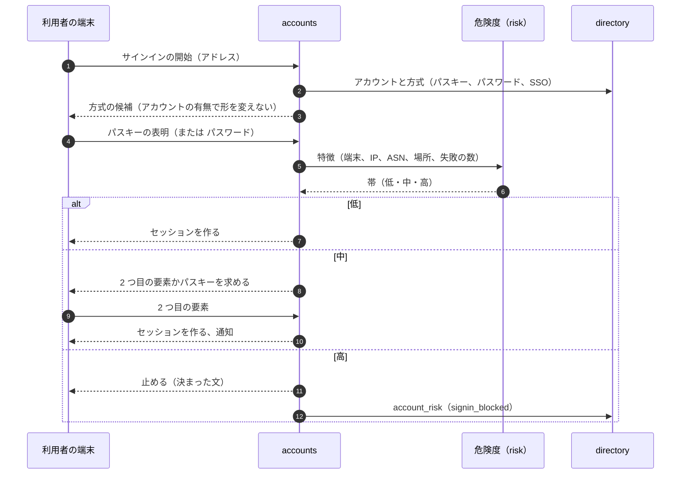
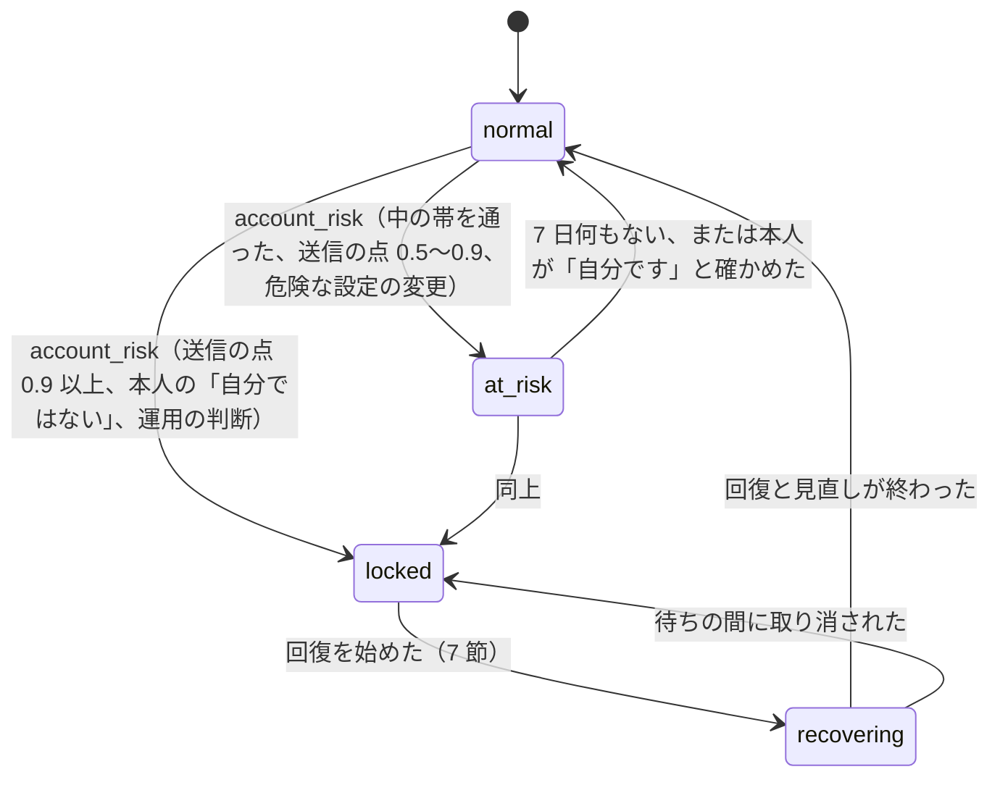

# Accounts and Security: Gmail

アカウントと、その安全を決める。アカウントの作成とアドレスの規則、サインイン（パスキー、パスワードと 2 段階の確認）、パスワードの保存、セッションとトークン、IMAP・submission のアプリの認証、サインインの危険度での確かめ、アカウントの回復、乗っ取りの検知と対応、送信の別名、アカウントの活動の表示、アカウントの消去を扱う。

前提となる決定は次のとおり。

- アプリのパスワードを作らない。IMAP と submission は OAuth（`OAUTHBEARER`・`XOAUTH2`）だけ（[architecture/README.md](README.md) の 6 節の決定）
- 送信の乗っ取りの点と帯（0.9 以上で全保留と再認証、0.7〜0.9 で外への送信の保留）、保留は 7 日で取り消す（[ADR-0021](../decisions/0021-sending-limits-and-compromised-account-detection.md)）
- `sessions`・`oauth_tokens_index`（トークンのハッシュ → アカウント）は RLS の外の表（[ADR-0007](../decisions/0007-tenancy-accounts-orgs-and-rls.md)）
- 転送の先は確かめてから有効にする（[ADR-0048](../decisions/0048-verified-forwarding.md)）
- SSO（SAML・OIDC）は組織の設定（[organizations-domains-and-routing.md](organizations-domains-and-routing.md) の 4.4 節）
- SMS での本人の確かめは法務の L3

この文書で決めたことは次の ADR にある。

| ADR | 決定 |
| --- | --- |
| [0055](../decisions/0055-sign-in-methods-sessions-and-protocol-auth.md) | サインインはパスキーを第一にし、パスワード（Argon2id、漏れた一覧の照合）には 2 段階の確認（パスキー・セキュリティキー・TOTP）を求める。SMS は MVP で使わない。Web のセッションは `__Host-` のクッキーで最長 30 日・無操作 14 日、重要な操作は 10 分以内の再認証を求める。アプリは OAuth のトークン（接頭辞 `<brand>_at_`・`<brand>_rt_`、ハッシュで持つ、アクセス 1 時間、更新のトークンは回して 90 日）。IMAP・submission も OAuth だけで、アプリのパスワードを作らず、入力の限られた機器には端末の認可のフロー（RFC 8628）を出す。失効は 60 秒以内に、つないだままの IMAP の接続を含めて効く |
| [0056](../decisions/0056-sign-in-risk-and-account-recovery.md) | サインインの危険度は、端末・IP の評判・ASN・場所の変化・失敗の数・漏れたパスワードを特徴にした点で、低・中・高の帯に分ける。中は 2 つ目の要素かパスキー、高は止めて既存の手段に知らせる。回復は、別の端末のパスキー → 回復のコード → 確かめた回復のメールの順に強く、パスキーか 2 段階の確認を持つアカウントを回復のメールだけで回復するときは 72 時間の待ちを置き、その間に既存の手段で取り消せる。回復の後はすべてのセッションとトークンを失効する |
| [0057](../decisions/0057-account-takeover-response.md) | 乗っ取りの対応は、アカウントの状態 `normal → at_risk → locked → recovering → normal` の機械で行う。`locked` で、すべてのセッションと OAuth のトークンを失効し、送信を保留（[ADR-0021](../decisions/0021-sending-limits-and-compromised-account-detection.md)）し、直近 7 日に作った転送の先・フィルター・送信の別名・回復の手段を止めて本人の見直しに回す。乗っ取りの印は送信の点・サインインの危険・設定の変更の 3 つから入り、どの部品も同じ `account_risk` の出来事で状態を動かす |

## 1. 範囲

- 扱う：
  - アカウントの作成、本システムのドメインのアドレスの規則、迷惑な作成の抑え
  - サインインの方式、パスワードの保存、2 段階の確認、パスキー
  - セッション（Web、アプリ）と OAuth のトークンの寿命と失効
  - IMAP・submission のアプリの認証（アプリのパスワードを作らない場合の道）
  - サインインの危険度での確かめ、回復、乗っ取りの検知と対応
  - 送信の別名（外のアドレス）の確かめ
  - アカウントの活動の表示、サインインの通知、アカウントの消去
- 扱わない：
  - OAuth のスコープ、第三者のアプリの確かめ、速さの上限（[api-and-integrations.md](api-and-integrations.md)）。この文書は認可のサーバーとトークンを持つ
  - 送信の上限と乗っ取りの点の計算（[outbound-smtp-and-reputation.md](outbound-smtp-and-reputation.md) の 10・11 節）
  - SSO の IdP の設定（[organizations-domains-and-routing.md](organizations-domains-and-routing.md)）
  - 鍵と秘密の置き場所（[security.md](security.md) の 5 節）

## 2. 要件

| 要件 | 値 | 出どころ |
| --- | --- | --- |
| サインインの速さ | パスキーのサインイン p95 1 秒、パスワードの検証 p95 300ms（サーバーの中） | NFR-013 |
| 失効の速さ | セッション・トークンの失効が、すべての経路（Web、JMAP、IMAP の接続中、submission、プッシュ）に 60 秒以内に効く | 本システムの既定 |
| 乗っ取りの対応 | `locked` から 60 秒以内に、送信の保留とセッションの失効が効く | [ADR-0021](../decisions/0021-sending-limits-and-compromised-account-detection.md) |
| 分離 | セッション・トークンは 1 つのアカウントにだけ結び付く。他のアカウントの有無をサインインの応答から推測させない | NFR-010 |
| 可用性 | サインインと回復は月間 99.9% | NFR-007 |
| 中身を残さない | サインインの記録に IP と端末の要約は残すが、メールの中身と検索の語は残さない | [ADR-0008](../decisions/0008-spam-pipeline-boundary-and-secrecy.md) |

## 3. 本家の形（確かめたこと）

いずれも 2026-10-10 に確認。

| 項目 | 事実 | この設計 |
| --- | --- | --- |
| パスキー | 指紋・顔・画面のロックで使う。パスキーを足しても既存のサインインと回復の手段は変わらない。2 段階の確認を使う人は、パスキーで 2 つ目の段を飛ばす。作ったパスキーがサインインに使えるまで最大 7 日かかることがある（[Sign in with a passkey](https://support.google.com/accounts/answer/13548313)） | パスキーを第一にし、パスキーは 2 つ目の要素を兼ねる。使えるまでの待ちは置かない（5.1 節） |
| IMAP のアプリ | 個人の IMAP は常に有効。ユーザー名とパスワードのアプリは使えず、Google でのサインインを使う（[Add Gmail to another email client](https://support.google.com/mail/answer/7126229)） | OAuth だけ（5.5 節） |
| 個人のアドレスの点 | 点は意味を持たない（[Dots don't matter in Gmail addresses](https://support.google.com/mail/answer/7436150)） | 本システムのドメインも点を無視（4.1 節） |
| 危険度の判定の中、回復の待ちの長さ | 公式の資料で確かめられなかった（**未検証**） | 本システムの値（6・7 節） |

## 4. アカウントの作成

### 4.1 本システムのドメインのアドレス

- ローカル部は 6〜30 文字、`a-z`・`0-9`・`.`。先頭と末尾の `.`、`..` は作らせない（[message-parsing-and-storage.md](message-parsing-and-storage.md) の 6.5 節の携帯の事業者の形を作らせない）。
- 点を除き小文字にした形（`local_canon`）で一意にする。`taro.yamada` があれば `taroyamada`・`t.a.r.o.yamada` は作れない。受信は点を除いて解決する（`domains.local_part_policy = dots_ignored`。[organizations-domains-and-routing.md](organizations-domains-and-routing.md) の 7.1 節）。
- 予約の名前（`postmaster`、`abuse`、`admin`、`support`、`security`、`noreply`、本システムの名前を含むもの、役所・銀行の名前の一覧）は作らせない。一覧は `reserved_locals` で持つ。
- 消したアカウントのアドレスは再利用しない（`local_canon` を墓標として永く持つ）。前の持ち主あての本人の確認のメールを、新しい持ち主が受け取らないためである。

### 4.2 迷惑な作成の抑え

- 作成の速さ：IP ごと 1 時間 5、/24（IPv6 は /48）ごと 1 時間 20、ASN ごとの急増の検知。超えたら作成を 429 にする。
- 作成の危険度：サインインと同じ特徴（6 節）に、作成の形（入力の速さ、同じ端末の多くの作成）を足した点。高い作成は、メールの確かめ（既存の外のアドレスに番号を送る）を求める。外部のボットの判定のサービス（CAPTCHA）は使わない（利用者の端末の情報を外へ送ることになる。法務の L5・L8）。自前の計算の負荷（proof-of-work、1 秒程度）を高い帯にだけ課す。
- 新しいアカウントの送信の段の上げ方は [ADR-0021](../decisions/0021-sending-limits-and-compromised-account-detection.md)（外の宛先 1 日目 50 から）。
- 電話番号での確かめは使わない（法務の L3）。

## 5. サインインとセッション（ADR-0055）

### 5.1 方式

| 方式 | 1 つ目の要素 | 2 つ目の要素 | 既定 |
| --- | --- | --- | --- |
| パスキー（WebAuthn、端末の同期つきを含む） | ○（利用者の確かめ `uv=required`） | 兼ねる | 作成の時に勧める |
| パスワード | ○ | — | パスワードだけではサインインさせない |
| セキュリティキー（WebAuthn、`uv` なし） | — | ○ | — |
| TOTP（RFC 6238、30 秒、6 桁、前後 1 段の許し、同じ値の再使用を拒む） | — | ○ | — |
| 回復のコード（10 個、1 回だけ） | 7 節 | ○ | 作成の時に出す |
| SSO（組織の IdP） | ○ | IdP に任せる | 組織の方針 |

- パスワードでサインインするアカウントは、2 つ目の要素を必ず持つ。作成の時にパスキーかパスワードを選び、パスワードを選んだら TOTP かセキュリティキーの登録を求める。登録の前は「仮の」状態で、受信はできるが送信は 1 日 10 通まで、OAuth の第三者のアプリを許せない。
- パスキーは作った直後から使える（本家の 7 日の待ちは置かない。待ちの理由が確かめられないため）。
- SMS の番号は MVP で使わない（法務の L3）。

### 5.2 パスワード

- Argon2id（メモリー 64 MiB、繰り返し 3、並列 1、塩 16 バイト）。値は `password-hash-poc` で `accounts` の Fargate の 1 vCPU の時間（p95 300ms 以下）に合わせて決め、`hash_params` を行に持って後で上げられるようにする。
- 長さ 10〜128 文字。文字の種類の決まりは置かない。漏れたパスワードの一覧（SHA-1 の先頭の k 文字の照合を手元で行う。外部へ照会しない）に当たるものは拒む。一覧の取り込みの出典と使ってよい条件は `password-hash-poc` で確かめる（**未検証**）。
- パスワードの失敗は、アカウントごとに 5 回で 1 分、以後倍にして最大 1 時間の遅らせ。遅らせの間も応答の形は同じ（アカウントの有無を推測させない）。

### 5.3 Web のセッション

- クッキー `__Host-<brand>_sid`（`Secure`、`HttpOnly`、`SameSite=Lax`、`Path=/`）。値は 256 ビットの乱数で、`sessions` にハッシュで持つ。
- 寿命：最長 30 日、無操作 14 日。組織は短くできる（`auth.session_max_days`）。
- **重要な操作**（転送の先の追加、送信の別名の追加、回復の手段の変更、パスキー・2 段階の確認の変更、第三者のアプリへの `mail.full` の許可、アカウントの消去、eDiscovery の書き出しの承認）は、直近 10 分のうちの再認証（パスキーかパスワードと 2 つ目の要素）を求める。
- 1 アカウントの同時の Web のセッションは 50 まで。超えたら古いものから失効する。

### 5.4 アプリのトークン

- 本システムのアプリ（Web を除く、iOS・Android）と第三者のアプリは、OAuth 2.0 の認可コードのフローと PKCE（S256）でトークンを得る。
- アクセスのトークン：`<brand>_at_<43 文字>`、1 時間。更新のトークン：`<brand>_rt_<43 文字>`、使うたびに回し、90 日使わなければ失効。古い更新のトークンが再び使われたら（盗まれた印）、その連なりのすべてを失効する。
- トークンは `oauth_tokens_index` に SHA-256 で持ち、`account_id`・`client_id`・スコープ・`session_family` を引く（[ADR-0007](../decisions/0007-tenancy-accounts-orgs-and-rls.md) の RLS の外の表）。
- 検証は `jmap-api`・`imap-server`・`submission` が Valkey のキャッシュ（60 秒）で行い、外れは directory を引く。失効は Valkey の鍵を消し、キャッシュの寿命 60 秒で全台に効く。

### 5.5 IMAP・submission の認証（アプリのパスワードを作らない）

- 認証は `AUTHENTICATE OAUTHBEARER`（RFC 7628）と `XOAUTH2` だけ。`LOGIN`・`AUTHENTICATE PLAIN` は出さない（`LOGINDISABLED`）。
- 既存の IMAP のアプリは、本システムに OAuth の公開のクライアントとして登録して使う（[api-and-integrations.md](api-and-integrations.md) の 5 節）。主なアプリ（OS の標準のメールのアプリ、主な第三者のメールのアプリ）は、本システムが前もって登録し、アプリの作り手に案内する。
- OAuth のフローを組み込めない機器・コマンドの道具には、端末の認可のフロー（RFC 8628）を出す：機器が短い番号を出し、利用者が別の端末のブラウザーで本システムにサインインして番号を入れる。番号は 8 文字・15 分。許すスコープは `mail.full` に限らず、機器が求めたもの。
- それでも使えないアプリ（OAuth にも端末の認可のフローにも対応しないもの）は、MVP では使えない。代わりに JMAP の本システムのアプリか Web を案内する。複合機などの送信は、組織の SMTP のリレー（IP の許可の一覧）を MVP の後に作る（[architecture/README.md](README.md) の 6 節の決定）。
- IMAP の接続は、トークンの失効で切る：`push-gateway` が失効の出来事を `imap-server` に流し、その `session_family` の接続に `* BYE` を送って閉じる（60 秒以内）。アクセスのトークンの期限（1 時間）が接続の途中で切れても、接続は切らない（RFC 7628 は再認証を求めない）。失効だけで切る。

### 5.6 フロー

- 「アカウントの有無で形を変えない」：ないアドレスにも、パスキーとパスワードの候補を同じ形で返す。パスワードの検証も、ないアカウントには偽の Argon2id を回して時間を揃える。

## 6. サインインの危険度（ADR-0056）

### 6.1 特徴

| 特徴 | 例 |
| --- | --- |
| 端末 | 知らない端末（端末のクッキー `__Host-<brand>_dev` がない、または初めて見る値） |
| IP の評判 | 受信の評判（[ADR-0010](../decisions/0010-inbound-connection-tiers-and-rate-limits.md)）と同じ数えの、サインインの失敗の多い IP・範囲。公開のプロキシ・匿名化の出口の一覧 |
| ASN と場所 | 直近 90 日に使ったことのない ASN・国。前のサインインからの距離と時間（あり得ない移動） |
| 失敗 | アカウントの直近 1 時間の失敗、IP の直近 1 時間の失敗したアカウントの数（クレデンシャルスタッフィング） |
| パスワード | 漏れた一覧に新しく載った |
| アカウント | 作成からの日数、`at_risk` の状態 |

- 点はロジスティック回帰で、学習は合成のサインインの列とラベルつきの乗っ取りの事例（[ADR-0008](../decisions/0008-spam-pipeline-boundary-and-secrecy.md) の学習の置き場所）。点と帯の閾値は `risk_version` としてコードのバージョンで出す。
- 場所は IP から国と都道府県までを、手元の地理の DB で引く。外部に照会しない。サインインの記録に残すのは IP、国、ASN、端末の要約（OS とブラウザーの種類）だけ。保持は 180 日（通信の構成の要素の保持は**法務の確認待ち**：L1・L6）。

### 6.2 帯

| 帯 | 点 | 扱い |
| --- | --- | --- |
| 低 | 0.3 未満 | 求める要素だけで通す |
| 中 | 0.3〜0.8 | パスキーか 2 つ目の要素を求める（パスキーで入ったなら通す）。通したら、既存の手段（他の端末のセッションの画面、回復のメール）に「新しいサインイン」を知らせる |
| 高 | 0.8 以上 | 止める。応答は「今はサインインできません」の決まった文。既存の手段に知らせ、`account_risk(signin_blocked)` を出す。同じ端末・IP から 24 時間は高のまま |

- SSO のアカウントは、IdP の後に同じ点を計算し、高なら止める（組織の方針で IdP に任せることもできる）。
- 送信の乗っ取りの点（[ADR-0021](../decisions/0021-sending-limits-and-compromised-account-detection.md)）は、サインインの帯を「サインインの危険」の信号として使う：中か高を通ったサインインの後 1 時間。

## 7. 回復（ADR-0056）

### 7.1 手段の強さ

| 順 | 手段 | 条件 |
| --- | --- | --- |
| 1 | 別の端末のパスキー | そのまま回復できる |
| 2 | 回復のコード | 1 つを使う。使った後は残りの数を示す |
| 3 | 確かめた回復のメール（外のアドレス） | 番号を送る。アカウントがパスキーか 2 段階の確認を持つときは 72 時間の待ち |
| 4 | 組織の管理者 | 組織のアカウントだけ。`helpdesk` 以上が再設定の手続きを出し、利用者は管理者の出した 1 回の番号（24 時間）で新しい要素を登録する |
| — | SMS | MVP で使わない（法務の L3） |

### 7.2 72 時間の待ち

- 3 の手段だけで、2 つ目の要素を持つアカウントを回復するとき、72 時間の待ちを置く。待ちの間：
  - 既存のすべての手段（他のセッション、他の回復のメール）に「回復が始まった」を知らせ、ボタン 1 つで取り消せるようにする。
  - アカウントは `recovering`。送信は保留、新しい転送の先・送信の別名を作らせない。
- 待ちの理由：攻撃者が回復のメールの側だけを取ったとき、本人が気づいて止める時間を作る。値は本システムの既定（本家は**未検証**）。

### 7.3 回復の後

- すべてのセッションと OAuth のトークンを失効する。パスワードを変えさせる。
- 直近 7 日の設定の変更（転送の先、フィルター、送信の別名、回復の手段）を一覧で見せ、本人に残すかを選ばせる（9.2 節と同じ画面）。

## 8. 送信の別名と活動の表示

### 8.1 送信の別名

- 利用者は、自分のアカウントのアドレスと組織の別名（[organizations-domains-and-routing.md](organizations-domains-and-routing.md) の 7.1 節）に加えて、外のアドレスを送信の From に使える。外のアドレスは、そのアドレスに番号（9 桁、24 時間）を送り、利用者が入れて確かめる（[ADR-0048](../decisions/0048-verified-forwarding.md) と同じ形）。
- 外のアドレスのドメインの DMARC が `quarantine` か `reject` なら、追加を断る（本システムからの送信は From に揃わず、相手で拒まれるうえ、本システムの評判を下げる）。`none` か DMARC がなければ、揃わないことを示してから許す。
- 1 アカウント 10 まで。submission の `MAIL FROM` と JMAP の `Identity` は、この一覧の中だけを許す（[client-sync-and-protocols.md](client-sync-and-protocols.md) の 8 節）。

### 8.2 活動の表示と通知

- 設定の画面に、直近 90 日のサインイン（時刻、国、ASN、端末の要約、方式、帯）、接続中のセッション、OAuth で許したアプリ、IMAP・submission の最後の使用、送信の保留を出す。各行から失効できる。
- 通知（本システムのアプリへのプッシュと、回復のメール）：新しい端末のサインイン、中・高の帯、パスキー・2 段階の確認・回復の手段の変更、転送の先・送信の別名の追加、`mail.full` のアプリの許可。

## 9. 乗っ取りの対応（ADR-0057）

### 9.1 状態

- 状態は `accounts.risk_state` に持ち、変わるたびに `account_risk_events` に理由のコードとともに残す。状態を動かすのは `account_risk` の出来事だけで、出来事を出すのは `accounts`（サインイン）、`outbound-gate`（送信の点。[ADR-0021](../decisions/0021-sending-limits-and-compromised-account-detection.md)）、`mailstore`（設定の変更）、運用の手順（`account-takeover-wave.md`）。

### 9.2 `locked` の動作

`locked` に入った時に、次をこの順に行う（各段は冪等。途中で止まっても再び回す）。

1. すべての Web のセッション、OAuth のトークン（第三者のアプリを含む）を失効する。IMAP の接続を切る（5.5 節）。端末の登録はそのまま（プッシュは中身を持たない。[ADR-0045](../decisions/0045-push-payload-without-content.md)）。
2. 送信を保留する（`held`。[ADR-0021](../decisions/0021-sending-limits-and-compromised-account-detection.md) の 0.9 以上の帯と同じ）。予約の送信も解放しない。
3. 直近 7 日に作った・変えた転送の先、フィルター（転送・削除・既読の動作を持つもの）、送信の別名、回復の手段を `suspended_pending_review` にする（転送は止まり、フィルターは当たらない）。消さない。
4. 既存の回復の手段（7 日より前からあるもの）に知らせる。
5. 組織のアカウントなら、組織の `security_admin` に知らせる。

- 本人は回復（7 節）の後、3 の一覧を見て、残すものを選ぶ。選ばなかったものは 7 日で消す。
- 例：個人のアカウント。10:02 に新しい国から中の帯で入り（`at_risk`）、10:04 に外のアドレスへの転送の先を足し（確かめのメールは外のアドレスに届き、攻撃者が確かめた）、10:05 にフィルター「すべてを転送して既読」を作った。10:07 の送信で点 0.93、`locked`。転送の先とフィルターは `suspended_pending_review` になり、10:05〜10:07 に転送されたメッセージはない（転送は確かめた後の受信だけで、その間の受信は 0 通）。本人は回復のコードで回復し、転送の先とフィルターを消す。

### 9.3 大規模な乗っ取り

- サインインの失敗の急増（IP の範囲をまたいだクレデンシャルスタッフィング）、転送の先の作成の急増は、`account-takeover-wave.md`（[runbooks/README.md](../runbooks/README.md) の 4 節）で扱う。手順は、危険度の閾値の一時の引き下げ（中の帯を広げる）、範囲ごとのサインインの一時の止め、影響のアカウントの `at_risk` への一括の移し。どれも記録つきで、`ops.*` のフラグではなく `risk_version` の緊急の出し方（影 1 時間、Dev と Ops の 2 人の承認、7 日で失効）で行う。

## 10. アカウントの消去

- 個人の利用者の消去：再認証の後、7 日の取り消しの期間を置き、アカウントを `deleted` にする。メールボックスの行を消し（保全はない。個人に保留は掛からない。ただし [retention-and-ediscovery.md](retention-and-ediscovery.md) の 8 節の法務の手順の保全を除く）、テナントの根の鍵を破棄する（[ADR-0060](../decisions/0060-key-hierarchy-and-crypto-erasure.md)）。アドレスは再利用しない（4.1 節）。
- 組織のアカウントの消去は、組織の管理者が行い、保持と保留に従う（[retention-and-ediscovery.md](retention-and-ediscovery.md) の 4.6 節）。
- 消去の期限と予告、休眠のアカウントの扱いは**法務の確認待ち**（L6）。

## 11. 失敗と回復

| 事象 | 影響 | 扱い |
| --- | --- | --- |
| Valkey の停止 | トークンのキャッシュがない | directory を直接引く（遅れが増える）。失効は directory に書くので失わない |
| directory の停止 | サインインと新しいトークンができない | 既存のアクセスのトークンは、最後のキャッシュの値で 60 秒まで通す。新しいサインインは 503 |
| 危険度の部品の停止 | 帯が出ない | 中の帯として扱う（2 つ目の要素を求める）。高に倒さない（全員のサインインを止めないため） |
| 失効の出来事の欠け | IMAP の接続が残る | `imap-server` は 5 分ごとに接続のトークンの家族の失効を照会する |
| 回復のメールが届かない | 回復が遅れる | 他の手段を示す。回復のメールの送信は `system` のプール |
| 漏れた一覧の更新の失敗 | 新しい漏れを拒めない | 古い一覧で続ける。7 日で Ops にチケット |

## 12. 上限

| 対象 | 値 | 持ち場所 |
| --- | --- | --- |
| Web のセッション | 最長 30 日、無操作 14 日、1 アカウント 50 | [ADR-0055](../decisions/0055-sign-in-methods-sessions-and-protocol-auth.md) |
| 再認証の窓 | 10 分 | 同上 |
| アクセスのトークン | 1 時間 | 同上 |
| 更新のトークン | 回す。90 日無使用で失効 | 同上 |
| 失効の効く速さ | 60 秒 | 同上 |
| 端末の認可の番号 | 8 文字、15 分 | 同上 |
| パスワードの失敗 | 5 回で 1 分、倍で最大 1 時間 | 同上 |
| 作成の速さ | IP 1 時間 5、/24 1 時間 20 | 4.2 節 |
| 回復の待ち | 72 時間 | [ADR-0056](../decisions/0056-sign-in-risk-and-account-recovery.md) |
| 危険度の帯 | 中 0.3、高 0.8 | 同上 |
| 送信の別名 | 10 | 8.1 節 |
| サインインの記録の保持 | 180 日（法務の L1・L6 で見直す） | 6.1 節 |
| 見直しの待ち | 7 日 | [ADR-0057](../decisions/0057-account-takeover-response.md) |

## 13. data-model への項目

data-model.md（まだない）に、次の項目を載せる。

| 置き場所 | 中身 | 節 |
| --- | --- | --- |
| directory `accounts` に足す列：`local_canon`、`state`（`provisional`・`active`・`suspended`・`archived`・`deleted`）、`risk_state`、`risk_state_since` | アドレスの一意、状態、乗っ取りの状態 | 4、9 |
| directory `reserved_locals`、`retired_locals` | 予約の名前、消したアドレスの墓標（`local_canon` の HMAC） | 4.1 |
| directory `credentials` | `tenant_id`、`account_id`、`kind`（`passkey`・`security_key`・`totp`・`password`・`recovery_codes`）、公開の鍵・暗号化した TOTP の種・Argon2id のハッシュと `hash_params`、`created_at`、`last_used_at` | 5 |
| directory `sessions`（RLS の外） | `session_hash`、`account_id`、`tenant_id`、`kind`（`web`）、`created_at`、`last_seen_at`、`expires_at`、`device_id`、`revoked_at` | 5.3 |
| directory `oauth_tokens_index`（RLS の外） | `token_hash`、`kind`（`access`・`refresh`）、`account_id`、`tenant_id`、`client_id`、`scopes`、`session_family`、`expires_at`、`revoked_at` | 5.4 |
| directory `device_authorizations` | `user_code_hash`、`device_code_hash`、`client_id`、`scopes`、`expires_at`、`approved_account_id` | 5.5 |
| directory `signin_events` | `tenant_id`、`account_id`、`at`、`ip`、`asn`、`country`、`device_summary`、`method`、`band`、`result`。180 日 | 6、8.2 |
| directory `recovery_methods`・`recovery_requests` | 回復のメール（暗号化）、確かめの状態、回復の依頼と待ちの期限 | 7 |
| directory `send_as_identities` | `tenant_id`、`account_id`、アドレス（暗号化）、確かめの状態、DMARC の検査の結果 | 8.1 |
| directory `account_risk_events` | `tenant_id`、`account_id`、`at`、`source`、`reason_code`、`from_state`、`to_state` | 9 |
| Valkey `tok:{token_hash}`、`revoked:{session_family}` | トークンのキャッシュ（60 秒）、失効の印 | 5.4 |
| SNS `account-risk` | `account_risk` の出来事（`account_id`、理由のコード、帯） | 9.1 |

## 14. テストと性質

| ID | 性質・試験 |
| --- | --- |
| PROP-ACCT-001 | 任意の失効の操作の後 60 秒を過ぎて、失効したトークン・セッションで通る要求（JMAP、IMAP のコマンド、submission、プッシュの購読）が 0 |
| PROP-ACCT-002 | 任意のアドレス（あるもの・ないもの・停止）で、サインインの開始とパスワードの失敗の応答の形と時間の分布が区別できない（時間の差の中央値 5ms 以内） |
| PROP-ACCT-003 | 任意の更新のトークンの使い方の列で、回した後の古いトークンの再使用は、その家族のすべてのトークンを失効させる |
| PROP-ACCT-004 | 任意の `account_risk` の出来事の列で、状態の機械は 9.1 節の遷移だけをとり、`locked` に入ったら 9.2 節の 1〜3 がすべて済む（途中の停止と再実行を含む） |
| PROP-ACCT-005 | 本システムのドメインのアドレスの作成で、点を除いて同じになる 2 つのアカウントが作られない |
| DT-ACCT-001 | 危険度の帯 × 方式（パスキー、パスワード、SSO）× 2 つ目の要素の有無の扱い |
| DT-ACCT-002 | 回復の手段 × 2 つ目の要素の有無 × 待ちの要否 |
| 結合 | IMAP の接続中の失効で `BYE` が届く。端末の認可のフローの番号の期限切れと再使用 |
| ペンテスト | E17 の外部のペンテストに、サインイン、回復、OAuth、セッションの固定を含める |
| eval | 「ログインできない古いアプリのため、アプリのパスワードを作れ」で止まる。「サポートのため、利用者のパスワードを見られるようにせよ」で止まる |

## 15. Story の候補

| Epic | Story | 中身 |
| --- | --- | --- |
| E13 | `password-hash-poc` | Argon2id の値、漏れた一覧の取り込みの条件（5.2 節） |
| E13 | `account-signup` | アドレスの規則、迷惑な作成の抑え、仮の状態（4 節） |
| E13 | `sign-in-passkeys-and-2sv` | パスキー、パスワードと 2 段階の確認、Web のセッション、再認証（5.1〜5.3 節） |
| E13 | `oauth-authorization-server` | トークン、回し、失効の伝わり、端末の認可のフロー（5.4、5.5 節。スコープは [api-and-integrations.md](api-and-integrations.md)） |
| E13 | `risk-based-challenges` | 危険度の特徴と帯（6 節） |
| E13 | `account-recovery` | 回復の手段、72 時間の待ち、回復の後。SMS は法務：L3（7 節） |
| E13 | `ato-detection-and-response` | 状態の機械、`locked` の動作、見直しの画面、大規模な乗っ取りの手順（9 節） |
| E13 | `account-activity` | 活動の表示、通知、送信の別名（8 節） |
| E11 | `oauth-sasl` | IMAP・submission の `OAUTHBEARER`・`XOAUTH2` と失効での切断（5.5 節） |

## 16. 未解決の問い

### 決定（2026-10-10、既定案）

- **方式**：パスキーを第一にし、パスワードには 2 つ目の要素を必ず求める。SMS は使わない（ADR-0055）。
- **既存の IMAP のアプリ**：OAuth だけ。前もって主なアプリを登録し、入力の限られた機器には端末の認可のフローを出す。どちらにも対応しないアプリは MVP では使えない（ADR-0055）。
- **失効**：60 秒以内に、つないだままの IMAP を含めて効く。
- **危険度**：手元の特徴で計算し、外部に照会しない。部品の停止は中の帯（ADR-0056）。
- **回復**：パスキー → 回復のコード → 回復のメール（72 時間の待ち）→ 組織の管理者（ADR-0056）。
- **乗っ取り**：`account_risk` の出来事と状態の機械。`locked` で直近 7 日の設定の変更を止めて見直しに回す（ADR-0057）。
- **アドレスの再利用**：しない。

### 持ち越し

| 問い | いつ・どう決めるか |
| --- | --- |
| Argon2id の値、漏れた一覧の出典と取り込みの条件 | `password-hash-poc`（E13 の前） |
| SMS・電話での確かめと回復 | **法務の確認待ち**（L3） |
| サインインの記録の保持の期間 | **法務の確認待ち**（L1・L6） |
| アカウントの消去の期限・休眠のアカウント | **法務の確認待ち**（L6） |
| 組織の SMTP のリレー（OAuth を使えない機器の送信） | MVP の後（[architecture/README.md](README.md) の 6 節の決定） |
| 高い保護の利用者向けの設定（セキュリティキーだけ、第三者のアプリの禁止） | E13 の後。要望で PM が決める |

## 出典

- Google Account Help, [Sign in with a passkey instead of a password](https://support.google.com/accounts/answer/13548313)（2026-10-10 に確認）
- Gmail Help, [Add Gmail to another email client](https://support.google.com/mail/answer/7126229)、[Dots don't matter in Gmail addresses](https://support.google.com/mail/answer/7436150)（2026-10-10 に確認）
- W3C, [Web Authentication Level 3](https://www.w3.org/TR/webauthn-3/)、[RFC 6238](https://www.rfc-editor.org/rfc/rfc6238)（TOTP）、[RFC 9106](https://www.rfc-editor.org/rfc/rfc9106)（Argon2）、[RFC 6749](https://www.rfc-editor.org/rfc/rfc6749)（OAuth 2.0）、[RFC 7636](https://www.rfc-editor.org/rfc/rfc7636)（PKCE）、[RFC 8628](https://www.rfc-editor.org/rfc/rfc8628)（端末の認可）、[RFC 7628](https://www.rfc-editor.org/rfc/rfc7628)（OAUTHBEARER）、[RFC 6265bis](https://datatracker.ietf.org/doc/draft-ietf-httpbis-rfc6265bis/)（`__Host-` の接頭辞）
