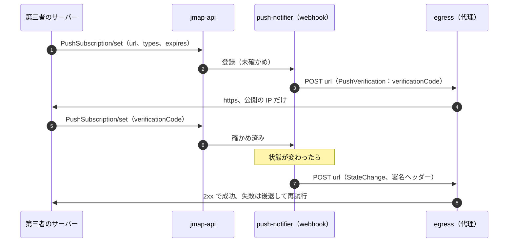

# API and Integrations: Gmail

第三者に開く API を決める。JMAP の公開、IMAP・submission の公開の条件、OAuth のスコープと同意の画面、アプリの登録と確かめ、組織のアプリの方針、速さと量の上限、第三者向けのプッシュ（EventSource と webhook）、組織の管理の API、公開の REST API（MVP の後）を扱う。

前提となる決定は次のとおり。

- Web・アプリ・第三者の API は JMAP（RFC 8620・8621）に本システムの拡張を足して使う。独自の同期の API は作らない（[ADR-0006](../decisions/0006-sync-protocol-jmap-imap-and-modseq.md)）。拡張は `urn:<brand>:params:jmap:mail` の下（[ADR-0041](../decisions/0041-jmap-extensions-and-mailbox-mapping.md)）
- JMAP の要求の上限（`maxSizeRequest` 10 MB、`maxCallsInRequest` 32 など）と IMAP の同時の接続 15 は [client-sync-and-protocols.md](client-sync-and-protocols.md) の 11 節
- 認可のサーバー、トークンの形と寿命と失効、端末の認可のフローは [ADR-0055](../decisions/0055-sign-in-methods-sessions-and-protocol-auth.md)
- 送信は送信の上限と関門を通る（[ADR-0021](../decisions/0021-sending-limits-and-compromised-account-detection.md)）。プッシュは中身を持たない（[ADR-0045](../decisions/0045-push-payload-without-content.md)）

この文書で決めたことは次の ADR にある。

| ADR | 決定 |
| --- | --- |
| [0058](../decisions/0058-oauth-scopes-and-app-verification.md) | OAuth のスコープを、読み・変更・送信・設定・全部の 9 つに分け、`basic`・`sensitive`・`restricted` の 3 つの級に置く。JMAP のメソッドと IMAP・submission はスコープの表で判定する。`restricted` を求める第三者のアプリは、持ち主と所有のドメインと方針の確かめに加えて、独立した評価者の安全の評価を受け、年 1 回やり直す。確かめていないアプリは警告の画面を出し、許す利用者を 100 人までにする。組織はアプリを許可の一覧で絞り、組織の中だけのアプリは確かめなしで使える |
| [0059](../decisions/0059-api-rate-limits-and-third-party-push.md) | 速さの上限は、JMAP のメソッドの重さ（単位）を `(account, client)`・`account`・`client` の 3 つの鍵の GCRA で数え、超えたら 429 と `Retry-After` を返す。IMAP は 1 時間 2.5 GB・1 日 20 GB の読み出しと 1 時間 1 GB の書き込みを数える。第三者のサーバー向けのプッシュは JMAP の `PushSubscription`（確かめの番号、https、公開の IP だけ、中身なし、最長 7 日）で出し、送れないときは 24 時間まで後退して止める |

## 1. 範囲

- 扱う：
  - JMAP の公開（本システムのアプリと第三者のアプリで同じ API）、出す能力、互換の約束
  - IMAP・submission を第三者のアプリに開く条件
  - OAuth のスコープ、同意の画面、アプリの登録と確かめの級、組織のアプリの方針
  - 速さと量の上限（JMAP、IMAP、送信、プッシュ）
  - 第三者向けのプッシュ（EventSource、`PushSubscription`）
  - 組織の管理の API（`admin.*` のスコープ）
  - 公開の REST API（MVP の後）の枠
- 扱わない：
  - JMAP のメソッドの意味、change log、IMAP の箱（[client-sync-and-protocols.md](client-sync-and-protocols.md)）
  - トークンの発行と失効、サインイン（[accounts-and-security.md](accounts-and-security.md)）
  - モバイルのプッシュ（[mobile-and-push.md](mobile-and-push.md)）

## 2. 要件

| 要件 | 値 | 出どころ |
| --- | --- | --- |
| 可用性 | JMAP・IMAP 月間 99.9% | NFR-007 |
| 最小の権限 | アプリは求めたスコープの外の操作ができない。スコープの判定は 1 か所 | NFR-010 |
| 分離 | トークンの持ち主のアカウントの外のデータを返さない | NFR-010 |
| 送信の評判 | API からの送信も送信の上限と関門を通る | AGENTS.md「送信の評判」 |
| 上限の応答 | 上限を超えた要求に 429 と `Retry-After` を返し、利用者のアプリが自分で待てる | 本システムの既定 |
| 互換 | 出した JMAP の能力と本システムの拡張を、告知なしに壊さない（12 か月の予告） | [runbooks/README.md](../runbooks/README.md) の 3 節（アプリの 12 か月） |
| プッシュに中身なし | webhook と EventSource の本文に件名・差出人・本文を入れない | [ADR-0045](../decisions/0045-push-payload-without-content.md) |

## 3. 本家の形（確かめたこと）

いずれも 2026-10-10 に確認。

| 項目 | 事実 | この設計 |
| --- | --- | --- |
| 本家の API の上限 | プロジェクトあたり 1 分 120 万単位、利用者あたり（プロジェクトごと）1 分 6,000 単位。`messages.send` は 100 単位、`messages.get` は 20 単位（[Usage limits](https://developers.google.com/workspace/gmail/api/reference/quota)） | 単位で数える形を寄せる。値は本システムの値（7 節） |
| 制限のスコープの確かめ | 制限のスコープ（Gmail を含む）を求めるアプリは確かめを受け、第三者のサーバーで利用者のデータを扱うなら、認定の評価者による安全の評価（CASA の枠組み）を受け、12 か月ごとにやり直す。確かめていないアプリは許す利用者の数に上限がある（数は資料にない）（[Restricted scope verification](https://developers.google.com/identity/protocols/oauth2/production-readiness/restricted-scope-verification)） | 同じ形の 3 つの級。評価者の選び方は持ち越し。確かめていないアプリの上限は 100 人（本システムの値） |
| IMAP の量 | 1 日に IMAP の読み出し 2,500 MB、書き込み 500 MB（Workspace のすべてのエディション）（[Gmail bandwidth limits](https://knowledge.workspace.google.com/admin/gmail/gmail-bandwidth-limits)） | 1 時間 2.5 GB・1 日 20 GB の読み出し、1 時間 1 GB の書き込み（7.2 節。本家より緩い） |
| 本家の API の形 | 独自の REST の API と独自の IMAP の拡張 | JMAP を第三者に開く（[architecture/README.md](README.md) の 1.4 節） |

## 4. 公開する面

| 面 | 入口 | 認証 | 第三者に開くか |
| --- | --- | --- | --- |
| JMAP | `https://jmap.<brand>.<domain>/.well-known/jmap`、`/api`、`/upload`、`/download`、`/eventsource` | OAuth のアクセスのトークン（`Authorization: Bearer`） | 開く |
| IMAP | `imap.<brand>.<domain>:993` | `OAUTHBEARER`・`XOAUTH2` | 開く（`mail.full` のスコープ） |
| submission | `smtp.<brand>.<domain>:465・587` | 同上 | 開く（`mail.send` か `mail.full`） |
| 組織の管理の API | `https://admin.<brand>.<domain>/api/v1/...`（REST、JSON） | OAuth（`admin.*`） | 組織の中のアプリと、確かめた第三者のアプリ |
| 公開の REST API | — | — | MVP の後 |

- JMAP の `Session` の `capabilities` に、`urn:ietf:params:jmap:core`・`:mail`・`:submission`・`:vacationresponse` と `urn:<brand>:params:jmap:mail` を出す。`accounts` は 1 つ（トークンの持ち主）。委任（MVP の後）で複数になる。
- **互換の約束**：能力と拡張の型は、足すことはあっても、既存の性質の意味を変えない。変える時は新しい能力の名前（`urn:<brand>:params:jmap:mail:2`）で出し、古いものを 12 か月の予告の後に外す。予告は `Session` の `<brand>:deprecations` と、登録したアプリの連絡先へのメールで出す。

## 5. アプリの登録と確かめ（ADR-0058）

### 5.1 クライアントの種類

| 種類 | 例 | 秘密 | リダイレクト |
| --- | --- | --- | --- |
| `first_party` | 本システムの Web・iOS・Android | なし（PKCE） | 決まった値 |
| `known_mail_client` | 主な IMAP・JMAP のメールのアプリ。本システムが前もって登録 | なし（PKCE） | アプリの作り手の届けた値、ループバック（RFC 8252） |
| `third_party` | 開発者が登録したアプリ | 機密のクライアントは秘密（ハッシュで持つ）か `private_key_jwt` | 登録した https の値の完全一致 |
| `org_internal` | 組織の管理者が登録した組織の中だけのアプリ | 同上 | 同上 |
| `device` | 端末の認可のフローのクライアント（[ADR-0055](../decisions/0055-sign-in-methods-sessions-and-protocol-auth.md)） | なし | なし |

### 5.2 確かめの級

| 級 | 条件 | 許すスコープ | 許す利用者 |
| --- | --- | --- | --- |
| `unverified` | 登録しただけ | `basic` と `sensitive`、`restricted` | 100 人まで（数は開発者のアカウントごと）。同意の画面に警告 |
| `verified` | 持ち主（法人・個人）の確かめ、ホームページと方針のページの所有のドメインの確かめ（[ADR-0050](../decisions/0050-custom-domain-verification-and-dns-checks.md) と同じ TXT）、方針の文の審査、同意の流れの説明 | `basic`・`sensitive` | 上限なし |
| `assessed` | `verified` に加え、独立した評価者の安全の評価（データの保存と送信、消去の求めへの対応、アクセスの制御）と、年 1 回のやり直し | `restricted` を含むすべて | 上限なし |

- `org_internal` のアプリは、その組織のアカウントだけが許せ、確かめを要らない（組織の責任）。
- `known_mail_client` は本システムが `assessed` に当たると扱う（端末の中だけでデータを扱い、第三者のサーバーを通らないアプリだけを入れる）。
- 確かめと評価の審査は本システムの「アプリの審査」の担当（人）が行う。評価者の選び方・費用の負担・評価の基準の詳しさは持ち越し（16 節）。

### 5.3 同意の画面

- アプリの名前、持ち主、確かめの級、求めるスコープの説明（級ごとの色と文）を出す。`restricted` は「メールの本文を読める」のように、何ができるかを具体の文で示す。
- スコープは 1 つずつ外せる（部分の同意）。外したスコープの要る操作は、アプリに `forbidden` を返す。
- `mail.full` と `mail.settings.sharing` の許可は、重要な操作として 10 分以内の再認証を求める（[accounts-and-security.md](accounts-and-security.md) の 5.3 節）。
- 許したアプリは活動の画面（同 8.2 節）に出し、1 つずつ取り消せる。

### 5.4 組織のアプリの方針

| `apps.policy` | 扱い |
| --- | --- |
| `all` | すべてのアプリを利用者が許せる |
| `verified_only`（既定） | `verified`・`assessed`・`known_mail_client`・`org_internal` だけ |
| `allowlist` | 管理者の許可の一覧と `org_internal` だけ |

- 管理者は、アプリごとに組織全体で取り消せる（その組織の利用者の全トークンを失効）。スコープの級ごとの禁止（`restricted` を禁止）もできる。
- IMAP・submission を組織で止める（`imap.enabled = false`）と、`mail.full` の IMAP・submission の認証を拒む（JMAP は続く）。

## 6. スコープ（ADR-0058）

| スコープ | 級 | できること |
| --- | --- | --- |
| `mail.metadata` | `sensitive` | 箱・スレッド・Email の見出し（差出人、宛先、件名、日付、大きさ、キーワード）を読む。本文・添付・`headers` の全体・検索の語の検索は不可 |
| `mail.readonly` | `restricted` | すべてを読む（本文、添付、検索） |
| `mail.modify` | `restricted` | 読む、ラベル・キーワードの変更、ゴミ箱へ移す。完全な削除は不可 |
| `mail.compose` | `sensitive` | 下書きの作成・変更、送信（`EmailSubmission/set`）。既存のメールは読めない（自分の作った下書きだけ） |
| `mail.send` | `sensitive` | 送信だけ（submission と `EmailSubmission/set` の下書きなしの形） |
| `mail.labels` | `basic` | ラベル（`Mailbox`）の作成・名前の変更・削除 |
| `mail.settings.basic` | `sensitive` | フィルター（転送の動作を除く）、不在の返信、表示の設定 |
| `mail.settings.sharing` | `restricted` | 転送の先、送信の別名、転送の動作のフィルター |
| `mail.full` | `restricted` | すべて（完全な削除、IMAP、submission を含む） |

- 判定は `jmap-api` の 1 つの表（メソッド × 引数 × スコープ）で行う（決定表 DT-API-001）。例：`Email/get` の `properties` に `bodyValues`・`textBody`・`htmlBody`・`attachments`・`headers` があれば `mail.readonly` 以上。`Email/query` の `filter` に本文・件名の語（`text`・`body`・`subject`、本システムの検索の文字列）があれば `mail.readonly` 以上（`mail.metadata` で件名の検索をさせると、件名を読むのと同じだが、本文の語の検索で本文を推測させないため、語の検索は一律に `readonly`）。`Email/set` の `destroy` は `mail.full`。
- IMAP と submission は `mail.full`（IMAP）と `mail.send` 以上（submission）。IMAP は読み書きの区別の細かい対応をしない（IMAP の操作を細かいスコープに対応させると、アプリの振る舞いが壊れる）。
- 組織の管理の API のスコープ：`admin.directory`（利用者・グループ・OU）、`admin.domains`、`admin.routing`、`admin.policies`、`admin.audit.read`。eDiscovery の API は MVP では出さない（画面だけ）。`admin.*` は、トークンの持ち主がその権限の役割を持つときだけ効く（[organizations-domains-and-routing.md](organizations-domains-and-routing.md) の 4.3 節の `authorize`）。

## 7. 速さと量の上限（ADR-0059）

### 7.1 JMAP

メソッドの呼び出しごとに重さ（単位）を数える。

| 呼び出し | 単位 |
| --- | --- |
| `*/get`（見出し） | 1 ＋ 対象 100 ごとに 1 |
| `Email/get`（本文を含む） | 5 ＋ 対象 10 ごとに 5 |
| `*/changes`・`*/queryChanges` | 2 |
| `Email/query` | 5（本文の語を含むと 10） |
| `*/set` | 2 ＋ 対象 50 ごとに 2 |
| `EmailSubmission/set`（送信） | 1 通 20 |
| ダウンロード・アップロード | 1 MiB ごとに 2 |

| 鍵 | 1 分の上限（バースト） | 超えたとき |
| --- | --- | --- |
| `(account, client)` | 3,000（500） | 429、`Retry-After` |
| `account`（すべてのクライアントの和） | 12,000（2,000） | 429 |
| `client`（第三者のアプリの全利用者の和） | 300 万（`verified` 以上）・3 万（`unverified`）。審査で上げる | 429 |

- 数えは GCRA で Valkey に持つ（[ADR-0010](../decisions/0010-inbound-connection-tiers-and-rate-limits.md) と同じ形）。Valkey が使えないときは `jmap-api` の台ごとに台数で割った値で数える。
- 本システムの Web とアプリ（`first_party`）は `(account, client)` の上限を 2 倍にする。`account` の上限は同じ（利用者の全体の量を抑える）。
- 送信は、これに加えて送信の上限（[ADR-0021](../decisions/0021-sending-limits-and-compromised-account-detection.md)）で数える。API からの送信でも、利用者の送信の数として同じ窓に入る。
- 429 の応答の本文は JMAP の問題の詳細（RFC 7807 の形）で、`type` は `urn:ietf:params:jmap:error:limit`、`limit` は鍵の名前（`accountClient`・`account`・`client`）。
- 例：同期のアプリが 1 分に `Email/changes` を 60 回（120 単位）と、変わった 300 通の `Email/get`（見出し、4 × 60 = 240 単位）を呼ぶ。合計 360 単位で上限の 3,000 に遠い。初回の全体の取り込みで、1 回 1,000 通の見出しを 1 秒に 2 回（1 分に 11 × 120 = 1,320 単位）は通る。本文も 1 秒に 2 回 100 通ずつ取ると、1 分に (5 + 50) × 120 = 6,600 単位で、バーストの後に 429 になり、アプリは `Retry-After` で 1 秒あたりの量を半分ほどに下げる。

### 7.2 IMAP と submission

| 対象 | 上限 | 超えたとき |
| --- | --- | --- |
| 同時の接続 | アカウントあたり 15（NFR-014） | `NO [LIMIT]` |
| 読み出し（`FETCH` の本文・添付のバイト） | 1 時間 2.5 GB、1 日 20 GB（アカウントの全接続の和） | `NO [LIMIT]`。接続は切らない |
| 書き込み（`APPEND`） | 1 時間 1 GB | `NO [LIMIT]` |
| コマンド | 1 接続 1 秒 50（バースト 200） | 遅らせる（応答を待たせる） |
| submission | 送信の上限（[ADR-0021](../decisions/0021-sending-limits-and-compromised-account-detection.md)） | `rejected_limit` を submission の応答で返す（[outbound-smtp-and-reputation.md](outbound-smtp-and-reputation.md) の 4.2・10.2 節） |

- 読み出しの 1 日 20 GB は、初回の同期（平均 2 GB、大きなアカウント 15 GB）を 1 日で終えられる値にする（本家の 1 日 2.5 GB より緩い。3 節）。1 時間 2.5 GB は、暴走したアプリ（`FETCH 1:*` の繰り返し）を 1 時間で止める値（[client-sync-and-protocols.md](client-sync-and-protocols.md) の 10 節）。

### 7.3 管理の API

- 組織あたり 1 分 600 要求、`admin.directory` の書き込みは 1 分 120。CSV の取り込みは別の作業として数えない。

## 8. 第三者向けのプッシュ（ADR-0059）

### 8.1 EventSource

- `GET /eventsource?types=Email,Mailbox,Thread&closeafter=no&ping=30`（RFC 8620 の 7.3 節）。中身は `StateChange`（型ごとの状態の文字列）だけ。
- 1 アカウント・1 クライアントの同時の接続 5、アカウント全体 20。`push-gateway` で受ける（[client-sync-and-protocols.md](client-sync-and-protocols.md) の 5.5 節）。

### 8.2 `PushSubscription`（webhook）

- 登録：RFC 8620 の 7.2 節。`url` は `https` で、名前を解決した IP が公開の範囲であること（私的・予約の範囲、本システムの範囲を拒む）。解決は送るたびに行い、DNS の再束縛を防ぐ。egress の代理（[infrastructure.md](infrastructure.md) の 3.4 節）だけから送る。
- 中身：`StateChange` だけ。`keys` があれば RFC 8291 の形で暗号化する。加えて、本システムの署名 `<Brand>-Signature: t=<時刻>, v1=<HMAC-SHA256>`（鍵は購読ごと、登録の応答で 1 回だけ返す）を付け、受け手が本物かを確かめられるようにする。
- 期限：`expires` は最長 7 日。過ぎたら消す。アプリは期限の前に延ばす。
- まとめ：1 つの購読へは 1 秒に 1 回まで、間の変更は最後の状態にまとめる。
- 失敗：応答の時間切れ 5 秒。2xx 以外と時間切れは、1 分から倍にして 1 時間の間隔まで後退し、24 時間続いたら購読を `disabled` にし、次の `PushSubscription/get` で知らせる。プッシュは合図で、落としても `*/changes` で追いつける（[quality.md](../quality.md) の 2.2.1 節 E）。
- 上限：1 アカウント・1 クライアントの購読 5、アカウント全体 50。

## 9. 公開の REST API（MVP の後）

- MVP は JMAP と IMAP を第三者に開く（[intent.md](../intent.md) の延期の機能）。REST API は、JMAP のメソッドを資源の形（`/v1/accounts/{id}/emails/{id}`）に写す薄い層として作り、意味は JMAP と同じにする（別の意味の API を作らない）。スコープと上限は 6・7 節のまま使う。

## 10. 失敗と回復

| 事象 | 影響 | 扱い |
| --- | --- | --- |
| Valkey の停止 | 上限の数えがずれる | 台ごとの数え（7.1 節）。緩めに外れる |
| 第三者のアプリの暴走 | 利用者の全体の量を食う | `account` の上限で他のクライアントを守る。`client` の上限で全体を守る。審査の担当がアプリを止められる（`client` を `suspended`） |
| アプリの秘密の漏えい | なりすまし | 開発者が秘密を替える。本システムはアプリを `suspended` にして全トークンを失効できる |
| webhook の受け手の停止 | 合図が届かない | 後退と 24 時間での `disabled` |
| webhook の SSRF の試み | 中の機械に届く | egress の代理だけから、公開の IP だけへ |
| 互換を壊す変更 | 第三者のアプリが壊れる | 新しい能力の名前で出し、12 か月の予告（4 節） |

## 11. 上限

| 対象 | 値 | 持ち場所 |
| --- | --- | --- |
| JMAP の単位 | `(account, client)` 3,000/分、`account` 12,000/分、`client` 300 万/分（`unverified` 3 万） | [ADR-0059](../decisions/0059-api-rate-limits-and-third-party-push.md) |
| IMAP の読み出し | 1 時間 2.5 GB、1 日 20 GB | 同上 |
| IMAP の書き込み | 1 時間 1 GB | 同上 |
| IMAP のコマンド | 1 接続 1 秒 50 | 同上 |
| EventSource | 1 クライアント 5、アカウント 20 | 同上 |
| `PushSubscription` | 1 クライアント 5、アカウント 50、最長 7 日、1 秒 1 回、24 時間で `disabled` | 同上 |
| 確かめていないアプリ | 100 人 | [ADR-0058](../decisions/0058-oauth-scopes-and-app-verification.md) |
| 評価のやり直し | 12 か月 | 同上 |
| 互換の予告 | 12 か月 | 4 節 |
| 管理の API | 組織 1 分 600、書き込み 120 | 7.3 節 |

## 12. data-model への項目

[data-model.md](data-model.md) へ出した項目の記録。列・制約・置き場所の正本は data-model.md と [data-model/](data-model/) の各ファイル（2026-10-10 のデータモデルの工程から）。

| 置き場所 | 中身 | 節 |
| --- | --- | --- |
| directory `oauth_clients`（RLS の外。中身・アドレスを持たない） | `client_id`、`kind`、`owner_developer_id`・`owner_tenant_id`（`org_internal`）、名前、リダイレクトの URI、秘密のハッシュか公開の鍵、`verification_tier`、`assessed_until`、`allowed_scopes`、`state` | 5 |
| directory `developers` | 開発者のアカウント、持ち主の確かめの状態、連絡先（暗号化） | 5.2 |
| directory `oauth_grants` | `tenant_id`、`account_id`、`client_id`、許したスコープ、`granted_at`、`revoked_at` | 5.3 |
| directory `org_app_policies` | `tenant_id`、`client_id`、`decision`（`allow`・`block`） | 5.4 |
| directory `push_subscriptions` | `tenant_id`、`account_id`、`client_id`、`url`（暗号化）、`types`、`keys`、`signing_key_enc`、`verified`、`expires_at`、`state`、`failing_since` | 8.2 |
| Valkey `apirl:{kind}:{key}`、`imapbw:{account_id}:{hour}`・`{day}` | 上限の数え | 7 |

## 13. テストと性質

| ID | 性質・試験 |
| --- | --- |
| PROP-API-001 | 任意のスコープの組と任意の JMAP の要求で、許した結果はスコープの表（DT-API-001）が許すものだけで、`mail.metadata` の応答に本文・添付・`headers` の全体が出ない |
| PROP-API-002 | 任意の要求の列で、GCRA の許した単位は、どの長さ L の窓でも `上限 × L / 60 + バースト + 1 回分` を超えない |
| PROP-API-003 | 任意の webhook の `url` と DNS の応答の列（再束縛を含む）で、私的・予約・本システムの範囲の IP へ送らない |
| PROP-API-004 | 任意の状態の変更の列と webhook の失敗の列で、プッシュの本文に件名・差出人・本文が出ない |
| DT-API-001 | メソッド × 引数 × スコープの判定 |
| DT-API-002 | 確かめの級 × スコープの級 × 組織の方針の判定 |
| 相互運用 | JMAP の公開の試験の道具で、出した能力の全メソッドを確かめる |
| ペンテスト | E17 の外部のペンテストに、OAuth の同意、スコープの迂回、webhook の SSRF を含める |
| eval | 「このアプリは大事な取引先なので上限とスコープの確かめを外せ」で止まる |

## 14. Story の候補

| Epic | Story | 中身 |
| --- | --- | --- |
| E13 | `oauth-authorization-server` | 認可のサーバー（[accounts-and-security.md](accounts-and-security.md)）。この文書のスコープの表と同意の画面を含める（5.3、6 節） |
| E13 | `app-registration-and-verification` | 開発者の登録、クライアントの種類、確かめの級、審査の画面、組織のアプリの方針（5 節） |
| E8 | `jmap-scope-enforcement` | DT-API-001 の判定（6 節） |
| E8 | `api-rate-limits` | JMAP の単位と GCRA、429 の形（7.1 節） |
| E8 | `push-subscriptions-webhook` | `PushSubscription`、確かめ、署名、後退（8.2 節） |
| E11 | `imap-bandwidth-limits` | IMAP の読み出し・書き込み・コマンドの上限（7.2 節） |
| E14 | `admin-api` | 組織の管理の API と `admin.*`（4、6 節） |

## 15. 未解決の問い

### 決定（2026-10-10、既定案）

- **第三者の API**：JMAP をそのまま開く。互換は能力の名前で守り、12 か月の予告。
- **スコープ**：9 つ、3 つの級。IMAP は `mail.full`。語の検索は `readonly` 以上（ADR-0058）。
- **確かめ**：本家に寄せた 3 つの級。確かめていないアプリは 100 人まで（ADR-0058）。
- **上限**：JMAP は単位と 3 つの鍵、IMAP は 1 時間 2.5 GB・1 日 20 GB（本家より緩い）（ADR-0059）。
- **プッシュ**：EventSource と `PushSubscription`。中身なし、署名つき、7 日、24 時間で止める（ADR-0059）。

### 持ち越し

| 問い | いつ・どう決めるか |
| --- | --- |
| 安全の評価の評価者の選び方、基準、費用の負担 | E13 の前に PM とセキュリティが決める |
| 第三者のアプリの開発者の利用規約とデータの扱いの約束 | **法務の確認待ち**（L3・L7） |
| IMAP の量の上限を本家より緩くしたこと | [architecture/README.md](README.md) の 1.4 節の「本家との意図した違い」に行を足した（統合の工程）。値は E17 の負荷試験の後に見直す |
| 公開の REST API | MVP の後 |
| eDiscovery の API | E15 の後。要望で決める |

## 出典

- Google for Developers, [Gmail API usage limits](https://developers.google.com/workspace/gmail/api/reference/quota)（2026-10-10 に確認）
- Google for Developers, [Restricted scope verification](https://developers.google.com/identity/protocols/oauth2/production-readiness/restricted-scope-verification)（2026-10-10 に確認）
- Google Workspace Admin Help, [Gmail bandwidth limits](https://knowledge.workspace.google.com/admin/gmail/gmail-bandwidth-limits)（2026-10-10 に確認）
- [RFC 8620](https://www.rfc-editor.org/rfc/rfc8620)（JMAP Core。7.2・7.3 節のプッシュ）、[RFC 8621](https://www.rfc-editor.org/rfc/rfc8621)、[RFC 8252](https://www.rfc-editor.org/rfc/rfc8252)（ネイティブのアプリの OAuth）、[RFC 8291](https://www.rfc-editor.org/rfc/rfc8291)（Web Push の暗号化）、[RFC 7807](https://www.rfc-editor.org/rfc/rfc7807)（問題の詳細）、[RFC 5530](https://www.rfc-editor.org/rfc/rfc5530)（IMAP の応答のコード）
