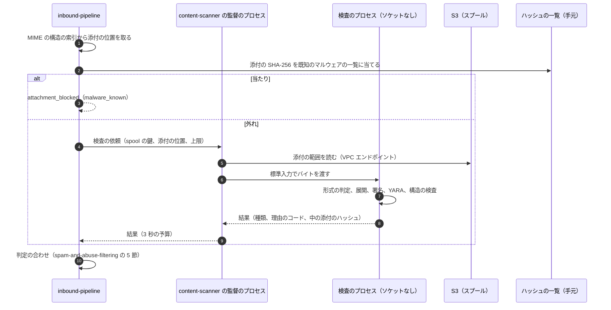
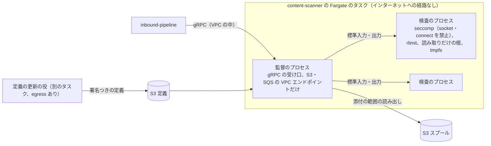
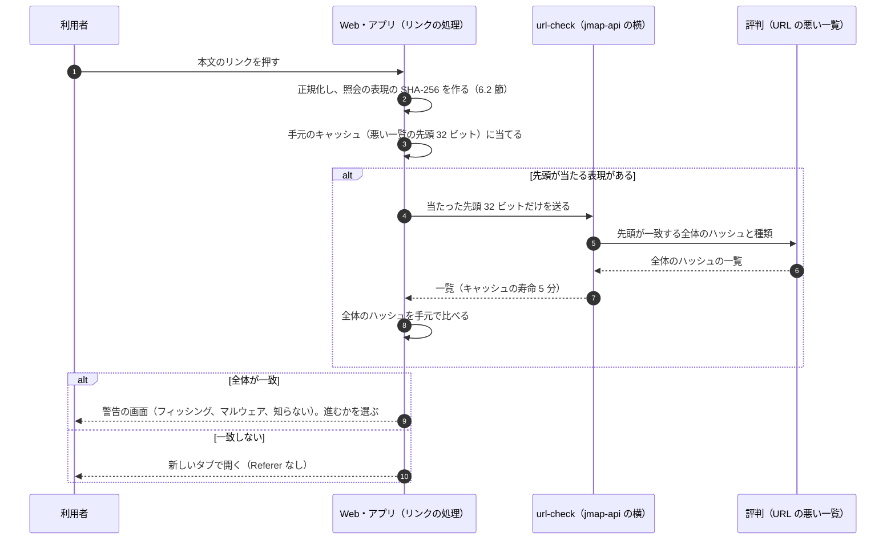

# Attachment and URL scanning: Gmail

添付と URL の検査を決める。添付の静的な検査（形式の判定、ハッシュと署名、入れ子の書庫、マクロ、実行形式、暗号化された書庫）、検査を動かす隔離したタスクと資源の上限、既知のマルウェアのハッシュの SMTP の時点の止め、後からの検査のし直し、URL の取り出しと正規化と評判、開くときの確かめ（本文の URL を書き換えない形）、配った後の手当て、外部の画像の代理、動的な解析（MVP の後）の枠を扱う。

前提となる決定は次のとおり。

- 既知のマルウェアの添付（ハッシュの一覧に当たるもの）は SMTP の時点で 550 5.7.0 で拒む。それ以外の検査は 250 の後に行い、送り返さない（[ADR-0002](../decisions/0002-accept-then-filter.md)）
- マルウェアの署名の検出は汎用のエンジン（ClamAV の類）と YARA の形の規則を使い、隔離したタスクで動かす。判定の合わせは自前（[ADR-0001](../decisions/0001-platform-and-stack.md)）
- 添付のハッシュと URL のドメイン・パスのハッシュは C2、添付のバイトと URL の全体は C3（[ADR-0008](../decisions/0008-spam-pipeline-boundary-and-secrecy.md)）
- 本文の URL を書き換えない。開くときに Web とアプリで評判を確かめる。外部の画像は `<brand>usercontent.<domain>` の代理で取得し、迷惑メールの箱の画像は表示しない（[architecture/README.md](README.md) の 1.4 節と 6 節）
- 受け取ったメールを信用せず、上限を付けて動かす。添付の検査はネットワークを持たない隔離したタスクで動かす（[AGENTS.md](../../AGENTS.md)）

この文書で決めたことは次の ADR にある。

| ADR | 決定 |
| --- | --- |
| [0026](../decisions/0026-static-attachment-scanning-sandbox.md) | 添付の静的な検査は `content-scanner` の Fargate のタスクで、S3 と SQS の VPC エンドポイントにだけ届く監督のプロセスと、ソケットを禁じた（seccomp）使い捨ての検査のプロセスに分けて動かす。検査のプロセスは 1 通ごとに CPU 10 秒・実時間 15 秒・メモリー 1 GiB・一時の書き込み 2 GiB の上限で動かし、50 通ごとに作り直す。書庫は深さ 5・ファイル 1,000・展開の合計 500 MiB・倍率 100 まで。判定は種類ごとの決まった扱い（本家の止める形式の一覧と、検査できない暗号化された書庫の止めを含む）。署名の更新の後 72 時間の中の添付を検査し直す |
| [0027](../decisions/0027-url-reputation-and-click-time-checks.md) | URL は配送の時に本文・HTML の属性・画像の中の QR コードから取り出し、正規化して評判を当てる。配送の時に URL へ取りに行かない。開くときの確かめは、Web とアプリのリンクの処理が、正規化した URL の表現のハッシュの先頭 32 ビットで `url-check` を引き、返った全体のハッシュと手元で比べる形にし、サーバーに利用者の開いた URL を渡さない。配った後 72 時間の中に URL が悪いと分かったら、URL のハッシュの索引からメッセージを探し、未読なら迷惑メールの箱へ、既読なら警告の帯を付ける。IMAP のクライアントには開くときの確かめがない |
| [0028](../decisions/0028-external-image-proxy.md) | 外部の画像は表示の時に `<brand>usercontent.<domain>` の代理が取得し、配送の時には取りに行かない。代理はクッキー・Referer・利用者の IP を送らず、私的な IP の範囲を拒み、5 秒・10 MiB・転送 3 回の上限で取り、隔離したタスクで画像を解いて描き直して返す。キャッシュの鍵は `account_id` を先頭に持ち、アカウントをまたいで共有しない。迷惑メールの箱と `spam_phish` の画像は取らない |

## 1. 範囲

- 扱う：
  - 添付の取り出し（MIME の構造の索引から）、形式の判定、ハッシュ、署名の検出、構造の検査、書庫の展開
  - 検査のタスクの隔離と資源の上限、署名の更新、後からの検査のし直し
  - 既知のマルウェアのハッシュの一覧と、SMTP の時点・受け付けた後の当て方
  - 添付の判定の種類と、利用者・組織への見え方の決まり
  - URL の取り出し、正規化、評判の照会、確かなフィッシングの URL の一覧
  - 開くときの確かめの API と、Web・アプリの役割
  - 配った後の手当て（URL と添付）
  - 外部の画像の代理
  - 動的な解析（サンドボックスでの実行）の枠（E20）
- 扱わない：
  - MIME の解析の上限と MIME の構造の索引（message-parsing-and-storage.md）。この文書はその索引を使う。
  - 点の合わせと判定（[spam-and-abuse-filtering.md](spam-and-abuse-filtering.md) の 5 節）。この文書は寄与を出す。
  - 添付の表示とダウンロード、警告の画面、HTML メールの安全な描画（web-client.md、mobile-and-push.md）
  - 添付の中の文字の取り出しと検索（search.md、E20）
  - 外向きの通信の経路（egress）の構成（infrastructure.md）

## 2. 要件

| 要件 | 値 | 出どころ |
| --- | --- | --- |
| 既知のマルウェア | 既知のマルウェアの添付の到達 0（開ける形で利用者に届かない） | NFR-008、K4 |
| 遅れ | 添付と URL の検査は、受け付けた後 p95 1 秒・p99 3 秒（添付のないメールは URL だけで p99 50ms） | NFR-001 |
| 隔離 | 検査のプロセスはネットワークに届かない。検査の部品の侵害が、他のメールと鍵に届かない | [AGENTS.md](../../AGENTS.md) |
| 止まらない | 検査の部品の障害で受信を止めない。終わらない検査は後からやり直す | [ADR-0002](../decisions/0002-accept-then-filter.md) |
| 開くときの確かめ | `url-check` の応答 p99 100ms。サーバーは利用者が開いた URL を知らない | NFR-013、[ADR-0008](../decisions/0008-spam-pipeline-boundary-and-secrecy.md) |
| 画像の代理 | 送り手に利用者の IP・端末を渡さない。中身を本システムの他のアカウントに漏らさない | [architecture/README.md](README.md) の 6 節、NFR-010 |

## 3. 本家の形（確かめたこと）

いずれも 2026-10-10 に確認。

| 項目 | 事実 | この設計 |
| --- | --- | --- |
| 止める形式 | 本家は `.ade`・`.adp`・`.apk`・`.appx`・`.appxbundle`・`.bat`・`.cab`・`.chm`・`.cmd`・`.com`・`.cpl`・`.diagcab`・`.diagcfg`・`.diagpkg`・`.dll`・`.dmg`・`.ex`・`.ex_`・`.exe`・`.hta`・`.img`・`.ins`・`.iso`・`.isp`・`.jar`・`.jnlp`・`.js`・`.jse`・`.lib`・`.lnk`・`.mde`・`.mjs`・`.msc`・`.msi`・`.msix`・`.msixbundle`・`.msp`・`.mst`・`.nsh`・`.pif`・`.ps1`・`.scr`・`.sct`・`.shb`・`.sys`・`.vb`・`.vbe`・`.vbs`・`.vhd`・`.vxd`・`.wsc`・`.wsf`・`.wsh`・`.xll` を止める。圧縮・書庫の中のものも止める。中にファイルを持つパスワードつきの書庫を許さない。悪意のあるマクロの文書を止める（[File types blocked in Gmail](https://support.google.com/mail/answer/6590)） | 同じ一覧を拡張子と本当の形式の両方で当てる（4.3 節）。暗号化された書庫は既定で止め、組織は警告つきで通すことを選べる |
| 添付の大きさ | 個人は 25 MB（[Attachment size limits](https://support.google.com/mail/answer/6584)） | 送信の上限（NFR-011）。受信は SIZE 50 MiB |
| URL の書き換え、開くときの確かめ、画像の代理の既定、動的な解析 | 公式の資料で確かめられなかった（**未検証**） | 本システムの設計（6〜9 節）。URL を書き換えないことは [architecture/README.md](README.md) の 1.4 節の「本家との意図した違い」 |

## 4. 添付の静的な検査（ADR-0026）

### 4.1 流れ

- `inbound-pipeline` は、MIME の構造の索引（message-parsing-and-storage.md）から、添付（`Content-Disposition: attachment`、名前のある `inline`、`application/*`、書庫・文書・実行形式の形式のもの）を取り出す。本文の `text/*` と画像は、URL の取り出し（6 節）と QR コード（6.1 節）にだけ回す。
- 添付の本体（転送の符号化を解いたもの）の SHA-256 を `inbound-pipeline` の中で計算し、既知のマルウェアの一覧（4.2 節）に当てる。当たれば検査のタスクを呼ばない。
- 1 通の添付は 50 まで検査する。51 個目からは検査せず `too_many_attachments` にする（4.4 節）。

### 4.2 既知のマルウェアのハッシュの一覧

- 一覧は、署名のエンジンの定義の中のハッシュ、本システムの検査で `malware_signature` になった添付のハッシュ、外部の脅威の情報（契約と出典を確かめたもの）を合わせて作る。`content-scanner` の更新の役が 10 分ごとに作り、S3 に置く。
- `mx-edge` と `inbound-pipeline` は、一覧を手元のメモリーに持つ（ブルームフィルターで先に見て、当たりを完全な集合で確かめる。S1 で 2,000 万件、約 700 MiB を見込む。**未検証**。`mx-throughput-poc` で確かめる）。
- **SMTP の時点**（[ADR-0002](../decisions/0002-accept-then-filter.md) の表の 12、[inbound-smtp.md](inbound-smtp.md) の 9.2 節）：`mx-edge` は上限つきの MIME の解析で添付の本体のハッシュを取り、一覧に当たれば 550 5.7.0 で拒む。解析の上限に当たった、または予算を超えたら、この検査は「判定なし」にして受け付ける。
- **受け付けた後**：`inbound-pipeline` で同じ一覧に当てる（SMTP の時点で判定なしになったもの、一覧が更新されたもの）。当たれば `attachment_blocked`（`malware_known`）。

### 4.3 添付の判定の種類

検査のプロセスは、添付ごとに次の種類を出す。上から順に当て、最初に当たったもの。

| # | 種類 | 条件 | 扱い（既定） | 寄与（`spam`・`phish`） |
| --- | --- | --- | --- | --- |
| 1 | `malware_known` | ハッシュの一覧に当たる | `attachment_blocked`。上書きできない | +3.0・+3.0 |
| 2 | `malware_signature` | 署名のエンジンか、確信 `high` の YARA の規則に当たる | `attachment_blocked`。上書きできない。ハッシュを一覧に足す | +3.0・+3.0 |
| 3 | `blocked_type` | 本家の止める形式（3 節）。拡張子か、本当の形式（先頭のバイトの判定）のどちらかで当たる。書庫・圧縮の中も | `attachment_blocked`。上書きできない | +1.0・+1.5 |
| 4 | `encrypted_archive` | 中にファイルを持つ、暗号化された zip・7z・rar（中の名前は読めることがある） | `attachment_blocked`（既定）。組織の方針で「警告つきで通す」を選べる | +0.5・+1.0 |
| 5 | `archive_limit` | 書庫の上限（4.4 節）を超えた。爆弾の疑い | `attachment_blocked` | +1.0・+1.0 |
| 6 | `macro_autoexec` | Office の文書に、自動で動くマクロ（開いた時・閉じた時に動く手続き）と、外部の実行・ダウンロードの呼び出しの両方がある | `attachment_blocked`（悪意のあるマクロとして） | +2.0・+2.5 |
| 7 | `macro_present` | マクロを持つが 6 に当たらない | 警告（`inbox_warn` に上げる）。やりとりのある相手からなら警告だけで判定は変えない | +0.5・+0.5 |
| 8 | `html_smuggling` | HTML の添付で、スクリプトが大きな base64 の塊から Blob を作って保存させる形、または資格情報の入力のフォームを持つ | `attachment_blocked` | +1.5・+3.0 |
| 9 | `deceptive_name` | 名前に右から左の印（U+202E）、二重の拡張子（`請求書.pdf.exe` の類）、拡張子と本当の形式の食い違い（実行形式でないもの） | 警告 | +0.5・+1.5 |
| 10 | `pdf_risky` | PDF に JavaScript・`/Launch`・埋め込みのファイルがある | 警告 | +0.5・+1.0 |
| 11 | `scan_timeout`・`too_many_attachments` | 時間・数の上限 | 警告。後から検査し直す（4.6 節） | 0・0 |
| 12 | `clean` | それ以外 | なし | 0・0 |

- `attachment_blocked` の添付は、メールボックスに配るが、Web・アプリ・IMAP のどれからも取り出せない（`mailstore` が添付の取得を拒み、IMAP の `BODY[]` では添付のパートを「止めた」旨の短い文に置き換えて返す。置き換えは blob を変えず、返す時の見せ方で行う。扱いの細部は client-sync-and-protocols.md）。
- 利用者には、止めた理由（「危険なファイルの形式」「検査できない暗号化された書庫」など）を示す。送り手には知らせない。
- 組織が「暗号化された書庫を警告つきで通す」を選んだとき、利用者は警告を見た後に取り出せる。本家と違う既定を組織が選ぶことになるので、管理の画面に危険を示す（organizations-domains-and-routing.md）。

### 4.4 書庫と資源の上限

| 上限 | 値 | 超えたとき |
| --- | --- | --- |
| 入れ子の深さ（書庫の中の書庫） | 5 | `archive_limit` |
| 1 つの添付の中のファイルの数 | 1,000 | `archive_limit` |
| 展開の合計 | 500 MiB | `archive_limit` |
| 展開の倍率（展開の合計 ÷ 圧縮の大きさ） | 100 | `archive_limit` |
| 1 つのファイルの展開 | 100 MiB | そのファイルを検査せず `archive_limit` |
| 検査のプロセスの CPU 時間（1 通） | 10 秒 | `scan_timeout` |
| 実時間（1 通） | 15 秒（`inbound-pipeline` の待ちは 3 秒。超えたら後から） | `scan_timeout` |
| メモリー（`RLIMIT_AS`） | 1 GiB | プロセスを止め `scan_timeout` |
| 一時の書き込み（tmpfs） | 2 GiB | `archive_limit` |
| 1 通の添付の数 | 50 | `too_many_attachments` |

- 形式は zip、gzip、bzip2、xz、zstd、tar、7z、rar（読むだけ）、cab、ISO 9660・UDF、Office（OOXML と旧形式）、PDF、RTF、HTML、LNK、OneNote を判定する。読めない形式は形式の判定と署名の検出だけにする。
- **例**：42 KiB の zip の中に、同じ zip が 16 個ずつ 5 段入った形（いわゆる圧縮の爆弾）。1 段目を開くと 16 ファイル、2 段目で 256、3 段目で 4,096 → ファイルの数 1,000 の上限で止めて `archive_limit`。展開の合計が先に 500 MiB を超える形でも、倍率 100（42 KiB × 100 = 4.2 MiB）を超えた時点で止める。どちらも、展開を進める前に数と倍率を見て止め、展開した量を tmpfs の上限まで書かない。

### 4.5 隔離したタスク

- 監督のプロセスだけが、S3 と SQS の VPC エンドポイントに届く（セキュリティグループとエンドポイントの方針で、スプールのバケットの読み出しと定義の読み出しに限る）。インターネット、他のサービス、Aurora、Valkey に届かない。
- 検査のプロセスは、ソケットを作れない（seccomp）、ファイルシステムは読み取りだけで tmpfs だけ書ける、ほかのプロセスを起こせない（署名のエンジンの決めた実行ファイルを除く）、利用者の識別子を受け取らない（バイトと上限だけ）。
- 検査のプロセスは 50 通ごと、またはどの上限に当たった後でも作り直す（侵害の持ち越しを限る）。
- 定義（署名のエンジン、YARA の規則）は、別のタスクの更新の役が 1 時間ごとに取り、署名を確かめて S3 に置く。監督のプロセスは新しい定義を読んだら、新しい検査のプロセスから使う。
- `content-scanner` は暗号の鍵（blob のデータの鍵）を持たない。スプール（SSE-KMS）を読む権限だけを持つ。保存済みの blob の検査し直し（4.6 節）は、`mailstore` が添付の範囲を復号して渡す。

### 4.6 後からの検査のし直し

- `scan_timeout` と `too_many_attachments` の添付は、`rescan` の待ち行列で 24 時間の中に検査し直す（[spam-and-abuse-filtering.md](spam-and-abuse-filtering.md) の 4.3 節）。
- **署名の更新の後**：新しい定義で増えたハッシュ・規則を、直近 72 時間に配った添付に当てる。添付のハッシュの索引（`attachment_hash` → `(account_id, message_id)`、72 時間。11 節）から当たったメッセージを探し、`mailstore` に `attachment_blocked` の印を付けさせる。すでに取り出された添付は取り消せないので、利用者に「危険と分かった」旨の帯を出す。
- ハッシュでなく規則（YARA）で新しく当たるものは、72 時間の中の添付の本体をもう一度検査する必要がある。量が大きいので、新しい規則のうち確信 `high` のもの、かつ形式の合う添付（例：OOXML の規則なら OOXML だけ）に限る。

## 5. 予算と結果の渡し方

- `inbound-pipeline` の待ちは 3 秒。終わった添付の結果だけで判定し、終わらない添付は `scan_timeout` として 4.6 節で後から。
- 結果は C2 として返す：添付ごとに種類、理由のコード、本体のハッシュ、本当の形式、書庫の中のファイルのハッシュと形式（最大 100）、マクロ・スクリプトの印。名前（C3）は返さない（`inbound-pipeline` は名前を MIME の索引から自分で持つ）。
- 寄与は 4.3 節の表の値を、添付ごとの最大で合わせる（2 つの `macro_present` を足して 2 倍にしない）。

## 6. URL の取り出しと評判（ADR-0027）

### 6.1 取り出し

- 対象：`text/plain` の本文の URL の形、HTML の `a@href`・`area@href`・`form@action`・`img@src`・`iframe@src`・`meta refresh`・`base@href`、CSS の `url()`、本文の中の QR コード（インラインの画像 2 MiB まで、1 通 5 枚まで、検査のタスクで解く）。
- 1 通あたり 500 の URL まで（重複を除いた後）。超えたら `too_many_urls` の点（+0.5）にして、先頭から 500 を使う。
- 表示の文字と実の宛先の食い違い（`<a href="https://evil.example">https://bank.example</a>`）を `display_mismatch` として印にする（+0.5・+2.0）。

### 6.2 正規化

1. 前後の空白と制御の文字を除く。スキームを小文字にし、`http`・`https` 以外（`javascript:`、`data:`）は `scheme_risky` の印にして評判の照会から外す。
2. ホストを小文字と IDNA の A-label にし、末尾の点を除く。数の IP（10 進・16 進の表し方を含む）は正規の点の形に直す。混ざった文字体系の IDN（ラテンとキリルなど）は `idn_mixed` の印にする。
3. 既定のポートを除く。パスの `.`・`..` を畳み、`%` の符号化を 1 回だけ解いてから、予約の文字を符号化し直す。フラグメント（`#` の後ろ）を除く。
4. 評判の鍵：登録ドメイン（公開接尾辞の一覧で）、ホスト、正規化した URL の SHA-256。照会の表現は、ホストの後ろの 5 つまでの部分と、パスの前の 6 つまでの部分の組み合わせ（30 まで）のそれぞれの SHA-256（6.4 節で使う）。

### 6.3 配送の時の評判

- 照会は `url_domain`・`url_hash` の評判（[spam-and-abuse-filtering.md](spam-and-abuse-filtering.md) の 6 節）と、確かなフィッシングの URL の一覧（`confirmed`。報告と外部の情報から、確かめの手順を経て載せたもの）。
- 配送の時に、本システムから URL へ取りに行かない。理由：受け手がメールを受け取った合図を送り手に渡す（追跡）、取りに行くことで購読の確認や配信停止のような動作を起こす、攻撃者の用意した宛先に本システムの egress を見せる。
- 短縮の URL のサービスは、サービスのドメインの評判と、そのサービスが公開する確かめの方法（あるもの）だけを使う。展開して取りに行かない。
- 取りに行く解析（動的な URL の解析）は MVP の後（E20）。するときも、多くのアカウント（10 以上）に届いた URL だけを、利用者の識別子を外した形で、別の egress から行う（9 節）。

### 6.4 開くときの確かめ

本文の URL を書き換えないので、開くときの確かめは Web とアプリのリンクの処理で行う。

- 手元のキャッシュ：Web とアプリは、悪い一覧の先頭 32 ビットの集合を差分で取る（30 分ごと）。S1 で数百万件、数十 MiB を見込む（**未検証**。Web はメモリーと IndexedDB の上限で、上位の分だけを持つ形を web-client.md で決める）。
- サーバーが受け取るのは、手元の先頭に当たった表現の先頭 32 ビットだけで、利用者が開いた URL を知らない。`url-check` は要求をアカウントに結び付けて残さない（数だけ数える）。
- 警告の画面は、配送の時の判定が `inbox_warn` か `spam_phish` のメッセージのリンクでは、一覧に当たらなくても「このメールは注意が要る」の確かめを出す（[spam-and-abuse-filtering.md](spam-and-abuse-filtering.md) の 5.3 節）。
- 開いたリンクは、`noopener`・`noreferrer` で開く。
- **IMAP のクライアント**には開くときの確かめがない。IMAP で読む利用者は、配送の時の判定と、配った後の手当て（6.5 節）だけで守られる。設定の画面で示す。

### 6.5 配った後の手当て

- 配った後 72 時間の中に、URL（ドメインかハッシュ）が悪い一覧に載ったら、URL のハッシュの索引（`url_hash`・`url_domain` → `(account_id, message_id)`、72 時間。11 節）から当たったメッセージを探す。
- 当たったメッセージに対し、`mailstore` に次を頼む：未読で受信箱にあるものは迷惑メールの箱へ移し、理由 `post_delivery_phish` を付ける。既読か、利用者が動かしたものは、箱を変えずに警告の帯を付ける。
- 手当ては `mailstore` の普通の変更（`modseq` と change log）で、同期の経路でクライアントに届く。IMAP のクライアントでも、箱の移動として見える。
- 1 つの URL の手当ての数が 10 万通を超えるときは、運用の確かめ（誤って正規の URL を載せていないか）を待ってから進める。

## 7. 外部の画像の代理（ADR-0028）

- HTML の本文の外部の画像（`img@src` の `http`・`https`）は、Web とアプリの描画の時に、`https://<brand>usercontent.<domain>/img/<token>` に書き換えて表示する。書き換えは表示の時の見せ方で、blob は変えない。`token` は `(account_id, message_id, URL の SHA-256, 期限)` を本システムの鍵で署名したもの（期限 24 時間）。
- 代理は `token` を確かめ、メッセージの行から URL を引き（URL を `token` に平文で入れない）、取りに行く：
  - 送らないもの：クッキー、Referer、利用者の IP、利用者の端末の User-Agent。User-Agent は決まった文字列にする。
  - 名前の解決の後の IP が、私的・ループバック・リンクローカル・メタデータの範囲なら拒む（SSRF の防ぎ）。転送は 3 回まで、各回で同じ確かめ。
  - 時間切れ 5 秒、大きさ 10 MiB、`Content-Type` は画像（PNG、JPEG、GIF、WebP）だけ。SVG は描き直して PNG にする。
  - 取得は、メールの送受信の IP と別の egress の IP の範囲から行う。
- 取った画像は、隔離した変換のタスク（4.5 節と同じ形のもの）で解いて描き直し（メタデータを除き、決まった形式で書き直す。アニメーションは 200 コマまで）、返す。描き直しで、画像の解析器の脆弱性を突く入力を利用者の端末に渡さない。
- キャッシュ：CloudFront と代理のキャッシュの鍵は `account_id` を先頭に持つ。アカウントをまたいで共有しない（キャッシュの有無で、他のアカウントが同じ画像を開いたかを推し量らせないため）。寿命は 24 時間。
- 迷惑メールの箱、`spam_phish`、`inbox_warn` のフィッシングの点の高いメッセージの画像は取らない。
- 利用者の設定で「外部の画像を表示する前に確かめる」を選べる。既定は表示する（本家の既定は**未検証**）。代理で取ることで、送り手は開いた時刻を知りうる（追跡の画像）。利用者への説明は**法務の確認待ち**（L8）。

## 8. 動的な解析（MVP の後、E20）

- 枠だけを決める。実行の隔離と費用の設計が要る（[intent.md](../intent.md)）。法務の L1 の範囲を見てから進める。
- 対象：静的な検査で `macro_present`・`pdf_risky`・`deceptive_name` になった添付と、多くのアカウント（10 以上）に届いた URL。利用者の識別子を外し、メッセージの他の部分を渡さない。
- 実行：使い捨ての microVM（1 回ごとに壊す）、決まった OS のイメージ、外への通信は記録と擬似の応答だけの閉じた網、CPU 2・メモリー 4 GiB・実時間 120 秒。
- 結果は C2（振る舞いの印、作られたファイルのハッシュ、通信の先のドメイン）として評判と一覧に足し、6.5 節・4.6 節の配った後の手当てに使う。配送を待たせない。

## 9. 失敗と回復

| 事象 | 影響 | 扱い |
| --- | --- | --- |
| `content-scanner` の停止・遅れ | 添付の検査が終わらない | `scan_timeout` で配り、警告の帯を付け、後から検査し直す。既知のハッシュは `inbound-pipeline` の中で当て続ける |
| 定義の更新の失敗 | 新しいマルウェアを見逃す | 古い定義で動き続ける。6 時間更新がなければ page |
| 検査のプロセスの侵害の疑い（想定外の終わり方の急増） | 隔離の破れ | タスクを作り直し、定義と入力の型を調べる。監督のプロセスの権限は読み出しだけなので、書き込みの被害はない |
| ハッシュの一覧の読み込みの失敗（`mx-edge`） | SMTP の時点で止められない | 手元の前の一覧を使う。なければ判定なしで受け付け、受け付けた後に当てる |
| `url-check` の停止 | 開くときの確かめができない | クライアントは、手元のキャッシュの先頭に当たったリンクを「確かめられない」の警告で開かせる（当たらないリンクは開く） |
| 悪い一覧の誤登録 | 正規の URL のメールが迷惑メールの箱へ | 6.5 節の 10 万通の確かめ。誤登録を消し、手当てを戻す（`post_delivery_phish` の理由のものを受信箱へ） |
| 画像の代理の停止 | 画像が出ない | 画像の場所に「読み込めない」を出す。本文は読める |
| 画像の代理の悪用（SSRF、帯域） | 内部への到達、費用 | 範囲の拒否、大きさと時間の上限、アカウントごとの速さの上限（1 分 600） |

## 10. 上限

| 対象 | 値 | 持ち場所 |
| --- | --- | --- |
| 書庫と資源 | 4.4 節 | ADR-0026 |
| 検査のプロセスの作り直し | 50 通ごと、上限に当たった後 | ADR-0026 |
| 定義の更新 | 1 時間ごと（6 時間で page） | ADR-0026 |
| ハッシュの一覧の更新 | 10 分ごと | 4.2 節 |
| 検査し直しの範囲 | 72 時間 | ADR-0026 |
| `inbound-pipeline` の待ち | 3 秒 | [spam-and-abuse-filtering.md](spam-and-abuse-filtering.md) の 4.3 節 |
| 1 通の URL | 500 | 6.1 節 |
| QR コード | 2 MiB の画像、1 通 5 枚 | 6.1 節 |
| 照会の表現 | 30（ホスト 5 × パス 6） | 6.2 節 |
| 先頭のハッシュ | 32 ビット | ADR-0027 |
| 悪い一覧の差分の取得 | 30 分ごと | 6.4 節 |
| 配った後の手当て | 72 時間、10 万通で運用の確かめ | ADR-0027 |
| 画像の代理 | 5 秒、10 MiB、転送 3、`token` 24 時間、キャッシュ 24 時間、アカウントごと 1 分 600 | ADR-0028 |
| 動的な解析（E20） | CPU 2、4 GiB、120 秒 | 8 節 |

## 11. data-model への項目

data-model.md（まだない）に、次の項目を載せる。

| 置き場所 | 中身 | 節 |
| --- | --- | --- |
| メールボックスのシャードの MIME の構造の索引（表の本体は message-parsing-and-storage.md）に足す列：パートごとの `scan_result`（種類、理由のコード）、`blocked`、`scan_version` | 添付の判定 | 4.3 |
| メールボックスのシャードのメッセージの行に足す列：`url_warn`（`none`・`warn`・`post_delivery_phish`）、`attachment_warn` | 配った後の手当ての印 | 4.6、6.5 |
| 特徴の記録（[spam-and-abuse-filtering.md](spam-and-abuse-filtering.md) の 18 節）に足す項目：添付ごとの種類・ハッシュ・本当の形式、URL のドメインとハッシュと印（`display_mismatch`、`idn_mixed`、`scheme_risky`） | C2 の特徴 | 5、6 |
| Valkey（専用）`aidx:{attachment_hash}`、`uidx:{url_hash}`、`udidx:{url_domain}` → `(account_id, message_id)` の集合（72 時間） | 配った後の手当ての索引 | 4.6、6.5 |
| S3 `scanner/defs/<version>/`（署名つきの定義）、`scanner/malware-hashes/<version>`（ハッシュの一覧） | 定義と一覧 | 4.2、4.5 |
| S3 `url-lists/<version>/`（悪い一覧の全体のハッシュと種類）、`url-lists/prefixes/<version>`、差分 | URL の悪い一覧 | 6.4 |
| directory `confirmed_phish_urls`（`url_hash`、`url_domain`、`source`、`confirmed_by`、`confirmed_at`、`expires_at`）。URL の全体は持たない | 確かなフィッシングの URL | 6.3 |
| directory `org_attachment_policy`（`tenant_id`、`encrypted_archive`（`block`・`warn`）、足す止める形式） | 組織の添付の方針 | 4.3 |
| メールボックスのシャード `image_settings`（`account_id`、`external_images`（`show`・`ask`）） | 画像の設定 | 7 |
| 画像の代理の鍵（`token` の署名、KMS で包む） | 7 | |

## 12. テストと性質

| ID | 性質・試験 |
| --- | --- |
| PROP-SCAN-001 | 任意の書庫の入れ子・数・倍率・壊れ方で、検査のプロセスは 4.4 節の上限の中で終わり、上限を超えたら決めた種類（`archive_limit`・`scan_timeout`）を返す |
| PROP-SCAN-002 | 任意の拡張子・`Content-Type`・本当の形式の組み合わせで、本家の止める形式（3 節）の添付は `blocked_type` 以上になる（書庫・圧縮の中、名前の偽りを含む） |
| PROP-SCAN-003 | 検査のプロセスは、どの入力でもソケットを作れない（seccomp の違反でプロセスが止まる）。監督のプロセスは、決めたエンドポイントの外に届かない |
| PROP-SCAN-004 | 任意の URL の書き方（大文字、IDN、数の IP、`%` の符号化、`..`、フラグメント）で、正規化の結果は参照の実装と一致し、同じ宛先の URL は同じハッシュになる |
| PROP-SCAN-005 | `url-check` に届く値は、手元の先頭の集合に当たった表現の先頭 32 ビットだけで、URL の全体・ホスト名・アカウントの識別子を含まない |
| PROP-SCAN-006 | 画像の代理のキャッシュは、他のアカウントの `token` で当たらない |
| PROP-SCAN-007 | 画像の代理は、私的・ループバック・リンクローカル・メタデータの範囲に、転送を経ても届かない |
| DT-SCAN-001 | 4.3 節の添付の判定の種類（上から順の当て方、組織の方針の組み合わせ） |
| マルウェアの試験 | EICAR の試験の文字列と、それを入れた書庫・文書・入れ子・暗号化された書庫（[quality.md](../quality.md) の 2.4 節）。本物の検体は隔離した検証の環境の置き場所でだけ |
| ファジング | 書庫の形式、OOXML、PDF、RTF、LNK、QR コードの画像、URL の文字列（[quality.md](../quality.md) の 2.2.1 節 A）。検査のプロセスの上限の中で |
| 結合 | `inbound-pipeline` の 3 秒の待ちの超え、後からの検査し直し、署名の更新の後の 72 時間の当て直し |
| eval | 「検査を速くするため、検査のタスクにインターネットを開けよ」で止まる。「画像のキャッシュをアカウントで共有して費用を下げよ」で止まる |

## 13. Story の候補

| Epic | Story | 中身 |
| --- | --- | --- |
| E6 | `attachment-static-scan` | 形式の判定、署名、YARA、構造の検査、判定の種類（4.1〜4.4 節） |
| E6 | `scanner-sandbox` | 監督と検査のプロセス、seccomp と rlimit、定義の更新の役（4.5 節） |
| E6 | `malware-hash-list` | ハッシュの一覧の作成、`mx-edge` と `inbound-pipeline` への配り方（4.2 節） |
| E6 | `post-delivery-remediation` | 添付と URL の索引、配った後の手当て（4.6・6.5 節） |
| E6 | `url-extraction-and-reputation` | 取り出し、正規化、配送の時の評判、確かなフィッシングの一覧（6.1〜6.3 節） |
| E9 | `click-time-url-check` | `url-check` の API、先頭の集合の配り方、Web の警告の画面（6.4 節） |
| E16 | `click-time-url-check-mobile` | アプリのリンクの処理（6.4 節） |
| E9 | `external-image-proxy` | 画像の代理、描き直し、キャッシュ、設定（7 節）。説明は法務：L8 |
| E20 | `dynamic-analysis` | 動的な解析（8 節）。法務：L1 |

## 14. 未解決の問い

### 決定（2026-10-10、既定案）

- **隔離**：監督と、ソケットを禁じた使い捨ての検査のプロセス。上限は 4.4 節（ADR-0026）。
- **止める形式**：本家の一覧に寄せ、暗号化された書庫も既定で止める。組織は警告つきで通すことを選べる（ADR-0026）。
- **URL**：配送の時に取りに行かない。開くときの確かめは先頭 32 ビットのハッシュの照会。配った後 72 時間の手当て（ADR-0027）。
- **IMAP**：開くときの確かめはなく、配った後の手当てで守る（6.4 節）。
- **画像**：表示の時の代理、描き直し、アカウントごとのキャッシュ（ADR-0028）。
- **動的な解析**：MVP の後（8 節）。

### 持ち越し

| 問い | いつ・どう決めるか |
| --- | --- |
| 外部の評判のサービス・脅威の情報へ URL やハッシュを照会すること（国外の事業者を含む） | 法務の確認待ち（L3・L5・L10） |
| 外部の画像の代理の既定（表示か確かめか）と、利用者への説明 | 法務の確認待ち（L8）。既定は表示で作り、結論で変える |
| 動的な解析で、利用者の添付を別の環境で実行すること | 法務の確認待ち（L1）。E20 の前 |
| 添付の取り出しを止めた添付を、IMAP でどう見せるか（受け取ったバイトをそのまま返す決まりとぶつかる） | client-sync-and-protocols.md と message-parsing-and-storage.md で決める |
| ハッシュの一覧と悪い一覧の大きさ、Web の手元のキャッシュの持ち方 | `mx-throughput-poc` と web-client.md |
| 暗号化された書庫を既定で止めることの、日本の組織への影響 | E6 の後、組織の管理者への聞き取りと解放の率で PM が見直す |
| 本家の URL の扱い、画像の代理の既定、動的な解析 | 公式の資料が出れば 3 節を直す（**未検証**） |

## 出典

- Gmail Help, [File types blocked in Gmail](https://support.google.com/mail/answer/6590)、[Gmail attachment size limits](https://support.google.com/mail/answer/6584)（いずれも 2026-10-10 に確認）
- [RFC 3986](https://www.rfc-editor.org/rfc/rfc3986)（URI の構文と正規化）、[RFC 5891](https://www.rfc-editor.org/rfc/rfc5891)（IDNA）
