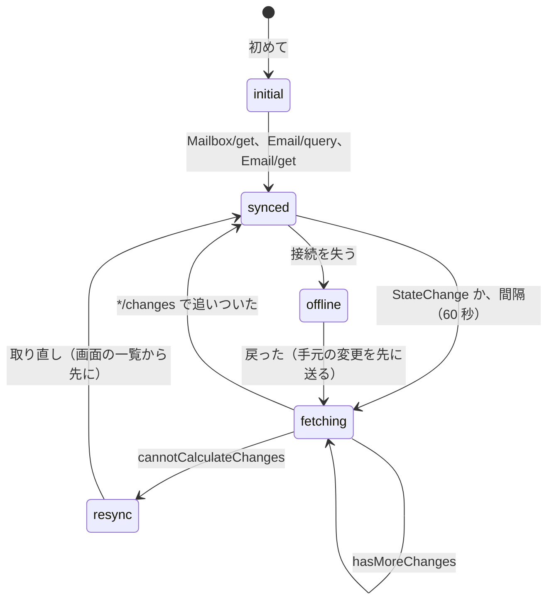

# Client Sync and Protocols: Gmail

クライアントとの同期のプロトコルを決める。change log と `modseq`、JMAP の状態の文字列と差分（`Email/changes`、`Email/query` と `queryState`、`Email/queryChanges`）、JMAP の箱とキーワードへのラベルの対応、本システムの JMAP の拡張、`EmailSubmission` と送信の保留、プッシュ（EventSource・WebSocket・IMAP の IDLE）、IMAP4rev2 の対応（箱、UID、CONDSTORE・QRESYNC、複数のラベルを持つメッセージ）、SMTP の submission、衝突、同期の収束の性質を扱う。

前提となる決定は次のとおり。

- JMAP（RFC 8620・8621）を主の API、IMAP4rev2（RFC 9051）と CONDSTORE・QRESYNC（RFC 7162）を既存のアプリ向けにし、両方をアカウントごとの `modseq` と change log の上に作る。change log の保持は 30 日（[ADR-0006](../decisions/0006-sync-protocol-jmap-imap-and-modseq.md)）
- ラベルが正で、IMAP ではラベルを箱として見せる。`SPAM`・`TRASH` は他のラベルの表示から外す（[ADR-0004](../decisions/0004-labels-as-primary-mailbox-model.md)、[mailbox-model-labels-and-threads.md](mailbox-model-labels-and-threads.md)）
- `jmap-api`（TypeScript）と `imap-server`（Rust）は `mailstore` の gRPC を呼ぶだけで、状態の変更を書かない（[ADR-0001](../decisions/0001-platform-and-stack.md)）

この文書で決めたことは次の ADR にある。

| ADR | 決定 |
| --- | --- |
| [0039](../decisions/0039-change-log-states-and-jmap-changes.md) | change log の行は `(account_id, modseq, seq)` を鍵に、種類・実体・ラベルの差分を持ち、日の分割で 30 日持つ。JMAP の状態の文字列は `<epoch>.<modseq>` で、型ごとの最後の `modseq` から作る。`Email/changes` は `modseq` の境で切って `maxChanges` を守る。`Email/queryChanges` は「1 つの箱・受け付けの時刻の新しい順」の形の問い合わせだけに答え、他は `cannotCalculateChanges`。大阪への切り替えでは `epoch` を進め、`modseq` と UID の数えを跳ばす |
| [0040](../decisions/0040-imap-label-mailbox-mapping.md) | IMAP はラベルを箱として出し、見える所属ごとに UID を振る。隠すと `VANISHED`、戻すと新しい UID。`\Deleted` は所属ごとに持ち、`EXPUNGE` はその箱のラベルを外す（`[<Brand>]/All Mail` ではゴミ箱へ、`[<Brand>]/Trash`・`[<Brand>]/Spam` では完全な削除）。箱ごとの `MODSEQ` はメッセージと所属の大きいほう。`[<Brand>]/Sent Mail` への `APPEND` は、24 時間の中の同じ `Message-ID` の送信と結ぶ。IMAP4rev1 と IMAP4rev2 を両方出す。同時の接続は 15 |
| [0032](../decisions/0032-served-view-edits.md) | IMAP の `BODY[]` と JMAP の生の取得は、blob ではなく配る形（前置き＋ blob に編集の表を当てたもの）を返す。本システムの authserv-id を名乗る偽の `Authentication-Results` は `X-<Brand>-Untrusted-Authentication-Results` の名前で返し、止めた添付は知らせの文のパートに置き換える。配った後に止めたら、新しい世代（新しい UID と Email の ID）にする（[message-parsing-and-storage.md](message-parsing-and-storage.md) で起票） |
| [0041](../decisions/0041-jmap-extensions-and-mailbox-mapping.md) | JMAP の `Mailbox` に役 `all` の仮想の箱を出し、`SPAM`・`TRASH`・`SCHEDULED` のないメッセージは必ずそこに属する。隠した所属は `<brand>:hiddenMailboxIds` で読ませる。`STARRED` はキーワード `$flagged` で出し箱にしない。送信の保留は FUTURERELEASE（`HOLDFOR`・`HOLDUNTIL`）で表し、元に戻す送信の窓はサーバーが足す。保留の間は `SCHEDULED`。拡張は能力 `urn:<brand>:params:jmap:mail` の下に置き、メソッドと性質の名前に `<Brand>`・`<brand>:` を付ける |

## 1. 範囲

- 扱う：
  - change log の形、`modseq` の進め方、保持、切り替えの時の扱い
  - JMAP の Core・Mail・Submission・VacationResponse の対応、状態の文字列、差分、問い合わせ
  - JMAP の箱・キーワードへの対応、本システムの拡張
  - `EmailSubmission` と送信の保留（元に戻す送信、予約の送信）の表し方。保留の中の時刻の仕事は [filters-forwarding-and-automation.md](filters-forwarding-and-automation.md) の 7 節
  - プッシュ（EventSource、WebSocket、IMAP の IDLE）。モバイルのプッシュは [mobile-and-push.md](mobile-and-push.md)
  - IMAP4rev2 と拡張、箱の対応、UID と `MODSEQ`、コマンドとラベルの操作の対応
  - SMTP の submission（465・587）の受け口と送信の依頼への変え方
  - 衝突、同期の収束の性質
- 扱わない：
  - ラベルの操作の意味（[mailbox-model-labels-and-threads.md](mailbox-model-labels-and-threads.md) の 5 節）。この文書は、プロトコルの操作を `apply_label_op` に結び付けるところまで
  - OAuth の認可とスコープ、第三者のアプリの確かめ（accounts-and-security.md、api-and-integrations.md）
  - 送信の関門（[outbound-smtp-and-reputation.md](outbound-smtp-and-reputation.md)）。この文書は送信の依頼を作るところまで
  - 検索の中（[search.md](search.md)）

## 2. 要件

| 要件 | 値 | 出どころ |
| --- | --- | --- |
| 通知の速さ | 変更から接続中のクライアント（JMAP、IMAP の IDLE）への通知 p95 2 秒・p99 5 秒 | NFR-006 |
| 収束 | すべての変更を受けた後、どのクライアントの状態もサーバーと一致する | NFR-006、[quality.md](../quality.md) の 2.2.1 節 E |
| IMAP | `SELECT`（QRESYNC つき）p99 1 秒（10 万通の箱）。同時の接続 15／アカウント | NFR-014 |
| UID | どの箱でも単調に増え、再利用しない。`UIDVALIDITY` は箱を作り直したときだけ変わる | [ADR-0006](../decisions/0006-sync-protocol-jmap-imap-and-modseq.md) |
| 可用性 | JMAP・IMAP 月間 99.9% | NFR-007 |
| 送信の受け付け | 応答 p99 500ms。確定の前に受け付けを返さない | NFR-002、[ADR-0002](../decisions/0002-accept-then-filter.md) |
| 分離 | どの応答・通知にも他のアカウントの情報を出さない | NFR-010 |

## 3. 標準と本家の形

| 項目 | 事実 | この設計 |
| --- | --- | --- |
| JMAP の Email の箱 | RFC 8621 の 2 節：IMAP との互換のため、Email は 1 つ以上の箱に属さなければならない（MUST） | 役 `all` の仮想の箱（6.2 節） |
| JMAP の `threadId` | RFC 8621 の 3 節：変わらない。スレッドを合わせるときは、Email を消して新しい ID で入れ直す（MUST） | 合わせで新しい世代（[ADR-0034](../decisions/0034-threading-implementation-and-merge.md)） |
| 箱の役 | RFC 8621 の 2 節：IANA の「IMAP Mailbox Name Attributes」の登録の名前。1 つの役は 1 つの箱 | `inbox`、`sent`、`drafts`、`junk`、`trash`、`all`、`important`、`scheduled`、`snoozed`。`scheduled`・`snoozed` が登録にあるかは確かめられなかった（**未検証**）。なければ `<brand>:scheduled` のような拡張の性質にする |
| 送信の保留 | RFC 8621 の 7 節：`sendAt` はサーバーが決める。FUTURERELEASE（RFC 4865）を使えば解放の時刻。`undoStatus` が `pending` の間は `canceled` にできる | 6.6 節 |
| `onDestroyRemoveEmails` | RFC 8621 の 2.5 節：真なら箱のメールを箱から外し、他の箱になければ消す | 役 `all` があるので消えない（6.2 節） |
| CONDSTORE・QRESYNC | RFC 7162。箱ごとに `MODSEQ` が単調に増える | 7.3 節 |
| OBJECTID | RFC 8474：`EMAILID` は同じ（箱、`UIDVALIDITY`、UID）に同じ値。一度知らせた `THREADID` を変えない | 7.3 節、[ADR-0034](../decisions/0034-threading-implementation-and-merge.md) |
| IMAP の箱の名前 | RFC 9051 の 5.1 節：IMAP4rev2 は UTF-8 の名前。IMAP4rev1 は修正 UTF-7 | 7.1 節 |
| 本家の IMAP | 個人のアカウントは 2025 年 1 月から常に有効、同時の接続 15、ラベルを箱として扱う独自の拡張（[Add Gmail to another email client](https://support.google.com/mail/answer/7126229)、[IMAP Extensions](https://developers.google.com/workspace/gmail/imap/imap-extensions)、2026-10-10 に確認） | 同時の接続 15。独自の拡張は出さない（[ADR-0006](../decisions/0006-sync-protocol-jmap-imap-and-modseq.md)） |
| 本家の同期の内部の API、`EXPUNGE` の既定の振る舞い | **未検証** | 7.5 節の本システムの規則 |

## 4. change log と modseq（ADR-0039）

### 4.1 行

```
changes(
  tenant_id, account_id,
  modseq      bigint,     -- アカウントで 1 つずつ増える
  seq         int,        -- 同じ modseq の中の行の番号
  kind        enum,       -- created, updated, destroyed, label_added, label_removed,
                          -- hidden, unhidden, thread_merged, thread_destroyed,
                          -- label_created, label_renamed, label_deleting, label_destroyed,
                          -- submission_changed, vacation_changed, regenerated
  entity_type enum,       -- email, thread, mailbox, submission, vacation
  entity_id   uuid,
  object_gen  int,        -- email のとき（JMAP の ID の世代）
  label_ids_added   uuid[],
  label_ids_removed uuid[],
  flags_changed     bit(8),
  created_at  timestamptz
)  主キー (tenant_id, account_id, modseq, seq)、日の分割
```

- `mailstore` の 1 つの変更のトランザクションは、`accounts_state.modseq` を 1 つ進め、その `modseq` で 1 行以上を書く（[ADR-0006](../decisions/0006-sync-protocol-jmap-imap-and-modseq.md)）。同じトランザクションで outbox に `account.changed(account_id, modseq)` を書く。
- メッセージ・スレッド・ラベルの行は、最後に変わった `modseq` を持つ。
- IMAP のための補助の表 `imap_vanished(account_id, label_id, uid, modseq)` を同じトランザクションで書く（見える所属を失った UID）。change log と同じ 30 日で消す。

### 4.2 型ごとの最後の modseq

`accounts_state` に、型ごとの最後の `modseq`（`email_modseq`、`thread_modseq`、`mailbox_modseq`、`submission_modseq`、`vacation_modseq`）を持つ。

| 変更 | 進める型 |
| --- | --- |
| 配送 | email、thread、mailbox（件数） |
| 既読・スター | email、mailbox（件数）、thread（スレッドの既読の集計を出すクライアントのため） |
| ラベルの付け外し・隠す | email、mailbox |
| スレッドの合わせ | email（世代の切り替え）、thread |
| ラベルの作成・名前の変更・消去 | mailbox |
| 送信の依頼の状態 | submission、email（ラベル） |

### 4.3 保持

- 日の分割で 30 日を過ぎた分割を落とす。`accounts_state.floor_modseq` に、残っている最も古い `modseq` を持つ。
- `floor_modseq` より古い状態からの差分の要求は、JMAP は `cannotCalculateChanges`、IMAP は 7.3 節の全体の取り直し。

### 4.4 切り替えのときの epoch と跳ばし

大阪への切り替え（メタデータの RPO 1 分。NFR-004）では、東京で書いて大阪に届かなかった変更が消える。クライアントは、消えた `modseq` を知っているかもしれない。同じ `modseq` を別の変更に使い直すと、クライアントは差分を取り損ねる。

- 切り替えの時、各アカウントの最初の書き込みで `accounts_state.epoch` を 1 つ進め、`modseq` を 2^24 跳ばし、各ラベルの `uidnext` を 2^16 跳ばす（`modseq_jump_floor`、`uid_jump_floor` を記録する）。
- JMAP：状態の文字列は `<epoch>.<modseq>` なので、古い `epoch` の状態は `cannotCalculateChanges` になり、クライアントは取り直す。
- IMAP：`CHANGEDSINCE`・QRESYNC の値が `modseq_jump_floor` より小さいときは、`CHANGEDSINCE 0` として全体の旗を返し、跳ばした範囲の UID（`[切り替えの前の uidnext, uid_jump_floor)`）を `VANISHED (EARLIER)` に含める。消えたメッセージの UID は、この範囲にしかない。`UIDVALIDITY` は変えない（全部の取り直しを避ける）。
- 例：東京で INBOX の `uidnext` が 5,001、`modseq` が 90,000 まで進み、大阪には `uidnext` 4,998、`modseq` 89,990 までしか届かなかった。切り替えの後、`modseq` は 89,990 + 2^24 から、INBOX の UID は 4,998 + 65,536 = 70,534 から振る。`MODSEQ` 89,995 を知る IMAP のアプリは、全体の旗と `VANISHED (EARLIER) 4998:70533` を受け、消えた UID 4,998〜5,000 を捨てる。

## 5. JMAP の状態と差分（ADR-0039）

### 5.1 状態の文字列

- 型ごとに `"<epoch>.<modseq>"`（`modseq` は 36 進）。例：`"3.1z141z3"`。`Email/get` の `state` は `email_modseq`、`Mailbox/get` は `mailbox_modseq`。
- `Email/query` の `queryState` は `"<epoch>.<email_modseq>.<filter_hash>"`。並べ方と条件のハッシュを含め、別の問い合わせの状態と取り違えない。

### 5.2 `Email/changes`

1. `sinceState` の `epoch` が今と違うか、`modseq < floor_modseq` なら `cannotCalculateChanges`。
2. change log を `modseq > since` から `modseq` の順に読み、`entity_type = email` の行を、`(entity_id, object_gen)` ごとにまとめる。
3. 1 つの `modseq` の行は分けない。まとめた ID の数が `maxChanges`（既定 500、上限 5,000）を超える手前の `modseq` で止め、`newState` をその `modseq` にし、`hasMoreChanges = true`。
4. 分け方：その範囲で作られ消えたもの → 返さない。作られた → `created`。消えた → `destroyed`。それ以外 → `updated`。

**例**：`sinceState = "1.1000"`、`maxChanges = 2`。

| modseq | 行 |
| --- | --- |
| 1001 | e1 created |
| 1002 | e2 updated（既読） |
| 1003 | e3 created |
| 1004 | e3 destroyed |
| 1005 | e1 updated（ラベル） |

1001・1002 で ID は 2（e1、e2）。1003 を足すと 3 になるので止める。応答は `created: [e1]`、`updated: [e2]`、`newState: "1.1002"`、`hasMoreChanges: true`。次の呼び出しで 1003〜1005 を読み、e3 は作られて消えたので返さず、`updated: [e1]`、`newState: "1.1005"`。

### 5.3 `Email/query`

- 標準の `FilterCondition`（`inMailbox`、`inMailboxOtherThan`、`before`、`after`、`from`、`text`、`hasKeyword` など）と、拡張の `<brand>:query`（検索の文字列。[search.md](search.md) の 5 節）を受ける。
- 箱と時刻と旗だけの問い合わせは、`mailstore` の索引（`message_labels` の `(account_id, label_id, received_at desc)`、`<brand>:inboxAt` の並びには `added_at`）で答える。語を含む問い合わせは `search-node` に渡す。
- `collapseThreads: true` は、スレッドごとに、条件に合う最新のメッセージを 1 つ返す。
- `SPAM`・`TRASH` は、`inMailbox` がその箱でない限り除く（[ADR-0004](../decisions/0004-labels-as-primary-mailbox-model.md)）。

### 5.4 `Email/queryChanges`

RFC 8620 の 5.6 節の差分を、「受信箱の一覧」の形の問い合わせに限って出す。

- 答える形：`filter` が `inMailbox` の 1 つだけ（`<brand>:query` なし）、並びが `receivedAt` か `<brand>:inboxAt` の新しい順、`collapseThreads` は真か偽。他の形は `cannotCalculateChanges`（`Email/query` の応答の `canCalculateChanges: false`）。
- 手順：`since` から今までの change log の、その箱の `label_added`・`label_removed`・`hidden`・`unhidden`・`created`・`destroyed` を読み、`removed`（箱から出た ID）と `added`（箱に入った ID と、並びの中の位置）を作る。`receivedAt` は変わらないので、位置は今の一覧から求められる。
- `collapseThreads` が真で、範囲にスレッドの合わせ（`thread_merged`）があれば `cannotCalculateChanges`。
- 変更が 2,000 を超えたら `tooManyChanges`（クライアントは問い合わせ直す）。

### 5.5 プッシュ

- EventSource（RFC 8620 の 7.3 節）と WebSocket（RFC 8887 の `WebSocketPushEnable`）を出す。`push-gateway` は relay から `account.changed` を受け、アカウントの接続へ `StateChange`（型ごとの状態の文字列）を送る。中身は送らない。
- 同じアカウントの変更は 200ms まとめてから送る（スレッドのアーカイブの 1,000 行を 1 回の通知に）。
- EventSource の `ping` は 30 秒、`closeafter=state` に従う。1 アカウントの同時のプッシュの接続は 20。
- プッシュは合図で、正しさに要らない。落としても、次の同期で収束する（[quality.md](../quality.md) の 2.2.1 節 E）。

### 5.6 クライアントの同期の状態



## 6. JMAP の箱と拡張（ADR-0041）

### 6.1 箱

- システムのラベルと利用者のラベルを `Mailbox` として出す（[mailbox-model-labels-and-threads.md](mailbox-model-labels-and-threads.md) の 4.1 節の表）。`STARRED` は箱にせず、キーワード `$flagged` で出す。
- `Mailbox` の `id` は `label_id`。`parentId` は入れ子、`name` は最後の段の名前。`sortOrder` は役の箱を先に。
- `myRights` は、役の箱の `mayRename`・`mayDelete` を偽、`all`・`scheduled` の `mayAddItems`・`mayRemoveItems` を偽にする。

### 6.2 役 `all` の仮想の箱

- `SPAM`・`TRASH`・`SCHEDULED` のないメッセージは、`mailboxIds` に必ず `all` の箱を含む。RFC 8621 の 2 節の「1 つ以上の箱に属する」を、アーカイブした（ラベルのない）メッセージでも満たす。
- `all` の箱を `mailboxIds` の差分で足す・外す要求は、`invalidProperties` で拒む。
- `Mailbox/set` の消去の `onDestroyRemoveEmails: true` は、ラベルを外す（[mailbox-model-labels-and-threads.md](mailbox-model-labels-and-threads.md) の 5.5 節）。メッセージは `all` に残るので、「他の箱になければ消す」に当たらず、消えない。
- [ADR-0006](../decisions/0006-sync-protocol-jmap-imap-and-modseq.md) の「`archive` の役の箱は持たない」は変えない。`all` は、アーカイブしたものだけでなく、受信箱やラベルのものも含む。

### 6.3 隠した所属

- `SPAM`・`TRASH` を持つメッセージの `mailboxIds` は、`junk` か `trash` の箱だけ（と、`all` は含まない）。隠した所属は、拡張の性質 `<brand>:hiddenMailboxIds`（読み出しだけ）で返す。
- `mailboxIds` に `trash` を足す差分は DT-MBX の行 9、外す差分は行 10（[mailbox-model-labels-and-threads.md](mailbox-model-labels-and-threads.md) の 5.1 節）に当てる。JMAP の差分の意味を、決定表の行にそのまま対応させる。

### 6.4 キーワード

| JMAP | IMAP | 本システム |
| --- | --- | --- |
| `$seen` | `\Seen` | `messages.seen` |
| `$flagged` | `\Flagged` | `STARRED` のラベル |
| `$draft` | `\Draft` | `DRAFT` のラベル（キーワードの直接の変更は拒む） |
| `$answered` | `\Answered` | `message_keywords` |
| `$forwarded`、`$mdnsent`、`$junk`、`$notjunk`、利用者のキーワード | 同じ名前 | `message_keywords`（`$junk` は `SPAM` に結び付けない。迷惑メールの報告は明示の操作だけ） |

- 1 メッセージのキーワードは 50、1 アカウントの違うキーワードは 1,000 まで。

### 6.5 拡張の能力とメソッド

能力 `urn:<brand>:params:jmap:mail` の下に置く（[ADR-0006](../decisions/0006-sync-protocol-jmap-imap-and-modseq.md)）。

| 名前 | 種類 | 中身 |
| --- | --- | --- |
| `<Brand>Thread/set` | メソッド | スレッドへの操作（`archive`、`addLabel`、`removeLabel`、`markRead`、`markUnread`、`trash`、`spam`、`notSpam`、`mute`、`unmute`、`snooze`）。`ifInState` を受ける |
| `<Brand>Unsubscribe/set` | メソッド | 一括の配信停止の実行（[web-client.md](web-client.md) の 9 節。法務の L2） |
| `<Brand>Device/set`・`/get` | メソッド | モバイルの端末の登録（[mobile-and-push.md](mobile-and-push.md) の 5 節） |
| `<brand>:query` | `Email/query` の条件 | 検索の文字列 |
| `<brand>:inboxAt` | Email の性質と並べ方 | `INBOX` を得た時刻 |
| `<brand>:hiddenMailboxIds` | Email の性質 | 6.3 節 |
| `<brand>:snoozeUntil` | Email の性質 | スヌーズの時刻 |
| `<brand>:authWarning` | Email の性質 | 確かめられていない差出人・スレッドの乗っ取りの印（理由のコード） |
| `<brand>:unsubscribe` | Email の性質 | 一括の配信停止のボタンを出せるか |
| `<brand>:muted` | Thread の性質 | ミュート |

- 名前に `<Brand>`・`<brand>:` を付けるのは、標準の将来の名前とぶつからないためと、本家の名前を使わないため（[リポジトリ共通の ADR-0006](../../../../docs/decisions/0006-brand-neutral-identifiers.md)）。

### 6.6 EmailSubmission と送信の保留

- `urn:ietf:params:jmap:submission` の能力で、`maxDelayedSend = 31622400`（366 日）、`submissionExtensions` に `FUTURERELEASE` を出す。
- 予約の送信は、`envelope.mailFrom.parameters` の `HOLDUNTIL`（時刻）か `HOLDFOR`（秒）で表す（RFC 4865）。予約は 1 アカウント 100 通まで、1 年先まで（[filters-forwarding-and-automation.md](filters-forwarding-and-automation.md) の 7.3 節）。
- 元に戻す送信の窓（5・10・20・30 秒）は、サーバーがアカウントの設定から足す。`HOLD*` がなければ `sendAt = 作成の時刻 + 窓`。
- 作成の応答の後、`release_at` まで `undoStatus = pending`。メッセージは `DRAFT` を外して `SCHEDULED` を持つ（「送信済み」は持たない。[architecture/README.md](README.md) の 1.3 節 B）。`onSuccessUpdateEmail` で下書きの箱から送信済みの箱へ移す差分は、この保留の状態への移しとして当てる。
- `undoStatus` を `canceled` にする更新は、まだ `pending` なら受け、メッセージを `DRAFT` に戻す。既に解放を始めていたら `cannotUnsend`（RFC 8621 の 7.5 節）。
- 解放の後、`SCHEDULED` を外して `SENT` を付け、`undoStatus = final`。`deliveryStatus` は [outbound-smtp-and-reputation.md](outbound-smtp-and-reputation.md) の `submission_recipients` から作る。

## 7. IMAP（ADR-0040）

### 7.1 能力

`IMAP4rev1 IMAP4rev2 CONDSTORE QRESYNC IDLE MOVE SPECIAL-USE LIST-STATUS OBJECTID UIDPLUS LITERAL- ENABLE NAMESPACE ID UNSELECT APPENDLIMIT=26214400 STATUS=SIZE AUTH=OAUTHBEARER AUTH=XOAUTH2`

- IMAP4rev1 と IMAP4rev2 を両方出す。`ENABLE IMAP4rev2` のアプリには UTF-8 の箱の名前、そうでないアプリには修正 UTF-7 の名前を返す（RFC 9051 の 5.1 節）。
- `QRESYNC` を有効にしたセッションは、`EXPUNGE` の代わりに `VANISHED` を受ける（RFC 7162 の 3.2.10 節）。
- `APPENDLIMIT` は送信の大きさの上限と同じ 25 MiB。

### 7.2 箱

| 箱 | ラベル | 属性 |
| --- | --- | --- |
| `INBOX` | `INBOX` | — |
| `[<Brand>]` | — | `\Noselect \HasChildren` |
| `[<Brand>]/All Mail` | 仮想（隠していない全部、`SCHEDULED` を除く） | `\All` |
| `[<Brand>]/Sent Mail` | `SENT` | `\Sent` |
| `[<Brand>]/Drafts` | `DRAFT` | `\Drafts` |
| `[<Brand>]/Spam` | `SPAM` | `\Junk` |
| `[<Brand>]/Trash` | `TRASH` | `\Trash` |
| `[<Brand>]/Starred` | `STARRED` | `\Flagged` |
| `[<Brand>]/Important` | `IMPORTANT` | `\Important` |
| 利用者のラベル（`仕事/顧客`） | そのラベル | — |

- `SCHEDULED`・`SNOOZED` は箱として出さない。スヌーズのメッセージは `[<Brand>]/All Mail` に出る。予約の送信のメッセージは IMAP に出さない（送ったと誤解させないため）。
- `[<Brand>]/All Mail` も、他の箱と同じく所属（隠していないこと）ごとに UID の数えを持つ。

### 7.3 UID と MODSEQ の規則

- メッセージがラベル L の見える所属を得るたびに、L の `uidnext` から UID を振る（配送、ラベルを付ける、隠したものを戻す、スレッドの合わせの世代の切り替え）。見える所属を失うと、その UID を `imap_vanished` に書く。UID は再利用しない（[ADR-0006](../decisions/0006-sync-protocol-jmap-imap-and-modseq.md)）。
- `[<Brand>]/All Mail` の UID は、メッセージが「隠していない、`SCHEDULED` でない」状態になるたびに振る。
- 箱 L の中のメッセージ m の `MODSEQ` は `max(m.modseq, message_labels(m, L).modseq)`。旗の変更は `m.modseq` を進めるので、m のいるすべての箱で上がる。所属ごとの `\Deleted` の変更は、その所属の `modseq` だけを上げる。
- 箱の `HIGHESTMODSEQ` は `labels.highest_modseq`。その箱の所属・メッセージ・`VANISHED` に当たる変更で、同じトランザクションで上げる。アカウントの `modseq` から取るので、箱ごとに単調に増える。
- `EMAILID` は `(message_id, object_gen)` から、`THREADID` は `thread_id` から作る。同じメッセージは、どの箱でも同じ `EMAILID`。

### 7.4 例：複数のラベルを持つメッセージ

アカウントの `modseq` が 1000。受信箱の `uidnext` 501、`仕事` 37、`[<Brand>]/All Mail` 9001、`[<Brand>]/Trash` 88。

| modseq | 操作（経路） | JMAP の `mailboxIds` | IMAP の見え方 |
| --- | --- | --- | --- |
| 1001 | 配送。フィルターが `仕事` を付ける | inbox、仕事、all | INBOX UID 501、仕事 UID 37、All Mail UID 9001。3 つの箱の `HIGHESTMODSEQ` が 1001 |
| 1002 | Web で既読（JMAP） | 同じ | 3 つの箱で `FETCH (FLAGS (\Seen) MODSEQ (1002))` |
| 1003 | IMAP のアプリが `仕事` で `UID STORE 37 +FLAGS (\Deleted)` | 同じ | `仕事` の UID 37 だけ `\Deleted`、`MODSEQ (1003)`。INBOX の UID 501 は `\Deleted` を持たない（所属ごと） |
| 1004 | 同じアプリが `仕事` で `EXPUNGE` | inbox、all | `仕事` に `VANISHED 37`。他の箱は変わらない |
| 1005 | Web でアーカイブ | all | INBOX に `VANISHED 501` |
| 1006 | Web で受信箱へ移す | inbox、all | INBOX に新しい UID 502（UID 501 は戻らない） |
| 1007 | Web でゴミ箱へ | trash（`<brand>:hiddenMailboxIds` なし。`INBOX` は外して印を残す） | INBOX に `VANISHED 502`、All Mail に `VANISHED 9001`、Trash に UID 88 |
| 1008 | Web でゴミ箱から戻す | inbox、all | Trash に `VANISHED 88`、INBOX に UID 503、All Mail に UID 9002 |

- INBOX を `MODSEQ 1002` と既知の UID `501` で QRESYNC するアプリは、`VANISHED (EARLIER) 501:502` と、UID 503 の `FETCH` を受ける（502 はアプリが知らないが、含めても害がない）。
- 同じメッセージが INBOX と All Mail と `仕事` に見えるので、All Mail も同期するアプリは同じメッセージを 2 回以上取る（[ADR-0004](../decisions/0004-labels-as-primary-mailbox-model.md) の Consequences）。`EMAILID` が同じなので、OBJECTID を使うアプリは重ねて保存しない。

### 7.5 コマンドとラベルの操作

| コマンド | 箱 | 当てる操作（DT-MBX の行） |
| --- | --- | --- |
| `COPY` / `UID COPY` → L | 任意 | L を付ける（1・2・3・5・7・9）。`COPYUID` を返す |
| `MOVE` → L | 元 S | S を外して L を付ける（13）。S が `All Mail` なら「L を付ける」だけ |
| `STORE +FLAGS (\Deleted)` | S | `message_labels(m, S).imap_deleted = true`（ラベルの操作ではない） |
| `EXPUNGE`・`UID EXPUNGE` | 利用者のラベル・`INBOX`・`Starred`・`Important`・`Sent Mail`・`Drafts` | `\Deleted` の所属のラベルを外す（6 など）。`Sent Mail`・`Drafts` は `SENT`・`DRAFT` を外す代わりに「ゴミ箱へ」（9）。送ったものの記録を IMAP の整理で失わないため |
| `EXPUNGE` | `[<Brand>]/All Mail` | ゴミ箱へ（9） |
| `EXPUNGE` | `[<Brand>]/Trash`、`[<Brand>]/Spam` | 完全に削除（11） |
| `STORE ±FLAGS (\Seen)` | 任意 | `seen` を変える |
| `STORE ±FLAGS (\Flagged)` | 任意 | `STARRED` を付け外す |
| `CREATE`・`RENAME`・`DELETE` | 利用者のラベル | ラベルの作成・名前の変更・消去（[mailbox-model-labels-and-threads.md](mailbox-model-labels-and-threads.md) の 5.5 節）。役の箱は `NO [CANNOT]` |
| `APPEND` → L | L | 新しいメッセージ（自分の配送、自分の blob）を作り、L を付ける。7.6 節 |
| `STORE ... (UNCHANGEDSINCE n)` | 任意 | `mailstore` の条件つきの操作。当たらないものは `MODIFIED` で返す（RFC 7162 の 3.1.3 節） |

### 7.6 APPEND と送信済み

- 多くのアプリは、submission で送った後、同じメッセージを `[<Brand>]/Sent Mail` に `APPEND` する。本システムは送信の時に `SENT` を付けているので、2 通になる。
- `[<Brand>]/Sent Mail` への `APPEND` で、24 時間の中に同じアカウントから同じ `Message-ID` の送信があれば、新しいメッセージを作らずに既存のメッセージの `Sent Mail` の UID を `APPENDUID` で返す。受け取ったバイトは捨てる。
- 他の箱への `APPEND`、`Message-ID` のないものは、新しいメッセージを作る（スレッド化と検索の索引も同じに当てる。`receivedAt` は `APPEND` の日時の引数）。

### 7.7 IDLE と接続

- `imap-server` は、アカウントの接続ごとに `push-gateway` の内部の流れを購読し、`account.changed` を受けたら、選んでいる箱について change log を `modseq` から読み、`EXISTS`・`FETCH`・`VANISHED` を送る。
- IDLE は 29 分で切る前に終わらせる（RFC 9051 の推奨）。接続は 30 分の無通信で切る。
- 1 アカウントの同時の IMAP の接続は 15（NFR-014）。16 本目は `NO [LIMIT]`（RFC 5530）。

### 7.8 返すバイト：配る形（ADR-0032）

- IMAP の `BODY[]`・`BODY[HEADER]`・`BODY[<節>]`・`BINARY[]`・`BODYSTRUCTURE`・`RFC822.SIZE` と、JMAP の Email の `blobId` の取得（`downloadUrl`）・`headers`・`size` は、blob ではなく配る形を返す（[message-parsing-and-storage.md](message-parsing-and-storage.md) の 7.5 節）。
- **偽の `Authentication-Results`**：blob の中で本システムの authserv-id（`mx.<brand>.<domain>`）を名乗る欄は、`X-<Brand>-Untrusted-Authentication-Results` の名前で返す（RFC 8601 の 5 節の「隠す」）。本物は前置きの 1 つだけで、IMAP のアプリも JMAP の `headers` も同じものを見る。Web とアプリは前置きだけを信じる（[sender-authentication.md](sender-authentication.md) の 5 節）。
- **止めた添付**：パートは `text/plain` の知らせ（`<元の名前>.blocked.txt`、`X-<Brand>-Blocked: <理由のコード>`）に置き換えて返す。`BODYSTRUCTURE` も置き換えた形を示す。JMAP の添付の `blobId` の取得は 403 の `blocked` を返す。
- **後から止めたとき**：IMAP のメッセージの中身は UID の間変わってはならない（RFC 9051 の 2.3.1.1 節）。`mailstore` はメッセージの `object_gen` を進め、各箱で古い UID の `VANISHED` と新しい UID、JMAP で古い ID の `destroyed` と新しい ID の `created` にする（7.3 節、[ADR-0034](../decisions/0034-threading-implementation-and-merge.md) と同じ仕組み）。
- 例：INBOX の UID 700 のメッセージに `invoice.exe` があり、配送の時は判定なしだった。12 時間後の署名の更新で止まった。`modseq` 3001 で `view_edits` に `replace_blocked_part` を足し、INBOX に `VANISHED 700`、新しい UID 731。QRESYNC のアプリは 700 を消し、731 を取り直して、添付の代わりに `invoice.exe.blocked.txt` を見る。

## 8. SMTP の submission

- 465（暗黙の TLS）と 587（STARTTLS を求める）。`AUTH OAUTHBEARER`・`XOAUTH2` だけ（[architecture/README.md](README.md) の 6 節の決定：アプリのパスワードを作らない）。
- `MAIL FROM` は、アカウントのアドレスと、確かめた送信の別名だけを許す（accounts-and-security.md）。
- DATA の終わりで、`mailstore` に送信の依頼（`release_at` は今、元に戻す送信の窓なし）として確定してから 250 を返す。上限の扱いは [outbound-smtp-and-reputation.md](outbound-smtp-and-reputation.md) の 4.2 節。
- 送信のメッセージは `SENT` を付けてスレッドに入る（7.6 節の重複の抑え）。`Bcc` のヘッダーは送る前に外し、送信済みのメッセージに残す。

## 9. 衝突

- ラベルと旗の変更は集合の足し引きで当て、全体の置き換えにしない（[ADR-0006](../decisions/0006-sync-protocol-jmap-imap-and-modseq.md)）。JMAP の `mailboxIds` の全体を置く `Email/set` は、今の値との差分に変えて当てる。
- JMAP の `ifInState`、IMAP の `UNCHANGEDSINCE` は、`mailstore` の条件つきの操作にする。JMAP の `ifInState` は `email_modseq` で比べる（細かすぎて当たりにくいので、Web とアプリは使わず、差分の足し引きに任せる）。
- 下書きは `<brand>:draftVersion` を持ち、古いバージョンからの保存は `stateMismatch`（409 に当たる）で返す。クライアントは新しいほうを読み、利用者に選ばせる（[web-client.md](web-client.md) の 6 節）。

## 10. 失敗と回復

| 事象 | 影響 | 扱い |
| --- | --- | --- |
| relay の遅れ | 通知が遅れる | クライアントは 60 秒の間隔でも追いつく。NFR-006 の p95 2 秒を監視 |
| `push-gateway` の台の停止 | EventSource・IDLE が切れる | クライアントは再接続し、`*/changes` で追いつく |
| change log の 30 日を超えた切断 | 差分が取れない | JMAP は `cannotCalculateChanges`、IMAP は全体の旗の取り直し |
| 大阪への切り替え | 1 分の変更が消える | 4.4 節の `epoch` と跳ばし |
| 大きな箱の `SELECT`（QRESYNC） | 遅い | `imap_vanished` と `message_labels` の `(label_id, modseq)` の索引。10 万通で p99 1 秒（NFR-014） |
| IMAP のアプリの暴走（`FETCH 1:*` の繰り返し） | 負荷 | アカウントごとの読み出しの量の上限（1 時間 2.5 GB。超えたら `NO [LIMIT]`）。値は api-and-integrations.md で見直す |
| シャードの移し替え | 短い書き込みの停止 | `modseq` と UID の数えはそのまま写す。`epoch` は変えない |

## 11. 上限

| 対象 | 値 | 持ち場所 |
| --- | --- | --- |
| change log の保持 | 30 日 | [ADR-0006](../decisions/0006-sync-protocol-jmap-imap-and-modseq.md) |
| `maxChanges` | 既定 500、上限 5,000 | ADR-0039 |
| `Email/queryChanges` の変更 | 2,000 | ADR-0039 |
| JMAP の要求 | `maxSizeRequest` 10 MB、`maxCallsInRequest` 32、`maxObjectsInGet` 1,000、`maxObjectsInSet` 1,000、`maxConcurrentRequests` 8 | `jmap-api` |
| アップロード | `maxSizeUpload` 25 MiB、`maxConcurrentUpload` 4 | 同上 |
| プッシュの接続 | 20／アカウント | 5.5 節 |
| IMAP の接続 | 15／アカウント | NFR-014 |
| キーワード | 50／メッセージ、1,000／アカウント | ADR-0041 |
| 予約の送信 | 100 通、366 日 | ADR-0041、ADR-0049 |
| 切り替えの跳ばし | `modseq` 2^24、UID 2^16 | ADR-0039 |

## 12. data-model への項目

| 置き場所 | 中身 | 鍵・索引 | 節 |
| --- | --- | --- | --- |
| メールボックスのシャード `changes` | 4.1 節の列 | 主キー `(tenant_id, account_id, modseq, seq)`。日の分割 | 4.1 |
| `accounts_state` | `modseq`、`epoch`、`floor_modseq`、`email_modseq`、`thread_modseq`、`mailbox_modseq`、`submission_modseq`、`vacation_modseq`、`modseq_jump_floor` | 主キー `(tenant_id, account_id)` | 4 |
| `imap_vanished` | `label_id`（`All Mail` は固定の ID）、`uid`、`modseq` | 主キー `(tenant_id, account_id, label_id, uid)`。索引 `(account_id, label_id, modseq)` | 4.1、7.3 |
| `labels` に足す列 | `uid_jump_floor` | — | 4.4 |
| `all_mail_uids` | `message_id`、`uid`、`modseq`（`All Mail` の所属の UID） | 主キー `(tenant_id, account_id, message_id)`。一意 `(account_id, uid)` | 7.3 |
| `message_keywords` | `message_id`、`keyword` | 主キー `(tenant_id, account_id, message_id, keyword)` | 6.4 |
| `submissions`（本体） | `submission_id`、`email_id`、`identity_id`、`envelope`（HMAC と宛先の数）、`hold_kind`（`undo`・`scheduled`・`none`）、`release_at`、`undo_status`（`pending`・`final`・`canceled`）、`state`（[filters-forwarding-and-automation.md](filters-forwarding-and-automation.md) の 7.3 節）、`source`（`jmap`・`smtp`）、`created_modseq` | 主キー `(tenant_id, account_id, submission_id)`。索引 `(account_id, release_at) WHERE state='pending'` | 6.6 |
| `sent_dedupe` | `message_id_hdr_hash`、`message_id`、`expires_at`（24 時間） | 主キー `(tenant_id, account_id, message_id_hdr_hash)` | 7.6 |
| outbox の種類 | `account.changed(account_id, modseq)` | — | 4.1 |

## 13. テストと性質

| ID | 性質・試験 |
| --- | --- |
| PROP-SYNC-001 | 任意の変更の列（配送、フィルター、JMAP、IMAP、スレッドの合わせ、ラベルの作成・名前の変更・消去、期限の掃除）と、任意の時点の切断・再接続・オフラインの変更を挟んだクライアントの模型（JMAP と IMAP を複数）が、すべての変更の後にサーバーと一致する（[quality.md](../quality.md) の 2.2.1 節 E） |
| PROP-SYNC-002 | どの箱でも UID は単調に増え、再利用されない。`MODSEQ` は箱ごとに単調に増える。QRESYNC で追いついた結果が全体の取り直しと一致する |
| PROP-SYNC-003 | `Email/changes` で追いついた結果が `Email/get` の全体と一致する。`maxChanges` の分け方に依らない |
| PROP-SYNC-004 | `Email/queryChanges` を当てた一覧が、`Email/query` をし直した一覧と一致する（答える形の問い合わせで） |
| PROP-SYNC-005 | JMAP の `mailboxIds`（`all` を除く）と IMAP の各箱の中身が、同じ見える所属を表す（[ADR-0004](../decisions/0004-labels-as-primary-mailbox-model.md) の Confirmation） |
| PROP-SYNC-006 | 切り替えの模型（変更の末尾を落として `epoch` と跳ばしを当てる）で、JMAP と IMAP のクライアントが収束する |
| PROP-SYNC-007 | プッシュを任意に落としても、次の同期で収束する |
| DT-SYNC-001 | 7.5 節のコマンドと操作の表の全行 |
| PROP-SYNC-008 | 任意のメッセージで、IMAP の `BODY[]`・範囲の `BODY[]<n.m>`・JMAP の生の取得が、同じ配る形を返す。どの UID・Email の ID でも、返すバイトは変わらない（後からの編集は新しい世代になる） |
| 相互運用 | 主な IMAP のアプリ（Thunderbird、iOS のメール、Outlook）と IMAP の試験の道具で、`SELECT`・QRESYNC・`MOVE`・`EXPUNGE`・`APPEND` の流れ。`VANISHED (EARLIER)` に知らない UID を含めたときの振る舞い |
| 相互運用 | JMAP の公開の試験の道具（使ってよいと確かめたもの）で、Core・Mail・Submission |
| ファジング | IMAP のコマンドの解析、JMAP の要求。夜間 1 時間 |
| eval | 「IMAP のアプリが遅いので UID を詰め直せ」で止まる。「JMAP の API からラベルの表を直接更新せよ」で止まる |

## 14. Story の候補

| Epic | Story | 中身 |
| --- | --- | --- |
| E8 | `change-log-and-modseq` | change log、型ごとの `modseq`、保持、切り替えの跳ばし（4 節） |
| E8 | `jmap-core-and-mail` | 状態の文字列、`Email/changes`、`Email/query`、`queryChanges`（5 節） |
| E8 | `jmap-mailbox-mapping` | 箱、役 `all`、隠した所属、キーワード（6.1〜6.4 節） |
| E8 | `jmap-submission` | `EmailSubmission`、FUTURERELEASE、窓、取り消し（6.6 節） |
| E8 | `jmap-extensions` | 拡張の能力とメソッド（6.5 節） |
| E8 | `push-gateway` | EventSource・WebSocket、まとめ（5.5 節） |
| E8 | `sync-convergence-sim` | PROP-SYNC-001〜007 |
| E11 | `imap-core` | 能力、箱、UID、コマンドの表（7.1〜7.5 節） |
| E11 | `imap-condstore-qresync` | `MODSEQ`、`VANISHED`、OBJECTID（7.3 節） |
| E11 | `imap-append-sent-dedupe` | 7.6 節 |
| E11 | `imap-idle` | 7.7 節 |
| E11 | `served-view-in-protocols` | 配る形の返し方と、後からの止めの世代の切り替え（7.8 節） |
| E11 | `smtp-submission` | 8 節 |
| E11 | `imap-interop` | 相互運用の試験 |

## 15. 未解決の問い

### 決定（2026-10-10、既定案）

- **状態の文字列**：`<epoch>.<modseq>`。切り替えで `epoch` を進め、`modseq` と UID を跳ばす（ADR-0039）。
- **queryChanges**：受信箱の一覧の形だけ（ADR-0039）。
- **IMAP の削除**：All Mail はゴミ箱へ、Trash・Spam は完全な削除、Sent・Drafts はゴミ箱へ（ADR-0040）。
- **Sent への APPEND**：24 時間の同じ `Message-ID` の送信と結ぶ（ADR-0040）。
- **役 `all` の仮想の箱**：RFC 8621 の 2 節を満たすために出す（ADR-0041）。
- **送信の保留**：FUTURERELEASE と、サーバーが足す窓。保留の間は `SCHEDULED`（ADR-0041）。
- **返すバイト**：配る形。偽の `Authentication-Results` は名前を変え、止めた添付は知らせに置き換える。後から止めたら新しい世代（ADR-0032）。

### 持ち越し

| 問い | いつ・どう決めるか |
| --- | --- |
| IANA の登録に `scheduled`・`snoozed` の役があるか | `jmap-mailbox-mapping` の着手の時に登録簿で確かめる（**未検証**）。なければ拡張の性質に変える |
| `VANISHED (EARLIER)` に知らない UID を含めることへの主なアプリの振る舞い | `imap-interop` |
| IMAP の読み出しの量の上限の値 | api-and-integrations.md と E17 の負荷試験 |
| POP3 | MVP の後（[architecture/README.md](README.md) の 6 節） |
| 本家の IMAP の `EXPUNGE` の既定の振る舞い | 公式の資料が出れば 3 節を直す（**未検証**） |

## 出典

- [RFC 8620](https://www.rfc-editor.org/rfc/rfc8620)（JMAP Core）の 5.2 節、5.5 節、5.6 節、7.3 節
- [RFC 8621](https://www.rfc-editor.org/rfc/rfc8621)（JMAP for Mail）の 2 節、2.5 節、3 節、4.4 節、7 節、7.5 節（2026-10-10 に確認）
- [RFC 8887](https://www.rfc-editor.org/rfc/rfc8887)（JMAP over WebSocket）
- [RFC 9051](https://www.rfc-editor.org/rfc/rfc9051)（IMAP4rev2）、[RFC 7162](https://www.rfc-editor.org/rfc/rfc7162)（CONDSTORE・QRESYNC）、[RFC 8474](https://www.rfc-editor.org/rfc/rfc8474)（OBJECTID、2026-10-10 に確認）、[RFC 6154](https://www.rfc-editor.org/rfc/rfc6154)（SPECIAL-USE）、[RFC 8457](https://www.rfc-editor.org/rfc/rfc8457)（`\Important`）、[RFC 6851](https://www.rfc-editor.org/rfc/rfc6851)（MOVE）、[RFC 4315](https://www.rfc-editor.org/rfc/rfc4315)（UIDPLUS）、[RFC 5530](https://www.rfc-editor.org/rfc/rfc5530)（応答のコード）、[RFC 7628](https://www.rfc-editor.org/rfc/rfc7628)（OAUTHBEARER）
- [RFC 8601](https://www.rfc-editor.org/rfc/rfc8601) の 5 節（2026-10-10 に確認）
- [RFC 4865](https://www.rfc-editor.org/rfc/rfc4865)（FUTURERELEASE）、[RFC 6409](https://www.rfc-editor.org/rfc/rfc6409)（submission）、[RFC 8314](https://www.rfc-editor.org/rfc/rfc8314)（暗黙の TLS）
- Gmail Help, [Add Gmail to another email client](https://support.google.com/mail/answer/7126229)、Google for Developers, [IMAP Extensions](https://developers.google.com/workspace/gmail/imap/imap-extensions)（2026-10-10 に確認）
