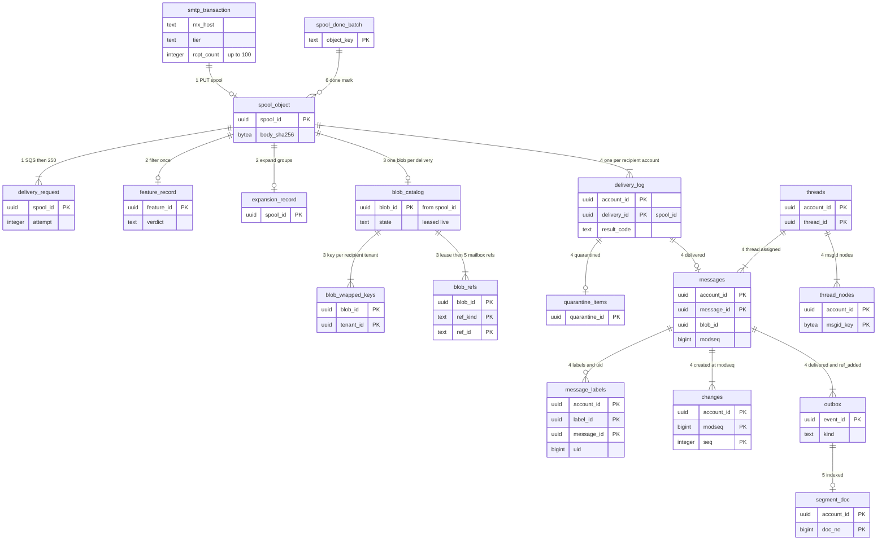

# Data model: Gmail

データモデルの正本。規約、置き場所、全体の ER 図、受信のメッセージの道筋、横断の不変条件、決めたことを、ここに置く。領域ごとの表の目録（列・キー・索引・CHECK・RLS・分割・保持・量）と、Aurora の外の置き場所と形式は [data-model/](data-model/) に置く。

- **列・制約・索引・置き場所・形式の正本は、このファイルと `data-model/` の各ファイル**である。領域の文書は振る舞いの正本で、各文書の「data-model への項目」の節は提案の記録として残す。両者が食い違ったら、このデータモデルに合わせて領域の文書を直す（7 節の直しの一覧）。
- 実装の変更（開発リポジトリの `changes/`）でマイグレーションや形式を変えるときは、同じ PR でここを更新する。移行の順は [delivery.md](delivery.md) の 5 節と [ADR-0069](../decisions/0069-mta-drain-and-shard-schema-waves.md)（広げる → 埋める → 縮める、シャードの波）、形式の番号の順は [ADR-0070](../decisions/0070-format-versions-and-model-rollout.md)（読む側を先に）。
- 方針の元は [ADR-0002](../decisions/0002-accept-then-filter.md)（受け付けてから選別する）、[ADR-0003](../decisions/0003-message-storage-layout-and-dedupe.md)（blob と重複の排除）、[ADR-0004](../decisions/0004-labels-as-primary-mailbox-model.md)（ラベル）、[ADR-0005](../decisions/0005-threading-algorithm.md)（スレッド）、[ADR-0006](../decisions/0006-sync-protocol-jmap-imap-and-modseq.md)（`modseq` と change log）、[ADR-0007](../decisions/0007-tenancy-accounts-orgs-and-rls.md)（テナントと RLS、X1〜X10）、[ADR-0008](../decisions/0008-spam-pipeline-boundary-and-secrecy.md)（区分 C1〜C3）、[ADR-0009](../decisions/0009-search-index-design.md)（索引）、[ADR-0060](../decisions/0060-key-hierarchy-and-crypto-erasure.md)（鍵）。
- 「S1 の量」は、S1（100 万アカウント、受け付け 6,000 万通/日、メールボックスのシャード 8、blob の目録のシャード 4）の**初期見積もり**で、3 年後の値は断って書く。元は [README.md](README.md) の 2 節と [capacity.md](capacity.md)。`mailbox-shard-poc` と E17 の負荷試験で置き換える。
- 保持の期間の多くは**法務の確認待ち（L1・L6）**である。結論まで、表の「保持」は既定の値を書き、[security.md](security.md) の 9 節を正本にする。

2026-10-10 のデータモデルの工程で、索引だった文書を、表の目録と ER 図を持つ正本に書き直した（7 節）。

## 1. ファイルの構成

| ファイル | 領域 | 表 |
| --- | --- | --- |
| [data-model/directory-tenants-and-accounts.md](data-model/directory-tenants-and-accounts.md) | テナント、アカウント、予約と墓標のローカル部、OU と方針、管理の役割、SSO、組織の使用量 | 11 |
| [data-model/domains-groups-and-routing.md](data-model/domains-groups-and-routing.md) | ドメインと確かめと検査、アドレスの名前空間と解決の索引、グループ、本システムのあて先、配送の規則、フッター | 10 |
| [data-model/inbound-spool-and-delivery.md](data-model/inbound-spool-and-delivery.md) | スプールと `SpoolEnvelope`、配送の依頼、終わりの印、展開、**配送の記録 `delivery_log`** | 1 |
| [data-model/outbound-queue-and-reputation.md](data-model/outbound-queue-and-reputation.md) | 送信の依頼と宛先ごとの状態、乗っ取りの点、IP プールとウォームアップ、組、組織の評判、苦情と不達、FBL の引き | 11 |
| [data-model/sender-auth-and-reports.md](data-model/sender-auth-and-reports.md) | DKIM の鍵と出来事、信頼する ARC の封印者、DMARC の報告（受け取り・送り）、TLS-RPT、一括の配信停止 | 7 |
| [data-model/spam-and-scanning.md](data-model/spam-and-scanning.md) | 区分 C1・C2・C3 の置き場所、特徴の記録、評判、学習とサンプル、利用者ごとの寄与と設定、隔離、組織の一覧と方針、緊急の規則、確かなフィッシング、出し方 | 10 |
| [data-model/messages-and-blobs.md](data-model/messages-and-blobs.md) | メッセージの行、容量、blob の目録・包んだ鍵・参照・パック、行の大きさの見積もり | 6 |
| [data-model/mailbox-labels-and-threads.md](data-model/mailbox-labels-and-threads.md) | ラベル、所属と UID、スレッド・節・差出人・ラベルごとの数、キーワード | 7 |
| [data-model/change-log-and-sync.md](data-model/change-log-and-sync.md) | 同期の状態、change log、`VANISHED`、All Mail の UID、送信と `APPEND` の結び、端末、outbox と読み出しの位置、outbox の種類 | 8 |
| [data-model/search-index.md](data-model/search-index.md) | 索引の状態、受け持ち、状態のビットマップ | 2 |
| [data-model/filters-forwarding-and-timers.md](data-model/filters-forwarding-and-timers.md) | フィルター、転送の先、アカウントの設定、不在の返信、時刻の仕事 | 6 |
| [data-model/retention-holds-and-ediscovery.md](data-model/retention-holds-and-ediscovery.md) | 保持の規則、案件・担当・範囲、保留、検索、書き出し、法務の保全、保全の行 | 9 |
| [data-model/accounts-sessions-and-security.md](data-model/accounts-sessions-and-security.md) | 要素、セッション、トークン、端末の認可、サインインの記録、回復、送信の別名、乗っ取りの出来事 | 9 |
| [data-model/api-apps-and-webhooks.md](data-model/api-apps-and-webhooks.md) | OAuth のクライアント、開発者、許可、組織のアプリの方針、`PushSubscription` | 5 |
| [data-model/keys-audit-and-lifecycle.md](data-model/keys-audit-and-lifecycle.md) | TRK・日ごとの KEK・索引の鍵、監査ログと鎖、昇格、シャードと移し替え、DR、IP の範囲と割り当て、事業者の群、スキーマのバージョン | 13 |
| [data-model/stores.md](data-model/stores.md) | Aurora の外：Valkey の鍵、blob v1・パック・セグメント v1・ビットマップ・スプールのバイトの並び、メッセージの行の Protobuf、S3 のバケットとキー、SQS・SNS の形、プッシュの中身、端末の中、JMAP の状態の文字列と ID、IMAP の UID と `MODSEQ` | — |

合計：Aurora の 115 表（別の名前の数）。DB ごとには、directory 80（`public` 51、`xt` 8、`sys` 21）、メールボックスのシャード 34、blob の目録のシャード 5。`outbox`・`outbox_relay_positions`・`schema_versions` は複数の DB にあり、DB ごとに数えた。ER 図は 17 個（領域ごとに 15 個、4 節の全体図 1 個、5 節の受信の道筋 1 個）。形式の構造の図は 3 個（[stores.md](data-model/stores.md) の 2 節）。

## 2. 置き場所

| 置き場所 | 中身 | テナントの分離 | 詳細 |
| --- | --- | --- | --- |
| directory の Aurora PostgreSQL 18（リージョンで 1 つ。大阪に Global Database） | テナント、アカウント、ドメインとアドレス、グループ、規則、方針、サインインとトークン、OAuth、DKIM の鍵、隔離の行、保留と案件、鍵の包み、監査、基盤の表 | `public` は `tenant_id` で FORCE RLS。`xt` は ADR-0007 の RLS の外の一覧。`sys` はテナントのデータを持たない（3.1 節） | 各 `data-model/` |
| メールボックスのシャードの Aurora PostgreSQL 18（S1 で 8。大阪に Global Database） | 受け手ごとのメッセージの行、ラベル、スレッド、change log、送信の依頼、フィルターと設定、保全の行、配送の記録、outbox | `tenant_id`・`account_id` で FORCE RLS。書くのは `mailstore` だけ | 同上 |
| blob の目録のシャードの Aurora PostgreSQL 18（S1 で 4。大阪に Global Database） | blob の場所・状態・包んだ鍵・参照、パック | RLS なし（ADR-0007 の X5）。中身・件名・アドレスを持たない | [messages-and-blobs.md](data-model/messages-and-blobs.md) |
| S3（東京と大阪） | スプール、blob とパック、検索のセグメント、隔離の写し、特徴・評判・モデル、報告、eDiscovery の結果と書き出し | キーに `account_id`・`tenant_id` を含む。blob と索引は 4 段の鍵で暗号化 | [stores.md](data-model/stores.md) の 3 節 |
| S3（別の AWS アカウント） | 学習の行、同意のある報告のサンプル、監査の写し（Object Lock）、見張り | 各アカウントの IAM と KMS | 同 3.8 節 |
| SQS・SNS | 配送の依頼、送信の待ち行列、選別の出来事、outbox の事象、`account-risk` | ID・ハッシュ・数・理由のコードだけ | 同 4 節 |
| Valkey（ElastiCache） | 評判、速さの上限、宛先のキャッシュ、重複の抑え、トークンの写し、描画のキャッシュ、プッシュのまとめ | 鍵に `{account_id}` を含む。失ってよい | 同 1 節 |
| 端末の中 | Web の IndexedDB、モバイルの SQLite | 端末の鍵とサインアウトでの消去 | 同 6 節 |
| AMP・CloudWatch | 指標、ログ、トレース | 許可の型だけ（[ADR-0067](../decisions/0067-content-free-telemetry-schema.md)） | [observability.md](observability.md) |

## 3. 規約

### 3.1 DB とスキーマ

| DB | スキーマ | 中身 | RLS |
| --- | --- | --- | --- |
| directory | `public` | テナントのデータの表（51） | `tenant_id` で FORCE RLS。基盤の行を持つ表（`dkim_keys`・`arc_trusted_sealers`）は `tenant_id IS NULL` の行を誰でも読める |
| directory | `xt` | ADR-0007 の RLS の外の表（8）：`tenants`、`domains`、`address_index`、`sessions`、`oauth_tokens_index`、`device_authorizations`（D-20）、`oauth_clients`、`outbox_relay_positions` | なし。ロールで絞る。メールの中身・件名・ローカル部を持たない |
| directory | `sys` | テナントのデータを持たない表（21）：`reserved_locals`、`retired_locals`、`system_addresses`、`developers`、`ip_pools`、`warmup_daily`、`mx_groups`、`dmarc_out_daily`、`tlsrpt_daily`、`emergency_rules`、`confirmed_phish_urls`、`filter_rollouts`、`search_assignments`、`break_glass_sessions`、`mailbox_shards`、`account_moves`（X8）、`dr_events`、`ip_ranges`、`ip_assignments`、`provider_groups`、`schema_versions` | なし。運用・参照のデータ |
| メールボックスのシャード | `public` | メールボックスの表（32） | `tenant_id`・`account_id` で FORCE RLS |
| メールボックスのシャード | `xt`・`sys` | `outbox_relay_positions`、`schema_versions` | なし |
| blob の目録のシャード | `public` | `blob_catalog`、`blob_wrapped_keys`、`blob_refs`、`packs`、`schema_versions` | なし（X5） |

- CI のスキーマの検査（[ADR-0007](../decisions/0007-tenancy-accounts-orgs-and-rls.md) の Confirmation）は、`public` の全表に `tenant_id`（シャードは `account_id` も）と FORCE RLS とポリシーがあること、`xt` の表がこの一覧と一致すること、`xt`・`sys`・blob の目録の表が C3 の列（件名、本文、ローカル部、表示の名前）を持たないこと、全表が 3.9 節の保持の目録に載ることを確かめる。

### 3.2 ID

| 種類 | 型 | 作り方 | 対象 |
| --- | --- | --- | --- |
| UUIDv7 | `uuid` | PostgreSQL 18 の `uuidv7()`（部品の中では同じ形を作るライブラリ） | `tenant_id`、`account_id`、`message_id`、`thread_id`、`label_id`、`spool_id`、`submission_id`、`blob_id`、ほぼすべての行の ID |
| `blob_id` | `uuid` | `UUIDv7(spool_id の時刻) ＋ spool_id の HMAC の下位`（読み直しで同じ値） | blob |
| 役 `all` の `label_id` | `uuid` | 固定の `00000000-0000-7000-8000-000000000001`（D-9） | 仮想の箱 |
| JMAP・IMAP の ID | `text` | `M`・`T`・`L`・`S`・`B` ＋ base64url（[stores.md](data-model/stores.md) の 7 節）。`EMAILID` は `(message_id, object_gen)` から | 外に出す ID。DB に持たない |
| `modseq` | `bigint` | アカウントで 1 ずつ。切り替えで 2^24 跳ばす | change log、同期 |
| UID | `bigint`（1〜2^32−1） | 箱の `uidnext` から。切り替えで 2^16 跳ばす。再利用しない | IMAP |
| `doc_no` | `bigint`（0〜2^32−1） | アカウントの中の連番 | 検索 |
| 秘密のハッシュ | `bytea`（32） | SHA-256（256 ビットの乱数なので塩なし） | セッション、トークン、確かめのトークンと番号 |
| アドレスの HMAC | `bytea`（32） | テナントのアドレスの鍵の HMAC-SHA256（D-21） | `address_index`、`addr_hmac`、`msgid_hmac`、`recipient_hmac`、`sender_hmac` |
| 中身のハッシュ | `bytea`（32） | SHA-256（照合と破損の検出、スレッドの節。ID と重複の排除に使わない） | `orig_sha256`、`msgid_hash`、`body_sha256` |

### 3.3 テナントと RLS

**メールボックスのシャードの `public` の表**（`tenant_id`・`account_id` を主キーとすべての索引の先頭に置く。例外は 3.4 節の発見の索引だけ）：

```sql
ALTER TABLE <t> ENABLE ROW LEVEL SECURITY;
ALTER TABLE <t> FORCE ROW LEVEL SECURITY;
CREATE POLICY account_rw ON <t> FOR ALL TO mailstore
  USING      (tenant_id = current_setting('app.tenant_id')::uuid
          AND account_id = current_setting('app.account_id')::uuid)
  WITH CHECK (tenant_id = current_setting('app.tenant_id')::uuid
          AND account_id = current_setting('app.account_id')::uuid);
```

- directory の `public` は `tenant_id` だけの同じ形。`current_setting` の `missing_ok` を使わない（設定がなければ失敗する）。
- `app.tenant_id`・`app.account_id` は、受信では受け手（X2）、送信では送信者、利用者の要求では認証の文脈からだけ決める。要求の本文・引数から取らない。
- アプリの DB のロールは表の持ち主でなく、`BYPASSRLS` を持たない（例外は X6 の `relay` の outbox だけ）。
- テナントの表への外部キーは `(tenant_id, account_id, <id>)` の複合で張る（他のアカウントの行を指せない）。directory とシャードの間、シャードと blob の目録の間には張らない（別の DB）。

**テナントをまたぐ経路**（[ADR-0007](../decisions/0007-tenancy-accounts-orgs-and-rls.md) の X1〜X10。一覧にない経路を足すときは先に ADR-0007 を直す）：

| 経路 | 中身 | DB のロール | 触れる表・置き場所 |
| --- | --- | --- | --- |
| X1 | 受信の宛先の解決 | `rcpt_resolver`（`mx-edge`・`inbound-pipeline`） | `domains`、`address_index`（`SELECT`）、Valkey `rcpt:` |
| X2 | 配送。受け手の文脈を設定してから書く | `mailstore` | 受け手のシャードの全表 |
| X3 | 本システムの中の送信の配送（送信者の blob を受け手が参照） | `mailstore` | 受け手のシャード、`blob_refs` |
| X4 | システムの作業（ゴミ箱・迷惑メールの期限、保持の期限と保全の評価し直し、パック、GC、時刻の仕事、ドメインの検査、期限の行の掃除） | `sys_worker` | 3.4 節の発見の索引の列だけを読み、アカウントを 1 つずつ文脈に設定して `mailstore` を呼ぶ |
| X5 | blob の目録の参照の増減 | `blob_ref_applier`・`blob_gc`・`blob_packer` | blob の目録の全表 |
| X6 | relay の outbox の読み出し、SLI の集計 | `relay`（`outbox` の `SELECT` と `UPDATE (relayed_at)` だけ、`BYPASSRLS`）、`sli_reader`（`delivery_log` の分割ごとの数え） | `outbox`、`outbox_relay_positions`、`delivery_log`（数えだけ） |
| X7 | eDiscovery の横断の検索と書き出し（組織の中） | `ediscovery`（署名つきの資格、アカウントごとに文脈を設定） | `preserved_messages`、`messages`、blob、セグメント |
| X8 | シャードの移し替え | `shard_mover` | 移すアカウントの全表、`account_moves` |
| X9 | 苦情の報告の `trace_token` の引き | `report_lookup` | `fbl_trace`（`trace_token` の一致、3 列だけ） |
| X10 | 法務の手順の 1 つのアカウントの保全と書き出し（**法務の L4 まで無効**） | `lawful_access` | `legal_preservations`、そのアカウントの表 |

### 3.4 X4 の発見の索引

X4 の作業は「どのアカウントに期限の来た行があるか」を、アカウントを全部回さずに知る必要がある（1 シャードに 12.5 万アカウント）。`tenant_id`・`account_id` を先頭にしない部分索引を、次の表にだけ置く。`sys_worker` のロールは、その索引の列（ID と期限）だけを `SELECT` でき（列の権限と、そのロールだけのポリシー）、行の中身はアカウントの文脈で `mailstore` が読む（[ADR-0061](../decisions/0061-operator-access-cross-tenant-paths-and-audit.md)。D-27）。

| 表 | 索引 | 作業 |
| --- | --- | --- |
| `messages` | `(trash_at) WHERE trash_at IS NOT NULL`、`(spam_at) WHERE spam_at IS NOT NULL` | ゴミ箱・迷惑メールの 30 日（1 時間ごと） |
| `timers` | `(due_at) WHERE state = 'waiting'` | 時刻の仕事（1 秒ごと） |
| `labels` | `(state) WHERE state = 'deleting'` | ラベルの消去の背景の外し |
| `preserved_messages` | `(retain_until) WHERE … hold_ids が空` | 保全の行の期限 |
| `sent_dedupe` | `(expires_at)` | 24 時間の掃除 |
| `devices` | `(last_seen_at)` | 90 日の掃除 |
| `submission_recipients` | `(first_attempt_at) WHERE state IN ('queued','deferred')` | 毎時の突き合わせ（SQS の欠け） |
| `search_accounts` | `(rebuild_state) WHERE rebuild_state IN ('queued','running')` | 索引の作り直し |
| directory `quarantine_items` | `(expires_at) WHERE state = 'held'` | 隔離の 30 日 |
| directory `exports` | `(expires_at) WHERE state = 'ready'` | 書き出しの 15 日 |
| directory `recovery_requests` | `(wait_until) WHERE state = 'waiting'` | 回復の 72 時間 |
| directory `push_subscriptions` | `(expires_at)` | 購読の期限 |
| directory `accounts`・`tenants` | `(deletion_due_at)`・`(closing_at)` | 消去・解約の期限 |

- 保持の規則の `purge` は、規則の範囲のアカウントの一覧（directory）から回し、`(tenant_id, account_id, received_at)` の索引を文脈の中で使う（発見の索引を要らない）。
- CI はこの一覧の外の、`tenant_id` を先頭にしない索引を拒む。

### 3.5 データの区分と置き場所

[ADR-0008](../decisions/0008-spam-pipeline-boundary-and-secrecy.md) の C1〜C3 と、[security.md](security.md) の 4 節の A1・S。

| 区分 | 例 | 置いてよい場所 | 守り |
| --- | --- | --- | --- |
| C1 接続の情報 | 送り元の IP・ASN、EHLO、TLS、ドメイン、認証の結果、大きさ、時刻 | スプールの封筒、評判のストア、特徴の記録、`delivery_log`（宛先はアドレスの HMAC）、集計の表 | SSE-KMS、Aurora の保存時の暗号化 |
| C2 中身から作った特徴 | URL のドメインとパスのハッシュ、添付のハッシュ、本文の指紋、規則の当たり、点 | 特徴の記録、評判のストア、学習の行、配った後の索引（Valkey）、`confirmed_phish_urls` | 中身に戻せない形。SSE-KMS |
| C3 中身そのもの | 件名、本文、添付、表示の名前、ローカル部、検索の語、フィルターの条件 | スプール、blob、メールボックスのシャードの行、検索のセグメント、隔離の写し、保全の行、eDiscovery の結果と書き出し、展開の記録、同意のある報告のサンプル、Valkey の `render:`（暗号化）、directory の `*_enc` の列 | blob とセグメントは 4 段の鍵、directory の列は列の暗号化、他は SSE-KMS と Aurora の保存時の暗号化。ログ・指標・トレース・SQS・SNS・評判・特徴に出さない |
| A1 アカウントの情報 | 主のアドレス、OU、状態、サインインの記録、回復のメール | directory（回復のメールは列の暗号化） | Aurora の保存時の暗号化 |
| S 秘密 | パスワードのハッシュ、TOTP の種、DKIM の鍵、トークンのハッシュ、webhook の署名の鍵 | directory（包んで・ハッシュで）、Secrets Manager | KMS で包む |

- 宛先・差出人を記録に残すときは、アドレスの HMAC とドメインだけ（`addr_hmac`）。ローカル部を平文で持つのは、メールボックスのシャードの行・スプール・blob・展開の記録・`addresses` の暗号化した列だけ。
- `xt`・`sys`・blob の目録・outbox・SQS・SNS の形は C3 の列・欄を持たない（3.1 節の CI の検査、[ADR-0067](../decisions/0067-content-free-telemetry-schema.md) の許可の型）。

### 3.6 Aurora の外のデータの守り

| 置き場所 | 守り |
| --- | --- |
| スプール | 専用の KMS の鍵の SSE-KMS。読めるのは `inbound-pipeline` と掃除の役だけ。7 日 |
| blob・パック | フレームごとの AES-256-GCM（blob の鍵）＋ SSE-KMS。`blob-packer` は暗号文だけを写す |
| 検索のセグメント・ビットマップ | 1 MiB の塊ごとの AES-256-GCM（セグメントごとに導いた鍵。D-28）＋ SSE-KMS |
| 隔離の写し | テナントの隔離の鍵の SSE-KMS。30 日 |
| 特徴・評判・モデル・報告 | SSE-KMS。C3 を持たない |
| eDiscovery の書き出し | 書き出しごとの鍵（担当に 1 回だけ見せる）＋専用のバケット。15 日 |
| 別のアカウント | IAM で経路を限る。監査は Object Lock |
| Valkey | 失ってよい。保存時と転送中の暗号化。C3 は `render:`（アカウントの鍵で暗号化）だけ |
| SQS・SNS | SSE。ID・ハッシュ・数だけ |
| 端末 | Web は IndexedDB（「保存しない」を選べる）、モバイルは端末の鍵で暗号化した SQLite |

### 3.7 時刻・単位・命名・型

- 時刻は `timestamptz`（UTC で保存）。日の列（`accept_day`・`change_day`・`created_day` など）は日本時間の暦、DMARC の報告は UTC の日。期限は DB の `now()` で決める。
- 列の名前：時刻は `_at`、期限は `expires_at`・`*_until`、日は `_day`・`day`、長さは `_bytes`・`_len`・`_count`。
- 表は英語の複数形の `snake_case`、参照は `<単数形>_id`。状態は `state`（値は小文字の `snake_case`）、列挙は `text` と `CHECK (… IN (…))`（PostgreSQL の enum を使わない。値を足すマイグレーションを広げる段だけにするため）。
- 形の決まった入れ子で検索しないものは `jsonb`（Zod か Rust の型で検証してから書く）。大きく、`mailstore` だけが読む入れ子は Protobuf の `bytea`（`part_tree`、`header_summary`、`view_edits`、`envelope_enc`、`ir`、`actions`）。
- 配列は上限の小さい集合（ラベルの ID、理由のコード、スコープ、権限）だけ。
- 論理の削除の列（`deleted_at` で残す）を持たない。消すものは行を消す。例外は状態で表す墓標（`tenants.state = 'erased'`、`accounts.state = 'deleted'`、`domains.state = 'released'`）。

### 3.8 バージョンと形式の ID

| 値 | 置き場所 | 進め方 | 使い方 |
| --- | --- | --- | --- |
| `spool_version` | スプールのオブジェクトの頭 | 形式の変更で上げる | 読む側を先に。読む側はスプールの寿命（8 日）の間、前のバージョンも読む |
| blob の `format_version` | blob v1 の頭、`blob_catalog` | 同上 | 読む側を外さない（blob は消えるまで残る） |
| パック・セグメント・ビットマップの `format_version` | 各頭 | 同上 | セグメントは全アカウントの作り直しの後に前を外す |
| `analyzer_version` | `search_accounts`、`filters`、セグメント | 語の分け方を変えたら上げて作り直す | 検索とフィルターの語の一致 |
| `threading_version` | `threads` | 件名の正規化の表を変えたら上げる。既存のスレッドに遡らない | スレッド化 |
| `filter_version`・`feature_version` | `messages`、特徴の記録、`filter_rollouts` | 署名した成果物 | 選別の判定と影 |
| `risk_version` | `signin_events`、`account_send_risk.model_version`、`filter_rollouts` | 同上 | 危険度 |
| `schema_version` | 各 DB の `schema_versions`、`mailbox_shards` | 広げる・縮める | スキーマの波 |
| `trk_version` | `tenant_keys`、`tenant_keks`、列の暗号文の頭 | 漏えいの疑いで上げる | 鍵の包み直し |
| `epoch` | `accounts_state` | 大阪への切り替え・戻し | JMAP の状態の文字列 |
| `object_gen` | `messages`、change log | スレッドの合わせ・配った後の編集 | JMAP の Email の ID・`EMAILID`・UID |
| `version`（方針・規則・保留） | `effective_policies`、`routing_rules`、`retention_rules`、`holds` | 変更で 1 上げる | 配送の道のキャッシュの消し |
| 封筒の `v` | SQS・SNS の形 | 読む側を先に | 1 つ前と互換 |

- **判定・形式の規則をフラグにしない。** スレッド化の規則、件名の正規化、blob の形式、`modseq` の進め方はコードのバージョンとして出す（[AGENTS.md](../../AGENTS.md)）。

### 3.9 分割・保持・削除

保持の期間の多くは**法務の確認待ち（L1・L6）**で、下の値は既定（[security.md](security.md) の 9 節）。

| 表 | 置き場所 | 分割（S1） | DB に置く期間 | その後 |
| --- | --- | --- | --- | --- |
| `changes` | シャード | `change_day` の日 | 30 日 | 分割を `DROP`、`floor_modseq` を上げる |
| `imap_vanished` | シャード | `vanished_day` の日 | 30 日 | `DROP` |
| `delivery_log` | シャード | `accept_day` の日 | 90 日（L1・L6） | `DROP` |
| `outbox` | シャード・directory | `created_day` の日 | 全部送って 1 日 | `DROP` |
| `fbl_trace` | directory | `created_day` の日 | 90 日 | `DROP` |
| `dmarc_out_daily` | directory | `day` の日 | 30 日 | `DROP` |
| `signin_events` | directory | `at` の月 | 180 日（L1・L6） | `DROP` |
| `audit_events` | directory | `at` の月 | 13 か月。S3 に 7 年（L6・L7） | `DROP` |
| `account_risk_events` | directory | `at` の月 | 2 年（L6） | `DROP` |
| `dmarc_report_rows`・`tlsrpt_daily`・`complaints_daily`・`bounces_daily` | directory | 日・月 | 13 か月 | `DROP` |
| 分割しない表 | — | — | 各表の「保持」 | X4 の作業（3.4 節） |

- 分割した表の主キーと一意の制約は分割の鍵を含める。分割した表へは外部キーを張らない（論理の参照）。分割は `pg_partman` で先に作る（日 14 個、月 3 個）。
- 重複の除きの一意が要る表は、分割の鍵が読み直しで同じ値になる形にする（`delivery_log.accept_day` は `delivery_id` の時刻から決める。D-1）。
- **追記だけの表**：`changes`、`imap_vanished`、`delivery_log`、`audit_events`、`signin_events`、`account_risk_events`、`dkim_key_events`、`filter_rollouts`。ロールに UPDATE を与えないか、トリガーで拒む。
- **消去の順**（[ADR-0031](../decisions/0031-blob-references-gc-and-quota.md)・[ADR-0060](../decisions/0060-key-hierarchy-and-crypto-erasure.md)）：メッセージの行を消す（保留・規則に当たれば保全の行へ移す）→ outbox で参照を外す → 参照 0 から 1 時間の確かめ → 包んだ鍵を消す（24 時間以内。NFR-015）→ 7 日の後に S3 のオブジェクトを消すかパックの詰め直しで落とす → S3 のバージョンと大阪の写しは 30 日（L6）→ Aurora のバックアップは 35 日。テナントの消去は TRK を消す（保留・保全・`archived` があれば止める）。

### 3.10 暗号化

[ADR-0060](../decisions/0060-key-hierarchy-and-crypto-erasure.md)、[security.md](security.md) の 5 節、[stores.md](data-model/stores.md) の 2.2 節。

| 鍵 | 使う場所 |
| --- | --- |
| KMS `tenant-root`（用途・リージョンごと） | TRK を包む。`Decrypt` は `mailstore`・`search-indexer`・`search-node`・`ediscovery-exporter`・`accounts` のタスクのロールだけ |
| TRK（テナントごと） | 日ごとの KEK を包む、列の暗号化の鍵を導く |
| 日ごとの KEK | blob の鍵、アカウントの索引の鍵を包む |
| blob の鍵（blob ごと） | blob v1 のフレーム |
| アカウントの索引の鍵（四半期ごと） | セグメントの鍵を導く（D-28） |
| KMS `address-index` → アドレスの鍵（テナントごと） | アドレスの HMAC（D-21。`mx-edge` が `Decrypt` を要る） |
| KMS `spool`・`quarantine`・`exports`・`audit`・`dkim`・`secrets` | スプール、隔離、書き出し、監査の署名、DKIM の秘密の鍵、その他の秘密 |

**列の暗号化**（`*_enc`。TRK から HKDF で導いた鍵、AES-256-GCM、AAD は `tenant_id`・表・列・行の主キー）：

| 表 | 列 |
| --- | --- |
| `accounts` | `display_name_enc` |
| `addresses` | `local_display_enc` |
| `group_members` | `external_address_enc` |
| `idp_configs` | `client_secret_enc` |
| `credentials` | `totp_secret_enc` |
| `recovery_methods` | `address_enc` |
| `send_as_identities` | `address_enc`、`display_name_enc` |
| `push_subscriptions` | `url_enc`、`signing_key_enc` |
| `matters` | `name_enc` |
| `holds`・`matter_searches` | `ir_enc`（案件の鍵） |
| `audit_events` | `detail_enc`（組織・案件の鍵） |
| シャード `submissions` | `envelope_enc`（D-31） |
| シャード `devices` | `token_enc` |
| `developers`（本システムの鍵） | `legal_name_enc`、`contact_enc` |

## 4. 全体の ER 図

領域をまたぐ主な関係だけを描く。列は主キーと主な列だけで、詳細は各領域の図にある。

- directory・メールボックスのシャード・blob の目録の間の線（`accounts` → `messages`、`messages` → `blob_catalog` など）は、別の DB をまたぐ論理の参照で、外部キーを張らない。
- 子の側の参照の列が NULL を許すもの（任意の参照）も `||--o{` で描き、各領域の図の注記で「任意」と書く（Mermaid の書き方を 5 つの形に限るため）。

```mermaid
erDiagram
    tenants ||--|{ accounts : "owns"
    tenants ||--o{ domains : "owns"
    domains ||--o{ addresses : "namespace"
    addresses ||--o| address_index : "projected (X1)"
    accounts ||--o{ addresses : "target"
    tenants ||--o{ groups : "owns"
    mailbox_shards ||--o{ accounts : "hosts"
    accounts ||--o| accounts_state : "modseq (shard)"
    accounts ||--o{ messages : "receives (shard)"
    accounts ||--|{ labels : "labels (shard)"
    labels ||--o{ message_labels : "contains"
    messages ||--o{ message_labels : "member of"
    threads ||--|{ messages : "groups"
    accounts_state ||--o{ changes : "change log"
    accounts ||--o{ delivery_log : "delivery record (shard)"
    delivery_log ||--o| messages : "delivered"
    blob_catalog ||--o{ messages : "body (cross DB)"
    blob_catalog ||--o{ blob_refs : "refs"
    blob_catalog ||--|{ blob_wrapped_keys : "keys per tenant"
    tenant_keys ||--o{ tenant_keks : "daily KEK"
    tenant_keks ||--o{ blob_wrapped_keys : "wraps (cross DB)"
    accounts ||--o{ submissions : "sends (shard)"
    submissions ||--|{ submission_recipients : "per recipient"
    accounts ||--o{ preserved_messages : "preserved (shard)"
    tenants ||--o{ matters : "cases"
    matters ||--o{ holds : "holds"
    accounts ||--o| search_accounts : "index (shard)"
    accounts ||--o{ timers : "due jobs (shard)"
    accounts ||--o{ filters : "filters (shard)"
    tenants ||--o{ quarantine_items : "quarantine"
    oauth_clients ||--o{ oauth_tokens_index : "tokens"
    accounts ||--o{ sessions : "sessions"
    tenants ||--o{ audit_events : "audit chain"
    tenants ||--o{ dkim_keys : "signing keys"

    tenants {
        uuid tenant_id PK
        text kind "org personal"
        text state
    }
    accounts {
        uuid tenant_id PK
        uuid account_id PK
        text mailbox_shard FK
        text state
        text risk_state
    }
    domains {
        uuid domain_id PK
        text name UK
        uuid tenant_id FK
    }
    addresses {
        uuid tenant_id PK
        uuid address_id PK
        uuid domain_id FK
        bytea local_norm_hmac
    }
    address_index {
        uuid domain_id PK
        bytea local_norm_hmac PK
        uuid target_id
    }
    groups {
        uuid tenant_id PK
        uuid group_id PK
    }
    mailbox_shards {
        text shard_id PK
    }
    accounts_state {
        uuid tenant_id PK
        uuid account_id PK
        bigint modseq
        integer epoch
    }
    messages {
        uuid tenant_id PK
        uuid account_id PK
        uuid message_id PK
        integer object_gen
        uuid thread_id FK
        uuid blob_id
    }
    labels {
        uuid tenant_id PK
        uuid account_id PK
        uuid label_id PK
    }
    message_labels {
        uuid tenant_id PK
        uuid account_id PK
        uuid label_id PK
        uuid message_id PK
        bigint uid UK
    }
    threads {
        uuid tenant_id PK
        uuid account_id PK
        uuid thread_id PK
    }
    changes {
        uuid tenant_id PK
        uuid account_id PK
        bigint modseq PK
        integer seq PK
    }
    delivery_log {
        uuid tenant_id PK
        uuid account_id PK
        date accept_day PK
        uuid delivery_id PK
    }
    blob_catalog {
        uuid blob_id PK
        text state
    }
    blob_refs {
        uuid blob_id PK
        text ref_kind PK
        text ref_id PK
    }
    blob_wrapped_keys {
        uuid blob_id PK
        uuid tenant_id PK
    }
    tenant_keys {
        uuid tenant_id PK
    }
    tenant_keks {
        uuid tenant_id PK
        uuid kek_id PK
    }
    submissions {
        uuid tenant_id PK
        uuid account_id PK
        uuid submission_id PK
    }
    submission_recipients {
        uuid tenant_id PK
        uuid account_id PK
        uuid submission_id PK
        bytea recipient_hmac PK
    }
    preserved_messages {
        uuid tenant_id PK
        uuid account_id PK
        uuid message_id PK
    }
    matters {
        uuid tenant_id PK
        uuid matter_id PK
    }
    holds {
        uuid tenant_id PK
        uuid hold_id PK
    }
    search_accounts {
        uuid tenant_id PK
        uuid account_id PK
    }
    timers {
        uuid tenant_id PK
        uuid account_id PK
        uuid timer_id PK
    }
    filters {
        uuid tenant_id PK
        uuid account_id PK
        uuid filter_id PK
    }
    quarantine_items {
        uuid tenant_id PK
        uuid quarantine_id PK
    }
    oauth_clients {
        text client_id PK
    }
    oauth_tokens_index {
        bytea token_hash PK
    }
    sessions {
        bytea session_hash PK
    }
    audit_events {
        uuid tenant_id PK
        text stream PK
        bigint seq PK
    }
    dkim_keys {
        uuid key_id PK
        uuid tenant_id FK
    }
```



- `accounts ||--o| accounts_state`・`accounts ||--o| search_accounts`：アカウントの作成で、シャードに 1 行ずつ作る（別の DB なので、作成の作業が冪等に両方を作る。作成の途中だけ 0）。1 対 1 の関係は、Mermaid の書き方を 5 つの形に限るため `||--o|` で描く。
- `delivery_log ||--o| messages`：`result_code = delivered` のときだけ。

## 5. 受信のメッセージの道筋

SMTP の受け付けから、スプール、選別、N 人の受け手への配送、blob、受け手ごとのメッセージの行・ラベル・スレッド・change log・索引までを、どの単位でいくつできるかの概念の図にする。線の名前の番号は 5.1 節の段。



- `spool_object ||--|{ delivery_request`：掃除の役の載せ直しで 2 つ以上になりうる（配送は冪等）。`smtp_transaction ||--o| spool_object`・`spool_object ||--o| blob_catalog`：DATA の前に拒んだトランザクションはスプールを持たず、全員が隔離・拒みの配送は blob を作らない。
- `spool_object ||--|{ delivery_log`：受け付けた宛先は 1 つ以上。宛先 1 つが 0（投稿の許可の外は `group_not_permitted` の行）か 1 つのアカウント、グループは展開で多くのアカウントになる。同じアカウントは 1 行。
- `blob_catalog ||--|{ blob_wrapped_keys`：同じ配送の受け手のテナントの数だけ（組織の外の宛先を含む配送で 2 つ以上）。
- `messages ||--o{ message_labels`：フィルターでアーカイブしたメッセージはラベルを持たない（役 `all` にだけ見える）。

### 5.1 段とトランザクション

| 段 | 部品とトランザクション | 書くもの | 守るもの |
| --- | --- | --- | --- |
| 1 受け付け | `mx-edge`（DB を書かない） | スプールのオブジェクト（S3）→ 配送の依頼（SQS）→ 250。拒めば `spool-rejected` の束 | 250 はスプールと依頼の両方の確定の後（[ADR-0002](../decisions/0002-accept-then-filter.md)、[ADR-0011](../decisions/0011-spool-commit-and-sweeper.md)）。確定の予算 5 秒で 451 |
| 2 選別と展開 | `inbound-pipeline`・`spam-scorer`・`content-scanner`（DB を書かない） | 特徴の記録（S3、C1・C2）、展開の記録（S3）、再送の重複の印（Valkey） | 選別は配送ごとに 1 回。C3 はメモリーの中だけ |
| 3 blob | `inbound-pipeline` → blob の目録のシャード（1 つのトランザクション）→ S3 | `blob_catalog`（`leased`）、`blob_wrapped_keys`（受け手のテナントごと）、`blob_refs`（`lease`）→ `blobs/…` に PUT | `blob_id` は `spool_id` から決まり、作成も PUT も冪等 |
| 4 配送 | `mailstore.deliver`、受け手のシャードの 1 つのトランザクション（受け手ごと） | `delivery_log`（`ON CONFLICT DO NOTHING`。0 行なら終わり）→ `accounts_state`（`FOR UPDATE`、`modseq` を進める）→ スレッド（候補を `thread_id` の順に `FOR UPDATE`、合わせ）→ `messages` → `message_labels`（UID を振る）・`labels` の件数・`thread_labels` → `all_mail_uids` → `account_usage` → `changes` → `outbox`（`account.changed`、`message.delivered`、`blob.ref_added`） | 冪等（`(delivery_id, account_id)`）、受け手の文脈で書く（X2）、`modseq` の単調、迷惑メールとゴミ箱の排他、`threadId` を変えない |
| 隔離 | 4 の代わりに directory の `quarantine_items` と S3 `quarantine/…`、その後シャードの `delivery_log`（`quarantined`） | | 写しが確定するまで終わりの印を書かない |
| 5 後追い | outbox → `blob-ref-applier`（`blob_refs` の `mailbox`）、`search-indexer` → `search-node`（小さなセグメント、`doc_no`）、`push-gateway`・`push-notifier` | | 参照は行の挿入で冪等。索引は p95 10 秒 |
| 6 終わり | `inbound-pipeline` | すべての受け手が終わったら `spool-done` の束（10 秒か 1,000 件）、`lease` を外す（全受け手の `mailbox` の参照が届いた後）、SQS のメッセージを消す | 束を書く前に止まったら読み直しか掃除の役が載せ直す。配送は冪等 |

## 6. 横断の不変条件

| 不変条件 | 守り方（DB・形式・試験） | 根拠 |
| --- | --- | --- |
| **250 はスプールと待ち行列の確定の後だけ** | `mx-edge` のステートマシン：PUT（`x-amz-checksum-sha256`）と SQS の送信の両方の成功の後に 250、確定の予算 5 秒で 451。submission も `mailstore` の確定の後に 250 | [ADR-0002](../decisions/0002-accept-then-filter.md)、[ADR-0011](../decisions/0011-spool-commit-and-sweeper.md) |
| **受け付けたメッセージを失わない** | 掃除の役（5 分ごと、`spool/` と `spool-done`・`spool-rejected` の束の突き合わせ）、DLQ を消さない、毎時の突き合わせ（1 時間で印のないもの 1 件で SEV1 の候補）、隔離の写しの前に終わりの印を書かない、大阪での配り直し（失うより重複）。PROP-CAP-001 | [ADR-0011](../decisions/0011-spool-commit-and-sweeper.md)、[ADR-0064](../decisions/0064-storage-classes-and-region-replication.md) |
| **配送は受け手ごとに 1 回** | `delivery_log` の PK `(tenant_id, account_id, accept_day, delivery_id)` と `ON CONFLICT DO NOTHING`。`accept_day` は `delivery_id` から決まる。保持 90 日 ≥ スプールの寿命 | [ADR-0002](../decisions/0002-accept-then-filter.md)、[ADR-0051](../decisions/0051-address-groups-expansion-and-loop-prevention.md) |
| **受け付けた後に迷惑メールで送り返さない** | DSN を作るのは `delivery_log.result_code = dsn_created`（配送の不能）だけ。選別の判定から DSN の経路がない（PROP-FLT-003） | [ADR-0002](../decisions/0002-accept-then-filter.md) |
| **blob のバイトは変わらない。配る形は読む時に当てる** | blob v1 は不変（nonce の決め方が不変に依る）。編集は `messages.view_edits` だけ。配った後の編集は `object_gen` を進める | [ADR-0003](../decisions/0003-message-storage-layout-and-dedupe.md)、[ADR-0030](../decisions/0030-blob-format-v1-and-envelope-keys.md)、[ADR-0032](../decisions/0032-served-view-edits.md) |
| **重複の排除は 1 つの配送の中だけ** | `blob_id` は `spool_id`・`submission_id` から決まり、中身のハッシュで引く索引を持たない（`orig_sha256` に索引を張らない。CI）。`dup:` は同じアカウントの再送の抑えで blob を共有しない | [ADR-0003](../decisions/0003-message-storage-layout-and-dedupe.md) |
| **blob は参照が 0 になってから消す。参照 0 は戻らない** | `blob_refs` の行の集合、lease は全受け手の参照の後に外す、`zero` から 1 時間の確かめ（元の行があれば参照を足し直して警報）、鍵の破棄は 24 時間以内、物理の消去は 7 日の後 | [ADR-0031](../decisions/0031-blob-references-gc-and-quota.md) |
| **迷惑メールとゴミ箱は排他** | `messages` の CHECK `NOT (trash_at IS NOT NULL AND spam_at IS NOT NULL)`、`message_labels` のトリガー、`apply_label_op`（DT-MBX の行 7・9）だけが所属を変える | [ADR-0004](../decisions/0004-labels-as-primary-mailbox-model.md)、[ADR-0033](../decisions/0033-label-operations-decision-table.md) |
| **`threadId` は変わらない（移すときは消して作り直す）** | 合わせで移るメッセージは `object_gen` を進め、change log に古い世代の `destroyed` と新しい世代の `created`（`regenerated`）。スレッドは自動で分けない | [ADR-0005](../decisions/0005-threading-algorithm.md)、[ADR-0034](../decisions/0034-threading-implementation-and-merge.md) |
| **`modseq` はアカウントで単調に増える** | `accounts_state` を `FOR UPDATE` で取って 1 進める。下げる更新を拒むトリガー。切り替えで `epoch` を進めて 2^24 跳ばす。箱の `highest_modseq`・`uidnext` も下げない | [ADR-0006](../decisions/0006-sync-protocol-jmap-imap-and-modseq.md)、[ADR-0039](../decisions/0039-change-log-states-and-jmap-changes.md) |
| **メールボックスの状態は `mailstore` だけが書き、同じトランザクションで change log と outbox を書く** | シャードの表の書き込みの権限は `mailstore` のロールだけ。変更の関数は `modseq`・`changes`・`outbox` を書かないとコミットできない（試験と lint） | [ADR-0006](../decisions/0006-sync-protocol-jmap-imap-and-modseq.md) |
| **IMAP の UID は戻さない** | `message_labels` の UK `(…, label_id, uid)`、`uidnext` を下げないトリガー、失った UID は `imap_vanished` | [ADR-0006](../decisions/0006-sync-protocol-jmap-imap-and-modseq.md)、[ADR-0040](../decisions/0040-imap-label-mailbox-mapping.md) |
| **保留は消去と鍵の破棄に勝つ** | 消すすべての経路で `retention_decision`（保全なら `preserved_messages` へ移し `hold` の参照）、directory が読めなければ消さない、TRK・KEK の破棄の前に `holds`・`preserved_messages`・`legal_preservations`・`archived` を数えて `erasure_blocked` | [ADR-0053](../decisions/0053-retention-rules-holds-and-preservation.md)、[ADR-0060](../decisions/0060-key-hierarchy-and-crypto-erasure.md) |
| **保留は利用者に見えない** | `preserved` の印の `destroyed` は JMAP・IMAP・プッシュに普通の削除として出し、`preserved_purged` は型ごとの `modseq` と `highest_modseq` を進めない。`PRESERVED` は X7 の資格の検索だけ | [ADR-0053](../decisions/0053-retention-rules-holds-and-preservation.md)、[ADR-0054](../decisions/0054-ediscovery-matters-search-export-and-audit.md) |
| **他のアカウントのメールが見えない** | 3.3 節の FORCE RLS、複合の外部キー、キー・鍵の先頭の `account_id`、セグメントの頭の `account_id` の照合、RLS の外の表に C3 を持たない（CI） | [ADR-0007](../decisions/0007-tenancy-accounts-orgs-and-rls.md) |
| **テナントをまたぐ経路は X1〜X10 だけ** | 3.3 節のロールの一覧を CI が DB のロールと照らす（PROP-SEC-005） | [ADR-0007](../decisions/0007-tenancy-accounts-orgs-and-rls.md)、[ADR-0061](../decisions/0061-operator-access-cross-tenant-paths-and-audit.md) |
| **運用者は中身を読めない** | 昇格のロールにシャードの表の `SELECT`、blob・スプール・索引の `GetObject`、`tenant-root` の `Decrypt` を与えない（PROP-SEC-004） | [ADR-0061](../decisions/0061-operator-access-cross-tenant-paths-and-audit.md) |
| **C3 をテレメトリーに出さない** | 計装の関数は許可の型だけを受ける。outbox・SQS・SNS の形の検査、毎日のログの走査（1 件で `content-in-logs`）。`addr_hmac` だけ | [ADR-0008](../decisions/0008-spam-pipeline-boundary-and-secrecy.md)、[ADR-0067](../decisions/0067-content-free-telemetry-schema.md) |
| **学習に同意のない C3 を使わない** | 学習のアカウントへの書き込みは学習の行の送り出しとサンプルの書き込みだけ（IAM）。特徴の記録にアカウントの ID・アドレス・件名を持たない | [ADR-0008](../decisions/0008-spam-pipeline-boundary-and-secrecy.md)、[ADR-0024](../decisions/0024-feedback-training-data-and-model-release.md) |
| **送信は関門を通る** | `submissions.state` の遷移（`pending` → `releasing` → `released`）は関門の後だけ。`delivery_job` を作るのは `outbound-gate` だけ | [ADR-0021](../decisions/0021-sending-limits-and-compromised-account-detection.md) |
| **送信の取り消しと解放はどちらか一方** | `UPDATE submissions … WHERE state = 'pending'` の条件つきの更新で競う | [ADR-0049](../decisions/0049-timed-jobs-vacation-and-scheduled-send.md) |
| **監査は欠けず、書き換えられない** | 操作と同じトランザクション、`audit_chain_heads` で直列、INSERT だけ、Object Lock の写しと毎日の突き合わせ（PROP-SEC-003） | [ADR-0061](../decisions/0061-operator-access-cross-tenant-paths-and-audit.md) |
| **nonce を重ねない** | blob は blob ごとの鍵とフレームの番号、セグメントはセグメントごとに導いた鍵と塊の番号、列の暗号化は乱数の nonce | [ADR-0030](../decisions/0030-blob-format-v1-and-envelope-keys.md)、[ADR-0037](../decisions/0037-segment-format-and-query-execution.md) |

## 7. この工程で決めたこと（2026-10-10）

領域の文書と ADR の間で、名前・列・置き場所が決まっていなかったところを、推奨の案で決めた。ADR の決定は変えていない。ADR に注記を足した 2 件（D-20 は [ADR-0007](../decisions/0007-tenancy-accounts-orgs-and-rls.md)、D-21 は [ADR-0060](../decisions/0060-key-hierarchy-and-crypto-erasure.md)）と、置き場所の未解決事項だった D-1、量の見直しの D-22 は、[README.md](README.md) の 6 節の「決定（2026-10-10、データモデル）」に書いた。

| # | 決めたこと | 理由 |
| --- | --- | --- |
| D-1 | `delivery_log` を directory でなく受け手のメールボックスのシャードに置き、配送と同じトランザクションで書く。配送の冪等の正本を兼ね、PK に `delivery_id` の時刻から決まる `accept_day` を含める。90 日 | 1 日 7,200 万行・90 日 1.3〜1.5 TB を directory に足さない。書き込みはシャードで分かれ、配送の行が 8 から 9 に増えるだけ。RLS の外の表を増やさない。メッセージを消しても読み直しで再び配らない |
| D-2 | `messages` の中心の列（`origin`、`delivery_id`、`subject`、`from_addr`、`header_summary`、`msgid_hash`、`sent_at`、`unsubscribe_kind`、`attachment_blocked`）を決めた | 領域の文書は足す列だけを持ち、本体の列がなかった |
| D-3 | `message_labels` の `modseq` は所属の最後の変更（ADR-0004 の `added_modseq`）。`received_at` の写しを持つ | 箱の `MODSEQ`、所属ごとの `\Deleted`、箱の一覧の並び |
| D-4 | `tenant_keks` の列は [security.md](security.md) の 13 節を正にした（`kek_id`、`day`、`kek_wrapped`、`trk_version`） | message-parsing-and-storage.md の行が KMS で包む古い形だった（ADR-0030 の注記） |
| D-5 | `unsubscribe_actions` の列は [sender-authentication.md](sender-authentication.md) を正にした（`sender_domain`、`method`、`result`、`created_at`）。PK は web-client.md の `(tenant_id, account_id, message_id)` | 2 つの文書で列が違った |
| D-6 | attachment-and-url-scanning.md の `image_settings` を `account_settings.external_images` にまとめた | 同じ値が 2 つの表にあった |
| D-7 | `org_usage` はシャードごとの行で、組織の量はその和（数え直しの上書き） | 足し引きは重複と欠けでずれる |
| D-8 | `delivery_log.delivery_id`（`spool_id` か `submission_id`）と `delivery_kind` | 本システムの中の送信の受け手も同じ冪等の表で扱う |
| D-9 | JMAP・IMAP の ID の形、役 `all` の固定の `label_id`（[stores.md](data-model/stores.md) の 7 節） | `imap_vanished` が「固定の ID」を求めていた。外に出す ID の形を 1 つにする |
| D-10 | outbox はどの DB も同じ形（`created_day` の日の分割、`lane` 16 本）。`outbox_relay_positions` は `(db_id, lane)` | ADR-0007 の「outbox の読み出しの位置」を表にし、アカウントの順を保つ |
| D-11 | DMARC の `rua` の `org_token` は、テナントの ID を本システムの鍵で AES-SIV にした値。表で引かない | 組織の ID を推し量らせず、RLS の外の引きの表を足さない |
| D-12 | 報告のサンプルの目録は S3 の `index.json`（DB にしない）。本人の取り消しのため、シャードに `sample_submissions`（30 日） | サンプルのアカウントに DB の部品を足さない |
| D-13 | 置き場所のなかった表を最小の形で足した：`sso_links`、`matter_searches`、`audit_chain_heads`、`outbox`、`outbox_relay_positions`、`sample_submissions`。名前だけあった `org_sending_settings`・`system_addresses`・`provider_groups`・`legal_preservations`（枠）の列を決めた | 振る舞いが参照するが、表がなかった |
| D-14 | directory を `public`（RLS）・`xt`（ADR-0007 の RLS の外）・`sys`（テナントのデータを持たない）に分けた（3.1 節） | CI で RLS の外の一覧と照らせるようにする |
| D-15 | `imap_vanished` は日の分割、PK に `vanished_day` を含める | 30 日の保持を `DROP` で行う |
| D-16 | `domain_checks` は項目ごとの最新の 1 行 | 履歴は監査と指標。書き込みの多い表を小さくする |
| D-17 | `complaints_daily`・`bounces_daily` はテナントの行（FORCE RLS）。プール・IP の率は AMP の指標で見る | テナントをまたぐ引きを作らない（X の一覧を増やさない） |
| D-18 | `dkim_keys`・`arc_trusted_sealers` の基盤の行は `tenant_id IS NULL` で、誰の文脈でも読める。`outbound-gate` は送信者のテナントの文脈で鍵を引く | 起動で全テナントの鍵を読むと、一覧にない横断の読みになる |
| D-19 | 隔離への置き換え（`filter.quarantine_map`）と暗号化された書庫（`scan.encrypted_archive`）は `ou_policies`。`org_filter_policy` は受け手への要約、`org_attachment_policy` は足して止める形式だけ | OU の方針の一覧と 2 つの表に同じ値があった |
| D-20 | `device_authorizations` を RLS の外（`xt`）に置き、ADR-0007 の「トークンのハッシュ → アカウント」の区分として扱う | 承認の前はアカウントが決まらず、`tenant_id` の RLS に置けない。[ADR-0007](../decisions/0007-tenancy-accounts-orgs-and-rls.md) に 2026-10-10 の注記を足した |
| D-21 | アドレスの HMAC の鍵は、テナントごとのアドレスの鍵を KMS の `address-index` の鍵で包んで `tenant_keys.addr_key_wrapped` に置く。`mx-edge`・`inbound-pipeline`・`accounts`・`admin-api`・`report-ingest` が `Decrypt` できる | `mx-edge` は RCPT のたびに「テナントの鍵の HMAC」（ADR-0013）を要るが、TRK の `Decrypt` は許されていない。[ADR-0060](../decisions/0060-key-hierarchy-and-crypto-erasure.md) に 2026-10-10 の注記を足した（`mx-edge` の `Decrypt` は `address-index` の鍵だけ） |
| D-22 | メッセージの行の大きさを列から見積もり直した（1 行と索引で約 2.3 KB、3 年後のメタデータ約 78 TB）。capacity.md・README.md の 2 節と費用をこの値に直した（Aurora の保存 3 年目 月 約 3.3 万 USD 増） | シャードの数と行を小さくする手段は未解決に残す（9 節） |
| D-23 | change log の `flags_changed` のビット（bit0 `seen`、bit1 キーワード、bit2 `imap_deleted`、bit3 スヌーズ、bit4 ミュート、bit5 `preserved`） | `preserved` の印の置き場所を決める |
| D-24 | 分割する表と期間（3.9 節） | 大きな表の保持を `DROP` で行う |
| D-25 | `preserved_messages` の列の名前を `messages` に合わせた（`prefix_headers`、`size_logical`）。`thread_id`・`header_summary`・`view_edits`・`part_tree` を足した | eDiscovery の要約と書き出しの編集の表 |
| D-26 | `filters`・`forward_targets`・`send_as_identities`・`recovery_methods`・`credentials`・`oauth_grants` の状態に `suspended_pending_review` を足した | ADR-0057 の `locked` の段 3 の置き場所 |
| D-27 | X4 の発見の索引の一覧（3.4 節） | アカウントを全部回さずに期限の行を見つける。行の中身はアカウントの文脈で読む |
| D-28 | 検索のセグメントの鍵を、アカウントの索引の鍵から `segment_id` ごとに HKDF で導く。ビットマップも同じ | 四半期に 1 つの鍵で多くのセグメントを塊の番号の nonce で暗号化すると、nonce が重なる |
| D-29 | パックの末尾 64 バイトの形、スプールのオブジェクトの頭の形と、8 MiB を超えるときのマルチパートの部分の順（[stores.md](data-model/stores.md) の 2.3・3.1 節） | 領域の文書は中身だけを決めていた。マルチパートは最後を除く部分が 5 MiB 以上を要る |
| D-30 | `tenants` を RLS の外に置き、公開の属性（種類、状態、組織の名前、主のドメイン、`smtp_policy_class`、リージョン）だけを持たせた | ADR-0007 の「`tenants` の公開の属性」 |
| D-31 | 送信の宛先のアドレスの平文は `submissions.envelope_enc`（列の暗号化）だけに持ち、`mta-out` は送る時に `mailstore` から読む。`submission_recipients` と `delivery_job` は HMAC とドメイン | 「宛先は送信の blob にある」は Bcc と封筒の宛先を表せない。SQS に C3 を入れない |

領域の文書の直し（この工程）：

| 文書 | 直したこと |
| --- | --- |
| [message-parsing-and-storage.md](message-parsing-and-storage.md) | 7.1 節の頭の大きさの例（104 → 108 バイト）、7.2 節の鍵の図（TRK と日ごとの KEK の 4 段に）、12 節の `blob_catalog`（`stored_offset`、`pack_id`）・`tenant_keks`（security.md の列）の行（D-4） |
| [web-client.md](web-client.md) | 14 節の `unsubscribe_actions` の行を sender-authentication.md の列に（D-5） |
| [attachment-and-url-scanning.md](attachment-and-url-scanning.md) | 11 節の `image_settings`（`account_settings.external_images` に）と `org_attachment_policy`（`extra_block_types`。D-6、D-19） |
| [spam-and-abuse-filtering.md](spam-and-abuse-filtering.md) | 18 節の `sender_affinity`（`sender_key`、`contacted`）、`filter_settings`（`training_consent`）、`org_filter_policy`（D-19）、`sample_index`（D-12）の行 |
| [retention-and-ediscovery.md](retention-and-ediscovery.md) | 4.4 節の `preserved_messages` の列の名前と `org_usage.preserved_bytes`（D-7、D-25）、12 節の `matter_searches` の行（D-13） |
| [observability.md](observability.md) | 9・11 節の `delivery_log` の置き場所と列（D-1、D-8） |
| [client-sync-and-protocols.md](client-sync-and-protocols.md) | 12 節の `submissions.envelope_enc`（D-31） |
| [outbound-smtp-and-reputation.md](outbound-smtp-and-reputation.md) | 15 節の `submission_recipients` の宛先のアドレスの置き場所（D-31） |
| [filters-forwarding-and-automation.md](filters-forwarding-and-automation.md) | 10 節の `forward_targets`・`filters` の状態（D-26） |
| [accounts-and-security.md](accounts-and-security.md) | 13 節の `device_authorizations` を RLS の外に（D-20） |
| [security.md](security.md) | 5.2 節の図と 5.4 節にアドレスの鍵、13 節の `tenant_keys` と `audit_chain_heads` の行（D-13、D-21） |
| ADR の注記 | [ADR-0007](../decisions/0007-tenancy-accounts-orgs-and-rls.md)（`device_authorizations`。D-20）、[ADR-0060](../decisions/0060-key-hierarchy-and-crypto-erasure.md)（アドレスの鍵。D-21）。決定は変えていない |
| [capacity.md](capacity.md) | 4 節に配送の記録の行とシャードの書き込みの行の数（8 → 9）。1.3 節・4 節のメタデータの量（16 TB → 約 78 TB）、8 節の Aurora の保存と合計、8.1 節の積み上げ、9 節の単位の原価（D-1、D-22） |
| [README.md](README.md) | 冒頭と 7 節の data-model の行。2 節・2.1 節のメタデータの量と費用。6 節に「決定（2026-10-10、データモデル）」、費用の行の補い、残る未解決事項の行の置き換え |
| [infrastructure.md](infrastructure.md) | 9 節のメールボックス 1 つ・月の原価（0.19・0.21 → 0.20・0.24 USD。D-22） |
| 「data-model への項目」の節を持つ 14 本（inbound-smtp、sender-authentication、outbound-smtp-and-reputation、spam-and-abuse-filtering、attachment-and-url-scanning、message-parsing-and-storage、organizations-domains-and-routing、retention-and-ediscovery、accounts-and-security、api-and-integrations、security、infrastructure、observability、delivery） | 節の頭の「この表が列の正本」を「項目の記録。正本は data-model」に |
| [../README.md](../README.md) | 文書の一覧の data-model の行と `data-model/` の行。「これから作る文書」の ER 図の行を消した |

## 8. 段階ごとの変化

| 段階 | 変化 |
| --- | --- |
| S1 | directory 1 クラスタ、メールボックスのシャード 8 で始め、blob の目録のシャード 4。3 年後のメタデータは列からの見積もりで 約 78 TB・1 シャード約 10 TB で、2.5 TB の基準を 1 年目の後半に超える（D-22。シャードの数は `mailbox-shard-poc` の後に決める） |
| S2 | シャード 80。directory の書き込みの多い表（`signin_events`、`audit_events`、`domain_checks`）を別のクラスタへ（[ADR-0065](../decisions/0065-stage-up-criteria-and-cells.md)）。blob の目録 40 |
| S3 | セルに分ける。セルはメールボックスに関わる directory の表、シャードの組、blob の目録、`search-node` を持つ。全体の層は `domains`・`address_index`（→ セル）とサインインの入口。`tenants.region` でアカウントをセルに固定する。詳しい形は S2 の後の ADR |

## 9. 持ち越し

| 項目 | いつ・どう決めるか |
| --- | --- |
| 保持の期間（スプール、配送の記録、サインインの記録、監査、DMARC の報告、特徴・評判、サンプル） | 法務の L1・L6・L7。結論まで 3.9 節の既定 |
| メタデータ 約 78 TB（D-22）に対するシャードの数（8 のままか）、段階を上げる時期、行を小さくする手段 | E4 の前の `mailbox-shard-poc` で測り、Dev と Ops が減らす手段（[messages-and-blobs.md](data-model/messages-and-blobs.md) の 3.1 節）とシャードの数を決める。PM に費用の差を出す |
| `legal_preservations` の形 | 法務の L4 の後 |
| 大きなアカウント（組織の共有の受信箱）の `thread_nodes`・`message_labels` の偏り | `mailbox-shard-poc` |
| `delivery_log` の 1 シャード 1 日 900 万行の書き込みの費用 | `mailbox-shard-poc` と E1 |
| 委任と共有の受信箱（`app.account_ids`）の表 | MVP の後 |
