# Data model: サインイン・セッション・回復・乗っ取りの対応

[data-model.md](../data-model.md) の一部。規約はそちらの 3 節に従う。振る舞いは [accounts-and-security.md](../accounts-and-security.md)（5〜9 節）を正とする。決定は [ADR-0055](../../decisions/0055-sign-in-methods-sessions-and-protocol-auth.md)（方式・セッション・トークン）、[ADR-0056](../../decisions/0056-sign-in-risk-and-account-recovery.md)（危険度と回復）、[ADR-0057](../../decisions/0057-account-takeover-response.md)（乗っ取りの対応）。アカウントの行は [directory-tenants-and-accounts.md](directory-tenants-and-accounts.md) の 2.2 節。

| 表 | 置き場所 | 書く |
| --- | --- | --- |
| `credentials` | directory `public` | `accounts` |
| `sessions`・`oauth_tokens_index` | directory `xt`（RLS の外。ADR-0007 の「トークンのハッシュ → アカウント」） | `accounts` |
| `device_authorizations` | directory `xt`（同じ区分として扱う。D-20、ADR-0007 の注記） | `accounts` |
| `signin_events`・`account_risk_events` | directory `public` | `accounts` |
| `recovery_methods`・`recovery_requests`・`send_as_identities` | directory `public` | `accounts` |

- 秘密はハッシュか包んだ形だけで持つ：セッションとトークンは SHA-256（256 ビットの乱数なので塩なし）、パスワードは Argon2id、TOTP の種は列の暗号化。
- `accounts.risk_state` を書くのは `accounts` の 1 つの処理だけで、変わるたびに `account_risk_events` を同じトランザクションで書く（[ADR-0057](../../decisions/0057-account-takeover-response.md)）。

## 1. ER 図

```mermaid
erDiagram
    accounts ||--|{ credentials : "sign in factors"
    accounts ||--o{ sessions : "web sessions"
    accounts ||--o{ oauth_tokens_index : "app tokens"
    oauth_clients ||--o{ oauth_tokens_index : "issued to"
    oauth_clients ||--o{ device_authorizations : "device flow"
    accounts ||--o{ device_authorizations : "approved by"
    accounts ||--o{ signin_events : "sign in log"
    accounts ||--o{ recovery_methods : "recovery"
    accounts ||--o{ recovery_requests : "recovery attempts"
    accounts ||--o{ send_as_identities : "external From"
    accounts ||--o{ account_risk_events : "risk transitions"

    accounts {
        uuid tenant_id PK
        uuid account_id PK
        text risk_state
    }
    credentials {
        uuid tenant_id PK
        uuid credential_id PK
        uuid account_id FK
        text kind
        text state
    }
    sessions {
        bytea session_hash PK
        uuid tenant_id
        uuid account_id
        timestamptz expires_at
        timestamptz revoked_at
    }
    oauth_tokens_index {
        bytea token_hash PK
        text kind "access refresh"
        uuid tenant_id
        uuid account_id
        text client_id FK
        text session_family
    }
    oauth_clients {
        text client_id PK
    }
    device_authorizations {
        bytea device_code_hash PK
        bytea user_code_hash UK
        text client_id FK
        uuid approved_account_id
    }
    signin_events {
        uuid tenant_id PK
        uuid account_id PK
        timestamptz at PK
        uuid event_id PK
        text band
        text result
    }
    recovery_methods {
        uuid tenant_id PK
        uuid method_id PK
        uuid account_id FK
        bytea address_enc
        text state
    }
    recovery_requests {
        uuid tenant_id PK
        uuid request_id PK
        uuid account_id FK
        text method_kind
        timestamptz wait_until
        text state
    }
    send_as_identities {
        uuid tenant_id PK
        uuid identity_id PK
        uuid account_id FK
        bytea address_enc
        text state
    }
    account_risk_events {
        uuid tenant_id PK
        uuid account_id PK
        timestamptz at PK
        uuid event_id PK
        text from_state
        text to_state
    }
```

- `accounts ||--|{ credentials`：`active` のアカウントは要素を 1 つ以上持つ（パスキーか、パスワードと 2 つ目の要素）。SSO だけのアカウントはパスキーの予備を持つ管理者を除き 0 になりうるが、図は既定の形を描く。
- `accounts ||--o{ device_authorizations`：承認の前は `approved_account_id` が NULL（任意）。
- `sessions`・`oauth_tokens_index`・`device_authorizations` は RLS の外なので、`accounts` への外部キーを張らない（アカウントの削除は `accounts` の処理が行を消す）。

## 2. 表

### 2.1 `credentials`

| 列 | 型 | NULL | 既定 | 説明 |
| --- | --- | --- | --- | --- |
| `tenant_id`・`credential_id` | `uuid` | NOT NULL | `credential_id` は `uuidv7()` | |
| `account_id` | `uuid` | NOT NULL | — | |
| `kind` | `text` | NOT NULL | — | `passkey`・`security_key`・`totp`・`password`・`recovery_codes` |
| `webauthn_credential_id` | `bytea` | NULL | — | パスキー・セキュリティキー |
| `public_key` | `bytea` | NULL | — | COSE の公開の鍵 |
| `sign_count` | `bigint` | NULL | — | |
| `totp_secret_enc` | `bytea` | NULL | — | TOTP の種（列の暗号化） |
| `totp_last_step` | `bigint` | NULL | — | 同じ値の再使用を拒む |
| `password_hash` | `text` | NULL | — | Argon2id の PHC の文字列 |
| `hash_params` | `jsonb` | NULL | — | 後で上げられるよう、作った時の値 |
| `recovery_code_hashes` | `bytea[]` | NULL | — | 10 個の SHA-256。使ったものを外す |
| `label` | `text` | NULL | — | 利用者の付けた名前 |
| `state` | `text` | NOT NULL | `'active'` | `active`・`suspended_pending_review`（乗っ取りの見直し）・`revoked` |
| `created_at` | `timestamptz` | NOT NULL | `now()` | |
| `last_used_at` | `timestamptz` | NULL | — | |

- キー：PK `(tenant_id, credential_id)`。UK `(webauthn_credential_id) WHERE webauthn_credential_id IS NOT NULL`。UK `(tenant_id, account_id) WHERE kind = 'password' AND state = 'active'`。
- 索引：`(tenant_id, account_id, kind)`。
- CHECK：`kind IN (…)`、`state IN (…)`、`kind <> 'password' OR password_hash IS NOT NULL`、`kind <> 'totp' OR totp_secret_enc IS NOT NULL`。
- S1 の量：約 300 万行。

### 2.2 `sessions`

Web のセッション（`__Host-<brand>_sid`）。RLS の外。

| 列 | 型 | NULL | 既定 | 説明 |
| --- | --- | --- | --- | --- |
| `session_hash` | `bytea` | NOT NULL | — | クッキーの値（256 ビット）の SHA-256 |
| `tenant_id`・`account_id` | `uuid` | NOT NULL | — | |
| `kind` | `text` | NOT NULL | `'web'` | `web`・`admin` |
| `device_id` | `bytea` | NULL | — | 端末のクッキー（`__Host-<brand>_dev`）の SHA-256 |
| `auth_methods` | `text[]` | NOT NULL | — | `passkey`・`password`・`totp` など（再認証の判定） |
| `reauth_at` | `timestamptz` | NOT NULL | — | 重要な操作の 10 分の判定 |
| `created_at`・`last_seen_at` | `timestamptz` | NOT NULL | `now()` | |
| `expires_at` | `timestamptz` | NOT NULL | — | 最長 30 日（組織が短くできる）。無操作 14 日は `last_seen_at` で |
| `revoked_at` | `timestamptz` | NULL | — | |

- キー：PK `(session_hash)`。索引：`(account_id, created_at)` — 1 アカウント 50 本の上限、活動の画面、一括の失効。`(expires_at)` — 期限の行の削除。
- RLS：なし（`xt`）。読み書きは `accounts` のロールだけ。中身・アドレスを持たない。
- 保持：期限か失効から 7 日で消す。S1 の量：約 300 万行。

### 2.3 `oauth_tokens_index`

| 列 | 型 | NULL | 既定 | 説明 |
| --- | --- | --- | --- | --- |
| `token_hash` | `bytea` | NOT NULL | — | `<brand>_at_…`・`<brand>_rt_…` の SHA-256 |
| `kind` | `text` | NOT NULL | — | `access`・`refresh` |
| `tenant_id`・`account_id` | `uuid` | NOT NULL | — | |
| `client_id` | `text` | NOT NULL | — | |
| `scopes` | `text[]` | NOT NULL | — | 許したスコープ（部分の同意の後） |
| `session_family` | `text` | NOT NULL | — | 回す更新のトークンの連なり。古いものの再使用で連なりごと失効 |
| `parent_hash` | `bytea` | NULL | — | 回す前の更新のトークン |
| `device_id` | `uuid` | NULL | — | モバイルの端末（`devices`） |
| `expires_at` | `timestamptz` | NOT NULL | — | アクセス 1 時間、更新は 90 日の無使用 |
| `last_used_at` | `timestamptz` | NULL | — | |
| `revoked_at` | `timestamptz` | NULL | — | |

- キー：PK `(token_hash)`。索引：`(session_family)` — 連なりの失効。`(account_id, client_id)` — アプリの取り消し、組織のアプリの禁止。`(expires_at)` — 削除。
- RLS：なし（`xt`）。検証は Valkey の `tok:{token_hash}`（60 秒）で行い、外れたらこの表。
- 保持：期限か失効から 7 日で消す。S1 の量：約 1,000 万行。

### 2.4 `device_authorizations`

端末の認可のフロー（RFC 8628。8 文字・15 分）。

| 列 | 型 | NULL | 既定 | 説明 |
| --- | --- | --- | --- | --- |
| `device_code_hash` | `bytea` | NOT NULL | — | |
| `user_code_hash` | `bytea` | NOT NULL | — | 利用者が入れる 8 文字の SHA-256 |
| `client_id` | `text` | NOT NULL | — | |
| `scopes` | `text[]` | NOT NULL | — | 機器が求めたスコープ |
| `approved_tenant_id`・`approved_account_id` | `uuid` | NULL | — | 承認の後 |
| `state` | `text` | NOT NULL | `'pending'` | `pending`・`approved`・`denied`・`consumed` |
| `expires_at` | `timestamptz` | NOT NULL | — | 15 分 |

- キー：PK `(device_code_hash)`。UK `(user_code_hash) WHERE state = 'pending'`。
- RLS：なし（`xt`）。承認の前はアカウントが決まらないので、`tenant_id` の RLS に置けない。ADR-0007 の RLS の外の一覧の「`sessions`、`oauth_tokens_index`（トークンのハッシュ → アカウント）」と同じ区分として扱う（D-20。[ADR-0007](../../decisions/0007-tenancy-accounts-orgs-and-rls.md) の 2026-10-10 の注記）。
- 保持：期限から 1 日で消す。S1 の量：常に数千行。

### 2.5 `signin_events`

| 列 | 型 | NULL | 既定 | 説明 |
| --- | --- | --- | --- | --- |
| `tenant_id`・`account_id` | `uuid` | NOT NULL | — | |
| `at` | `timestamptz` | NOT NULL | `now()` | 分割の鍵 |
| `event_id` | `uuid` | NOT NULL | `uuidv7()` | |
| `ip` | `inet` | NOT NULL | — | |
| `asn` | `integer` | NULL | — | |
| `country`・`region_code` | `text` | NULL | — | 手元の地理の DB |
| `device_summary` | `text` | NULL | — | OS とブラウザーの種類 |
| `method` | `text` | NOT NULL | — | `passkey`・`password_totp`・`password_key`・`sso`・`recovery`・`oauth` |
| `score` | `real` | NULL | — | |
| `risk_version` | `integer` | NULL | — | |
| `band` | `text` | NOT NULL | — | `low`・`medium`・`high` |
| `result` | `text` | NOT NULL | — | `ok`・`challenged`・`blocked`・`failed` |

- キー：PK `(tenant_id, account_id, at, event_id)`。索引：`(tenant_id, account_id, at DESC)`（PK で足りる）— 活動の画面（直近 90 日）。
- 追記だけ。分割：`at` の月。保持：180 日（法務の L1・L6）。S2 で別のクラスタへ移す候補（[ADR-0065](../../decisions/0065-stage-up-criteria-and-cells.md)）。
- S1 の量：1 日約 300 万行、180 日で約 5.4 億行。

### 2.6 `recovery_methods`・`recovery_requests`

`recovery_methods`：

| 列 | 型 | NULL | 既定 | 説明 |
| --- | --- | --- | --- | --- |
| `tenant_id`・`method_id` | `uuid` | NOT NULL | `method_id` は `uuidv7()` | |
| `account_id` | `uuid` | NOT NULL | — | |
| `kind` | `text` | NOT NULL | `'email'` | `email`（SMS は使わない） |
| `address_enc` | `bytea` | NOT NULL | — | 外のアドレス（列の暗号化。A1） |
| `state` | `text` | NOT NULL | `'pending'` | `pending`・`verified`・`suspended_pending_review`・`removed` |
| `verified_at` | `timestamptz` | NULL | — | |
| `created_at` | `timestamptz` | NOT NULL | `now()` | 「7 日より前からある」の判定 |

- キー：PK `(tenant_id, method_id)`。索引：`(tenant_id, account_id)`。S1 の量：約 80 万行。

`recovery_requests`：

| 列 | 型 | NULL | 既定 | 説明 |
| --- | --- | --- | --- | --- |
| `tenant_id`・`request_id` | `uuid` | NOT NULL | `request_id` は `uuidv7()` | |
| `account_id` | `uuid` | NOT NULL | — | |
| `method_kind` | `text` | NOT NULL | — | `passkey`・`recovery_code`・`email`・`org_admin` |
| `code_hash` | `bytea` | NULL | — | 送った番号・管理者の 1 回の番号 |
| `wait_until` | `timestamptz` | NULL | — | 72 時間の待ち（2 つ目の要素を持つアカウントを回復のメールだけで戻すとき） |
| `state` | `text` | NOT NULL | `'started'` | `started`・`waiting`・`completed`・`canceled`・`expired` |
| `canceled_by` | `text` | NULL | — | 既存の手段からの取り消し |
| `created_at`・`updated_at` | `timestamptz` | NOT NULL | `now()` | |

- キー：PK `(tenant_id, request_id)`。索引：`(wait_until) WHERE state = 'waiting'` — X4 の発見の索引。
- 保持：終わってから 1 年。S1 の量：年に数十万行。

### 2.7 `send_as_identities`

外のアドレスを送信の From に使う設定（組織の別名は `addresses`）。

| 列 | 型 | NULL | 既定 | 説明 |
| --- | --- | --- | --- | --- |
| `tenant_id`・`identity_id` | `uuid` | NOT NULL | `identity_id` は `uuidv7()` | JMAP の `Identity` の ID |
| `account_id` | `uuid` | NOT NULL | — | |
| `address_enc` | `bytea` | NOT NULL | — | 外のアドレス（列の暗号化） |
| `address_hmac` | `bytea` | NOT NULL | — | 重複の除きと submission の `MAIL FROM` の照合 |
| `display_name_enc` | `bytea` | NULL | — | |
| `state` | `text` | NOT NULL | `'pending'` | `pending`・`verified`・`suspended_pending_review`・`removed` |
| `code_hash` | `bytea` | NULL | — | 9 桁・24 時間 |
| `dmarc_policy_seen` | `text` | NULL | — | `none`・`quarantine`・`reject`・`absent`（追加の判定の結果） |
| `created_at`・`verified_at` | `timestamptz` | | | |

- キー：PK `(tenant_id, identity_id)`。UK `(tenant_id, account_id, address_hmac) WHERE state <> 'removed'`。1 アカウント 10 まで。
- CHECK：`state IN (…)`。DMARC が `quarantine`・`reject` のアドレスは作らない（`accounts` が断る）。S1 の量：約 10 万行。

### 2.8 `account_risk_events`

| 列 | 型 | NULL | 既定 | 説明 |
| --- | --- | --- | --- | --- |
| `tenant_id`・`account_id` | `uuid` | NOT NULL | — | |
| `at` | `timestamptz` | NOT NULL | `now()` | 分割の鍵 |
| `event_id` | `uuid` | NOT NULL | `uuidv7()` | SNS `account-risk` の出来事の ID（重複の除き） |
| `source` | `text` | NOT NULL | — | `accounts`・`outbound-gate`・`mailstore`・`user`・`operator` |
| `reason_code` | `text` | NOT NULL | — | `signin_medium`・`send_score_high`・`forward_added`・`not_me` など |
| `from_state`・`to_state` | `text` | NOT NULL | — | `normal`・`at_risk`・`locked`・`recovering` |

- キー：PK `(tenant_id, account_id, at, event_id)`。UK はつけない（分割の鍵を含めると重複の除きにならないので、`event_id` の重複は Valkey の 24 時間の印で除く）。
- 追記だけ。`locked` の 5 段は、各段が対象の状態を見て冪等に動くので、進みを表に持たない（途中で止まったら同じ出来事で再び回す）。分割：`at` の月。保持：2 年（法務の L6）。S1 の量：1 日約 1 万行。
