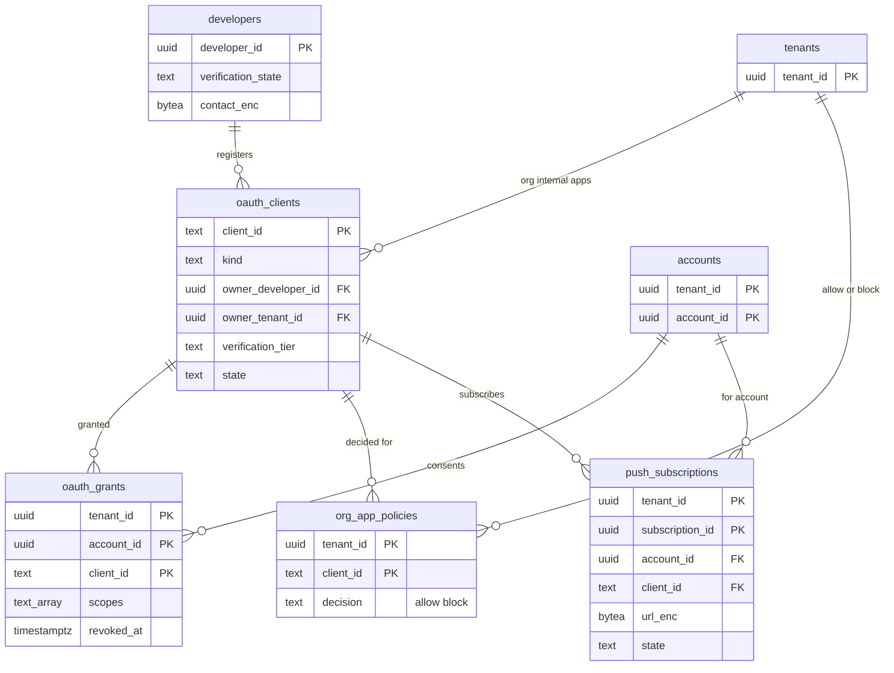

# Data model: 第三者のアプリ・許可・プッシュの購読

[data-model.md](../data-model.md) の一部。規約はそちらの 3 節に従う。振る舞いは [api-and-integrations.md](../api-and-integrations.md)（5〜8 節）を正とする。決定は [ADR-0058](../../decisions/0058-oauth-scopes-and-app-verification.md)（スコープとアプリの確かめ）、[ADR-0059](../../decisions/0059-api-rate-limits-and-third-party-push.md)（速さの上限と第三者へのプッシュ）。トークンの表は [accounts-sessions-and-security.md](accounts-sessions-and-security.md) の 2.3 節。

| 表 | 置き場所 | 書く |
| --- | --- | --- |
| `oauth_clients` | directory `xt`（RLS の外。ADR-0007。中身・アドレスを持たない） | 開発者の画面、アプリの審査の担当、`admin-api`（`org_internal`） |
| `developers` | directory `sys`（テナントに属さない） | 開発者の画面 |
| `oauth_grants`・`org_app_policies` | directory `public` | `accounts`（同意）、`admin-api` |
| `push_subscriptions` | directory `public` | `jmap-api`（`PushSubscription/set`）、`push-notifier`（失敗と停止） |

- 速さの上限の数え（`apirl:`・`imapbw:`）は Valkey（[stores.md](stores.md) の 1 節）。

## 1. ER 図

- `developers ||--o{ oauth_clients`・`tenants ||--o{ oauth_clients`：`third_party` は開発者が、`org_internal` は組織が持つ（どちらか一方。任意の参照）。`first_party`・`known_mail_client`・`device` は本システムが持ち、どちらも NULL。

## 2. 表

### 2.1 `oauth_clients`

| 列 | 型 | NULL | 既定 | 説明 |
| --- | --- | --- | --- | --- |
| `client_id` | `text` | NOT NULL | — | 公開の ID（ランダムな 32 文字） |
| `kind` | `text` | NOT NULL | — | `first_party`・`known_mail_client`・`third_party`・`org_internal`・`device` |
| `owner_developer_id` | `uuid` | NULL | — | |
| `owner_tenant_id` | `uuid` | NULL | — | `org_internal` |
| `name` | `text` | NOT NULL | — | 同意の画面に出す名前 |
| `redirect_uris` | `text[]` | NOT NULL | `'{}'` | 完全一致。ループバック（RFC 8252）は `known_mail_client` だけ |
| `secret_hash` | `bytea` | NULL | — | 機密のクライアントの秘密の SHA-256 |
| `jwks` | `jsonb` | NULL | — | `private_key_jwt` の公開の鍵 |
| `verification_tier` | `text` | NOT NULL | `'unverified'` | `unverified`・`verified`・`assessed` |
| `assessed_until` | `date` | NULL | — | 安全の評価の 12 か月 |
| `allowed_scopes` | `text[]` | NOT NULL | — | 級で許すスコープ |
| `user_count` | `integer` | NOT NULL | `0` | `unverified` の 100 人の上限（開発者のアカウントごとに数える） |
| `state` | `text` | NOT NULL | `'active'` | `active`・`suspended`・`deleted` |
| `created_at`・`updated_at` | `timestamptz` | NOT NULL | `now()` | |

- キー：PK `(client_id)`。索引：`(owner_developer_id)`、`(owner_tenant_id) WHERE owner_tenant_id IS NOT NULL`。
- CHECK：`kind IN (…)`、`verification_tier IN (…)`、`state IN (…)`、`NOT (owner_developer_id IS NOT NULL AND owner_tenant_id IS NOT NULL)`、`kind <> 'org_internal' OR owner_tenant_id IS NOT NULL`。
- RLS：なし（`xt`）。`org_internal` の行の読み書きは、`admin-api` が自分のテナントの条件を付ける（`SECURITY DEFINER` の関数）。S1 の量：数万行。

### 2.2 `developers`

| 列 | 型 | NULL | 既定 | 説明 |
| --- | --- | --- | --- | --- |
| `developer_id` | `uuid` | NOT NULL | `uuidv7()` | |
| `owner_account_id` | `uuid` | NOT NULL | — | 開発者の画面にサインインする本システムのアカウント |
| `legal_name_enc` | `bytea` | NULL | — | 持ち主（法人・個人）の名前 |
| `contact_enc` | `bytea` | NOT NULL | — | 連絡先（列の暗号化。本システムの鍵） |
| `verification_state` | `text` | NOT NULL | `'none'` | `none`・`pending`・`verified`・`rejected` |
| `verified_domain` | `text` | NULL | — | ホームページの所有の確かめ（[ADR-0050](../../decisions/0050-custom-domain-verification-and-dns-checks.md) と同じ TXT） |
| `created_at` | `timestamptz` | NOT NULL | `now()` | |

- キー：PK `(developer_id)`。CHECK：`verification_state IN (…)`。S1 の量：数万行。

### 2.3 `oauth_grants`

| 列 | 型 | NULL | 既定 | 説明 |
| --- | --- | --- | --- | --- |
| `tenant_id`・`account_id` | `uuid` | NOT NULL | — | |
| `client_id` | `text` | NOT NULL | — | |
| `scopes` | `text[]` | NOT NULL | — | 部分の同意の後の許したスコープ |
| `granted_at` | `timestamptz` | NOT NULL | `now()` | |
| `last_used_at` | `timestamptz` | NULL | — | 活動の画面 |
| `revoked_at` | `timestamptz` | NULL | — | 利用者・組織の取り消し（その組の全トークンを失効） |
| `state` | `text` | NOT NULL | `'active'` | `active`・`revoked`・`suspended_pending_review` |

- キー：PK `(tenant_id, account_id, client_id)`。索引：`(tenant_id, client_id) WHERE state = 'active'` — 組織全体の取り消し。
- 保持：取り消しから 1 年。S1 の量：約 300 万行。

### 2.4 `org_app_policies`

| 列 | 型 | NULL | 既定 | 説明 |
| --- | --- | --- | --- | --- |
| `tenant_id` | `uuid` | NOT NULL | — | |
| `client_id` | `text` | NOT NULL | — | |
| `decision` | `text` | NOT NULL | — | `allow`（`allowlist` の方針の一覧）・`block` |
| `decided_by` | `uuid` | NOT NULL | — | |
| `decided_at` | `timestamptz` | NOT NULL | `now()` | |

- キー：PK `(tenant_id, client_id)`。組織の `apps.policy`（`all`・`verified_only`・`allowlist`）と級ごとの禁止は `ou_policies`。S1 の量：数万行。

### 2.5 `push_subscriptions`

JMAP の `PushSubscription`（第三者のサーバーへの webhook）。

| 列 | 型 | NULL | 既定 | 説明 |
| --- | --- | --- | --- | --- |
| `tenant_id`・`subscription_id` | `uuid` | NOT NULL | `subscription_id` は `uuidv7()` | |
| `account_id` | `uuid` | NOT NULL | — | |
| `client_id` | `text` | NOT NULL | — | |
| `device_client_id` | `text` | NOT NULL | — | RFC 8620 の `deviceClientId` |
| `url_enc` | `bytea` | NOT NULL | — | 送り先の URL（列の暗号化。https だけ） |
| `types` | `text[]` | NULL | — | NULL は全部 |
| `keys` | `jsonb` | NULL | — | RFC 8291 の `p256dh`・`auth` |
| `signing_key_enc` | `bytea` | NOT NULL | — | `<Brand>-Signature` の HMAC の鍵（登録の応答で 1 回だけ返す） |
| `verification_code_hash` | `bytea` | NULL | — | |
| `verified` | `boolean` | NOT NULL | `false` | |
| `expires_at` | `timestamptz` | NOT NULL | — | 最長 7 日 |
| `state` | `text` | NOT NULL | `'active'` | `active`・`disabled`・`expired` |
| `failing_since` | `timestamptz` | NULL | — | 24 時間続いたら `disabled` |
| `created_at` | `timestamptz` | NOT NULL | `now()` | |

- キー：PK `(tenant_id, subscription_id)`。索引：`(tenant_id, account_id) WHERE state = 'active'` — 送り先の一覧。`(expires_at)` — X4 の発見の索引（期限の削除）。
- CHECK：`expires_at <= created_at + interval '7 days'` は延長のたびに確かめる（`mailstore` でなく `jmap-api`）。1 クライアント 5・アカウント 50（トリガー）。
- S1 の量：数万行。
